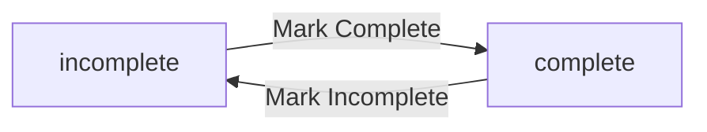
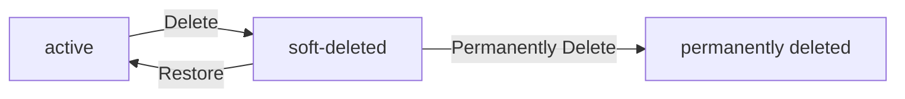
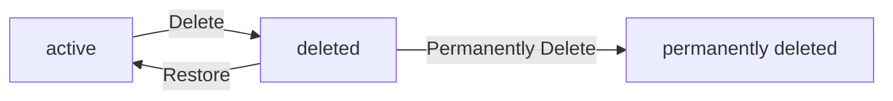
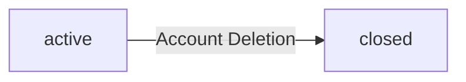

**todoApp — Business concepts, relationships, and states from user perspective**

Business concepts, relationships, and states from user perspective

# Domain Concepts

Describe what each concept means in the business domain and its key attributes.

## User Concept

A user represents an individual person who owns and manages their personal task collection. Each person is identified by a unique email address used for signing up and logging into the application. Users have passwords that protect their account access and can be changed when needed. Each account displays a name that helps the user identify themselves within the system. The application maintains strict privacy boundaries where each person can only access their own account information. A user is the fundamental owner of all created tasks, establishing complete control and exclusive access rights. When a user removes their account, all associated tasks including those in trash are permanently erased. This ownership model ensures that task data remains private with no sharing between different people.

### User Account Identity

A user account represents an individual person who uses the todo application to manage their personal tasks.

Each user account is uniquely identified by an email address. The email address serves as the primary access identifier for signing up and logging into the application. No two user accounts may share the same email address.

Each user account has a password that protects account access. The password is required for signing up and logging in. Users can change their own password when needed.

Each user account displays a name that the user sets for self-identification within the application. Users can edit their own display name.

The application records the account creation date for each user. This date is assigned automatically when the account is first created and cannot be edited by the user.

The user account is the fundamental concept that connects to all other domain entities in the application, serving as the owner of todos and edit history entries.

### Ownership and Privacy Isolation

Each user owns all todos they create. The individual ownership model means that every todo belongs exclusively to one user, with the user having complete control over their own tasks.

Each user serves as a personal task container for all todos, edit history entries, and associated data. All tasks created under an account remain within that account's private boundary.

Users can only access their own todos and account information. There is no mechanism for users to view, access, or interact with content belonging to other users.

This application enforces strict privacy isolation between user accounts. Each person's todo collection is completely private with no sharing, collaboration, or cross-account visibility features.

Users cannot view other users' profiles or account details. This privacy boundary applies to all aspects of the user account, including display names and task contents.

This ownership and isolation model ensures that each user operates in a fully independent workspace with guaranteed data separation from all other users.

### Account Deletion Consequences

Users can delete their own account to remove it from the application permanently.

When a user deletes their account, the action triggers complete removal of all associated data. All todos created by that user are deleted as part of the account deletion process.

The account deletion extends to all todos regardless of their current state. Both active todos and todos currently residing in trash are permanently removed when the account is deleted.

Edit history entries associated with the user's todos are also permanently deleted as a consequence of account deletion.

Account deletion is a final action that removes the user and all related data from the application with no recovery option.

## Todo Concept

A todo represents a single work item or task that a person creates to track their responsibilities. Each task must have a title that identifies what needs to be done. An optional description field allows people to add additional details or notes about the work. Tasks can include a start date indicating when the work should begin. A due date specifies the expected deadline for completing the task. Newly created todos begin in an incomplete state representing pending work that needs attention. Each task belongs exclusively to one person and cannot be viewed by anyone else in the system. When marked as complete, a todo reflects finished work while remaining available in the owner's collection.

### Todo Concept

A todo represents a single work item or task that a person creates to track their responsibilities. Each task must have a title that identifies what needs to be done. An optional description field allows people to add additional details or context about the work. Tasks can include a start date indicating when the work should begin. A due date can be specified to indicate the expected deadline for completing the task. A newly created todo begins in an incomplete state, representing pending work that requires attention from the owner. The completion status can be toggled between incomplete and complete to reflect whether the work has been accomplished. Each todo belongs exclusively to the person who created it. No other person in the system can view, access, or interact with todos they did not create. When a todo is deleted, it enters a soft-deleted state rather than being permanently removed immediately. Deleted todos no longer appear in the normal todo list but remain recoverable and can be restored to their normal active state from the trash collection.

## EditHistory Concept

Edit history represents the complete record of all changes made to a task throughout its lifecycle. Each modification creates a new history entry that captures the moment when the edit occurred. History entries document what each field was changed to, including title updates, description revisions, and date adjustments. The history system tracks changes to all editable aspects of a task including start dates and due dates. Historical records are organized from the most recent modification to the oldest changes. Each edit history belongs exclusively to its associated task and travels with it across different states. When a task is permanently removed from trash, its entire edit history is also deleted. This tracking capability provides visibility into how tasks evolve over time.

### Edit History Tracking

Edit history tracking provides a complete chronological record of all modifications made to a task throughout its lifecycle. Whenever a user edits any aspect of their todo, the system creates a new history entry to capture that specific change. Each history entry documents exactly what was altered, allowing users to trace the evolution of their task over time.

### History Entry Content

Each history entry includes a change timestamp recording that captures exactly when the edit was made. If the title was changed during an edit, a title modification record is captured showing what the title was changed to. If the description was changed, a description update capture is recorded showing what the description was changed to. If the start date was changed, a start date change log is created showing what the start date was changed to. If the due date was changed, a due date adjustment history is recorded showing what the due date was changed to. Fields that were not modified during an edit do not appear in that history entry—only the fields that actually changed are recorded along with the timestamp of when the edit occurred.

### History Ordering and Lifecycle

Edit history entries for a task use a recent-to-oldest ordering, meaning the most recent modification appears first, followed by progressively older changes. Linked edit preservation ensures that the complete edit history belongs exclusively to its associated task and travels with it through its entire lifecycle, including when the task is deleted to trash and restored back to normal status. When a task undergoes a permanent deletion cascade from the trash, its entire edit history is also permanently deleted, ensuring no orphaned history records remain after a user completely erases a task.

# Domain Relationships

Describe how concepts relate to each other from a business perspective.

## Conceptual Relationships

Describe how concepts relate to each other in business terms.

### User-Todo Ownership Relationship

A user has many todos associated with their account. This ownership relationship ensures that each todo belongs to exactly one user who created it. The system enforces this association by restricting visibility and management of todos strictly to their respective owner, ensuring complete privacy between different users.

### Todo-EditHistory Association

A todo has many edit history records associated with it. Every time a todo is modified, a new edit history entry belongs to the todo that was edited. This creates a direct association linking all historical changes to the specific todo they describe.

## Lifecycle and Retention

Describe concept lifecycle states and transitions only. Detailed retention/recovery policies belong in 05-non-functional. Operation details belong in 03-functional-requirements.

### Todo Status Lifecycle

A todo exists in one of two completion states: incomplete or complete.

A newly created todo is incomplete by default.

A user can toggle a todo between incomplete and complete states.

The completion state transition:

The incomplete state represents a todo that has not been finished.
The complete state represents a todo that has been marked as finished.

### Todo Deletion and Recovery Lifecycle

A todo exists in one of three deletion states: active, soft-deleted, or permanently deleted.

A newly created todo is in the active state and appears in the normal todo list.

When a user deletes a todo, it transitions to the soft-deleted state and moves to the trash.

A soft-deleted todo can transition back to the active state through restoration from trash, returning to the normal todo list.

A todo can be permanently deleted from the trash, removing it from the system entirely.

Permanently deleting a todo also permanently deletes its edit history.

The deletion state transition:

The soft-deleted state represents a todo in the trash, retained but removed from the normal list.
The permanently deleted state represents a todo that has been removed from the system with no recovery possible.

# Business Categories and State Flows

Business category classifications and state flow definitions.

## Business Category Definitions

Define all business category classifications with their allowed values and descriptions.

### Primary Business Categories

The application defines three primary business categories that structure the domain model.

**User Category**: Represents an individual account holder who owns and manages todos. Users authenticate via email and password.

**Todo Category**: Represents a task item with scheduling and tracking attributes. Todos are owned by users and contain attributes such as title, description, start date, due date, and completion status.

**EditHistory Category**: Represents a recorded change to a Todo. Each edit history entry belongs to a specific Todo and captures what was modified and when.

These three categories form the core business structure of the application. Users own Todos, and Todos have EditHistory entries.

### Todo Completion Status Type

The Todo business category uses a status-type for tracking task progress. The completion status-type has the following allowed-values:

| Allowed Value | Description |
|---------------|-------------|
| Complete | The task has been finished by the user |
| Incomplete | The task has not yet been finished |

When a todo is created, it defaults to the incomplete state. Users can toggle this status-type between the two allowed-values to reflect changes in task progress. The completion status-type is independent of the todo's schedule dates and represents only whether the user considers the task done.

### Todo Availability Classification

The Todo business category uses a classification for determining list visibility. The availability classification has the following allowed-values:

| Allowed Value | Description |
|---------------|-------------|
| Active | The todo is in normal use and appears in the standard todo list |
| Deleted | The todo has been removed from normal lists and appears only in the trash view |

When a todo is created, it defaults to the active classification. Moving a todo to deleted does not permanently remove it; instead, it changes the classification so the todo is excluded from normal list views. The availability classification can be reversed by restoring the todo back to active status.

## State Transitions

Define valid state transition paths for stateful concepts.

### Completion Status Toggle

A todo begins in an incomplete state when first created.

The completion status transitions between incomplete and complete as a simple toggle. A user can mark an incomplete todo as complete, transitioning it to the complete state. The user can then mark the complete todo as incomplete, transitioning it back to the incomplete state. This toggle behavior allows at any time between the two completion status states.

### Todo Lifecycle States

A todo exists in an active state when created or when restored from trash. While active, the todo appears in the normal todo list with the user.

When a user deletes a todo, it transitions from active state to deleted state. In the deleted state, it no longer appears in the normal list but resides in the trash.

From the deleted state, two paths exist: the user can restore the todo, transitioning it back to the active state and returning to the normal list, or permanently delete it, transitioning to a permanently deleted state where recovery is no longer possible.

### Account Lifecycle States

A user account begins in an active state upon creation. While active, the user can access all todo operations.

When a user deletes their account, it transitions from the active state to a closed state. Upon account closure, all todos owned by the account — including active todos and todos in the deleted state — transition to permanently deleted as part of the account closure.

