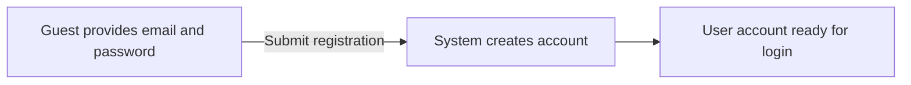
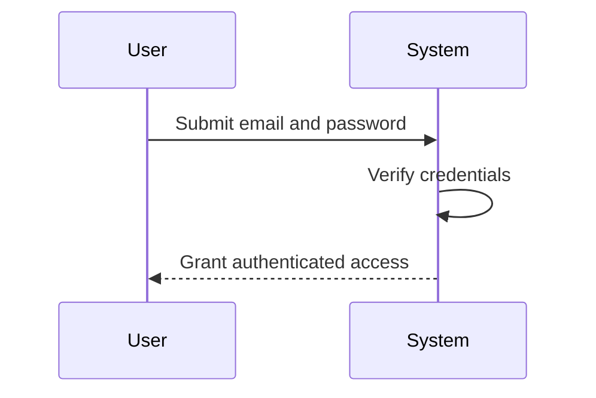
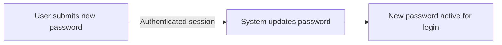
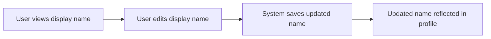
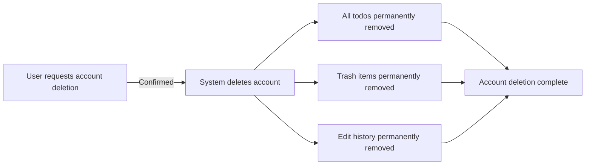

**todoApp — What operations users can perform, use cases, business workflows**

What operations users can perform, use cases, business workflows

# Core Business Operations

What the system must do for each business concept.

## User Operations

Users sign up for an account by providing an email address and a password. After registration, users log into their account using the same email and password. Users have the ability to change their password at any time. Each user maintains a personal profile that includes a display name. Users can edit their display name to update their profile information. Users can permanently delete their account, which results in the removal of all their associated data. When an account is deleted, all of the user's todos are permanently removed from the system. This deletion also extends to any items that were currently stored in the trash. The application enforces strict privacy regarding user accounts. Users are completely isolated and cannot view other users' profiles. There is no ability to access any information about other accounts. All user operations are strictly restricted to the authenticated user's own account data only.

### Account Registration

Users can create a new account by providing an email address and password. The system creates a new user record when registration information is submitted. The registered email serves as the unique account identifier. The registered password is established for future authentication. Upon successful account creation, the user is ready to authenticate and access the application.

### Account Login

Users can authenticate to the application by providing their registered email address and password. The system verifies the provided credentials against the registered account. Successful credential verification grants the user authenticated access. The authenticated session provides access to the user's personal todo workspace. Through the authenticated session, users can perform all user-specific operations.

### Password Change

Users can change their account password while authenticated. The system accepts a new password to replace the current password. Upon successful password change, the system updates the authentication credentials for the account. The new password takes effect immediately for future login attempts. Previous passwords are retired and can no longer be used for authentication.

### Display Name Management

Each user profile contains a display name. Users can view their own display name within their profile. Users can update their display name to a new value at any time. The system saves display name changes immediately upon submission. Users cannot view other users' display names or profile information. All user profile access is restricted to the authenticated user's own profile only. This ensures strict account privacy isolation across the application.

### Account Deletion

Users can permanently delete their own account. Account deletion requires an explicit user action. Upon account deletion, the system permanently removes all todos associated with the user. The system also permanently removes all items currently residing in the user's trash. Edit history for all of the user's todos is permanently deleted as part of the cascade. Account deletion is irreversible and all associated data is removed completely from the system.

## Todo Operations

Users create new todos by providing a title, which is a required field for every entry. Optional fields include a description, a start date, and a due date for scheduling purposes. Newly created todos are automatically marked as incomplete by default. Users can view their todos in a paginated list showing titles, completion status, and dates if set. Viewing a single todo reveals all details, including the full description text. Users toggle between complete and incomplete states to update the completion status. Users can edit the title, description, start date, or due date at any time. When a todo is deleted, it is soft deleted and removed from the normal list. The deleted todo becomes accessible in a separate paginated trash list. Users can view the trash, restore deleted todos back to the normal list, or permanently delete them. Permanently deleting a todo also removes its associated edit history forever. Users can filter the todo list by completion status to show all, only complete, or only incomplete todos. Sorting options include creation date, start date, and due date, with empty dates appearing last.

### Todo Creation

WHEN a user chooses to add a new task, THE todoApp SHALL record a todo entry with a title, which is a required field for every entry.

WHEN a user creates a todo, THE todoApp SHALL allow the user to optionally provide a description, a start date, and a due date.

WHEN a user creates a todo without specifying its completion status, THE todoApp SHALL automatically set its status to incomplete.

IF a user attempts to create a todo without providing a title, THEN THE todoApp SHALL reject the creation request.

### Todo Viewing

WHEN a user views their tasks, THE todoApp SHALL present a paginated list of their todos.

WHEN displaying the paginated list, THE todoApp SHALL show each todo's title, its completion status, and any set start, due, or creation dates.

WHEN a user selects to view a specific todo, THE todoApp SHALL display all details for that todo, including its full description text.

WHEN a todo does not have a start date, due date, or description set, THEN THE todoApp SHALL omit those fields from the detailed view or display them as empty.

### Todo Completion

WHEN a user changes a todo's status, THE todoApp SHALL toggle the completion status between complete and incomplete.

WHEN a user marks a todo as complete, THE todoApp SHALL update its status to complete.

WHEN a user marks a todo as incomplete, THE todoApp SHALL update its status to incomplete.

WHEN the completion status is updated, THE todoApp SHALL reflect this change immediately in the todo's details and the todo list view.

### Todo Editing

WHEN a user modifies an existing todo, THE todoApp SHALL allow the user to edit the title, description, start date, or due date.

WHEN a todo is edited, THE todoApp SHALL automatically record a new entry in the todo's edit history.

WHEN a user edits a todo, THE todoApp SHALL update the todo with the new values provided.

IF a user updates a todo's title, THEN THE todoApp SHALL replace the existing title with the new title.

### Todo Deletion

WHEN a user deletes a todo, THE todoApp SHALL move the todo to the trash rather than permanently removing it.

WHEN a todo is moved to the trash, THE todoApp SHALL remove it from the normal todo list view.

WHEN a user views the trash, THE todoApp SHALL show todos that are currently soft-deleted.

IF a todo is in the trash, THEN THE todoApp SHALL ensure it cannot be viewed in the standard active todo list.

### Trash Management

WHEN a user selects a deleted todo from the trash, THE todoApp SHALL allow the user to view a paginated list of their soft-deleted todos.

WHEN a user chooses to restore a deleted todo, THE todoApp SHALL move the todo back to the normal active list.

WHEN user chooses to permanently delete a todo from the trash, THE todoApp SHALL remove the todo and associated edit history permanently.

IF a user permanently deletes a todo, THEN THE todoApp SHALL not allow any further access to the todo or its history.

### Todo Filtering

WHEN a user applies a filter to their todos, THE todoApp SHALL show only the todos matching the selected completion status.

WHEN a user selects to view all todos, THE todoApp SHALL display todos regardless of their completion status.

WHEN a user selects to view only complete todos, THE todoApp SHALL display only todos marked as complete.

WHEN a user selects to view only incomplete todos, THE todoApp SHALL display only todos marked as incomplete.

### Todo Sorting

WHEN a user sorts their todos by creation date, THE todoApp SHALL order the list from newest first to oldest first, or vice versa.

WHEN a user sorts their todos by start date, THE todoApp SHALL order the list from earliest first to latest first, or vice versa.

WHEN a user sorts their todos by due date, THE todoApp SHALL order the list from earliest first to latest first, or vice versa.

WHEN todos are sorted by a date field and some todos lack that date, THE todoApp SHALL place those todos at the end of the sorted list.

## EditHistory Operations

Each todo maintains a complete edit history tracking all modifications. Every time a user edits a todo, a new history entry is automatically created. Each entry records the exact timestamp when the edit was made. The history documents what specific fields were changed, including title, description, start date, or due date. Users can view the full edit history for any of their own todos. History entries are always sorted from most recent to oldest for quick review. When a todo is permanently deleted from the trash, its entire edit history is also permanently deleted.

### Automatic History Entry Creation

WHEN a user edits a todo, THE system SHALL automatically create a new edit history entry.

THE edit history entry SHALL be created only when at least one field of the todo is changed.

The edit history entry creation is automatic and requires no explicit action from the user beyond performing the edit.

### Edit History Entry Content

WHEN an edit history entry is created, THE system SHALL record the timestamp of when the edit was made.

THE edit history entry SHALL record the new value of the title if the title was changed.

THE edit history entry SHALL record the new value of the description if the description was changed.

THE edit history entry SHALL record the new value of the start date if the start date was changed.

THE edit history entry SHALL record the new value of the due date if the due date was changed.

THE edit history entry SHALL record only the fields that were actually changed during the edit. Fields that were not modified are not included in the history entry.

### View Edit History

WHEN a user views the edit history of a todo, THE system SHALL display the complete edit history for that todo.

Each history entry in the list SHALL display the timestamp of when the edit was made.

Each history entry SHALL display the new value of the title if it was changed.

Each history entry SHALL display the new value of the description if it was changed.

Each history entry SHALL display the new value of the start date if it was changed.

Each history entry SHALL display the new value of the due date if it was changed.

THE edit history SHALL be sorted from most recent to oldest, with the newest entries displayed first.

### Edit History Deletion

WHEN a user permanently deletes a todo from the trash, THE system SHALL permanently delete the todo's associated edit history.

# Error Scenarios and Edge Cases

Business-level error scenarios, edge case coverage, and expected system behaviors for exceptional conditions.

## User Error Scenarios

Users attempting to sign up with an email that is already registered will be blocked from creating a new account and receive an error message indicating the email is taken. Login attempts with incorrect email or password combinations are rejected with a generic authentication failure message, without revealing which field was wrong. When users attempt to change their password, the system validates the new password before accepting the change and rejects requests that do not meet requirements. Deleting a user account triggers a permanent cascade removal of the user profile and all associated todos, including those currently in the trash, with no undo option available. Users attempting to view or access another user's profile or todos receive an access denied error, as the application enforces strict privacy boundaries across all operations. If a user attempts to edit their display name to an empty value, the system rejects the change and requires a valid name to be provided. The account deletion process requires confirmation and warns users that all their data will be permanently lost upon completion.

### #### Registration and Authentication Error Scenarios

When a user attempts to register using an email address that is already associated with an existing account, THE SYSTEM SHALL reject the registration request and display a message indicating duplicate email registration attempts are not allowed.
When a user submits a login request with an incorrect email or password combination, THE SYSTEM SHALL reject the attempt as invalid login credential rejection.
For authentication failure handling, THE SYSTEM SHALL return a generic error message for invalid credentials without revealing whether the email or password was specifically incorrect.

### #### Account Deletion and Data Cascade Scenarios

When a user initiates account deletion, THE SYSTEM SHALL trigger account deletion cascade behavior, permanently removing the user profile along with all associated todos and items currently stored in the trash.
Upon final confirmation of account deletion, THE SYSTEM SHALL execute permanent data loss on account deletion, eliminating all user-owned data without any recovery or undo options.
Before finalizing the deletion process, THE SYSTEM SHALL display an irreversible account deletion warning alerting the user that the action cannot be undone and all personal data will be permanently lost.

### #### Account Management and Access Control Scenarios

When a user attempts to change their password to a value that fails validation, THE SYSTEM SHALL return password change validation errors and reject the update request.
When a user attempts to update their display name to an empty value, THE SYSTEM SHALL enforce display name empty value rejection, requiring the user to provide a valid display name to proceed.
When a user attempts to view or access another user's profile or todo list, THE SYSTEM SHALL enforce access denied privacy enforcement to block the request, ensuring strict privacy boundaries.
When a user attempts to access data restricted to another user, THE SYSTEM SHALL return unauthorized profile access errors, preventing cross-user data visibility.

## Todo Error Scenarios

Creating a todo without providing a title results in a validation error requiring the user to add a title before the todo can be saved. The system accepts todos with empty descriptions, start dates, or due dates since these fields are optional. When viewing todo lists, empty results are handled gracefully with pagination showing zero items rather than causing display errors. Sorting todos by start date or due date automatically places todos without those dates at the end of the list, preserving their position without causing sort failures. Attempting to access, edit, or delete a todo that belongs to another user is blocked with an access denied error, ensuring strict ownership boundaries. Restoring a deleted todo from trash returns it to the active list with all its original data and edit history intact. Permanently deleting a todo from trash immediately removes it and all associated edit history with no recovery option. Filter operations for completion status correctly separate complete and incomplete todos without mixing categories or showing deleted items.

### Todo Creation Validation

IF a user attempts to create a todo without providing a title, THEN THE system SHALL reject the creation and return a validation error requiring a title.

IF a user attempts to create a todo with a blank or whitespace-only title, THEN THE system SHALL reject the creation and require a valid title.

WHEN a user submits a todo with no description provided, THE system SHALL accept the todo creation without error.

WHEN a user submits a todo with an empty start date, THE system SHALL accept the todo creation without error.

WHEN a user submits a todo with an empty due date, THE system SHALL accept the todo creation without error.

### Date Sorting Edge Cases and Empty Results

WHEN a user's filtered or sorted todo list results in zero matching items, THE system SHALL display an empty state gracefully without causing display errors.

WHEN a user sorts their todo list by start date, THE system SHALL place todos without a start date at the end of the sorted list.

WHEN a user sorts their todo list by due date, THE system SHALL place todos without a due date at the end of the sorted list.

WHEN a user sorts by a date field and the list contains a mix of todos with and without that date, THE system SHALL sort todos with dates first and todos without dates last without failing.

### Unauthorized Todo Access Prevention

IF a user attempts to view a todo that belongs to another user, THEN THE system SHALL reject the request with an access denied response.

IF a user attempts to edit a todo that belongs to another user, THEN THE system SHALL reject the request with an access denied response.

IF a user attempts to delete a todo that belongs to another user, THEN THE system SHALL reject the request with an access denied response.

IF a user attempts to restore a todo from trash that belongs to another user, THEN THE system SHALL reject the request with an access denied response.

### Trash Restore and Permanent Deletion

WHEN a user restores a deleted todo from trash, THE system SHALL return the todo to the normal active todo list with all original data intact.

WHEN a user restores a deleted todo from trash, THE system SHALL preserve all edit history entries associated with that todo.

WHEN a user permanently deletes a todo from trash, THE system SHALL immediately remove the todo with no recovery option.

WHEN a user permanently deletes a todo from trash, THE system SHALL also trigger cascade deletion of all associated edit history entries as defined in EditHistory Error Scenarios.

### Completion Status Filter Accuracy and Soft Delete Visibility

WHEN a user filters their todo list for complete todos only, THE system SHALL display only todos marked as complete and exclude incomplete and soft-deleted todos.

WHEN a user filters their todo list for incomplete todos only, THE system SHALL display only todos marked as incomplete and exclude complete and soft-deleted todos.

WHEN a todo is soft deleted, THE system SHALL immediately remove it from the normal todo list.

WHEN a todo is soft deleted, THE system SHALL exclude it from all completion status filters until the todo is restored.

WHEN a todo is soft deleted, THE system SHALL make it viewable only within the trash list.

## EditHistory Error Scenarios

Every edit to a todo automatically creates a new history entry in the system, recording what fields were changed and when the edit occurred. History entries capture only the fields that actually changed during an edit, omitting any fields that remained unchanged from the record. If no fields are actually modified during an edit attempt, no new history entry is created. Users can view the complete edit history of any of their todos, displaying entries sorted from most recent to oldest with newest edits appearing first. If a todo has never been edited, the history view shows an empty list rather than returning an error. Permanently deleting a todo from trash immediately removes all of its associated edit history entries in a single cascade operation. Attempting to view edit history for a todo that has been permanently deleted fails because that data no longer exists in the system. History entries are automatically generated and cannot be manually created or edited by users.

### Automatic History Entry Creation

Every edit to a todo automatically creates a new history entry in the system, recording what fields were changed and when the edit occurred. History entries are generated automatically by the system whenever a user edits any editable field of a todo — the title, description, start date, or due date.

History entries are automatically generated by the system only. Users cannot manually create history entries through any interface or operation. The system prevents users from inserting, editing, or deleting individual history entries.

When a user saves changes to a todo, the system creates exactly one history entry for that edit operation, regardless of how many fields were modified in that single save action. Multiple fields changed in one edit are recorded together in a single history entry rather than splitting them into separate entries.

### Unchanged Field Exclusion

History entries capture only the fields that actually changed during an edit, omitting any fields that remained unchanged from the record. When a user edits a todo, the history entry records the new values only for fields whose values were modified compared to the previous state.

If a user edits only the title of a todo while leaving the description, start date, and due date unchanged, the resulting history entry records only the title change. The unchanged fields are excluded from the history entry rather than showing placeholder values.

If no fields are actually modified during an edit attempt — meaning the user submits the edit form without changing any values — no new history entry is created. The system recognizes that no actual change occurred and suppresses history entry generation for that operation.

### History Sorting and Empty State Handling

Users can view the complete edit history of any of their todos, displaying entries sorted from most recent to oldest with newest edits appearing first. History entries are always displayed in reverse chronological order, with the most recent edit appearing at the top of the list and the earliest edit at the bottom.

If a todo has never been edited after creation, the history view displays an empty list. The system handles this gracefully by showing a message or empty state rather than returning an error. Users can still open the history view for todos with no edit history without encountering a failure.

The sorting order is consistent across all views and cannot be changed by users. The system always presents edit history in newest-to-oldest order regardless of how the main todo list is sorted.

### History Deletion and Trash Visibility

Permanently deleting a todo from trash immediately removes all of its associated edit history entries in a single cascade operation. When a todo is permanently deleted, the history entries linked to that todo are deleted as well — users cannot retain the edit history independently of the todo.

Attempting to view edit history for a todo that has been permanently deleted fails because that data no longer exists in the system. The history view cannot be accessed after permanent deletion since the associated records have been removed.

Deleted todos in trash retain their edit history and remain viewable. Users can still view the full edit history of todos that are soft-deleted and currently in the trash. The edit history is only removed when the todo is permanently deleted from trash, not when it is moved to trash.

# End-to-End User Scenarios

Cross-domain user scenarios that span multiple concepts, describing complete user journeys.

## Cross-Domain User Scenarios

Define end-to-end user scenarios that span multiple concepts, describing complete user journeys from start to finish.

### User Onboarding with Initial Todo Creation

THE user SHALL be able to register a new account, log in, create their first todo, and view it in the todo list as part of a single onboarding flow.

The onboarding flow consists of the following steps:

1. THE user registers with an email address and password, creating a new account
2. THE user logs in with the same email and password
3. THE user creates at least one todo with a required title and optional description, start date, and due date
4. THE user views the todo in their paginated todo list, confirming it appears with the correct title, completion status, start date (if set), due date (if set), and creation date

The system supports this end-to-end flow so that a new user can go from registration to having a functional todo list without interruption.

### Full Todo Lifecycle from Creation to Permanent Deletion

THE user SHALL be able to manage a todo through its complete lifecycle: creation, editing, completion, deletion, restoration, and permanent removal.

The full lifecycle flow consists of the following steps:

1. THE user creates a todo with a title and any optional fields (description, start date, due date)
2. THE user edits the todo's title, description, start date, or due date — each edit generates a history entry recording the changes
3. THE user marks the todo as complete or incomplete as needed, toggling the completion status
4. THE user deletes the todo, which removes it from the normal todo list and moves it to trash
5. THE user views the deleted todo in the paginated trash list
6. THE user either restores the todo (returning it to the normal list) or permanently deletes it from trash (which also removes all associated edit history)

The system supports this complete multi-step journey so that users have full control over todos from creation through permanent removal.

### Multi-Todo Workflow with Filtering and History Review

THE user SHALL be able to create multiple todos, edit them selectively, view edit history, and organize the list using filters and sorting — combining all major features into a consolidated workflow.

The consolidated workflow consists of the following steps:

1. THE user creates multiple todos, each with a required title and optional description, start date, and due date
2. THE user edits one or more todos, and can view the edit history of any todo in newest-to-oldest order to track what changed
3. THE user views the todo list and applies a completion status filter (all, complete only, or incomplete only)
4. THE user sorts the filtered list by creation date (newest or oldest first), start date (earliest or latest first, with todos without a start date at the end), or due date (earliest or latest first, with todos without a due date at the end)
5. THE user accesses individual todo details to view full description and edit history as needed

This multi-step user journey enables users to maintain a well-organized, traceable todo collection using all available system capabilities.

### Batch Todo Management with Trash and Active List Organization

THE user SHALL be able to manage multiple todos by completing and deleting some, restoring previously deleted items, and organizing the remaining active list — a scenario that combines trash management with active list organization.

The trash management flow consists of the following steps:

1. THE user creates several todos and works through them by marking some as complete
2. THE user deletes one or more incomplete or completed todos, which removes them from the normal list and places them in trash
3. THE user views the trash list and restores a deleted todo back to the normal list, preserving its completion status and edit history
4. THE user permanently deletes another todo from trash, which also removes its edit history
5. THE user returns to the normal todo list, filters by completion status, and sorts by desired criteria to continue working on remaining items

This end-to-end scenario allows users to maintain a clean active list while retaining the ability to recover accidentally deleted todos.