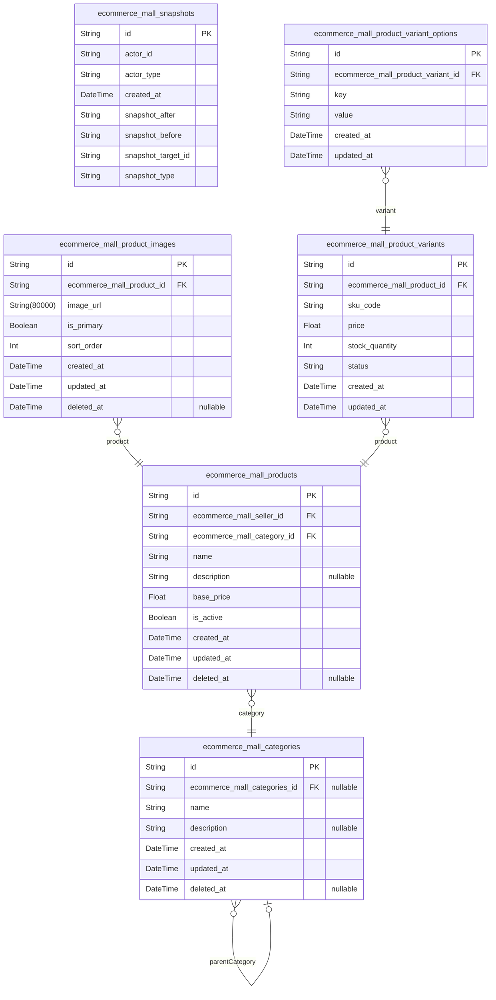
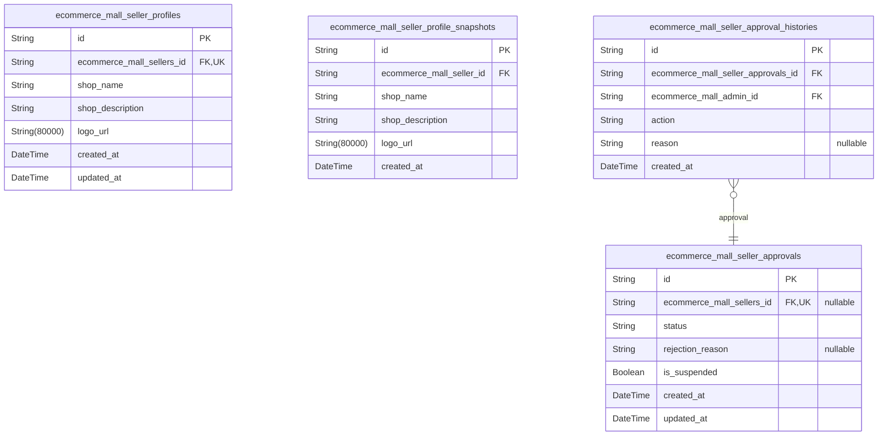
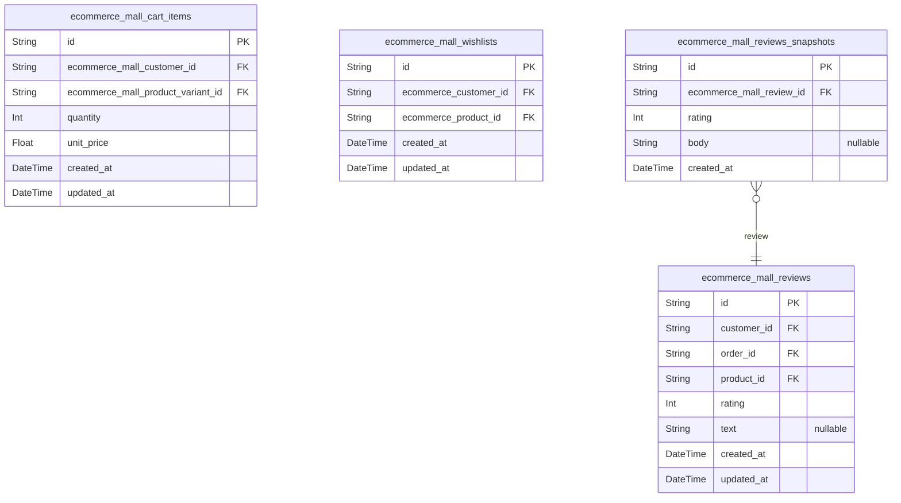
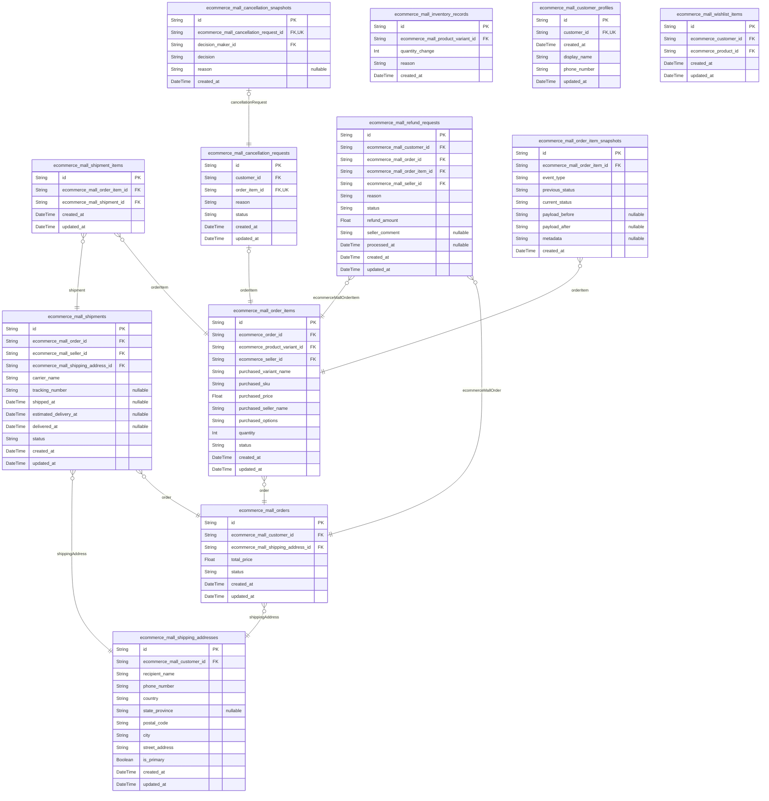
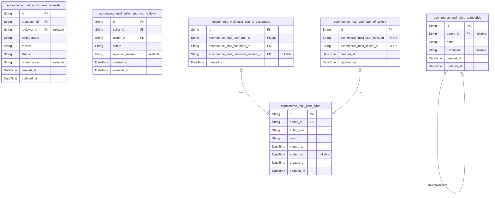

# Prisma Markdown

> Generated by [`prisma-markdown`](https://github.com/samchon/prisma-markdown)

- [ecommerce_mall_auth](#ecommerce_mall_auth)
- [ecommerce_mall_catalog](#ecommerce_mall_catalog)
- [ecommerce_mall_sellers](#ecommerce_mall_sellers)
- [ecommerce_mall_shop](#ecommerce_mall_shop)
- [ecommerce_mall_orders](#ecommerce_mall_orders)
- [ecommerce_mall_admin](#ecommerce_mall_admin)

## ecommerce_mall_auth

```mermaid
erDiagram
"ecommerce_mall_customers" {
  String id PK
  String(320) email UK
  String password_hash
  String status
  DateTime deleted_at "nullable"
  DateTime created_at
  DateTime updated_at
}
"ecommerce_mall_customer_sessions" {
  String id PK
  String ecommerce_mall_customer_id FK
  String(80000) href "nullable"
  String(80000) referrer "nullable"
  String(15) ip
  DateTime created_at
  DateTime expired_at
}
"ecommerce_mall_customer_password_resets" {
  String id PK
  String ecommerce_mall_customer_id FK
  String token UK
  DateTime expired_at
  Boolean used
  DateTime created_at
}
"ecommerce_mall_customer_email_verifications" {
  String id PK
  String customer_id FK "nullable"
  DateTime created_at
  DateTime updated_at
  String(320) email
  String token UK
  DateTime expires_at
}
"ecommerce_mall_sellers" {
  String id PK
  String(320) email UK
  String password_hash
  String shop_handle UK
  Boolean is_verified
  Boolean is_active
  DateTime created_at
  DateTime updated_at
}
"ecommerce_mall_seller_sessions" {
  String id PK
  String ecommerce_mall_seller_id FK
  String(15) ip
  String(80000) href
  String(80000) referrer
  DateTime created_at
  DateTime expired_at
}
"ecommerce_mall_seller_password_resets" {
  String id PK
  String ecommerce_mall_seller_id FK
  String token UK
  DateTime expires_at
  DateTime used_at "nullable"
  DateTime created_at
}
"ecommerce_mall_seller_email_verifications" {
  String id PK
  String ecommerce_mall_seller_id FK
  String(320) email
  String token UK
  Boolean used
  DateTime expired_at
  DateTime created_at
  DateTime updated_at
}
"ecommerce_mall_admins" {
  String id PK
  String(320) email UK
  String password_hash
  String grade
  DateTime deleted_at "nullable"
  DateTime updated_at
  DateTime created_at
}
"ecommerce_mall_admin_sessions" {
  String id PK
  String ecommerce_mall_admin_id FK
  DateTime created_at
  String(80000) referrer "nullable"
  String ip
  String(80000) href
  DateTime expired_at
}
"ecommerce_mall_admin_password_resets" {
  String id PK
  String ecommerce_mall_admins_id FK
  String token UK
  String(15) ip
  String ua
  DateTime created_at
  DateTime expired_at
}
"ecommerce_mall_customer_sessions" }o--|| "ecommerce_mall_customers" : customer
"ecommerce_mall_customer_password_resets" }o--|| "ecommerce_mall_customers" : customer
"ecommerce_mall_customer_email_verifications" }o--o| "ecommerce_mall_customers" : customer
"ecommerce_mall_seller_sessions" }o--|| "ecommerce_mall_sellers" : seller
"ecommerce_mall_seller_password_resets" }o--|| "ecommerce_mall_sellers" : seller
"ecommerce_mall_seller_email_verifications" }o--|| "ecommerce_mall_sellers" : seller
"ecommerce_mall_admin_sessions" }o--|| "ecommerce_mall_admins" : admin
"ecommerce_mall_admin_password_resets" }o--|| "ecommerce_mall_admins" : adminPasswordReset
```

### `ecommerce_mall_customers`

Stores unique identity, authentication credentials, and account lifecycle
states for registered marketplace shoppers.

This table exclusively holds security-sensitive authentication data, such
as email addresses and password hashes. Broader customer profile details,
such as display names and phone numbers, are managed within the
`ecommerce_mall_customer_profiles` entity to ensure strict data
separation.

Customer accounts in this table maintain historical linkage to orders and
reviews even after their profiles have been logically deleted, ensuring
platform integrity and dispute resolution capabilities.

Properties as follows:

- `id`: Unique identifier for the customer account.
- `email`
  > Unique email address utilized for customer account registration, login
  > authentication, and essential platform notifications.
  >
  > Must be unique across the system to ensure singular account access.
- `password_hash`
  > Cryptographically secured hash derived from the customer's login password.
  >
  > System never stores plain text credentials to prevent potential security
  > breaches.
- `status`
  > Lifecycle state governing account authentication and visibility.
  >
  > Includes active for functioning accounts, suspended for restricted access
  > due to policy violations, and deleted for removed profiles.
- `deleted_at`
  > Timestamp indicating when an account was marked for soft deletion.
  >
  > A null value denotes an active or suspended account, while a populated
  > value facilitates temporary recovery before permanent archival of the
  > identity.
- `created_at`
  > Exact timestamp marking the initial creation of the customer account
  > record.
- `updated_at`
  > Most recent timestamp reflecting modifications to core account details
  > such as password changes, status adjustments, or recovery actions.

### `ecommerce_mall_customer_sessions`

JWT session management table for customer access and refresh token
storage during login sessions.

This table strictly isolates security-sensitive authentication events
from core business logic, creating an immutable append-only audit trail.
It enables platform administrators to trace customer login histories,
detect suspicious concurrent logins, and immediately revoke access across
all active platforms if a security compromise is suspected.

Properties as follows:

- `id`: Primary Key.
- `ecommerce_mall_customer_id`
  > Associates this authentication session to the specific customer account
  > that initiated the login. This strict foreign key establishes
  > traceability between active sessions and user profiles for security
  > auditing.
  >
  > [ecommerce_mall_customers](#ecommerce_mall_customers)
- `href`
  > The original web address from which the user navigated to initiate the
  > login process, utilized for traffic analytics.
- `referrer`
  > The immediate web address of the page where the user clicked the login
  > link, tracking user entry points.
- `ip`
  > The IPv4 network address of the client computer that initiated this
  > specific authentication session.
- `created_at`
  > The precise timestamp when the customer successfully authenticated and
  > the session was provisioned.
- `expired_at`
  > The absolute expiration timestamp defining when the session's tokens
  > become invalid to enforce security policies.

### `ecommerce_mall_customer_password_resets`

Stores temporary cryptographic tokens issued for customer account
password recovery via email.

This table serves as the foundational security mechanism for the
platform's account recovery workflow. It issues one-time-use tokens that
are emailed to customers, allowing them to securely update their
credentials. Once a token is consumed or expires, it is automatically
invalidated to prevent replay attacks.

Properties as follows:

- `id`: Primary Key.
- `ecommerce_mall_customer_id`
  > Associates the pending password reset request with the originating
  > customer account.
  >
  > Every request must be tied to an authenticated user identity to ensure
  > security compliance. A customer may have multiple pending reset tokens
  > concurrently, but only one active usage at a time.
- `token`
  > The cryptographic string utilized by the backend to verify the customer's
  > email access during the recovery workflow.
  >
  > This value is sent directly to the user's registered email address via a
  > secure link. Upon successful credential replacement, the system marks the
  > token as consumed, preventing any subsequent replay attacks or
  > unauthorized password changes.
- `expired_at`
  > The absolute deadline after which the reset token is considered legally
  > invalid.
  >
  > Enforcing a strict expiration window mitigates the security risks
  > associated with leaked or intercepted recovery links. The authentication
  > service automatically rejects token submissions that occur after this
  > timestamp.
- `used`
  > A boolean status flag indicating whether the temporary token has been
  > successfully consumed.
  >
  > When the user navigates the recovery link and submits their new password,
  > this flag is toggled to true, permanently revoking the token's validity
  > and rendering it unusable for future authentication attempts.
- `created_at`
  > The timestamp marking the initial issuance of the reset token.
  >
  > Used for calculating the age of the request and auditing the password
  > recovery timeline.

### `ecommerce_mall_customer_email_verifications`

Temporary token repository for validating customer email addresses during
the account registration process.

This table bridges the gap between identity creation and account
validation. It stores the target email address, a one-time verification
token, and its expiration window. Once verified, the record is linked to
the newly created [ecommerce_mall_customers](#ecommerce_mall_customers) account.

Properties as follows:

- `id`
  > Primary key for the email verification record, automatically generated on
  > creation.
- `customer_id`
  > References the account associated with this verification record. This
  > field is populated via application logic immediately following successful
  > email confirmation, linking the temporary token to the permanent
  > identity.
- `created_at`: Timestamp indicating when this verification request was issued.
- `updated_at`: Timestamp of the most recent modification to this verification record.
- `email`: The destination email address targeted by the verification token.
- `token`
  > The cryptographic or alphanumeric code dispatched to the user's email
  > inbox for validation.
- `expires_at`
  > The exact timestamp after which the verification token is invalidated and
  > cannot be used.

### `ecommerce_mall_sellers`

Actor table representing registered seller business accounts on the
ecommerceMall platform, storing authentication credentials and
public-facing identifiers. This table serves as the foundation for seller
login, authentication, and account management workflows, while the
seller's approval lifecycle and storefront metadata are managed in
sibling tables. Sellers are strictly prohibited from listing products or
interacting with the catalog until their approval record is in an
approved state.

The `shop_handle` field provides a public URL-safe alias for the seller's
storefront, distinct from the login email. Authentication is managed via
email and password_hash, with email verification tracked by
`is_verified`. Account suspension is controlled through `is_active`.

Properties as follows:

- `id`: Primary key for seller account identification.
- `email`
  > Unique email address used for seller authentication and platform
  > communication. Serves as the primary login credential.
- `password_hash`
  > Bcrypt-hashed password storing the seller's authentication credential.
  > Never stores plaintext passwords.
- `shop_handle`
  > Unique public-facing alias for the seller's storefront. Used in
  > storefront URLs and public profiles to distinguish the seller from other
  > marketplace participants.
- `is_verified`
  > Indicates whether the seller has completed email verification during
  > registration. Prevents platform usage until the email is confirmed via
  > verification tokens.
- `is_active`
  > Controls account suspension state. Admins can set this to false to
  > suspend a seller, preventing shop access and product modifications.
- `created_at`: Timestamp of seller account creation.
- `updated_at`: Timestamp of the most recent seller account modification.

### `ecommerce_mall_seller_sessions`

JWT session management table for seller access and refresh token storage
during shop management sessions.

This model records active and expired authentication sessions when a
seller logs into the platform. It tracks essential session metadata
including the originating client IP address, the initial request URL, and
the referring webpage at the time of login. The strict expiration window
defined by `expired_at` governs the validity of the token.

All session data maintains a direct, non-nullable relationship with the
primary [ecommerce_mall_sellers](#ecommerce_mall_sellers) actor, enabling administrators to
audit login history or revoke sessions if account security is
compromised.

Properties as follows:

- `id`: Primary key for the authentication session record.
- `ecommerce_mall_seller_id`
  > References the [ecommerce_mall_sellers](#ecommerce_mall_sellers) account that initiated or
  > owns this authentication session.
  >
  > Ensures a strict 1:N relationship where a single seller can possess
  > multiple concurrent or historical sessions.
- `ip`
  > The originating IPv4 address of the seller's client during session
  > creation. Useful for session anomaly detection and security auditing.
- `href`: The initial URL requested by the seller when the session was established.
- `referrer`
  > The immediate web address from where the seller transitioned to the login
  > page or session initialization endpoint.
- `created_at`
  > The precise UTC timestamp marking when the authentication session was
  > officially instantiated. Required on all session records.
- `expired_at`
  > The absolute UTC timestamp defining when the JWT token or session record
  > will be considered invalid. Session management relies on this value for
  > automatic token revocation.

### `ecommerce_mall_seller_password_resets`

Temporary token repository and expiration tracking for seller password
reset email requests.

This table stores generated cryptographic tokens required to verify a
seller's identity before allowing them to change their password. Each
record is strictly bound to a specific seller and automatically becomes
invalid once the expiration timestamp passes or the token is successfully
redeemed in a password change flow.

Properties as follows:

- `id`: Primary Key.
- `ecommerce_mall_seller_id`
  > References the associated seller account initiating the password reset
  > request.
  >
  > Establishes a strict one-to-many relationship where a single seller may
  > have multiple pending password reset attempts at any time.
- `token`
  > Unique cryptographic hash generated for the password reset email.
  >
  > Used to validate the user's access to the password change endpoint.
  > Uniquely enforced to prevent collision attacks.
- `expires_at`
  > Timestamp indicating when this password reset token will expire and
  > become invalid.
  >
  > Enforced by backend validation before allowing any account modifications.
- `used_at`
  > Timestamp recording when this token was successfully utilized to update a
  > seller's password.
  >
  > Remains null while the token is still active and available.
- `created_at`: Timestamp recording when this password reset request was initiated.

### `ecommerce_mall_seller_email_verifications`

Temporary token repository for validating seller email addresses during
business registration and approval.

This table stores verification tokens issued when a seller account is
registered or when a seller updates their email. Each token is
time-limited and can only be used once to confirm the seller's email
ownership.

After a token is successfully used or expires, it is marked as invalid
and remains in the table for audit purposes.

Properties as follows:

- `id`: Primary key for the email verification record.
- `ecommerce_mall_seller_id`
  > The seller account whose email address is being verified.
  >
  > Links the verification token to a specific seller registered in the
  > authentication system.
- `email`
  > The email address that requires verification.
  >
  > This is the email the seller owns and wants to confirm. The system sends
  > a verification email to this address.
- `token`
  > Cryptographically secure verification token.
  >
  > Sent to the seller via email. The seller submits this token to validate
  > their email ownership.
- `used`
  > Indicates whether the verification token has been consumed.
  >
  > Once a token is used to verify an email, this flag is set to true. Used
  > tokens cannot be reused.
- `expired_at`
  > Timestamp after which the verification token is no longer valid.
  >
  > Tokens are typically valid for a limited period to prevent misuse of
  > stale tokens.
- `created_at`: Timestamp when the verification token was issued.
- `updated_at`
  > Timestamp of the last record update.
  >
  > Updated whenever the token's usage status changes, such as when a token
  > is marked as used.

### `ecommerce_mall_admins`

Platform administrator accounts storing email credentials, grade levels,
and elevated permission scopes. Administrators use this table for
platform oversight, managing sellers, moderating content, and reviewing
user escalation requests.

This table manages the lifecycle of admin identities, ensuring secure
authentication via email and password-hashed credentials. The grade
attribute defines the permission tier (e.g., 'regular', 'super') to
support hierarchical role-based access control (RBAC) within the platform
management systems.

Properties as follows:

- `id`: Primary key for the administrator account.
- `email`
  > The unique email address used for platform administration login and
  > account identity.
- `password_hash`
  > Cryptographically hashed password used for authenticating administrator
  > access.
- `grade`
  > The authorization level assigned to the administrator determining their
  > operational scope and permitted actions on the platform.
- `deleted_at`
  > Timestamp marking when the administrator account was logically
  > deactivated or deleted.
- `updated_at`
  > Timestamp recording the last modification time of the administrator
  > account data.
- `created_at`
  > Timestamp recording the exact time the administrator account was
  > initially created.

### `ecommerce_mall_admin_sessions`

JWT session management table for administrator access and refresh token
storage during platform oversight sessions.

This table tracks active or expired sessions for platform administrators,
recording login metadata such as client IP address, request origin, and
referrer. By associating sessions with specific admin accounts, the
platform can enforce session limits, detect unauthorized access, and
programmatically invalidate sessions for security compliance.

Properties as follows:

- `id`: Primary Key.
- `ecommerce_mall_admin_id`
  > Associates the session with a specific platform administrator account.
  >
  > Links to the [ecommerce_mall_admins](#ecommerce_mall_admins) actor table, enabling session
  > tracking per admin. This allows the system to manage multiple concurrent
  > sessions per administrator while maintaining a clear audit trail of login
  > activity.
- `created_at`
  > The timestamp indicating when the session was established.
  >
  > Records the exact moment of administrator login for session lifespan
  > verification.
- `referrer`
  > The upstream URL that directed the administrator to the authentication
  > endpoint.
  >
  > Optional field providing context about the navigation path leading to the
  > login action. Can be null if the request lacked referrer headers.
- `ip`
  > The client IP address where the session was originated.
  >
  > Used for identifying the geographic and network origin of administrator
  > logins, supporting security auditing and anomaly detection.
- `href`
  > The direct URL or route from which the session was initiated.
  >
  > Captures the exact endpoint (e.g., /admin/login) used for authentication,
  > helping trace how administrators gained access to the platform.
- `expired_at`
  > The timestamp when the session's JWT token or refresh token becomes
  > invalid.
  >
  > Used by the system to programmatically enforce session timeout and
  > terminate administrator access for security compliance.

### `ecommerce_mall_admin_password_resets`

Temporary token repository and expiration tracking for administrator
password reset email requests.

Stores secure recovery tokens with strict expiration and request origin
auditing. Append-only records of requests.

Properties as follows:

- `id`: Unique identifier for the password reset request.
- `ecommerce_mall_admins_id`: Links to the admin initiating the recovery flow.
- `token`: Unique reset token sent to the admin's email.
- `ip`: IP address of the connection initiating the password reset.
- `ua`: User-Agent string of the connection initiating the password reset.
- `created_at`: Timestamp when the password reset request was created.
- `expired_at`: Timestamp when the password reset token expires.

## ecommerce_mall_catalog

### `ecommerce_mall_categories`

Hierarchical marketplace groupings allowing parent-child relationships
for catalog navigation.

Categories facilitate a strict two-level hierarchy where subcategories
reference their parent via the ecommerce_mall_categories_id foreign key.
This structure is strictly enforced to prevent overly deep nesting while
enabling efficient product filtering within {@link
ecommerce_mall_products} and storefront browsing.

The table supports soft deletes to maintain historical integrity during
product catalog restructuring. Administrators exclusively create and
manage these groupings, ensuring that taxonomy adjustments do not disrupt
active checkout transactions or order fulfillment processes.

Properties as follows:

- `id`: Primary Key.
- `ecommerce_mall_categories_id`
  > Reference to the parent category.
  >
  > For top-level root categories without a parent, this field remains null.
  > Establishing this self-referencing relationship allows the catalog to
  > expand hierarchically without creating circular dependencies outside the
  > table.
- `name`
  > The name of the category displayed in navigation menus and product
  > filters.
- `description`: Optional text providing details about the category's purpose or contents.
- `created_at`: Timestamp indicating when the category record was created.
- `updated_at`: Timestamp indicating when the category details were last modified.
- `deleted_at`
  > Timestamp marking the category for soft deletion, preserving historical
  > references during product catalog audits.

### `ecommerce_mall_products`

Marketplace product listings including base name, description, pricing,
and seller association.

This table represents the core catalog entries that sellers can create,
edit, manage, and remove. It establishes the primary relationship between
a seller and their offerings while categorizing products for storefront
navigation. Each record is designed to trigger snapshot history tracking
upon every modification to maintain an immutable audit trail for dispute
resolution.

Properties as follows:

- `id`: Unique identifier for the product.
- `ecommerce_mall_seller_id`
  > References the seller who owns this product listing.
  >
  > Establishes the fundamental ownership relationship, ensuring that only
  > authorized sellers can manage their own product data. Products are
  > automatically removed from the marketplace storefront when a seller
  > account is deactivated or deleted.
- `ecommerce_mall_category_id`
  > References the hierarchical category to which this product belongs.
  >
  > Enables storefront navigation and browsing capabilities by linking
  > products to the platform's taxonomy. Categories support subcategories,
  > allowing for structured catalog organization and filtering.
- `name`
  > The official display title of the product.
  >
  > Optimized for full-text search capabilities, allowing customers to
  > quickly locate items. It should be concise yet descriptive to optimize
  > storefront usability and search algorithm precision.
- `description`
  > Detailed textual description of the product, including features,
  > specifications, and usage instructions.
  >
  > Supports flexible data types to accommodate rich formatting. This field
  > is mutable and triggers history tracking when modified to preserve
  > accurate product information for past orders.
- `base_price`
  > The default monetary value of the product before any variant-specific
  > pricing adjustments.
  >
  > Acts as the baseline for storefront display and price-range filtering.
  > Actual selling prices may be overridden by specific {@link
  > ecommerce_mall_product_variants}.
- `is_active`
  > Defines the storefront visibility status of the product.
  >
  > When set to false, the product is hidden from browse, search, and
  > category views but remains in the database for historical and audit
  > purposes. Automatically enforced upon product removal operations.
- `created_at`
  > Timestamp recording when the product listing was initially created.
  >
  > Required for chronological ordering and sorting operations across the
  > marketplace catalog.
- `updated_at`
  > Timestamp recording the most recent modification time of the product
  > listing.
  >
  > Automatically updated on every record mutation, enabling efficient
  > tracking of active changes.
- `deleted_at`
  > Timestamp recording when the product was soft-deleted by the seller or
  > administrator.
  >
  > Enables graceful removal from public listings while preserving historical
  > reference data and associated snapshots.

### `ecommerce_mall_product_images`

Stores multiple image attachments for marketplace products, designating
one image as the main thumbnail for list views while preserving
historical image states for snapshot auditing.

This model enables sellers to manage a gallery of product photos,
ensuring that primary images serve as system-wide thumbnails for browsing
and search. Image changes are linked to the parent {@link
ecommerce_mall_products} via the foreign key, and every creation or
deletion is captured as an immutable record in the {@link
ecommerce_mall_snapshots} table for dispute resolution and historical
auditing.

Properties as follows:

- `id`: Primary Key.
- `ecommerce_mall_product_id`
  > Links the image asset to its parent marketplace product, enforcing that
  > images are managed exclusively through the product catalog. Every image
  > modification or removal is audited by creating a corresponding entry in
  > the [ecommerce_mall_snapshots](#ecommerce_mall_snapshots) table.
- `image_url`: The direct URL or HTTP/HTTPS link to the hosted image asset.
- `is_primary`
  > Designates the image as the main thumbnail displayed in product listings
  > and search result cards.
- `sort_order`
  > Assigns the visual priority of the image within the product gallery,
  > ensuring the primary thumbnail appears first during catalog browsing.
- `created_at`: Timestamp when the image record was initially created in the database.
- `updated_at`: Timestamp of the most recent modification to this image record.
- `deleted_at`
  > Timestamp when the image was soft-deleted by the seller. Retains the
  > record in the database to preserve catalog history and allow audit
  > recovery.

### `ecommerce_mall_product_variants`

Stock-keeping-unit configurations containing specific options, SKUs,
availability status, and price overrides.

Each distinct product variation functions as an independently orderable
unit with its own inventory count and pricing, while logically belonging
to its parent product defined by [ecommerce_mall_products](#ecommerce_mall_products).

Properties as follows:

- `id`: Primary Key.
- `ecommerce_mall_product_id`
  > Identifies the parent product listing this variant belongs to.
  >
  > Variants are strictly managed through [ecommerce_mall_products](#ecommerce_mall_products) and
  > cannot exist independently as they represent distinct permutations of the
  > parent item.
- `sku_code`
  > Unique stock-keeping-unit code identifying this specific variant across
  > the catalog.
  >
  > Sellers use this alphanumeric identifier for inventory tracking and order
  > fulfillment, ensuring it is unique within the context of its parent
  > [ecommerce_mall_products](#ecommerce_mall_products).
- `price`
  > Monetary price assigned specifically to this variant, overriding the
  > parent product's base price when a specific variant requires a cost
  > adjustment for options or material differences.
- `stock_quantity`
  > Current available quantity of this specific variant in the warehouse.
  >
  > Automatically decremented upon successful order placement and restored
  > during cancellations or refunds via {@link
  > ecommerce_mall_inventory_records}.
- `status`
  > Defines the current availability status of the variant (e.g., available,
  > unavailable).
  >
  > Directly impacts the visibility of the variant in product search results
  > and prevents adding out-of-stock variants to carts.
- `created_at`: Timestamp recording when this variant configuration was initially created.
- `updated_at`
  > Timestamp recording the most recent modification to this variant's
  > configuration, price, or stock levels.

### `ecommerce_mall_snapshots`

Immutable audit ledger capturing point-in-time state transitions for
high-value product catalog, storefront, and transactional entities.

Logs exact "before" and "after" values whenever core commerce records are
modified, ensuring complete data lineage and enabling full historical
reconstruction for post-purchase buyer protection disputes.

All entries are appended sequentially without modification or deletion,
maintaining a permanent and unalterable historical record of platform
interactions and state evolutions.

Properties as follows:

- `id`: Primary Key.
- `actor_id`
  > Records the unique identifier of the merchant or customer who triggered
  > the snapshot event, acting as the initiating authority for the recorded
  > state transition.
  >
  > This reference identifies the specific user responsible for the catalog
  > update, review modification, or cancellation request without imposing
  > rigid relational boundaries across different authentication domains.
- `actor_type`
  > Specifies the precise role classification of the user who initiated the
  > snapshot, distinguishing between platform customers, approved sellers,
  > and site administrators.
  >
  > This classification ensures that the audit trail accurately reflects
  > which operational branch triggered the change, supporting granular
  > accountability tracking for compliance purposes.
- `created_at`
  > Marks the exact timestamp at which the state transition was permanently
  > logged into the append-only audit ledger, providing strict chronological
  > ordering for sequential review and reporting.
- `snapshot_after`
  > Captures the JSON-formatted structural representation of the entity's
  > data immediately following the modification event.
  >
  > This post-modification payload reflects the definitive new business state
  > while maintaining full traceability back to the previous record through
  > the immutable historical chain.
- `snapshot_before`
  > Stores the JSON-formatted structural representation of the entity's data
  > immediately prior to the modification event.
  >
  > This pre-modification snapshot preserves legacy values required for
  > comprehensive historical review, enabling side-by-side comparisons
  > against the updated record for dispute resolution and compliance
  > auditing.
- `snapshot_target_id`
  > Acts as a polymorphic foreign reference pointing to the primary key of
  > the specific entity record affected by the state change, avoiding strict
  > relational constraints across isolated domain components.
  >
  > This flexible reference enables a single audit table to track
  > modifications across multiple interconnected business entities without
  > requiring separate snapshot tables for each model.
- `snapshot_type`
  > Identifies the specific commerce entity class being versioned, ensuring
  > accurate classification for downstream audit lookups and filtering.
  >
  > Supported classifications include products, product variants, seller
  > profiles, reviews, order items, and transactional request records.

### `ecommerce_mall_product_variant_options`

Stores individual attribute key-value pairs for product variants to
strictly enforce First Normal Form (1NF) normalization.

Each record captures a single option attribute and its associated
specific value, decoupling complex JSON-based variant configurations into
highly queryable, normalized rows. This design supports flexible
attribute expansion across the catalog without requiring schema
migrations, while ensuring optimal indexing performance for variant
discovery.

A composite unique constraint enforces that each variant maintains only
one instance of a particular key-value combination, preventing duplicate
or conflicting attribute assignments.

Properties as follows:

- `id`: Primary key uniquely identifying each variant attribute option record.
- `ecommerce_mall_product_variant_id`
  > Foreign key linking this option record to its parent product variant.
  >
  > Establishes the exclusive parent-child relationship where variants
  > aggregate their available options. Foreign key mutations are managed
  > exclusively through the parent `ecommerce_mall_product_variants` table to
  > maintain referential integrity.
- `key`
  > The specific attribute name representing the option category (e.g.,
  > 'Size', 'Color', 'Material').
  >
  > Defines the structural dimension for the variant option, allowing
  > multiple distinct options to be queried independently.
- `value`
  > The specific attribute value (e.g., 'Large', 'Red', '100% Cotton').
  >
  > Stores the atomic option value paired with its corresponding key,
  > enabling efficient filtering and full-text search indexing across the
  > catalog.
- `created_at`
  > Timestamp recording when this variant option record was initially created
  > in the database.
- `updated_at`
  > Timestamp recording the last time this specific variant option record was
  > modified or updated.

## ecommerce_mall_sellers

### `ecommerce_mall_seller_approvals`

Table that tracks the overall lifecycle and status of a seller's
registration application for the e-commerce platform.

Records the progression from initial application to final administrative
decisions. Maintains key state flags such as the vetting status (pending,
approved, rejected) and suspension states. This table acts as the central
hub for onboarding merchants, ensuring all registrations undergo the
required platform review process before becoming active sellers.

Properties as follows:

- `id`: Primary Key.
- `ecommerce_mall_sellers_id`
  > References the e-commerce seller account that this registration
  > application is attempting to activate or manage.
  >
  > Forces a strict 1:1 relationship where a single seller identity is
  > associated with at most one active or recent approval request. This
  > prevents duplicate applications for the same merchant and ensures a
  > single source of truth regarding the seller's onboarding status.
- `status`
  > The current vetting status of the seller's application.
  >
  > Tracks the administrative progression of the registration request,
  > typically moving from "pending" through a review phase. Final states
  > include "approved" (ready for active selling) or "rejected" (denied by
  > platform administrators).
- `rejection_reason`
  > The detailed reason provided by the administrator if the seller's
  > registration application was rejected.
  >
  > Captures the feedback loop between the platform's governance system and
  > the merchant. This field is null until a rejection occurs, and ensures
  > sellers understand the specific compliance or policy reasons for the
  > denial.
- `is_suspended`
  > A boolean flag indicating if the seller's account or registration has
  > been temporarily suspended.
  >
  > Applied by administrators to halt a seller's activity or block further
  > reviews if the platform detects policy violations or suspicious behavior
  > during the approval process.
- `created_at`
  > The timestamp recording when the application request was initially
  > created.
  >
  > Tracks the entry point of the registration process, indicating how long
  > an application has spent in the queue or under active review.
- `updated_at`
  > The timestamp recording the last update to any application metadata or
  > state changes.
  >
  > Tracks the chronological progression of the request, helping
  > administrators determine the recency of recent status transitions or
  > administrative actions.

### `ecommerce_mall_seller_profiles`

Storefront metadata representing the public-facing identity of a seller
on the marketplace.

Stores the shop name, descriptive details, and logo image URL that
customers browse when viewing seller pages.

Linked exclusively to one `ecommerce_mall_sellers` account via a 1:1
relationship.

Properties as follows:

- `id`: Primary Key.
- `ecommerce_mall_sellers_id`
  > Links the storefront profile to the corresponding seller authentication
  > account.
  >
  > Enforces a strict 1:1 relationship ensuring one profile per registered
  > seller.
- `shop_name`
  > The official business name displayed publicly on the seller's storefront.
  >
  > Used for storefront navigation and category search results.
- `shop_description`
  > A free-text description of the seller's business or product offerings.
  >
  > Displayed prominently on the storefront for customer discovery.
- `logo_url`
  > URI to the primary shop logo image file.
  >
  > Rendered on storefront headers and catalog search results.
- `created_at`: Timestamp when the storefront profile was first created.
- `updated_at`
  > Timestamp of the most recent storefront metadata modification.
  >
  > Tracks changes prior to the snapshot log.

### `ecommerce_mall_seller_profile_snapshots`

Immutable audit records capturing the state of a seller profile at the
time of every storefront edit for dispute resolution and historical
auditing.

By capturing the exact shop name, shop description, and logo URL before
any administrative or merchant changes occur, the platform can
objectively verify what information was publicly displayed during a
specific period. This ensures full transparency in customer-seller
interactions and resolves potential disputes regarding storefront
modifications or branding.

This append-only ledger tracks the chronological evolution of merchant
storefronts, enabling platform administrators and customers to review the
complete history of profile updates without altering the original
business records.

Properties as follows:

- `id`
  > Primary key for unique identification of each profile state record.
  >
  > Used internally to index immutable snapshots efficiently without relying
  > on timestamps or business attributes.
- `ecommerce_mall_seller_id`
  > Reference to the seller whose storefront details are being permanently
  > recorded in this snapshot.
  >
  > This foreign key maps the immutable historical record back to the active
  > `ecommerce_mall_sellers` account, preserving the lineage between the
  > business owner and their verified storefront history.
- `shop_name`
  > The public display name of the storefront as captured at the moment of
  > this snapshot.
  >
  > Freezing the shop name guarantees that historical data reflects the exact
  > branding customers interacted with, preventing retrospective disputes
  > over past store identities.
- `shop_description`
  > The detailed business description associated with the storefront at the
  > time of this snapshot.
  >
  > Storing the exact description text allows the system to audit marketing
  > claims, service terms, or business information that were active during
  > any recorded historical interval.
- `logo_url`
  > The web address pointing to the storefront's official branding image as
  > configured when this snapshot was generated.
  >
  > Persisting the URI ensures that the visual identity and assets displayed
  > to customers at that specific point in time are permanently retrievable
  > for verification.
- `created_at`
  > Timestamp recording the exact moment this specific storefront iteration
  > was securely locked as part of the historical ledger.
  >
  > Acts as the definitive point-in-time marker for chronological auditing,
  > dispute resolution, and reconstructing sequential storefront evolution.

### `ecommerce_mall_seller_approval_histories`

Immutable audit table capturing administrative actions on seller
approvals, such as approval, rejection, or suspension. Links actions to
specific seller approval requests and the responsible administrators.

This table serves as a permanent ledger of all approval decision reviews,
ensuring full transparency for seller account lifecycle management. Each
new administrative action creates a new record in this history log
without altering previous entries.

Properties as follows:

- `id`: Primary Key.
- `ecommerce_mall_seller_approvals_id`
  > The seller approval request entry that this administrative action was
  > performed on.
  >
  >
  > Links the history step back to the actual seller account registration or
  > status review being acted upon.
- `ecommerce_mall_admin_id`
  > The administrator who executed this action.
  >
  >
  > Identifies the platform staff member (admin) responsible for the
  > approval, rejection, or suspension decision recorded in this audit log.
- `action`: The specific administrative action performed on the seller's status.
- `reason`
  > Optional text explaining the reason for the administrative action,
  > commonly used for rejection notices.
- `created_at`
  > Timestamp of when this administrative action was recorded in the audit
  > log.

## ecommerce_mall_shop

### `ecommerce_mall_cart_items`

Tracks shopping cart line items containing variant references,
quantities, and prices at time of addition.

This table manages the individual line items within a customer's shopping
cart. Each record represents a specific product variant added to the
cart, capturing the quantity selected and the exact unit price at the
moment of addition. The design enforces a maximum of one line item per
variant per customer to allow for easy quantity adjustments instead of
duplicate entries.

Properties as follows:

- `id`: Primary Key.
- `ecommerce_mall_customer_id`
  > Links the cart item to the customer who added it to their cart.
  >
  > Every line item must belong to a specific authenticated customer account
  > to ensure cart data is isolated and correctly associated with the user
  > during checkout.
- `ecommerce_mall_product_variant_id`
  > References the specific product variant (SKU) selected for this cart line.
  >
  > Ensures that customers can only add valid, existing product variants to
  > their shopping cart.
- `quantity`
  > The number of units of the selected variant placed in the cart.
  >
  > Users can add items multiple times, but the system merges them into a
  > single record with an incremented quantity count rather than creating
  > duplicate rows.
- `unit_price`
  > The exact price of the product variant at the time it was added to the
  > cart.
  >
  > Storing this historical price prevents discrepancies if the product price
  > changes later, ensuring the customer is charged the amount they agreed to
  > during checkout.
- `created_at`: Timestamp indicating when this line item was initially added to the cart.
- `updated_at`
  > Timestamp tracking the last modification made to this cart line, such as
  > quantity adjustments.

### `ecommerce_mall_wishlists`

Stores customer bookmarked products allowing them to save items for
future purchase consideration.

The table serves as a mapping between [ecommerce_mall_customers](#ecommerce_mall_customers)
and [ecommerce_mall_products](#ecommerce_mall_products). It ensures that each customer can
bookmark a specific product only once by implementing a composite unique
constraint on the customer and product foreign keys.

Properties as follows:

- `id`: Primary key for the wishlist entry.
- `ecommerce_customer_id`
  > Identifier linking to the authenticated [ecommerce_mall_customers](#ecommerce_mall_customers)
  > who bookmarked the product.
  >
  > A customer cannot have duplicate entries for the same product. If a
  > customer account is deleted, all associated wishlist entries are
  > automatically removed.
- `ecommerce_product_id`
  > Identifier linking to the [ecommerce_mall_products](#ecommerce_mall_products) bookmarked by
  > the customer.
  >
  > If the product is removed from the marketplace, the corresponding
  > wishlist entry is automatically destroyed to prevent broken references.
- `created_at`
  > Timestamp capturing when a customer initially added the product to their
  > wishlist.
- `updated_at`
  > Timestamp capturing the most recent modification associated with this
  > wishlist entry.

### `ecommerce_mall_reviews`

Records customer evaluations and ratings for delivered products,
logically linking a specific order transaction back to the purchased
product. This table captures the definitive outcome of completed
transactions by storing standardized quantitative scores and qualitative
commentary. It ensures that each customer can submit exactly one review
per product per order, preserving historical purchasing experiences while
preventing duplicate feedback for the same transactional event.

### Field Details

{id} primary key identifier.

{customer_id} foreign key link to the authenticated user who authored
this evaluation, enabling access to the buyer's dedicated review history
page.

{order_id} foreign key anchor to the specific checkout transaction that
contained the purchased variant, ensuring traceability back to the sales
record.

{product_id} foreign key reference to the product listing being
evaluated, serving as the central aggregation point for reviews displayed
on the product detail page.

{rating} integer score from 1 to 5, providing a standardized, quantified
measure of the customer's experience that powers product summary
averages.

{text} optional free-form commentary, capturing detailed qualitative
feedback, pros, cons, or usage tips left by the reviewer.

{created_at} timestamp marking the exact moment the evaluation was
initially published to the platform.

{updated_at} timestamp recording the final modification made to the
review, facilitating auditability for dispute resolution.

Properties as follows:

- `id`: Database primary key.
- `customer_id`
  > References a {ecommerce_mall_customers} account.
  >
  > Stores the unique identifier of the purchaser who authored the
  > evaluation. This foreign key enables the system to aggregate a buyer's
  > public commentary and rating history across their account profile.
- `order_id`
  > References a {ecommerce_mall_orders} transaction.
  >
  > Binds the evaluation directly to the specific purchase order that
  > triggered the eligibility to write a review. This ensures the platform
  > can verify whether the goods were genuinely acquired and delivered before
  > allowing the feedback to be published.
- `product_id`
  > References a {ecommerce_mall_products} listing.
  >
  > Attaches the feedback to the exact product catalog entry being assessed.
  > This reference acts as the primary join key for storefronts, powering the
  > review widget and enabling customers to quickly view community opinions
  > on the item they are browsing.
- `rating`
  > Stores a standardized numerical score between 1 and 5 to quantify the
  > purchaser's satisfaction.
  >
  > This field provides a highly queryable attribute for product ranking
  > algorithms and storefront display, allowing aggregated averages to be
  > mathematically computed across multiple review records.
- `text`
  > Captures optional free-form written commentary from the customer.
  >
  > This field enables rich qualitative feedback, allowing purchasers to
  > detail their experience, note product flaws, or highlight features. Its
  > nullable state ensures that customers can submit a numerical rating even
  > if they do not wish to write a full textual evaluation.
- `created_at`
  > Records the timestamp when the evaluation was originally submitted.
  >
  > This immutable timestamp serves as the primary chronological marker for
  > displaying reviews on product pages and generating historical activity
  > reports.
- `updated_at`
  > Records the timestamp of the final modification made to the review.
  >
  > This temporal marker facilitates audit trails and dispute resolution
  > workflows by indicating the precise moment any content adjustments were
  > applied after the initial publication.

### `ecommerce_mall_reviews_snapshots`

Immutable audit table capturing the full state of a review at specific
points in time to preserve review history for dispute resolution and
auditing.

Whenever a customer creates a new review or edits an existing review, a
snapshot is automatically recorded. This ensures that even if a review is
modified or deleted, the exact content (rating and feedback) as it
existed at that timestamp is preserved for administrative review.

Properties as follows:

- `id`: Primary Key.
- `ecommerce_mall_review_id`
  > References the specific review record in `ecommerce_mall_reviews` that
  > this snapshot belongs to.
  >
  > A single review can have multiple snapshots to represent its version
  > history.
- `rating`
  > The customer's numerical rating (e.g., 1 to 5 stars) exactly as it was
  > recorded at the time this snapshot was created.
- `body`
  > The customer's written review text or feedback exactly as it was stored
  > when this snapshot occurred.
- `created_at`
  > Records the precise date and time when this specific version or snapshot
  > of the review was generated.

## ecommerce_mall_orders

### `ecommerce_mall_orders`

Central transaction record aggregating all line items, capturing buyer,
financial totals, and overall fulfillment status including aggregate
delivery milestones.

Orders represent the core purchase event in the ecommerce platform,
linking a customer to their selected products via order items. Each order
contains multiple items potentially from different sellers, with a
combined total price and an overall fulfillment status derived from
individual item statuses.

Properties as follows:

- `id`: Primary Key.
- `ecommerce_mall_customer_id`
  > Links to the customer account that placed this order.
  >
  > This foreign key ensures orders can always be traced back to their
  > originating customer for order history and account management purposes.
- `ecommerce_mall_shipping_address_id`
  > References the shipping address used for this order at checkout.
  >
  > This frozen address preserves the delivery destination even if the
  > customer later modifies their address book.
- `total_price`
  > Total financial value of all order items combined.
  >
  > Calculated as the sum of all item prices at the time of checkout to
  > provide a snapshot of the order cost.
- `status`
  > Overall fulfillment state of the entire order.
  >
  > Values include: paid, shipped, delivered, cancelled, refunded,
  > partially_completed. This aggregate status is derived from the statuses
  > of individual order items.
- `created_at`: Timestamp when the order was initially created.
- `updated_at`
  > Timestamp of the most recent order modification.
  >
  > Updated whenever order status changes or associated order items receive
  > updates such as payment confirmation, shipment dispatch, or refund
  > processing.

### `ecommerce_mall_order_items`

Individual line items within an order, capturing purchased variant
details and per-item fulfillment states.

Represents a specific quantity of a variant purchased in an order.
Captures the snapshot of the variant's metadata at the time of purchase
to ensure data immutability. Tracks independent fulfillment statuses
(e.g., paid, shipped, delivered, cancelled, refunded) which aggregate
into the total order status.

Properties as follows:

- `id`: Primary Key.
- `ecommerce_order_id`: Links the order item to the overarching transaction record in the order.
- `ecommerce_product_variant_id`: Identifies the specific product variant (SKU) that was purchased.
- `ecommerce_seller_id`
  > Stores the seller ID at the time of purchase to provide historical
  > contact and storefront details for dispute resolution.
- `purchased_variant_name`: The title of the variant at the time of purchase.
- `purchased_sku`: The Stock Keeping Unit identifier of the variant at the time of purchase.
- `purchased_price`: The unit price of the variant at the time the order was placed.
- `purchased_seller_name`: The name of the shop/seller at the time of purchase.
- `purchased_options`
  > The specific option combinations (e.g., size, color) purchased as a
  > string.
- `quantity`: The quantity of the variant included in the order.
- `status`
  > Current fulfillment status of the item (e.g., paid, shipped, delivered,
  > cancelled, refunded).
- `created_at`: Record creation timestamp.
- `updated_at`: Record last update timestamp.

### `ecommerce_mall_shipments`

Logistics containers that bundle order items from a single seller into
physical transport packages with carrier tracking and delivery status
management.

Each shipment tracks the carrier selection, tracking number, dispatch
timestamp, and delivery confirmation (including the 14-day
auto-confirmation timer). The shipment acts as a physical fulfillment
container, updating the status of all [ecommerce_mall_order_items](#ecommerce_mall_order_items)
grouped within it from `paid` to `shipped` upon creation and to
`delivered` upon confirmation.

Shipments are always managed through their parent {@link
ecommerce_mall_orders} context, providing end-to-end visibility from
seller dispatch to customer receipt.

Properties as follows:

- `id`: Primary Key.
- `ecommerce_mall_order_id`
  > The parent order this shipment fulfills.
  >
  > Links the logistics container to the customer purchase transaction,
  > ensuring every shipment can be traced back to its originating {@link
  > ecommerce_mall_orders} and the corresponding {@link
  > ecommerce_mall_order_items} bundled within it.
- `ecommerce_mall_seller_id`
  > The seller responsible for packing and dispatching this shipment.
  >
  > Identifies the merchant who creates the shipment, selects the carrier,
  > and enters tracking information. Enables sellers to manage all their
  > outbound shipments from their shop dashboard.
- `ecommerce_mall_shipping_address_id`
  > The delivery destination address for this shipment.
  >
  > References the customer's saved [ecommerce_mall_shipping_addresses](#ecommerce_mall_shipping_addresses)
  > entry used at checkout, ensuring the correct destination is displayed to
  > both seller and customer during transit.
- `carrier_name`
  > Name of the shipping carrier or logistics company selected for this
  > shipment.
  >
  > Examples include domestic couriers, postal services, or specialized
  > freight companies. Used for customer notifications and delivery
  > expectation setting.
- `tracking_number`
  > The carrier-issued tracking number for monitoring this shipment's transit
  > progress.
  >
  > Nullable — available only after the seller enters shipping details at
  > checkout. Used by customers to track packages and by the system to
  > auto-update statuses.
- `shipped_at`
  > Timestamp when the seller marked the shipment as dispatched.
  >
  > Triggers status transitions for all contained {@link
  > ecommerce_mall_order_items} to `shipped` and starts the 14-day
  > auto-confirmation countdown toward delivery.
- `estimated_delivery_at`
  > Projected delivery date calculated from carrier estimates.
  >
  > Used for customer notifications and setting delivery expectations.
  > Provides a reference point for the [ecommerce_mall_order_items](#ecommerce_mall_order_items)
  > delivery confirmation workflow.
- `delivered_at`
  > Timestamp confirming physical delivery of this shipment.
  >
  > Set either when the customer manually confirms receipt or auto-populated
  > by the 14-day delivery confirmation timer after [shipped_at](#shipped_at).
  > Transitioning [ecommerce_mall_order_items](#ecommerce_mall_order_items) to `delivered` and
  > enabling post-delivery review and refund workflows.
- `status`
  > Current fulfillment status of the shipment through the logistics cycle.
  >
  > Allowed values: `shipped` (seller dispatched), `in_transit` (en route),
  > `delivered` (confirmed by customer or auto-14-day timer). Drives the
  > status progression of all contained [ecommerce_mall_order_items](#ecommerce_mall_order_items).
- `created_at`: Record creation timestamp when the shipment was first generated.
- `updated_at`: Last modification timestamp when shipment data was last changed.

### `ecommerce_mall_shipment_items`

Junction table mapping order items to shipment bundles, enabling partial
fulfillment and complex multi-package order shipping. Each row represents
a single order item included in a specific shipment container.

### Core Purpose

Maps the many-to-many relationship between `{@link
ecommerce_mall_order_items}` and `[ecommerce_mall_shipments](#ecommerce_mall_shipments)`,
allowing a single order item to appear in multiple shipment bundles when
a seller fulfills an order in multiple packages. This supports partial
shipments, inventory splits, and carrier logistics optimizations.

### Relationships

- Each row links exactly one order item to one shipment.
- An `[ecommerce_mall_order_item](#ecommerce_mall_order_item)` may appear in zero or more
shipments.
- A `[ecommerce_mall_shipments](#ecommerce_mall_shipments)` may contain zero or more order
items (or order items from multiple sellers).

### Business Rules

- Duplicate (order item, shipment) pairs are prevented by unique constraint.
- When an order item is marked canceled or refunded, the corresponding
shipment item remains in the audit trail for historical accuracy.
- Deletion cascades preserve referential integrity.

Properties as follows:

- `id`: Primary Key.
- `ecommerce_mall_order_item_id`
  > References the order line item being fulfilled in this shipment bundle.
  >
  > An order item may be split across multiple shipment entries when a seller
  > ships an order in multiple packages.
- `ecommerce_mall_shipment_id`
  > References the shipment container that includes this order item for
  > physical delivery.
  >
  > Multiple order items from different sellers or the same seller can belong
  > to the same shipment.
- `created_at`: Timestamp when this shipment item assignment was created.
- `updated_at`: Timestamp when this shipment item assignment was last updated.

### `ecommerce_mall_cancellation_requests`

Tracks customer pre-shipment cancellation requests for order items,
managing the approval or rejection workflow before physical logistics are
initiated.

This entity captures the specific justification provided by the buyer to
halt the delivery of a particular line item and initiates the financial
reversal process upon seller authorization. It ensures that the
overarching order remains intact while isolating the affected item from
the expected delivery pipeline.

The lifecycle is governed by a strict sequence of events requiring active
seller intervention. Once initiated, the request enters a pending review
phase where the seller evaluates the stated objection before taking final
action. If approved, the transaction record is permanently altered and
inventory is restored; if denied, the item remains in active fulfillment.

Properties as follows:

- `id`: Primary Key.
- `customer_id`
  > References the customer account that initiated the pre-shipment
  > withdrawal petition.
  >
  > Establishes the buyer's identity for buyer protection tracking and
  > ensures the request can be queried against user profiles during support
  > interactions.
- `order_item_id`
  > References the specific line item within an order that is subject to the
  > cancellation petition.
  >
  > Establishes the exact product variant and quantity targeted for the
  > pre-shipment void, ensuring the financial rollback and inventory
  > restoration are perfectly mapped to the original commercial transaction.
- `reason`
  > The textual justification provided by the buyer to halt the delivery of a
  > specific line item.
  >
  > Captures the exact objection rationale to inform the seller's approval or
  > rejection decision, supporting buyer protection policies and transparent
  > dispute resolution workflows.
- `status`
  > Current disposition state of the pre-shipment withdrawal petition.
  >
  > Tracks the workflow progression from initial submission to final
  > resolution, supporting states such as pending, approved, or rejected,
  > which dictates subsequent financial and logistical actions.
- `created_at`
  > Timestamp recording when the cancellation petition was originally
  > submitted.
  >
  > Establishes the temporal baseline for the approval timeline and is
  > critical for auditing buyer protection windows and tracking request
  > velocity.
- `updated_at`
  > Timestamp recording the most recent modification to the petition record.
  >
  > Ensures accurate auditing of status transitions and seller review actions
  > during the approval lifecycle.

### `ecommerce_mall_cancellation_snapshots`

Immutable audit table capturing specific approval and rejection decisions
on {link ecommerce_mall_cancellation_requests}. Each record is a
permanent log of which seller made the final decision, the outcome, and
any accompanying reason to ensure full transparency for buyer protection
policies and dispute resolution.

Properties as follows:

- `id`: Primary Key.
- `ecommerce_mall_cancellation_request_id`
  > References the {link ecommerce_mall_cancellation_requests} for which this
  > decision was made. Each cancellation request has exactly one approval or
  > rejection decision, enforced by a unique constraint.
- `decision_maker_id`
  > References the {link ecommerce_mall_sellers} account holder who rendered
  > the final approval or rejection decision on the cancellation request.
- `decision`
  > The seller's final verdict on the cancellation - values are either
  > `approved` to authorize the customer's cancellation or `rejected` to
  > maintain the order and fulfill it as original.
- `reason`
  > Optional explanation provided by the seller justifying the approval or
  > rejection, visible in the buyer's order history for transparency.
- `created_at`
  > Timestamp when this decision record was created, establishing the
  > point-in-time audit trail for the cancellation request resolution.

### `ecommerce_mall_refund_requests`

Records 7-day post-delivery refund claims for order items, managing the
approval workflow and financial status for resolved disputes.

Customers initiate claims within a 7-day window after order delivery,
providing a reason and expected financial restitution. Sellers then
review these claims, deciding whether to approve or reject the request.

Properties as follows:

- `id`: Unique identifier for each refund claim.
- `ecommerce_mall_customer_id`
  > Customer who initiated the refund request. Links to the identity of the
  > customer requesting financial restitution.
- `ecommerce_mall_order_id`
  > Parent transaction containing the refund item. Establishes the
  > overarching order context for the dispute.
- `ecommerce_mall_order_item_id`
  > Target order line item being refunded. Ensures the refund targets exactly
  > one specific product variation and quantity purchased.
- `ecommerce_mall_seller_id`
  > Seller responsible for reviewing the claim. Links to the merchant who
  > manages the product variant associated with the dispute.
- `reason`
  > Explanation for the refund request. Captures buyer reasoning regarding
  > product damage, incorrect items, or dissatisfaction.
- `status`
  > Current workflow stage of the dispute. Tracks whether the request is
  > awaiting review (PENDING_REVIEW) or has been finalized by the seller
  > (APPROVED, REJECTED).
- `refund_amount`
  > Total monetary value requested back for the specific order item.
  > Calculated based on the variant price and quantities purchased.
- `seller_comment`
  > Optional seller notes provided during approval or rejection. Documents
  > the merchant's rationale for the financial decision.
- `processed_at`
  > When the seller finalized the refund decision. Marks the transition from
  > a pending dispute to a resolved financial event.
- `created_at`: Timestamp when the refund request was created.
- `updated_at`: Timestamp of the most recent modification to the refund claim record.

### `ecommerce_mall_inventory_records`

Immutable ledger documenting physical variant stock quantity changes
automatically triggered by order placements, cancellations, and
successful refunds.

Each record captures the delta ('quantity_change') that was applied to a
specific product variant's stock level. Because it is append-only, the
sum of these deltas determines the current available stock.

Properties as follows:

- `id`: Primary Key.
- `ecommerce_mall_product_variant_id`
  > References the specific product variant whose stock level this record
  > affects.
  >
  > Every inventory movement is attributed to exactly one variant.
- `quantity_change`
  > The signed integer amount added or subtracted from the variant's current
  > stock level.
  >
  > Positive values indicate restocks or returns, while negative values
  > indicate sales.
- `reason`
  > The business event that triggered this inventory adjustment.
  >
  > Common reasons include order placements, customer cancellations, refund
  > approvals, or manual stock adjustments.
- `created_at`
  > Immutable timestamp for when the inventory adjustment was recorded.
  >
  > Mandatory on every model to trace when stock movements occurred.

### `ecommerce_mall_shipping_addresses`

Stores customer shipping destination entries to facilitate checkout
logistics and precise delivery routing.

This entity allows users to save multiple physical addresses linked to
their account for streamlined future orders. It captures standard carrier
requirements including recipient names, contact phone numbers, and
geographically structured destination data. The table supports a default
address mechanism using a primary flag to optimize the checkout
experience.

Properties as follows:

- `id`: Primary key identifier for the shipping address record.
- `ecommerce_mall_customer_id`: Links the shipping address to the specific customer who owns it.
- `recipient_name`: The full legal name of the recipient receiving the package.
- `phone_number`
  > Contact phone number of the recipient, required by courier services for
  > delivery coordination.
- `country`: Destination country of the shipping address.
- `state_province`
  > Optional administrative division such as a state, province, or prefecture
  > used in domestic logistics.
- `postal_code`
  > ZIP or postal code providing precise routing data for the destination
  > region.
- `city`: City or municipality where the delivery destination is located.
- `street_address`
  > Detailed street, building, and apartment number for precise physical
  > routing.
- `is_primary`
  > Indicates whether this address is the customer's preferred default
  > shipping destination for the checkout flow.
- `created_at`: Timestamp when the shipping address was first created.
- `updated_at`
  > Timestamp tracking the last time the shipping address details were
  > modified.

### `ecommerce_mall_customer_profiles`

Stores customer display names and phone numbers to streamline checkout
personalization and facilitate contact during post-delivery support.

Acts as a subsidiary to [ecommerce_mall_customers](#ecommerce_mall_customers), managing
editable personal details such as public-facing display names and
telephone numbers required for platform interactions.

Captures immutable timestamps for tracking the creation and most recent
updates to profile information.

Properties as follows:

- `id`: Primary Key.
- `customer_id`
  > The [ecommerce_mall_customers|customer](#ecommerce_mall_customers|customer) whose profile this record
  > contains.
- `created_at`: The time when this customer profile was created.
- `display_name`
  > The public display name used in shop interactions, reviews, and order
  > details.
- `phone_number`
  > The contact telephone number used for logistics communication and
  > post-delivery support between customers and sellers.
- `updated_at`
  > The time when this customer profile was last updated, including changes
  > to the display name or phone number.

### `ecommerce_mall_wishlist_items`

A wishlist item records a specific product bookmarked by a customer for
potential future purchase. This entity allows customers to save product
listings they are interested in, enabling them to retrieve and add them
back to their cart later.

The system enforces data integrity by preventing a customer from
bookmarking the same product more than once, ensuring a clean and
deduplicated wishlist experience. If a seller decides to remove a product
from the marketplace, the corresponding entry in a customer's wishlist is
automatically deleted to maintain referential integrity.

Properties as follows:

- `id`: Primary Key.
- `ecommerce_customer_id`
  > Foreign key to the {ecommerce_mall_customers} model. Identifies the owner
  > of the wishlist and links this bookmarked item to a specific registered
  > customer account.
- `ecommerce_product_id`
  > Foreign key to the {ecommerce_mall_products} model. Identifies the
  > specific product listing bookmarked by the customer. When the associated
  > product is deleted by its seller, this record is automatically removed
  > via cascade deletion.
- `created_at`
  > Records the exact timestamp when the customer first added the product to
  > their wishlist.
- `updated_at`: Records the timestamp of the last update to this wishlist record.

### `ecommerce_mall_order_item_snapshots`

Immutable audit table recording state transitions of order items,
capturing before-and-after JSON snapshots of variant data and status
changes for dispute resolution.

### Core Record
Captures the state of a specific `[ecommerce_mall_order_items](#ecommerce_mall_order_items)`
record before and after critical fulfillment events. Every change in
status or item property generates a new entry to preserve historical
context.

### Dispute Resolution
Stores `payload_before` and `payload_after` as JSON strings to ensure the
exact state of a purchased variant is always retrievable. This is
essential for customer disputes, refund claims, and delivery confirmation
timelines.

### Event Tracking
Groups transitions by specific event types (e.g., `paid`, `shipped`,
`cancelled`, `refunded`) to allow administrators and customers to filter
the exact sequence of fulfillment milestones.

Properties as follows:

- `id`: Primary Key.
- `ecommerce_mall_order_item_id`
  > Foreign key linking the snapshot record to the specific `{@link
  > ecommerce_mall_order_items}`.
  >
  > Tracks fulfillment lifecycle changes, including payment confirmations,
  > shipment dispatches, delivery confirmations, cancellations, and refund
  > approvals.
- `event_type`
  > Describes the exact nature of the event that triggered this state
  > transition.
  >
  > Examples include `order_placed`, `paid`, `shipped`, `delivered`,
  > `cancelled`, and `refunded`. Essential for filtering and auditing
  > specific fulfillment milestones.
- `previous_status`
  > The exact status of the linked order item immediately before the
  > transition.
  >
  > Used alongside `current_status` to track the precise sequence of
  > fulfillment changes and establish a clear audit trail.
- `current_status`
  > The resulting status of the linked order item immediately following the
  > transition.
  >
  > Represents the resolved state that dictates subsequent actions, such as
  > shipment dispatch or return eligibility.
- `payload_before`
  > JSON string containing the complete state of the order item prior to the
  > event.
  >
  > Explicitly preserved as a JSON string per user requirements to allow
  > dispute resolution with exact pre-event data.
- `payload_after`
  > JSON string containing the complete state of the order item after the
  > event.
  >
  > Captures the new variant details, updated price, adjusted quantity, and
  > finalized status. Serves as the immutable reference for post-event
  > inquiries.
- `metadata`
  > Optional JSON string storing supplementary contextual data about the
  > transition.
  >
  > May include timestamps for carrier handoffs, dispute resolution notes, or
  > financial transaction IDs.
- `created_at`
  > Records the precise timestamp when this snapshot record was generated.
  >
  > Required for ordering the chronological sequence of order item state
  > transitions.

## ecommerce_mall_admin

### `ecommerce_mall_admin_role_requests`

Records applications for elevated platform privileges or administrative
promotion, including the requester's rationale, target grade, and final
approval status.

This entity manages the full lifecycle of role requests, from submission
by a standard administrator to final adjudication by a super
administrator. It captures the business logic for privilege escalation,
ensuring that all grade changes or new super accounts are tracked with
explicit justification and review outcomes. This table supports the
platform's governance structure by maintaining a clear audit trail for
administrative access rights.

The scope covers both the initial request details provided by the
applicant and the final resolution or ongoing status monitored by
platform management systems.

Properties as follows:

- `id`: Primary Key.
- `requester_id`
  > Foreign key referencing the `ecommerce_mall_admins` record of the
  > administrator requesting the grade promotion or privilege escalation.
  >
  > This linkage ensures accountability, tracking exactly who initiated the
  > application for role elevation.
- `reviewer_id`
  > Foreign key referencing the `ecommerce_mall_admins` record of the super
  > administrator who resolved or is reviewing this request.
  >
  > Nullable during the pending state; populated once a decision is finalized
  > in the approval workflow.
- `target_grade`
  > Defines the specific administrative grade or privilege level the
  > requester is seeking, such as 'regular' or 'super'.
  >
  > This field establishes the business objective of the request, guiding the
  > permissions granted upon approval.
- `reason`
  > The textual justification provided by the applicant to validate their
  > need for elevated privileges.
  >
  > Capturing the requester's rationale is essential for administrative
  > audits and ensuring that privilege escalation follows platform policies.
- `status`
  > Represents the active state of the request within the administrative
  > approval workflow.
  >
  > Common states include 'pending' (awaiting action), 'approved' (privileges
  > granted), 'rejected' (request denied), or 'revoked'.
- `review_notes`
  > Optional text field capturing the reviewer's comments, justifications, or
  > specific instructions when a decision is made.
  >
  > Provides additional context for audit logs and historical tracking of
  > administrative decisions.
- `created_at`
  > Timestamp recording when the role request was initially submitted by the
  > requesting administrator.
- `updated_at`
  > Timestamp recording the most recent modification to the record, such as
  > status updates or the addition of review notes.

### `ecommerce_mall_seller_approval_reviews`

Manages the vetting process for new merchant account registration,
tracking submission status, administrative approval decisions, and
required rejection reasons.

This table logs the current operational stage of each seller's onboarding
journey, enabling platform oversight and transparent governance.
Administrators record their decisions when reviewing merchant
applications. If an application is denied, a mandatory compliance
rationale is documented to maintain buyer and seller trust.

The model maintains two directional relationships: it anchors to {@link
ecommerce_mall_sellers} to control account activation states, and
references [ecommerce_mall_admins](#ecommerce_mall_admins) to attribute responsibility for
platform policy enforcement. Audit integrity is maintained through strict
temporal tracking.

Properties as follows:

- `id`: Primary Key.
- `seller_id`
  > Reference to the seller account currently undergoing or having completed
  > the platform vetting workflow.
  >
  > Connects the approval review to the originating merchant profile. The
  > relationship ensures that account activation workflows can query the
  > current registration phase accurately without altering the seller's base
  > credentials.
- `admin_id`
  > Reference to the platform administrator who reviewed the submission,
  > rendered the decision, and ensured compliance with onboarding policies.
  >
  > Attributed to the reviewing authority to guarantee full traceability over
  > platform user access decisions. Every approval or rejection action is
  > explicitly mapped to an authorized superuser account.
- `status`
  > Current operational stage of the merchant vetting lifecycle, indicating
  > whether the registration is pending review, successfully approved, or
  > rejected.
  >
  > Tracks the procedural advancement of the onboarding application. This
  > field drives downstream account activation logic and dictates whether the
  > seller can access seller-facing features.
- `rejection_reason`
  > Detailed explanation and justification provided by the administrator when
  > denying a seller registration. This field is omitted when the status is
  > pending or approved.
  >
  > Captures mandatory compliance warnings, policy violations, or missing
  > verification document requirements. Ensures rejected applicants receive
  > actionable feedback for future resubmissions.
- `created_at`
  > Timestamp indicating when the approval review record was initialized
  > within the platform audit log.
- `updated_at`
  > Timestamp indicating when the approval review record was last updated or
  > its status was transitioned.

### `ecommerce_mall_shop_categories`

Defines the hierarchical product taxonomy strictly managed by platform
administrators, supporting a maximum two-level nesting structure.

The table organizes marketplace items into parent categories and
subcategories. Each entry captures the category title and an optional
descriptive summary used during catalog browsing and product filtering.

Properties as follows:

- `id`: Primary Key.
- `parent_id`
  > References the parent category in a maximum two-level hierarchy.
  >
  > When null, the category is a root category. This self-referential foreign
  > key enforces the strict parent-child relationship defined by the business
  > taxonomy.
- `name`
  > The official title of the category used in storefront navigation and
  > product filtering.
- `description`
  > An optional detailed explanation of the category scope to assist
  > administrators and customers in navigating the product hierarchy.
- `created_at`: Timestamp recording when the category was first created.
- `updated_at`: Timestamp recording when the category details were last modified.

### `ecommerce_mall_user_bans`

Stores administrative records of user account suspensions, tracking the
enforcer, actor identity, rationale, and enforcement period for customers
or sellers.

This table enforces a polymorphic ownership pattern to support suspending
both customer and seller accounts without creating circular or redundant
foreign keys. By decoupling the core enforcement metadata from the
specific actor identity, the schema ensures strict 3NF compliance while
allowing administrators to audit all enforcement actions in a unified
view. Each suspension record contains the initiating platform
administrator, the actor classification, the enforcement timeline, and
the specific policy violation or operational rationale.

Administrators leverage this table to track active suspensions, view
historical ban records, and calculate enforcement durations. Subtype
tables map this primary enforcement record to the specific customer or
seller identity via a strict one-to-one constraint per enforcement event,
guaranteeing relational integrity across the platform.

[ecommerce_mall_customers](#ecommerce_mall_customers) | [ecommerce_mall_sellers](#ecommerce_mall_sellers) |
[ecommerce_mall_admins](#ecommerce_mall_admins)

Properties as follows:

- `id`: Primary Key.
- `admin_id`
  > Identifies the platform administrator who initiated and approved the
  > account suspension.
  >
  > References the ecommerce_mall_admins table.
  >
  > [ecommerce_mall_admins](#ecommerce_mall_admins)
- `actor_type`
  > Classifies the suspended entity type as either a customer or a seller.
  >
  > Acts as the primary discriminator for the polymorphic ownership pattern,
  > directing subsequent queries to the appropriate subtype table.
  >
  > Allowed values: "customer", "seller".
- `reason`
  > Captures the detailed rationale or policy violation that triggered the
  > account suspension.
  >
  > Provides transparency for the suspended user and establishes a verifiable
  > audit trail for platform safety reviews.
- `started_at`: Timestamp marking the exact moment the account suspension became active.
- `ended_at`
  > Timestamp indicating when the suspension expires or was officially lifted.
  >
  > If null, indicates a permanent suspension.
- `created_at`: Date and time the record was created.
- `updated_at`: Date and time the record was last updated.

### `ecommerce_mall_user_ban_of_customers`

Maps user suspension records specifically to customer actor identities to
complete the polymorphic ownership pattern for customer accounts.

This table acts as a strict 1:1 bridge tying the central moderation queue
to a specific Customer account. It enforces data isolation so that
platform security protocols only target validated customer identities.

Linked directly to [ecommerce_mall_user_bans](#ecommerce_mall_user_bans) through its primary
foreign key.

Properties as follows:

- `id`: Primary Key.
- `ecommerce_mall_user_ban_id`
  > Foreign key linking to the parent [ecommerce_mall_user_bans](#ecommerce_mall_user_bans) ban
  > record.
  >
  > Guarantees every suspension mapping belongs to a pre-existing ban entry
  > in the platform's moderation queue.
- `ecommerce_mall_customer_id`
  > Foreign key linking to the targeted [ecommerce_mall_customers](#ecommerce_mall_customers)
  > account.
  >
  > Identifies the exact customer whose platform access has been suspended by
  > administrator moderators.
- `ecommerce_mall_customer_session_id`
  > Foreign key linking to the [ecommerce_mall_customer_sessions](#ecommerce_mall_customer_sessions)
  > active at the time the ban was issued.
  >
  > Optionally captures the user's session state for audit trail purposes
  > when the restriction is enforced.
- `created_at`
  > Timestamp recording when the polymorphic mapping was established.
  >
  > Used to audit precisely when a customer's suspension reference was
  > attached to their profile in the moderation system.

### `ecommerce_mall_user_ban_of_sellers`

Maps user suspension records specifically to seller actor identities to
complete the polymorphic ownership pattern for merchant accounts.

This table serves as the concrete subtype link between the abstract
polymorphic ban entity and actual Seller identities. By maintaining a 1:1
relationship with both the parent `ecommerce_mall_user_bans` table and
the target `ecommerce_mall_sellers` table, it prevents the need for
nullable actor foreign keys on the parent ban record, strictly adhering
to 1NF, 2NF, and 3NF normalization rules.

Properties as follows:

- `id`: Primary Key.
- `ecommerce_mall_user_bans_id`
  > Links to the parent user ban record, which tracks the overarching
  > enforcement timeline, rationale, and status for the account suspension.
  >
  > This link completes the polymorphic ownership pattern by resolving the
  > suspension to a specific Seller entity, thereby preventing the storage of
  > nullable foreign keys on the parent record and preserving strict 3NF
  > compliance.
- `ecommerce_mall_sellers_id`
  > Links to the specific Seller actor identity that is subject to this
  > suspension.
  >
  > This foreign key anchors the business rule allowing platform
  > administrators to suspend merchant accounts for policy enforcement,
  > ensuring the ban is permanently tied to the authenticated Seller identity
  > across all platform services.
- `created_at`
  > Records the precise timestamp when this suspension was formally mapped to
  > the Seller's account identity.
  >
  > This ensures the platform can maintain an auditable timeline of when
  > merchant accounts were placed under suspension, supporting customer
  > service and legal compliance requirements.
- `updated_at`
  > Records the precise timestamp when the linkage between the suspension and
  > the Seller was last modified.
  >
  > This supports standard operational tracking, even though the relationship
  > itself is immutable in most scenarios, ensuring consistent CRUD behavior
  > across subsidiary models.
