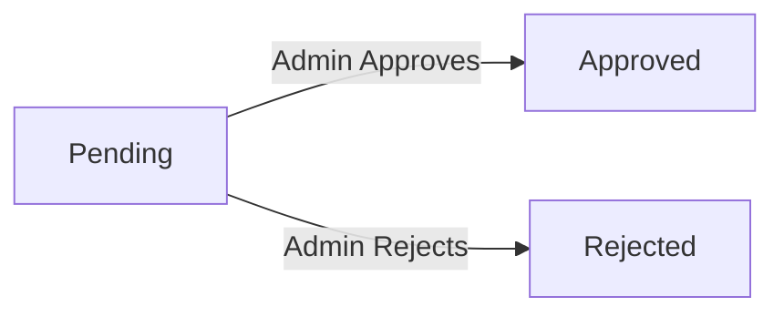

**ecommerceMall — Actor definitions, permission matrix, authentication, session, account lifecycle**

Actor definitions, permission matrix, authentication, session, account lifecycle

# Actor Definitions

Define all user actor types with their identity, permissions, and access boundaries.

## customer Actor

Customers are registered users identified by an email address, display name, and phone number. Registration is mandatory for all activities, preventing any guest browsing on the platform. Their permissions encompass personal profile management, maintaining multiple shipping addresses with a designated default option, curating a product wishlist, and populating or managing a shopping cart. Customers proceed through checkout and payment processing, maintain detailed order history, and retain the right to request specific item cancellations or refunds after delivery. They may also write, edit, or delete product reviews tied to completed orders, and any customer can submit a formal application to become an administrator. Strict data isolation boundaries ensure that each customer can only interact with their own private profiles, personal accounts, and order histories without gaining visibility into the sensitive information of other users.

### Customer identity

Customers are registered members of the ecommerceMall platform, identified primarily by an email address along with a display name and phone number.

Mandatory registration is strictly enforced for the entire platform, prohibiting any guest browsing or unauthenticated access to any platform features.

Customers are responsible for maintaining their own profile information, holding the permission to update their display name and phone number at any time.

Customers hold the authority to manage their own physical shipping addresses across the platform, which may include recipient details, street address, city, state, postal code, and country. Customers may define, update, and set a default shipping address for their future transactions.

### Wishlist maintenance

Customers are permitted to maintain a product wishlist, where they can safely store products of interest for future consideration and easily view or curate their saved items.

Customers hold the right to populate and manage their shopping cart, selecting specific product variants and quantities, adjusting quantities, and removing items prior to purchasing.

Customers are authorized to initiate the checkout process, where they select a shipping address, review the final order summary, and confirm the details before finalizing their purchase.

Customers manage the payment process by confirming their order details, which triggers the system to evaluate the payment outcome and create the order upon successful processing, or allow a retry in the event of a failure.

### Order history access

Customers are granted full visibility into their order history, receiving a paginated view sorted by most recent dates, and hold the right to view comprehensive details for any placed order.

Customers possess the right to request item cancellations for individual order items that have not yet been shipped, providing a text-based reason which is subsequently forwarded to the respective seller for review.

Customers are permitted to submit item refund requests for order items that have already been delivered, detailing a text-based reason within a defined timeframe and forwarding it to the seller for review.

Customers participate in review and rating management by writing, editing, or deleting product reviews after receiving their orders, which require a mandatory rating score and an optional text-based description.

### Administrator application process

Customers possess the right to submit a formal application to request an administrator role on the platform, providing a text-based reason which is subsequently reviewed for approval by super administrators.

Customer data isolation is strictly enforced to ensure that each customer's personal information, profile settings, account preferences, and order histories remain entirely private and inaccessible to other platform actors.

Cross-account access restriction strictly prohibits any customer from viewing, modifying, or interacting with the private profiles, order data, or sensitive information belonging to other customers, sellers, or administrators, maintaining rigid data boundaries across the ecosystem.

## seller Actor

Sellers are registered business users identified by an email, password, shop name, shop description, and logo image. A seller account requires active administrator approval before any selling or cataloguing activities can commence. Their permissions allow them to fully manage their shop profile, create and maintain a comprehensive product catalog, and manage product variants with specific pricing and stock quantities. Sellers conduct inventory level management, fulfill customer orders by creating shipments and entering carrier tracking details, and monitor their daily sales through a dedicated shop dashboard. They are responsible for reviewing and responding to customer requests for item cancellations or refunds. Additionally, sellers retain the ability to submit applications for administrator status. Access boundaries strictly confine their operational visibility to their own products, inventory records, and order items, legally and technically prohibiting interactions with other sellers' catalogs or customer private account information.

### Coverage: Seller Identity

Sellers are registered business accounts identified by Customer.email address and password, maintaining a distinct identity from regular customer accounts. To activate their business capabilities and begin listing products, a seller must undergo mandatory administrative approval prior to any operational activity. The seller possesses the authority to manage their shop profile, ensuring the shop name, description, and logo image accurately represent their business. They are granted full privileges Review catalog creation, enabling them to add, edit, and manage the items they offer on the ecommerceMall platform.

### Coverage: Product Variant Management

The seller maintains complete control over product variant management, allowing them to set specific SKU codes, options, and stock quantities for each distinct item configuration. They are responsible for inventory management, monitoring stock levels to ensure product availability and adjusting quantities as needed based on restocking or sales. When orders are received, sellers execute the end-to-end order fulfillment process by selecting purchased items and preparing shipments for delivery to customers. The seller is required to perform tracking information entry, supplying the Shipment.carrier name and Shipment.tracking number associated with the physical shipment of their products.

### Coverage: Customer Cancellation Reviews

Sellers act as the final decision-makers for customer cancellation reviews, reviewing requests from buyers to cancel unshipped items and granting or denying the request. They also perform customer refund reviews, evaluating and responding to reimbursement requests submitted by customers for delivered goods. A seller dashboard overview grants them a centralized view of their shop's operational health, displaying metrics such as pending requests and order status. Additionally, the seller actor is eligible to initiate the administrator request submission process to formally apply for an elevated platform administrator role.

### Coverage: Isolated Shop Operations

The seller's permissions are strictly bounded by isolated shop operations, limiting their visibility and actions exclusively to their own products, orders, and inventory. The system enforces a cross-seller access restriction, preventing any seller from viewing, editing, or interfering with the catalog, inventory, or order data of other business accounts on the platform. A customer private data limitation restricts sellers from accessing sensitive customer account information; they may view shipping details necessary for deliveries but cannot view private user profiles or credentials outside of fulfillment requirements.

## admin Actor

Administrators are platform overseers identified by an email address and a specific admin grade that defines their level of oversight, ranging from regular administrators to super administrators. Regular administrators maintain platform standards by overseeing all orders, products, categories, and seller registrations. They manage category structures, review dispute resolution snapshots, forcefully cancel or refund order items, and manage customer or seller bans and unbans. Super administrators possess all standard permissions but hold elevated rights to manage the administrative hierarchy. They review administrator application requests, promote regular administrators to super status, and handle seller suspensions that temporarily hide storefronts while preserving existing order processing. Access boundaries grant comprehensive platform governance and enforcement capabilities while deliberately restricting unrestricted, unnecessary access to customer personal private data.

### Platform Oversight and Administrative Roles

The administrative actor operates as a platform overseer defined by a unique Admin.email address and an Admin.admin grade. There are two distinct administrative tiers: the regular administrator role and the super administrator role.

Regular administrators maintain platform standards by continuously overseeing orders, products, categories, and seller registrations. Their baseline permissions include managing category structures, reviewing dispute resolution snapshots, executing force cancellations or refunds on order items, and managing customer or seller bans.

Super administrators possess standard administrative permissions but hold elevated rights focused on the overarching hierarchy. A core responsibility of the super administrator role is administrative account reviews, which includes evaluating user requests for elevated privileges and deciding whether to approve applications advancing users into regular administrator status.

### Coverage: Administrative Hierarchy Management

Authority for administrative hierarchy management is strictly limited to the super administrator role. This encompasses promoting regular administrators to super status and demoting other super administrators, though a super administrator cannot reduce their own privileges.

Sellers must undergo a formal seller approval process. Administrators hold the permission to review a dedicated queue of pending seller applications and execute decisions to approve or reject registration requests. Rejections require an associated reason to inform the seller of the deficiencies.

Administrators exercise full control over category structure management, granting them the authority to establish both top-level and nested categories. They can modify existing category names and descriptions, or permanently remove categories, which automatically shifts associated products to an uncategorized state.

Platform product oversight grants administrators complete visibility across all marketplace listings. They can view the comprehensive product catalog and access historical snapshots for any item. Additionally, administrators hold the permission to permanently remove any product from the platform.

### Coverage: Customer Account Management

Customer account management permissions provide administrators with full visibility into all registered customer accounts. Administrators can evaluate customer behavior and execute bans to block platform login access, or unban previously suspended accounts.

Seller account suspension empowers administrators to temporarily pause a seller's storefront operations. Upon suspension, the seller's products are hidden from search results and category listings, and new purchases are disabled. While suspended, sellers retain the ability to fulfill existing customer transactions, including shipping pending items and responding to cancellation or refund requests, though they cannot create or modify products. Administrators hold the authority to reverse this by unsuspending the account, immediately restoring product visibility.

Order intervention capabilities provide comprehensive visibility into all platform transactions. Administrators can view the complete order history, detailed order item information, and real-time status updates, enabling them to monitor the marketplace and intercede when disputes or irregularities arise.

Force cancellation execution rights allow administrators to permanently void individual order items or entire orders. When triggered, the system automatically initiates the required actions to fulfill the cancellation request and restore associated inventory levels.

### Coverage: Force Refund Execution

Force refund execution grants administrators the authority to immediately process financial refunds for individual order items or entire orders at their discretion. This permission automatically initiates the return of funds to the customer and triggers the restoration of corresponding stock quantities via the inventory management system.

Policy enforcement actions grant administrators the active permission to monitor product listings for compliance. When a product violates platform guidelines or marketplace policies, administrators can permanently remove it from the platform to maintain environment integrity.

The administrative framework maintains strict restricted customer data oversight. Despite broad platform governance, enforcement capabilities, and transaction oversight, access boundaries deliberately prohibit unrestricted access to customer personal private data, ensuring that platform management operations do not compromise customer privacy.

# Authentication Flows

Registration, login, logout, and session management from a user perspective.

## Registration and Login

Define user registration and login flows including validation and error handling.

### Coverage: Registration

Every interaction with the ecommerceMall platform requires a registered account; guest access is entirely prohibited. Unregistered visitors are not permitted to view product listings, browse the site, or interact with any system features without authenticating. All users must complete a formal registration process and log in before accessing the platform. A user signs up as a customer by providing a valid Customer.email address and creating an account password. Upon confirming the registration, the customer account is activated immediately, allowing the user to log in using their registered Customer.email address and password, granting full access to browsing, shopping, and personal account management features. A prospective seller initiates their account by registering with a unique Seller.email address and creating a password. The seller account operates in a restricted state pending explicit approval from an admin. The seller cannot begin selling or accessing restricted dashboard features until the registration request receives active SellerApproval. The seller can log in using the registered Seller.email address and password at any period to view the current approval status. If an admin rejects the seller's registration, the seller is notified of the rejection reason and is required to submit a fresh registration request to be considered again. Administrator identities are not acquired through a direct initial registration process. Instead, an active customer or seller must submit a formal AdminRequest to become an administrator. Once an admin successfully approves this request, the existing customer or seller account promotes to an admin role. The user retains the same Customer.email address or Seller.email address and password credentials originally established during their customer or seller registration and uses these same credentials to authenticate as an Admin.email address.

## Session and Logout

Define session behavior and logout from a user perspective.

### Session

Upon successful login, the system grants the customer, seller, or administrator an active session on the ecommerceMall platform. This active session permits the user to navigate the platform, execute actions, and access their respective dashboard areas without repeatedly authenticating. The session remains established until the user actively ends it or the system determines it has timed out. Users are able to manually terminate their established session at any time by utilizing the platform's session termination mechanism. Triggering this action immediately invalidates the session, preventing the user from performing further actions on the platform until they re-authenticate. This allows users to securely close their active platform access when stepping away from their device or when they choose to revoke their immediate access rights. Furthermore, the platform enforces strict session validation standards to ensure that an active session is exclusively tied to the authenticated account. The system continuously verifies that only the verified account holder is allowed to execute actions using the established session, whether for managing a product catalog, processing customer orders, or viewing personal account data. This security measure prevents unauthorized individuals from assuming an active session to access private account information or to perform platform actions on behalf of the legitimate user.

# Account Lifecycle

Account creation, deletion, and password management.

## Account Management

Define how users create accounts, delete accounts, and change passwords.

### Account Creation

Customers create their accounts by providing a Customer.email address and a password. Customer accounts are activated immediately upon successful registration.

Sellers create their accounts by providing a Seller.email address and a password. However, newly created seller accounts are automatically set to a pending status. Sellers cannot use their accounts to sell products until an administrator reviews and approves their registration. Sellers can view their SellerApproval.approval status (pending, approved, or rejected).

**Seller Approval States**

If a registration is rejected, administrators must provide a reason, which the seller can view. Rejected sellers are allowed to submit a new registration request.

Customers retain the ability to delete their own accounts at any time. When a customer account is deleted, the customer's personal profile information is permanently removed from the system. However, the customer's orders and order history are preserved for seller record-keeping and legal compliance.

Sellers may request the deletion of their own account only if all pending business transactions have been resolved. Specifically, a seller's account deletion is blocked if they have any pending orders with a status of paid or shipped, or if there are unresponded cancellation or refund requests associated with their products. When a seller account is successfully deleted, their products are immediately removed from marketplace listings. However, the historical snapshots of those products, along with the seller's shop name, are permanently retained in the order records for business transparency.

Both customers and sellers can change their account passwords to maintain the security of their personal access credentials.