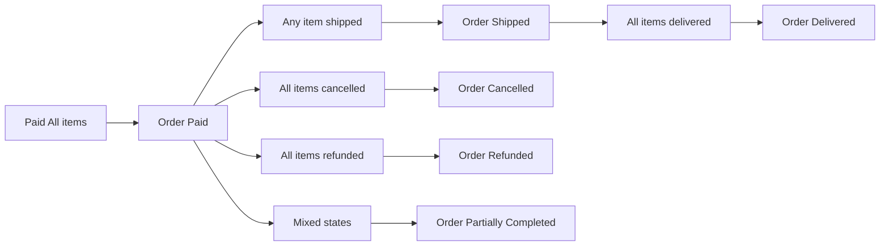

**ecommerceMall — What operations users can perform, use cases, business workflows**

What operations users can perform, use cases, business workflows

# Core Business Operations

What the system must do for each business concept.

## Customer Operations

Customers must register with an email address and password to access any platform features, as guest browsing is prohibited. After registration, customers can securely log in using their email and password credentials. Customers have the option to change their password at any time using their current credentials. When a customer decides to delete their account, their personal profile information and display name are immediately removed from public view. However, their historical order records and order history are preserved in the system to maintain seller records and comply with legal requirements. When reviewing past order history, any product reviews they previously submitted remain visible but are automatically marked as belonging to a deleted user.

Customers manage their customer profile by setting a display name and phone number, which can be updated whenever needed. They can maintain multiple shipping addresses for deliveries, with each address capturing recipient name, phone number, street address, city, state or province, postal code, and country details. Customers can set one shipping address as their default to streamline the checkout process.

### Customer Registration With Email And Password

Customers register for the platform exclusively through the system registration workflow, providing a unique email address and a secure password. The platform enforces a strict platform registration requirement where guest browsing is prohibited and customers must be registered to access any platform features. Once registered, customers log into the system using their email address and password. Customers may also change their password at any time to maintain account security.

### Account Deletion With Profile Removal

Customers manage their Customer.display name at any time leading up to account termination. When a customer requests account deletion, their personal profile information and Customer.display name are permanently removed from public visibility. However, the platform enforces a strict policy to preserve order history after deletion, ensuring historical transaction records remain intact for seller records and legal compliance. To protect customer privacy while maintaining review context, the system automatically marks reviews as deleted user, replacing the customer's actual identity with a standardized label on product pages.

### Updating Customer Phone Number

Customers have the continuous ability to update their customer phone number associated with their account whenever necessary. Customers manage their delivery preferences by adding multiple shipping addresses to accommodate different locations. When adding these addresses, customers must explicitly specify the shipping recipient name to ensure accurate package delivery. The system handles the recording shipping address details by capturing the full street address, city, state or province, postal code, and delivery country for every saved entry.

### Setting Default Shipping Address

Customers can designate one of their configured locations as the default shipping address to streamline future checkout transactions. The system references the default shipping address to suggest the preselected entry during the checkout process. Customers retain full control to edit shipping addresses at any time to update location details or recipient information. Customers can also delete shipping addresses that are no longer required, permanently removing them from their profile after the deletion is confirmed.

## Seller Operations

Sellers register using their email address and password, which are required for logging into the seller platform. They can independently manage their password. Upon submitting their registration, new seller accounts enter a pending approval state and cannot sell products until approved by an administrator. Sellers can monitor their approval status at any time, which shows as pending, approved, or rejected. If an application is rejected, the seller receives the specific reason for rejection and can submit a revised registration request.

Once approved, sellers access their shop dashboard to view a summary showing total number of products, total number of order items from their products, and counts of pending cancellation and refund requests. Sellers can list all their order items and filter them by status for fulfillment management. Sellers can delete their account only if they have no pending orders (paid or shipped status) and no pending cancellation or refund requests. When deleted, their products are removed from marketplace listings, but historical order records, snapshots, and their shop name are preserved in past transactions.

When sellers are suspended by administrators, their products are hidden from search and category listings but they can still process existing orders, ship items, and respond to cancellation and refund requests. Suspended sellers cannot create new products or edit existing ones.

### Seller Registration With Email And Password

The system SHALL allow sellers to register their seller account using a Seller.email address and password during the initial seller registration with Seller.email address and password workflow.

WHEN a seller returns to the platform after registration, THE system SHALL permit Seller.email address and password login for sellers to securely access their dashboard.

WHERE account security updates are required, THE system SHALL allow sellers to perform the changing seller password action within their account settings to update their existing credentials.

UPON the successful submission of a registration request, THE system SHALL transition the seller account to a pending seller approval state, completely preventing access to product management and selling features until administrative approval is granted.

DURING the pending seller approval state, THE system SHALL allow sellers to consistently check and view their SellerApproval.approval status from their account settings to monitor their application progress.

### Rejection Reason Display

WHEN an administrator reviews and declines a seller registration application, THE system SHALL present a rejection reason display providing the specific cause for the denial.

UPON viewing the rejection details, THE system SHALL grant the seller the ability to submit a resubmitting seller registration request to correct compliance issues or provide additional information for re-evaluation.

WHEN an administrator officially approves a seller application, THE system SHALL grant the seller full access to their seller dashboard summary overview upon their subsequent login.

FROM the seller dashboard summary overview, THE system SHALL allow sellers to quickly view their total product count to track the current number of active listings in their shop.

FROM the same dashboard overview, THE system SHALL allow sellers to view order items for products awaiting fulfillment, enabling quick access to pending daily operations.

### Filtering Order Items By Status

WHEN managing their storefront workflow, THE system SHALL allow sellers to utilize the filtering order items by status feature to organize their fulfillment tasks effectively.

ON the dedicated management interface, THE system SHALL provide accessible widgets designed for checking pending cancellation requests initiated by customers.

ON the same management interface, THE system SHALL provide accessible widgets designed for checking pending refund requests requiring merchant evaluation.

WHEN a seller initiates process to terminate their account, THE system SHALL strictly verify seller account deletion prerequisites by ensuring they hold no paid or shipped order items, and possess zero pending cancellation or refund requests.

UPON meeting the deletion prerequisites and the seller explicitly confirming the action, THE system SHALL execute products deletion on account removal, securely purging every active product listing from the marketplace.

### Preserving Order History On Deletion

WHILE executing the final account deletion process, THE system SHALL prioritize preserving order history on deletion to maintain a permanent and legally compliant historical transaction record.

UPON complete account removal, THE system SHALL ensure preserving shop name on deletion by ensuring all past customer receipts, invoices, and fulfillment notes retain the original storefront title for accurate historical reference.

WHEN an administrator chooses to suspend a seller account, THE system SHALL immediately apply seller suspension effects on products by instantly hiding all active listings from public search indexes and category browsing pages.

DESPITE the application of seller suspension effects on products, THE system SHALL allow the suspended seller to continue processing orders while suspended by fulfilling existing paid items and responding to existing cancellation or refund requests.

DURING an active suspension, THE system SHALL strictly enforce restricted product editing for suspended sellers, completely blocking any attempts to update listings, adjust prices, or manage inventory until the administrative suspension is lifted.

## Admin Operations

Administrators manage platform governance through two distinct grades: regular administrator and super administrator. Super administrators hold ultimate authority including reviewing seller registration requests, approving or rejecting them with explicit reasons, suspending and unsuspending seller accounts, and promoting or demoting other super administrators without being able to demote themselves. Super administrators can also promote regular administrators to full super admin privileges.

Administrators manage the platform category structure by creating top-level categories and one level of subcategories, editing category names and descriptions, and deleting categories. When deleted, products within those categories become uncategorized. Administrators can ban and unban customer and seller accounts. Banned users cannot log in to the platform. Administrators have oversight over all products and can delete any product for policy violations. They can view all orders and force-cancel individual items or entire orders, automatically refunding customers and restoring stock. They can also force-refund individual items or entire orders.

### Admin Grade Management Structure

The system enforces an Admin.admin grade management structure, dividing administrators into two distinct tiers: regular administrators and super administrators. Super administrators hold the highest level of privileges and operational restrictions across the platform.

Super administrators actively review all new seller registration requests submitted by users. They possess the exclusive authority to approve seller registrations that meet platform standards or reject seller registrations when necessary. When rejecting a registration, the system requires the super administrator to provide a clear, specific reason, which is then displayed to the applicant so they can address the issue.

Super administrators are responsible for enforcing platform compliance through seller account suspension. They can suspend seller accounts at any time to restrict the merchant's operations. Suspending a seller account immediately prevents the seller from logging in and performing active storefront operations.

### Unsuspending Seller Accounts

Administrators can manage suspended seller accounts by unsuspending them, which instantly restores the seller's ability to log in and resume normal storefront operations.

When a seller's account is suspended, the system automatically enforces restricting suspended seller product creation, preventing the merchant from submitting new product listings or modifying existing ones until the suspension is lifted.

Privilege management is handled exclusively by super administrators. Super administrators can promote regular administrators to super administrator, granting elevated access to critical platform tools. They can also demote other super administrators by lowering their grade back to regular administrator. To ensure continuous platform governance and prevent account lockouts, the system strictly enforces an admin inability to self-demotion, meaning no super administrator can downgrade their own credentials.

Super administrators also govern the platform's catalog hierarchy by creating top-level categories. These primary classifications serve as the foundational structure for organizing all products on the marketplace.

### Creating First Level Subcategories

Administrators maintain an organized catalog by creating first-level subcategories under existing top-level categories, establishing a clear two-level category hierarchy for customer navigation.

Administrators regularly edit category names and descriptions to ensure that classifications accurately reflect current marketplace standards and product groupings.

If a category is no longer relevant, administrators can delete it. When this occurs, the system executes deleting categories uncategorizing products, instantly removing all associated products from the deleted classification and leaving them unassigned until an administrator assigns them to a new category.

User account security is maintained through access control workflows. Administrators can ban customers, preventing them from accessing their accounts or placing orders. To correct mistakes or remove restrictions, administrators can unban customers, restoring their ability to log in and browse the marketplace.

Administrators also manage merchant access by banning sellers, preventing their login attempts immediately. Banned seller accounts retain their historical transaction records but are completely locked out of the seller dashboard.

### Admin Product Oversight Viewing All Products

Super administrators maintain full platform transparency through admin product oversight viewing all products. This capability grants them the ability to browse the entire marketplace catalog, reviewing items submitted by any seller to ensure content compliance.

If a specific product violates platform policies or standards, administrators can delete any product for policy violations. This enforcement action permanently removes the specified product from the active marketplace regardless of the original seller.

Administrators monitor financial and transactional health through admin order oversight viewing all orders. This gives them a comprehensive view of all transactions across the platform.

In situations involving operational errors or escalated disputes, administrators have the authority to intervene directly. They can force cancel items or entire orders, immediately halting processing. They can also force refund items or entire orders, triggering an immediate financial reversal for the affected customer. Upon completing these critical enforcement actions, the system automatically triggers restoring stock upon force actions, incrementing the inventory of the affected variants to preserve catalog accuracy.

## Product Operations

Sellers create products by specifying required fields: product name, description, category (including subcategory selection), and base price. Each product belongs exclusively to the seller who created it. Sellers can update their products' details, and every modification generation creates a snapshot that captures the complete previous state of the product and all its variants.

Sellers can delete their products only when no variants have pending order items in paid or shipped status, and no pending cancellation or refund requests exist for any variant. Deleting a product automatically removes all its variants and inventory records from the marketplace. Deleted products no longer appear in search results or category listings. However, product snapshots are permanently preserved even after deletion, allowing sellers to view their own historical snapshots and administrators to view any product snapshot for audit or dispute resolution.

### Coverage: Creating New Products With Required Fields

Sellers initiate the process of creating new products by specifying the required fields through the listing creation workflow.
During setup, sellers specify the Product.product name and description, both of which are strictly required to complete the catalog listing.
The seller must assign the product categories and subcategories to ensure the item is properly organized within the marketplace hierarchy.
Sellers are required for setting base product price, establishing the financial baseline for the item before it goes live.
Upon successful creation, seller product ownership is automatically granted, ensuring the creator retains exclusive control over the item.
Sellers can later update the item configuration by editing product details, allowing them to modify the name, description, category, and price at a later time.

### Coverage: Creating Product Snapshots On Edit

The system automatically initiates the workflow for creating product snapshots on edit whenever a seller submits a modification to a product or its variants.
The generated snapshot is responsible for preserving complete product state snapshots, capturing all variant configurations and details exactly as they existed prior to the edit.
Before a seller proceeds with purging an item, the system forces them to check deletion eligibility for products to prevent data loss of active commerce.
The deletion eligibility check requires the system for ensuring no pending order items on deletion, verifying that associated order items do not hold paid or shipped statuses.
The system simultaneously blocks the request for ensuring no pending cancellation requests on deletion, preventing the removal of items involved in active cancellation disputes.

### Coverage: Ensuring No Pending Refund Requests On Deletion

The system explicitly blocks the deletion request for ensuring no pending refund requests on deletion, preventing removal if any variant has an active refund dispute.
Upon authorized deletion, the system executes the deleted product variant removal process, permanently purging all associated variant records from the active catalog.
Immediately following variant removal, the system handles the deleted product inventory record removal, erasing historical stock movement data tied to the removed variants.
Once purged, the system ensures products are automatically removed from search listings so customers cannot discover the item through global or filtered searches.
These products are simultaneously removed from category listings, ensuring they do not appear in browsing results for any Category.category level.
Despite purging the active records, the system strictly follows the rule of preserving product snapshots after deletion, ensuring historical snapshots remain fully accessible in the read-only archive.

### Coverage: Sellers Viewing Own Product Snapshots

Sellers can access and view their own product snapshots to track historical modifications made to their catalog listings.
Administrators are granted platform-wide permissions to view any product snapshot when auditing merchant activities or resolving disputes.
The system maintains the product snapshot structure with variants in a nested format, capturing the exact state of every individual variant at the time of the snapshot to ensure comprehensive historical tracking.

## ProductVariant Operations

A product can have multiple variants representing specific option combinations like color and size. Each variant requires a unique SKU code option values and a starting stock quantity of zero. Optionally a variant can override the product base price. Sellers can add variants to their products at any time and edit variant details including SKU code option values and price. Every variant edit automatically generates a snapshot preserving the prior state.

Sellers can delete variants only if no variants have pending order items in paid or shipped status and no pending cancellation or refund requests exist for that specific variant. A product must contain at least one variant to be purchasable. Products without variants remain visible in search results and category pages but are displayed as unavailable to customers.

### Defining Product Variants

WHEN a seller defines a new product variant, THE system SHALL capture and save the variant details to the product catalog.

WHEN a seller creates a variant, THE system SHALL enforce the creation of a unique ProductVariant.SKU code distinct to that specific variant.

WHEN defining a variant, THE system SHALL capture the specific option values, such as size or color, that distinguish this variant from others in the same product.

WHERE a seller specifies a variant price, THE system SHALL use that price to override the Product.base price of the parent product for that specific variant.

WHEN a new variant is initially created, THE system SHALL initialize its ProductVariant.stock quantity to zero by default.

### Adding Variants To Existing Products

WHEN a seller adds a new variant to an existing product, THE system SHALL associate the variant with the parent product.

WHEN a seller edits existing variant details, THE system SHALL update the variant option values, SKU code, or price in the catalog.

WHEN a variant is edited, THE system SHALL automatically generate a snapshot to record the variant's previous state for future audit trails.

THE system SHALL preserve variant snapshots indefinitely so sellers and administrators can review historical product states at any time.

WHEN a seller executes variant deletion, THE system SHALL permanently remove the variant from the product and permanently delete any associated inventory records.

### Checking Deletion Eligibility For Variants

WHEN a seller requests to delete a product variant, THE system SHALL evaluate the deletion request against existing order data before processing removal.

WHEN a seller requests to delete a variant, THE system SHALL reject the deletion if the variant already exists within a pending order item that has a paid or shipped status.

WHEN a seller requests to delete a variant, THE system SHALL reject the deletion if there is a pending cancellation request submitted for that specific variant.

WHEN a seller requests to delete a variant, THE system SHALL reject the deletion if there is a pending refund request submitted for that specific variant.

WHEN a seller requests to delete a variant, THE system SHALL reject the deletion if the operation would result in the parent product having zero variants remaining.

### Restricting Purchases For Products Without Variants

WHERE a product has no active variants defined, THE system SHALL restrict customers from purchasing the product or adding its items to the shopping cart.

WHILE a product lacks variants, THE system SHALL continue to display the product in search results and category listings but label it as unavailable to customers.

## Category Operations

Administrators exclusively control the platform's category hierarchy. They create top-level categories and one level of subcategories. Each category requires a name and description. Administrators can edit category names or descriptions whenever needed. They can delete categories, automatically leaving products within those categories uncategorized.

Customers can browse the complete list of categories and subcategories to explore the marketplace. Customers can navigate to a specific category page to view all products within that category, facilitating product discovery based on classification.

### Admin Exclusive Category Management

Only administrators have access to the platform's category management tools. Administrators are responsible for defining the structural hierarchy of the marketplace by creating top-level categories that serve as the primary navigation groupings. Below each top-level category, administrators create first-level subcategories to facilitate specific product classifications. The ecommerceMall strictly enforces a single level nesting limit, prohibiting the creation of any subcategory layers below the first tier to maintain a clean and intuitive catalog structure.

### Specifying Category Name And Description

When establishing a new Category, administrators must specify both a Category.category name and a category description to accurately define the product collection. Throughout the platform's lifecycle, administrators retain the ability to edit Category.category names to keep the classification current and aligned with evolving business needs. Similarly, administrators can modify category descriptions to update context and improve clarity for marketplace visitors. If a Category is no longer required, administrators can remove the Category entirely from the platform catalog.

### Auto Uncategorizing Products On Deletion

When an administrator removes a category from the platform, the system automatically uncategorizes all existing products that were associated with that classification. This automated process ensures products remain accessible on the marketplace even after their parent category is removed. Independently, customers can browse the complete list of all categorized top-level groupings available on the platform to explore the full catalog structure. Customers can also browse the list of all available subcategories to access more granular product collections. Once browsing a specific category, customers can navigate to the dedicated category page to view and explore every product assigned to that specific classification.

### Category Based Product Discovery

The managed category hierarchy serves as the primary framework for customers to discover products on the ecommerceMall. By navigating through the sequential list of categories and subcategories, customers can browse products organized by specific marketplace classifications rather than relying exclusively on independent search queries. This category-based discovery mechanism systematically guides customers from broader product groupings into highly specific collections, enhancing their overall browsing experience.

## Order Operations

Customers create orders by reviewing their shopping cart and proceeding to checkout. Before placing an order, they select a shipping address from their saved addresses or use their default, then review the complete order summary which includes items, prices, shipping address, and total price. Once payment is processed successfully, the order is created with a unique order number and total price.

Upon successful order placement, stock quantities are decreased for each purchased variant, and items are removed from the customer's cart. A snapshot of each purchased product, its variant, and the seller profile is captured at the moment of purchase to preserve historical accuracy. Each purchased variant becomes an order item with paid status. The order item snapshot includes product name, description, variant options, price, and seller shop name and logo at time of purchase.

The overall order status is dynamically derived from the combined statuses of all constituent order items. Customers can view their order history in a paginated list sorted by newest first, showing order number, date, total price, and overall order status. They can drill into individual order details to view items, their statuses, shipping address, and shipment tracking information.

### Customer Order Creation From Cart

WHEN a customer initiates checkout from their shopping cart, the system shall allow them to select a shipping address from their saved addresses or use their default shipping address.

WHEN the customer proceeds to checkout, the system shall display an order summary containing all cart items with their individual prices, the selected shipping address, and the Order.total price of the order.

UPON the customer confirming the order and successfully processing payment through the external payment gateway, the system shall generate a new order with a unique Order.order number and the recorded Order.total price.

WHEN an order is successfully created, the system shall decrease the stock quantities for each purchased product variant by the ordered amounts.

### Removing Items From Shopping Cart and Creating Snapshots

WHEN an order is successfully placed, the system shall automatically remove the purchased items from the customer's shopping cart.

UPON successful placement, the system shall create a product snapshot on purchase for each purchased product, recording the complete product state including name, description, and images at that exact moment.

Additionally, the system shall create a variant snapshot on purchase for each purchased product variant to capture their specific option values and pricing. These snapshots permanently preserve the purchase time product details and purchase time variant details, ensuring subsequent catalog edits by sellers do not alter historical order records.

### Preserving Purchase Time Seller Details and Generating Order Items

After capturing purchase snapshots for the buyer, the system shall create a seller profile snapshot on purchase to capture the seller's shop details. The system shall preserve purchase time seller details by permanently recording the seller profile state at the time of purchase.

The generated order items are assigned a paid status, indicating payment is complete and awaiting shipment.

The system shall derive the overall order status dynamically based on the combined statuses of all constituent order items.

WHILE all items are in paid status, THE system SHALL mark the order as paid.

WHILE any item is shipped and none are delivered, THE system SHALL mark the order as shipped.

WHILE all items are delivered, THE system SHALL mark the order as delivered.

WHILE all items are cancelled, THE system SHALL mark the order as cancelled.

WHILE all items are refunded, THE system SHALL mark the order as refunded.

Customers can view a paginated order history sorted by newest first. Each entry in the order history shall display the Order.order number and date, and the Order.total price of the order.

### Drilling Into Order Item Details and Managing Transitions [NEEDS FIX]

WHEN a customer views an individual order, the system shall allow them to drill into the details of each order item, displaying the Product.product name, selected variant, OrderItem.quantity ordered, price, and current OrderItem.item status.

For each order item that has been shipped, the system shall expose the associated shipment's tracking information, including the Shipment.carrier name and Shipment.tracking number.

Flowchart of order status derivation:

WHILE order items remain in mixed status states, THE system SHALL categorize the overall order as partially completed.

When an individual order item's status changes, THE system SHALL trigger an order status transition, re-evaluating the combined statuses to update the overall order status in real time.

## OrderItem Operations

When a customer places an order, the system automatically creates an order item for each unique product variant purchased. If multiple units of the same variant are bought, they are consolidated into a single order item with an aggregated quantity. Each order item maintains its own independent lifecycle and status, separate from other items in the same order. Order items remain grouped for shipment management purposes but can be processed independently.

Order item statuses range from paid through shipped, delivered, cancelled, or refunded. The overall order status is calculated dynamically: if all items are paid the order is paid, if any are shipped the order is shipped, if all delivered the order is delivered, if all cancelled the order is cancelled, if all refunded the order is refunded, and mixed states result in partially completed. Order items can be individually cancelled or refunded through separate request workflows, with affected items updating their status and the remaining items continuing normal processing.

### Order Item Creation On Checkout

### Order Item Creation On Checkout

- WHEN a customer completes the checkout process, THE system SHALL automatically generate an order item for each unique product variant added to the cart.
- WHEN identical product variants are purchased, THE system SHALL consolidate these identical purchases into a single order item rather than creating separate entries.
- THE system SHALL manage individual order item quantities independently, ensuring that every unit purchased is accurately accounted for within its specific entry.
- THE system SHALL track each order item's status separately from other items in the same order, maintaining an independent lifecycle.
- THE system SHALL manage the order item status lifecycle through the defined statuses of paid, shipped, delivered, cancelled, or refunded as events occur.

### Deriving Overall Order Status From Items

### Deriving Overall Order Status From Items

- THE system SHALL derive the overall order status dynamically by evaluating the combined statuses of all constituent order items.
- WHILE all order items within an order hold paid status, THE order SHALL be classified as paid.
- WHEN any order item transitions to shipped status and no item has yet reached delivered status, THE order SHALL transition to shipped.
- WHILE all order items within an order reach delivered status, THE order SHALL transition to delivered.
- WHILE all order items within an order are cancelled, THE order SHALL transition to cancelled.

### All Items Refunded Resulting In Refunded Order

### All Items Refunded Resulting In Refunded Order

- WHILE all order items within an order are refunded, THE order SHALL transition to refunded.
- WHILE the order contains a combination of varying item statuses, THE order SHALL be classified as partially completed.
- WHEN a customer requests to cancel a specific paid order item, THE system SHALL initiate an individual order item cancellation request.
- WHEN a customer requests to refund a specific delivered order item, THE system SHALL initiate an individual order item refund handling workflow.
- UPON approval and completion of a cancellation or refund request, THE system SHALL remove the affected item and transition the remaining unaffected items to continue their normal processing states.

### Remaining Items Continuing Normal Processing

### Remaining Items Continuing Normal Processing

- UPON an order item being cancelled or refunded, THE system SHALL ensure remaining items continue their normal processing pipelines without interruption.
- WHEN sellers prepare order items for fulfillment, THE system SHALL group items into shipments strictly per seller, preventing cross-seller shipment mixing.
- WHEN sellers bundle multiple units of the same product variant or aggregated items for a single seller, THE system SHALL consolidate these into a single shipment entry for unified dispatch.

## Shipment Operations

Sellers manage the shipping process by viewing order items that require fulfillment. When fulfilling, sellers select one or more of their order items to bundle into a distinct shipment. All items within the same shipment must originate from the same seller since different sellers always ship separately. Sellers enter tracking information for the shipment including carrier name and tracking number.

Once a shipment is created, all items included in that shipment automatically change to shipped status. Sharing the same tracking details across multiple items in a shipment is standard practice. Customers can view tracking information for each shipment associated with their orders. Delivery confirmation is handled at the shipment level: when a customer confirms delivery, all items in that shipment transition to delivered status. If the customer does not confirm delivery manually, the system automatically marks all items as delivered fourteen days after the shipping date.

### Seller Viewing Shipped Items

Sellers access a dedicated list of all order items from their products that are currently in paid status awaiting fulfillment. This list displays relevant product and variant details to assist in picking and packing. From this pool of pending items, sellers can select one or multiple individual order items to be packaged together for delivery. The platform strictly enforces shipping boundaries, ensuring that all order items chosen for the same physical shipment belong to the same seller. Different sellers always ship separately, and orders cannot be fragmented or cross-shipped across multiple seller shipments.

### Entering Carrier Name For Shipment

When initializing a new shipment package, sellers must enter a Shipment.carrier name to identify the shipping provider. Sellers must also enter a Shipment.tracking number for the specific package so that delivery progress can be monitored. Upon successful shipment creation, the system automatically updates the status of all included order items to shipped. Every order item within a single shipment shares the exact same Shipment.carrier name and Shipment.tracking number to provide consolidated visibility for the customer.

### Customer Viewing Shipment Tracking Info

Customers can review the detailed tracking information for every shipment associated with their placed orders. The interface displays the Shipment.carrier name and Shipment.tracking number provided by the seller. Customers can manually confirm the successful delivery of a shipment directly through their order details. When delivery is confirmed, all order items included in that specific shipment transition to delivered status. If the customer does not manually confirm delivery, the system automatically transitions all items in that shipment to delivered status fourteen days after the shipping date.

### Managing Shipment Creation From Order Items

Sellers manage the fulfillment workflow by initiating the creation of a new shipment from their pool of pending order items. The process requires the seller to group eligible order items together and finalize the shipment record. Customers can track the progress of their purchases by viewing a list of all shipments linked to their orders. This detailed view provides a clear overview of dispatched items, allowing customers to monitor logistics and anticipate arrival based on the shared tracking details.

## SellerProfile Operations

When sellers are approved, they establish their public seller profile by defining a shop name, writing a shop description, and uploading a logo image. Customers browse seller profiles to learn about merchants and browse their products. Sellers have full control to edit their shop name, shop description, and logo image at any time.

Every edit to seller profile fields automatically generates a snapshot preserving the previous state. This snapshot mechanism ensures that historical product listings and past transactions reference the exact profile state that existed at the time of purchase, regardless of subsequent profile changes. Even if a seller account is deleted, their shop name remains preserved in historical order records.

### Seller Profile Creation On Approval

WHEN a seller's account is successfully approved, the seller SHALL establish their storefront on the marketplace.
The seller SHALL define a shop name to establish their business identity on the platform.
The seller SHALL write a shop description to provide customers with details about their business.
The seller SHALL upload a logo image to establish visual branding for their storefront.

### Customer Viewing Seller Profiles

Customers SHALL view the seller's shop name, shop description, and logo image when browsing a seller's storefront page.
WHEN a seller updates their shop name, the storefront name displayed to customers SHALL immediately reflect the updated shop name.
WHEN a seller updates their shop description, the storefront description displayed to customers SHALL immediately reflect the updated shop description.
WHEN a seller updates their logo image, the storefront logo displayed to customers SHALL immediately reflect the updated logo image.

### Creating Seller Profile Snapshots On Edit

WHEN any SellerProfile field is edited, the system SHALL automatically create a snapshot capturing the previous state of the data.
WHEN a seller edits their shop name, the system SHALL generate a snapshot that preserves the previous shop name version.
WHEN a seller edits their shop description, the system SHALL generate a snapshot that preserves the previous shop description version.
WHEN a seller edits their logo image, the system SHALL generate a snapshot that preserves the previous logo image version.

### Historical Accuracy Of Purchase Time Profile

The system SHALL enforce historical accuracy of the purchase time profile by preserving the exact storefront state captured at the moment of purchase within order records.
If a seller permanently deletes their account from the marketplace, the system SHALL preserve the seller's shop name within historical order records to maintain the accuracy of past transactions.

## WishlistItem Operations

Customers curate personalized wishlists by adding products for future consideration. The wishlist displays products not variants, showing each product's name, main thumbnail image, price, and average rating for quick comparison.

The wishlist interface is paginated to accommodate large collections. Customers manage their wishlist by removing products at any time. If a seller deletes a product from the marketplace, the system automatically removes entries from all customer wishlists to prevent broken links or accessibility issues. Wishlist contents remain strictly private and accessible only to the respective account owner.

### Adding Products To Wishlist

- WHEN a customer selects a product and chooses to save it, THE system SHALL create a wishlist item linking the product to the customer's account.
- WHERE the exact same product already exists as a wishlist item for the customer, THE system SHALL prevent the creation of a duplicate entry.
- WHEN a customer navigates to their wishlist page, THE system SHALL load and display a paginated list of all saved products to maintain a responsive interface regardless of list size.
- FOR every product entry within the paginated list, THE system SHALL render the product's main thumbnail image.

### Displaying Product Name In Wishlist

- FOR every product entry within the wishlist list, THE system SHALL display the Product.product name adjacent to the saved product's details.
- FOR every product entry within the wishlist list, THE system SHALL display the base product price or the overall price range if the product contains variants with differing pricing.
- FOR every product entry within the wishlist list, THE system SHALL display the product's average rating calculated from active public reviews.
- THE system SHALL present the Product.product name, price, and average rating prominently to support quick product evaluation and comparison within the saved list.

### Removing Products From Wishlist

- WHEN a customer initiates a removal action for a specific product, THE system SHALL remove that product reference from the customer's personal list.
- WHEN a seller permanently deletes a product from the marketplace, THE system SHALL automatically remove that product from all customer wishlists without requiring manual intervention.
- THE system SHALL enforce strict privacy boundaries, ensuring that other customers, sellers, or unauthorized users cannot view or modify another account's wishlist items.
- WHEN a customer manually deletes an item from their list, THE system SHALL immediately hide the item from the viewable list.

### Curating Desired Products For Future Purchase

- THE system SHALL enable customers to bookmark and curate products independently of specific variant selections, allowing customers to evaluate whole products at a glance before adding them to a shopping cart.
- THE system SHALL support the unlimited storage of curated products within a single customer account.
- WHEN a customer reviews their curated list, THE system SHALL display entries to facilitate effortless future purchase planning and comparison shopping.
- THE system SHALL save items at the product level to ensure customers can later select specific options when moving items from their curation list to the shopping cart.

## Review Operations

Customers write product reviews exclusively after the purchased order item reaches delivered status. They can submit one review per product per order and are required to provide a numeric rating between one and five stars. Including optional review text, customers share feedback they have to the community.

Reviews appear on the product detail page sorted by newest first. The product average rating is calculated based exclusively on all active non-deleted reviews. Customers can edit their own published reviews at any time, with each edit automatically generating a snapshot preserving the previous content. Customers can also delete their own reviews, which removes public visibility but permanently maintains a historical snapshot of the original review for dispute tracking.

Customers browse reviews on product detail pages to assess products before making purchasing decisions.

### Coverage: Writing Post Delivery Reviews

THE SYSTEM SHALL strictly prevent customers from writing a new review until the respective order item for that specific product has permanently reached a delivered status.
THE SYSTEM SHALL allow customers to submit exactly one review per product for every individual order, strictly prohibiting duplicate reviews for the same product within the same order.
WHEN a customer initiates a new review, THE SYSTEM SHALL require the customer to specify a mandatory numeric Review.rating score ranging between one and five stars.
THE SYSTEM SHALL allow the customer to additionally write optional Review.review text to share supplementary details regarding their shopping experience.
IF a customer attempts to submit a review without providing the mandatory numeric Review.rating score, THE SYSTEM SHALL reject the submission request.

### Coverage: Displaying Reviews On Product Detail Page

THE SYSTEM SHALL display a list of public reviews on the respective product detail page for customers actively browsing the product information.
THE SYSTEM SHALL sort the displayed product reviews in descending chronological order so that the newest reviews appear at the top of the page.
THE SYSTEM SHALL calculate the overall average rating for a product by aggregating the scores from all active, publicly visible reviews.
THE SYSTEM SHALL strictly exclude any reviews that have been deleted by their original author from the overall product average rating calculation.

### Coverage: Editing Customer Published Reviews

WHEN a customer wishes to modify their feedback, THE SYSTEM SHALL allow them to edit the Review.rating score and Review.review text of their own previously published reviews.
UPON the successful editing of a review, THE SYSTEM SHALL automatically create a dedicated review snapshot capturing the Snapshot.modified field and its Snapshot.previous value.
WHEN a customer deletes their own public review, THE SYSTEM SHALL remove the specific review content from the active product page, while ensuring the original submission snapshot remains intact for dispute tracking.

### Coverage: Preserving Review Snapshot After Deletion

THE SYSTEM SHALL strictly prevent the permanent deletion of any review history record from the system, ensuring a complete unalterable audit trail is maintained indefinitely for relevant parties.
REVIEWS are preserved via snapshots, guaranteeing that all historical changes to feedback are permanently stored and accessible for administrative oversight and dispute resolution.
CUSTOMERS can actively browse active reviews on product pages to assess public feedback before making purchasing decisions.

## Snapshot Operations

The platform enforces a strict snapshot principle to maintain an immutable historical record of all data modification events. Whenever any editable field is changed, a snapshot is automatically created that records the timestamp of the change, the specific fields modified, and the before and after values. This ensures complete auditability of all platform modifications.

Snapshots are created for products, product variants, seller profiles, order items, reviews, cancellation requests, and refund requests. The platform strictly prevents deletion of any snapshot, guaranteeing a permanent and trustworthy audit trail. Relevant parties including entity owners and administrators can access snapshots for dispute resolution and transparency. Product snapshots have a nested structure that captures the complete state of the product and all its variants at the moment of modification.

### Immutable Data Modification Recording Rule

The ecommerceMall platform enforces an immutable data modification recording rule that triggers automatically whenever any editable piece of data is changed. When a modification occurs, the system generates a snapshot to preserve the historical baseline accurately. The platform records the exact timestamp of when the modification was made to maintain a chronological history of events. The system also documents changed fields precisely, identifying exactly which components were altered during the update process. Furthermore, for every modified field, the platform captures and persists the before values of fields, securing verifiable records of the data state that existed prior to the update.

### Recording After Values Of Fields

The platform records after values of fields concurrently with the initial change, documenting exactly what the data became after the modification process completes. This continuous tracking applies to specific key entities across the marketplace. When a seller modifies product details, a product snapshot on edit is generated to capture the updated specifications. When product variant attributes such as SKU codes or option values are modified, a variant snapshot on edit is created. Sellers updating their storefront shop name, shop description, or logo image trigger the creation of a seller profile snapshot on edit. Additionally, during the checkout process, an order item snapshot on purchase is captured to lock in the exact product, variant, and seller profile states at the precise moment the order was completed.

### Creating Review Snapshots On Edit

The system captures state changes across customer feedback and financial workflows through dedicated request snapshot generation. When a customer edits a published product review, a review snapshot is created to preserve the prior rating and text content. If a customer initiates a purchase cancellation, a cancellation request snapshot is generated to archive the official transaction state and reasoning. Similarly, when customers initiate a financial dispute via a refund, a refund request snapshot is created to document the formal appeal. To guarantee absolute auditability, the platform enforces a strict prohibition of snapshot deletion. No system role or entity owner possesses the authority to remove these records, ensuring the preservation of permanent audit trails that stand as the authoritative history.

### Owners Accessing Their Entity Snapshots

Access to historical records is granted based on user role and ownership boundaries. Entity owners can access their own entity snapshots, allowing sellers to view their store and product history, and customers to review their past review submissions. Administrators possess broader oversight and can access any product snapshot across the entire marketplace to conduct compliance checks. This unrestricted access to verifiable records supports dispute resolution with evidence; when buyers and sellers disagree regarding pricing or product specifications at the time of a transaction, the system provides the exact historical baseline. Because a product consists of multiple options, the platform manages a nested product snapshot with variants structure. When a main product is modified, the platform generates a comprehensive record that encapsulates simultaneous nested representations of all associated product variants, guaranteeing full fidelity of the catalog entry.

## CancellationRequest Operations

Customers can request cancellation of individual order items only while those items remain in paid status and have not yet been shipped by the seller. Each cancellation request requires the customer to provide a text reason explaining the circumstances. After submission, the seller of the affected item reviews the request and exercises authority to approve or reject it.

When a seller approves a cancellation request, that specific item transitions to cancelled status and its stock quantity is automatically restored through an inventory record reflecting the positive adjustment. The remaining items in the same order continue their normal fulfillment pipeline uninterrupted. If all items in an order are cancelled, the overall order status automatically updates to cancelled. A snapshot of the cancellation request state is automatically generated when the seller makes a decision. If a seller rejects the request, the item remains in paid status and processing continues.

### Requesting Order Item Cancellation

Customers can initiate a cancellation request for an individual order item exclusively while the item's status is "paid". The platform implements a strict rule restricting cancellations paid status only, effectively preventing customers from attempting to cancel items that have already transitioned to shipped or delivered states. When submitting a request, the customer must provide a cancellation reason text describing their intent. The system rejects the request if the item status does not match the required paid state or if the reason field is left empty.

### Seller Reviewing Cancellation Requests

Sellers are granted the ability to review a queue of active cancellation requests generated for their products. Sellers hold the exclusive authority over all cancellations, possessing the discretion to evaluate each request and make a binding decision. Upon reaching a final decision, the platform executes a policy of creating cancellation request snapshots, generating an immutable record that captures the exact state of the request and the seller's choice for future reference and dispute resolution.

### Rejecting Cancellation Requests

If a seller decides on approving a cancellation request, the corresponding order item is instantly transferred to cancelled status. The system generates an inventory record specifically for the cancellation, calculating the exact quantity to be returned. This generated record automatically restores stock quantity on approval by offsetting the original negative inventory deduction tied to the purchase. In scenarios where the seller chooses to reject cancellation requests, the item remains in its current status and the broader transaction proceeds without modification.

### Continuing Normal Order Processing

When an order contains multiple items sourced from different sellers, cancelling one item does not halt the fulfillment of the remaining goods. The platform guarantees that normal order processing continues seamlessly for unaffected items, ensuring they advance through their respective shipment statuses without interference. This process maintains unaffected items during partial cancellation scenarios. If all items within a specific order are eventually cancelled, the overall order status is dynamically updated to match the cancelled status on all items, accurately reflecting the complete termination of the transaction.

## RefundRequest Operations

Customers can request a refund for individual order items exclusively those with delivered status. Refund requests must be submitted within seven calendar days from the date the item was delivered. Each request must include a text reason explaining why the refund is sought. The seller of the affected item then evaluates the request and can either approve or reject it.

When a seller makes a decision, a snapshot of the request state is automatically created. Upon approval, the item status transitions to refunded and its stock quantity is automatically restored through a positive inventory record. The remaining items in the order are completely unaffected and continue normal processing. If all items in the order are refunded, the order status becomes refunded. If rejected, the item remains in delivered status.

### Requesting Order Item Refund

WHEN a customer submits a request to refund an individual order item, the system SHALL enforce a seven-day refund deadline, requiring the request to be submitted within seven calendar days from the time the item was delivered.

IF the target order item does NOT have a delivered item status, the system SHALL reject the refund request.

WHEN creating the refund request, the system SHALL require the customer to provide a text refund reason explaining why the refund is being sought.

Upon successful submission, the system SHALL create a new refund request entity linked to the specific order item and set the request status to "pending."

### Seller Evaluating Refund Requests

WHEN a new refund request is created, the system SHALL make the request visible to the seller of the corresponding order item, displaying the customer's text refund reason.

The seller of the affected order item SHALL have the exclusive authority to approve or reject the refund request.

WHILE a refund request is in a "pending" status, the seller SHALL review the request details before making a decision.

IF the seller approves the refund request, the system SHALL automatically create a snapshot of the refund request, capturing the decision, timestamp, and the associated request state for audit and dispute resolution purposes.

### Rejecting Refund Requests

IF the seller determines that the customer's text refund reason does NOT justify the refund request, the system SHALL reject the refund request, and the order item SHALL remain in its current delivered item status.

IF the seller approves the refund request, the system SHALL transfer the affected order item to a "refunded" status.

Upon the item transitioning to a "refunded" status, the system SHALL automatically restore the stock quantity of the associated product variant by generating a new positive inventory record.

### Continuing Unaffected Items Normal Processing

WHEN a refund request is successfully processed for one item within a multi-item order, the system SHALL allow the remaining unaffected items within the same order to continue their normal processing pipelines independently without interruption.

IF all order items within a given order eventually transition to a "refunded" status through this workflow, the system SHALL automatically update the overall order status to a "refunded" status.

## AdminRequest Operations

Any active customer or seller on the platform can submit a formal request to become an administrator. The application must include a text reason justifying why the user should be granted administrative privileges. Super administrators maintain visibility over all pending administrative requests.

Super administrators review these applications and exercise exclusive authority to approve or reject them. Upon approval, the requesting user is upgraded to a regular administrator and gains access to standard administrative management tools. Super administrators also manage the promotion and demotion hierarchy: they can promote regular administrators to super administrator grade. They can demote other active super administrators to regular administrator level. However, super administrators are strictly prevented from demoting themselves, ensuring continuous super admin coverage for critical platform functions.

### Applying To Become Administrator

Active customers and sellers on the platform can apply to become administrator. When providing an application reason as administrator, the applicant must submit a text explanation justifying why they should be granted administrative privileges on the platform. Upon successful submission, the application enters a pending state and is placed into a centralized queue accessible by privileged personnel. Super administrators can view pending requests to monitor all active administrative applications currently under review. Super administrators can review administrative applications systematically to evaluate the qualifications and motivations of applicants before making a decision.

### Super Admin Approving Applications

Super administrators hold the exclusive authority to evaluate and process administrative applications. When a super administrator approves a qualified application, the system initiates the process for transferring user to regular administrator by upgrading the user's status and granting them access to standard administrative management tools. If an application does not meet platform standards, super administrators can reject applications and automatically notify the applicant of the specific rationale behind the denial decision. In addition to managing initial requests, super administrators can promote regular to super administrator when necessary, granting existing admin accounts expanded privileges to oversee critical platform operations.

### Demoting Super Administrators To Regular

Super administrators may utilize their elevated privileges to demote super administrators to regular grade when platform governance requires it. To ensure uninterrupted security coverage and prevent privilege escalation abuse, the platform strictly enforces preventing self-demotion of super admins, meaning an administrator is restricted from reducing their own account grade. The platform maintains an admin request queue to systematically organize all administrative privilege requests, promotions, and demotions, ensuring smooth and auditable processing. All structural grade changes are documented within the broader admin privilege transition workflow to maintain a complete and transparent historical record of platform security modifications.

### Governing Administrative Hierarchy

The platform operates under a governing administrative hierarchy that strictly defines the authority boundaries, role responsibilities, and privilege levels for every administrator account. This organizational structure ensures that all privilege modifications, including promotions and demotions, are executed strictly according to established chain-of-command rules, maintaining overall platform operational integrity and security alignment.

## ShippingAddress Operations

Customers maintain multiple shipping addresses within their account for different delivery destinations. When adding an address, customers provide the full recipient name, phone number, street address, city, state or province, postal code, and country details. Customers can edit any existing address to update its details or delete outdated entries entirely.

Customers designate one address as their default shipping address to streamline future checkout flows. During checkout, customers select an address from their saved list or opt for the default. Once an order is finalized and payment is confirmed, the selected shipping address is locked and cannot be modified by the customer to ensure fulfillment accuracy.

### Adding Multiple Shipping Addresses

THE platform SHALL allow customers to add multiple shipping addresses to their account to store different delivery destinations for various logistics purposes.

WHEN a customer creates a new address, THE system SHALL require the customer to specify the shipping recipient name to ensure correct package handover.

AFTER specifying the recipient name, THE system SHALL record the shipping phone number associated with the address for courier contact purposes.

THE customer SHALL enter a detailed street address, including the building name, street number, and street name, to guarantee accurate physical routing of the delivery.

### Inputting City State Province Details

WHEN defining the geographic parameters of a shipping address, THE customer SHALL input city, state, or province details to establish the proper delivery zone.

AFTER specifying the city or province, THE system SHALL require the customer to enter the postal code for the region to verify the exact delivery boundaries.

THE customer SHALL select the delivery country from the platform's supported list to confirm international or domestic shipping eligibility.

WHERE an address needs an update, THE customer SHALL be able to edit shipping addresses details at any time, such as updating the city, altering the postal code, or switching to a new delivery country.

### Deleting Unwanted Shipping Addresses

THE customer SHALL be able to delete unwanted shipping addresses from their account that are no longer required for their deliveries.

THE customer SHALL be able to designate one existing shipping address as the default shipping address to streamline future checkout flows and expedite the purchase process.

DURING the checkout process, THE customer SHALL be able to manually select an address from their saved list to customize their delivery location.

WHERE the customer does not select an alternative address, THE system SHALL use the default address during checkout as the pre-selected option for finalizing the order.

### Locking Shipping Address After Order Confirmation

AFTER a customer places an order and the payment is confirmed by the system, THE platform SHALL lock the selected shipping address.

WHERE an order is in a confirmed and paid state, THE system SHALL prevent address modification post-payment by the customer for the finalized transaction.

THIS lock ensures the physical goods are delivered to the exact geographic location agreed upon during purchase and remains immutable until the transaction is fully resolved and the shipment is complete.

## InventoryRecord Operations

The platform manages inventory availability through a structured history of adjustments rather than direct stock value modification. Each variant maintains a complete record of every quantity change. Sellers create inventory records by specifying the quantity change, the change category, and a reason. Positive values represent restocking additions for available inventory while negative values represent subtractions due to orders, adjustments, or losses.

The current stock level of any variant is dynamically calculated by summing all historical inventory records. Sellers can manually add inventory through restocking entries with a reason and quantity, or subtract inventory for adjustments and losses. When customers place orders, positive stock is automatically decreased via a negative inventory record. Order cancellations and refunds automatically trigger corresponding positive inventory restoration records ensuring stock accuracy. Sellers can view the complete inventory history of every variant. Variants reaching zero stock are presented as unavailable and customers cannot purchase them.

### Creating Inventory Adjustment Records

- THE System SHALL create inventory adjustment records whenever stock levels change across the platform, ensuring the platform tracks InventoryRecord through history.
- WHEN a seller physically restocks inventory, THE seller SHALL generate a manual record with a positive quantity for restocking entries.
- WHEN an external event or manual correction lowers inventory counts, THE seller SHALL record these changes as a negative quantity for order subtractions or other operational reasons.
- FOR every inventory record creation, THE seller SHALL explicitly provide a detailed text description to strictly enforce recording reason for stock adjustments.
- THE System SHALL permanently archive every adjustment record and prohibit sellers from deleting, editing, or altering historical data.

### Recording Reason For Loss Entries

- WHEN physical stock becomes damaged, lost, or suffers shrinkage, THE seller SHALL generate a dedicated record specifically for recording reason for loss entries.
- WHEN managing active warehouse operations, THE seller SHALL utilize manual inventory restocking entries or subtract inventory for adjustments to accurately mirror real-world inventory fluctuations.
- TO subtract inventory for losses, THE seller SHALL explicitly log a negative quantity and specify the corresponding operational cause within the record.
- THE System SHALL continuously calculate current stock from sum by aggregating every quantity changed across the complete history of all records for a given variant.
- THE seller SHALL ensure that all modification records are properly categorized with standardized change types before they are finalized.

### Automatic Inventory Deduction On Order

- WHEN a customer successfully confirms a payment for an order, THE System SHALL execute an automatic inventory deduction on order by generating a fresh negative record.
- WHEN a seller formally approves a customer's requested cancellation, THE System SHALL execute an automatic inventory restoration on cancellation by creating a matching positive record.
- WHEN a seller fully refunds a delivered item, THE System SHALL execute an automatic inventory restoration on refund by issuing a corresponding positive record.
- THE seller SHALL always be able to access a chronological timeline to view the complete variant inventory history for any product on the platform.
- WHEN a variant's dynamically computed stock total reaches exactly zero, THE System SHALL immediately present these items to customers by visually displaying out of stock zero quantity variants on the storefront.

### Preventing Cart Additions For Out Of Stock

- WHEN a customer attempts to add items to a shopping cart, THE System SHALL evaluate the current inventory levels to ensure positive stock availability for all requested variants.
- TO strictly enforce the preventing cart additions for out of stock business rule, THE System SHALL immediately block the customer's operation if the variant's computed calculated stock equals zero.
- WHEN a customer reviews the contents of a shopping cart, THE System SHALL prominently display all items with insufficient inventory counts to alert the customer.
- DURING the checkout finalization process, THE System SHALL block the entire transaction if any item in the cart fails the positive stock availability check.
- THE System SHALL update the cart interface in real-time to reflect variants that transition to zero stock during a customer's active shopping session.

## SellerApproval Operations

New sellers initiate their participation on the marketplace by submitting a registration request with their email and password. The moment the request is submitted, the seller account enters a pending approval state and cannot list or sell products until approved by an administrator.

Administrators or super administrators review each registration application and decide whether to approve or reject it. When an application is rejected, the administrator must provide a specific reason for the rejection. The seller can view this reason to understand what prevented approval. If rejected, sellers can correct issues and submit a new registration request. Approved seller accounts fully transition to approved status and can begin listing products. This structured onboarding workflow ensures only vetted merchants operate on the platform.

### Seller Submitting Registration Request

WHEN a new merchant initiates a seller submitting registration request, THE system SHALL enroll them into the seller account pending approval state.

The system SHALL place the seller submitting registration request into a centralized queue for admin reviewing seller registrations.

WHEN the seller submitting registration request completes their credentials setup (Seller.email address and password), THE system SHALL lock the account until administrative clearance is granted.

### Approving Seller Applications

WHEN an administrator selects an application for approving seller applications, THE system SHALL grant the new seller full access to the seller dashboard and product management tools.

WHEN an administrator selects an application for rejecting seller applications, THE system SHALL enforce the providing rejection reason requirement by mandating a text explanation before the rejection can be finalized.

WHERE an administrator utilizes the rejecting seller applications flow, THE system SHALL record the rejection reason and the administrator's identity for future dispute resolution.

### Seller Viewing Rejection Reason

WHEN an application is formally rejected, THE system SHALL present the specific cause to the applicant via seller viewing rejection reason.

WHERE an applicant wishes to correct previous issues, THE system SHALL accept resubmitting seller registration request, carrying forward previously provided data where possible.

WHEN an administrator approves an application, THE system SHALL trigger seller transitioning to approved status, unblocking the account for commercial activity.

### Blocked Selling During Pending State

WHILE the applicant is in the waiting period, THE system SHALL enforce blocked selling during pending state, completely disabling the publishing of products, inventory adjustments, and order management.

The system SHALL enforce the managed seller onboarding workflow from the moment of submission until final approval is granted.

The system SHALL utilize this workflow as a fundamental mechanism for vetering compliant merchants and maintaining marketplace quality.

# Error Scenarios and Edge Cases

Business-level error scenarios, edge case coverage, and expected system behaviors for exceptional conditions.

## Customer Error Scenarios

Customers are prevented from registering if they attempt to use an email address that is already in use by another account, ensuring identity uniqueness for all platform users. Login attempts fail silently if the email or password combination is incorrect, ensuring no sensitive information is leaked to unauthorized actors. When a customer requests account deletion, their personal profile details are permanently removed, but their historical orders and previously written reviews remain intact to maintain essential transaction records. On review pages, a deleted customer's name is automatically replaced with the label deleted user to protect privacy while preserving the discussion context for other readers. Editing a customer's profile requires submitting valid display name and phone number formats, and the system immediately rejects incomplete updates to maintain data quality.

### Coverage: Duplicate Email Rejection

When a customer attempts to register for a new account using a Customer.email address that is already associated with an existing platform account, the system shall reject the registration request and clearly notify the customer that the Customer.email address is already in use to maintain identity uniqueness across the marketplace.

If a customer attempts to log into their account by providing an incorrect Customer.email address or an incorrect password that does not match the stored credentials, the system shall deny access and display a generic authentication failure message without revealing which specific entry was incorrect to prevent sensitive account data leakage.

Upon a successful account deletion request, the system shall permanently remove all current customer profile details from the active environment, ensuring that personal information is securely erased from public view and active user databases.

### Coverage: Deleted User Review Name Replacement

When platform users view historical customer reviews on product pages, any reviews originally written by a permanently deleted customer account shall automatically display the label "deleted user" instead of the original Customer.display name to protect individual privacy while preserving the overall review context.

If a customer attempts to update their customer profile by entering a Customer.display name or phone number that fails to meet the predefined platform format standards, the system shall immediately reject the update request and notify the customer of the format violation, leaving the existing profile information completely unchanged.

When a customer successfully deletes their account, all historical order records and previously submitted product reviews shall remain permanently intact within the system to satisfy seller record-keeping requirements and legal data retention mandates, ensuring transactional continuity is maintained.

### Coverage: Password Reset Restriction Flow

When a customer initiates a request to change their password, the system shall require the customer to first authenticate by accurately providing their currently valid active password before allowing any entry or confirmation of a new password, ensuring secure account management.

## Seller Error Scenarios

Sellers cannot log in to access the dashboard or publish products until their account receives explicit approval from an administrator, creating a mandatory waiting period during their registration. While in a pending state, sellers can monitor their request status and view specific rejection reasons if their initial application is denied. If a rejection occurs, the system securely holds their previous information, allowing them to easily submit a new registration request without starting entirely from scratch. A seller is strictly blocked from deleting their account if the platform detects any paid or shipped order items, or if there are active cancellation or refund requests involving their products. Upon successfully navigating these safety checks, account deletion permanently removes all active product listings while strictly preserving historical sales data for legal and operational compliance.

### Unapproved Seller Access Lock

Sellers who are submitting their profiles for platform onboarding but have not yet received formal approval are completely locked out of all merchant operations. Under an unapproved seller access lock, these individuals cannot log into the seller dashboard, publish new products, or interact with any commercial features. Instead, they remain in a mandatory seller account approval waiting state while their application is reviewed. During this waiting period, sellers can continuously monitor their request status. If an administrator denies the application, seller rejection reason visibility is activated, presenting the seller with the specific administrative feedback detailing why the registration failed. The system preserves the seller's submitted information securely, allowing them to correct the identified issues and submit a new registration request without having to re-enter their initial details.

### Account Deletion Blocking Rule

The platform enforces a strict account deletion blocking rule to guarantee that all seller business obligations are fully settled before an account is permanently removed. When a seller attempts to close their account, the system performs a comprehensive check on their commercial history. A pending order account lock is automatically applied if the seller has any OrderItem records holding a paid or shipped status. Furthermore, a pending refund account lock is triggered if there are any active RefundRequest or CancellationRequest records awaiting final resolution. As long as either of these locks is active, the platform prevents the account closure sequence entirely. Sellers must wait until all outstanding orders are completed and all refund or cancellation disputes are finalized before they can successfully proceed with the deletion process.

### Seller Profile Deletion Cascade

Upon successfully passing the system safety checks and executing the account deletion command, a seller profile deletion cascade is triggered to sanitize the active marketplace. This process permanently removes all of the seller's currently listed products from the general catalog. Following this cascade, the platform guarantees strict historical order data preservation. All previously completed transactions, their associated OrderItem records, and historical product details are strictly retained to fulfill operational and legal requirements. Crucially, the original shop name used during those transactions is locked in place and permanently preserved within the historical records, ensuring that past buyers and administrators retain full context of their previous dealings with the merchant.

## Admin Error Scenarios

Administrators face strict financial boundaries when forcing order cancellations or refunds; actions are restricted to orders that are actively processing to prevent erroneous financial reversals after full product delivery. Deleting a category does not destroy the products contained within it, but those products become uncategorized and may disappear from customer browsing filters, requiring immediate catalog review. When an administrator suspends a seller account, their storefront instantly vanishes from global search and category listings, yet they retain the essential ability to fulfill pre-existing orders and resolve pending disputes. Platform operational integrity is protected by ensuring that super administrators cannot perform self-demotion, guaranteeing the system always maintains at least one active high-level administrator for critical decisions.

### Forced Refund Delay Restriction

WHEN an admin initiates a forced refund on an order item or an entire order, AND the target order status is fully delivered,
ecommerceMall SHALL reject the forced refund request to prevent erroneous financial corrections after the customer has received the products.
ecommerceMall SHALL only authorize forced refund executions against order items or orders that are actively processing or in a paid state.

### Active Order Fulfillment Retention

WHILE a seller account remains under an active administrative suspension,
ecommerceMall SHALL allow the suspended seller to retain unrestricted access to manage pre-existing shipments and order fulfillment pipelines to prioritize ongoing customer commitments.
The suspended seller SHALL be completely barred from creating new product listings or editing existing product details during the entire suspension duration.

### Unbanned Product Visibility Restoration

WHEN an admin removes a ban from a previously penalized seller account,
ecommerceMall SHALL instantly restore the previously banned seller's full login access to the platform.
ecommerceMall SHALL automatically execute an unbanned product visibility restoration process, causing all of the seller's product listings to immediately reappear in marketplace search and category browsing interfaces without requiring any additional administrative configuration.

## Product Error Scenarios

Sellers are blocked from deleting a product if any of its variants have generated paid or shipped order items, or if there are active refund and cancellation requests associated with those specific items. Once a deletion passes these strict safety rules, all product variants and inventory records are entirely removed from the catalog, preventing any possibility of accidental recovery. Edited product information and prices immediately trigger the creation of a product snapshot, ensuring the previous state is securely archived for future dispute resolution and historical tracking. Even after a product is permanently deleted, its associated snapshots remain forever available for reference by the original seller or platform administrators to audit past changes. If a product lacks any defined variants, the system marks it as unavailable in search results while keeping the base product visible for informational purposes.

### Product Deletion Order Lock

- THE system SHALL prevent a seller from deleting a product if any of its variants have existing order items in a paid or shipped status.
- THE system SHALL reject the deletion request if active cancellation or refund requests are attached to any of the product variants.
- THE system SHALL execute post-deletion product removal upon finalization by permanently purging the active product listing, all associated variants, and their inventory records from the marketplace.
- WHEN a seller modifies an existing product's name, description, Product.base price, or category, THE system SHALL trigger a product edit snapshot creation to capture the complete previous state of the product and its variants at the moment of the change.

### Product Snapshot Preservation Rule

- THE system SHALL retain all generated product snapshots indefinitely as immutable audit records, even after a product is permanently removed from the active catalog.
- THE system SHALL allow the original seller to view their own historical product snapshots and grant administrators visibility into any product snapshot for oversight.
- THE system SHALL enforce search exclusion deletion logic by automatically withdrawing a product from all active search indexes and category browsing pages immediately upon finalizing a deletion.
- THE system SHALL apply a missing variant unavailability flag to a base product that has no defined variants or has all its variants deleted.
- THE system SHALL prevent customers from purchasing products that display the unavailability flag while keeping the base product visible for informational purposes.

### Mandatory Product Field Checks

- THE system SHALL enforce mandatory product field checks during new product creation by rejecting registration attempts that lack a Product.product name, description, category assignment, or Product.base price.
- THE system SHALL utilize administrative product override to enable administrators to forcefully remove any product from the marketplace regardless of active order states, ensuring rapid response to policy violations.

## ProductVariant Error Scenarios

The system strictly prevents the addition of any product variant to a shopping cart if the available stock quantity is zero, effectively blocking all overselling attempts from customers. Sellers attempting to assign an identical SKU code to multiple variants within the same product will face a strict uniqueness validation failure during the creation or edit process. Deleting a product variant is strictly prohibited if it already exists within a paid or shipped order item, or if a pending refund or cancellation request targets that specific variant. If a seller completely removes all variants from a product, the system marks the base product as unavailable to customers, though it may still appear in broader search indexes. Any changes to a variant's pricing instantly generate a dedicated snapshot to track historical financial adjustments made by the seller.

### Zero Stock Cart Exclusion & Duplicate SKU Validation Error

- WHEN a customer attempts to add a ProductVariant to their shopping cart, the ecommerceMall SHALL validate the available ProductVariant.stock quantity.

- WHEN a ProductVariant's ProductVariant.stock quantity is zero, the system SHALL reject the request and display a notification that the variant is out of stock.

- WHEN a seller attempts to create a new ProductVariant or edit an existing one, the system SHALL verify that the provided ProductVariant.SKU code is unique among all variants of the same Product.

- WHEN a seller requests to delete a specific ProductVariant, the system SHALL check if it is referenced by any OrderItem holding a paid or shipped OrderItem.item status. If an active transaction exists, the system SHALL block the deletion request and display an error indicating the variant is locked due to an ongoing order.

### Variant Deletion Refund Lock & Missing Variant Unavailability & Variant Price Snapshot Trigger

- WHEN a seller requests to delete a ProductVariant, the system SHALL verify if any CancellationRequest or RefundRequest associated with the variant is pending. If a pending request exists, the system SHALL block the deletion and display an error indicating the variant is locked by a financial review process.

- WHEN a seller deletes all variants from an existing Product, the system SHALL mark the base Product as unavailable. The system shall maintain the Product in search results and category listings but display a message on the product detail page informing customers that no purchasable options are currently available.

- WHEN a seller changes the price of a ProductVariant, the system SHALL generate a Snapshot capturing the previous price value.

### ### Section 3: Stock Quantity Depletion Boundary & Variant Editing Restriction Flow [NEEDS FIX]

- WHEN a customer places an Order containing a ProductVariant, the system SHALL validate that the OrderItem.quantity ordered does not exceed the variant's available ProductVariant.stock quantity.

- WHEN a ProductVariant.stock quantity reaches zero, the system SHALL flag the variant as out of stock and prevent future additions to the shopping cart.

- WHEN a seller attempts to edit a ProductVariant's options or price, the system SHALL check if the variant is associated with any OrderItem holding a paid or shipped OrderItem.item status. If the variant is engaged in active commercial processing, the system SHALL block the editing action and display an error stating the variant cannot be modified during fulfillment.

## Category Error Scenarios

Only authorized administrators are permitted to create or modify categories, ensuring that regular users cannot tamper with the platform's fundamental catalog organizational structure. The system enforces a strict rule prohibiting nested subcategories beyond exactly one level, preventing overly deep hierarchical browsing paths that confuse customers. When an administrator deletes a category, the system does not delete the products inside it; instead, the affected products are immediately reclassified as uncategorized, which alters their discoverability in filtered views. Administrative updates to category names or descriptions have absolutely no impact on historical transaction records, as order items permanently retain the category state that existed at the time of purchase.

### Coverage: Unauthorized Category Creation Block

The system SHALL strictly block all category generation requests submitted by customers and sellers to guarantee that the platform's catalog organizational structure remains intact.

WHEN an administrator attempts to create a subcategory nested under an existing subcategory, THE system SHALL immediately reject the creation request to enforce a strict category nesting depth limit.

WHEN an administrator deletes a category from the platform, THE system SHALL automatically reclassify all associated products to an uncategorized state, ensuring product availability is preserved while updating their discoverability in filtered views.

### Category Edit History Neutrality, Missing Category Browsing Fallback, and Naming Duplicate Check

Administrative modifications to Category.category names and descriptions SHALL NOT retroactively alter historical transaction records.

Order items SHALL permanently retain the exact category context that existed at the moment a purchase was completed, ensuring past sales documents accurately reflect the original shopping experience.

WHEN a customer navigates to a category page that has been deleted or deactivated by an administrator, THE system SHALL gracefully display an empty product listing rather than surfacing an error message.

THE system SHALL execute a mandatory Category.category naming duplicate check whenever an administrator submits a new category entry.

WHEN an administrator attempts to create a Category at a specific hierarchical level where an identical Category.category name already exists, THE system SHALL reject the submission to prevent marketplace ambiguity.

### Administrator Category Permission Rule and Subcategory Structure Enforcement

THE system SHALL enforce an administrator-exclusive permission rule, restricting all structural management operations on the marketplace taxonomy entirely to verified administrators.

THE system SHALL deny all read, create, update, and delete operations on the category hierarchy when executed by regular seller or customer member accounts.

THE system SHALL apply subcategory structure enforcement globally to standardize a consistent two-tier product classification model across the platform.

Administrators SHALL be strictly prevented from constructing category trees that exceed one level of nested children, guaranteeing a predictable and straightforward browsing framework for all shoppers.

## Order Error Scenarios

Order creation relies on a successful authorization from the external payment gateway; if the gateway rejects the transaction due to errors, no order is generated and the customer's cart remains fully intact. During checkout, the system explicitly blocks customers from finalizing a purchase if any item in their cart has reached a zero-stock unavailability state or has been deleted by a seller. Once an order is successfully generated and payment is confirmed, the selected shipping address becomes entirely immutable and cannot be altered by the customer under any subsequent circumstances. Mixed seller orders containing items with varying processing statuses transition to a partially completed state, ensuring the overall order lifecycle continues smoothly despite individual item delays.

### Payment Gateway Failure Handling

- WHEN the external payment gateway rejects a transaction during the order placement confirmation phase, the ecommerceMall SHALL not generate an Order record, SHALL completely retain the customer's cart without modification, and SHALL prompt the customer to attempt the transaction again with valid payment details.
- WHILE the customer reviews their cart during the checkout process, the ecommerceMall SHALL explicitly block the customer from finalizing a purchase if any ProductVariant in the cart has reached a zero ProductVariant.stock quantity state or has been deleted by its seller.
- ONCE a successful payment authorization is obtained and an Order is successfully created, the ecommerceMall SHALL permanently lock the customer's selected Shipping Address, completely prohibiting any future modifications by the customer under any subsequent circumstances.
- WHEN the ecommerceMall encounters a temporary payment gateway timeout, it SHALL preserve all cart details and the selected shipping address during the review stage, ensuring the customer only needs to confirm existing details for a successful subsequent transaction attempt.
- IN THE event that a ProductVariant is marked as unavailable due to zero stock quantities or seller deletion, the ecommerceMall SHALL prevent the customer from advancing past the checkout confirmation stage until they adjust their cart.

### Mixed Status Partial Completion

- WHILE the customer reviews or modifies their cart prior to placing an Order, the ecommerceMall SHALL continuously recalculate and display the updated Order.total price whenever the customer alters item quantities or removes items from the list.
- WHILE the customer navigates the checkout interface to initiate a transaction, the ecommerceMall SHALL automatically utilize the customer's designated default Shipping Address whenever they do not manually select a previously saved address from their list.
- WHEN a single checkout transaction contains an Order from multiple sellers exhibiting distinct and independently varying processing statuses, the ecommerceMall SHALL ensure that successfully processing one affected item does not inadvertently halt the normal delivery workflow of the other remaining unaffected items.
- IN THE event that an Order contains a Shipment originating from various sellers displaying mixed statuses, the ecommerceMall SHALL accurately classify the overall Order Status as partially completed, thereby maintaining the normal order progression despite individual seller delays.
- WHEN the customer attempts to utilize a saved Shipping Address for checkout that has been previously deleted from their account, the ecommerceMall SHALL prevent the selection of this stale address and require the customer to manually choose a valid active address.

### Order Status Derivation Logic

- WHEN every single Order Item within an active Order possesses a paid status, the ecommerceMall SHALL define the entire overall Order Status as paid.
- WHEN any individual Order Item within an Order transitions to a shipped status while no item has reached a delivered status, the ecommerceMall SHALL transition the overall Order Status to shipped.
- WHEN every Order Item within an Order reaches a delivered status, the ecommerceMall SHALL officially classify the entirety of the overall Order Status as delivered.
- WHEN every Order Item within an Order receives a cancelled status, the ecommerceMall SHALL automatically update the overall Order Status to cancelled.
- WHEN every Order Item within an Order receives a refunded status, the ecommerceMall SHALL automatically update the overall Order Status to refunded.
- WHEN mixed statuses exist within an Order (e.g., some delivered, some refunded), the ecommerceMall SHALL classify the overall Order Status as partially completed.
- WHEN a customer places an Order containing multiple units of the exact same ProductVariant, the ecommerceMall SHALL group and consolidate them into a singular Order Item with an aggregated OrderItem.quantity ordered to simplify fulfillment tracking.
- WHEN an Order contains an Order originating from multiple distinct sellers, the ecommerceMall SHALL maintain a single consolidated Order record while ensuring each individual Order Item retains its completely independent status lifecycle and distinct fulfillment path.

## OrderItem Error Scenarios

Order cancellation requests are strictly limited to items holding a paid status, completely preventing the cancellation of items that have already shipped or arrived at the customer's door. Conversely, refund requests can only be initiated for items that have formally reached a delivered status, and the system strictly enforces a seven-day time window from the delivery confirmation date. When an item is processed for cancellation or refund, the specific product and variant details are preserved in an immutable snapshot, preventing future catalog edits from altering the historical financial record. If an order contains multiple items from different sellers, successfully cancelling or refunding one item allows the remaining items in the order to proceed through their respective fulfillment stages normally.

### Post Shipment Cancellation Block

- Customers can strictly request cancellation only for Order Items that are currently holding a paid status. The system immediately blocks any cancellation request for items that have already transitioned to shipped or delivered status, preventing financial reversal once physical logistics have begun.
- The system enforces a strict seven-day time window starting from the delivery confirmation date. Any refund request submitted by a customer after this seven-day period has expired is automatically rejected.
- A cancellation request is exclusively locked to the paid status. The system prevents any attempt to initiate a cancellation for an item that is awaiting shipment confirmation or is currently in the final delivery phase.

### Item Refund Status Lock

- When a seller approves a refund request for an Order Item, the system immediately locks the item status to refunded. This status lock completely prevents further conflicting cancellation requests or additional refund attempts for that specific item.
- If an order contains Category from different sellers, the system exclusively processes all cancellation and refund requests at the individual Order Item level. Successfully cancelling or refunding one item strictly ensures that the fulfillment of the remaining items in the same order continues normally without any interruption or delay.
- Upon the successful creation of an order item, the system permanently captures and attaches a detailed purchase snapshot containing the exact Product.product name, description, variant options, unit price, seller shop name, and logo exactly as they existed at the moment of purchase. This immutable snapshot ensures that subsequent catalog edits by the seller never alter the historical financial record.

### Cancelled Item Stock Reset

- When a seller approves a cancellation request for a specific Order Item, the system automatically generates a positive inventory record to immediately reset and restore the specific product variant's stock quantity to its pre-order availability.
- The overall status of an Order is dynamically derived based entirely on the combined statuses of all its constituent Order Items. If an order contains items in mixed states—for example, some items have reached delivered status while others remain in paid status—the system automatically transitions the overarching order status into a partially completed state, ensuring accurate tracking across different seller fulfillment stages.

## Shipment Error Scenarios

When a seller creates a shipment, they are restricted from including order items belonging to different sellers on the same package, ensuring logical shipping boundaries are maintained across the platform. All order items grouped into a single shipment share a unified tracking number and carrier name, transitioning all those items to a shipped status simultaneously. Customers confirm delivery based on the shipment level rather than individual items, meaning all products within a specific physical package are marked as delivered at the exact same moment. If a customer fails to manually confirm delivery within fourteen days of the shipment timestamp, the platform system automatically transitions the shipment and all its included items to a delivered status.

### Coverage: Crossseller Shipment Blocking

WHEN a seller initiates the creation of a shipment, THE ecommerceMall SHALL enforce crossseller shipment blocking by strictly restricting item selection to only order items belonging to the seller account initiating the shipment.

THE system SHALL reject selections containing order items belonging to another seller and prevent further processing of that shipment.

WHEN a seller enters Shipment.carrier name and Shipment.tracking number for a shipment, THE system SHALL perform unified shipment tracking assignment by grouping this carrier information with every order item included in the package.

DELIVERY confirmation executes exclusively at the shipment level rather than on an individual item basis.

WHEN a customer confirms delivery for a specific shipment, THE system SHALL update the delivery status for that shipment and automatically transition the status of every order item contained within it to delivered status simultaneously.

### Coverage: Auto Delivery Confirmation Timer

THE system SHALL maintain a delayed confirmation boundary fixed at fourteen days from the moment a shipment is created.

WHEN the delayed confirmation boundary is reached without manual delivery confirmation from the customer, the delayed confirmation boundary triggers the auto delivery confirmation timer.

WHEN the auto delivery confirmation timer is triggered, THE system SHALL automatically transition the entire shipment and all its associated order items to delivered status, finalizing the delivery process without requiring further customer input.

WHEN a seller chooses to bundle multiple order items into a single physical package, THE system SHALL handle multi-item shipment aggregation by combining these distinct items under one shipment.

A single delayed confirmation boundary and a single auto delivery confirmation timer SHALL scope the entire multi-item shipment, applying uniformly to every order item grouped within that physical package.

### Coverage: Delivery Confirmation Duplicate Block

WHEN a shipment is already confirmed as delivered, THE system SHALL apply a delivery confirmation duplicate block to prevent redundant or invalid confirmation attempts.

THE system SHALL reject delivery confirmation requests submitted for a shipment that already holds delivered status and notify the user that the delivery has been finalized.

SHIPPING status transition rules govern the chronological progression of order items throughout their entire lifecycle.

THE system SHALL allow an order item to progress from a paid status to shipped status upon the creation of its shipment, advance to delivered status upon delivery confirmation or timer expiration, and strictly adhere to shipping status transition rules that prevent an item from reverting to a prior status under standard operational flows.

## SellerProfile Error Scenarios

Every single update a seller makes to their shop name, description, or logo triggers the system to create a permanent snapshot containing the previous branding information for future reference. If a seller changes their active storefront name, all historical order records and past customer communications continue to display the original shop name to maintain transactional accuracy. Suspended seller profiles instantly lose their visibility within public search engines and category listing pages, yet the underlying profile data remains fully intact for administrative review. Reinstating a suspended seller restores their full storefront visibility immediately without requiring the creation of any new or duplicate profile records.

### Coverage: Shop Name Historical Preservation

Every time a seller modifies their storefront profile—specifically the shop name, shop description, or uploaded logo image—the system automatically generates an immutable snapshot capturing the exact previous values for archival and dispute resolution purposes. When a seller updates their active shop name, all historical order records and past customer communications continue to display the original shop name exactly as it was at the time of the transaction. If an administrator suspends the seller account, the storefront profile is instantly hidden from public view, completely locking it out of all search engines and category browsing pages while the underlying profile data remains fully intact for administrative review.

### Coverage: Storefront Profile Reinstatement

When an administrator removes a suspension from a seller account, the storefront profile is immediately restored to full public visibility without requiring the system to create any new or duplicate profile records. If a seller attempts to upload or replace their storefront logo, the system mandates a strict format validation check on the new image file; any submission that fails these mandatory platform format specifications is rejected, leaving the previous logo entirely unchanged. Furthermore, the shop name referenced in any finalized customer transaction is completely immutable, meaning any subsequent changes a seller makes to their active storefront name will never alter the merchant's displayed name in past customer order reviews.

### Coverage: Seller Suspension Product Hiding

As soon as a seller's account is placed into a suspended state by an administrator, all products belonging to that seller are instantly removed from the platform's public catalog, search listings, and category browsing pages to ensure customers cannot browse or attempt to purchase items from the restricted merchant. While the seller's account remains actively suspended by the platform administration, the system strictly prevents the seller from making any edits to their shop description, effectively freezing all active storefront text modifications until the administrative suspension is resolved and lifted.

## WishlistItem Error Scenarios

Customers build their wishlists by bookmarking individual products rather than specific item variants, resulting in a streamlined and easily navigable savings list interface. If a seller permanently deletes a product from their catalog for any reason, the system executes an automatic background process to immediately extract that product from every customer's associated wishlist. Customers are strictly blocked from manually adding the exact same product to their wishlist multiple times, as the platform enforces duplication prevention logic to maintain a clean list interface. The wishlist interface supports data pagination to ensure consistent performance and smooth navigation when customers accumulate significantly large numbers of bookmarked products over time.

### Deleted Product Wishlist Removal

When a customer adds a product to their wishlist, the system SHALL bookmark the entire product rather than a specific variant to maintain a simple and focused saving list.

The system SHALL strictly prevent the creation of duplicate wishlist entries by rejecting any attempt to add the exact same product more than once to ensure a clean and consistent list.

WHEN a seller permanently deletes a product from the marketplace, THE system SHALL automatically remove that specific product from every customer's wishlist to prevent broken references or dead links.

### Wishlist Pagination Boundary

WHEN a customer navigates to their wishlist page, THE system SHALL present the items using a defined pagination boundary, loading a specific maximum number of products per page for interface performance.

THE system SHALL facilitate a smooth wishlist navigation flow, allowing customers to seamlessly transition between pages while maintaining consistent data loading and interface responsiveness.

WHILE a customer is browsing their wishlist, THE system SHALL perform a continuous product availability check for every listed item to reflect current stock or publication states accurately.

### Automatic Wishlist Item Cleaning

THE system SHALL execute an automatic wishlist item cleaning routine in the background to continuously monitor the catalog and remove entries that no longer exist, ensuring a clutter-free interface.

THE system SHALL automatically apply a default sorting mechanism to display wishlist entries, arranging products chronologically by the most recent addition placed first.

WHERE a product features multiple prices across its variants, THE system SHALL display the lowest available price in the wishlist listing to provide customers with the most accessible starting point.

## Review Error Scenarios

The platform strictly restricts customers from writing product reviews until the corresponding item in their order history has formally reached a delivered status. Customers are allowed exactly one review per purchased product to prevent repetitive feedback, and the system explicitly blocks attempts to submit multiple reviews for the same order item. While editing a review allows customers to update their star rating and text feedback, the action immediately generates a snapshot preserving the original submission for dispute tracking purposes. Permanently deleting a review removes its specific rating and text from public visibility, and the platform automatically recalculates the overall product average rating without including the deleted entry.

### Pre-Delivery Review Blocking

### Eligibility Verification
WHEN a customer attempts to submit a review for a product, the system SHALL verify that the corresponding order item has achieved a delivered item status. WHEN the intended order item status does not match the delivered status, the system SHALL reject the review submission request.

### Single Review Limit Enforcement
WHEN a customer submits a review for a specific product within an order, the system SHALL prevent that customer from generating any additional reviews for the identical product within the same order cycle. This enforces a strict single review per order limit to eliminate repetitive feedback.

### Deleted Review Average Recalculation
WHEN a customer permanently deletes their existing review, the system SHALL instantly recalculate the product's overall average rating by mathematically excluding the deleted review from the total. The system SHALL apply the updated average rating to the product details immediately following the deletion.

### Review Edit Snapshot Creation

### Modification Snapshot Generation
WHEN a customer edits their published review—whether updating the Review.rating score or modifying the Review.review text—the system SHALL automatically generate a snapshot that captures the previous data state. The snapshot SHALL record the exact Review.rating score and Review.review text prior to modification, establishing an immutable audit trail for potential dispute resolution.

### Mandatory Numerical Rating
WHEN a customer initiates a new review creation workflow, the system SHALL require the customer to input a numerical Review.rating score. The system SHALL strictly enforce a mandatory star rating range of one to five, rejecting any submission or value that falls outside this boundary.

### Average Rating Calculation Logic
WHEN a product detail page is loaded or viewed, the system SHALL compute the product's average rating by exclusively aggregating the Review.rating score from all active and non-deleted reviews. The system SHALL prominently display this calculated average rating on the product detail page, ensuring deleted data is permanently excluded.

### Customer Review Deletion Flow

### Review Removal Process
WHEN a customer permanently deletes their submitted review, the system SHALL immediately deactivate the specific Review.review text and Review.rating score from public visibility on the product detail page. The system SHALL ensure the review no longer contributes to the public scoring metrics or the visible list of reviews.

### Chronological Review Sorting
WHEN reviews associated with a product are rendered for display, the system SHALL sort the reviews chronologically based on their creation timestamp. The newest reviews SHALL be positioned at the top of the sorted list, with the oldest reviews appearing sequentially beneath them.

## Snapshot Error Scenarios

The snapshot system functions as an unalterable historical record that locks every previous state of data as soon as any modification occurs within the platform environment. Neither customers, sellers, nor administrators possess any ability to delete or actively edit generated snapshots, ensuring a completely tamper-proof audit trail for all financial and operational disputes. This structural immutability is strictly enforced even in severe edge cases where a seller deletes their entire account or an administrator permanently removes a product from the active catalog. Every product field, price shift, variant option change, and profile update is systematically recorded with the exact timestamp of the event, maintaining continuous historical continuity.

### Data Modification Immutability

THE platform SHALL enforce strict data modification immutability across all editable entities. When a seller or customer modifies any existing product, variant, or profile, the system SHALL automatically trigger an immutable snapshot that preserves the exact historical state prior to the update. THE platform SHALL enforce a strict snapshot deletion prohibition, ensuring that absolutely no customer, seller, or administrator is permitted to permanently delete any historical snapshot from the system. THE platform SHALL guarantee comprehensive post-deletion history preservation. Even if a seller permanently deletes their account or an administrator entirely removes a product from the active catalog, the associated entity and variant snapshots SHALL remain permanently active and available for historical tracking and dispute resolution.

### Tampor Proof Audit Trail

THE platform SHALL establish a completely tampor-proof audit trail to secure all commercial data changes executed on the marketplace, ensuring that all historical records remain absolutely unalterable. THE platform SHALL perform continuous timestamped change tracking across every editable entity. Whenever a specific attribute is updated, the system SHALL automatically record the exact execution date and time alongside the precise list of affected fields. THE platform SHALL maintain unwavering financial dispute record integrity by permanently locking the historical state of business-critical data, including Product.base price, ProductVariant.stock quantity, SellerApproval.rejection reason, and OrderItem.quantity ordered. When business disagreements occur, all relevant parties SHALL rely on these continuous historical records to objectively verify the exact marketplace conditions that were active at the specific moment an operational event occurred.

### Product Variant Snapshot Nesting

THE platform SHALL utilize automated snapshot nesting to capture the complete configuration of complex products during seller modifications. WHEN a seller initiates an edit on a parent product, the system SHALL trigger complete product variant snapshot nesting to generate a unified record that preserves the parent product alongside each of its currently active variants simultaneously. The nested snapshot SHALL securely lock the exact product configuration—including the specific SKU code, option values, and variant prices—at the immediate moment a product edit occurs. THE platform SHALL automatically execute a dedicated seller profile snapshot capture whenever a seller modifies their storefront identity. This snapshot SHALL permanently preserve the precise shop name, the updated shop description, and the current profile logo within the historical records of all associated purchase orders regardless of subsequent storefront updates.

## CancellationRequest Error Scenarios

Customers attempting to cancel an order item are restricted strictly to items holding a paid status, ensuring that the physical shipment process has not yet begun. Every cancellation request requires a mandatory text reason provided by the customer, which is then processed by the assigned seller to determine if the requested change is acceptable. When the seller issues an approval or rejection decision, the system immediately creates a dedicated snapshot capturing the exact state and reasoning behind the final request. If a seller approves the cancellation, the specific product variant's stock quantity is immediately restored, and the corresponding financial payment is reversed solely for that individual item.

### Coverage: Paid Status Cancellation Prerequisite

Customers may only initiate a cancellation request when the target order item holds an active paid status. The system strictly forbids the submission of a cancellation request if the item has already progressed to shipped or delivered status. Every cancellation request requires the customer to input a mandatory text reason detailing the justification for the request. The system immediately rejects the request upon submission if the cancellation reason field is left empty. When the seller reviews the request and issues a final decision, the system automatically generates a dedicated snapshot to document the exact request state and the provided reasoning for future audit purposes. If a customer attempts to request cancellation for an item that is not currently in the paid status, the creation request is rejected.

### Coverage: Cancelled Stock Quantity Restoration

The platform strictly enforces post-shipment cancellation blocking, preventing any modification to items already en route to prevent logistical shipping conflicts. Once a seller approves a valid cancellation request, the specific order item automatically transitions to a cancelled status. Upon this approval, the system instantaneously performs cancelled stock quantity restoration by creating an automatic inventory adjustment record that increases the available stock of the original variant. Simultaneously, a financial reversal cancellation process reverses the monetary transaction associated solely with that cancelled item back to the customer. If the item has already left the seller's warehouse, the system halts both the stock restoration and financial reversal, maintaining the active shipment.

### Coverage: Individual Item Order Isolation

The platform manages cancellation requests using individual item order isolation, ensuring that the cancellation of a single product within a multi-item or multi-seller order leaves all remaining items completely unaffected. Unaffected items automatically continue advancing through the standard fulfillment pipeline without interruption or delay. When a seller declines a cancellation request, the system immediately executes a rejection notice customer delivery workflow, informing the buyer that their payment remains processed and that the seller will proceed with dispatching the original order item as scheduled.

## RefundRequest Error Scenarios

Refund requests are exclusively available for order items that have completely finished their delivery cycle and remain strictly within a seven-day return window from the confirmation date. Just like cancellation requests, a refund requires the customer to provide a written explanation, which the assigned seller evaluates thoroughly before issuing an approval or final rejection. The system automatically generates a dedicated snapshot of the refund request upon the seller's final decision to ensure dispute tracking remains perfectly accurate and unalterable. Once a refund is formally approved, the requested item transitions to a refunded status, its inventory is instantly restored to the seller, and the remaining items in the order continue processing without interruption.

### Seven Day Return Window Rule

WHEN a customer initiates a refund request, THE system SHALL enforce the delivered status refund requirement by validating that the target order item has previously reached a delivered status.
IF the order item does not hold a delivered status, THE system SHALL reject the refund request.
WHEN evaluating the submission date against the confirmed delivery timestamp, THE system SHALL verify compliance with the seven-day return window rule.
IF the refund request occurs outside the seven-day return window rule, THE system SHALL decline the request due to the expiration of the return eligibility period.
UPON the seller issuing a final approval or rejection for the refund request, THE system SHALL execute refund decision snapshot generation by permanently archiving the finalized request state to ensure complete dispute resolution tracking.

### Refunded Item Stock Restoration

UPON the seller approving the refund, THE system SHALL execute individual payment refund processing by authorizing an immediate financial reversal tailored strictly to the approved item, thereby preventing any financial adjustments to the remaining order contents.
CONCURRENTLY with processing the financial refund, THE system SHALL apply refunded item stock restoration by automatically appending a positive inventory record that successfully returns the exact quantity to the variant's available stock.
IF a refund request is submitted attempting to process a date outside the authorized timeframe, THE system SHALL enforce post-dated refund prevention by blocking the submission and preventing erroneous fulfillment timing.

### Uninvolved Order Item Retention

DURING the approval of a single item refund within a multi-item order, THE system SHALL guarantee uninvolved order item retention by preserving the active statuses of all other items, allowing standard fulfillment workflows to proceed uninterrupted.
IF the seller determines the return is invalid and chooses to decline it, THE system SHALL execute the refund request rejection process by permanently locking the request status to rejected and notifying the customer of the decision.

## AdminRequest Error Scenarios

Regular users can submit an administrative request to the platform, but the process is restricted to a highly controlled approval path managed exclusively by active super administrators. Super administrators are strictly forbidden from performing self-demotion, ensuring that a critical high-level administrator is always present to manage urgent and sensitive platform escalations. Super administrators alone possess the authority to grant regular users full administrative privileges or reject their applications, with rejected users receiving immediate visibility into the specific rejection reasoning. Rejected administrators are prevented from resubmitting their applications instantly, enforcing a necessary cooling-off period before platform security reviews can resume safely.

### Coverage: Admin Self Demotion Restriction

THE System SHALL enforce the admin self-demotion restriction by strictly forbidding a super administrator from initiating a request to reduce their own administrative grade.

THE System SHALL enforce super admin exclusive approval by restricting the authority to view and process all administrative applications exclusively to active super administrators.

WHEN a super administrator formally rejects an administrative application, THE System SHALL grant admin rejection reason visibility to the applicant by displaying the specific feedback provided for the denial.

### Coverage: Platform Escalation Protection

THE System SHALL enforce platform escalation protection by maintaining a strict administrative grade hierarchy and ensuring critical platform operations are never interrupted by a lack of high-level oversight.

WHEN any administrative action is attempted that would reduce the total number of active super administrators to exactly zero, THE System SHALL block the operation to prevent unauthorized changes to platform control structures.

THE System SHALL assign visibility of the pending admin request list exclusively to users granted the super administrator grade.

WHEN a regular administrator attempts to view the pending admin request list, THE System SHALL deny access to administrative applications.

### Coverage: Admin Application Re Submission

WHEN an administrative application is rejected, THE System SHALL permit the rejected applicant to initiate an admin application re-submission after reviewing the denial details.

THE System SHALL apply a mandatory platform security review delay immediately following a rejection to prevent immediate repetitive attempts to gain higher privileges.

WHEN a user attempts to initiate an admin application re-submission prior to the complete expiration of the platform security review delay, THE System SHALL block the request until the mandatory cooling-off period fully expires.

## ShippingAddress Error Scenarios

Customers maintain their shipping preferences by managing multiple addresses, though the platform strictly requires at least one active default shipping address to always be clearly designated. The system prevents a customer from deleting their only remaining default address without first switching the default designation to another active entry, preventing checkout deadlocks. Once an order is successfully placed and payment is confirmed, the chosen shipping address becomes completely immutable and inaccessible for editing or deletion, guaranteeing accurate last-mile logistics. Customer modifications to their address history or new future addresses have absolutely no impact on the locked address records associated with completed historical financial orders.

### Default Address Deletion Block

The system SHALL prevent a customer from deleting a ShippingAddress WHERE it is marked as the currently active default or is the only remaining entry. Prompts shall instruct customers to transition the primary default designation to another address prior to attempting deletion. The platform strictly enforces a mandatory default designation rule, ensuring that exactly one default shipping destination remains active for every Customer account. When a Customer successfully places an Order and payment is confirmed, the chosen ShippingAddress transitions into a historical order address lock state, making it completely immutable and preventing any subsequent modifications to guarantee accurate delivery execution.

### Multiple Address Switching Flow

WHEN a customer shifts their primary delivery preference to a different ShippingAddress, THE system SHALL update the newly selected entry to become the active default address and automatically downgrade the previous primary address to a standard saved state. WHERE a customer navigates to the checkout page, THE system SHALL enforce a checkout address selection requirement, compelling the customer to choose an available ShippingAddress from their list or use the designated default address before placing an Order. When editing stored addresses, the system SHALL perform comprehensive shipping field format validation on the recipient name, phone number, street address, city, state or province, postal code, and country, suppressing incomplete or malformed submissions.

### Deleted Address Data Cleanup

WHEN a customer confirms the removal of a ShippingAddress, THE system SHALL execute a deleted address data cleanup process that permanently erases the target entry from the active profile management interface. WHERE a customer attempts to delete their final active address that would leave their account without a primary shipping option, THE system SHALL trigger a default address fallback logic mechanism to halt the deletion and present a prompt requiring the customer to designate a new address or update the default assignment first.

## InventoryRecord Error Scenarios

Sellers must provide a clear operational reason for every manual positive or negative inventory adjustment, ensuring that all stock movements across the platform are properly tracked. The platform calculates a variant's total available stock by aggregating every single historical inventory record, meaning the system relies on continuous record-keeping rather than static counters. Order creation automatically executes a negative inventory transaction, instantly reducing the visible stock count and potentially pushing the variant to an out-of-stock state for customers. If a variant reaches exactly zero stock, the system strictly blocks any customer attempts to add it to a shopping cart or proceed to the checkout stage. All historical inventory records remain permanently archived and cannot be deleted by sellers to maintain strict warehouse audit trails.

### Zero Stock Cart Blocking

THE ecommerceMall SHALL strictly prevent customers from adding any product variant to their shopping cart if the calculated total stock quantity for that variant equals zero.

WHEN a customer successfully places an order, THE System SHALL automatically process a negative inventory deduction, immediately reducing the product variant's current stock quantity via a new inventory record.

WHEN an order item cancellation or refund request is formally approved, THE System SHALL automatically execute a positive inventory restoration, reversing the initial stock deduction by generating a corresponding positive inventory record.

### Inventory Adjustment Reason Rule

THE System SHALL reject any manual inventory restocking or stock reduction adjustment created by a seller if the seller fails to provide a descriptive reason for the stock change.

THE System SHALL implement total stock calculation logic by aggregating the quantity changed across the complete chronological history of all inventory records for a specific product variant, rather than relying on static counters.

All historical inventory records possess strict inventory immutability and can never be deleted or edited by any user, ensuring every stock movement remains permanently recorded in the platform audit trail.

### Out of Stock Display State

THE System SHALL automatically update a product variant's display state to mark it as unavailable the moment its dynamically calculated total stock drops to exactly zero.

THE System SHALL preserve the complete inventory audit trail by maintaining permanent visibility into all historical stock movements for every variant, enabling sellers and administrators to transparently track platform inventory flows.

## SellerApproval Error Scenarios

New sellers submitting a registration request enter a temporary pending state where they can monitor their progress but are completely unable to access the seller dashboard or create product listings. If an application is rejected, the platform provides the specific administrative reason for the denial, allowing the seller to fix the underlying issues and submit a completely new registration request without repeating previous steps. While awaiting formal approval, a seller is strictly barred from performing any commercial operations, including publishing new products or viewing any sales analytics. Successful approval instantly elevates the new seller's permissions, making their storefront, logo, and associated products immediately visible to the entire global customer base.

### Unapproved Seller Lockout and Reapplication Actions

WHEN a new seller account enters a pending approval state, THE system SHALL enforce an unapproved seller lockout, completely restricting the applicant from accessing the seller dashboard, creating product listings, or managing inventory until formal approval is granted by an administrator.

IF an administrator rejects a seller's application, THE system SHALL apply the seller rejection reason rule by displaying the specific administrative reason for the denial to the applicant, ensuring full transparency in the application outcome.

WHEN a rejection reason is displayed, THE system SHALL enable new seller reapplication permission, allowing the applicant to correct the identified issues and submit a completely revised registration request without needing to recreate their base seller account credentials.

### Seller Approval Monitoring Queue

WHEN a seller registration request is submitted, THE system SHALL provide seller approval monitoring capabilities, allowing the applicant to continuously view the current status of their application throughout the review process.

WHILE the application is under administrative evaluation, THE system SHALL maintain strict pending applicant visibility, showing the user that their application is active and in progress without exposing internal review workflows or revealing other applicants' information.

UPON an administrator formally approving a registration request, THE system SHALL trigger successful approval activation, instantly upgrading the seller's account privileges to fully active status and making their storefront publicly accessible to the entire registered customer base.

### Seller Dashboard Access Wait and Registration Validation

WHEN an unapproved applicant attempts to navigate to the seller management interface, THE system SHALL enforce a mandatory seller dashboard access wait, immediately blocking the user with a notification indicating they must await administrator confirmation before any commercial operations are permitted.

DURING the initial registration phase, THE system SHALL execute comprehensive seller registration validation checks on all incoming application data, ensuring that required fields and profile information are properly formatted and complete before the request is forwarded into the administrative review queue.

# End-to-End User Scenarios

Cross-domain user scenarios that span multiple concepts, describing complete user journeys.

## Cross-Domain User Scenarios

Define end-to-end user scenarios that span multiple concepts, describing complete user journeys from start to finish.

### Customer End-to-End Purchase Scenario

Customer product discovery user-scenario:
WHEN the customer browses categories and filters by price range or stock availability, THE system SHALL display product lists showing thumbnails, product names, Product.base price or price ranges, and seller shop details.
WHEN a displayed product lacks defined variants, THE system SHALL mark it as unavailable to customers while keeping it visible in search and category listings.

Product selection and cart management:
THE customer SHALL view full product details to compare available variants, pricing, and seller profile links.
THE customer SHALL select a specific product variant and specify a quantity to add to their shopping cart.
WHEN the same variant is added to the cart multiple times, THE system SHALL combine the quantities into a single shopping cart line item.

Checkout and order placement end-to-end:
THE customer SHALL proceed to checkout and explicitly select a shipping address or accept the default address.
WHEN the customer reviews the order summary, THE system SHALL display all items, selected shipping address, and Order.total price.
WHEN the external payment provider successfully authorizes the transaction, THE system SHALL generate the order and associated order items.
UPON successful payment, THE system SHALL deduct stock quantities for purchased variants and automatically remove the purchased items from the shopping cart.
THE system SHALL generate product, variant, and seller profile snapshots to permanently preserve the purchase-time details.
ALL newly created order items SHALL be assigned a paid status, and the overall order status SHALL be derived from the initial paid states of its items.

### Multi-Step Fulfillment and Review Journey

Fulfillment multi-step workflow:
THE seller SHALL view assigned order items and select one or more items originating from their shop to group into a unified shipment.
THE seller SHALL enter Shipment.carrier name and Shipment.tracking number for the newly created shipment.
UPON shipment creation, THE system SHALL transition all included order items to a shipped status.
THE system SHALL enforce that a shipment exclusively contains items from a single seller to maintain correct shipping boundaries.

Delivery confirmation user-journey:
THE customer SHALL view active shipments and their associated tracking information.
WHEN the customer confirms delivery for a specific shipment, THE system SHALL mark all items included in that shipment as delivered.
WHERE the customer fails to manually confirm delivery, THE system SHALL automatically mark all items in the shipment as delivered after a fourteen-day period from the shipping date.

Post-delivery requests user-journey:
THE customer SHALL submit a refund request for a delivered order item exclusively within a seven-day window from the delivery date, including a written reason.
WHEN the seller evaluates the refund request, THE system SHALL record a snapshot of the request state.
WHERE the seller approves the refund, THE system SHALL transition the item to a refunded status, restore its ProductVariant.stock quantity, and recalculate the overall order status.
THE customer SHALL request cancellation for order items exclusively in a paid state by providing a reason.
WHEN the seller responds to the cancellation request, THE system SHALL capture a snapshot of the decision.
WHERE the seller approves the cancellation, THE system SHALL mark the item as cancelled, restore its ProductVariant.stock quantity, and keep unaffected items continuing normal processing.
THE customer SHALL write a product review after the item reaches delivered status, specifying a star rating and optional text.
WHEN submitting the review, THE system SHALL capture a snapshot, and SHALL update the product average rating based strictly on active, non-deleted reviews.

# File Storage

File upload capabilities, media processing, and storage requirements.

## File Upload and Management

Define file upload capabilities, supported formats, processing requirements, and access control for stored files.

### Media Upload

- The system SHALL allow sellers to upload media files, specifically product images and seller profile logos.
- The system SHALL enable a seller to associate multiple media files with a single product.
- The system SHALL allow a seller to reorder the sequence of media files associated with their products.
- The system SHALL designate the first media file in the sequence as the main display image for the product.
- The system SHALL allow a seller to remove media files associated with a product.

### Storage and Attachments

- The system SHALL persistently store uploaded files as attachments linked to their respective products or seller profiles.
- Attachments SHALL be retained within the system storage for the lifetime of their parent entity.
- The system SHALL restrict access to stored files so they are exclusively accessible by the owning seller.
- The system SHALL permanently delete attachments linked to an entity once that product or seller account is deleted.
- The system SHALL efficiently handle bulk file data to ensure customer browsing of product catalogs remains responsive.

# External Integrations

Third-party API contracts, webhook handlers, and integration specifications.

## Integration Contracts

Define external API dependencies, authentication methods, request/response formats, and error handling for third-party integrations.

### Third-Party Integration Standards

THE ecommerceMall platform SHALL establish distinct integration boundaries with external third-party systems to facilitate specialized business operations outside the platform's native scope.

WHEN the platform connects to an external partner network, it SHALL strictly adhere to defined data exchange boundaries to guarantee safe and predictable communication with third-party services.

THE platform SHALL maintain a registry of authorized third-party endpoints to ensure that only verified external providers can initiate or receive data exchanges.

WHERE the platform establishes a new external integration, administrators SHALL validate the integration configuration to confirm proper connectivity and data isolation policies.

THE platform SHALL continuously monitor the status of all active third-party integration connections to ensure reliable external service availability.

WHEN a third-party integration fails to respond to a platform request, the platform SHALL record the failure event and securely pause further requests to that specific third-party service.

### Oauth Provider Authentication and Payment Gateway Integration

THE ecommerceMall platform SHALL delegate secure customer authentication and transaction processing to authorized external OAuth providers and certified payment gateways to ensure platform security and compliance.

WHEN a customer initiates an authentication flow, the ecommerceMall platform SHALL redirect the authentication request to a configured OAuth provider and securely exchange received tokens to establish the customer's session.

WHEN a customer proceeds to checkout and initiates a purchase, the platform SHALL delegate the financial transaction authorization to the integrated payment gateway partner without exposing raw financial data to the client application.

THE platform SHALL securely store and manage OAuth provider tokens and payment gateway credentials using strict API key boundaries, ensuring neither token values nor gateway secrets are exposed in the customer interface.

WHERE a payment gateway returns a declined or failed transaction response, the ecommerceMall platform SHALL immediately halt the order creation process and present the customer with a generic payment failure message without disclosing internal gateway error codes.

THE platform SHALL handle OAuth provider session expiration gracefully by prompting the customer to re-authenticate without exposing the underlying token refresh mechanism to the end user.