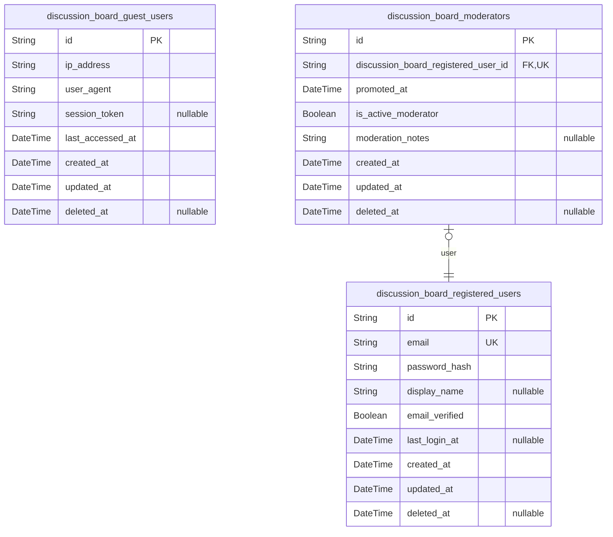
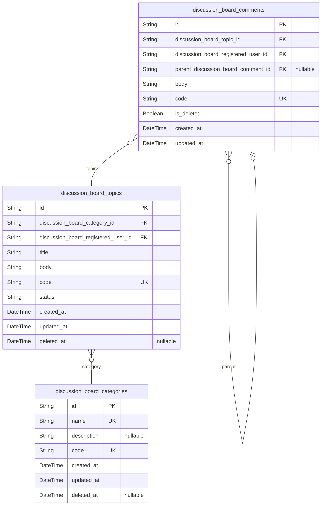
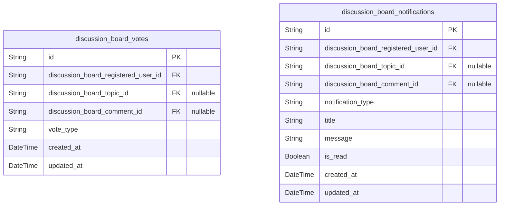
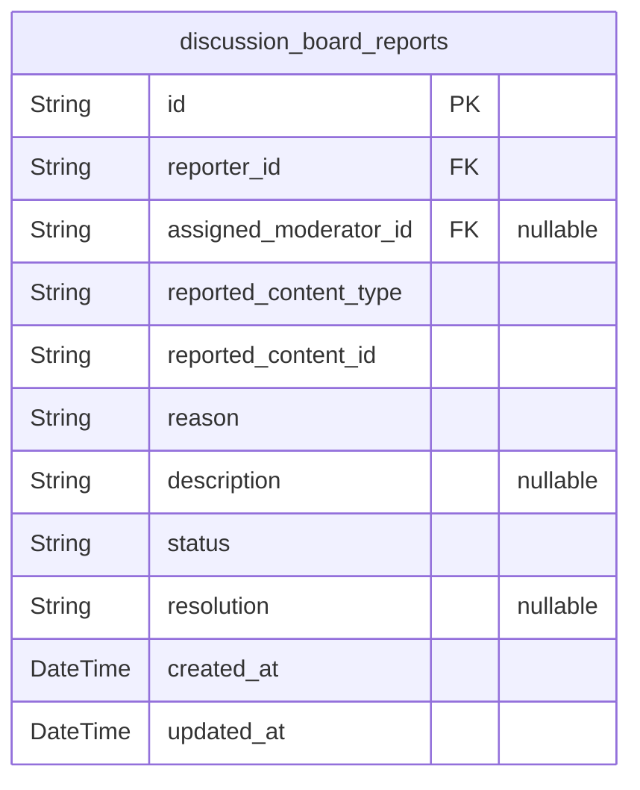

# Prisma Markdown

> Generated by [`prisma-markdown`](https://github.com/samchon/prisma-markdown)

- [Actors](#actors)
- [Discussions](#discussions)
- [Interactions](#interactions)
- [Moderation](#moderation)

## Actors

### `discussion_board_guest_users`

Guest users who can browse public content without authentication. They
provide anonymous access to discussion board content with basic tracking
for session management and user experience monitoring.

Properties as follows:

- `id`: Primary Key.
- `ip_address`
  > IP address of the guest user for anonymous session tracking and security
  > monitoring.
- `user_agent`: Browser user agent string for compatibility and analytics purposes.
- `session_token`
  > Temporary session identifier for tracking guest user interactions across
  > page views.
- `last_accessed_at`: Timestamp of the guest user's last activity on the platform.
- `created_at`: Timestamp when the guest user session was first recorded.
- `updated_at`: Timestamp when the guest user session data was last updated.
- `deleted_at`
  > Soft delete timestamp for guest user tracking, allowing data retention
  > for analytics while marking inactive sessions.

### `discussion_board_registered_users`

Registered users who have completed authentication and can fully
participate in discussion board activities. They can create content,
respond to discussions, vote, and access member-only features with proper
account management.

Properties as follows:

- `id`: Primary Key.
- `email`
  > User's email address for authentication and notifications, must be unique
  > across the platform.
- `password_hash`
  > Hashed password for secure user authentication, stored as encrypted
  > string.
- `display_name`
  > Optional display name shown in discussions and profiles, can be changed
  > by the user.
- `email_verified`
  > Indicates whether the user's email address has been verified through
  > confirmation process.
- `last_login_at`: Timestamp of the user's most recent successful login.
- `created_at`: Timestamp when the user account was created.
- `updated_at`: Timestamp when the user account information was last updated.
- `deleted_at`
  > Soft delete timestamp for user accounts, preserving content attribution
  > while removing access.

### `discussion_board_moderators`

Moderators who have elevated permissions to manage content, users, and
platform operations. They inherit registered user capabilities while
adding administrative tools and oversight responsibilities through
reference to their underlying user account. References {@link
discussion_board_registered_users.id} for authentication and profile
information.

Properties as follows:

- `id`: Primary Key.
- `discussion_board_registered_user_id`
  > Reference to the registered user account this moderator inherits from.
  > [discussion_board_registered_users.id](#discussion_board_registered_users).
- `promoted_at`: Timestamp when the user was promoted to moderator role.
- `is_active_moderator`
  > Indicates whether the moderator account is currently active with full
  > permissions.
- `moderation_notes`: Internal notes for moderator management and performance tracking.
- `created_at`: Timestamp when the moderator account was created.
- `updated_at`: Timestamp when the moderator account information was last updated.
- `deleted_at`
  > Soft delete timestamp for moderator accounts, maintaining audit trail
  > while removing active permissions.

## Discussions

### `discussion_board_categories`

Category system for organizing economic and political discussion topics
into themed groups, enabling filtered browsing and content organization.

Properties as follows:

- `id`: Primary Key.
- `name`
  > Category name for economic or political themes (e.g., 'Economics',
  > 'Politics', 'Policy').
- `description`
  > Detailed description of the category's focus area and acceptable topics
  > within it.
- `code`
  > Unique business identifier for the category, used for URL generation and
  > API filtering.
- `created_at`: Timestamp when the category was created.
- `updated_at`: Timestamp of the last update to the category.
- `deleted_at`: Soft delete timestamp for category removal without data loss.

### `discussion_board_topics`

Core discussion topics created by registered users, serving as containers
for economic and political conversations that can be moderated and
locked.

Properties as follows:

- `id`: Primary Key.
- `discussion_board_category_id`: Category this topic belongs to. [discussion_board_categories.id](#discussion_board_categories).
- `discussion_board_registered_user_id`: Creator of this topic. [discussion_board_registered_users.id](#discussion_board_registered_users).
- `title`: Topic title that summarizes the economic or political discussion.
- `body`: Initial post content explaining the topic and starting the discussion.
- `code`: Unique business identifier generated for the topic URL and referencing.
- `status`: Current status of the topic (active/locked).
- `created_at`: Timestamp when the topic was created.
- `updated_at`: Timestamp of the last update to the topic.
- `deleted_at`: Soft delete timestamp for topic removal without losing discussion history.

### `discussion_board_comments`

Threaded responses to discussion topics, allowing registered users to
participate in economic and political conversations with reply
hierarchies.

Properties as follows:

- `id`: Primary Key.
- `discussion_board_topic_id`: Topic this comment belongs to. [discussion_board_topics.id](#discussion_board_topics).
- `discussion_board_registered_user_id`: Author of this comment. [discussion_board_registered_users.id](#discussion_board_registered_users).
- `parent_discussion_board_comment_id`
  > Parent comment if this is a reply in the thread. {@link
  > discussion_board_comments.id}.
- `body`: Comment text content contributing to the discussion.
- `code`
  > Unique business identifier for the comment, used for referencing and
  > permalinks.
- `is_deleted`
  > Whether this comment is marked as deleted but preserved for discussion
  > context.
- `created_at`: Timestamp when the comment was posted.
- `updated_at`: Timestamp of the last edit to the comment.

## Interactions

### `discussion_board_votes`

User voting interactions on discussion topics and comments, enabling
community-driven content quality assessment and popularity rankings. This
table captures upvote/downvote actions to promote high-quality economic
and political discussions while maintaining audit trails of user
engagement.

Properties as follows:

- `id`: Primary Key.
- `discussion_board_registered_user_id`: Voted user's discussion_board_registered_users.id
- `discussion_board_topic_id`: Target topic's discussion_board_topics.id
- `discussion_board_comment_id`: Target comment's discussion_board_comments.id
- `vote_type`
  > Type of vote (upvote or downvote) indicating user sentiment and
  > contribution quality.
- `created_at`: Timestamp when the vote was cast to track user engagement timing.
- `updated_at`: Last modification timestamp for audit purposes.

### `discussion_board_notifications`

User notification system for discussion board activities, including new
comments, votes, and system announcements. This table manages
personalized alerts to keep registered users engaged with relevant
economic and political topic discussions, supporting both real-time and
digest delivery options.

Properties as follows:

- `id`: Primary Key.
- `discussion_board_registered_user_id`: Recipient user's discussion_board_registered_users.id
- `discussion_board_topic_id`: Related topic's discussion_board_topics.id
- `discussion_board_comment_id`: Related comment's discussion_board_comments.id
- `notification_type`
  > Category of notification (comment_reply, topic_update, vote_received,
  > moderation_action, system_announcement) to organize user alerts by
  > importance.
- `title`: Brief descriptive title for the notification displayed in user interfaces.
- `message`
  > Detailed notification content providing context and actionable
  > information about discussion activities.
- `is_read`
  > Whether the user has viewed this notification to enable unread count
  > tracking.
- `created_at`
  > Timestamp when the notification was generated to maintain chronological
  > order.
- `updated_at`: Last modification timestamp for status updates.

## Moderation

### `discussion_board_reports`

User-generated reports on content that may violate community standards in
economic and political discussions. This table captures detailed
information about reported content, including the reporter, reported
item, reason, and moderation status. [discussion_board_topics](#discussion_board_topics)
[discussion_board_comments](#discussion_board_comments)

Properties as follows:

- `id`: Primary Key.
- `reporter_id`
  > Reporter's [discussion_board_registered_users.id](#discussion_board_registered_users) who submitted the
  > report.
- `assigned_moderator_id`
  > Assigned moderator's [discussion_board_moderators.id](#discussion_board_moderators) handling this
  > report.
- `reported_content_type`: Type of content being reported (topic or comment).
- `reported_content_id`: ID of the reported topic or comment.
- `reason`: Reason for the report (spam, inappropriate, harassment, etc.).
- `description`: Detailed description of the reported issue.
- `status`: Current status of the report (pending, in_review, resolved, dismissed).
- `resolution`: Resolution details provided by the moderator.
- `created_at`: Timestamp when the report was created.
- `updated_at`: Timestamp when the report was last updated.
