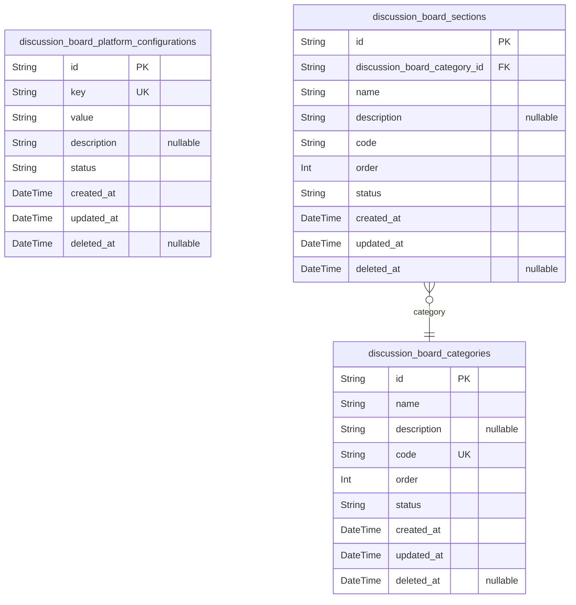
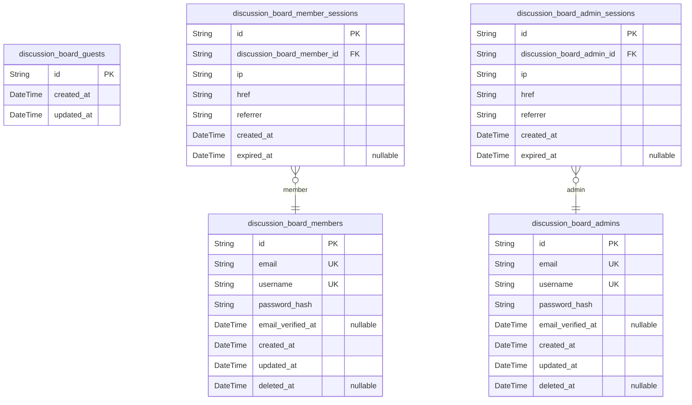
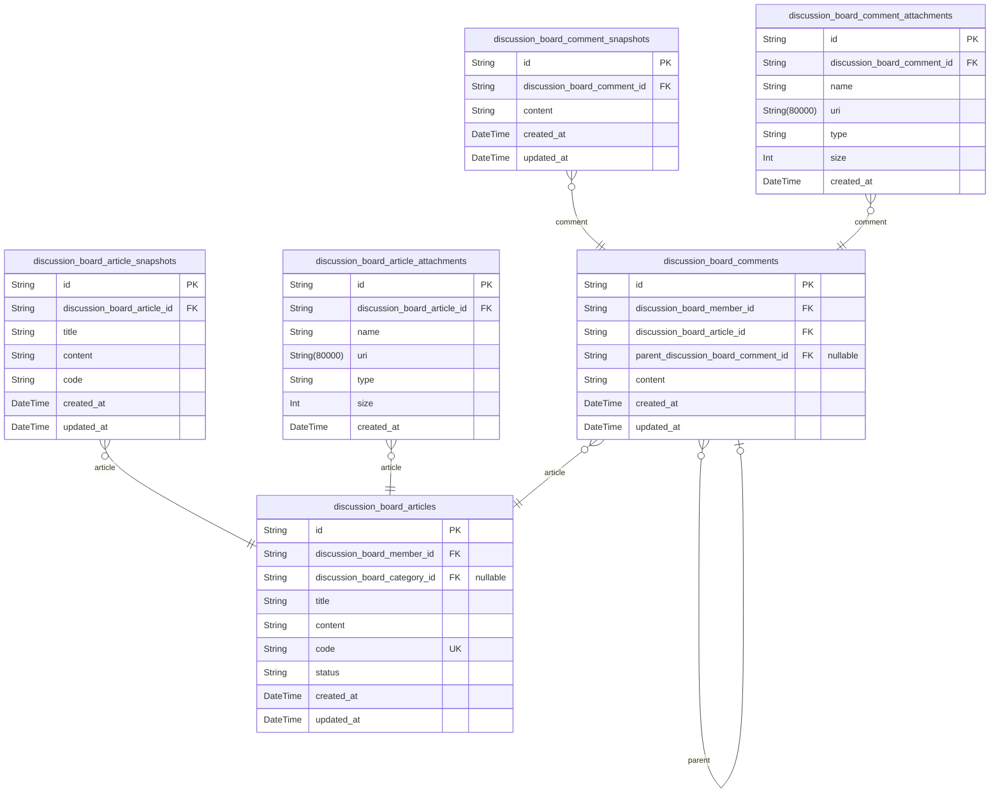

# Prisma Markdown

> Generated by [`prisma-markdown`](https://github.com/samchon/prisma-markdown)

- [Systematic](#systematic)
- [Actors](#actors)
- [Content](#content)

## Systematic

```mermaid
erDiagram
"discussion_board_platform_configurations" {
  String id PK
  String key UK
  String value
  String description "nullable"
  String status
  DateTime created_at
  DateTime updated_at
  DateTime deleted_at "nullable"
}
"discussion_board_categories" {
  String id PK
  String name
  String description "nullable"
  String code UK
  Int order
  String status
  DateTime created_at
  DateTime updated_at
  DateTime deleted_at "nullable"
}
"discussion_board_sections" {
  String id PK
  String discussion_board_category_id FK
  String name
  String description "nullable"
  String code
  Int order
  String status
  DateTime created_at
  DateTime updated_at
  DateTime deleted_at "nullable"
}
"discussion_board_sections" }o--|| "discussion_board_categories" : category
```

### `discussion_board_platform_configurations`

Platform-wide configuration settings and system parameters that control
the behavior of the discussion board service.

This table stores key-value configuration pairs that define how the
economic and political discussion platform operates globally.
Configurations include settings for article limits, attachment sizes,
notification preferences, moderation policies, and other system-wide
parameters that influence platform behavior.

Configuration entries are referenced by system components but not
directly queried by users. Changes to configurations require
administrative approval and may trigger platform-wide updates for
immediate or delayed application.

The configuration system supports different data types (strings, numbers,
booleans) stored as string values with appropriate parsing when
retrieved, allowing flexible system administration without database
migrations for new settings.

Soft deletion is supported to maintain audit trails when configuration
values change over time.

Properties as follows:

- `id`: Primary Key.
- `key`
  > Configuration key identifier, used to lookup specific settings throughout
  > the platform.
- `value`
  > Configuration value content, stored as string but may represent different
  > data types when interpreted.
- `description`
  > Human-readable description explaining the purpose and format of this
  > configuration setting.
- `status`
  > Current status of the configuration, either active for live use or
  > inactive for deprecated settings.
- `created_at`: Timestamp when this configuration was initially created.
- `updated_at`: Timestamp when this configuration was last modified.
- `deleted_at`
  > Soft deletion timestamp for audit trails, allowing recovery of historical
  > configurations.

### `discussion_board_categories`

Primary categorization system for organizing economic and political
discussion content within the platform.

Categories represent the top-level organizational structure that users
interact with directly when creating and browsing articles. They provide
clear segmentation between economic topics (finance, markets, policy) and
political topics (legislation, international relations, current events),
helping users find relevant content and encouraging focused discussions.

Categories are prominently displayed in navigation menus and search
filters, serving as primary entry points for content discovery. Each
category can contain multiple sections for further subdivision while
maintaining meaningful boundaries.

Category definitions include display names, descriptions, and unique
codes for internationalization support. Status management allows for
seasonal or contextual category activation/deactivation without data
loss.

Properties as follows:

- `id`: Primary Key.
- `name`: Display name of the category for user interface presentation.
- `description`
  > Detailed description explaining the category's scope and what type of
  > content belongs here.
- `code`
  > Unique identifier code used for URL routing and internationalization key
  > mapping.
- `order`: Display ordering for navigation menus, with lower numbers appearing first.
- `status`
  > Current operational status of the category, either active for user access
  > or inactive for archival.
- `created_at`: Timestamp when this category was initially created.
- `updated_at`: Timestamp when this category was last modified.
- `deleted_at`: Soft deletion timestamp for archival categories that are no longer active.

### `discussion_board_sections`

Subsidiary organizational units that provide finer-grained grouping
within discussion categories.

Sections exist to support the primary categorization system by allowing
sub-divisions within broader topics. For example, an 'Economy' category
might contain sections for 'Stock Markets', 'Cryptocurrency', 'Fiscal
Policy', and 'Labor Markets', enabling users to dive deeper into specific
sub-topics while still maintaining connection to the parent category.

Sections are managed through their parent categories and provide
additional search and filtering granularity. They help balance between
having too few broad categories and too many unwieldy small ones,
improving content discoverability.

While sections are subsidiary to categories, they still require unique
identification for proper referencing by articles and maintaining
consistent organization throughout discussion threads.

Properties as follows:

- `id`: Primary Key.
- `discussion_board_category_id`: Belonged category's discussion_board_categories.id.
- `name`: Display name of the section for user interface presentation.
- `description`
  > Detailed description explaining the section's scope and content
  > boundaries.
- `code`
  > Unique identifier code within the parent category for URL routing and
  > reference.
- `order`
  > Display ordering within the parent category, with lower numbers appearing
  > first.
- `status`: Current operational status of the section, either active or inactive.
- `created_at`: Timestamp when this section was initially created.
- `updated_at`: Timestamp when this section was last modified.
- `deleted_at`: Soft deletion timestamp for archival sections that are no longer active.

## Actors

```mermaid
erDiagram
"discussion_board_guests" {
  String id PK
  DateTime created_at
  DateTime updated_at
}
"discussion_board_members" {
  String id PK
  String email UK
  String username UK
  String password_hash
  DateTime email_verified_at "nullable"
  DateTime created_at
  DateTime updated_at
  DateTime deleted_at "nullable"
}
"discussion_board_member_sessions" {
  String id PK
  String discussion_board_member_id FK
  String ip
  String href
  String referrer
  DateTime created_at
  DateTime expired_at "nullable"
}
"discussion_board_admins" {
  String id PK
  String email UK
  String username UK
  String password_hash
  DateTime email_verified_at "nullable"
  DateTime created_at
  DateTime updated_at
  DateTime deleted_at "nullable"
}
"discussion_board_admin_sessions" {
  String id PK
  String discussion_board_admin_id FK
  String ip
  String href
  String referrer
  DateTime created_at
  DateTime expired_at "nullable"
}
"discussion_board_member_sessions" }o--|| "discussion_board_members" : member
"discussion_board_admin_sessions" }o--|| "discussion_board_admins" : admin
```

### `discussion_board_guests`

Anonymous visitors who browse and view public articles and discussions
without requiring authentication or account creation.

Guests represent the primary audience for the discussion board content,
consuming economic and political analysis through articles and threaded
comments. They provide implicit feedback through browsing patterns and
serve as potential conversion points to member registration.

While guests cannot create content or participate in discussions, their
access patterns help inform content strategy and platform optimization
for the economic discussion community.

Properties as follows:

- `id`: Primary Key.
- `created_at`: Timestamp when the guest first accessed the platform.
- `updated_at`: Timestamp of the last access or activity.

### `discussion_board_members`

Registered users who can actively participate in discussions by creating
articles, posting comments, and managing their contributions to the
economic and political discourse.

Members create the primary content for the discussion board, sharing
their insights through comprehensive articles supported by image and file
attachments. They engage in threaded discussions, report inappropriate
content, and build community reputation through quality contributions.

All members must verify their email address before gaining full
publishing capabilities, ensuring a baseline of account authenticity for
the serious content standards of the platform.

Properties as follows:

- `id`: Primary Key.
- `email`
  > Email address used for registration, password reset, and platform
  > notifications. Must be unique and verified before article publishing.
- `username`
  > Unique username for public display in articles and comments. Follows
  > platform naming conventions.
- `password_hash`
  > Hashed password for secure authentication. Generated from user-provided
  > password during registration.
- `email_verified_at`: Timestamp when email verification was completed, null until verified.
- `created_at`: Timestamp when the member account was created.
- `updated_at`: Timestamp of the last account update or activity.
- `deleted_at`: Soft delete timestamp for account deactivation.

### `discussion_board_member_sessions`

Session records for authenticated member logins, tracking access patterns
and supporting account security for discussion board members.

Each member login creates a session record that maintains authentication
state across browser refreshes and page navigation. Sessions expire after
30 days of inactivity to ensure continuous security for the economic and
political discussion platform.

Session tracking enables activity monitoring, security enforcement, and
helps identify authorized access patterns during content creation and
discussion participation.

Properties as follows:

- `id`: Primary Key.
- `discussion_board_member_id`
  > Belonged member who initiated this session. {@link
  > discussion_board_members.id}
- `ip`: IP address of the connection.
- `href`: URL where the session was initiated.
- `referrer`: Referrer URL for tracking session origin.
- `created_at`: Session creation timestamp.
- `expired_at`: Session expiration timestamp.

### `discussion_board_admins`

Privileged users responsible for system governance, content moderation,
and user management to ensure the discussion board operates effectively
and safely.

Administrators maintain platform quality and enforce community standards
for economic and political discourse through comprehensive moderation
powers. They review flagged content, manage user accounts, and access
advanced analytics to support healthy community growth.

Admin accounts follow the same registration pattern as members but
include enhanced permissions for moderation, user management, and system
configuration access.

Properties as follows:

- `id`: Primary Key.
- `email`
  > Email address used for registration, password reset, and admin
  > notifications. Must be unique and verified.
- `username`
  > Unique username for admin display in moderation logs. Follows platform
  > naming conventions.
- `password_hash`
  > Hashed password for secure admin authentication. Generated from
  > user-provided password.
- `email_verified_at`: Timestamp when email verification was completed, null until verified.
- `created_at`: Timestamp when the admin account was created.
- `updated_at`: Timestamp of the last admin activity or account update.
- `deleted_at`: Soft delete timestamp for admin account deactivation.

### `discussion_board_admin_sessions`

Session records for authenticated admin logins, tracking access patterns
and supporting enhanced security for administrative system access.

Each admin login creates a privileged session that enables content
moderation, user management, and system configuration. Sessions expire
after 30 days of inactivity to protect sensitive administrative
functions.

Session tracking provides audit trails for administrative actions,
security monitoring for privileged access, and supports secure management
operations within the economic and political discussion platform.

Properties as follows:

- `id`: Primary Key.
- `discussion_board_admin_id`
  > Belonged admin who initiated this session. {@link
  > discussion_board_admins.id}
- `ip`: IP address of the admin connection.
- `href`: URL where the admin session was initiated.
- `referrer`: Referrer URL for tracking admin session origin.
- `created_at`: Session creation timestamp.
- `expired_at`: Session expiration timestamp.

## Content

```mermaid
erDiagram
"discussion_board_articles" {
  String id PK
  String discussion_board_member_id FK
  String discussion_board_category_id FK "nullable"
  String title
  String content
  String code UK
  String status
  DateTime created_at
  DateTime updated_at
}
"discussion_board_article_snapshots" {
  String id PK
  String discussion_board_article_id FK
  String title
  String content
  String code
  DateTime created_at
  DateTime updated_at
}
"discussion_board_article_attachments" {
  String id PK
  String discussion_board_article_id FK
  String name
  String(80000) uri
  String type
  Int size
  DateTime created_at
}
"discussion_board_comments" {
  String id PK
  String discussion_board_member_id FK
  String discussion_board_article_id FK
  String parent_discussion_board_comment_id FK "nullable"
  String content
  DateTime created_at
  DateTime updated_at
}
"discussion_board_comment_snapshots" {
  String id PK
  String discussion_board_comment_id FK
  String content
  DateTime created_at
  DateTime updated_at
}
"discussion_board_comment_attachments" {
  String id PK
  String discussion_board_comment_id FK
  String name
  String(80000) uri
  String type
  Int size
  DateTime created_at
}
"discussion_board_article_snapshots" }o--|| "discussion_board_articles" : article
"discussion_board_article_attachments" }o--|| "discussion_board_articles" : article
"discussion_board_comments" }o--|| "discussion_board_articles" : article
"discussion_board_comments" }o--o| "discussion_board_comments" : parent
"discussion_board_comment_snapshots" }o--|| "discussion_board_comments" : comment
"discussion_board_comment_attachments" }o--|| "discussion_board_comments" : comment
```

### `discussion_board_articles`

Main article entities containing user-created content on economic and
political topics.

This table stores the core article data including titles, content, and
metadata. Articles serve as the primary content units that users create
to share analysis and opinions on economic trends and political events,
forming the foundation of the discussion ecosystem.

Each article is authored by a registered member and can be organized into
categories for topic organization. The table supports the complete
article lifecycle with rich text content and file attachments support.

Properties as follows:

- `id`: Primary Key.
- `discussion_board_member_id`: Member who authored the article. [discussion_board_members.id](#discussion_board_members)
- `discussion_board_category_id`
  > Category classification for the article. {@link
  > discussion_board_categories.id}
- `title`: Article title for clear topic identification.
- `content`: Article main content in rich text format.
- `code`: Unique business identifier for stable referencing.
- `status`: Publication status of the article. Valid values: draft, published.
- `created_at`: Article creation timestamp.
- `updated_at`: Last modification timestamp.

### `discussion_board_article_snapshots`

Historical snapshots of article states for audit trails and change tracking.

This table captures point-in-time versions of articles whenever they are
modified, preserving the complete state including title, content,
category assignments, and all associated metadata for transparency in
content evolution.

Snapshots are created automatically during edits, maintaining an
immutable record of changes that supports moderation and historical
analysis of economic and political discussions.

Properties as follows:

- `id`: Primary Key.
- `discussion_board_article_id`: Parent article being snapshotted. [discussion_board_articles.id](#discussion_board_articles)
- `title`: Snapshot of article title at point in time.
- `content`: Snapshot of article content at point in time.
- `code`: Business identifier as in snapshot.
- `created_at`: Original article creation time.
- `updated_at`: Snapshot creation timestamp.

### `discussion_board_article_attachments`

Supporting files attached to articles for comprehensive content
presentation.

This table manages file attachments that accompany articles, storing
metadata about uploaded files while keeping actual files in separate
storage for scalability.

Attachments are subsidiary to articles and include various file types as
specified in requirements, supporting the enrichment of economic and
political analyses with documents and media.

Properties as follows:

- `id`: Primary Key.
- `discussion_board_article_id`: Attached article. [discussion_board_articles.id](#discussion_board_articles)
- `name`: Original file name for user identification.
- `uri`: Secure access URI for file downloading.
- `type`: File MIME type for proper handling.
- `size`: File size in bytes for display.
- `created_at`: Attachment upload timestamp.

### `discussion_board_comments`

Primary discussion entities for threaded conversations on articles.

This table stores user comments and replies that form the discussion
ecosystem beneath articles, enabling structured dialogue on economic and
political topics.

Comments are authored by members and can form threaded reply structures,
supporting nested conversations with optional attachments for
comprehensive discussion contributions.

Properties as follows:

- `id`: Primary Key.
- `discussion_board_member_id`: Comment author. [discussion_board_members.id](#discussion_board_members)
- `discussion_board_article_id`: Article this comment belongs to. [discussion_board_articles.id](#discussion_board_articles)
- `parent_discussion_board_comment_id`: Parent comment for reply threading. [discussion_board_comments.id](#discussion_board_comments)
- `content`: Comment text content.
- `created_at`: Comment creation timestamp.
- `updated_at`: Last modification timestamp.

### `discussion_board_comment_snapshots`

Historical snapshots of comment states for change tracking in discussions.

This table captures point-in-time versions of comments during edits,
preserving content evolution and supporting moderation of threaded
conversations.

Snapshots maintain the integrity of discussion threads by tracking
changes to individual comments and their reply structures within the
economic and political discourse.

Properties as follows:

- `id`: Primary Key.
- `discussion_board_comment_id`: Parent comment being snapshotted. [discussion_board_comments.id](#discussion_board_comments)
- `content`: Snapshot of comment content at point in time.
- `created_at`: Original comment creation time.
- `updated_at`: Snapshot creation timestamp.

### `discussion_board_comment_attachments`

Supporting files attached to comments for enhanced discussion contributions.

This table manages file attachments that accompany individual comments,
storing metadata for uploaded files while enabling richer discussion
interactions.

Comment attachments are subsidiary to comments and support the same file
types as article attachments, allowing members to include relevant
documents in their discussion points.

Properties as follows:

- `id`: Primary Key.
- `discussion_board_comment_id`: Attached comment. [discussion_board_comments.id](#discussion_board_comments)
- `name`: Original file name for user identification.
- `uri`: Secure access URI for file downloading.
- `type`: File MIME type for proper handling.
- `size`: File size in bytes for display.
- `created_at`: Attachment upload timestamp.
