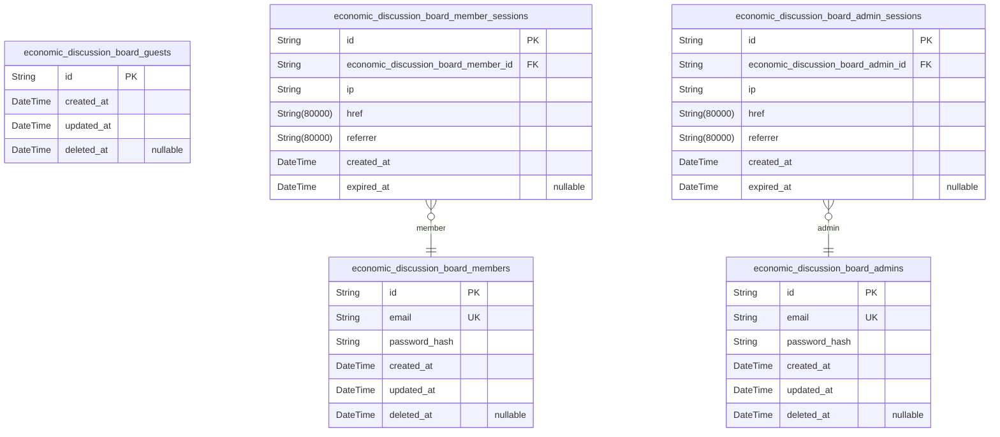
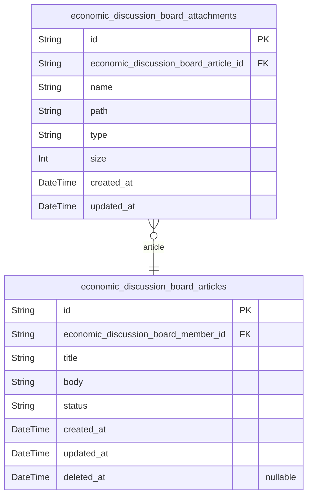
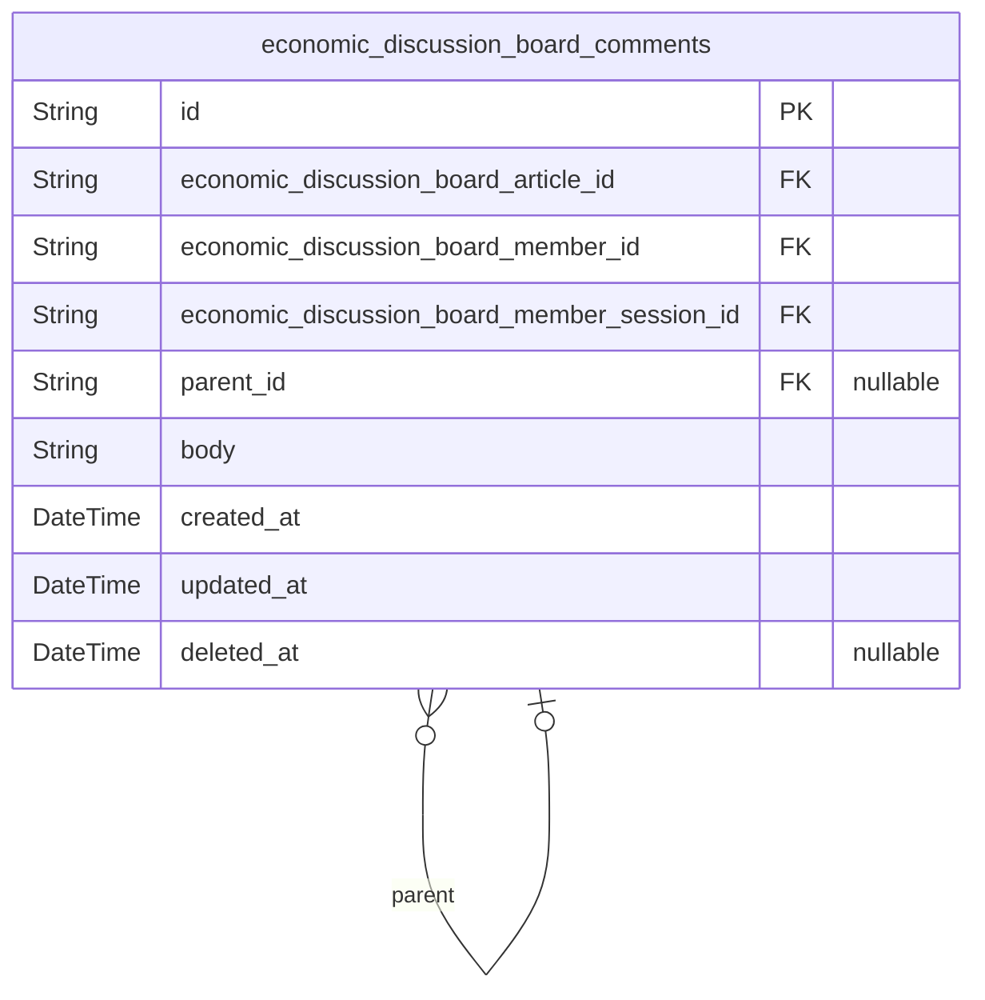

# Prisma Markdown

> Generated by [`prisma-markdown`](https://github.com/samchon/prisma-markdown)

- [Actors](#actors)
- [Articles](#articles)
- [Comments](#comments)

## Actors

```mermaid
erDiagram
"economic_discussion_board_guests" {
  String id PK
  DateTime created_at
  DateTime updated_at
  DateTime deleted_at "nullable"
}
"economic_discussion_board_members" {
  String id PK
  String email UK
  String password_hash
  DateTime created_at
  DateTime updated_at
  DateTime deleted_at "nullable"
}
"economic_discussion_board_admins" {
  String id PK
  String email UK
  String password_hash
  DateTime created_at
  DateTime updated_at
  DateTime deleted_at "nullable"
}
"economic_discussion_board_member_sessions" {
  String id PK
  String economic_discussion_board_member_id FK
  String ip
  String(80000) href
  String(80000) referrer
  DateTime created_at
  DateTime expired_at "nullable"
}
"economic_discussion_board_admin_sessions" {
  String id PK
  String economic_discussion_board_admin_id FK
  String ip
  String(80000) href
  String(80000) referrer
  DateTime created_at
  DateTime expired_at "nullable"
}
"economic_discussion_board_member_sessions" }o--|| "economic_discussion_board_members" : member
"economic_discussion_board_admin_sessions" }o--|| "economic_discussion_board_admins" : admin
```

### `economic_discussion_board_guests`

Anonymous guest users who can browse and view published articles,
comments, and attachments without requiring authentication or
registration. Guests represent the general public accessing economic and
political discussion content. This table tracks guest-level interactions
and access patterns for platform analytics, though guests have no
personal information or managed entities.

Properties as follows:

- `id`: Primary Key.
- `created_at`: Timestamp when the guest record was created for tracking access patterns.
- `updated_at`: Timestamp when the guest record was last updated.
- `deleted_at`: Soft delete timestamp to mark inactive guest records.

### `economic_discussion_board_members`

Registered member users who can create articles with attachments, post
comments, and participate actively in economic and political discussions.
Members have authenticated accounts with secure password-based login and
can manage their own content independently. They represent the core
community of contributors who require email verification and session
management for platform access and content creation permissions.

Properties as follows:

- `id`: Primary Key.
- `email`
  > Member's email address used for authentication and account management.
  > Must be unique across all members.
- `password_hash`
  > Hashed password for secure authentication. Stored using industry-standard
  > hashing algorithms.
- `created_at`: Timestamp when the member account was created.
- `updated_at`: Timestamp when the member account was last updated.
- `deleted_at`
  > Soft delete timestamp to mark deactivated member accounts while
  > preserving content history.

### `economic_discussion_board_admins`

Administrator users with elevated permissions to manage platform content,
moderate inappropriate material, and oversee user accounts. Admins have
authenticated accounts with secure login and can perform administrative
actions across all platform content including articles, comments, and
user management. They maintain platform integrity and community standards
through content review and moderation capabilities.

Properties as follows:

- `id`: Primary Key.
- `email`
  > Administrator's email address used for authentication and account
  > management. Must be unique across all administrators.
- `password_hash`
  > Hashed password for secure authentication. Stored using industry-standard
  > hashing algorithms.
- `created_at`: Timestamp when the administrator account was created.
- `updated_at`: Timestamp when the administrator account was last updated.
- `deleted_at`: Soft delete timestamp to mark removed administrator accounts.

### `economic_discussion_board_member_sessions`

Authentication sessions for member users, tracking login activity and
connection details for security monitoring and audit purposes. Sessions
are managed through member login/logout processes and include connection
metadata for platform security. Each session expires after inactivity or
explicit logout, ensuring secure access control for member accounts.

Properties as follows:

- `id`: Primary Key.
- `economic_discussion_board_member_id`: Belonged member's [economic_discussion_board_members.id](#economic_discussion_board_members).
- `ip`: IP address from which the member logged in.
- `href`: URL where the login session originated.
- `referrer`: Referrer URL for tracking login source.
- `created_at`: Timestamp when the session was created at login.
- `expired_at`: Timestamp when the session expired or was terminated.

### `economic_discussion_board_admin_sessions`

Authentication sessions for administrator users, recording login details
and administrative access for security auditing and system monitoring.
Admin sessions track critical platform access and include connection
information for compliance and security review. Sessions automatically
expire and are audited for administrative accountability.

Properties as follows:

- `id`: Primary Key.
- `economic_discussion_board_admin_id`: Belonged admin's [economic_discussion_board_admins.id](#economic_discussion_board_admins).
- `ip`: IP address from which the administrator logged in.
- `href`: URL where the administrative login originated.
- `referrer`: Referrer URL for tracking administrative login source.
- `created_at`: Timestamp when the administrative session was created.
- `expired_at`: Timestamp when the administrative session expired.

## Articles

```mermaid
erDiagram
"economic_discussion_board_articles" {
  String id PK
  String economic_discussion_board_member_id FK
  String title
  String body
  String status
  DateTime created_at
  DateTime updated_at
  DateTime deleted_at "nullable"
}
"economic_discussion_board_attachments" {
  String id PK
  String economic_discussion_board_article_id FK
  String name
  String path
  String type
  Int size
  DateTime created_at
  DateTime updated_at
}
"economic_discussion_board_attachments" }o--|| "economic_discussion_board_articles" : article
```

### `economic_discussion_board_articles`

Core content unit where members publish articles on economic and
political topics. Each article serves as the foundation for discussion,
containing title and body text that can be enhanced with various
attachments for supporting evidence and data.

Properties as follows:

- `id`: Primary Key.
- `economic_discussion_board_member_id`
  > Authenticated member who created this article. {@link
  > economic_discussion_board_members.id}
- `title`: Article title limited to 200 characters for concise topic identification.
- `body`
  > Main article content supporting rich text formatting and up to 10,000
  > characters for comprehensive economic analysis.
- `status`
  > Publication status indicating article state: draft, pending (awaiting
  > moderation), published (visible to all), rejected (moderation denied).
- `created_at`: Timestamp when the article was first created.
- `updated_at`: Timestamp when the article was last modified.
- `deleted_at`: Soft delete timestamp for removed articles.

### `economic_discussion_board_attachments`

Supporting materials attached to articles, including images and documents
that provide visual evidence or data sources for economic discussions.
Each attachment belongs to exactly one article.

Properties as follows:

- `id`: Primary Key.
- `economic_discussion_board_article_id`
  > Associated article this attachment supports. {@link
  > economic_discussion_board_articles.id}
- `name`: Original filename of the uploaded attachment.
- `path`: Storage path or URL where the attachment file is located.
- `type`: File type of the attachment (e.g., 'image/jpeg', 'application/pdf').
- `size`: File size in bytes for storage management.
- `created_at`: Timestamp when the attachment was uploaded.
- `updated_at`: Timestamp when the attachment was last modified.

## Comments

```mermaid
erDiagram
"economic_discussion_board_comments" {
  String id PK
  String economic_discussion_board_article_id FK
  String economic_discussion_board_member_id FK
  String economic_discussion_board_member_session_id FK
  String parent_id FK "nullable"
  String body
  DateTime created_at
  DateTime updated_at
  DateTime deleted_at "nullable"
}
"economic_discussion_board_comments" }o--o| "economic_discussion_board_comments" : parent
```

### `economic_discussion_board_comments`

User comments on published articles enabling threaded discussions and
community engagement. Each comment belongs to a specific article and is
created by an authenticated member through their active session. Comments
can have parent references to create nested reply threads up to 3 levels
deep. Members can edit their own comments after posting, and
administrators can moderate inappropriate content through soft deletion.
Comments appear immediately upon submission but may be moderated by
admins, maintaining chronological ordering within discussion threads.

Properties as follows:

- `id`: Primary Key.
- `economic_discussion_board_article_id`: Belonged article's [economic_discussion_board_articles.id](#economic_discussion_board_articles).
- `economic_discussion_board_member_id`: Commented member's [economic_discussion_board_members.id](#economic_discussion_board_members).
- `economic_discussion_board_member_session_id`
  > Belonged member's authentication session's {@link
  > economic_discussion_board_member_sessions.id}.
- `parent_id`
  > Parent comment's [economic_discussion_board_comments.id](#economic_discussion_board_comments) for
  > threaded replies.
- `body`
  > Comment text content with maximum length of 2000 characters for
  > meaningful discussion contributions.
- `created_at`: Timestamp when the comment was first created and published.
- `updated_at`: Timestamp when the comment was last modified by the author.
- `deleted_at`
  > Soft delete timestamp for moderated content removal while preserving
  > audit trails.
