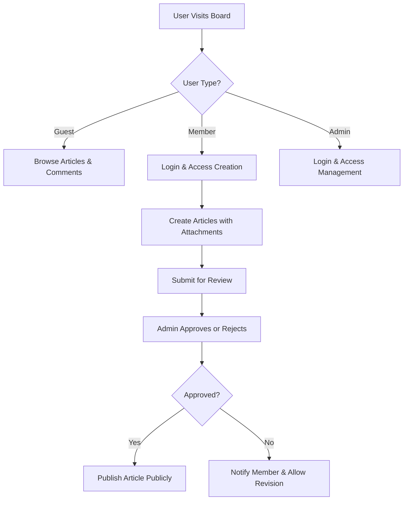

# Business Requirements for Economic Discussion Board

## Introduction

The economic discussion board serves as an online platform where individuals can create and participate in discussions about economic and political topics. The core purpose is to facilitate informed exchanges of ideas while maintaining a respectful and constructive environment. Users can share articles, attach relevant images and files, and engage through comments. The system supports different user roles: guests who can view content, members who can create and comment, and administrators who can manage and moderate the platform.

These requirements focus entirely on business functionality and user interactions, describing what the discussion board should do without specifying technical implementation details.

## Article Management

Articles form the foundation of the discussion board, representing the main content that users create and share. Each article should include a title, content body, and optional attachments.

THE discussion board SHALL allow members to create new articles.

WHEN a member submits an article, THE discussion board SHALL validate the article content and attachments.

WHEN an article is approved, THE discussion board SHALL make it visible to all users.

WHEN a member edits their own article, THE discussion board SHALL save the changes and maintain the original publication date.

WHEN a user views an article, THE discussion board SHALL display the full content, attachments, and associated comments.

Articles SHALL be created through a member-only interface that requires authentication before submission. The creation process includes entering the article title (limited to 200 characters), writing the main content in a rich text format, adding optional topic tags for categorization, and attaching supporting files or images. Before publishing, members can preview how the article will appear to readers, including the display of inline images and a list of downloadable attachments.

## Attachment Support

Articles can include attachments such as images and files to enhance discussions with visual evidence or additional documentation.

THE discussion board SHALL support image attachments to articles.

THE discussion board SHALL support file attachments such as documents and spreadsheets to articles.

WHEN adding attachments to an article, THE discussion board SHALL process images and files appropriately for viewing.

WHEN a user downloads an attachment, THE discussion board SHALL provide the original file.

Attachment management SHALL handle various file types including JPEG, PNG, GIF for images, and PDF, DOC, DOCX, XLS, XLSX for documents. The system SHALL limit each attachment to a maximum size of 10MB and allow up to 10 attachments per article. Images SHALL be displayed inline within the article content while document attachments SHALL be available for download with appropriate file type indicators.

## Comment System

Comments enable users to respond to articles and engage in discussions.

THE discussion board SHALL allow members to comment on published articles.

WHEN a member submits a comment, THE discussion board SHALL validate the comment content.

WHEN an admin approves a comment, THE discussion board SHALL display it under the article.

WHEN a member edits their own comment, THE discussion board SHALL save the changes and indicate the edit.

WHEN a user views an article, THE discussion board SHALL show all approved comments in chronological order.

Comments SHALL be limited to 1,000 characters and SHALL be associated with the authenticated member account. Users can reply to specific comments to create threaded discussions, and administrators can moderate comments by approving, editing, or removing inappropriate content. The system SHALL notify article authors when new comments are posted.

## User Permissions

Different user roles have specific permissions to maintain order and functionality on the board.

WHERE a user is a guest, THE discussion board SHALL allow viewing of published articles and comments.

WHERE a user is a guest, THE discussion board SHALL not allow creation or modification of any content.

WHERE a user is a member, THE discussion board SHALL allow creation of articles with attachments and commenting on articles.

WHERE a user is a member, THE discussion board SHALL allow editing of their own articles and comments.

WHERE a user is an admin, THE discussion board SHALL allow management of all articles, comments, and users.

WHERE a user is an admin, THE discussion board SHALL allow moderation actions including approval and removal of content.

Members SHALL have full access to create new content, edit their existing contributions within a 24-hour window, and participate in discussions. Administrators SHALL have override permissions on all content, including the ability to unpublish inappropriate articles, delete harmful comments, and manage user accounts. Guest users SHALL have read-only access to browse content without registration.

## Security Requirements

The discussion board must protect user data and maintain a safe environment for discussions.

THE discussion board SHALL protect user account information and content from unauthorized access.

THE discussion board SHALL validate user identities before allowing content creation.

THE discussion board SHALL prevent inappropriate or harmful content from being published.

All user authentication SHALL require secure login processes with encrypted passwords. Content moderation SHALL include automatic filtering for spam and abusive language, with human administrator review for borderline cases. User data SHALL be protected according to privacy standards, and content SHALL be routinely backed up to prevent loss.

## Performance Expectations

The discussion board should provide a responsive user experience suitable for online discussions.

WHEN a user logs in, THE discussion board SHALL respond instantly.

WHEN a user views an article, THE discussion board SHALL display the content within seconds.

WHEN a user submits a comment, THE discussion board SHALL process and store it within seconds.

WHEN a user uploads an attachment, THE discussion board SHALL handle the upload and show progress appropriately.

WHEN searching for articles, THE discussion board SHALL return results instantly for common queries.

THE discussion board SHALL handle multiple simultaneous users viewing and commenting.

Login and authentication SHALL complete in under 2 seconds. Article viewing SHALL load content within 3 seconds including attachments. Comment submissions SHALL be processed immediately with real-time updates. File uploads SHALL provide progress feedback and complete within reasonable times based on file size. Search functions SHALL return results under 1 second for cached queries.

## Error Handling

Users should receive clear feedback when operations fail or inappropriate actions are attempted.

IF a guest attempts to create an article, THEN THE discussion board SHALL deny the action and display a clear message about requiring membership.

IF a member submits inappropriate content, THEN THE discussion board SHALL reject the submission and show a message about content policies.

IF an attachment upload fails, THEN THE discussion board SHALL inform the user and allow retry.

IF network connectivity is lost, THEN THE discussion board SHALL show appropriate messages and allow recovery when connection is restored.

IF a user enters invalid data when editing, THEN THE discussion board SHALL highlight the errors and prevent saving until corrected.

Error handling SHALL include specific validation messages for common issues such as invalid file types, exceeded size limits, inappropriate language, and network problems. Users SHALL be guided on how to correct errors, and the system SHALL provide recovery options where possible.

## Business Rules

The discussion board operates under specific rules to maintain quality and appropriateness of economic and political discussions.

Articles SHALL focus on economic and political topics and SHALL be appropriate for open discussion.

Article content SHALL be limited to reasonable lengths to maintain readability.

Comments SHALL be relevant to the article topic and SHALL follow discussion guidelines.

Attachments SHALL be directly related to the article content and SHALL not exceed reasonable size limits.

Users SHALL provide accurate information when registering accounts.

Content SHALL undergo moderation to ensure it meets community standards.

Political discussions SHALL remain civil and evidence-based to foster constructive dialogue.

Articles SHALL be substantive, with minimum content requirements. Comments SHALL be on-topic and polite. Attachments SHALL support the discussion rather than distract from it. User accounts SHALL require verification to prevent abuse. All content SHALL be reviewed for appropriateness before publication.

