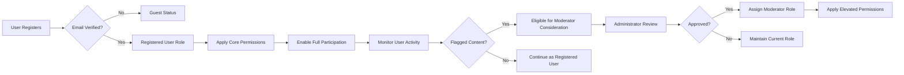

# User Roles and Authentication for Economic/Political Discussion Board

## User Role Overview

The economic/political discussion board platform operates with three distinct user role categories, each serving specific purposes in facilitating community discussions while maintaining content quality and user safety. These roles establish the foundation for authentication and access control throughout the system.

### Guest User Role
The guest user represents unauthenticated visitors who can explore the platform's content without requiring registration. This role is designed to allow potential members to browse discussions, assess the community, and decide whether to join. Guest users cannot participate actively but can view public content.

### Registered User Role
Registered users are fully authenticated members who have completed the signup process with verified email. This role enables full participation in community discussions, including creating topics, posting replies, and engaging with other members. Registered users form the core active community and contribute to the platform's content generation.

### Moderator Role
Moderators serve as administrators responsible for content management and community oversight. This elevated role includes all registered user capabilities plus additional permissions for monitoring discussions, managing inappropriate content, and assisting with user management. Moderators ensure the platform remains a safe and respectful environment for economic and political discussions.

The role hierarchy follows a graduated access model: guest users have read-only access, registered users have full participation rights, and moderators have supervisory responsibilities. This structure promotes natural user progression from observer to participant to guardian.

## Authentication Requirements

### Core Authentication Functions

WHEN a user provides valid email and password credentials, THE discussion board SHALL authenticate the user and grant access to role-appropriate features.

WHEN a user submits registration details including email, password, and optional display name, THE discussion board SHALL create a new registered user account pending email verification.

THE discussion board SHALL require unique email addresses for all user registrations to ensure account individuality.

WHEN a user requests password reset with a valid email address, THE discussion board SHALL send a secure reset link to the provided email.

WHEN a user clicks a password reset link within the valid timeframe, THE discussion board SHALL allow password update and confirm the change.

THE discussion board SHALL enforce password complexity requirements including minimum length and character diversity.

WHEN a user selects logout, THE discussion board SHALL immediately terminate the current session and invalidate associated tokens.

THE discussion board SHALL implement automatic session expiration after configurable periods of inactivity.

WHEN authentication fails due to incorrect credentials, THE discussion board SHALL increment login attempt counter and enforce temporary lockout after multiple failures.

THE discussion board SHALL support email verification process for new registrations within specified time window.

### JWT Implementation for Sessions

THE discussion board SHALL use JSON Web Tokens (JWT) for maintaining authenticated sessions.

THE JWT access token SHALL have configurable expiration time not exceeding 15 minutes for security.

THE JWT refresh token SHALL have configurable expiration time not exceeding 7 days.

THE JWT token payload SHALL include userId, role, and permissions array to support role-based access control.

WHEN JWT access token expires, THE discussion board SHALL require token refresh using valid refresh token.

WHEN refresh token is invalid or expired, THE discussion board SHALL prompt for re-authentication.

### Multi-Device Session Management

THE discussion board SHALL allow simultaneous sessions across multiple devices per user.

WHEN a user logs out from one device, THE discussion board SHALL optionally invalidate all active sessions for enhanced security.

THE discussion board SHALL maintain session history for administrative review while respecting privacy constraints.

## Role Permissions

### Guest User Permissions

Guest users operate with minimal access privileges designed to facilitate content discovery without risking community integrity.

WHEN a guest user browses the discussion board, THE discussion board SHALL display public categories and topics without requiring authentication.

WHEN a guest user attempts to view individual discussions, THE discussion board SHALL present the full content including all replies.

WHEN a guest user tries to create a new topic, THE discussion board SHALL redirect to registration page with clear guidance.

WHEN a guest user attempts to reply to existing discussions, THE discussion board SHALL prompt for account creation.

WHEN a guest user searches platform content, THE discussion board SHALL return results with full text snippets.

WHEN a guest user tries to access user profiles, THE discussion board SHALL limit display to public information only.

WHEN a guest user views forum statistics, THE discussion board SHALL show aggregate metrics without personal data.

### Registered User Permissions

Registered users receive comprehensive participation rights to engage actively in economic and political discussions.

WHEN a registered user authenticates to the platform, THE discussion board SHALL provide full access to all publishing features.

WHEN a registered user creates a new discussion topic, THE discussion board SHALL validate content and publish immediately.

WHEN a registered user submits a reply to existing topics, THE discussion board SHALL associate the response with their account.

WHEN a registered user edits their own posts within the allowed timeframe, THE discussion board SHALL update the content and log the modification.

WHEN a registered user follows other users or topics, THE discussion board SHALL add items to their personal subscription list.

WHEN a registered user accesses comprehensive search, THE discussion board SHALL include advanced filtering options.

WHEN a registered user manages their profile settings, THE discussion board SHALL save preferences and display name changes.

WHEN a registered user upvotes or downvotes content, THE discussion board SHALL record the interaction for community ranking.

### Moderator Permissions

Moderators receive elevated privileges to maintain community standards while preserving basic user participation rights.

WHEN a moderator authenticates to the platform, THE discussion board SHALL display administrative controls alongside standard features.

WHEN a moderator identifies inappropriate content, THE system SHALL allow flagging and removal options.

WHEN a moderator reviews flagged content, THE system SHALL provide moderators with content history and user information.

WHEN a moderator approves or rejects moderation queue items, THE system SHALL update content visibility accordingly.

WHEN a moderator needs to contact users privately, THE system SHALL provide secure messaging capabilities.

WHEN a moderator creates site-wide announcements, THE system SHALL distribute them to all members.

WHEN a moderator adjusts user roles within their permitted scope, THE system SHALL update permissions immediately.

WHEN a moderator accesses administrative reports, THE system SHALL provide metrics on content and user activity.

## Permission Matrix

The following matrix outlines specific permissions by user role. Permissions are explicitly defined for clear backend implementation:

| Action/Category | Guest User | Registered User | Moderator |
|----------------|------------|-----------------|-----------|
| View public discussions | ✅ | ✅ | ✅ |
| Search public content | ✅ | ✅ | ✅ |
| View user profiles | ✅ (limited) | ✅ | ✅ |
| View forum statistics | ✅ | ✅ | ✅ |
| Create discussion topics | ❌ | ✅ | ✅ |
| Reply to discussions | ❌ | ✅ | ✅ |
| Edit own posts | ❌ | ✅ (within timeframe) | ✅ |
| Follow users/topics | ❌ | ✅ | ✅ |
| Upvote/downvote | ❌ | ✅ | ✅ |
| Flag inappropriate content | ❌ | ✅ | ✅ |
| Access advanced search | ❌ | ✅ | ✅ |
| Delete own posts | ❌ | ❌ | ✅ (as moderator) |
| Review flagged content | ❌ | ❌ | ✅ |
| Remove user posts | ❌ | ❌ | ✅ |
| Ban/spam accounts | ❌ | ❌ | ✅ |
| Create announcements | ❌ | ❌ | ✅ |
| View admin reports | ❌ | ❌ | ✅ |
| Manage user roles | ❌ | ❌ | ✅ (limited) |

### Permission Enforcement Rules

THE discussion board SHALL enforce role-based permissions through JWT payload verification.

WHEN a user attempts an action without required permission, THE discussion board SHALL return appropriate error response.

THE discussion board SHALL log all permission denial attempts for security monitoring.

WHEN role permissions change, THE discussion board SHALL invalidate existing tokens requiring re-authentication.

## Role Assignment Logic

### Initial Registration Role Assignment

WHEN a user successfully completes registration and email verification, THE discussion board SHALL assign the "registeredUser" role automatically.

WHEN a user registers with a valid email but delays email verification, THE discussion board SHALL maintain guest status until verification completes.

WHEN a user attempts actions requiring registered status without verification, THE discussion board SHALL prompt for email verification.

### Moderator Role Assignment

WHEN the platform requires moderator intervention, THE discussion board SHALL support administrator-initiated role elevations.

WHEN a moderator account is created by existing administrator, THE discussion board SHALL assign "moderator" role immediately after creation.

WHEN a registered user requests moderator access, THE discussion board SHALL queue the request for administrative review.

### Role Change Processes

WHEN an administrator approves role change request, THE discussion board SHALL update user record and invalidate existing sessions.

WHEN a moderator is demoted to registered user, THE discussion board SHALL remove moderator permissions and log the action.

WHEN role changes occur, THE discussion board SHALL update permission matrices and notify affected users.

THE discussion board SHALL maintain audit trail of all role assignments and changes for compliance purposes.

### Business Rules for Role Transitions

THE discussion board SHALL not allow direct role escalation by non-administrative users.

WHEN role changes impact active sessions, THE discussion board SHALL require immediate re-authentication.

THE discussion board SHALL prevent role downgrades that would violate content ownership rules.

WHEN multiple role changes occur within short timeframe, THE discussion board SHALL require additional administrative approval.

This authentication and role structure provides a secure foundation for the economic/political discussion board while enabling appropriate user progression and community management capabilities.

References:
- [Business Model and Objectives](./01-discussionBoard-serviceOverview.md)
- [Table of Contents](./00-toc.md)