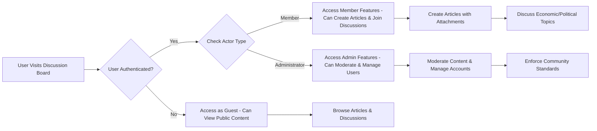

# User Actors

## Executive Summary

This document identifies and describes the three primary user actor types in the discussion board system: guests, members, and administrators. Each actor has distinct permissions and authentication requirements that govern how they interact with the system's economic and political discussion features. The document provides business-level permission structures, authentication workflows, actor responsibilities, and a comprehensive permission matrix to guide backend implementation.

The discussion board service named "discussionBoard" supports a minimal yet robust user structure where guest users can view public content, member users can create and edit articles with image and file attachments, and administrator users can moderate content and manage user accounts. This actor-based approach ensures secure, role-appropriate access while maintaining a simple authentication framework.

## Actor Definitions

The discussion board system defines three distinct user actors based on their authentication status and system privileges. Each actor represents a different level of participation in the economic and political discussion platform, from passive viewing to active content management.

### Guest Actor

A guest is a non-authenticated visitor who can access public content but cannot participate actively in discussions or create new content. Guest users provide a low-barrier entry point to the platform, allowing potential new members to explore existing economic and political discussions without requiring registration.

Key characteristics of the guest actor include:
- Ability to browse and view all published articles and discussion threads
- Access to search functionality across public content
- No requirement for email verification or personal information
- Viewing activities are tracked anonymously without personal data collection
- Can read comments and replies posted by authenticated members
- May be prompted to register when attempting restricted actions

WHEN a guest attempts to view a published article, THE system SHALL display the full content including any attached images and files without requiring authentication.

WHEN a guest uses the search feature, THE system SHALL return results from all publicly available articles and discussions, highlighting matching keywords in the results.

### Member Actor

A member is a registered, authenticated user who can actively participate in the discussion community by creating content, engaging in discussions, and managing their own contributions. Members serve as the primary content creators and discussion participants, building the economic and political knowledge base through thoughtful articles and comments.

Member capabilities include:
- Full article creation with rich text formatting and media attachments
- Participation in discussion threads through comments and replies
- Editing and deleting their own content within defined time limits
- Access to personal dashboard showing their published articles and activity
- Reporting inappropriate content to administrators
- Profile management including password changes and basic preferences

WHEN a member successfully logs in, THE system SHALL provide access to article creation tools and discussion participation features.

WHEN a member publishes an article with attachments, THE system SHALL validate file types and sizes before making the content publicly available.

WHEN a member edits their article, THE system SHALL allow changes within 24 hours of publication and notify discussion thread participants of updates.

### Administrator Actor

An administrator is a privileged authenticated user responsible for system governance, content moderation, and user management to ensure the discussion board operates effectively and safely. Administrators maintain platform quality and enforce community standards for economic and political discourse.

Administrative privileges encompass:
- Comprehensive content moderation including approval, editing, and removal
- User account management including suspension, banning, and reinstatement
- System-wide monitoring and reporting dashboard
- Configuration of community guidelines and platform settings
- Handling reported content violations and user disputes
- Data export capabilities for platform analysis

WHEN an administrator accesses the moderation dashboard, THE system SHALL display pending content reviews, reported items, and user management tools.

WHEN an administrator approves or rejects submitted content, THE system SHALL send automated notifications to the content author with clear reasons.

WHEN an administrator manages user accounts, THE system SHALL log all actions with timestamps and administrator identification for audit purposes.

## Permission Matrix

The following permission matrix outlines the specific permissions assigned to each actor type for key business functions in the discussion board service. Permissions are defined in business terms rather than technical implementation details, focusing on what each actor can accomplish within the system's economic and political discussion context. This matrix ensures clear separation of capabilities while supporting the platform's community-driven nature.

| Business Function | Guest | Member | Administrator |
|------------------|--------|--------|--------------|
| View public articles and discussions | ✅ View all published content | ✅ View all published content | ✅ View all published content |
| Search articles and discussions | ✅ Search all public content | ✅ Search all public content | ✅ Search all public content including drafts |
| Create new articles | ❌ Cannot create content | ✅ Create articles with attachments | ✅ Create articles with attachments |
| Edit existing articles | ❌ Cannot modify content | ✅ Edit own articles within 24 hours | ✅ Edit any article |
| Delete articles | ❌ Cannot delete content | ✅ Delete own articles within 24 hours | ✅ Delete any article |
| Participate in discussions | ❌ Cannot comment | ✅ Post comments and replies | ✅ Post comments and replies |
| Upload image attachments | ❌ Cannot upload files | ✅ Upload images to own articles | ✅ Upload images to any content |
| Upload file attachments | ❌ Cannot upload files | ✅ Upload files to own articles | ✅ Upload files to any content |
| Moderate content | ❌ No moderation access | ❌ No moderation access | ✅ Review and approve/reject content |
| Manage user accounts | ❌ No account access | ❌ No account access | ✅ Suspend, ban, or reinstate users |
| Access system settings | ❌ No access | ❌ No access | ✅ Configure platform policies |
| View activity reports | ❌ No access | ✅ View personal activity only | ✅ View system-wide analytics |
| Report inappropriate content | ❌ Cannot report | ✅ Report content for review | ✅ Resolve content reports |
| Restore deleted content | ❌ No access | ❌ No access | ✅ Restore accidentally deleted content |
| View user profiles | ✅ View public user info | ✅ View public and own profiles | ✅ View all user profiles and details |
| Export own data | ❌ No export capability | ✅ Export own content and activity | ✅ Export system-wide data |

WHEN determining permissions for a specific action, THE system SHALL check the authenticated actor type against this matrix and deny access if the matrix shows the action as prohibited.

WHEN a user attempts an action beyond their permissions, THE system SHALL display a clear error message indicating the permission requirement and suggesting appropriate next steps.

## Authentication Requirements

The system implements a comprehensive authentication framework to support the three-actor structure while maintaining a simple user experience suitable for an economic and political discussion platform. Authentication uses secure session management with clear distinction between public access (guests) and authenticated participation (members and administrators).

### Ubiquitous Authentication Rules

* THE discussion board system SHALL require authentication for all content creation operations.
* THE system SHALL maintain user sessions using secure session management for 30 days of inactivity.
* THE system SHALL validate all user actions against the authenticated actor's permissions.
* THE system SHALL provide distinct welcome experiences based on actor type (guest, member, or administrator).
* THE system SHALL support password reset through email verification within 30 seconds of request.
* THE system SHALL log all authentication events for security monitoring.

### Event-Driven Authentication Flows

WHEN a guest attempts to create an article, THE system SHALL deny the request and display a login prompt with member registration option.

WHEN a guest attempts to comment on a discussion, THE system SHALL redirect to the registration page with a message explaining "Join the discussion community by creating a free member account to share your thoughts."

WHEN a member submits login credentials, THE system SHALL validate the credentials within 2 seconds and establish a secure session with standard member permissions.

WHEN an administrator submits login credentials, THE system SHALL validate administrative access within 2 seconds and include enhanced permissions for content management tools.

WHEN a user session expires due to inactivity, THE system SHALL destroy the current session and require re-authentication with a message "Your session has expired for security reasons."

WHEN a member requests password reset, THE system SHALL send a secure reset token to their registered email address within 30 seconds of the request.

WHEN a user attempts to access a function beyond their permissions, THE system SHALL return an authentication error with message "You must be logged in as a member to perform this action" or "Administrator access required."

WHEN a member registers a new account, THE system SHALL send email verification requiring confirmation before allowing article creation.

### State-Driven Authentication

WHILE a user is authenticated as a guest, THE system SHALL allow unlimited public content viewing but restrict all write operations.

WHILE a user is authenticated as a member, THE system SHALL allow article creation with attachment uploads and discussion participation for their duration of articles.

WHILE a user is authenticated as an administrator, THE system SHALL provide continuous access to moderation tools and user management dashboards.

WHILE a user session is active, THE system SHALL validate actor permissions on every protected operation.

### Authentication Error Handling

IF login credentials are invalid, THEN THE system SHALL return an authentication error with message "Invalid email or password. You can reset your password if forgotten." and track failed attempts for security.

IF a user's account is temporarily locked due to multiple failed login attempts, THEN THE system SHALL display "Account locked for 15 minutes due to security concerns. Please try again later."

IF a password reset is requested from an unregistered email, THEN THE system SHALL provide message "No account found with this email address" without revealing account existence.

IF an authenticated session encounters a security violation, THEN THE system SHALL immediately log the user out and redirect to login with message "Security violation detected - please log in again."

IF a member account requires email verification, THEN THE system SHALL prevent article creation until verification is complete, displaying "Please verify your email to start sharing your economic and political insights."

### Optional Authentication Features

WHERE enhanced security is required, THE system SHALL support two-factor authentication for administrator accounts.

WHERE audit trails are mandated, THE system SHALL log all authentication events with timestamps, IP addresses, and actor details.

WHERE high-trust articles are designated, THE member's email SHALL be verified before publication.

## Actor Responsibilities

Each actor type has specific responsibilities for maintaining the health and quality of the economic/political discussion board ecosystem. These responsibilities ensure the platform serves its purpose of facilitating informed discussions while maintaining appropriate boundaries between passive consumption and active participation.

### Guest Responsibilities

Guests participate passively in the community by consuming content and potentially becoming engaged members. Though they have no formal responsibilities, their browsing behavior and feedback helps administrators understand content effectiveness and platform accessibility.

- **Content Discovery**: Actively explore articles and discussions to understand the platform's economic and political focus, providing implicit feedback through engagement metrics.
- **Respectful Usage**: View content without attempting to circumvent access controls or disrupt platform functionality.
- **Community Awareness**: Recognize the value proposition of membership for full participation in economic and political discourse.
- **Search Utilization**: Use available search features to find relevant content areas and understand community interests.
- **Potential Conversion**: Consider membership when interested in specific economic or political topics that would benefit from deeper engagement.

### Member Responsibilities

Members serve as the backbone of the discussion board by creating content, fostering discussions, and moderating their own contributions. They are expected to maintain high-quality content standards and engage constructively with the community, acting as stewards of the economic and political knowledge base.

- **Quality Content Creation**: Write well-researched, substantive articles on economic and political topics with appropriate citations and clear arguments.
- **Truthful Information**: Ensure all shared facts are accurate and represent diverse viewpoints fairly, supporting informed economic and political discussions.
- **Ethical File Usage**: Upload only their own images and documents or properly licensed materials, respecting intellectual property rights.
- **Constructive Engagement**: Participate in discussions with evidence-based reasoning and respect differing perspectives on economic and political issues.
- **Self-Moderation**: Monitor and manage their own comments and articles, correcting errors and updating outdated information.
- **Community Building**: Welcome new members and help maintain civil discourse on potentially divisive economic and political topics.
- **Platform Integrity**: Report inappropriate content and cooperate with administrators to maintain a valuable discussion environment.

### Administrator Responsibilities

Administrators are stewards of the platform, ensuring a safe, productive environment for economic and political discourse while implementing policies fairly and consistently. Their actions directly impact the platform's reputation and long-term sustainability.

- **Content Quality Assurance**: Review submitted articles for accuracy, relevance, and compliance with economic/political focus, providing constructive feedback when needed.
- **User Community Management**: Monitor user behavior patterns and intervene when community standards are violated, focusing on education and de-escalation when possible.
- **Platform Stability**: Ensure all system components function properly, including attachment handling and search capabilities critical for economic discussions.
- **Policy Implementation**: Apply moderation guidelines consistently across all content, prioritizing quality over volume in economic and political discourse.
- **User Support**: Assist members with technical issues and account concerns, particularly around content creation and attachment uploads.
- **Data Integrity**: Maintain accurate user data and activity logs, ensuring privacy protection for economic and political discussions.
- **Community Trust**: Handle sensitive issues like content disputes or user conflicts with transparency and fairness, building long-term trust in the platform.
- **Platform Evolution**: Monitor usage patterns and provide feedback on emerging needs for economic and political discussion features.

## Authentication Flow Diagram

This diagram illustrates the core authentication and access control flow that determines user experience based on actor type. The system ensures appropriate access while maintaining simplicity for economic and political discussion participation.

## Security Considerations

Authentication robustness is critical for protecting user accounts and maintaining platform integrity, especially given the sensitive nature of economic and political discussions where trust and reliability are paramount.

- **Session Security**: JWT tokens include user ID, actor type, issue timestamp, and secure expiration validation to prevent token replay attacks.
- **Password Policies**: Minimum 8-character passwords for members, with more restrictive requirements for administrators including complexity rules.
- **Account Protection**: Automatic account suspension after 5 consecutive failed login attempts, with reset through email verification only.
- **Activity Monitoring**: All authentication events logged with IP addresses and user agents for security audit trails.
- **Data Minimization**: Guest browsing remains completely anonymous without any tracking or personal data collection.
- **Admin Verification**: Critical administrative actions require secondary confirmation to prevent accidental or malicious changes.

## Conclusion

The three-actor system (guest, member, administrator) creates a balanced structure for community participation while maintaining security and content quality in the discussion board service. Guests enable open access to economic and political content, members drive discussion and knowledge creation, and administrators ensure platform governance and community standards.

Each actor's authentication requirements and permissions are designed to support their specific role in enabling productive, evidence-based discussions on complex economic and political matters. The permission matrix ensures clear separation of capabilities while the comprehensive authentication flows provide consistent, secure access to platform features.

This actor-based approach supports the "discussionBoard" service's mission of making economic and political discourse accessible through a simple, trustworthy platform. The authentication framework scales with user growth while maintaining the focus on community-driven content creation and thoughtful discussion participation.