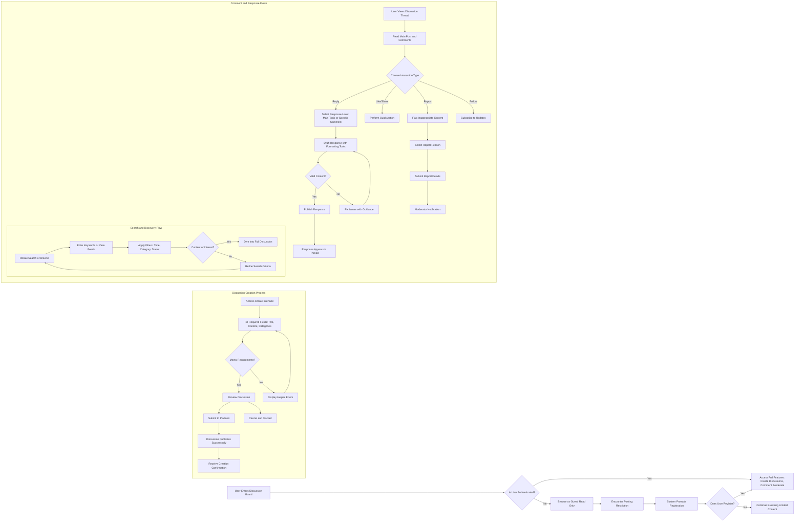

# User Scenarios for Discussion Board Platform

## Introduction

This document outlines the primary user scenarios and journeys for the discussion board platform, focusing on economic and political topics. These scenarios describe how users interact with the system from a business perspective, detailing the workflows and decision points that occur during typical usage. The purpose is to provide a clear understanding of user experiences and workflows, serving as a foundation for product managers to ensure the platform meets user needs effectively.

## Primary User Scenarios

### Guest User Scenario
As an unauthenticated visitor browsing the discussion board, a guest user can explore discussions but has limited interaction capabilities. Typical activities include discovering trending topics, reading discussion threads, and learning about the community. Guests may encounter scenarios where they want to participate but must register first, or they may choose to remain anonymous for passive consumption of content.

### Registered User Scenario  
As an authenticated member of the platform, a registered user actively participates in discussions. This user creates new discussion topics, posts responses to existing threads, and engages with other community members. Registered users can follow topics of interest, receive updates on discussions they've participated in, and build a reputation through their contributions. They may also report inappropriate content or moderate their own interactions.

### Moderator Scenario
As a content administrator, moderators oversee the platform's discussions to ensure quality and compliance. Moderators review new and existing content, address reported violations, and manage user accounts when necessary. They handle edge cases such as spam, offensive material, or rule violations, making decisions about content approval, removal, or escalation to higher authorities.

## Discussion Creation Flow

### New Discussion Creation Journey
WHEN a registered user wants to start a new economic or political discussion, THE system SHALL guide them through a straightforward creation process. First, the user accesses the create discussion interface from the main navigation. The system presents a form requiring discussion title, initial post content, and optional topic categorization. As the user writes their post, the system provides real-time feedback on character limits and formatting options.

The flow continues as the user selects appropriate tags from predefined categories like economics, politics, or specific current events. If the user attempts to submit without meeting basic requirements such as minimum content length, THE system SHALL prevent submission and display helpful guidance. Once all required fields are completed and validated, the submission is processed, and THE system SHALL immediately show the new discussion in the appropriate category, notifying the user of successful creation.

### Category Selection Process
For choosing discussion categories, users follow these steps:
1. Review available category options matching economic/political themes
2. Select one or more relevant categories that best fit the discussion topic
3. Optionally browse recent discussions in the selected category for context
4. Confirm category selection before posting

### Preview and Edit Phase
Before final submission, THE system SHALL offer a preview mode allowing users to see how their discussion appears to others. If changes are needed, users can return to edit mode; otherwise, they proceed to publish the discussion publicly.

## Comment and Response Flows

### Thread Participation Workflow
WHEN users engage with an existing discussion, they can post responses or comments at different levels of the conversation. Starting from the main discussion page, users read through the initial post and existing responses. They can choose to reply directly to the main topic or respond to specific comments made by others. The system organizes responses hierarchically, showing reply relationships visually to maintain conversation flow.

As users draft their responses, THE system SHALL provide formatting tools and track character usage. If a post exceeds recommended length or contains potential policy violations, THE system SHALL alert the user with suggestions for improvement. Users can save drafts, collaborate on responses, or simply read without participating. When published, their contribution becomes immediately visible in the discussion thread.

### Like and Share Interactions
Users can express engagement through various interaction types:
- Liking posts to show agreement or appreciation
- Sharing discussions to other platforms or inviting friends
- Bookmarking threads for later review
- Following other users whose contributions resonate with them

### Moderation Trigger Points
WHEN users report content during participation, THE system SHALL prompt them to select the reason for reporting and provide additional context. Moderators receive notifications, review the flagged content, and determine appropriate actions such as deletion, warning, or approval.

## Search and Discovery Scenarios

### Content Discovery Journey
WHEN users want to find specific discussions, they use the search functionality to explore the platform's content. The search interface allows keyword searching across discussion titles, descriptions, and user names. Results display in chronological or relevance order, with filters for time period, category, and popularity. Users can browse results, preview discussion summaries, and navigate into full threads.

For browsing without specific queries, THE system SHALL present curated content feeds showing:
- Trending discussions by engagement level
- Recently active conversations
- Recommendations based on user's reading history
- Featured content highlighted by moderators

### Advanced Filtering Scenario
Users can combine multiple filters:
- Time filters (last hour, day, week, month)
- Category filters (economics, politics, specific subtopics)
- Status filters (active discussions, resolved topics, archived content)
- User filters (discussions by specific contributors, following others)

### Search Results Interaction
WHEN viewing search results, users can:
- Sort by newest, oldest, or most responded
- Expand result previews to read summaries
- Save search queries for future use
- Follow topics that match their interests

## Edge Cases

### Anonymous Browsing Limits
WHEN anonymous users attempt restricted actions like posting comments, THE system SHALL redirect them to registration with clear explanations of benefits. They can continue browsing but receive gentle prompts to create accounts for full participation.

### Content Moderation Conflicts
In scenarios where users disagree with moderation decisions, they can appeal through a structured process. First, the original moderator reviews appeals, then escalated cases go to senior moderators. Users receive clear explanations of outcomes, and the system logs all interactions for transparency.

### Technical Access Issues
WHEN users experience connectivity problems during posting, THE system SHALL save incomplete drafts automatically and provide recovery options. Upon reconnection, users can resume their work without data loss, ensuring continuous participation.

### High-Traffic Discussion Handling  
During periods of intense discussion activity, such as major economic events or political developments, THE system SHALL prioritize content delivery while preventing server overload. Users may experience slight delays in updates, but THE system SHALL maintain functionality and provide status indicators about current activity levels.

### User Account Recovery Scenarios
WHEN registered users forget access credentials, THE system SHALL provide secure recovery through email verification. The process includes temporary access while maintaining full security, and users receive guidance throughout each step.

### Community Growth Transitions
As the platform expands from small group discussions to larger community interactions, user scenarios adapt. New users receive guided introductions, while long-term members access advanced features like conversation archiving and contributor statistics.

### Content Archiving and Preservation
WHEN discussions become inactive but retain historical value, moderators can archive them for future reference. Users can still access archived content but may need pagination for very long threads, with clear indicators that content is preserved for posterity.

These scenarios provide comprehensive coverage of user interactions within the discussion board platform, ensuring that product managers can effectively plan for user needs and system capabilities.