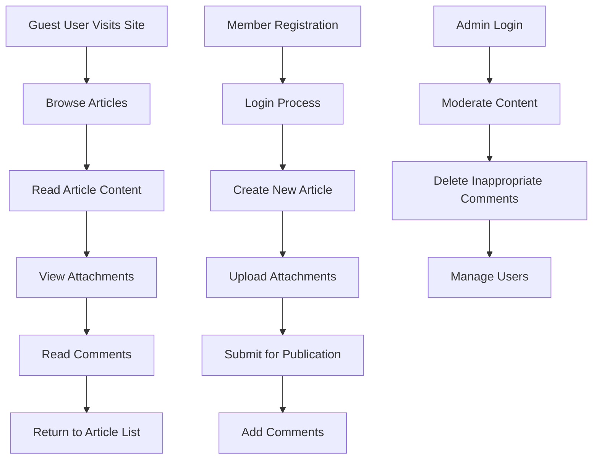

```
# Economic/Political Discussion Board Requirements Analysis

This document provides the complete requirements specification for a simple economic/political discussion board that supports articles with image and file attachments. The implementation focuses on straightforward, minimal functionality without complex features.

## Business Overview

THE discussion board SHALL provide a simple platform for economic and political debate through articles and comments. The primary purpose is to enable community discussion on economic and political topics with support for image and file attachments in articles.

WHEN users need to discuss economic policies, THE system SHALL allow them to create articles with attachments that can be viewed and commented on by other users.

WHEN political debates require supporting evidence, THE system SHALL permit upload of relevant images or documents that enhance the discussion quality.

## User Actors

THE discussion board SHALL support guest users who can browse content without authentication.

WHEN a user visits the discussion board without logging in, THE system SHALL display all published articles and allow reading of content and comments.

THE discussion board SHALL support member users who can actively participate by creating articles and comments.

WHEN a user registers as a member, THE system SHALL allow them to publish articles, add comments, and upload attachments.

THE discussion board SHALL support admin users with moderation capabilities.

WHEN a user has admin privileges, THE system SHALL grant access to content moderation and user management functions.

## Article Management

### Article Creation

THE system SHALL allow authenticated members to create new articles.

WHEN a member clicks to create a new article, THE system SHALL present a form with title field, content textarea, and attachment upload functionality.

THE system SHALL enforce a maximum article length of 10,000 characters.

WHEN a user attempts to submit an article exceeding the length limit, THE system SHALL display an error message and prevent submission.

### Article Publishing

Articles SHALL be published immediately upon creation.

WHEN a user submits a valid article, THE system SHALL make it visible to all users (guests, members, and admins) within 2 seconds of submission.

### Article Viewing

THE system SHALL display articles in chronological order with newest first.

WHEN a user browses the discussion board, THE system SHALL show articles paginated to limit load times.

Each page SHALL display 20 articles with navigation controls for older content.

### Article Content Structure

Each article SHALL consist of:
- Title (maximum 200 characters)
- Content body (maximum 10,000 characters)
- Timestamp of publication
- Author identifier
- List of attached files/images
- Comment count

WHEN displaying an article, THE system SHALL show all attachments inline with the content.

## Attachment Support

### Supported File Types

THE system SHALL accept the following attachment types for articles:
- Images: JPG, PNG, GIF (maximum size 5MB per image)
- Documents: PDF (maximum size 10MB per document)

WHEN a user attempts to upload an unsupported file type, THE system SHALL reject the upload with a clear error message.

### Multiple Attachments

Users SHALL be able to attach multiple files to a single article.

THE system SHALL limit attachments to 5 files per article.

WHEN attempting to add more than 5 attachments, THE system SHALL prevent the action and display a warning.

### Attachment Storage

THE system SHALL store all attachments on a file hosting service.

WHEN an article with attachments is approved for publication, THE system SHALL upload all files to cloud storage and store reference URLs in the database.

### Attachment Display

Images SHALL be displayed inline within the article content.

WHEN viewing an article with image attachments, THE system SHALL render images at appropriate sizes that fit the content layout.

Documents SHALL be displayed as downloadable links.

WHEN a user clicks on a document attachment, THE system SHALL initiate a download of the file.

## Comment System

### Comment Creation

Only authenticated members SHALL be able to create comments.

WHEN a guest user attempts to comment, THE system SHALL prompt them to register or login.

Comments SHALL have a maximum length of 1,000 characters.

WHEN submitting comments, THE system SHALL validate the length and display errors for content that is too long.

### Comment Display

Comments SHALL appear below each article in chronological order.

WHEN an article has multiple comments, THE system SHALL display them with the newest comments at the top.

Each comment SHALL show:
- Author name
- Comment content
- Timestamp
- Reply functionality (if supported)

### Comment Moderation

Admins SHALL be able to delete inappropriate comments.

WHEN an admin identifies inappropriate content, THE system SHALL allow permanent removal of the comment.

Deleted comments SHALL display a placeholder message indicating removal.

## Authentication and Authorization

### User Registration

THE system SHALL require email address and password for registration.

WHEN registering, THE system SHALL validate that the email is unique and properly formatted.

Passwords SHALL meet minimum complexity: 8 characters with at least one number and one letter.

WHEN a user submits an invalid password, THE system SHALL display requirements and prevent registration.

### User Login

THE system SHALL authenticate users with email and password.

WHEN login is successful, THE system SHALL create a session lasting 24 hours.

WHEN login fails due to invalid credentials, THE system SHALL display an error and allow retry.

### Session Management

Sessions SHALL expire after 24 hours of inactivity.

WHEN a user returns after session expiration, THE system SHALL require re-authentication.

### Authorization

Article creation SHALL require member-level authentication.

WHEN unauthenticated users attempt to create articles, THE system SHALL redirect to login page.

Comment creation SHALL require member-level authentication.

Administrative functions SHALL require admin-level authentication.

## User Interface Requirements

### Navigation

THE system SHALL provide simple navigation with links to:
- Homepage (article list)
- Login page
- Registration page
- Article creation page (for members)
- Admin panel (for admins)

### Responsive Design

THE system SHALL be accessible on desktop and mobile devices.

WHEN viewed on mobile devices, THE system SHALL adjust layout for smaller screens.

### User Feedback

THE system SHALL display success messages after successful actions.

WHEN actions fail, THE system SHALL display clear error messages with suggestions for resolution.

## Security Requirements

### Input Validation

All user input SHALL be validated for length and content.

WHEN invalid data is submitted, THE system SHALL prevent processing and display specific error messages.

### SQL Injection Protection

THE system SHALL use parameterized queries for all database operations.

WHEN processing user input, THE system SHALL sanitize data to prevent SQL injection attacks.

### XSS Protection

Article and comment content SHALL be sanitized to prevent cross-site scripting.

WHEN displaying user-generated content, THE system SHALL escape HTML characters to prevent script execution.

### File Upload Security

Uploaded files SHALL be scanned for malicious content.

WHEN dangerous file types are detected, THE system SHALL reject the upload immediately.

## Performance Requirements

### Response Time

Page loading SHALL complete within 2 seconds for 95% of requests.

WHEN page load exceeds 5 seconds, THE system SHALL display a loading indicator.

### Concurrent Users

THE system SHALL support 1,000 concurrent users during peak hours.

WHEN load exceeds capacity, THE system SHALL display an appropriate error message.

### Database Performance

Article queries SHALL complete within 200 milliseconds.

WHEN retrieving article lists, THE system SHALL use database indexing for optimal performance.

## Data Storage Requirements

### Article Data

Articles SHALL be stored with metadata including:
- Unique identifier
- Title
- Content
- Author ID
- Publication timestamp
- List of attachment URLs

### Comment Data

Comments SHALL be stored with metadata including:
- Unique identifier
- Article ID
- Author ID
- Content
- Timestamp
- Deletion flag

### User Data

Users SHALL be stored with minimal information:
- Unique identifier
- Email address
- Password hash
- User role (guest, member, admin)
- Registration timestamp

## Error Handling

### Network Connectivity

WHEN network connection fails during article submission, THE system SHALL save draft content locally and allow retry.

WHEN connection is restored, THE system SHALL automatically attempt re-submission.

### File Upload Failures

WHEN attachment upload fails due to network issues, THE system SHALL allow retry of the specific failed files.

WHEN multiple file uploads fail, THE system SHALL permit selective retry of individual attachments.

### Validation Errors

THE system SHALL validate all user input before processing.

WHEN validation fails, THE system SHALL display specific error messages and highlight invalid fields.

## Implementation Scope

### Included Features

- User registration and authentication
- Article creation with text content
- Image and document attachments
- Article browsing and reading
- Comment system
- Basic user roles (guest, member, admin)
- File upload and storage
- Responsive web interface

### Excluded Features

- Advanced formatting (rich text editor)
- User profiles and avatars
- Article editing after publication
- Nested comment threads
- Voting or rating systems
- Private messaging
- Advanced search functionality
- Social media integration
- Multi-language support
- Email notifications
- Article categories or tags

## System Architecture Considerations

### Component Structure

THE system SHALL consist of:
- Web frontend (HTML, CSS, JavaScript)
- Backend REST API
- Database for content storage
- File storage service for attachments

WHEN designing components, THE system SHALL maintain loose coupling for easier maintenance.

### Scalability

THE system SHALL be designed to handle increasing user load through:
- Horizontal database scaling
- CDN for static asset delivery
- Caching layer for frequently accessed content

WHEN user base grows beyond initial capacity, THE system SHALL support additional server instances.

## Testing Requirements

### Unit Testing

All business logic SHALL be covered by unit tests.

WHEN developing features, THE system SHALL achieve 80% code coverage for critical functions.

### Integration Testing

File upload functionality SHALL be tested for various file types and sizes.

WHEN testing attachment features, THE system SHALL verify proper storage and retrieval.

### User Acceptance Testing

End users SHALL test article creation and commenting workflows.

WHEN conducting UAT, THE system SHALL validate that core functionality works as expected.

## Deployment and Maintenance

### Environment Requirements

THE system SHALL run on standard web hosting environments supporting:
- Node.js runtime
- Relational database (PostgreSQL/MySQL)
- File storage service (AWS S3 or similar)

WHEN deploying, THE system SHALL require minimal configuration for production environments.

### Monitoring

THE system SHALL include basic monitoring for:
- Application uptime
- Error rates
- Performance metrics

WHEN issues are detected, THE system SHALL log details for troubleshooting.

## Business Rules Summary

### Content Guidelines

Articles SHALL focus on economic and political topics only.

WHEN inappropriate content is submitted, THE system SHALL allow admin moderation.

### Community Standards

Users SHALL behave respectfully in comments.

WHEN violations occur, THE system SHALL support admin intervention through comment deletion.

### Data Retention

Published content SHALL be retained indefinitely.

WHEN users request account deletion, THE system SHALL anonymize their data while preserving articles.

```

## Mermaid Diagrams

### User Flow Diagram

