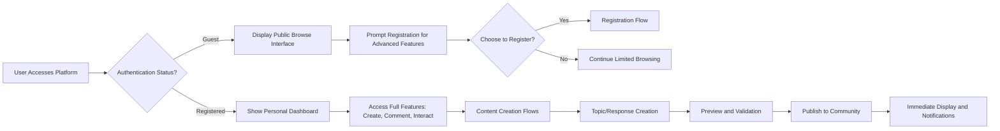
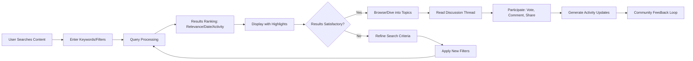

# User Interface Flows and Navigation for Economic/Political Discussion Board

This document describes the detailed user interface flows and navigation patterns for the Economic/Political Discussion Board platform. These flows represent the business logic of user interactions from a conceptual perspective, focusing on the experience users encounter when navigating, creating content, and interacting with discussions. All flows are described in natural language terms that support backend implementation without specifying technical details.

## Navigation and Discovery Flows

### Primary Entry Points to Discussions
WHEN users first visit the discussion board platform, THE system SHALL present a welcoming landing page with featured economic and political discussions prominently displayed. Users can immediately see trending topics, recent activity indicators, and clear navigation options to browse by category.

WHEN users select the "Browse Discussions" option from the main menu, THE system SHALL display a paginated list of discussion topics sorted by most recent activity. Each topic shown SHALL include title, author name, creation date, response count, and a brief preview of the initial content. Users can scan through multiple pages using numbered pagination controls or jump to specific dates using a calendar selector.

WHEN users access the platform during peak hours with high discussion activity, THE system SHALL maintain full responsiveness by implementing smart loading mechanisms that prioritize essential content delivery while preventing server overload.

### Search Functionality Mechanisms
WHEN users initiate a search for economic or political topics, THE system SHALL provide an intelligent search interface that supports keyword queries, topic category filters, and date range limitations. The search box SHALL offer autocomplete suggestions based on popular terms and previously searched topics to help users discover relevant content quickly.

WHEN users enter specific economic terms like "inflation rates" or "trade policy", THE system SHALL return results that include discussions, responses, and user profiles with highlighting of matching terms. Results SHALL be ranked by relevance with options to re-sort by newest, oldest, or most active discussions.

WHEN advanced users apply multiple filters such as category, date range, and author, THE system SHALL combine these criteria efficiently and provide a filter summary that users can modify incrementally without losing their search context.

### Category Browsing Processes
WHEN users select an economic or political category from the navigation menu, THE system SHALL display a curated view of discussions within that category, showing topic hierarchy, popularity indicators, and recent activity markers. Each category view SHALL include sub-category options for more granular browsing, such as "Monetary Policy" under the broader "Economic" category.

WHEN users explore political categories like "Election Policy" or "International Relations", THE system SHALL present topics with appropriate depth indicators and user engagement metrics to help distinguish between casual discussions and in-depth policy analysis.

WHEN categories have high volume with hundreds of topics, THE system SHALL implement progressive loading that displays initial results immediately while continuing to load additional content in the background.

### Personal Dashboard Access
WHEN registered users access their personal dashboard, THE system SHALL display customized content feeds including discussions they've started, responses they've received, topics they're following, and notifications of mentions. The dashboard SHALL organize information into clear sections with actionable buttons for quick navigation to specific discussions.

WHEN users customize their dashboard preferences, THE system SHALL save their layout choices and content filtering options for future visits, creating a personalized experience that adapts to their economic and political discussion interests.

## Content Creation Flows

### Topic Creation Workflow
WHEN registered users click the "Create Discussion" button from any page, THE system SHALL display a comprehensive form with fields for title, category selection, and detailed description. The form SHALL include real-time validation that checks title uniqueness, category appropriateness, and content length requirements before submission.

WHEN users write their discussion content, THE system SHALL provide a rich text editor with formatting options for bold text, links, and basic structure while maintaining plain text accessibility. Users can preview their formatted content before publishing, ensuring the discussion appears as intended to other users.

WHEN users attempt to publish a topic with insufficient content or inappropriate categories, THE system SHALL highlight validation errors with specific guidance on how to correct issues, allowing users to revise and resubmit without losing their work.

WHEN publishing succeeds, THE system SHALL immediately display the new discussion in the appropriate category, send confirmation notifications, and provide options to share the link with other users.

### Response Posting Process
WHEN users read a discussion topic and choose to respond, THE system SHALL position a response form at the bottom of the thread or inline with specific comments they want to address. The response form SHALL include character counters, draft saving options, and preview functionality to ensure quality contributions.

WHEN users submit responses, THE system SHALL validate content for appropriateness, length, and structure before adding it to the discussion thread. Successful responses SHALL appear immediately in the conversation flow with proper threading that maintains discussion context.

WHEN users participate in active discussions with multiple simultaneous responses, THE system SHALL handle submission gracefully by queuing responses if needed and providing clear feedback about posting status.

### Draft Saving Mechanisms
WHEN users create content that takes significant time, THE system SHALL automatically save drafts periodically to prevent work loss from browser crashes or session interruptions. Users can access their saved drafts from a dedicated section and resume editing at any time.

WHEN users abandon a draft, THE system SHALL maintain it in their draft folder for a specified period, allowing recovery of accidentally closed work.

### Preview and Editing Capabilities
WHEN users create or edit content, THE system SHALL offer preview modes that show how their discussion or response will appear to other users. This includes rendering of links, formatting, and any embedded media previews.

WHEN registered users edit their existing posts within the allowed timeframe, THE system SHALL maintain edit history and indicate edited content with timestamps, preserving discussion integrity.

## Interaction Flows

### Voting and Reaction Systems
WHEN users encounter valuable economic or political insights, THE system SHALL provide upvote and downvote controls for discussions and individual responses. Each user can vote once per content item, with votes updating in real-time to reflect community sentiment.

WHEN users vote on content, THE system SHALL recalculate popularity rankings and refresh displays accordingly, ensuring that high-quality contributions rise to visibility in category listings.

WHEN users change their votes, THE system SHALL allow modifications within reasonable timeframes and update all related counts appropriately.

### Following Users/Topics Features
WHEN users discover interesting contributors or discussion topics, THE system SHALL enable following functionality that creates personalized notification feeds. Following a topic SHALL add it to a personalized feed that shows new responses and activity updates.

WHEN users follow other members, THE system SHALL include their new discussions and responses in activity feeds, helping users track contributions from valued community members without overwhelming notifications.

WHEN following becomes extensive, THE system SHALL organize followed content into manageable feeds with filtering options by category or user relationship type.

### Sharing and Bookmarking Options
WHEN users find noteworthy economic or political discussions, THE system SHALL provide sharing tools for external platforms and bookmarking for personal reference. Sharing SHALL generate shortened links with descriptive text that encourages participation from external audiences.

WHEN users bookmark content, THE system SHALL organize bookmarks by category with search functionality, allowing easy retrieval of saved discussions for future reference.

WHEN shared links bring new visitors to discussions, THE system SHALL track referral sources and provide users with feedback about sharing impact.

### Notification Preferences
WHEN users customize their notification settings, THE system SHALL provide granular controls for email, in-platform alerts, and push notifications. Users can specify preferences for new responses, mentions, topic updates, and moderator actions based on content categories.

WHEN notification volume increases during major economic events, THE system SHALL batch similar notifications and provide digest options to prevent inbox overload.

## Authentication Flows

### Login and Registration Sequences
WHEN guests initiate registration, THE system SHALL guide them through a step-by-step process that collects essential information and verifies email addresses. The registration flow SHALL include clear explanations of platform purpose and community guidelines to set appropriate expectations.

WHEN users complete registration, THE system SHALL send verification emails with clear instructions and provide immediate access to limited browsing while awaiting confirmation.

WHEN registered users log in, THE system SHALL authenticate credentials and redirect to their intended destination or personal dashboard with smooth transition.

### Password Recovery Processes
WHEN users forget their credentials, THE system SHALL provide secure recovery through email verification that doesn't expose account details. Recovery links SHALL expire after reasonable timeframes to maintain security.

WHEN users reset passwords, THE system SHALL enforce strength requirements and provide guidance for creating secure credentials.

### Session Management
WHEN users remain active on the platform, THE system SHALL maintain sessions with reasonable timeouts that balance security with user convenience. Session management SHALL support multiple device access while allowing users to log out remotely if needed.

WHEN sessions expire unexpectedly, THE system SHALL preserve user context and provide re-authentication that returns them to their previous activity.

### Role-Based Access Transitions
WHEN moderators access administrative functions, THE system SHALL provide clear visual indicators of their elevated capabilities. Transitions between guest, registered user, and moderator views SHALL maintain context and provide clear navigation paths back to standard user functions.

## Error Handling Flows

### Form Validation Feedback
WHEN users submit forms with invalid data, THE system SHALL highlight specific fields with descriptive error messages that explain requirements and suggest corrections. Validation feedback SHALL prevent incorrect submissions while guiding users toward successful completion.

WHEN users encounter persistent validation issues, THE system SHALL provide contextual help options that explain platform rules and best practices.

### Connection Error Recoveries
WHEN network interruptions occur during user interactions, THE system SHALL automatically save user input and provide resumption options when connection restores. Error recovery SHALL minimize work loss and provide clear status indicators about connection state.

WHEN offline functionality is available, THE system SHALL allow basic browsing and composition of contributions for submission when connectivity returns.

### Permission Denied Scenarios
WHEN users attempt actions beyond their access level, THE system SHALL display clear explanations of permission requirements and provide paths to appropriate actions. Permission messages SHALL be educational rather than simply restrictive, helping users understand how to participate appropriately.

WHEN guest users encounter registered-only features, THE system SHALL present registration benefits and streamlined signup options that preserve their current activity intent.

### Data Loss Prevention
WHEN users face potential data loss situations, THE system SHALL implement automatic saving and recovery mechanisms that preserve their work. Clear indicators SHALL inform users about save status and recovery options available to them.

WHEN system errors occur, THE system SHALL provide graceful degradation that maintains user progress and offers clear reporting options for technical support.

This comprehensive flow specification ensures that users experience intuitive and reliable navigation throughout the economic/political discussion board, supporting both casual browsing and active participation in meaningful discussions.