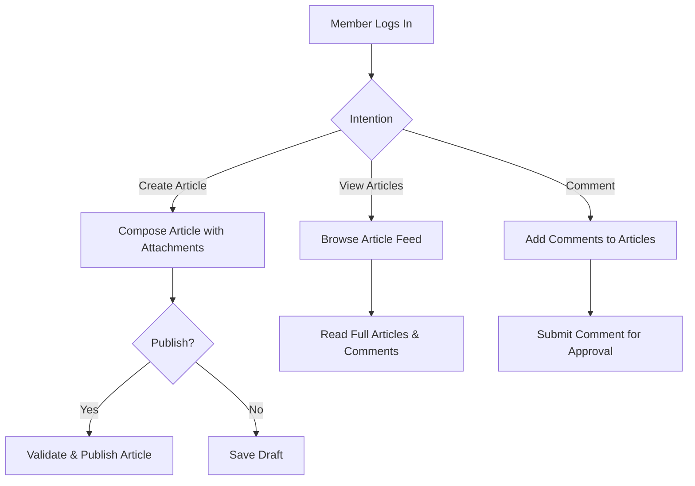
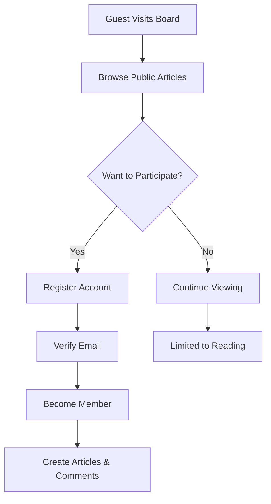
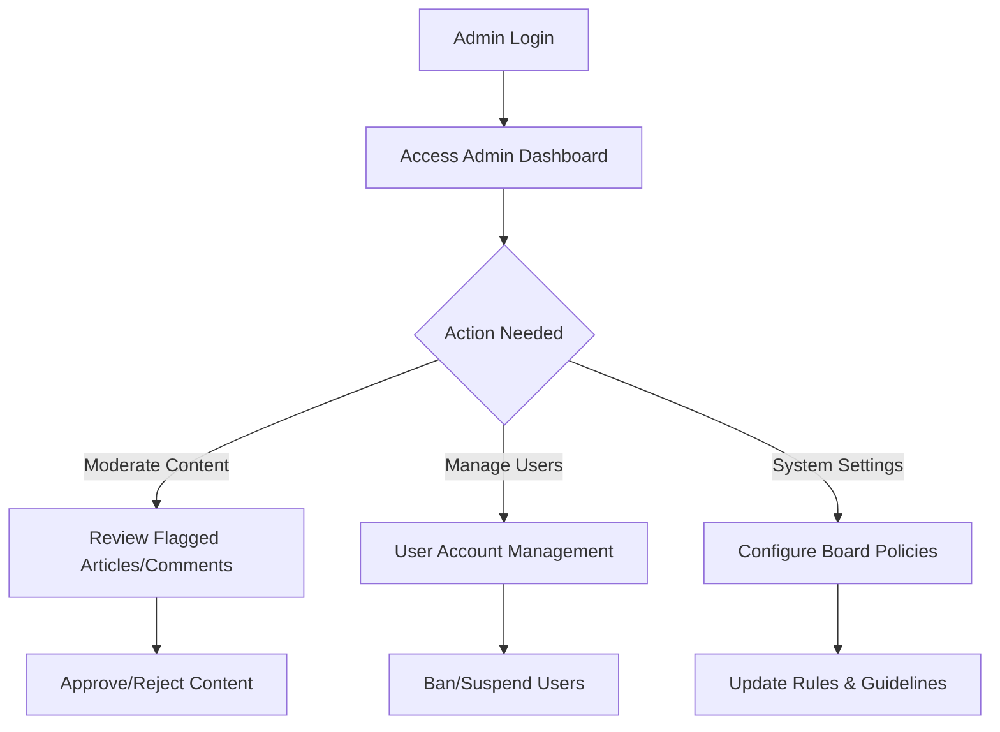

# Business Requirements for Economic Discussion Board

## Introduction

The economic discussion board serves as an online platform where individuals can create and participate in discussions about economic and political topics. The core purpose is to facilitate informed exchanges of ideas while maintaining a respectful and constructive environment. Users can share articles, attach relevant images and files, and engage through comments. The system supports different user roles: guests who can view content, members who can create and comment, and administrators who can manage and moderate the platform.

These requirements focus entirely on business functionality and user interactions, describing what the discussion board should do without specifying technical implementation details.

WHEN administrators configure the discussion board, THE system SHALL require valid credentials and log all administrative actions.

WHEN the system initializes, THE system SHALL ensure all business rules and validations are active.

WHEN users access the board during maintenance periods, THE system SHALL display appropriate maintenance messages.

## Article Management

Articles form the foundation of the discussion board, representing the main content that users create and share. Each article should include a title, content body, and optional attachments.

WHEN a member wishes to create a new article, THE discussion board SHALL provide an intuitive composition interface with title and body fields.

WHEN a member submits an article with a title containing between 5 and 200 characters, THE discussion board SHALL accept the submission.

WHEN a member submits an article with content body containing at least 100 but no more than 10,000 characters, THE discussion board SHALL accept the submission.

WHEN an article contains attachments, THE discussion board SHALL validate that the total attachment size does not exceed 50MB per article.

WHEN a member submits an article, THE discussion board SHALL validate the article content and attachments before allowing publication.

WHEN an article passes all validations, THE discussion board SHALL make it visible to all users immediately after submission.

WHEN a member wants to edit their own published article, THE discussion board SHALL allow modifications within 24 hours of publication.

WHEN a member edits their article's title or body, THE discussion board SHALL save the changes and maintain the original publication date.

WHEN a user views an article, THE discussion board SHALL display the full content, attachments, and associated comments in reverse chronological order.

WHEN an article receives new comments, THE discussion board SHALL highlight the article as recently discussed in listing pages.

WHEN a user searches for articles using keywords, THE discussion board SHALL return results containing those keywords in title or body within 1 second.

## Attachment Support

Articles can include attachments such as images and files to enhance discussions with visual evidence or additional documentation.

WHEN a member adds attachments during article creation, THE discussion board SHALL support uploading up to 10 files per article.

WHEN uploading images (JPEG, PNG, GIF formats), THE discussion board SHALL validate file size limits of 5MB per image.

WHEN uploading documents (PDF, DOC, DOCX, XLS, XLSX formats), THE discussion board SHALL validate file size limits of 10MB per document.

WHEN user uploads an attachment exceeding size limits, THE discussion board SHALL reject the upload and display an error message specifying the limits.

WHEN user uploads an attachment in unsupported format, THE discussion board SHALL reject the upload and display supported formats.

WHEN attachments are successfully uploaded, THE discussion board SHALL display thumbnails for images and file names with icons for documents.

WHEN a user clicks on an attached image, THE discussion board SHALL display it in a lightbox viewer.

WHEN a user clicks on an attached document, THE discussion board SHALL initiate download of the original file.

WHEN article has no attachments, THE discussion board SHALL display the article normally without attachment sections.

## Comment System

Comments enable users to respond to articles and engage in discussions.

WHEN a member views an article, THE discussion board SHALL display an area for adding comments below the article content.

WHEN a member clicks to add a comment, THE discussion board SHALL display a text box with character counter.

WHEN a member enters a comment between 10 and 2,000 characters, THE discussion board SHALL enable the submit button.

WHEN a member submits a comment with fewer than 10 characters, THE discussion board SHALL disable submission and show minimum character requirement.

WHEN a member submits a comment exceeding 2,000 characters, THE discussion board SHALL prevent submission and show maximum character limit.

WHEN an admin approves a comment, THE discussion board SHALL display it under the article immediately.

WHEN a comment contains inappropriate content, THE discussion board SHALL flag it for moderator review and prevent immediate display.

WHEN a member wants to edit their own comment, THE discussion board SHALL allow edits within 1 hour of posting.

WHEN a comment is edited, THE discussion board SHALL display an "edited" indicator with the edit timestamp.

WHEN users view comments, THE discussion board SHALL show them in chronological order (oldest first) by default.

WHEN users prefer newest comments first, THE discussion board SHALL provide a sort option and maintain user preference in session.

WHEN a comment receives replies, THE discussion board SHALL nest replies under the parent comment with indentation.

WHEN nested replies exceed 3 levels deep, THE discussion board SHALL collapse deeper threads and show "show more replies" links.

## User Permissions

Different user roles have specific permissions to maintain order and functionality on the board.

WHEN a user registers as a guest visitor, THE discussion board SHALL allow viewing of all published articles and approved comments.

WHEN a guest attempts to create an article, THE discussion board SHALL require account creation and redirect to registration.

WHEN a guest attempts to post comments, THE discussion board SHALL show registration requirement message.

WHEN a member logs in with verified credentials, THE discussion board SHALL grant creation rights for articles and comments.

WHEN a member attempts to edit another member's content, THE discussion board SHALL deny access and show permission error.

WHEN a member deletes their own content, THE discussion board SHALL mark it as deleted and hide from public view after 24 hours.

WHEN an admin logs in with elevated privileges, THE discussion board SHALL grant management capabilities across all content and users.

WHEN an admin moderates content, THE discussion board SHALL log the action with timestamp and admin identifier.

WHEN an admin creates system announcements, THE discussion board SHALL highlight them prominently on main page.

WHEN user permissions change (promotion/demotion), THE discussion board SHALL update capabilities immediately and notify affected user.

WHEN a banned user attempts access, THE discussion board SHALL block login and display ban reason.

## Security Requirements

The discussion board must protect user data and maintain a safe environment for discussions.

WHEN users register accounts, THE discussion board SHALL require strong password combinations (minimum 8 characters with mixed case and numbers).

WHEN users attempt login, THE discussion board SHALL validate credentials and implement account lockout after 5 failed attempts.

WHEN suspicious activity is detected, THE discussion board SHALL temporarily lock accounts and require email verification for unlock.

WHEN the discussion board stores user data, THE discussion board SHALL encrypt sensitive information using industry-standard methods.

WHEN users request password changes, THE discussion board SHALL require current password verification and send confirmation emails.

WHEN content is submitted, THE discussion board SHALL scan for malicious patterns and inappropriate language automatically.

WHEN users report abusive content, THE discussion board SHALL prioritize flagged items for immediate moderator review.

WHEN session timeout occurs, THE discussion board SHALL automatically log out users and require re-authentication.

WHEN administrators access sensitive settings, THE discussion board SHALL require additional verification like two-factor authentication.

WHEN data backup occurs, THE discussion board SHALL ensure encrypted storage and secure transmission channels.

WHEN user data is processed for analytics, THE discussion board SHALL anonymize personal information in reports.

## Performance Expectations

The discussion board should provide a responsive user experience suitable for online discussions.

WHEN a user visits the main page, THE discussion board SHALL load within 2 seconds under normal network conditions.

WHEN a user submits login credentials, THE discussion board SHALL authenticate within 1 second.

WHEN a user publishes an article, THE discussion board SHALL process and display it within 3 seconds.

WHEN a user uploads attachments, THE discussion board SHALL provide upload progress indication and complete within 30 seconds for 10MB files.

WHEN a user submits a comment, THE discussion board SHALL save and display it within 2 seconds.

WHEN searching articles with common queries, THE discussion board SHALL return results within 0.5 seconds.

WHEN the board serves 1,000 concurrent users browsing content, THE discussion board SHALL maintain response times under 3 seconds.

WHEN the board serves 500 concurrent users submitting content, THE discussion board SHALL handle the load without service degradation.

WHEN server resources approach capacity, THE discussion board SHALL gracefully scale to handle increased load.

WHEN network interruptions occur, THE discussion board SHALL resume operations automatically upon connectivity restoration.

WHEN users experience slow responses, THE discussion board SHALL provide loading indicators and progress feedback.

## Error Handling

Users should receive clear feedback when operations fail or inappropriate actions are attempted.

WHEN a guest attempts to create an article without registration, THE discussion board SHALL redirect to registration page with contextual message.

WHEN a member submits an article with missing required fields, THE discussion board SHALL highlight empty fields with red borders and helpful text.

WHEN a comment submission fails due to validation errors, THE discussion board SHALL preserve entered text and show specific error reasons.

WHEN attachment upload encounters network issues, THE discussion board SHALL allow retry with resume capability for large files.

WHEN content is flagged as inappropriate during submission, THE discussion board SHALL show moderation guidelines and suggest content alternatives.

WHEN users experience timeout during long operations, THE discussion board SHALL provide recovery options and save partial progress.

WHEN database connectivity is lost during content submission, THE discussion board SHALL queue submissions for automatic processing upon restoration.

WHEN email notifications fail to send, THE discussion board SHALL attempt retry and log delivery failures for administrator review.

WHEN users attempt actions beyond their permissions, THE discussion board SHALL show clear permission upgrade options.

WHEN attachments fail to display due to corruption, THE discussion board SHALL show error placeholder and allow re-upload option.

WHEN search queries return no results, THE discussion board SHALL suggest alternative keywords and show popular article listings.

WHEN users navigate to non-existent articles, THE discussion board SHALL show informative 404 page with search and navigation options.

## Business Rules

The discussion board operates under specific rules to maintain quality and appropriateness of economic and political discussions.

WHEN articles discuss economic topics, THE discussion board SHALL ensure content remains factual and supports evidence-based discussions.

WHEN articles discuss political topics, THE discussion board SHALL maintain neutral platform without endorsing specific ideologies.

WHEN comments engage with article content, THE discussion board SHALL require relevance to the topic being discussed.

WHEN attachments support article claims, THE discussion board SHALL verify they are appropriate for discussion platform.

WHEN users create accounts, THE discussion board SHALL validate personal information accuracy and prohibit fake accounts.

WHEN administrators moderate content, THE discussion board SHALL apply consistent standards across all submissions.

WHEN content violates community guidelines, THE discussion board SHALL provide specific feedback on violation reasons.

WHEN users repeatedly violate rules, THE discussion board SHALL implement progressive warnings and temporary restrictions.

WHEN discussions become heated, THE discussion board SHALL have mechanisms to de-escalate through moderator intervention.

WHEN external links are included in content, THE discussion board SHALL validate they are safe and relevant to discussion.

WHEN topic tags are added to articles, THE discussion board SHALL limit to 5 tags maximum and validate against approved economic/political categories.

WHEN article is particularly popular (high engagement), THE discussion board SHALL feature it prominently in discovery sections.

WHEN seasonal economic events occur, THE discussion board SHALL allow temporary creation of event-specific discussion categories.

WHEN member achieves contribution milestones, THE discussion board SHALL recognize achievements with badges and increased visibility.

WHEN articles reach age thresholds without engagement, THE discussion board SHALL archive them appropriately for performance optimization.

## Authentication and Authorization

WHEN users first visit the board, THE discussion board SHALL offer guest access with clear upgrade path to membership.

WHEN user chooses registration, THE discussion board SHALL collect email, username, and password with confirmation.

WHEN user submits registration form, THE discussion board SHALL send verification email within 5 minutes.

WHEN user clicks email verification link, THE discussion board SHALL activate account and send welcome message.

WHEN user attempts login with unverified email, THE discussion board SHALL prompt for verification completion.

WHEN member forgets password, THE discussion board SHALL provide secure reset process requiring email confirmation.

WHEN user session expires during active use, THE discussion board SHALL allow seamless re-authentication.

WHEN multiple devices access same account, THE discussion board SHALL manage sessions appropriately without conflicts.

WHEN administrator suspects compromise, THE discussion board SHALL enable account recovery procedures.

WHEN user changes sensitive information, THE discussion board SHALL require current password confirmation.

WHEN system undergoes security updates, THE discussion board SHALL handle user login with minimal disruption notices.

WHEN external authentication services integrate, THE discussion board SHALL maintain consistent user experience and permissions.

WHEN password policies change, THE discussion board SHALL notify existing users and require compliance during next login.

## Content Moderation Workflow

WHEN user submits article for publication, THE discussion board SHALL perform automated content scanning.

WHEN automated scan flags potential issues, THE discussion board SHALL queue article for human moderator review.

WHEN moderator reviews flagged article, THE discussion board SHALL provide context and reasoning tools.

WHEN moderator approves article, THE discussion board SHALL publish immediately with approval timestamp.

WHEN moderator rejects article, THE discussion board SHALL notify author with specific improvement suggestions.

WHEN article requires edits before approval, THE discussion board SHALL return to author with change requests.

WHEN moderator escalates complex cases, THE discussion board SHALL involve senior administrators for final decision.

WHEN content appeal is submitted, THE discussion board SHALL review within 48 hours with different moderator.

WHEN appeals are granted, THE discussion board SHALL reinstate content with appeal notation.

WHEN repeated violations occur, THE discussion board SHALL implement automatic content blocking patterns.

WHEN community reports content, THE discussion board SHALL prioritize review based on report volume and severity.

WHEN moderator training is required, THE discussion board SHALL provide guidelines and examples of acceptable content.

WHEN policy updates affect existing content, THE discussion board SHALL maintain consistent enforcement standards.

## User Engagement and Gamification

WHEN new member joins, THE discussion board SHALL send onboarding emails with platform navigation tips.

WHEN member completes first article publication, THE discussion board SHALL congratulate and suggest next steps.

WHEN article receives first comments, THE discussion board SHALL notify author via email and platform notification.

WHEN discussion thread becomes popular, THE discussion board SHALL highlight it in trending sections.

WHEN users consistently contribute quality content, THE discussion board SHALL award reputation points and badges.

WHEN reputation reaches thresholds, THE discussion board SHALL grant additional platform features and visibility.

WHEN users achieve milestones (100 articles, 1000 comments), THE discussion board SHALL feature achievements on user profile.

WHEN discussion quality improves, THE discussion board SHALL recognize constructive contributors publicly.

WHEN seasonal challenges occur (economic event discussions), THE discussion board SHALL create temporary achievement opportunities.

WHEN users provide helpful answers to questions, THE discussion board SHALL mark best contributions with special indicators.

WHEN community polls are conducted, THE discussion board SHALL facilitate voting and display results transparently.

WHEN user feedback is requested, THE discussion board SHALL analyze suggestions and implement improvements iteratively.

WHEN platform anniversaries occur, THE discussion board SHALL celebrate milestones with special features and recognition.

WHEN users become disengaged, THE discussion board SHALL send personalized reactivation emails with recent interesting discussions.

