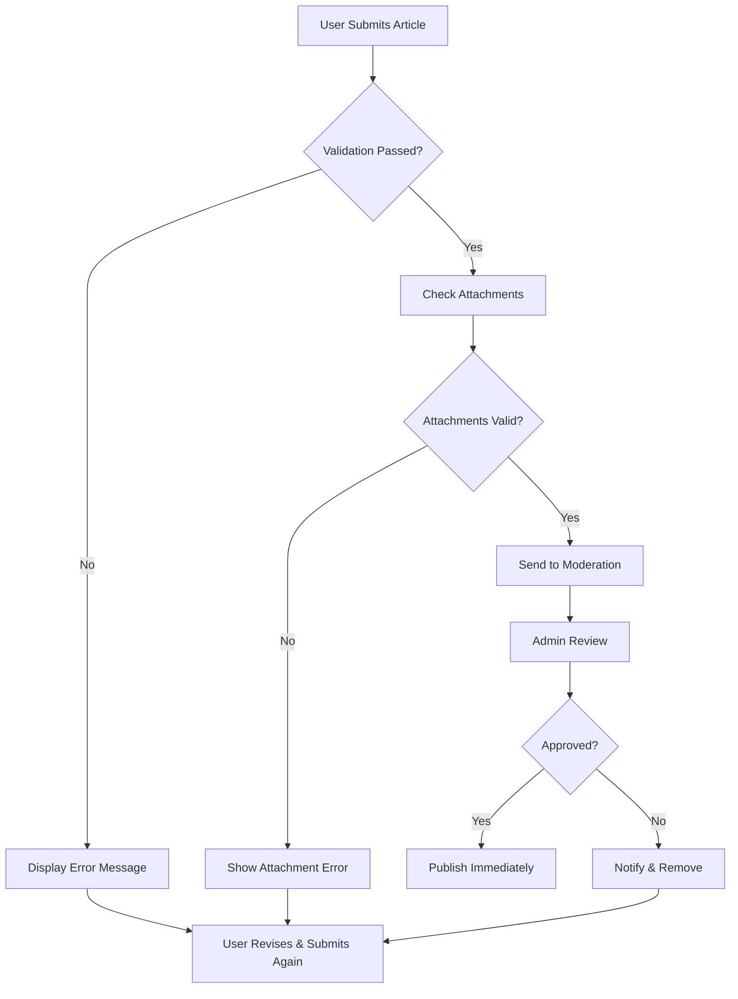

# Business Rules and Validation Requirements

## Introduction and Overview

This document outlines the comprehensive business rules and validation requirements for the economic/political discussion board. These rules govern article creation, commenting, user management, content moderation, and attachment handling in natural language terms that developers can easily implement. All rules are designed to support a straightforward and minimal discussion board while maintaining appropriate content standards for economic and political topics.

## Article Validation Rules

WHEN a member submits an article, THE system SHALL validate that the article title contains at least one non-whitespace character and is no longer than 200 characters to ensure meaningful titles.  
WHEN a member enters article content, THE system SHALL require the content to include at least 20 meaningful characters while limiting the maximum length to 10,000 characters to prevent spam and maintain readability.  
WHEN an article is categorized, THE system SHALL only accept categories related to economic or political topics, such as "Macroeconomics," "Political Science," or "Economic Policy."  
WHEN an article contains inappropriate language, THE system SHALL flag it and prevent publication until the member modifies the content to remove offensive terms.  
WHEN validation fails, THE system SHALL provide clear error messages to guide the member on corrections, such as "Article title cannot be empty" or "Content must contain meaningful text."

Additionally, the article submission flow includes moderation queue check: WHEN an article passes initial validation, THE system SHALL place it in a moderation queue if it contains keywords associated with sensitive political topics, keeping it unpublished until approved by an administrator.

## Comment Rules

WHEN a guest or member attempts to comment, THE system SHALL allow commenting only on published articles, redirecting users to the article listing if they try to comment on unpublished content.  
WHEN posting a comment, THE system SHALL validate that the comment contains between 1 and 500 characters, starting with a letter or number to prevent meaningless input.  
WHEN a member comments excessively, THE system SHALL implement a rate limit of no more than 10 comments per article per day per member to prevent spam and maintain discussion quality.  
WHEN a comment includes prohibited language (such as hate speech or personal attacks), THE system SHALL automatically flag it for moderation review and hide it from public view until an administrator decides.  
WHEN comments are posted, THE system SHALL display them in chronological order with the newest comments appearing at the bottom, using timestamps in the user's timezone for clarity.

The comment system also supports threaded replies up to 3 levels deep, where WHEN a member replies to another comment, THE system SHALL maintain the parent-child relationship and indent replies appropriately for readability.

## User Account Rules

WHEN a user registers, THE system SHALL validate the email address using standard RFC 5322 format and ensure it is unique within the system to prevent duplicate accounts.  
WHEN creating a username, THE system SHALL require it to be unique, between 3-30 characters, containing only alphanumeric characters and underscores, avoiding public display of inappropriate names.  
WHEN issuing password reset, THE system SHALL send a verification email within 5 seconds of request, containing a secure token valid for exactly 24 hours.  
WHEN an account violates rules multiple times, THE system SHALL suspend it automatically after 3 warnings, sending a final notification email with suspension details.  
WHEN an account is suspended, THE system SHALL archive but preserve all content for potential future reinstatement, notifying the user via email and in-app message.

User registration also includes age verification: WHEN registering, THE system SHALL require a birthdate confirmation ensuring the user is 18 years or older, blocking registration attempts from users under age.

## Attachment Constraints

WHEN uploading an image attachment, THE system SHALL accept only JPEG, PNG, and GIF formats to ensure compatibility and security, rejecting other file types with a clear error message.  
WHEN processing file uploads, THE system SHALL enforce a maximum file size of 5 megabytes per attachment to prevent system overload and ensure reasonable hosting costs.  
WHEN uploading documents, THE system SHALL allow only PDF, DOC, and DOCX formats for attached files, with the same size limits, while blocking executable files to prevent security risks.  
WHEN an invalid attachment is submitted, THE system SHALL provide specific feedback such as "File size exceeds 5MB limit" or "Unsupported file format" to help users correct their uploads.  
WHEN storing attachments, THE system SHALL generate unique filenames, associate them with their parent article immediately upon successful upload, and store them securely in cloud storage.

The attachment process includes upload progress indicators: WHEN a file uploads, THE system SHALL display real-time progress bars and estimated completion time for files larger than 1MB to improve user experience.

## Moderation Rules

WHEN content is submitted, THE system SHALL scan for inflammatory language patterns, such as words associated with political extremism or economic conspiracy theories, and automatically flag suspicious articles.  
WHEN an article is flagged, THE system SHALL route it to the administrator moderation queue with a priority based on keyword severity, displaying the most urgent items first.  
WHEN an administrator reviews flagged content, THE system SHALL provide options to approve, reject, or request edits, with the ability to leave detailed feedback for the member.  
WHEN rejecting content, THE system SHALL email the member immediately with specific reasons ("Contains politically inflammatory language") and guidance on how to resubmit appropriately.  
WHEN approving content, THE system SHALL publish it instantly with a timestamp and add a moderation approval note for transparency.

Moderation guidelines focus on maintaining respectful discourse: Administrators SHALL prioritize content that adds value to economic and political discussions while prohibiting personal attacks, misinformation, and hate speech, with a 2-hour average response time for flagged items during business hours.

## Age Restrictions

THE system SHALL restrict all account registrations to users aged 18 years or older, requiring verifiable birthdate confirmation during signup.  
WHEN a user indicates they are under 18, THE system SHALL block registration completely, displaying a message: "This service is intended for adults 18+ due to the mature nature of economic and political content."  
WHEN age is questionable (e.g., claiming exactly 18), THE system SHALL require additional verification such as email confirmation from a verified domain.  
THE system SHALL assume user maturity for sensitive topics without additional age validation beyond registration, as required governance is met at signup.  
WHEN minors attempt access through non-standard means, THE system SHALL detect and block such attempts, maintaining the adult-only environment.

## Content Submission Flow

## Comment Moderation Flow

WHEN a comment is flagged for violation, THE system SHALL hide it temporarily and notify moderators, who can respond within 1 hour during active periods. Moderators review flagged comments in a dedicated dashboard showing the comment, context, and violation reason, allowing them to delete, edit, or reinstate as needed.

## File Upload Process

Files are processed asynchronously: WHEN an upload completes, THE system SHALL generate thumbnails for images automatically, store files in secure S3-compatible storage, and update the article record with attachment URLs immediately upon completion.

## Error Handling in Validation

WHEN network issues occur during submission, THE system SHALL save draft content locally and retry automatically. When user input is invalid, specific error messages guide corrections, and the system prevents submission until all issues are resolved.

This comprehensive set of business rules ensures the discussion board remains focused on constructive economic and political discourse while providing clear implementation guidelines for backend developers. All rules are designed to be minimal yet effective, prioritizing user experience and content quality.