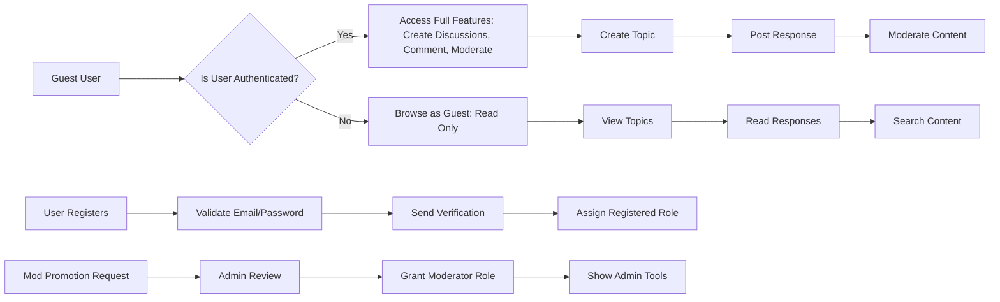
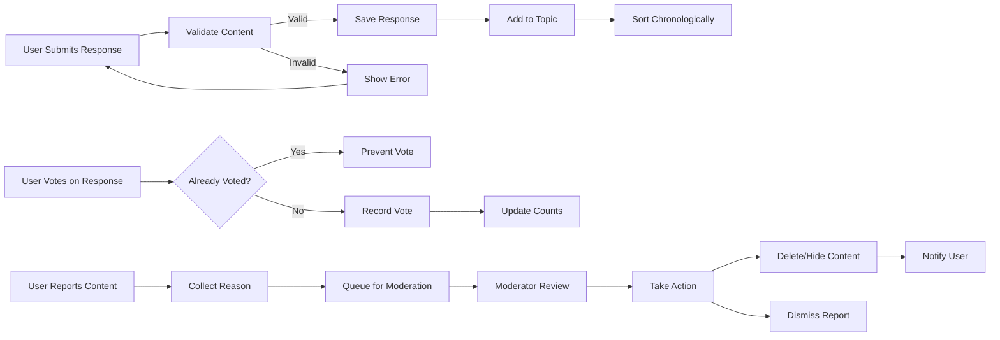
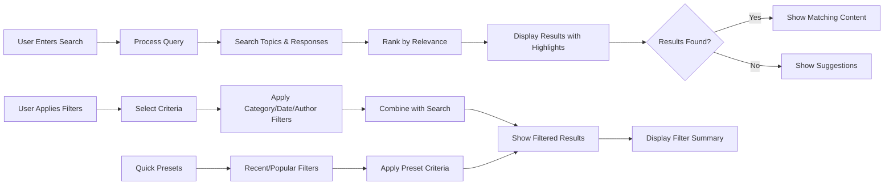
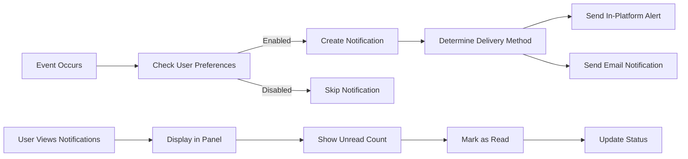

# Discussion Board Functional Requirements

## Introduction

This document defines the functional requirements for the Simple Economic/Political Discussion Board system. The platform enables users to engage in discussions on economic and political topics through topics and responses. The requirements are specified using natural language and the EARS (Easy Approach to Requirements Syntax) format where applicable, ensuring clarity for backend developers. All requirements focus on business logic, user interactions, and validation rules without specifying technical implementation details.

The discussion board operates as a business service that fosters informed discussions on economic and political issues. Users can be anonymous visitors browsing content, registered members creating and participating in discussions, or moderators managing the platform.

Business objectives include:
- Providing a space for civil discourse on economic and political topics
- Enabling user-generated content with moderation to maintain quality
- Supporting user registration, authentication, and role-based access
- Delivering real-time search and filtering capabilities for content discovery
- Implementing notifications to keep users engaged with relevant discussions

SYSTEM ROLES:
- Guest users: Can browse discussions but cannot post or interact
- Registered users: Can create topics, post responses, and moderate their own content
- Moderators: Can manage all content and users beyond basic post management

These requirements ensure the system meets user expectations for functionality while maintaining data integrity and appropriate access controls.

For detailed user scenarios that inform these requirements, refer to the [User Scenarios Document](./03-discussionBoard-userScenarios.md).
For the underlying business rules governing these functions, refer to the [Business Rules Document](./05-discussionBoard-businessRules.md).

All requirements in this document are expressed in natural language or EARS format to avoid ambiguity.

## Discussion Management Requirements

Discussion management encompasses the creation, display, and organization of discussion topics. Topics serve as the primary containers for economic and political discussions, allowing users to initiate conversations on specific subjects.

### Topic Creation
WHEN a user attempts to create a discussion topic, THE system SHALL validate the topic title meets minimum length requirements of 10 characters and maximum length of 200 characters.
WHEN the user submits the topic, THE system SHALL validate the input format and uniqueness.  
IF the topic title is empty or exceeds 200 characters, THEN THE system SHALL prevent submission and display appropriate error message.  
IF the topic description exceeds 1000 characters, THEN THE system SHALL truncate the content or prevent submission.  
WHEN a topic is successfully created, THE system SHALL assign it a unique identifier, timestamp the creation, and associate it with the creator's account.  

WHEN a user creates a topic without authentication, THE system SHALL redirect to login with a message about registration requirements.
WHEN a registered user submits a topic with invalid characters, THE system SHALL display specific validation errors for each field.
WHEN the topic content contains prohibited content, THE system SHALL flag it for moderator review before publishing.

### Topic Display
THE discussion board SHALL display topics in reverse chronological order (newest first) on the main page.  
WHEN a guest or registered user views the topic list, THE system SHALL show topic title, creator name, creation date, response count, and last activity timestamp.  
WHEN a user selects a topic, THE system SHALL display the full topic content including all responses in chronological order.  
IF a topic has no responses, THE system SHALL indicate this status clearly.  

WHEN a topic has more than 50 responses, THE system SHALL paginate responses with 20 per page and navigation controls.
WHEN users load a topic page, THE system SHALL track the view count in real-time.
WHEN a topic becomes locked by moderators, THE system SHALL display a visual indicator that no new responses are allowed.

### Topic Categories
THE discussion board SHALL support predefined categories for economic and political topics (Economics, Politics, Policy, Finance, International).  
WHEN creating a topic, THE system SHALL require category selection to organize discussions.  
WHEN browsing topics, THE system SHALL provide category filtering options.  
WHEN a category has no topics, THE system SHALL indicate empty state appropriately.  

WHEN users filter by multiple categories, THE system SHALL show topics matching any selected category with clear filter indicators.
WHEN moderators move a topic to a different category, THE system SHALL update the category association and notify followers of the change.

### Topic Moderation
WHEN a user (topic creator or moderator) requests topic deletion, THE system SHALL mark the topic and all associated responses as deleted (soft delete).  
WHEN a moderator locks a topic, THE system SHALL prevent new responses while allowing existing content to remain visible.  
WHEN a moderator pins a topic, THE system SHALL display it at the top of category listings.  
WHEN a moderator moves a topic between categories, THE system SHALL update category associations and refresh display.  

THE discussion board SHALL enforce content policies for topics, validating that titles and descriptions contain appropriate language and are relevant to economic/political themes.

WHEN moderators review new topics, THE system SHALL provide tools to approve, reject, or edit before publication.
WHEN a topic is rejected, THE system SHALL send the creator an explanation with re-submission guidelines.
WHEN moderators edit inappropriate content, THE system SHALL log the changes with timestamps and moderator identity.

### Topic Statistics
WHEN a topic is viewed, THE system SHALL track and display view counts.  
WHEN a topic receives responses, THE system SHALL update and display response counts.  
WHEN users interact with topics (view, respond), THE system SHALL maintain activity timestamps for sorting and discovery.

WHEN data is requested for analytics, THE system SHALL provide aggregate statistics without individual user identification.
WHEN topics reach milestone response counts, THE system SHALL automatically highlight them in featured sections.

## User Management Requirements

User management covers registration, authentication, and profile management for participants in the discussion board.

### User Registration
WHEN a guest initiates registration, THE system SHALL collect email, password, and optional username.  
WHEN a user registers with an existing email, THE system SHALL reject the registration with an appropriate error message.  
WHEN the registration is submitted, THE system SHALL validate email format and password strength.  
IF validation fails, THE system SHALL display specific error messages for each invalid field.  
WHEN registration succeeds, THE system SHALL create the user account, send a verification email, and assign registered user role.  

WHEN a user fails email verification within 7 days, THE system SHALL send reminder notifications.
WHEN a password meets minimum strength (8 characters, mixed case, numbers), THE system SHALL accept it.
WHEN usernames are provided, THE system SHALL validate uniqueness and length (3-30 characters).

### Authentication
WHEN a registered user submits login credentials, THE system SHALL verify email/password combination.  
IF credentials are valid, THE system SHALL authenticate the user session and redirect to appropriate dashboard.  
IF credentials are invalid, THE system SHALL display error message and track login attempts.  
WHEN an authenticated user logs out, THE system SHALL terminate the session and redirect to public landing page.  
THE system SHALL maintain user sessions with appropriate timeout policies.

WHEN users request password reset, THE system SHALL send secure reset links valid for 24 hours.
WHEN sessions expire due to inactivity (after 2 hours), THE system SHALL require re-authentication.
WHEN brute force attempts are detected (5 failed logins), THE system SHALL temporarily lock the account for 30 minutes.

### Profile Management
WHEN a registered user accesses their profile, THE system SHALL display personal information (username, email, join date, post count).  
WHEN the user edits profile, THE system SHALL validate changes including unique username and valid email format.  
WHEN a user changes password, THE system SHALL require current password verification and enforce strength requirements.  
THE system SHALL allow users to delete their account with confirmation, marking all content as anonymous.

WHEN users view their contribution history, THE system SHALL show all topics and responses with edit history.
WHEN account deletion is requested, THE system SHALL require confirmation and provide data export options.

### Role Management
THE discussion board SHALL support three user types: guest, registered user, and moderator.  
WHEN a registered user is promoted to moderator, THE system SHALL update role permissions and display administrative tools.  
WHEN a moderator demotes a user, THE system SHALL validate authority and notify affected user.  
THE system SHALL prevent guests from accessing member-only features while enforcing role-based restrictions.

WHEN moderators are promoted from registered users, THE system SHALL provide role-specific training through the interface.
WHEN unauthorized role changes are attempted, THE system SHALL log security violations and notify administrators.
WHEN role downgrades occur, THE system SHALL remove inaccessible features from the user interface.

## Content Interaction Requirements

Content interaction defines how users engage with topics through responses, voting, and sharing functionality.

### Response Creation
WHEN a registered user views a topic, THE system SHALL provide a response creation form with text area and submission controls.  
WHEN the user submits a response, THE system SHALL validate content length (maximum 2000 characters) and format.  
IF the response is empty or too long, THE system SHALL prevent submission and show error message.  
WHEN response is accepted, THE system SHALL add it to the topic in chronological order, associate with user, and timestamp the submission.

WHEN responses contain inappropriate language, THE system SHALL automatically flag them for moderation review.
WHEN users attempt to post responses to locked topics, THE system SHALL display an error explaining the restriction.
WHEN responses are submitted during high-traffic periods, THE system SHALL confirm submission within 5 seconds.

### Response Display
WHEN displaying topic responses, THE system SHALL show author name, content, create date, edit indicator, and action buttons.  
WHEN responses exceed display limit, THE system SHALL paginate content with navigation controls.  
WHEN a user edits their response, THE system SHALL allow modifications within 30 minutes of posting, preserving edit history.

WHEN response threads become nested, THE system SHALL visually indent sub-responses for clarity.
WHEN users report responses, THE system SHALL show the action button with clear labeling.
WHEN moderators approve edited responses, THE system SHALL display edit history in a collapsible format.

### Content Voting
WHEN registered users view responses, THE system SHALL provide upvote/downvote controls per response.  
WHEN a vote is cast, THE system SHALL update vote counts and prevent multiple votes from same user.  
THE system SHALL display vote totals publicly for each response, affecting response ordering.

WHEN users attempt to vote on their own responses, THE system SHALL prevent the action and display a message.
WHEN vote manipulation is detected, THE system SHALL reset affected vote counts and flag for investigation.
WHEN sorting by popularity, THE system SHALL calculate scores based on vote totals minus time decay.

### Content Reporting
WHEN a user reports inappropriate content, THE system SHALL collect report reason and notify moderators.  
WHEN moderators review reports, THE system SHALL provide tools to approve, delete, or dismiss the report.  
WHEN content is deleted by moderator, THE system SHALL remove it from public view and notify originator.

WHEN reports accumulate (3+ for same content), THE system SHALL automatically hide the content pending review.
WHEN users report spam repeatedly, THE system SHALL implement cooldown periods between reports.
WHEN reports are dismissed, THE system SHALL notify reporters with explanation.

## Search and Filtering Requirements

Search and filtering enable users to discover relevant economic and political discussions effectively.

### Basic Search
WHEN a user enters search terms, THE system SHALL search within topic titles, descriptions, and response content.  
THE system SHALL return results ranked by relevance, displaying matching topics with highlighted terms.  
WHEN no results match, THE system SHALL suggest alternative searches or show "no results" message.  
THE system SHALL perform search instantly for common query types, supporting partial matches.

WHEN search terms contain special characters, THE system SHALL handle them appropriately for accurate results.
WHEN users search quoted phrases, THE system SHALL treat them as exact matches.
WHEN search performance degrades, THE system SHALL prioritize recent and popular content in results.

### Category Filtering
WHEN users browse topics, THE system SHALL offer category filters (Economics, Politics, Policy, Finance, International).  
WHEN multiple categories are selected, THE system SHALL show topics matching any selected category.  
THE system SHALL display active filters with clear removal options.

WHEN category combinations are complex, THE system SHALL provide AND/OR logic selection.
WHEN new categories are added, THE system SHALL automatically include them in filter options.

### Response Search
WHEN searching within a topic, THE system SHALL filter responses containing the search terms.  
WHEN search terms are found, THE system SHALL highlight matching text and show response context.

WHEN intra-topic search finds no matches, THE system SHALL suggest expanding search to related topics.
WHEN response search is performed, THE system SHALL maintain topic context while showing only matching responses.

### Advanced Filtering
WHEN users apply filters, THE system SHALL support combinations of category, date range, author, and popularity criteria.  
WHEN filters are applied, THE system SHALL show filter summary and allow incremental modifications.  
THE system SHALL provide quick filter presets like "Recent Discussions" and "Popular Topics".

WHEN advanced filters are applied, THE system SHALL cache results for 5 minutes to improve performance.
WHEN filter combinations return no results, THE system SHALL suggest filter relaxation options.

## Notification Requirements

Notifications keep users informed about discussions and interactions relevant to their interests.

### Notification Types
WHEN a topic receives a new response, THE system SHALL notify the topic creator and recent responders.  
WHEN a user is mentioned in a response, THE system SHALL send direct notification to the mentioned user.  
WHEN a moderator takes action on user content, THE system SHALL notify the content author.  
WHEN a user's content is voted highly, THE system SHALL consider sending recognition notifications.

WHEN users follow specific users, THE system SHALL notify them of those users' activities.
WHEN topics reach popularity thresholds, THE system SHALL notify interested users.
WHEN responses receive significant votes, THE system SHALL send engagement notifications.

### Notification Preferences
WHEN a registered user configures settings, THE system SHALL allow enabling/disabling different notification types.  
THE system SHALL support notification delivery through in-platform alerts and email options.  
WHEN users opt out, THE system SHALL respect preferences and avoid sending unwanted notifications.

WHEN users configure granular preferences, THE system SHALL allow different settings for mentions vs. responses.
WHEN notification preferences change, THE system SHALL immediately apply them to future events.
WHEN email delivery fails, THE system SHALL fallback to in-platform notifications.

### Notification Display
WHEN users access the platform, THE system SHALL show recent notifications in a dedicated panel.  
WHEN notifications accumulate unread, THE system SHALL indicate count with visual indicators.  
WHEN users mark notifications read, THE system SHALL update status and potentially archive old notifications.

WHEN notifications exceed 50 unread, THE system SHALL group them by type and show summaries.
WHEN users access notification history, THE system SHALL provide date-ordered archive view.

## Requirements Validation Summary

The following table summarizes key validation rules across all functional areas:

| Requirement Area | Key Validations | Business Rules |
|------------------|-----------------|---------------|
| Discussion Management | Title length 10-200 chars, description max 1000 chars, category selection, uniqueness check, content policies | Economic/political theme relevance, moderator approval workflow, view tracking, statistics aggregation |
| User Management | Email format validation, password strength (8+ chars, mixed case, numbers), username uniqueness 3-30 chars, role hierarchy enforcement | Account creation with email verification, session management, profile editing with validation, secure authentication with brute force protection |
| Content Interaction | Response max 2000 chars, voting uniqueness per user, reporting with reasons, edit within 30 minutes | Authorship verification, inappropriate content flagging, response nesting logic, voting manipulation detection, moderation workflow |
| Search/Filtering | Query processing with spelling tolerance, category multi-selection, date range filtering, popularity sorting | Relevance ranking algorithm, real-time indexing, filter combination logic, performance optimization for large result sets |
| Notifications | Delivery preference enforcement, mention detection, vote threshold monitoring, moderation action notification | User activity tracking, preference-based delivery, notification history management, spam prevention measures |

All requirements maintain consistency with the [User Scenarios Document](./03-discussionBoard-userScenarios.md) and [Business Rules Document](./05-discussionBoard-businessRules.md), forming a complete specification for discussion board functionality.

WHEN implementing these requirements, THE system SHALL ensure all user interactions are secured through proper authentication and authorization.
WHEN performance monitoring shows bottlenecks, THE system SHALL optimize based on usage patterns.
WHEN new features are requested, THE system SHALL validate them against these functional requirements before addition.

The system SHALL operate continuously with all specified functions working as described, supporting economic and political discussions with appropriate user management and content controls. Business expansion including mobile access, API integrations, and advanced moderation tools SHALL build upon these foundational requirements.