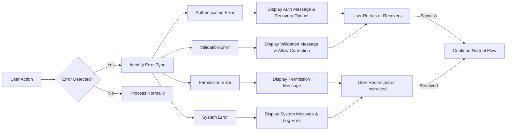

# Error Handling Requirements for Discussion Board Service

## Introduction

This document outlines the comprehensive error handling requirements for the economic/political discussion board service. Error handling is critical for maintaining user trust and ensuring the system feels reliable and professional. All error scenarios are described from the user's perspective, focusing on what they see and how they can recover.

The requirements define how the system should respond to various error conditions, what user-friendly messages to display, and what recovery options to provide. Performance expectations ensure errors are communicated quickly without unnecessary delays.

All requirements use EARS format (IF ... THEN ...) where applicable to ensure testable, unambiguous specifications.

## Authentication Errors

### Login Failures
IF a user enters incorrect login credentials,
THEN THE system SHALL display a clear error message stating "Invalid username or password" and provide a link to reset password.

IF a user's account is temporarily locked due to multiple failed login attempts,
THEN THE system SHALL display an error message "Account temporarily locked for security reasons. Try again in 15 minutes." and start a 15-minute lockout timer.

IF a user attempts to log in with an expired password,
THEN THE system SHALL display "Your password has expired. Please change your password." and redirect to the password change form.

### Session Management Errors
IF a user's session expires automatically,
THEN THE system SHALL redirect to the login page with a message "Your session has expired. Please log in again." and preserve any unsaved work if possible.

IF a user is logged out due to concurrent login from another device (for member/admin accounts),
THEN THE system SHALL display "You have been logged out because you logged in from another device." and require reauthentication.

### Registration Errors
IF a user attempts to register with an email address already in use,
THEN THE system SHALL display "This email address is already registered. Please use a different email or log in." and offer a "Forgot Password" option.

IF a user enters an invalid email format during registration,
THEN THE system SHALL highlight the email field and display "Please enter a valid email address."

## Article Submission Errors

### Article Validation Errors
IF a user submits an article without a title,
THEN THE system SHALL display "Article title is required. Please add a title before publishing."

IF a user's article exceeds the 10,000 character limit,
THEN THE system SHALL display "Article content exceeds the maximum length of 10,000 characters. Please shorten your article." and show the current character count.

IF a user attempts to publish an article with prohibited content (determined by predefined filter rules),
THEN THE system SHALL display "Your article contains prohibited content and cannot be published. Please review and edit before submitting."

### Attachment Errors During Submission
IF a user tries to submit an article larger than 20MB including attachments,
THEN THE system SHALL display "Article and attachments exceed the maximum size limit of 20MB. Please reduce file sizes or remove some attachments."

IF a user includes more than 5 file attachments to an article,
THEN THE system SHALL display "Maximum 5 file attachments allowed per article. Please remove some files."

### Publishing Workflow Errors
IF a member submits an article that requires admin approval,
THEN THE system SHALL display "Your article has been submitted for approval. You will receive a notification when it is published." and save it as "pending approval" status.

IF an article with attachments takes longer than 10 seconds to process,
THEN THE system SHALL display a progress indicator with message "Processing your article and attachments..." and prevent multiple submissions.

## File Upload Errors

### File Type Restrictions
IF a user uploads a file with a prohibited extension (anything other than images: jpg, png, gif and documents: pdf, txt, doc, docx),
THEN THE system SHALL display "File type not supported. Only image files (JPG, PNG, GIF) and documents (PDF, TXT, DOC, DOCX) are allowed."

IF a user uploads an image file that is corrupted or unreadable,
THEN THE system SHALL display "The uploaded image file appears to be corrupted. Please check the file and try again."

### File Size Limitations
IF a user uploads a single file larger than 5MB,
THEN THE system SHALL display "File size exceeds the maximum limit of 5MB. Please choose a smaller file."

IF a user tries to upload multiple files where the total size exceeds 10MB,
THEN THE system SHALL display "Total file size exceeds 10MB. Please reduce the number or size of files."

### Upload Process Errors
IF the upload fails due to network connection issues,
THEN THE system SHALL display "Upload failed. Please check your internet connection and try again." and offer a "Retry Upload" button.

IF the server storage is temporarily full during upload,
THEN THE system SHALL display "Upload failed due to temporary server issues. Please try again in a few minutes or contact support."

### Image-Specific Errors
IF a user uploads an image with insufficient resolution (less than 100x100 pixels),
THEN THE system SHALL display "Image is too small. Please use an image with at least 100x100 pixels for optimal viewing."

IF an uploaded image contains inappropriate content (detected by basic filters),
THEN THE system SHALL display "The uploaded image may contain inappropriate content and cannot be attached. Please choose a different image."

## Permission Errors

### Access Control Violations
IF a guest user attempts to create an article,
THEN THE system SHALL display "Please log in to create articles." and redirect to the login form.

IF a member attempts to edit an article they did not author,
THEN THE system SHALL display "You do not have permission to edit this article." and provide a "Back to Discussions" option.

IF a user tries to access the admin dashboard without admin privileges,
THEN THE system SHALL display "Access denied. Admin privileges required." and log the access attempt for security review.

### Moderation Permission Errors
IF a non-admin user attempts to approve or reject pending articles,
THEN THE system SHALL display "You do not have moderation privileges to manage this content."

IF a member attempts to delete an article that has attached files,
THEN THE system SHALL display "You cannot delete articles with attachments. Contact an administrator for assistance."

### Sharing and Privacy Errors
IF a user tries to share a private discussion link with someone not authorized to view it,
THEN THE system SHALL display "This content is private and can only be viewed by authorized users."

## System Errors

### Server and Database Errors
IF the system encounters a database connection error during any operation,
THEN THE system SHALL display "The system is temporarily unavailable. Please try again in a few minutes." and log the error for technical review.

IF a server timeout occurs during article submission,
THEN THE system SHALL display "Request timed out. Your changes may not have been saved. Please check and resubmit." and offer to save draft locally.

### Maintenance Mode Errors
WHEN the system enters scheduled maintenance mode,
THEN THE system SHALL display "The discussion board is currently undergoing maintenance and will be available shortly. Estimated downtime: X hours." and prevent all write operations.

IF maintenance mode is unexpectedly prolonged beyond scheduled time,
THEN THE system SHALL display an updated message with current status and contact information.

### Unexpected System Errors
IF an unexpected error occurs during any user action,
THEN THE system SHALL display "An unexpected error occurred. Please try again or contact support if the problem persists." and include a unique error reference number.

IF repeated unexpected errors occur within a short time period,
THEN THE system SHALL temporarily limit the user's actions and display "Too many errors detected. Please wait 5 minutes before continuing."

## Recovery Processes

### Error Recovery Guidelines
THE system SHALL provide clear recovery options for all recoverable errors, such as:
- Retry buttons for network-related failures
- Links to help pages for complex error conditions
- "Return to Previous Page" options for navigation errors
- Contact support links for irrecoverable issues

### User Communication Standards
THE system SHALL ensure all error messages:
- Are written in clear, non-technical English
- Explain what went wrong in simple terms
- Provide specific actions the user can take to resolve the issue
- Maintain a professional, supportive tone
- Include contact information when appropriate

THE system SHALL respond to all errors within 2 seconds to maintain user confidence.

## Performance Expectations

WHEN any error occurs,
THE system SHALL display the error message within 1 second of detection.

WHEN network-related upload failures occur,
THE system SHALL provide automatic retry functionality with a count of remaining attempts (up to 3 retries).

WHEN system errors require user action to recover,
THE system SHALL preserve as much user input as possible to minimize frustration.

## Success Criteria

Successful error handling will be measured by:
- No user-facing errors that expose technical details
- Error messages that clearly explain the problem and solution
- Recovery processes that work in at least 95% of error scenarios
- Error responses delivered within specified time limits
- User feedback surveys showing acceptable error experience ratings

This comprehensive error handling approach ensures the discussion board remains user-friendly even during problematic conditions, maintaining engagement and trust in the platform's reliability.

## Error Handling Flow Overview

This diagram illustrates the general error handling process that applies across all error categories in the discussion board system.