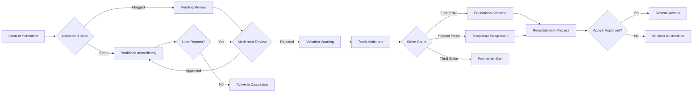

# Content Moderation and Administration Framework for Discussion Board

## Executive Summary

This document establishes the comprehensive business requirements for content moderation within the economic and political discussion board platform. The moderation system ensures quality discourse while protecting users from harmful content, implementing scalable workflows that balance human oversight with automated tools. All specifications focus on business logic and user experience outcomes rather than technical implementation details.

The platform operates as a moderated community space for economic and political discussions, requiring robust moderation capabilities to maintain quality and safety standards. Moderators serve as administrators with escalated privileges to manage content, enforce policies, and handle violations, supporting the business goal of fostering informed, respectful conversations on civic matters.

WHEN inappropriate content is submitted to the platform, THE moderation system SHALL detect and handle violations through graduated enforcement processes.

WHILE users participate in discussions, THE platform SHALL maintain moderation capabilities that promote constructive dialogue and prevent harm.

## Moderation Objectives

### Business Goals for Content Moderation

WHEN the discussion board launches, THE moderation system SHALL establish trust by immediately handling inappropriate content submissions.

WHEN community standards are established, THE moderation system SHALL clearly communicate rules to prevent violations and guide proper behavior.

WHEN moderators review content, THE platform SHALL provide efficient tools to maintain high-quality discussions without excessive overhead.

WHEN users report violations, THE moderation system SHALL respond promptly to address concerns and maintain community health.

### Content Policy Framework

WHEN defining content policies, THE platform SHALL prohibit speech that incites violence, discrimination, or direct threats against individuals.

WHEN economic or political content is submitted, THE platform SHALL allow vigorous debate while prohibiting misinformation that could cause harm.

WHEN users submit content, THE moderation system SHALL validate against published community guidelines before public visibility.

WHEN content violates standards, THE platform SHALL implement clear escalation procedures ranging from warnings to account restrictions.

WHEN defining moderation policies, THE system SHALL address spam content that floods discussion threads with irrelevant material.

WHEN moderating user interactions, THE system SHALL prevent harassment through consistent enforcement of behavioral standards.

### Quality Assurance Standards

WHEN assessing discussion quality, THE moderation system SHALL promote content that advances understanding of economic and political issues.

WHEN evaluating content value, THE moderators SHALL prioritize substantive contributions over emotional outbursts.

WHEN reviewing submission appropriateness, THE system SHALL consider cultural sensitivity and community standards specific to economic/political discourse.

## User Role Responsibilities in Moderation

### Guest User Moderation Participation

WHEN guest users encounter inappropriate content, THE platform SHALL provide clear reporting mechanisms accessible without registration requirements.

THE guest users SHALL be able to flag content for review without creating accounts, contributing to community safety efforts.

WHEN guest reports are submitted, THE moderation system SHALL process them with equal priority to registered user reports.

### Registered User Moderation Roles

WHEN registered users report suspected violations, THE moderation system SHALL acknowledge their reports within 2 hours and provide status updates.

WHEN registered users participate actively, THE platform SHALL recognize consistent positive behavior with potential promotion to moderator status.

WHEN users submit content that receives multiple reports, THE moderation system SHALL notify the submitter of concerns with opportunities for revision.

### Moderator Privileges and Duties

WHEN moderators authenticate to access administrative tools, THE platform SHALL verify their elevated role permissions.

THE moderators SHALL have authority to review all pending content submissions within designated timeframes.

WHEN moderators identify policy violations, THE platform SHALL provide tools to remove content, warn users, or escalate serious issues.

THE moderators SHALL monitor discussion trends to identify emerging problematic patterns and adjust moderation strategies accordingly.

WHEN moderators make public announcements, THE platform SHALL clearly identify their moderator status to maintain transparency.

### Administrative Authority Structure

WHEN platform administrators define moderation policies, THE system SHALL allow configurable thresholds and violation categories.

THE administrators SHALL access system-wide reports showing moderation effectiveness and content trends.

WHEN administrative decisions override moderator actions, THE platform SHALL log justifications for audit purposes.

THE administrators SHALL establish moderator training requirements and performance evaluation processes.

## Content Review Workflows

### Discussion Topic Approval Process

WHEN a user submits a new discussion topic, THE moderation system SHALL immediately place it in pending status for review.

THE topic approval queue SHALL display submissions chronologically with clear categorization by time and subject matter.

WHEN moderators review pending topics, THE system SHALL show submission details including author information, content preview, and applicable policy checks.

THE moderators SHALL select from approval options: immediate publish, request revisions, reject with reasoning.

WHEN topics receive revision requests, THE system SHALL notify authors with specific guidance for improvement and allow single resubmission.

WHEN approved topics are published, THE moderation system SHALL timestamp the approval and associate moderator responsibility.

THE approval process SHALL complete within 24 hours for submitted topics, with automatic approval after delay for non-critical categories.

### Response Comment Moderation

WHEN users submit replies to existing discussions, THE platform SHALL initially publish them while monitoring for automated flags.

THE automated content scanner SHALL check for violations including spam patterns, prohibited words, and link abuse.

WHEN automated flags trigger, THE system SHALL move content to high-priority review queue for immediate attention.

WHEN moderators review flagged responses, THE system SHALL provide context showing the parent discussion and recent interaction history.

WHEN responses are deemed appropriate, THE moderators SHALL clear flags and restore normal visibility.

WHEN responses violate policies, THE moderators SHALL remove inappropriate content and notify submitters of violations.

THE moderation system SHALL log all response review actions with timestamps and moderator identification.

### Automated Content Scanning Rules

WHEN submissions contain excessive capital letters (more than 70% caps), THE scanner SHALL flag for review as potential shouting.

WHEN links exceed reasonable limits (more than 3 external URLs), THE system SHALL require moderator approval before publication.

WHEN content matches known spam patterns like repeated phrases or promotional material, THE automated system SHALL hold submissions.

WHEN detecting impersonation attempts, THE scanner SHALL compare against user profiles and flag suspicious accounts.

THE automated scanner SHALL run in real-time for all submissions while allowing moderators to adjust sensitivity levels.

## Reporting Mechanisms

### User Flagging Interface

WHEN users identify problematic content, THE platform SHALL present intuitive flagging buttons prominently displayed with each discussion element.

THE flagging interface SHALL include categorized reason options: spam/irrelevant, harassment/bullying, misleading information, inappropriate content.

WHEN users select flagging reasons, THE system SHALL request optional context explanation to assist moderator review.

THE flagging system SHALL allow multiple simultaneous reports against the same content with automatic accumulation.

WHEN users flag content, THE platform SHALL immediately acknowledge receipt without revealing moderation details.

THE flagging tools SHALL be accessible to both registered users and guests, ensuring universal reporting capability.

### Moderator Report Review Process

WHEN reports are received, THE moderation dashboard SHALL categorize by urgency and display accumulated report counts.

THE moderator workflow SHALL prioritize reports based on volume and content sensitivity ratings.

WHEN reviewing reported content, THE system SHALL display the original content with highlighted concerns from reporter explanations.

THE moderators SHALL access user history showing previous violations and account standing when evaluating reports.

WHEN resolving reports, THE moderators SHALL select resolution codes: valid violation, invalid report, requiring further investigation.

THE system SHALL notify reporters of resolution outcomes while protecting moderator and user privacy.

### Escalation Protocols

WHEN reports cannot be resolved at moderator level, THE system SHALL escalate to administrative review with detailed context.

THE escalation process SHALL occur automatically after predetermined report thresholds or discretionary moderator requests.

WHEN escalated cases reach administrators, THE system SHALL provide complete investigation history and recommended actions.

THE administrators SHALL make final determinations with options including policy changes, account suspensions, or legal referrals.

WHEN escalations result in policy modifications, THE system SHALL update automated rules and notify moderators.

### Report Analytics and Trends

WHEN analyzing report patterns, THE moderation system SHALL generate weekly summaries showing violation categories and resolution rates.

THE platform SHALL track report accuracy by comparing flagged content against final moderation decisions.

WHEN identifying report abuse (egregious false reporting), THE system SHALL implement temporary reporting restrictions.

THE analytics SHALL inform moderator training priorities and policy adjustment recommendations.

## Administrative Actions

### Content Management Tools

WHEN moderators need to remove inappropriate content, THE platform SHALL provide one-click removal with automatic archiving.

THE removal tools SHALL differentiate between temporary hiding and permanent deletion based on violation severity.

WHEN content is removed, THE system SHALL generate standardized notification templates to inform submitters.

THE administrative interface SHALL allow bulk operations for managing multiple related violations efficiently.

WHEN implementing content locks, THE moderators SHALL prevent further contributions to specific discussion threads.

THE restoration tools SHALL allow moderators to recover accidentally removed content with audit trails.

### User Management Capabilities

WHEN managing user accounts, THE moderators SHALL access comprehensive user profiles showing contribution history and violation records.

THE warning system SHALL send graduated notices: first warning, final warning, account suspension.

WHEN implementing suspensions, THE system SHALL provide duration options ranging from 24 hours to permanent bans.

THE reinstatement process SHALL require users to acknowledge violations and demonstrate corrective behavior.

WHEN permanently banning accounts, THE administrators SHALL document rationale and prevent new account creation from banned sources.

### System Configuration Controls

WHEN adjusting moderation policies, THE administrators SHALL modify violation thresholds and category definitions through administrative interfaces.

THE configuration system SHALL allow custom rule sets for different discussion categories (economic vs political topics).

WHEN implementing emergency moderation (egasing system during content storms), THE administrators SHALL activate heightened review requirements.

THE configuration changes SHALL maintain audit logs for policy evolution tracking.

### Announcement and Communication Tools

WHEN moderators need to communicate with users, THE system SHALL provide secure messaging tools for individual and group notifications.

THE announcement system SHALL allow posting site-wide notices with priority levels and expiration dates.

WHEN communicating policy changes, THE administrators SHALL distribute updates through multiple channels including in-platform alerts.

THE communication tools SHALL track delivery confirmation and user acknowledgment where applicable.

## Violation Handling Procedures

### Warning and Enforcement Framework

WHEN users receive first violations, THE moderation system SHALL send detailed education explaining the specific rule violated and expected behavior.

THE warning emails SHALL include links to complete community guidelines and examples of acceptable content.

WHEN users accumulate second violations, THE system SHALL impose temporary restrictions with clear reinstatement criteria.

THE enforcement shall follow three-strike system: 1st violation = warning, 2nd violation = suspension, 3rd violation = potential ban.

### Suspension and Reinstatement Rules

WHEN accounts are suspended, THE platform SHALL prevent all posting, commenting, and account modifications during suspension period.

THE suspension notices SHALL specify duration, violations documented, and steps required for good standing restoration.

WHILE suspended, THE users SHALL retain access to view content and understand community expectations.

WHEN reinstatement occurs, THE system SHALL automatically restore all privileges with probationary monitoring for 30 days.

THE reinstatement process SHALL require positive contribution demonstrations and moderator approval.

### Permanent Ban Procedures

WHEN implementing permanent bans, THE administrators SHALL conduct final review considering violation severity and user history.

THE ban notifications SHALL explain appeal processes and any applicable waiting periods.

WHEN users appeal bans, THE system SHALL provide structured forms for submitting evidence and demonstrating rehabilitation.

THE appeal process SHALL be reviewed by escalated administrator panels with documented decisions provided within 7 business days.

WHEN appeals are denied, THE ban SHALL remain permanent unless significant circumstances change.

### Process Flow Documentation

### Violation Categories and Handling

WHEN spam content floods discussions, THE moderation system SHALL remove multiple instances and warn account holders.

WHEN harassment occurs between users, THE moderators SHALL mediate conflicts through private communications before public actions.

WHEN misinformation spreads, THE system SHALL prioritize fact-checking assistance over immediate removal if content appears genuine.

WHEN hate speech appears, THE platform SHALL remove immediately without appeals and ban responsible accounts.

WHEN copyright infringement involves external materials, THE system SHALL require removal upon verified claims.

WHEN users violate through coordinated attacks, THE administrators SHALL implement network-level protections.

### Monitoring and Audit Requirements

WHEN violations occur, THE moderation system SHALL maintain complete audit trails for legal and operational purposes.

THE audit logs SHALL include timestamps, moderator actions, original content, and resolution rationales.

WHEN regulators request moderation records, THE administrators SHALL provide documented compliance with privacy protections.

THE audit system SHALL support automated reporting for violation trends and effectiveness metrics.

### Training and Support Requirements

WHEN moderators join the team, THE platform SHALL provide comprehensive training on community standards and moderation tools.

THE ongoing education SHALL include monthly updates on emerging violations and policy changes.

WHEN moderators need guidance, THE system SHALL offer internal support channels and decision guidance resources.

THE training program SHALL include practice scenarios and performance feedback mechanisms.

### Performance Metrics and Quality Assurance

WHEN measuring moderation effectiveness, THE platform SHALL track response times, accuracy rates, and user satisfaction scores.

THE quality assurance process SHALL include regular moderator evaluations and calibration sessions.

WHEN identifying inefficiencies, THE system SHALL implement tool improvements and process optimizations.

THE performance metrics SHALL guide resource allocation and scaling decisions.

## Business Rules and Validation Requirements

### Content Standards Enforcement

WHEN enforcing content quality, THE moderation system SHALL prioritize substantive economic and political discussions over casual conversations.

THE system SHALL validate that topics contribute meaningfully to civic education rather than purely entertaining purposes.

WHEN balancing free speech with safety, THE moderators SHALL err on the side of prevention while respecting platform guidelines.

### User Behavior Expectations

WHEN defining community behavior, THE platform SHALL establish clear rules for respectful disagreement on polarizing topics.

THE users SHALL engage constructively even when topics involve controversial economic policies or political positions.

WHEN conflicts arise, THE system SHALL encourage resolution through moderators rather than direct user confrontations.

### Data Integrity in Moderation

WHEN maintaining moderation records, THE system SHALL protect user privacy while preserving necessary audit information.

THE moderation data SHALL be segregated from regular platform analytics to limit privacy risk exposure.

WHEN processing personal data during investigations, THE moderators SHALL follow privacy-by-design principles.

### Scalability Considerations

WHEN discussion volume increases, THE moderation system SHALL scale through automated tools and expanded moderator teams.

THE workflows SHALL remain efficient during high-activity periods without sacrificing quality control.

WHEN system capacity is exceeded, THE platform SHALL implement temporary measures like delayed publishing during peak times.

## Conclusion

This framework establishes the comprehensive business requirements for content moderation on the economic/political discussion board. The system provides balanced approaches to maintaining quality discourse while protecting users and enabling vigorous debate on important civic matters. The moderation processes scale with platform growth while maintaining consistent standards and efficient enforcement mechanisms. All business logic focuses on user experience outcomes and community health while providing clear escalation paths and accountability structures.

WHEN implementing these requirements, THE development team SHALL ensure moderation tools integrate seamlessly with existing platform features while maintaining operational efficiency and user trust.

THE moderation system SHALL evolve based on community feedback and emerging challenges in online economic/political discourse.

References:
- [Table of Contents](./00-toc.md)
- [User Roles and Authentication](./02-discussionBoard-userRoles.md)
- [Non-Functional Requirements](./07-discussionBoard-nonFunctionalRequirements.md)