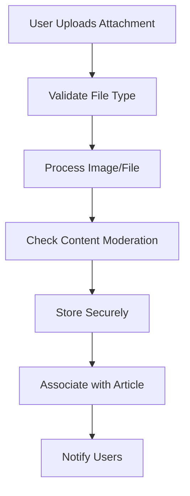

# External Integrations

## Introduction

This document details the business requirements for external integrations required to support article attachments in the economic discussion board. The system serves as a focused platform for economic and political discourse where members can enhance their articles with supporting visual evidence and documentation. External integrations handle image processing, secure file storage, content moderation, and email services to ensure a reliable and moderated experience.

The discussion board maintains a civil, fact-based environment where members share well-supported economic analysis and political viewpoints. Article attachments enable deeper, more informative discussions while external services ensure all content meets community standards.

The integrations prioritize performance for instant user responses while maintaining content quality through automated moderation and processing. All requirements are expressed in natural language, emphasizing how the system supports user goals and business workflows.

The diagram above illustrates the complete flow from user upload through storage and notification, ensuring all attachments go through proper validation and processing before becoming part of published articles.

## Image Processing

WHEN a member uploads an image to support an economic or political analysis in their article, THE system SHALL resize the image within 3 seconds to optimize loading speed while maintaining readability for viewers.

WHEN an uploaded image exceeds 2MB in size, THE system SHALL reduce its resolution automatically while preserving economic charts and political diagrams in sufficient detail for comprehension.

WHEN an image contains inappropriate content that violates community guidelines, THE system SHALL flag it for immediate human review before making it visible to other discussion board participants.

WHEN members upload economic graphs or political charts, THE system SHALL support common formats including JPEG, PNG, and GIF to accommodate various creation tools and sources.

WHEN image processing fails due to unsupported formats, THE system SHALL display a clear error message explaining which formats are accepted and allow the member to retry their upload.

WHILE processing images for article attachments, THE system SHALL maintain reasonable quality levels suitable for reading discussion content on standard devices.

WHEN images are resized, THE system SHALL preserve important elements like axis labels and data points in economic visualizations.

THE system SHALL process images within user expectation of "instant" response times, typically completing all operations within 5 seconds.

## File Storage

WHEN a member attaches a supporting document to their economic analysis article, THE system SHALL store the file securely using external cloud storage to protect against local server failures.

WHEN document files exceed reasonable size limits of 10MB per attachment, THE system SHALL reject the upload and inform the member of current size constraints for maintaining platform performance.

WHEN users access published articles with document attachments, THE system SHALL provide instant download links with direct access speeds suitable for typical broadband connections.

WHOLE the discussion board operates, THE system SHALL implement robust security measures to prevent unauthorized access to stored economic research papers and political documents.

WHEN storage operations encounter temporary failures, THE system SHALL display helpful error messages and provide clear retry options to members.

WHEN articles are deleted following community moderation guidelines, THE system SHALL automatically clean up associated attachments from storage within 24 hours.

THE system SHALL organize storage between image and document categories for efficient management and different retention policies based on common use cases.

WHEN multiple attachments are associated with an article discussing complex economic topics, THE system SHALL maintain proper ordering and metadata for each file.

## Content Moderation

WHEN any attachment is uploaded to support an economic or political discussion, THE system SHALL automatically scan it against community standards to prevent harmful or inappropriate content.

WHEN external moderation services identify potentially inappropriate images or documents, THE system SHALL quarantine attachments that require human review before they can be published with articles.

WHEN moderators review quarantined attachments, THE system SHALL provide clear approval/rejection options and reasons for transparent community enforcement.

WHEN economic analysis contains controversial political viewpoints, THE system SHALL apply additional moderation rules to ensure factual discourse without inciting harmful behavior.

WHEN moderation services are temporarily unavailable, THE system SHALL implement fallback manual review processes and delay publication of articles with suspicious attachments.

WHEN attachments are approved after moderation review, THE system SHALL immediately make them available to the discussion community.

THE system SHALL maintain moderation logs for accountability while complying with user privacy expectations.

WHEN patterns of inappropriate submissions are detected from individual members, THE system SHALL escalate automatic moderation levels.

## Email Services

WHEN new articles containing economic insights or political analysis are published with attachments, THE system SHALL send timely email notifications to subscribed members who follow those topics.

WHEN moderators complete reviews of flagged attachments, THE system SHALL send confirmation emails to article authors with clear explanations of any required actions.

WHEN new members register to join the economic discussion community, THE system SHALL use email verification services to confirm legitimate membership eligibility.

WHEN attachments are moderated and rejected, THE system SHALL provide detailed email feedback to authors about why their content was not approved for publication.

WHEN members request password resets or account changes, THE system SHALL deliver secure email instructions with time-limited access links.

WHEN technical issues affect external integrations, THE system SHALL send administrative notifications to moderators while isolating user-facing impacts.

THE system SHALL implement email delivery within reasonable timeframes, typically 10 minutes for standard notifications.

## Data Flow Overview

WHEN a member prepares to enhance their economic or political article with attachments, THE system SHALL establish secure encrypted connections to external processing and storage services.

WHILE attachments move through processing workflows, THE system SHALL provide clear progress indicators to maintain user engagement and prevent confusion.

WHEN all attachment processing completes successfully, THE system SHALL integrate the files seamlessly with the published article, maintaining proper associations for future access.

WHERE integration processes encounter connectivity issues, THE system SHALL implement retry mechanisms with exponential backoff to handle temporary network instabilities.

WHEN articles undergo edits or deletions by their authors, THE system SHALL coordinate with external storage services to maintain data consistency and prevent orphaned attachments.

WHEN moderators remove inappropriate content from the platform, THE system SHALL trigger coordinated cleanup across all integrated external services.

THE system SHALL optimize data transfer rates to ensure attachment uploads complete within user expectations for modern broadband connections.

WHEN multiple attachments are processed simultaneously, THE system SHALL manage resource allocation to prevent overwhelming any single external service.

## Integration Authentication

WHEN connecting to external image processing, storage, or moderation services, THE system SHALL use industry-standard authentication methods to establish trusted connections.

WHEN API credentials require renewal, THE system SHALL provide administrators with automated alert systems and secure credential management tools.

WHEN external service authentication fails unexpectedly, THE system SHALL log security events for review while providing graceful error handling to users.

WHILE maintaining operational continuity, THE system SHALL implement redundant authentication paths for critical service integrations.

WHEN service agreements change or new integrations are required, THE system SHALL provide administrators with configuration management for all external credential handling.

THE system SHALL implement rate limiting and monitoring for all external service connections to prevent misuse and ensure cost-effective operation.

WHEN authentication mechanisms become deprecated, THE system SHALL provide upgrade paths with minimal disruption to community article posting.

THE system SHALL maintain audit trails of all authentication events for compliance purposes.

## Security and Compliance

WHEN storing sensitive economic data or political analysis attachments, THE system SHALL encrypt all file transfers and storage to protect community privacy.

WHEN processing user-uploaded content through external services, THE system SHALL minimize data sharing to only what is necessary for processing and moderation decisions.

WHEN compliance requirements change for data handling in economic or political discussions, THE system SHALL provide administrators with notification systems for regulatory updates.

WHEN external services experience breaches or incidents, THE system SHALL have contingency procedures to protect discussion board data and user attachments.

THE system SHALL conduct regular security assessments of all external integrations to maintain community trust.

## Performance Expectations

WHEN members upload attachments to their articles, THE system SHALL deliver responses within 5 seconds for immediate user feedback and engagement.

WHEN multiple users are attaching files during peak discussion times, THE system SHALL maintain reasonable throughput rates without significant degradation.

WHEN external service response times increase, THE system SHALL implement local caching strategies for frequently accessed attachment metadata.

WHEN monitoring shows performance degradation in integrations, THE system SHALL provide administrators with alerting and diagnostic tools.

THE system SHALL achieve at least 99% uptime for all attachment-related functions through resilient integration design.