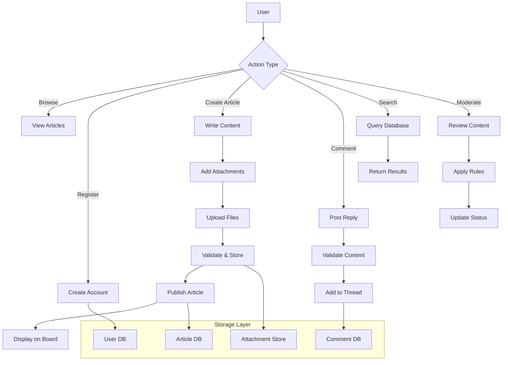

# Requirements Analysis for Economic/Political Discussion Board

## Service Overview

### Business Purpose

The discussion board serves as a platform for citizens, economists, and political analysts to share articles, discuss economic policies, and engage in constructive political dialogue. The service addresses the need for organized, moderated discussions on economic and political topics where participants can share insights, attach supporting documents, and maintain civil discourse.

### Problem Statement

Traditional social media platforms lack focus and often devolve into unmoderated conversations. Generic forums require too much technical configuration. This service provides a dedicated space for thoughtful economic and political discussions with built-in content moderation and document sharing capabilities.

### Core Functionality

WHEN users visit the platform, THE system SHALL provide article browsing, search functionality, and user registration.

THE system SHALL support article creation with image and file attachments.

WHEN users create comments, THE system SHALL allow threaded discussions under articles.

THE system SHALL implement basic content moderation to maintain discussion quality.

## User Actors

### Guest User
Actors who can browse articles and read comments without registration.

Functions: View articles, read comments, search content.

### Member User
Registered users who can participate fully in discussions.

Functions: All guest functions, plus create articles, post comments, upload attachments, edit own content.

### Administrator
System administrators who manage content and users.

Functions: All member functions, plus moderate content, manage user accounts, view system analytics.

### Authentication Requirements

WHEN a user registers an account, THE system SHALL require valid email address and password meeting security standards.

THE system SHALL implement session management with automatic logout after inactivity.

WHEN a user forgets password, THE system SHALL provide secure password reset via email.

## Functional Requirements

### Article Management

WHEN a member creates an article, THE system SHALL require title and body content.

Articles MAY include multiple image attachments (PNG, JPG, GIF formats) up to 5 MB each.

Articles MAY include file attachments (PDF, DOC, DOCX formats) up to 10 MB each.

WHEN an article is published, THE system SHALL display it in chronological order on the main page.

WHEN a member edits their article, THE system SHALL preserve existing attachments and allow addition/removal.

WHEN an article receives comments, THE system SHALL display comment count.

### Attachment Support

WHEN uploading images, THE system SHALL validate file type and size before processing.

WHEN uploading files, THE system SHALL store them securely and provide download links.

THE system SHALL implement virus scanning for all attachments.

WHEN attachment upload fails, THE system SHALL notify user and preserve entered content.

### Comment System

WHEN a member posts a comment, THE system SHALL require text content and associate it with the article.

THE system SHALL support threaded replies up to 3 levels deep.

WHEN a member deletes their comment, THE system SHALL mark it as deleted but preserve the thread structure.

WHEN comments contain inappropriate content, THE system SHALL hide them pending moderation.

### Search and Discovery

WHEN users search articles, THE system SHALL search titles and content with relevance ranking.

THE system SHALL provide article categorization by economic topics and political issues.

WHEN users browse categories, THE system SHALL display article previews with thumbnails from attached images.

## Business Rules

### Content Guidelines

All articles MUST be relevant to economic or political topics.

THE system SHALL prohibit hate speech, personal attacks, and misinformation.

WHEN content violates guidelines, THE system SHALL notify moderators automatically.

Members SHALL maintain civil discourse in all interactions.

### User Conduct

Users SHALL not create duplicate accounts for evading restrictions.

THE system SHALL implement rate limiting on article and comment creation (maximum 5 per hour).

WHEN multiple violations occur, THE system SHALL temporarily suspend accounts.

### Attachment Constraints

Maximum 10 attachments per article.

Images SHALL be compressed for web viewing while maintaining original quality.

Files SHALL be stored with secure URLs to prevent unauthorized access.

### Moderation Process

Administrators SHALL review flagged content within 24 hours.

THE system SHALL log all moderation actions for accountability.

Users SHALL have appeal process for disputed moderation decisions.

## Performance Expectations

### Response Times

Page loads SHALL complete within 2 seconds under normal conditions.

Attachment uploads SHALL complete within 30 seconds for typical file sizes.

Search queries SHALL return results within 1 second.

### Scalability

THE system SHALL support up to 1,000 concurrent users.

THE system SHALL handle 100 new articles per day initially.

### Availability

THE system SHALL maintain 99.5% uptime excluding scheduled maintenance.

THE system SHALL provide offline reading capability for essential features when network fails.

## Security Requirements

### Authentication

Passwords SHALL be hashed using industry-standard algorithms.

THE system SHALL implement multi-factor authentication for administrators.

### Data Protection

User data SHALL be encrypted at rest and in transit.

THE system SHALL comply with data privacy regulations.

### Content Security

All user inputs SHALL be validated and sanitized.

THE system SHALL implement rate limiting to prevent abuse.

## Error Handling and Recovery

WHEN article submission fails, THE system SHALL preserve draft content and allow retry.

WHEN attachment upload times out, THE system SHALL resume upload from point of interruption.

WHEN network connectivity is lost, THE system SHALL queue actions for sync when connection returns.

WHEN authentication fails, THE system SHALL provide clear error messages without revealing security details.

When users encounter errors, THE system SHALL offer contextual help for recovery.

## Data Flow Diagram

This requirements analysis provides the foundation for building a straightforward economic/political discussion board. The implementation focuses on core functionality while maintaining simplicity and user-friendly features for document sharing and moderated discussions.