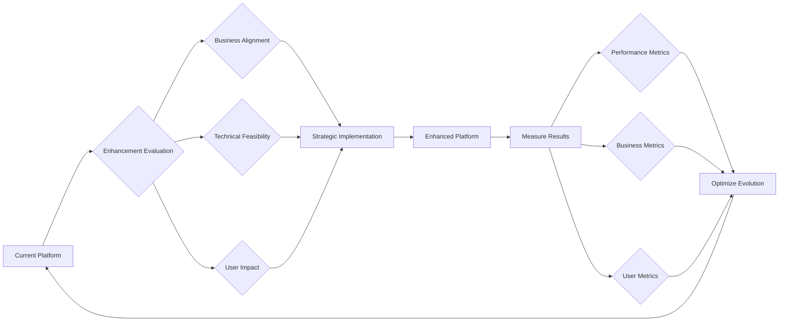

# Future Enhancements for Discussion Board Service

## Introduction

This document outlines potential future enhancements for the economic and political discussion board service. The service provides a straightforward platform for users to create articles with image and file attachments, participate in discussions, and access community content. As the platform matures and community grows, strategic enhancements could extend its capabilities while maintaining the core focus on constructive economic and political discourse. These proposals remain speculative business-oriented suggestions, designed to inform strategic planning rather than commit to specific implementations.

## Feature Roadmap

The feature roadmap presents a phased approach to platform evolution, prioritizing enhancements that support the core mission of facilitating informed economic and political discussions. Each enhancement phase builds upon existing capabilities to expand functionality without disrupting current user workflows.

### Article Enhancement Features

WHEN users create economic analysis articles, THE system SHOULD support rich text formatting capabilities to enable more comprehensive presentation of complex economic arguments.

WHEN articles include data analysis, THE system MIGHT provide basic chart insertion tools that allow users to embed visual representations of economic trends directly within article content.

WHEN users draft political policy discussions, THE system SHOULD offer draft saving with version history, enabling iterative refinement of thoughtful political analysis before publication.

### Discussion Features

WHEN political discussions grow complex, THE system MIGHT implement nested reply structures that maintain coherent conversation flow for policy debates.

WHEN users want to track specific economic topics, THE system SHOULD provide topic bookmarking capabilities that allow users to follow ongoing economic discussion threads.

WHEN controversial political topics arise, THE system SHOULD consider moderation queue prioritization to ensure timely review of sensitive content before community exposure.

### Content Discovery

WHEN users seek related economic perspectives, THE system SHOULD implement intelligent content suggestions based on political affinity or economic topic clusters.

WHEN new political events occur, THE system MIGHT enable real-time content tagging that connects published articles to current political developments.

WHEN users explore economic archives, THE system SHOULD provide chronological filtering capabilities to understand how political views have evolved over time.

### User Interface Improvements

WHEN users access the platform frequently, THE system SHOULD optimize interface load times to maintain engagement during political discussion peaks.

WHEN mobile users participate in economic discussions, THE system MIGHT introduce responsive design improvements for seamless political discourse across devices.

WHEN users engage in prolonged political analysis, THE system SHOULD provide session persistence that preserves draft content during extended writing sessions.

## Scalability Planning

Scalability considerations address the platform's growth trajectory as economic and political discussions attract broader audiences. Strategic scaling ensures sustained performance and user experience as community participation expands.

### User Growth Projections

WHEN the platform achieves 10,000 registered economic discussion participants, THE system SHOULD scale authentication infrastructure to handle concurrent political debate sessions.

WHEN daily article publications exceed 500 political analyses, THE system MIGHT implement content indexing improvements to maintain discussion discoverability.

WHEN community interaction generates 10,000 daily political comments, THE system SHOULD scale notification delivery to ensure timely discussion updates.

### Content Volume Expansion

WHEN archived economic articles exceed 100,000 documents with attached political files, THE system SHOULD implement tiered storage solutions for optimal content management.

WHEN political discussion threads reach 1,000 nested replies, THE system MIGHT introduce thread summarization algorithms to enhance reader navigation.

WHEN attached image libraries grow to 500,000 economic and political graphics, THE system SHOULD scale display optimization for improved loading performance.

### Geographic Expansion

WHEN political discussions attract international audiences, THE system SHOULD prepare multilingual infrastructure for cross-cultural economic discourse.

WHEN regional economic hubs establish localized discussion communities, THE system MIGHT implement geographic content filtering to highlight relevant political topics.

WHEN global political events drive traffic spikes, THE system SHOULD scale server capacity to maintain stable performance during major economic announcements.

## Monetization Opportunities

Strategic monetization approaches balance platform sustainability with community-focused mission, exploring revenue models that align with economic and political discussion objectives.

### Premium Membership Structures

WHEN users seek advanced economic analysis tools, THE system MIGHT offer premium subscriptions providing enhanced attachment capabilities for comprehensive political documents.

WHEN professional economic researchers join discussions, THE system SHOULD consider tiered access models that provide extended features for academic political research.

WHEN businesses integrate economic discussions, THE system MIGHT develop corporate partnership programs with dedicated political workspace features.

### Advertising Integration

WHEN economic content achieves high engagement, THE system SHOULD implement contextual advertising from financial institutions specializing in political economic analysis.

WHEN political discussions attract specialized audiences, THE system MIGHT offer sponsored content placement for political policy organizations and economic think tanks.

WHEN platform analytics demonstrate audience demographics, THE system SHOULD develop targeted advertising opportunities for political education providers.

### Revenue Diversification

WHEN community contributions create valuable economic insights, THE system MIGHT explore partnership opportunities with political data providers for premium content integration.

WHEN user interactions generate engagement data, THE system SHOULD consider syndication models where economic discussions reach external political audiences.

WHEN platform maturity supports, THE system MIGHT investigate affiliate programs connecting political discussion participants with economic resource providers.

## Technology Evolution

Technology enhancements focus on improving user experience and operational efficiency while maintaining platform reliability for economic and political discussions.

### Mobile Optimization

WHEN users shift to mobile political analysis, THE system SHOULD evolve touch interfaces for efficient economic discussion participation across mobile devices.

WHEN travel constraints affect political discourse, THE system MIGHT implement offline content caching for uninterrupted economic article reading.

WHEN mobile users contribute political content, THE system SHOULD optimize attachment uploads for responsive mobile performance.

### Data Analytics Enhancement

WHEN platform usage grows comprehensively, THE system SHOULD implement advanced analytics to track political discussion trends and economic topic popularity.

WHEN community behavior patterns emerge, THE system MIGHT introduce recommendation engines that suggest relevant economic analysis based on discussion participation.

WHEN operational metrics expand, THE system SHOULD develop dashboard capabilities for administrators to monitor political discussion health indicators.

### Integration Capabilities

WHEN economic data providers offer APIs, THE system MIGHT implement integration points for real-time market data within political discussion contexts.

WHEN social verification becomes necessary, THE system SHOULD consider integration with professional networking platforms for economic expert validation.

WHEN political event calendars exist, THE system MIGHT develop calendar integration to highlight discussion forums around major economic announcements.

## User Growth Strategies

Community expansion strategies emphasize sustainable growth that preserves the quality of economic and political discourse while attracting broader participation.

### Community Building Initiatives

WHEN political enthusiasts join discussions, THE system SHOULD implement welcome programs that guide new users through economic discussion protocols.

WHEN expert economic analysts participate, THE system MIGHT create recognition programs that highlight valuable political perspective contributions.

WHEN community diversity grows, THE system SHOULD develop moderation guidelines that maintain constructive economic debate environments.

### Educational Partnerships

WHEN academic institutions teach economic policy, THE system MIGHT establish partnerships that integrate platform discussions into political science curricula.

WHEN students engage in political research, THE system SHOULD provide student access tiers with enhanced content exploration capabilities.

WHEN professional development requires ongoing political education, THE system MIGHT create certification tracks based on economic discussion participation.

### Network Expansion Approaches

WHEN professional political organizations seek platforms, THE system SHOULD participate in industry events to showcase economic discussion capabilities.

WHEN media outlets cover political topics, THE system MIGHT develop integration points for syndicated economic content distribution.

WHEN community influencers establish presence, THE system SHOULD provide ambassador programs that encourage organic platform promotion.

## Implementation Considerations

Strategic enhancement planning requires careful consideration of community impact and technical feasibility.

### Strategic Priorities

THE system SHOULD prioritize enhancements that directly enhance the core political discussion experience rather than peripheral features.

WHEN considering new capabilities, THE system SHOULD evaluate potential disruption to existing economic content workflows.

THE platform SHOULD maintain evolution balance that preserves initial user experience simplicity while enabling growth.

### Business Impact Assessment

THE system MIGHT regularly evaluate enhancement effectiveness through user engagement and political discussion quality metrics.

WHEN innovations succeed, THE system SHOULD scale successful concepts across the economic and political discussion ecosystem.

THE platform SHOULD avoid feature complexity that detracts from the focused mission of facilitating informed political discourse.

### Risk Management

THE system SHOULD avoid overwhelming existing functionality with speculative technical capabilities that complicate political content management.

WHEN growth strategies evolve, THE system SHOULD preserve the intimate community feel that supports meaningful economic discussions.

THE platform SHOULD validate enhancement concepts through actual community usage patterns rather than theoretical projections.

## Conclusion

These enhancement considerations provide strategic guidance for the discussion board's evolution, maintaining focus on economic and political discussion facilitation while exploring growth opportunities. Success depends on balancing innovation with platform stability, ensuring enhancements serve community development rather than disrupting core mission fulfillment. Strategic evolution prioritizes user experience quality and discussion value over feature proliferation, creating sustainable growth paths for political discourse development.

## Business Validation Framework

Successful enhancements should demonstrate measurable business value through:

- Enhanced economic content contribution rates from expanded capabilities
- Improved political discussion quality through advanced interaction features
- Increased community engagement from scalable infrastructure
- Revenue growth from strategic monetization approaches
- User retention through technological experience improvements
- Community expansion through effective growth strategies

This diagram illustrates the continuous cycle of platform enhancement driven by business validation and user feedback, ensuring economic and political discussion platform evolution remains aligned with community needs and operational capabilities.