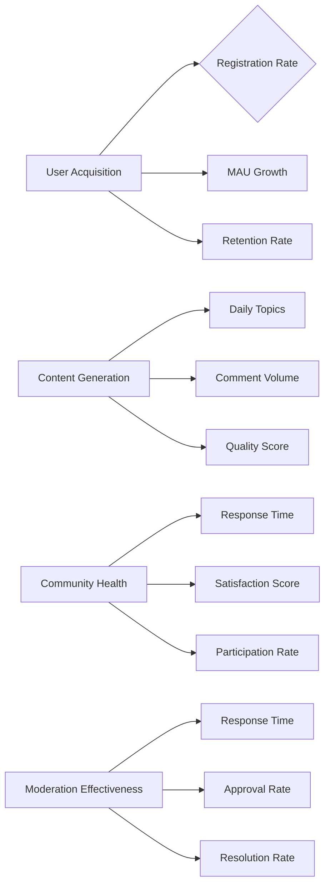
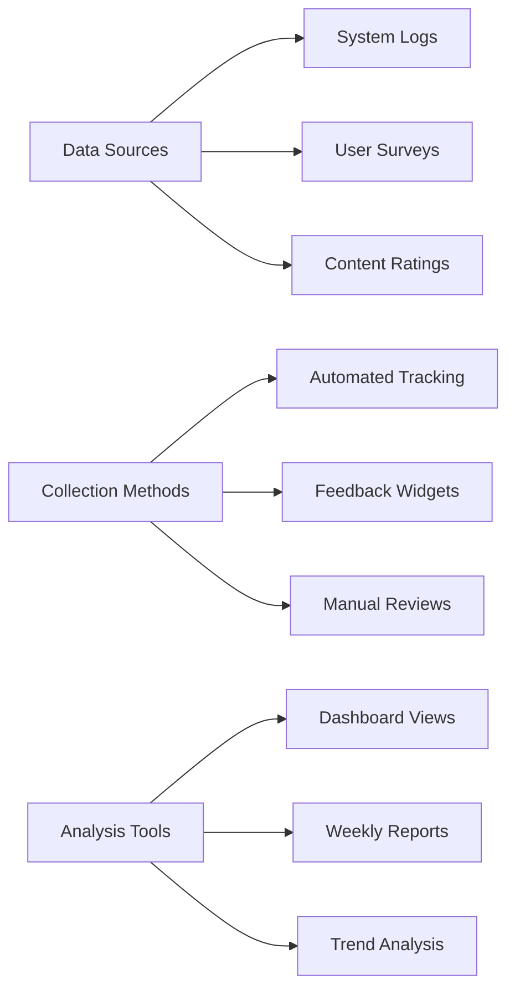
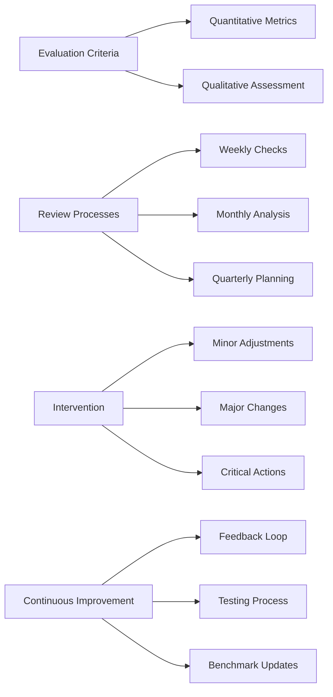

# Success Metrics for Economic/Political Discussion Board

THE discussion board platform SHALL achieve measurable success through defined business objectives and performance indicators.

## Success Objectives

### Business Growth Success
WHEN the discussion board is launched, THE platform SHALL establish a sustainable user base and content creation ecosystem within the economic and political discussion community.

### Community Engagement Success
WHEN users participate in discussions, THE platform SHALL foster meaningful conversations and knowledge sharing among economic and political enthusiasts.

### Content Quality Success
WHEN content is moderated and curated, THE platform SHALL maintain high-quality discussions that contribute to informed economic and political discourse.

### Operational Sustainability Success
WHEN the platform operates continuously, THE system SHALL demonstrate reliable performance and effective content management practices.

## Key Performance Indicators

### User Acquisition Metrics
- **Monthly Active Users (MAU)**: Track unique registered users who participate in discussions
- **User Registration Rate**: Measure daily/weekly registrations of new discussion board members
- **User Retention Rate**: Calculate percentage of users returning within 30 days
- **Growth Rate Target**: Achieve 15% monthly user growth in first year
- **Engagement Rate**: Percentage of registered users who post comments or create topics monthly

### Content Generation Metrics
- **Daily Discussion Topics**: Average number of new economic/political topics created per day
- **Comment Volume**: Total responses and replies generated weekly
- **Topic Quality Score**: Average rating of discussion topics based on community feedback
- **Content-to-Noise Ratio**: Percentage of high-quality discussions versus low-value posts

### Community Health Metrics
- **Response Time**: Average time for community members to respond to new topics
- **Topic Lifespan**: Average duration discussions remain active
- **User Satisfaction Score**: Community sentiment measured through optional feedback surveys
- **Cross-Topic Participation**: Users engaging across multiple economic/political discussion categories

### Moderation Effectiveness Metrics
- **Moderation Response Time**: Average time to review and approve/reject user-generated content
- **Content Approval Rate**: Percentage of submissions that pass moderation
- **Report Resolution Time**: Average time to address user-reported violations
- **Moderator Efficiency Score**: Topics reviewed per moderator per hour

## Measurement Methods

### Data Collection Framework
WHEN tracking performance metrics, THE system SHALL collect data through automated and manual methods that provide accurate business insights.

### Automated Metrics Tracking
- **User Activity Monitoring**: System logs track login sessions, page views, and interaction timestamps
- **Content Analytics**: Automated counting of topics, comments, and engagement patterns
- **Performance Logging**: System captures response times and error rates
- **Moderation Workflow Tracking**: Automated logging of approval/rejection actions

### User Feedback Collection
- **Regular Surveys**: Monthly surveys asking users about satisfaction and platform value
- **Feedback Widgets**: In-platform feedback buttons for immediate user input
- **Community Polls**: Discussion-based polls to gauge topic preferences
- **Exit Surveys**: Optional surveys when users deactivate accounts

### Quality Assessment Methods
- **Content Rating System**: Users can upvote/downvote discussions and comments
- **Expert Review**: Economic/political subject matter experts periodically review content
- **Moderation Reports**: Detailed reports of content violations and handling
- **Peer Review Process**: Community leaders evaluating discussion quality

### Reporting Schedule
- **Daily Reports**: Automated summaries of user activity and content creation
- **Weekly Reports**: Detailed engagement and moderation statistics
- **Monthly Reports**: Comprehensive performance reviews with trend analysis
- **Quarterly Reviews**: In-depth business impact analysis with stakeholder presentations

## Milestones

### Launch Phase Milestones (Months 1-3)
- **Week 1**: Achieve 100 registered users and 20 discussion topics
- **Month 1**: Reach 1,000 total page views and 50 active discussions
- **Month 2**: Establish 200 registered users with 80% weekly retention
- **Month 3**: Generate 500 comments across 100 unique topics

### Growth Phase Milestones (Months 4-6)
- **Month 4**: Attain 500 registered users participating regularly
- **Month 5**: Achieve 1,000 monthly active users
- **Month 6**: Establish 10 high-quality discussion categories with consistent activity

### Maturity Phase Milestones (Months 7-12)
- **Month 9**: Reach 2,500 registered users with 15% monthly growth
- **Month 12**: Maintain 5,000 monthly active users with 85% retention rate

### Ongoing Operational Milestones
- **Content Quality**: Achieve 90% approval rate for new submissions
- **Response Time**: Maintain average 2-hour response to new topics
- **Moderation Efficiency**: Resolve 95% of reported issues within 24 hours

## Evaluation Framework

### Success Assessment Criteria
WHEN evaluating platform performance, THE system SHALL use multiple evaluation methods to determine business success and identify improvement areas.

### Quantitative Evaluation
- **KPI Achievement Scoring**: Each metric receives a score based on target attainment
- **Trend Analysis**: Compare current performance against historical baselines
- **Benchmarking**: Compare against industry standards for discussion platforms
- **ROI Assessment**: Measure business value created versus platform costs

### Qualitative Evaluation
- **User Experience Reviews**: Regular assessment of user satisfaction and engagement
- **Content Quality Analysis**: Expert evaluation of discussion depth and relevance
- **Community Health Indicators**: Assessment of toxic vs. constructive interactions
- **Business Impact Studies**: Analysis of how discussions influence economic/political awareness

### Review Cadence
- **Weekly Reviews**: Quick checks of key metrics and immediate issue identification
- **Monthly Reviews**: Detailed performance analysis with stakeholder reporting
- **Quarterly Reviews**: Comprehensive business review with strategic planning
- **Annual Reviews**: Complete evaluation with goal setting for next year

### Intervention Triggers
WHEN performance falls below established thresholds, THE platform SHALL implement targeted improvements based on metric analysis.

### Escalation Protocols
- **Minor Issues**: 80-90% of targets met triggers monitoring and minor adjustments
- **Significant Issues**: 70-80% of targets met requires detailed investigation and action plans
- **Critical Issues**: Below 70% performance triggers immediate interventions and resource allocation

### Continuous Improvement Process
- **Feedback Integration**: User and stakeholder input incorporated into platform updates
- **A/B Testing**: New features tested against success metrics
- **Iterative Refinement**: Platform improvements based on actual usage patterns
- **Benchmark Updates**: Regular review of industry standards and competitor performance

