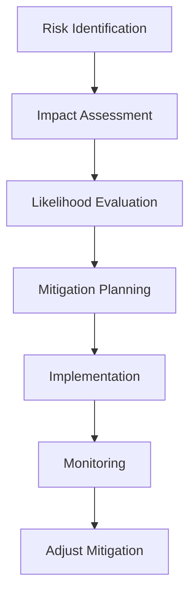

# Risk Assessment and Mitigation Strategies for Discussion Board Service

## Introduction

This comprehensive risk assessment identifies potential threats to the economic/political discussion board service that could compromise user trust, data integrity, or operational continuity. The platform supports authenticated users in creating articles with image and file attachments for substantive discussions on economic and political topics.

WHEN concerns arise about platform stability or content safety, THEN this document SHALL provide systematic risk identification and mitigation approaches to support decision-making and contingency planning.

## Technical Risks

### Content Management Infrastructure Risks

WHEN users upload high volumes of large file attachments to articles, IF storage capacity becomes insufficient, THEN THE system SHALL reject new uploads and prevent article publications until capacity is expanded.

WHEN file storage utilization exceeds 80% of allocated capacity, THEN THE business SHALL trigger automatic alerts to developers for storage scaling decisions.

WHEN storage failures occur during upload, IF articles and attachments cannot be saved atomically, THEN incomplete content SHALL not be published, preventing partial visibility that could confuse users.

### System Performance Under Load

WHEN discussion activity increases during major economic events or election periods, IF concurrent user load exceeds 1,000 simultaneous users, THEN THE system SHALL implement rate limiting on content creation to maintain response times under 3 seconds.

IF peak traffic causes 95th percentile response times to exceed 2 seconds, THEN THE system SHALL activate performance monitoring dashboards for real-time capacity adjustments.

WHEN performance degradation occurs, THE system SHALL maintain read-only access to existing content while temporarily suspending new submissions to protect content integrity.

### File Upload Processing Delays

WHEN users submit articles with multiple large attachments, IF upload times exceed 30 seconds, THEN THE system SHALL display detailed progress indicators with percentage completion and time remaining estimates.

WHEN network interruptions disrupt uploads, THE system SHALL support resume functionality to prevent users from restarting large file transfers from the beginning.

IF processing resources are insufficient during high upload periods, THEN THE system SHALL queue uploads for background processing with status notifications to users.

### Data Synchronization Issues

WHEN article content and file attachments are uploaded simultaneously, IF transaction atomicity is not guaranteed, THEN THE system SHALL save articles as draft status until all attachments are successfully processed and linked.

WHEN synchronization failures occur, THE system SHALL provide administrative tools to manually reconcile orphaned attachments with their associated articles within 24 hours.

WHEN users attempt to view articles with sync issues, THE system SHALL display appropriate error messages directing users to retry or contact support while preventing data inconsistencies.

### Authentication System Performance

WHEN authentication requests surge during peak discussion periods, IF login latency exceeds 1 second, THEN THE system SHALL implement caching strategies for recent valid sessions to reduce database load.

WHEN authentication failures occur due to system overload, THE system SHALL provide clear guidance on retry timing and alternative authentication methods if available.

WHEN authentication services become temporarily unavailable, THE system SHALL maintain guest access to public content while queuing authenticated actions for later processing.

## Business Risks

### Low User Engagement

WHEN user registration rates fall below 50 per week for the first 6 months, THEN THE business SHALL implement targeted outreach campaigns to attract economic and political enthusiasts with personalized invitations.

WHEN discussion thread participation drops below 20 comments per article on average, THEN THE business SHALL introduce expert contributor programs with highlighted "featured expert" designations to encourage quality engagement.

WHEN community growth stagnates, THE business SHALL analyze discussion topics and adjust article categorization to better reflect current economic events and political developments.

### Moderation Burden

WHEN moderators cannot review content within 4 hours of submission, IF inappropriate articles remain visible, THEN THE system SHALL automatically hide new content pending review until moderators become available.

WHEN moderation queues exceed 100 items, THEN THE system SHALL implement selective review prioritization based on content flagged by automated pattern detection for sensitive keywords.

WHEN moderators burn out from reviewing inappropriate content, THEN THE business SHALL implement rotating schedules and provide training on efficient moderation techniques.

### Revenue Sustainability

WHEN user engagement metrics indicate insufficient platform value to sustain operations, IF revenue alternatives are needed, THEN THE business SHALL explore non-disruptive monetization options such as premium expert contributor features while maintaining core free discussion functionality.

WHEN organizational funding becomes uncertain, THEN THE business SHALL develop phased business model options including community donations and sponsored content partnerships with educational institutions.

WHEN revenue strategies conflict with community expectations, THEN THE business SHALL conduct user surveys to assess tolerance for different monetization approaches before implementation.

### Content Quality Decline

WHEN prolific contributors post low-quality content that dilutes discussion value, THEN THE system SHALL implement posting limits combined with community rating systems to highlight high-quality contributions.

WHEN economic or political misinformation appears without rapid correction, THEN THE business SHALL establish expert verification protocols for articles claiming to present factual economic or political data.

WHEN quality contributors become discouraged by poor engagement, THEN THE business SHALL implement recognition systems including "expert" badges and monthly spotlight features for outstanding economic and political analysis.

## Operational Risks

### Staff Resource Constraints

WHEN administrative team size cannot keep pace with user registration volume, IF user support response times exceed 24 hours, THEN THE system SHALL implement self-service knowledge bases with guided troubleshooting for common issues.

WHEN resource constraints limit content monitoring, THEN THE system SHALL prioritize automated content filtering for egregious violations while allocating human moderators to nuanced policy interpretations.

WHEN team turnover affects platform knowledge, THEN THE business SHALL maintain comprehensive documentation and provide overlap periods during staff transitions.

### Content Backup Failures

WHEN automated backup processes fail, IF data loss occurs affecting articles with critical economic discussions, THEN THE business SHALL maintain offsite backup repositories with monthly verification procedures.

WHEN backup restoration testing reveals issues, THEN THE business SHALL allocate resources for regular disaster recovery drills to ensure data recovery capability within 4 hours.

WHEN third-party backup services experience outages, THEN THE business SHALL maintain redundant backup strategies with multiple providers to prevent single points of failure.

### User Support Overload

WHEN support ticket volume exceeds 10 per day per support team member, THEN THE system SHALL implement tiered support systems with self-service options for routine inquiries.

WHEN support requests focus on repeated issues, THEN THE business SHALL identify and prioritize platform improvements to address root causes and reduce support volume.

WHEN language barriers exist due to international users, THEN THE business SHALL explore multilingual support options or community-based assistance programs.

### Maintenance Window Disruptions

WHEN scheduled maintenance creates 30-minute outages during peak usage, THEN THE business SHALL provide advance notifications via email and platform banners with estimated completion times.

When maintenance windows miss expected completion times, THEN THE system SHALL provide real-time status updates on completion progress.

WHEN critical patches require emergency maintenance, THEN THE business SHALL document the urgency and communicate risks of postponement to stakeholders.

## Security Risks

### Unauthorized Content Modification

WHEN unauthorized users attempt to modify political discussion content, IF access controls fail, THEN THE system SHALL log all modification attempts with timestamps and IP addresses for security investigation.

WHEN content modification vulnerabilities are discovered, THEN THE system SHALL implement multi-factor authentication for administrative content management activities.

WHEN users report suspicious content changes, THEN THE business SHALL have response procedures in place for immediate investigation within 2 hours.

### Privacy Data Exposure

WHEN user profile data becomes accessible to unauthorized third parties, THEN THE business SHALL notify affected users within 72 hours and provide credit monitoring services if applicable.

WHEN privacy policies change to enhance security, THEN THE system SHALL require users to acknowledge updated policies before continued platform access.

WHEN users request data deletion, THEN THE system SHALL provide mechanisms for complete data removal while retaining minimal audit trails for legal compliance.

### File Upload Vulnerabilities

WHEN malicious files are uploaded disguised as economic documents, IF vulnerability scanning fails, THEN THE system SHALL quarantine suspicious files and prevent their rendering until manual security review.

WHEN file upload attack vectors are identified, THEN THE business SHALL implement additional security layers including content-type validation and size limits beyond standard requirements.

WHEN users inadvertently share sensitive files, THEN THE system SHALL provide tools for private file management and deletion capabilities.

### Brute Force Authentication Attacks

WHEN automated login attempts target user accounts, IF rate limiting fails to activate, THEN THE system SHALL implement progressive delay mechanisms starting with 30-second lockouts after 3 failed attempts.

WHEN account lockout procedures cause user frustration, THEN THE system SHALL provide self-service password reset with email verification and temporary access codes.

WHEN advanced attack patterns emerge, THEN THE business SHALL engage security experts for threat analysis and defensive strategy development.

## Legal Risks

### Content Liability

WHEN user-generated content contains defamatory statements about economic policies or political figures, IF liability is established, THEN THE business SHALL respond to legal notices within 30 days with content removal or cooperator defense strategies.

WHEN controversial political discussions lead to legal challenges, THEN THE system SHALL maintain detailed moderation logs showing good-faith content governance efforts.

WHEN users submit content without proper disclosures, THEN THE system SHALL implement affirmation requirements for potentially sensitive political or economic claims.

### Intellectual Property Infringement

WHEN users upload copyrighted economic charts or political documents, IF infringement notices are received, THEN THE business SHALL remove content within 24 hours and implement measures to prevent recurrence.

WHEN intellectual property disputes arise internally, THEN THE business SHALL establish dispute resolution procedures involving neutral third parties.

When open-licensed content is misinterpreted, THEN THE system SHALL provide clear licensing guidance to users before content submission.

### Data Protection Compliance

WHEN data handling practices fail to meet regulatory requirements, THEN THE business SHALL incur fines up to $10,000 per violation depending on jurisdiction and user count affected.

WHEN compliance gaps are identified, THEN THE business SHALL allocate development resources for immediate remediation and enhanced monitoring.

When user data requests are received under right-to-access laws, THEN THE system SHALL provide responses within statutory timeframes with complete data exports.

### Community Standards Enforcement

WHEN harmful content violates community standards without adequate response, THEN regulatory bodies SHALL impose penalties for failure to maintain safe platforms.

WHEN community complaints cannot be addressed promptly, THEN THE business SHALL document response time commitments and implement escalation procedures.

When platform policies conflict with legal requirements, THEN THE business SHALL prioritize legal compliance over community preferences while communicating rationale transparently.

## Mitigation Strategy Overview

## Conclusion

This risk assessment identifies critical threats to the discussion board's successful operation and provides mitigation strategies to ensure platform stability and user safety. Technical risks focus on capacity management for growing user communities and attachment-rich content. Business risks address sustained engagement and quality maintenance in sensitive economic and political discussions. Operational risks emphasize efficient resource utilization during rapid growth periods. Security and legal risks highlight the importance of robust protection measures for user data and content integrity.

WHEN implementing risk mitigation measures, THE business SHALL prioritize strategies based on likelihood and impact assessments to allocate resources effectively. Regular risk reassessment every 3 months SHALL ensure mitigation approaches evolve with platform growth and emerging threats. Comprehensive monitoring and response procedures SHALL maintain trust in the platform as a reliable space for economic and political discourse.

> **Developer Note: This document defines **business requirements only**. All technical implementations (architecture, APIs, database design, etc.) are at the discretion of the development team.*