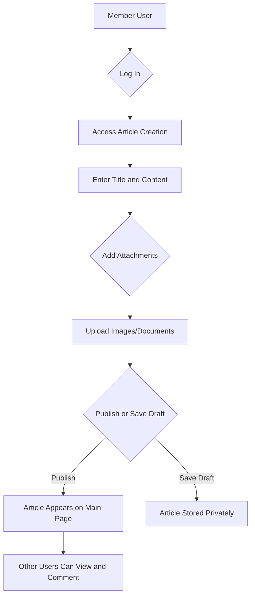
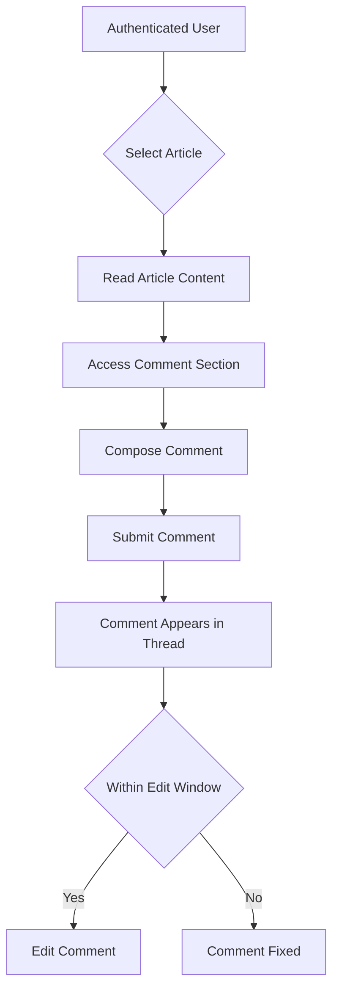
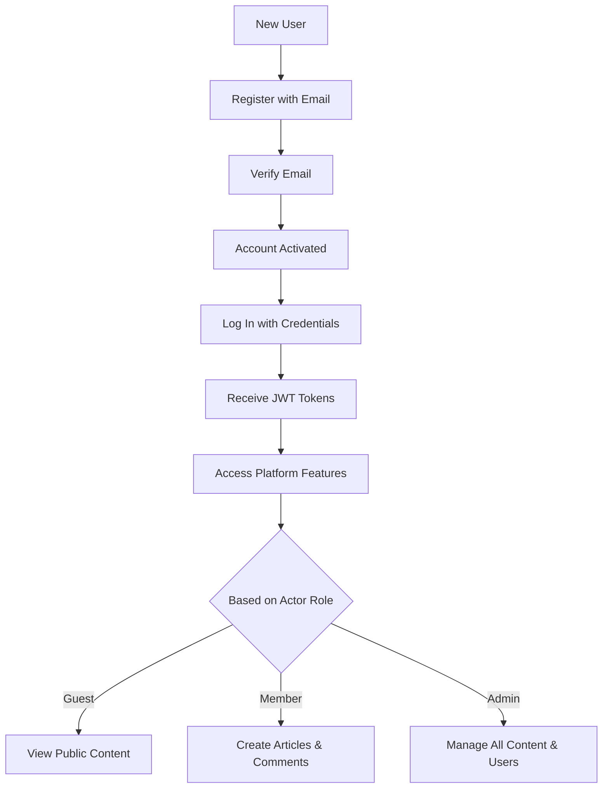

## Service Scope Document

### What's Included

WHEN a user wants to participate in economic and political discussions, THE system SHALL provide a straightforward platform for creating and discussing articles on these topics.

THE system SHALL support three distinct user actor types to ensure proper access control and community management:

- **Guest Users**: Entities who can view publicly available content but cannot contribute or modify existing material
- **Member Users**: Authenticated users who can publish articles, engage in discussions through commenting, and manage their own contributions
- **Admin Users**: Super users with elevated privileges to oversee content and user management across the platform

THE system SHALL implement comprehensive article management capabilities that support the core discussion workflow:

WHEN a member user initiates article creation, THE system SHALL provide a user-friendly interface allowing them to compose articles with required components including titles, formatted text content, and multimedia attachments (specifically optimized for images up to 5MB in standard web formats like JPEG, PNG, and GIF, or documents such as PDF and Word files up to 10MB).

THE system SHALL enable flexible publication workflows where:
- WHEN members draft articles, THE system SHALL offer options to publish immediately upon completion or save as private drafts for future editing
- WHEN draft articles exceed reasonable time limits without updates, THE system SHALL not forcibly publish or delete them, maintaining user control over publication timing

THE system SHALL facilitate meaningful discussions through a structured comment system that promotes engagement:

WHEN any authenticated user engages with published articles, THE system SHALL enable them to contribute thoughtful comments that appear chronologically under the associated article.

Member users SHALL have editorial control over their comments through:
- WHEN comment authors review their submissions within a reasonable modification window (typically 30 minutes), THE system SHALL allow text corrections without creating new comment entries
- WHEN inappropriate comments are identified, admin users SHALL be able to hide or remove them through direct administrative controls, maintaining platform integrity

THE system SHALL implement a secure authentication foundation using JWT token standards:
- WHEN users request access, THE system SHALL use 15-minute access token durations combined with 7-day refresh token validity to balance security and user experience
- WHEN new accounts are created, THE system SHALL require immediate email verification to prevent fraudulent registrations and establish account legitimacy
- WHEN users forget credentials, THE system SHALL provide password reset functionality through secure email-based workflows

THE system SHALL organize published content for easy discovery and navigation:
- Articles SHALL be displayed in reverse chronological order (newest first) on primary listing pages to surface recent discussions
- WHEN users browse individual articles, THE system SHALL provide clear navigation pathways back to category listings and allow seamless movement between related content

### What's Excluded

To maintain focus on simplicity and core value proposition, THE system SHALL deliberately exclude advanced features that could introduce unnecessary complexity:

THE system SHALL NOT implement sophisticated content moderation automation that:
- WHEN content is submitted, THE system SHALL NOT automatically scan for inappropriate material using AI pattern recognition or machine learning algorithms
- WHEN community members encounter objectionable posts, THE system SHALL NOT provide flagging mechanisms or user reporting workflows for peer-moderation
- WHEN admin users review flagged content, THE system SHALL NOT use automated scoring systems to prioritize moderation actions

THE system SHALL NOT incorporate real-time communication features that would require websocket infrastructure:
- WHEN discussions are active, THE system SHALL NOT deliver instant notifications to article authors about new comment activity
- WHEN users are online, THE system SHALL NOT support direct messaging or chat functionalities between individuals
- WHEN user activity occurs, THE system SHALL NOT update comment counts or article view metrics in real-time interfaces

THE system SHALL NOT provide advanced content organization that would complicate search and discovery:
- WHEN users search for articles, THE system SHALL NOT support filtered searches by publication dates, author names, or content keywords
- WHEN articles are categorized, THE system SHALL NOT use topic hierarchies or discussion subforums to organize content
- WHEN users browse content, THE system SHALL NOT recommend related articles based on reading history or user preferences

THE system SHALL NOT introduce business model complications through monetization features:
- WHEN users create accounts, THE system SHALL NOT offer subscription tiers or premium account classifications with enhanced features
- WHEN content is monetized, THE system SHALL NOT integrate payment processing providers for any service components
- WHEN users access content, THE system SHALL NOT display advertisement placements or sponsored content promotions

THE system SHALL NOT expand file management capabilities that would require sophisticated processing infrastructure:
- WHEN files are uploaded, THE system SHALL NOT perform format conversions (such as transforming PDFs to image formats automatically)
- WHEN documents are stored, THE system SHALL NOT implement version control systems for tracking file iterations
- WHEN users manage attachments, THE system SHALL NOT allow uploading multiple versions of the same file or document

THE system SHALL NOT enhance social interaction features beyond basic commenting:
- WHEN users participate, THE system SHALL NOT provide profile systems with customizable avatars or personal information displays
- WHEN content is engaged with, THE system SHALL NOT implement liking or following mechanisms for users or individual articles
- WHEN content is shared, THE system SHALL NOT integrate with external social media platforms for automatic posting

THE system SHALL NOT develop native mobile applications that would extend development scope:
- WHEN users access the platform, THE system SHALL NOT provide dedicated Android or iOS applications with native feature sets
- WHEN mobile users browse, THE system SHALL NOT optimize specifically for mobile responsiveness beyond basic web browser compatibility

THE system SHALL NOT incorporate analytics capabilities that would require data processing infrastructure:
- WHEN content is consumed, THE system SHALL NOT collect detailed user engagement metrics or interaction tracking data
- WHEN administrative users review performance, THE system SHALL NOT generate visual analytics dashboards for content metrics
- WHEN decision-making requires insights, THE system SHALL NOT produce automated reports on user activity or content performance trends

### Future Considerations

While maintaining the current implementation's focus on simplicity, several enhancements could be strategically considered for future iterations based on user adoption and feedback patterns:

A notification system enhancement could be valuable for community engagement:
- WHEN new comments are added to user-authored articles, THE system could send email notifications to maintain author awareness and encourage continued participation
- WHEN notifications are implemented, THE system should avoid complex real-time infrastructure while providing value through simple email delivery
- WHEN users receive notifications, content creators could respond more actively, potentially increasing overall discussion quality and platform activity

Advanced search capabilities could significantly improve content discoverability:
- WHEN users search for specific economic topics, THE system could support keyword searching within both article text and comment content
- WHEN users browse by time periods, THE system could provide filtering options by publication dates or author contributions
- WHEN implemented, search improvements could help users find relevant economic discussions more efficiently, especially for time-sensitive policy topics

Content categorization could help organize growing discussion volumes:
- WHEN articles are published, THE system could allow simple topic tagging for economic sectors (fiscal policy, international trade, monetary matters)
- WHEN users explore content, THE system could provide basic topic clouds or filtered views to organize discussions by discussion type (analysis, news, debate)
- WHEN categorization is added, it could improve user experience without significantly increasing platform complexity or content management demands

Attachment support extensions could enrich content creation:
- WHEN users create articles, THE system could support video attachments for economic presentations or charts
- WHEN users engage with data-heavy discussions, THE system could enable direct embedding of external economic data source links
- WHEN attachment capabilities expand, THE system should carefully consider bandwidth implications and storage costs for the platform's operational sustainability

User interface improvements could enhance participation without complexity:
- WHEN users read articles, THE system could provide basic formatting improvements like preview modes or syntax highlighting
- WHEN discussions grow long, THE system could implement threaded comment views for better conversation organization
- WHEN implemented, interface enhancements should prioritize usability improvements for desktop and tablet users within existing web standards

Moderation enhancements could support community growth:
- WHEN objectionable content increases, THE system could implement basic user flagging mechanisms for community reporting
- WHEN moderation queues are established, THE system could provide admin interfaces for efficient content review workflows
- WHEN advanced moderation is needed, external content moderation service integration could be considered rather than building custom detection systems

### Service Boundaries

This economic discussion board operates within clearly defined boundaries to ensure focused delivery and manageable maintenance:

User community expectations focus on quality over quantity:
- WHEN users participate, they should expect platform sizing appropriate for focused communities (ranging from dozens to several hundred active contributors)
- WHEN members join, THE system SHALL NOT optimize for high-volume social media scale but for substantive economic discussion environments
- WHEN discussions develop, participants should anticipate most users being occasional contributors rather than daily active members

Content scope maintains strict relevance boundaries:
- WHEN users submit articles, THE system SHALL maintain focus on economic and political topics while excluding unrelated subject matter
- WHEN discussions evolve, THE system SHALL expect substantive contributions rather than casual conversation or off-topic content
- WHEN content quality varies, THE system SHALL not enforce artificial length requirements but encourage informed economic discourse

Operational boundaries emphasize web-centric delivery:
- WHEN users access the platform, THE system SHALL optimize for standard web browsers on desktop and tablet devices
- WHEN external integrations occur, THE system SHALL limit them to basic email delivery systems for authentication purposes
- WHEN performance expectations are set, THE system SHALL maintain response times within web application standards (page loads under 3 seconds, API responses under 1 second)

Administrative model prioritizes direct oversight:
- WHEN content management occurs, THE system SHALL rely on hands-on admin user intervention rather than automated administrative processes
- WHEN platform growth occurs, THE system SHALL maintain human oversight for content and user management decisions
- WHEN decision-making happens, THE system SHALL not depend on complex automated systems for routine administrative tasks

These established boundaries ensure the platform remains focused on its core mission while providing a sustainable foundation for economic discussions.

### Business Workflow Diagrams

#### Article Creation and Publication Flow

#### Comment Engagement Workflow

#### Authentication and Access Control

