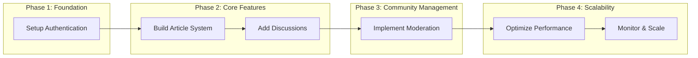
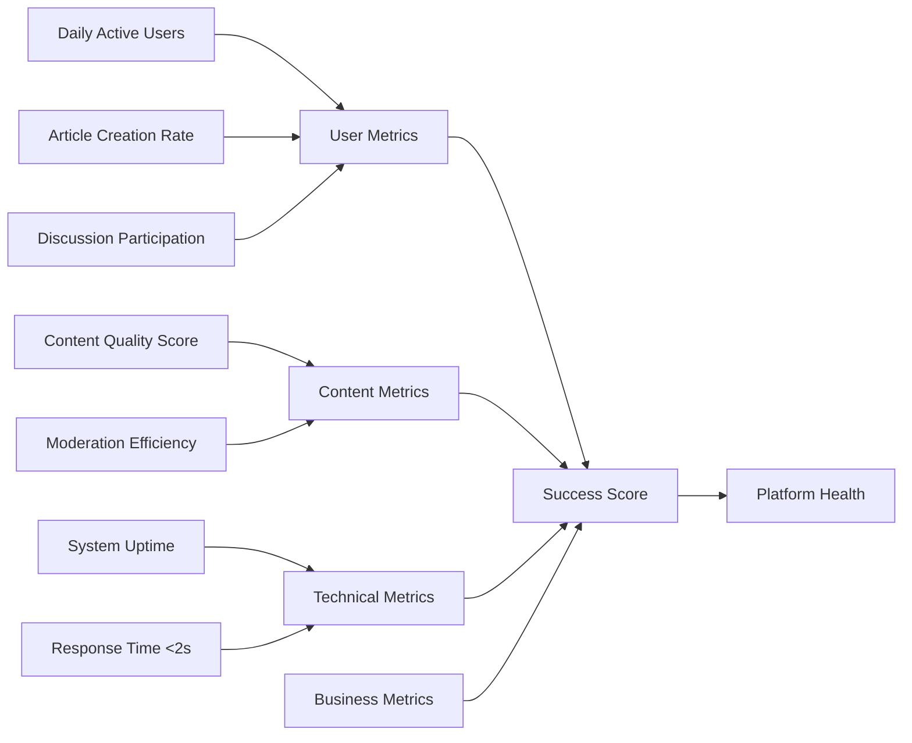

# Implementation Considerations for Discussion Board Service

## Executive Summary

The discussion board service provides a straightforward platform for economic and political discussions, enabling users to create articles with image and file attachments, participate in discussions, and access content through a simple authentication system. These implementation considerations summarize critical factors from the comprehensive requirements analysis, focusing on user engagement, content management, authentication workflows, and measurable success criteria.

The service supports three actor types - guests who can view public content, members who create articles and discussions, and administrators who moderate content. Users create articles with attachments for sharing economic views, participate in threaded discussions, and access content through secure authentication. The system emphasizes simplicity while ensuring reliable performance for 1,000+ concurrent users.

Key implementation priorities include core authentication, article creation with attachments, discussion features, content moderation, and performance optimization. Business rules govern content quality, user permissions, and data integrity. User experience centers on intuitive article creation, seamless discussions, and clear error handling. Success requires 99.5% uptime, sub-2-second response times, and positive user engagement metrics.

## Critical Success Factors

### User Adoption and Engagement

WHEN users first visit the discussion board, THE system SHALL demonstrate reliable article viewing and discussion access to encourage member registration.

WHEN members discover they can easily create articles with attached images and documents, THE system SHALL facilitate quick publication processes to promote content creation.

WHEN discussions remain active and relevant to economic topics, THE system SHALL maintain user participation through accessible threading and notification systems.

WHEN users experience consistent performance across devices, THE system SHALL support mobile article creation and discussion participation to increase usage.

WHEN platform simplicity is maintained, THE system SHALL minimize barriers to entry for political discussion participants.

WHEN members receive appropriate feedback on their contributions, THE system SHALL acknowledge article publications and discussion responses immediately.

### Content Quality and Appropriateness

WHEN articles focus on economic and political analysis, THE system SHALL ensure 90% of published content remains topic-relevant through automated and manual review processes.

WHEN file attachments support substantive discussions, THE system SHALL accept common formats while maintaining security through upload validation.

WHEN discussion quality remains constructive, THE system SHALL enable user reporting mechanisms and administrator intervention to prevent inappropriate content.

WHEN moderator approval processes are implemented, THE system SHALL ensure all flagged content receives review within 4 hours.

WHEN attachment limits prevent abuse, THE system SHALL enforce file size and type restrictions while providing clear user guidance.

WHEN content standards are consistently applied, THE system SHALL maintain 95% user satisfaction through transparent moderation practices.

### Technical Reliability

WHEN the system experiences high concurrent usage during economic news events, THE system SHALL maintain response times under 2 seconds for article loading and discussion updates.

WHEN file uploads occur simultaneously from multiple users, THE system SHALL process attachments within 10 seconds while maintaining data integrity.

WHEN authentication sessions remain secure, THE system SHALL prevent unauthorized access through JWT token validation and automatic expiration.

WHEN system availability reaches 99.5% monthly uptime, THE system SHALL minimize disruptions during peak discussion periods.

WHEN error handling responds effectively, THE system SHALL provide clear recovery messages and retry options for failed operations.

WHEN database performance supports scaling, THE system SHALL handle 10,000 article creations per day without performance degradation.

### Scalability for Growing Community

WHEN user registration increases rapidly, THE system SHALL accommodate 50,000 registered members through horizontal scaling and optimized queries.

WHEN discussion threads expand to thousands of responses, THE system SHALL maintain searchable content and fast navigation through pagination and indexing.

WHEN file storage needs grow with usage, THE system SHALL support distributed storage solutions for attachments across geographical regions.

WHEN administrative workload increases, THE system SHALL provide automated tools for content monitoring and user management.

WHEN community size reaches maturity, THE system SHALL support advanced filtering and recommendation features.

### Business Alignment

WHEN the platform serves its economic and political discussion purpose, THE system SHALL maintain 80% user retention rates through relevant content and community features.

WHEN monetization evolves from advertising, THE system SHALL support multiple revenue streams while preserving free access to core features.

WHEN integration requirements arise, THE system SHALL include API endpoints for email notifications and file storage without compromising simplicity.

WHEN business continuity is prioritized, THE system SHALL implement regular backups and disaster recovery procedures.

WHEN service level agreements are defined, THE system SHALL achieve 99.9% uptime for critical user operations.

WHEN user feedback drives improvements, THE system SHALL support survey mechanisms and feature requests from the discussion community.

## Implementation Priorities

### Priority 1: Core Authentication and User Management

WHEN users access the discussion board, THE system SHALL authenticate three actor types with distinct permission levels.

WHEN guest users browse articles, THE system SHALL provide read-only access to public content without registration barriers.

WHEN member registration occurs, THE system SHALL collect email, username, and password with automatic verification processes.

WHEN authenticated sessions manage user state, THE system SHALL implement JWT tokens with 30-day expiration and automatic refresh capabilities.

WHEN password security is enforced, THE system SHALL require 8-character minimums with complexity rules.

WHEN permission structures are hierarchical, THE system SHALL ensure members create content, guests view content, and administrators manage all aspects.

WHEN user profiles are editable, THE system SHALL allow password changes and email updates with verification requirements.

WHEN account deactivation occurs, THE system SHALL hide user content while maintaining data integrity.

WHEN brute force protection exists, THE system SHALL implement account lockouts after repeated failed login attempts.

WHEN authentication errors appear, THE system SHALL display clear messages with recovery options like password reset.

### Priority 2: Article Creation and Attachment System

WHEN members initiate article creation, THE system SHALL present a rich text editor with basic formatting tools.

WHEN article titles are entered, THE system SHALL validate uniqueness and length between 5-200 characters.

WHEN content includes rich text, THE system SHALL support 10,000 character limits with automatic saving every 30 seconds.

WHEN file attachments are uploaded, THE system SHALL accept images (JPG, PNG, GIF) up to 5MB and documents (PDF, DOC) up to 10MB.

WHEN multiple files attach, THE system SHALL limit to 5 attachments per article to prevent abuse.

WHEN upload progress displays, THE system SHALL show real-time indicators and allow cancellation supported operations.

WHEN image previews appear, THE system SHALL generate thumbnails for quick review before publication.

WHEN articles publish, THE system SHALL validate all attachments are processed and display success confirmations.

WHEN article editing occurs, THE system SHALL allow changes within 24 hours of publication with versioning.

WHEN article deletion happens, THE system SHALL permanently remove content and associated files.

### Priority 3: Discussion and Interaction Features

WHEN articles display, THE system SHALL show comment sections with chronological ordering.

WHEN members comment, THE system SHALL support 1,000 character limits with basic formatting.

WHEN threaded replies exist, THE system SHALL support nesting up to 3 levels deep.

WHEN comment editing occurs, THE system SHALL allow modifications within 5 minutes of posting.

WHEN inappropriate content appears, THE system SHALL enable user flags and admin review processes.

WHEN notification systems work, THE system SHALL alert article authors of new comments through email.

WHEN discussion searching occurs, THE system SHALL include comments in keyword matching.

WHEN user profiles display, THE system SHALL show activity history and contribution counts.

### Priority 4: Content Moderation and Management

WHEN administrators access dashboards, THE system SHALL display pending articles and flagged content queues.

WHEN content reviews happen, THE system SHALL allow approve/reject decisions with timestamps.

WHEN user suspensions occur, THE system SHALL temporarily restrict account access with appeal processes.

WHEN moderation logs maintain, THE system SHALL record all actions for transparency and audit purposes.

WHEN automated content filters work, THE system SHALL flag posts with prohibited keywords for manual review.

WHEN escalation procedures exist, THE system SHALL define thresholds for administrative intervention.

### Priority 5: Performance Optimization and Scaling

WHEN database queries execute, THE system SHALL implement indexing for fast article and comment retrieval.

WHEN caching strategies apply, THE system SHALL cache frequently accessed articles and user profiles.

WHEN CDN integration occurs, THE system SHALL serve static attachments from distributed locations.

WHEN load balancing implements, THE system SHALL distribute requests across multiple server instances.

WHEN monitoring systems run, THE system SHALL track performance metrics in real-time with alerting.

WHEN bottleneck identification happens, THE system SHALL provide dashboard analytics for optimization decisions.

## Business Rules Summary

### Content Creation Rules

WHEN members create articles, THE system SHALL require at least 100 characters of text content to prevent empty or spam submissions.

WHEN attachments are added, THE system SHALL scan files for malware and validate file types before storage.

WHEN article publishing occurs, THE system SHALL automatically categorize content based on keywords (economic, political, general).

WHEN article length limits apply, THE system SHALL enforce maximum 50,000 characters with clear warnings when approaching limits.

WHEN draft saving happens, THE system SHALL retain drafts for 30 days to allow work resumption.

WHEN duplicate content detected, THE system SHALL discourage submissions with similarity warnings.

### Authentication and Access Rules

WHEN authentication fails, THE system SHALL lock accounts after 5 attempts for 15 minutes.

WHEN session expires, THE system SHALL preserve unsaved work and prompt seamless reauthentication.

WHEN guests request premium features, THE system SHALL display clear registration prompts with benefits.

WHEN password resets occur, THE system SHALL require email verification and implement rate limiting.

WHEN multi-device usage happens, THE system SHALL support up to 3 concurrent sessions per account.

WHEN administrator access required, THE system SHALL implement two-factor authentication for sensitive operations.

### Community Standards

WHEN political bias appears, THE system SHALL allow diverse viewpoints while prohibiting hate speech.

WHEN fact-checking needed, THE system SHALL encourage community corrections through comments rather than requiring prior approval.

WHEN discussion topics drift, THE system SHALL provide topic tagging to maintain relevance.

WHEN user conduct improves, THE system SHALL recognize positive contributors through badges or leaderboards.

WHEN violation reports increase, THE system SHALL prioritize investigation based on severity levels defined by administrator policies.

### Data Integrity Rules

WHEN user data modifies, THE system SHALL maintain audit trails for all changes with timestamps and user identification.

WHEN file corruption occurs, THE system SHALL provide backup retrieval options and data recovery procedures.

WHEN export requests happen, THE system SHALL provide user data in standard formats with GDPR compliance.

WHEN data retention policies apply, THE system SHALL archive inactive user content after 2 years.

WHEN security breaches detected, THE system SHALL notify affected users within 24 hours.

### Moderation Policies

WHEN content flags reach 5 per article, THE system SHALL automatically hide content pending admin review.

WHEN user warnings accumulate, THE system SHALL escalate to account restrictions after 3 warnings.

WHEN community consensus forms, THE system SHALL consider vote-based content moderation for borderline cases.

WHEN moderator decisions appeal, THE system SHALL provide review boards composed of senior administrators.

Business Rules Priorities:
- Content quality ensures platform credibility and user trust
- Authentication rules protect user accounts and system security
- File handling rules prevent abuse and maintain performance
- Moderation rules preserve constructive discussion environments
- Data integrity rules ensure long-term system reliability

## User Experience Focus

### Intuitive Article Creation

WHEN users start writing, THE system SHALL automatically save drafts to prevent work loss.

WHEN formatting tools appear, THE system SHALL provide preview modes to ensure content appearance.

WHEN image embedding occurs, THE system SHALL allow drag-and-drop placement within article text.

WHEN attachment errors happen, THE system SHALL explain issues clearly (file too large, wrong type) with solutions.

WHEN publication options display, THE system SHALL offer preview, save draft, or publish immediately choices.

WHEN cross-device editing occurs, THE system SHALL synchronize changes seamlessly.

### Seamless Discussion Participation

WHEN comments load, THE system SHALL show nested replies with visual indentation.

WHEN new comments arrive, THE system SHALL highlight them with subtle animations.

WHEN long threads exist, THE system SHALL provide expand/collapse options for readability.

WHEN mention features exist, THE system SHALL support @username notifications in comments.

WHEN discussion history reviews, THE system SHALL maintain chronological accuracy with edit markers.

WHEN mobile users participate, THE system SHALL optimize keyboards and touch targets.

### Clear Authentication Experience

WHEN registration forms appear, THE system SHALL highlight required fields and validate input progressively.

WHEN passwords are entered, THE system SHALL provide strength indicators and policy explanations.

WHEN login attempts fail, THE system SHALL suggest specific corrections (check capitalization, try password reset).

WHEN multi-factor options exist, THE system SHALL simplify setup with clear instructions.

WHEN account recovery happens, THE system SHALL send time-limited reset links via secure channels.

WHEN session management displays, THE system SHALL show login status and logout options prominently.

### Mobile-Friendly Design

WHEN articles display on mobile, THE system SHALL optimize image sizes and text formatting automatically.

WHEN attachment uploads happen, THE system SHALL support camera integration for photo capture.

WHEN discussion threads view, THE system SHALL implement swipe gestures for navigation.

WHEN notifications appear, THE system SHALL respect mobile push permission settings.

User Experience Priorities:
- Article creation should feel effortless with comprehensive error prevention
- Discussion participation should encourage engagement through smooth interactions
- Authentication should be invisible when working and helpful when failing
- Mobile experience should match desktop quality with device-specific enhancements
- Error handling should guide users to success rather than display technical details

## Measurement Framework

### User Engagement Metrics

WHEN daily active users are tracked, THE system SHALL measure unique visitors who view or interact with content.

WHEN article creation rates monitored, THE system SHALL count new publications per day with attachment percentages.

WHEN discussion participation measured, THE system SHALL track comments, replies, and thread length averages.

WHEN time spent calculated, THE system SHALL measure average session durations and page views per visit.

WHEN retention rates calculated, THE system SHALL track users returning after 1 day, 1 week, and 1 month.

WHEN community growth quantified, THE system SHALL track registration rates and demographic distributions.

WHEN user satisfaction surveyed, THE system SHALL conduct quarterly polls with 5-point scale ratings.

### Content Quality Metrics

WHEN article quality assessed, THE system SHALL measure average word counts and attachment usage rates.

WHEN discussion depth evaluated, THE system SHALL calculate average comments per article and thread depth.

WHEN moderation effectiveness gauged, THE system SHALL track flag-to-removal ratios and response times.

WHEN content appropriateness verified, THE system SHALL monitor keyword-based filtering accuracy.

WHEN user reporting monitored, THE system SHALL count valid reports and resolution satisfaction.

### Technical Performance Metrics

WHEN response times measured, THE system SHALL track page load times for articles, searches, and uploads.

WHEN uptime calculated, THE system SHALL measure system availability excluding scheduled maintenance.

WHEN error rates tracked, THE system SHALL count failed operations and user-reported issues.

WHEN attachment processing monitored, THE system SHALL measure upload success rates and processing times.

WHEN storage utilization observed, THE system SHALL track disk space and bandwidth usage trends.

### Business Value Metrics

WHEN user acquisition costs calculated, THE system SHALL measure marketing expenses per new member.

WHEN engagement value assessed, THE system SHALL evaluate time spent versus content quality correlations.

WHEN platform scalability tested, THE system SHALL load test concurrent user capacities regularly.

WHEN API usage metrics captured, THE system SHALL monitor external service integrations.

### Operational Metrics

WHEN support requests counted, THE system SHALL track user assistance needs and resolution times.

WHEN moderation workload quantified, THE system SHALL measure administrator actions per day.

WHEN system resource monitored, THE system SHALL track CPU, memory, and database utilization.

WHEN backup success verified, THE system SHALL test restoration processes quarterly.

### Success Thresholds

THE system SHALL achieve 95% article creation success on first attempt within 3 months of launch.

THE discussion board SHALL maintain average response times under 2 seconds during peak economic news periods.

THE platform SHALL demonstrate 99.5% uptime excluding planned maintenance windows.

THE system SHALL support 1,000 concurrent active users without performance degradation.

THE discussion board SHALL receive user satisfaction ratings above 4.0 out of 5 in quarterly surveys.

THE platform SHALL maintain 80% user retention rates 30 days after initial registration.

THE system SHALL achieve upload attachment success rates above 98% for approved file types.

### Measurement Dashboard

### Success Criteria Measurement

WHEN all performance requirements achieved, THEN platform SHALL provide reliable economic and political discussions.

WHEN user engagement metrics exceed thresholds, THEN community SHALL demonstrate healthy participation levels.

WHEN content quality maintains standards, THEN trust SHALL build among political discussion participants.

WHEN technical reliability proven, THEN user confidence SHALL increase during major economic events.

WHEN business values realized, THEN platform SHALL serve its core discussion market effectively.

WHEN operational efficiency improved, THEN scaling SHALL occur smoothly with community growth.

### Regular Review Cycles

THE system SHALL monitor metrics weekly for operational health and immediate issue identification.

THE platform SHALL review engagement data monthly to track community growth trends.

THE system SHALL assess technical performance quarterly with capacity planning adjustments.

THE discussion board SHALL conduct annual comprehensive reviews of all metrics against strategic objectives.

THE platform SHALL gather user feedback quarterly through surveys and direct communication channels.

THE system SHALL adjust measurement thresholds based on industry benchmarks and platform maturity.