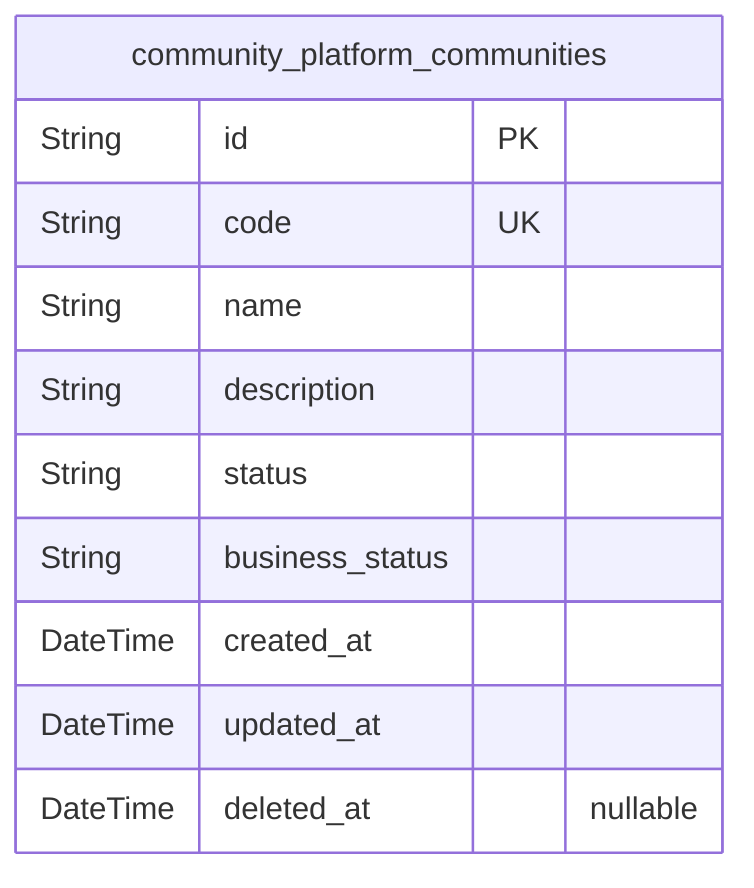
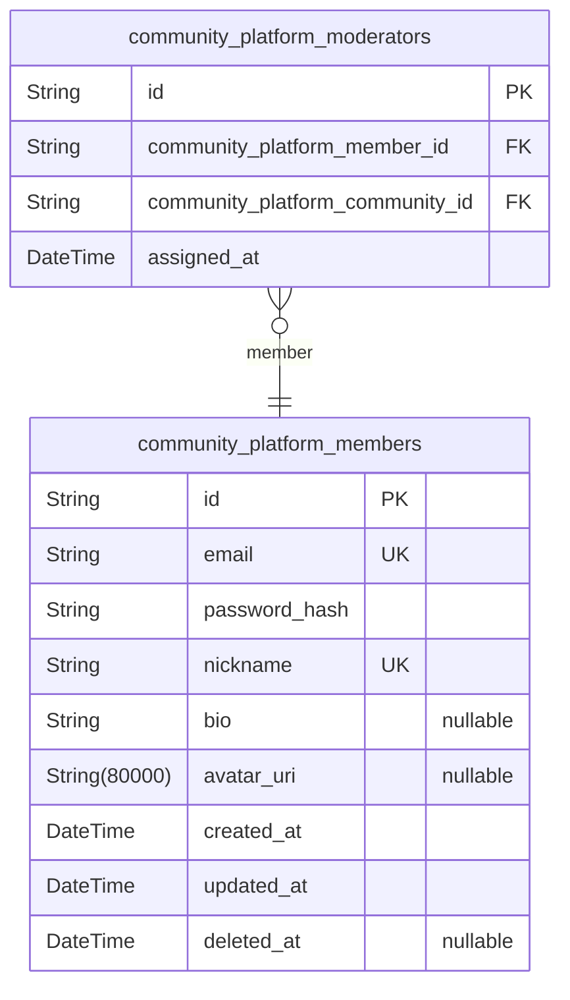
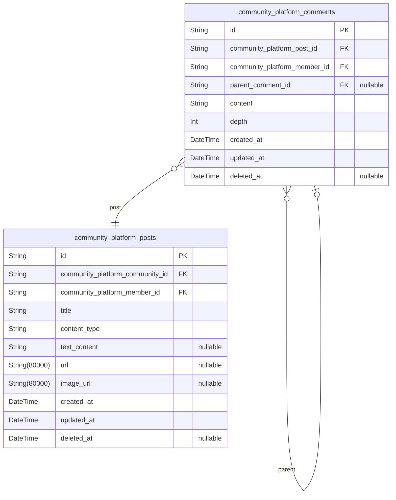
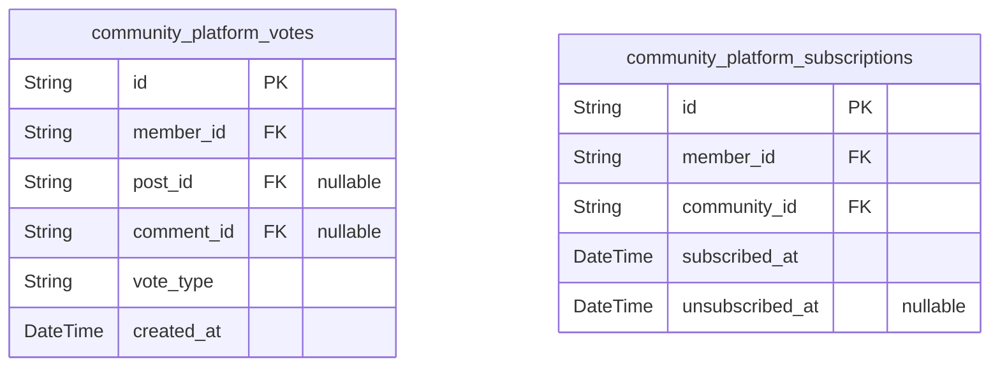
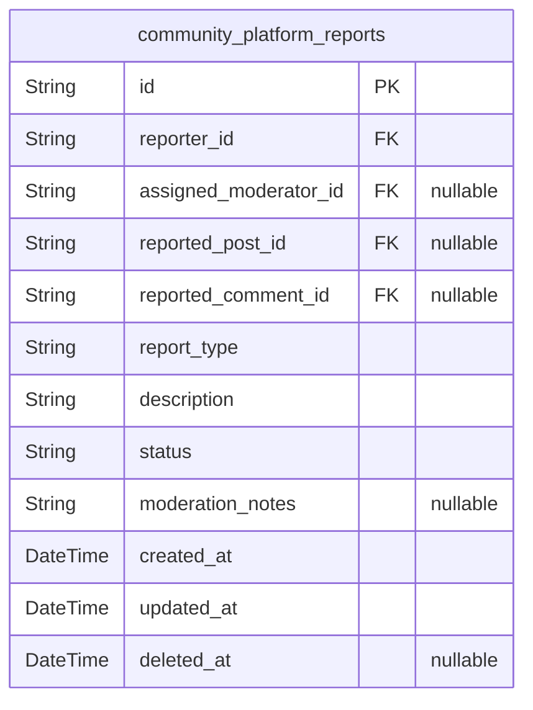

# Prisma Markdown

> Generated by [`prisma-markdown`](https://github.com/samchon/prisma-markdown)

- [Systematic](#systematic)
- [Actors](#actors)
- [Content](#content)
- [Engagement](#engagement)
- [Moderation](#moderation)

## Systematic

### `community_platform_communities`

Core community entities that organize content and user interactions
within the platform. Communities serve as containers for posts, comments,
and subscriptions, with each having unique names and requiring moderator
approval for creation.

Properties as follows:

- `id`: Primary Key.
- `code`
  > Unique community identifier consisting of alphanumeric characters and
  > underscores, maximum 21 characters.
- `name`: Display name of the community shown to users, maximum 100 characters.
- `description`
  > Detailed description of the community's purpose and rules, maximum 500
  > characters.
- `status`
  > Current status of the community (pending, active, suspended, archived).
  > Default is pending until moderator approval.
- `business_status`
  > Business workflow status for community management (e.g., pending_review,
  > approved, featured).
- `created_at`: Timestamp when the community was initially created.
- `updated_at`: Timestamp when the community was last modified.
- `deleted_at`
  > Soft delete timestamp for communities that have been removed but retained
  > for audit purposes.

## Actors

### `community_platform_members`

Registered members who participate in the community platform, posting
content, voting, and engaging with discussions. Members can customize
their profiles and subscribe to communities of interest. Each member has
a unique email and nickname for identification and communication.

Properties as follows:

- `id`: Primary Key.
- `email`: Email address for account registration and notifications.
- `password_hash`: Hashed password for secure authentication.
- `nickname`: Unique username displayed throughout the platform.
- `bio`: Optional user biography or description.
- `avatar_uri`: Optional avatar image URL for user profiles.
- `created_at`: Timestamp when the member account was created.
- `updated_at`: Timestamp of last profile modification.
- `deleted_at`: Soft delete timestamp for deactivated accounts.

### `community_platform_moderators`

Junction table linking members to communities where they serve as
moderators. Moderators can approve content, remove inappropriate posts,
manage user behavior, and enforce community rules in their assigned
communities.

Properties as follows:

- `id`: Primary Key.
- `community_platform_member_id`: Member assigned as moderator for this community.
- `community_platform_community_id`: Community this member moderates.
- `assigned_at`: Timestamp when the moderator role was assigned.

## Content

### `community_platform_posts`

Core content entities representing user-submitted posts including text
posts, link posts, and image posts. Posts can be upvoted/downvoted,
commented on, and are associated with specific communities. Posts require
independent creation, editing, and management capabilities across the
platform, supporting the primary content lifecycle.

Properties as follows:

- `id`: Primary Key.
- `community_platform_community_id`: Belonged community's {"@link community_platform_communities.id"}.
- `community_platform_member_id`: Author's {"@link community_platform_members.id"}.
- `title`: Post title visible in listings and searches.
- `content_type`: Type of post content: 'text', 'link', or 'image'.
- `text_content`: Text content for text posts.
- `url`: URL for link posts.
- `image_url`: Image URL for image posts.
- `created_at`: Post creation timestamp.
- `updated_at`: Last modification timestamp.
- `deleted_at`: Soft deletion timestamp when post is removed.

### `community_platform_comments`

Threaded comment system supporting unlimited nesting for discussions on
posts. Comments can be replied to independently, represent user
engagement, and require separate management from parent posts. Each
comment can be voted on and moderated independently, enabling cross-post
search and user activity tracking.

Properties as follows:

- `id`: Primary Key.
- `community_platform_post_id`: Referenced post's {"@link community_platform_posts.id"}.
- `community_platform_member_id`: Comment author's {"@link community_platform_members.id"}.
- `parent_comment_id`
  > Parent comment's {"@link community_platform_comments.id"} for nested
  > structure.
- `content`: Comment text content.
- `depth`: Nesting level in comment thread.
- `created_at`: Comment creation timestamp.
- `updated_at`: Last modification timestamp.
- `deleted_at`: Soft deletion timestamp when comment is removed.

## Engagement

### `community_platform_votes`

Tracks user votes on posts and comments within the engagement system.
Each vote represents member engagement with community content, affecting
karma calculations and content visibility. Relationships exist with
members (voters), posts, and comments (voted content). Votes are
immutable once cast but require efficient querying for real-time karma
updates and content sorting algorithms. Modified to include proper stance
classification and check constraint for mutual exclusivity.

Properties as follows:

- `id`: Primary Key.
- `member_id`: Voted member's [community_platform_members.id](#community_platform_members) who cast the vote.
- `post_id`
  > Related post's [community_platform_posts.id](#community_platform_posts) that received the vote
  > (if applicable).
- `comment_id`
  > Related comment's [community_platform_comments.id](#community_platform_comments) that received
  > the vote (if applicable).
- `vote_type`: Type of vote cast - 'up' for positive or 'down' for negative engagement.
- `created_at`
  > Timestamp when the vote was cast, used for audit trails and analytical
  > purposes.

### `community_platform_subscriptions`

Manages member subscriptions to communities for personalized content
delivery. Each subscription represents active interest in specific
community content, enabling personalized feeds and notification systems.
Relationships exist with members (subscribers) and communities
(subscribed content). Subscriptions can be toggled on/off with proper
timestamp tracking.

Properties as follows:

- `id`: Primary Key.
- `member_id`: Subscribing member's [community_platform_members.id](#community_platform_members).
- `community_id`: Subscribed community's [community_platform_communities.id](#community_platform_communities).
- `subscribed_at`: Timestamp when the subscription was established.
- `unsubscribed_at`: Timestamp when the subscription was terminated (null if still active).

## Moderation

### `community_platform_reports`

User-submitted reports of content violations requiring moderator
attention. Captures reporter identification, targeted content references,
violation categories, and moderation resolution workflow. Enables
platform governance through transparent reporting system that maintains
community standards.

Properties as follows:

- `id`: Primary Key.
- `reporter_id`: Reporter's [community_platform_members.id](#community_platform_members).
- `assigned_moderator_id`
  > Assigned moderator's [community_platform_moderators.id](#community_platform_moderators) for
  > handling the report.
- `reported_post_id`
  > Reported post's [community_platform_posts.id](#community_platform_posts) if report is about a
  > post.
- `reported_comment_id`
  > Reported comment's [community_platform_comments.id](#community_platform_comments) if report is
  > about a comment.
- `report_type`
  > Type of report violation (spam, harassment, hate_speech, adult_content,
  > misinformation, copyright, other).
- `description`: Additional details provided by reporter explaining the violation concern.
- `status`
  > Current processing status of the report (pending, under_review, resolved,
  > dismissed).
- `moderation_notes`: Internal notes added by moderators during review and resolution process.
- `created_at`: Timestamp when the report was first submitted for moderation review.
- `updated_at`: Timestamp of last modification to the report record.
- `deleted_at`: Soft delete timestamp for report archival without permanent removal.
