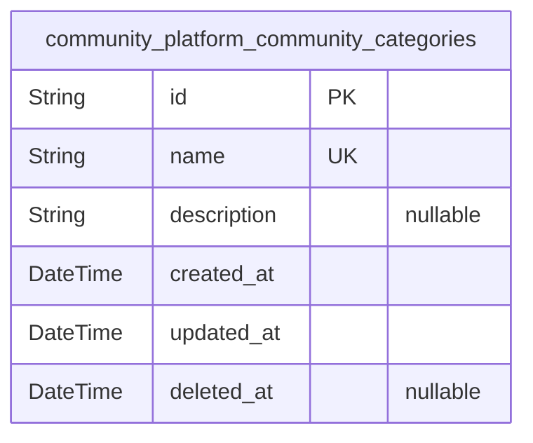
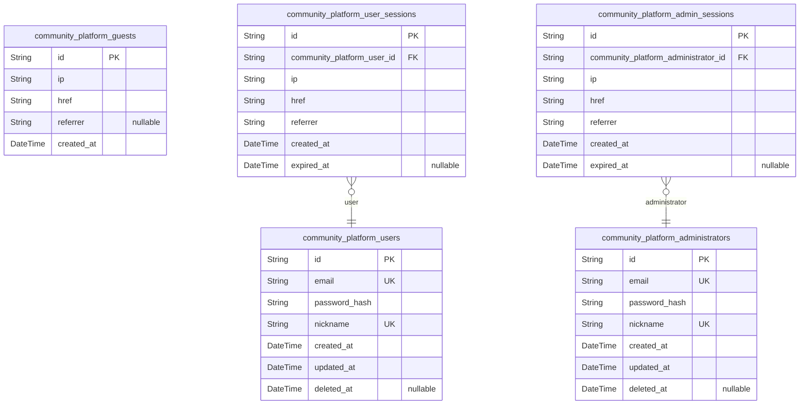
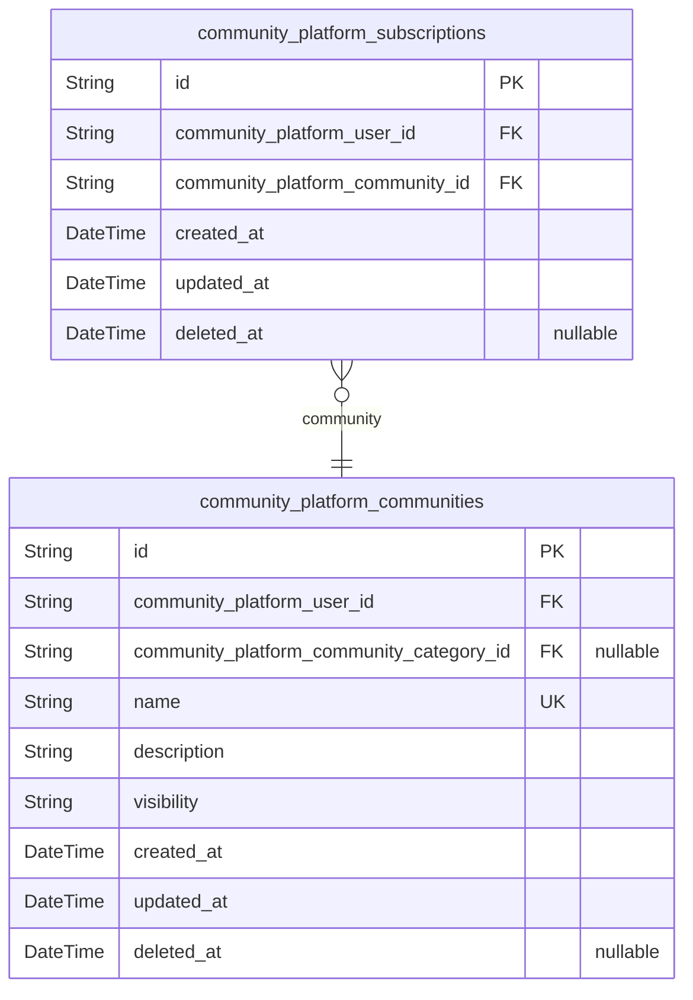
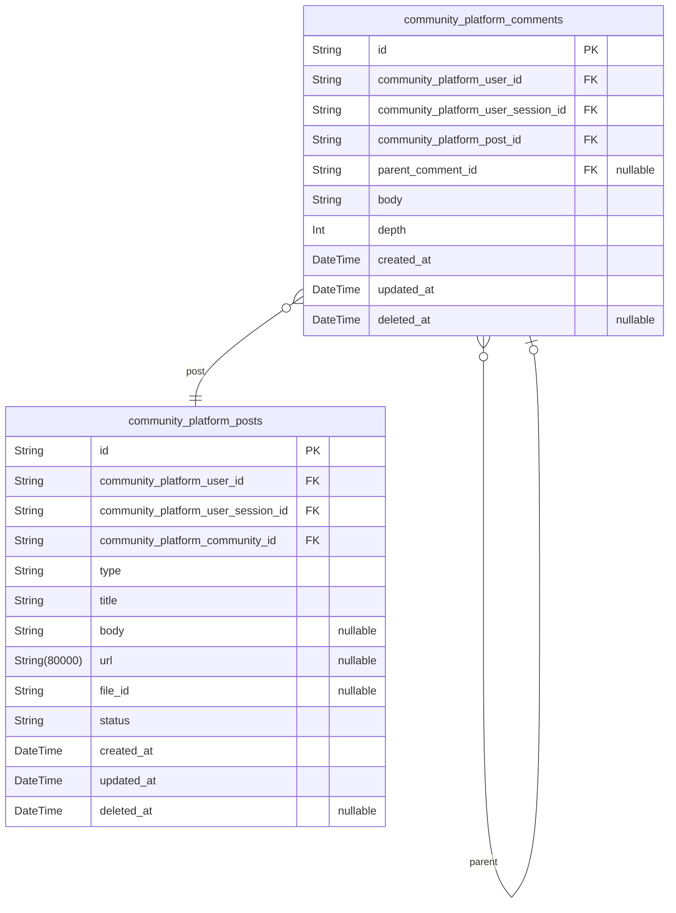
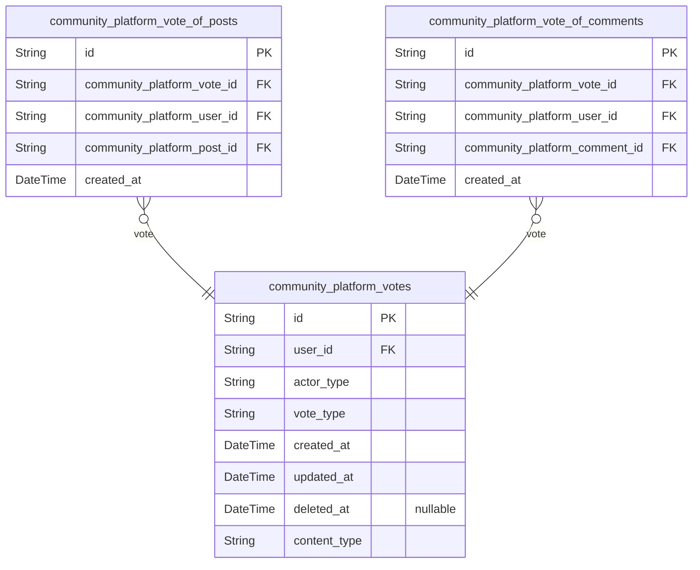
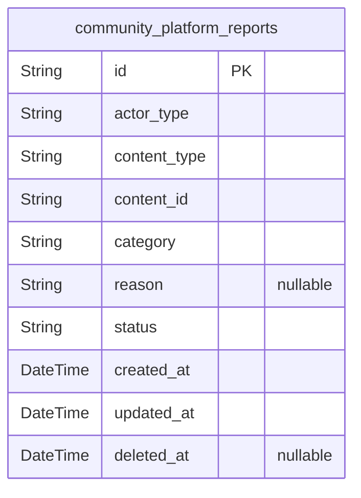

# Prisma Markdown

> Generated by [`prisma-markdown`](https://github.com/samchon/prisma-markdown)

- [Systematic](#systematic)
- [Actors](#actors)
- [Communities](#communities)
- [Posts](#posts)
- [Voting](#voting)
- [Moderation](#moderation)

## Systematic

```mermaid
erDiagram
"community_platform_community_categories" {
  String id PK
  String name UK
  String description "nullable"
  DateTime created_at
  DateTime updated_at
  DateTime deleted_at "nullable"
}
```

### `community_platform_community_categories`

Systematic categories for organizing communities by topic areas. This
foundation table provides predefined category options for users when
creating communities, ensuring consistent topic classification across the
platform. Categories include broad topic areas like technology,
entertainment, and lifestyle to help users discover relevant communities.
As a subsidiary stance, these categories exist to support primary
entities (communities) without being directly managed by users in the
same way communities themselves are managed.

Properties as follows:

- `id`: Primary Key.
- `name`
  > Category name such as 'Technology', 'Sports', or 'Entertainment'. This
  > field serves as the human-readable identifier for each category and must
  > be unique across all categories.
- `description`
  > Detailed description explaining what topics and subtopics belong under
  > this category. Helps users understand whether their community would fit
  > in this category during community creation.
- `created_at`
  > Timestamp when the category was first created in the system. Essential
  > for auditing and historical tracking of the platform's evolution.
- `updated_at`
  > Timestamp of the last modification to this category. Tracks when category
  > information was updated for maintenance purposes.
- `deleted_at`
  > Soft delete timestamp allowing categories to be marked as inactive
  > without permanently removing them. Prevents data loss and supports audit
  > trails.

## Actors

```mermaid
erDiagram
"community_platform_guests" {
  String id PK
  String ip
  String href
  String referrer "nullable"
  DateTime created_at
}
"community_platform_users" {
  String id PK
  String email UK
  String password_hash
  String nickname UK
  DateTime created_at
  DateTime updated_at
  DateTime deleted_at "nullable"
}
"community_platform_user_sessions" {
  String id PK
  String community_platform_user_id FK
  String ip
  String href
  String referrer
  DateTime created_at
  DateTime expired_at "nullable"
}
"community_platform_administrators" {
  String id PK
  String email UK
  String password_hash
  String nickname UK
  DateTime created_at
  DateTime updated_at
  DateTime deleted_at "nullable"
}
"community_platform_admin_sessions" {
  String id PK
  String community_platform_administrator_id FK
  String ip
  String href
  String referrer
  DateTime created_at
  DateTime expired_at "nullable"
}
"community_platform_user_sessions" }o--|| "community_platform_users" : user
"community_platform_admin_sessions" }o--|| "community_platform_administrators" : administrator
```

### `community_platform_guests`

Anonymous visitors browsing public content without authentication.

Tracks unauthenticated platform visitors for basic analytics and abuse
prevention. No personal identifiable information is stored to maintain
privacy standards. Guest activity is logged to support platform security
monitoring and site statistics. This table provides foundational tracking
for users before they become authenticated members.

Properties as follows:

- `id`: Primary Key.
- `ip`: Visitor IP address for basic tracking and security monitoring.
- `href`: Current page URL visited by the anonymous user.
- `referrer`: Referrer URL that directed the guest to this page.
- `created_at`: Timestamp when this guest visit began tracking.

### `community_platform_users`

Authenticated platform users who actively participate in content creation
and community engagement.

These users have verified accounts with email authentication and can
create posts, comments, vote on content, and subscribe to communities.
Users build reputation through karma scores and can be suspended for
policy violations. They form the core of the platform's interactive
community, enabling democratic content evaluation through voting
mechanisms.

Properties as follows:

- `id`: Primary Key.
- `email`
  > User email address used for login authentication and platform
  > notifications.
- `password_hash`: Bcrypt hashed password for secure user authentication.
- `nickname`: Unique display name for user identification across the platform.
- `created_at`: Timestamp when the user account was created.
- `updated_at`: Timestamp of last user account modification.
- `deleted_at`: Soft delete timestamp for suspended accounts.

### `community_platform_user_sessions`

Session records tracking authenticated user login activity and security
information.

Maintains audit trails for user access sessions including connection
details, timestamps, and device information. Sessions expire
automatically after inactivity periods and support immediate logout
functionality. Used for authentication validation, security monitoring,
and abuse detection across user accounts.

Properties as follows:

- `id`: Primary Key.
- `community_platform_user_id`: Associated user's [community_platform_users.id](#community_platform_users).
- `ip`: IP address of the user's connection for security tracking.
- `href`: URL where the user initiated their session.
- `referrer`: Referrer URL that brought the user to the login page.
- `created_at`: Timestamp when the session was created.
- `expired_at`: Timestamp when the session was terminated or expired.

### `community_platform_administrators`

System administrators with elevated permissions for platform governance
and moderation.

These privileged users oversee platform operations including user
management, content moderation, community administration, and system
configuration. Administrators have access to all platform data and can
perform sensitive operations. Account creation requires special approval
and enhanced security validation.

Properties as follows:

- `id`: Primary Key.
- `email`: Administrator email address for secure login authentication.
- `password_hash`: Bcrypt hashed password for administrator authentication.
- `nickname`: Display name for administrator identification.
- `created_at`: Timestamp when the administrator account was created.
- `updated_at`: Timestamp of last administrator account modification.
- `deleted_at`: Soft delete timestamp for deactivated administrator accounts.

### `community_platform_admin_sessions`

Session records for administrative access tracking security and audit
requirements.

Maintains comprehensive audit trails for administrator login sessions
including detailed connection information and activity timestamps.
Sessions have strict expiration policies and enhanced security monitoring
due to elevated permissions. Used for compliance tracking and breach
detection in administrative operations.

Properties as follows:

- `id`: Primary Key.
- `community_platform_administrator_id`: Associated administrator's [community_platform_administrators.id](#community_platform_administrators).
- `ip`: IP address of the administrator's connection for security auditing.
- `href`: URL where the administrator initiated their session.
- `referrer`: Referrer URL for the administrator login attempt.
- `created_at`: Timestamp when the administrator session was established.
- `expired_at`: Timestamp when the administrator session ended or expired.

## Communities

```mermaid
erDiagram
"community_platform_communities" {
  String id PK
  String community_platform_user_id FK
  String community_platform_community_category_id FK "nullable"
  String name UK
  String description
  String visibility
  DateTime created_at
  DateTime updated_at
  DateTime deleted_at "nullable"
}
"community_platform_subscriptions" {
  String id PK
  String community_platform_user_id FK
  String community_platform_community_id FK
  DateTime created_at
  DateTime updated_at
  DateTime deleted_at "nullable"
}
"community_platform_subscriptions" }o--|| "community_platform_communities" : community
```

### `community_platform_communities`

Community entities where users can post and engage with shared interests.

Represents dedicated spaces for topic-focused discussions and content
sharing, supporting user-created communities with configurable access
controls and moderation tools. Each community serves as a self-governing
space with an owner who sets rules, and members who participate through
posting, voting, and commenting. Communities range from public forums
with broad participation to private groups requiring membership approval.

Communities include categories for discovery, visibility settings to
control access, and activity tracking for engagement monitoring. The
platform supports diverse community models while maintaining
relationships to user creators, subscribers, and content categories.
Critical for building engaged user communities around shared interests
and facilitating meaningful interactions.

Properties as follows:

- `id`: Primary Key.
- `community_platform_user_id`: Owner of the community. [community_platform_users.id](#community_platform_users)
- `community_platform_community_category_id`
  > Classification category of the community. {@link
  > community_platform_community_categories.id}
- `name`: Unique identifying name for the community, used in URLs and display.
- `description`
  > Detailed description of the community's purpose, rules, and target
  > audience.
- `visibility`
  > Access control level for the community. Valid values: public (anyone can
  > view and join), private (invite-only with approval), restricted
  > (discovery enabled but membership controlled).
- `created_at`: Timestamp when the community was first created.
- `updated_at`: Timestamp of the last modification to community settings or metadata.
- `deleted_at`: Soft deletion timestamp for archived or removed communities.

### `community_platform_subscriptions`

User subscriptions linking users to communities for personalized content
delivery.

Tracks which communities each user has chosen to subscribe to, enabling
personalized feeds and notification delivery. Subscriptions can be active
or inactive based on user preference, supporting flexible discovery and
participation. Subscriptions include timestamps for analytics and
relationship maintenance.

Subscriptions form the core user-community relationships, supporting
recommendation algorithms and personalized experiences. Activity tracking
helps maintain engagement metrics while respecting user privacy and
subscription management needs. Essential for delivering relevant content
feeds and community notifications.

Properties as follows:

- `id`: Primary Key.
- `community_platform_user_id`: User who subscribed to the community. [community_platform_users.id](#community_platform_users)
- `community_platform_community_id`
  > Community that was subscribed to. {@link
  > community_platform_communities.id}
- `created_at`: Timestamp when the subscription was created.
- `updated_at`: Timestamp of the last subscription activity or status change.
- `deleted_at`: Soft deletion timestamp for terminated subscriptions.

## Posts

```mermaid
erDiagram
"community_platform_posts" {
  String id PK
  String community_platform_user_id FK
  String community_platform_user_session_id FK
  String community_platform_community_id FK
  String type
  String title
  String body "nullable"
  String(80000) url "nullable"
  String file_id "nullable"
  String status
  DateTime created_at
  DateTime updated_at
  DateTime deleted_at "nullable"
}
"community_platform_comments" {
  String id PK
  String community_platform_user_id FK
  String community_platform_user_session_id FK
  String community_platform_post_id FK
  String parent_comment_id FK "nullable"
  String body
  Int depth
  DateTime created_at
  DateTime updated_at
  DateTime deleted_at "nullable"
}
"community_platform_comments" }o--|| "community_platform_posts" : post
"community_platform_comments" }o--o| "community_platform_comments" : parent
```

### `community_platform_posts`

Core content entities representing user-generated posts within
communities. Posts are the primary content creation mechanism, supporting
multiple formats including text discussions, link shares, and image
uploads. All posts belong to specific communities and are created by
authenticated users through their active sessions. Posts drive community
engagement through karma-based scoring derived from user votes. Soft
deletion is supported to maintain discussion thread integrity while
allowing content moderation. Post editing is limited to short windows
post-publication to preserve discussion quality.','material':false,

Properties as follows:

- `id`: Primary Key.
- `community_platform_user_id`
  > Reference to the community's [community_platform_users.id](#community_platform_users) who
  > created this post.
- `community_platform_user_session_id`
  > Reference to the user's active session {@link
  > community_platform_user_sessions.id} when creating the post.
- `community_platform_community_id`
  > Reference to the target [community_platform_communities.id](#community_platform_communities) where
  > this post is published.
- `type`
  > Post content type identifier. Valid values: 'text' for text-only posts,
  > 'link' for external URL shares, 'image' for uploaded visual content.
- `title`
  > Post headline or title. Limited to 300 characters for consistent display
  > across interfaces.
- `body`
  > Main post content. Supports text for text-only posts, optional commentary
  > for link posts. Limited to 40,000 characters to maintain readability.
- `url`
  > External URL for link posts. Must be valid HTTP/HTTPS URL when type is
  > 'link'.
- `file_id`
  > Reference to uploaded file for image posts. Points to attachment file
  > when type is 'image'.
- `status`
  > Publication status of the post. Valid values: 'published' (visible to
  > community), 'draft' (author-only view), 'removed' (moderation action).
- `created_at`
  > Timestamp when the post was first created. Used for chronological sorting
  > and post aging.
- `updated_at`
  > Timestamp of last post modification. Tracks editing activity for
  > moderation purposes.
- `deleted_at`
  > Soft deletion timestamp. Set when post is removed to maintain comment
  > thread integrity while hiding from public view.

### `community_platform_comments`

User-generated comments that form threaded discussions under posts.
Comments support nested replies up to 8 levels deep, enabling structured
conversations. Each comment belongs to a specific post and is created by
authenticated users. Comments contribute to karma calculations and
support independent ranking through voting. Soft deletion supports
content moderation while preserving thread integrity. Users can edit
comments within limited time windows to ensure discussion
quality.','material':false,

Properties as follows:

- `id`: Primary Key.
- `community_platform_user_id`
  > Reference to the commenter's [community_platform_users.id](#community_platform_users) who
  > created this comment.
- `community_platform_user_session_id`
  > Reference to the user's active session {@link
  > community_platform_user_sessions.id} when commenting.
- `community_platform_post_id`
  > Reference to the parent [community_platform_posts.id](#community_platform_posts) this comment
  > belongs to.
- `parent_comment_id`
  > Reference to parent [community_platform_comments.id](#community_platform_comments) for threaded
  > replies. Null for top-level comments.
- `body`
  > Comment text content with optional markdown formatting. Limited to 2000
  > characters to maintain readability in threaded discussions.
- `depth`
  > Nesting level in comment thread. Range 0-8 where 0 is top-level comment.
  > Prevents excessive nesting that reduces discussion quality.
- `created_at`
  > Timestamp when the comment was first created. Essential for chronological
  > sorting within threads.
- `updated_at`
  > Timestamp of last comment modification. Tracks editing for moderation and
  > context preservation.
- `deleted_at`
  > Soft deletion timestamp. Maintains thread structure while hiding content
  > from public view after moderation actions.

## Voting

```mermaid
erDiagram
"community_platform_votes" {
  String id PK
  String user_id FK
  String actor_type
  String vote_type
  DateTime created_at
  DateTime updated_at
  DateTime deleted_at "nullable"
  String content_type
}
"community_platform_vote_of_posts" {
  String id PK
  String community_platform_vote_id FK
  String community_platform_user_id FK
  String community_platform_post_id FK
  DateTime created_at
}
"community_platform_vote_of_comments" {
  String id PK
  String community_platform_vote_id FK
  String community_platform_user_id FK
  String community_platform_comment_id FK
  DateTime created_at
}
"community_platform_vote_of_posts" }o--|| "community_platform_votes" : vote
"community_platform_vote_of_comments" }o--|| "community_platform_votes" : vote
```

### `community_platform_votes`

User votes on posts and comments determine content ranking through
up/down scoring and influence author karma calculations.

Votes are cast anonymously but tracked internally to support karma
calculations, content ranking algorithms, and platform moderation. Each
vote impacts the voted content's score and the author's karma reputation.
The system supports voting on posts and comments to encourage quality
contributions and community engagement.

Polymorphic ownership supports votes on different content types (posts
and comments) through subtype tables to maintain proper relationships and
avoid nullable FK anti-patters. One vote per user per content item
enforced via unique constraints.

Properties as follows:

- `id`: Primary Key.
- `user_id`: The user who cast the vote. [community_platform_users.id](#community_platform_users).
- `actor_type`
  > Type of actor who voted, always 'user' since only users can vote
  > currently.
- `vote_type`: Vote direction indicating approval (up) or disapproval (down).
- `created_at`: Timestamp when the vote was cast.
- `updated_at`: Timestamp of the last modification to the vote record.
- `deleted_at`: Soft delete timestamp for audit trails.
- `content_type`: Type of content being voted on (post or comment).

### `community_platform_vote_of_posts`

Link votes cast by users on posts to support content ranking and karma
calculations.

Each record connects a user vote to a specific post, ensuring each user
can have only one vote per post. When posts are deleted, associated votes
may be archived for karma calculation integrity.

Properties as follows:

- `id`: Primary Key.
- `community_platform_vote_id`: Reference to the vote record. [community_platform_votes.id](#community_platform_votes)
- `community_platform_user_id`
  > Reference to the user who cast the vote. {@link
  > community_platform_users.id}
- `community_platform_post_id`: Reference to the post being voted on. [community_platform_posts.id](#community_platform_posts)
- `created_at`: Timestamp when the vote-post association was created.

### `community_platform_vote_of_comments`

Link votes cast by users on comments to support content ranking and karma
calculations.

Each record connects a user vote to a specific comment, ensuring each
user can have only one vote per comment. When comments are deleted,
associated votes may be archived for karma calculation integrity.

Properties as follows:

- `id`: Primary Key.
- `community_platform_vote_id`: Reference to the vote record. [community_platform_votes.id](#community_platform_votes)
- `community_platform_user_id`
  > Reference to the user who cast the vote. {@link
  > community_platform_users.id}
- `community_platform_comment_id`
  > Reference to the comment being voted on. {@link
  > community_platform_comments.id}
- `created_at`: Timestamp when the vote-comment association was created.

## Moderation

```mermaid
erDiagram
"community_platform_reports" {
  String id PK
  String actor_type
  String content_type
  String content_id
  String category
  String reason "nullable"
  String status
  DateTime created_at
  DateTime updated_at
  DateTime deleted_at "nullable"
}
```

### `community_platform_reports`

Content moderation reports allowing users and guests to flag
inappropriate posts or comments.

This table stores all reports submitted for review by administrators,
with categorization of violation types and status tracking throughout the
moderation process. Reports can target either posts or comments, and may
be submitted by authenticated users or anonymous guests to ensure
community safety and content standards.

The system supports various report categories including spam, harassment,
hate speech, and illegal content, with status tracking from submission
through resolution.

Properties as follows:

- `id`: Primary Key.
- `actor_type`
  > Type of reporter actor: user, guest, or admin for moderator-submitted
  > reports
- `content_type`: Type of reported content: post or comment
- `content_id`: ID of the specific post or comment being reported
- `category`
  > Report violation category: spam, harassment, hate_speech,
  > illegal_content, misinformation, copyright_infringement,
  > pornographic_content, self_harm, doxxing, impersonation
- `reason`: Detailed explanation of the violation provided by the reporter
- `status`: Current status of the report: pending, reviewed, action_taken, dismissed
- `created_at`: Timestamp when the report was first submitted
- `updated_at`: Timestamp of the last modification to the report
- `deleted_at`
  > Soft deletion timestamp for reports that have been withdrawn or
  > invalidated
