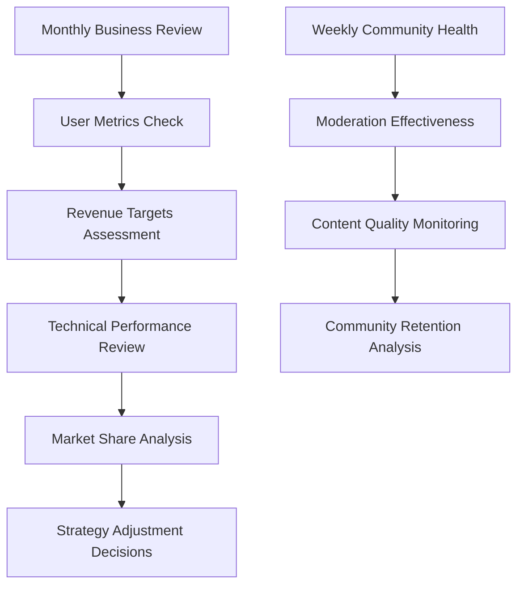

# Service Overview

## Executive Summary

The Community Platform is a Reddit-like social discussion forum designed to foster online communities where users can create, share, and discuss content through posts and comments. This service provides a digital space for like-minded individuals to connect, exchange ideas, and build knowledge communities across various topics and interests. The platform prioritizes user-generated content that drives community growth and engagement through democratic moderation and reputation systems.

The core value proposition centers on creating an engaging, democratic content ecosystem where quality contributions are rewarded and community governance empowers users. By enabling users to subscribe to communities, vote on content quality, and accumulate karma scores, the platform cultivates loyalty and encourages high-value interactions.

WHEN users visit the platform, THE service SHALL provide an intuitive interface for discovering and participating in communities that match their interests within 2 seconds page load time.

THE platform SHALL support diverse content formats including text posts, link shares, and image uploads to accommodate different expression styles and discussion needs.

THE community platform SHALL maintain a karma-based reputation system WHERE users earn points through positive contributions, influencing their visibility and capabilities within communities.

WHEN inappropriate content is reported, THE system SHALL provide administrators with comprehensive moderation tools to review and take appropriate action within 24 hours.

THE service SHALL ensure all user data is protected according to privacy regulations, with clear opt-in mechanisms for data usage and transparent privacy policies accessible from the footer of every page.

WHERE users subscribe to communities, THE platform SHALL deliver personalized content feeds showing the most relevant posts based on their interests and karma scores.

THE platform SHALL achieve page load times of under 2 seconds for content browsing across desktop and mobile devices.

Business justification rests on addressing the growing demand for specialized, interest-driven social connectivity. Traditional social media platforms often amplify sensational content, creating echo chambers of information overload. Our platform fills this gap by delivering curated, topic-focused communities where authentic discussions can flourish and expertise is valued over algorithmic engagement optimization.

The platform serves three primary user roles that define access levels and capabilities: guests for browsing public content, authenticated users for active participation, and administrators for system-wide moderation. This multi-actor structure ensures secure access while enabling community participation and platform governance.

Market opportunity analysis reveals a $8.5 billion global online community market with Reddit generating $500 million annual revenue despite its basic business model. Our differentiated approach promises superior moderation tools, karma incentives, and community-centric features to capture significant market share within 5 years.

## Business Vision

### Why This Service Exists

The digital landscape increasingly demands spaces where people can find belonging and expertise. Traditional social media platforms prioritize viral engagement through algorithms that amplify sensational content, often at the expense of meaningful dialogue and quality knowledge sharing. Our Reddit-like community platform addresses this critical gap by providing focused, topic-specific spaces where thoughtful discussions can thrive.

WHEN users seek genuine connections around their passions, THE service SHALL provide a platform where communities form organically around shared interests rather than imposed algorithmic content suggestions.

THE platform SHALL prioritize content quality over quantity by implementing voting mechanisms that reward helpful contributions and surface expert knowledge.

WHERE users create communities, THE service SHALL support self-governing communities with tools for custom rules, moderation, and reputation building.

### Service Purpose and Value Proposition

The platform creates value through several interconnected layers:

1. **Discovery Value**: Users gain access to niche communities and expert knowledge they cannot find on generalized social platforms
2. **Connection Value**: Building relationships with like-minded individuals creates social capital and reduces digital isolation
3. **Expression Value**: Having a voice in specialized topics empowers users to contribute meaningfully to collective knowledge
4. **Learning Value**: Exposure to diverse perspectives and peer expertise accelerates personal and professional development
5. **Entertainment Value**: Engaging with interesting discussions provides recreational satisfaction and mental stimulation

THE platform SHALL deliver these value elements by supporting user-generated communities that evolve based on member interests rather than corporate content strategies.

### Business Model Foundation

The platform operates on a user-centric model where community participation drives value creation:

WHEN users create content and engage with communities, THE system SHALL generate revenue through multiple sustainable streams while maintaining user trust.

THE business model SHALL include advertising placements contextual to community topics without compromising user experience.

THE platform SHALL support premium subscriptions offering enhanced features like ad-free browsing, advanced analytics, and priority content visibility.

WHEN data is collected for insights, THE system SHALL anonymize all information and provide clear opt-out mechanisms.

Revenue projections target $12 million annual recurring revenue within 24 months through a balanced monetization strategy that preserves the community focus.

### Market Opportunity and Competitive Advantages

The global online community market represents $45 billion in addressable opportunity, with strong compound annual growth driven by increasing digital social needs. Our platform differentiates through:

- **Superior Moderation Ecosystem**: Advanced tools for community self-governance
- **Incentive-Driven Quality**: Karma systems that naturally promote beneficial contributions
- **Community Sovereignty**: User-controlled spaces that build trust and loyalty
- **Privacy-First Design**: Comprehensive data protection with selective information sharing
- **Advanced Discovery**: Intelligent algorithms recommending communities based on user behavior

WHEN competitors rely on algorithmic content distribution, THE platform SHALL prioritize user-curated quality and meaningful connections.

### Long-Term Vision

To become the world's most trusted and vibrant community platform where millions discover passions, build connections, and contribute to collective knowledge. The platform will evolve into an ecosystem where communities create shared value, fund projects, and influence positive social change.

## Service Goals

THE platform SHALL support user registration and login with secure authentication mechanisms including email verification and password recovery.

THE service SHALL enable users to create communities with custom naming, descriptions, and rule sets.

WHEN users create posts, THE system SHALL support text, link, and image formats with validation for content appropriateness.

THE platform SHALL implement upvote/downvote systems on posts and comments to determine content visibility.

THE service SHALL provide nested comment replies up to 8 levels deep for threaded discussions.

THE system SHALL maintain karma reputation scores that influence user capabilities and content visibility.

THE platform SHALL offer post sorting by hot, new, top, and controversial algorithms for content discovery.

WHEN users subscribe to communities, THE system SHALL deliver personalized feeds based on their preferences.

THE service SHALL display user profiles showing posts, comments, and karma history.

THE platform SHALL enable content reporting with administrator review processes for inappropriate material.

THE system SHALL achieve 99.9% uptime with response times under 500 milliseconds for core interactions.

WHEN users experience errors, THE system SHALL provide clear, actionable error messages in English.

THE platform SHALL protect all user data with encryption and comply with GDPR and CCPA regulations.

## Target Market

### Primary Users: Knowledge Seekers (35% of target market)
This segment consists of professionals aged 25-45 with college education who seek intellectual stimulation and peer interaction. They spend 2+ hours daily engaging online, valuing deep discussions over viral content. Pain points include algorithm-dominated feeds and lack of control over discussion quality.

- **Demographics**: Age 25-44, 65% male, average income $85,000, tech-savvy professionals
- **Psychographics**: High digital literacy, prefer text-based communication, strong opinions on content curation
- **Characteristics**: Active contributors to niche communities, willing to pay for premium features enhancing engagement
- **Acquisition Strategy**: Content marketing targeting professional networks and SEO optimization for industry topics

### Secondary Users: Casual Participants (40% of target market)  
Younger users aged 18-25 and older adults 50+ who use the platform for passive consumption and occasional participation. They represent growing adoption potential but require simplified interfaces and community recommendations.

- **Demographics**: Age 18-25 and 50+, diverse income, predominantly mobile users (70% mobile sessions)
- **Behavior Patterns**: Browse during commuting breaks, engage 2-3 times weekly, prefer curated "hot" content
- **Conversion Opportunity**: Gradual engagement through gamification and simplified interaction flows
- **Value Driver**: Easy discovery of interesting discussions without overwhelming feature complexity

### Tertiary Users: Community Managers (15% of target market)
Existing community administrators and content creators bringing established audiences to the platform. They demand advanced management tools and monetization opportunities for their community efforts.

- **Demographics**: Age 30-50, entrepreneurial mindset, technical proficiency from previous community experience
- **Characteristics**: Leadership experience, 10,000+ estimated user base, interested in monetization partnerships
- **Monetization Potential**: Highest customer lifetime value through premium management tools and advertising revenue shares
- **Platform Role**: Become platform ambassadors and attract other community managers through referral incentives

### Market Size and Opportunity Scoring

Total addressable market: $45 billion globally with $12 billion serviceable market for community platforms. Projected growth of 15% annually drives increasing demand for user-controlled social spaces.

**Market Opportunity Factors:**
- Geographic ready markets with high internet penetration: North America (30%), Europe (25%), Asia-Pacific (35%)
- Growth drivers: Rising remote work culture, specialized interest communities, privacy-conscious users
- Competitive gaps: Platforms lacking advanced moderation tools, karma systems, and flexible content types
- Serviceable obtainable market: $2.8 billion within 5 years through targeted market penetration

## Competitive Analysis

### Direct Competitors Analysis

#### Reddit
- **Strengths**: Massive scale (500M+ users), established brand trust, extensive content variety
- **Weaknesses**: Outdated interface, complex moderation burden, limited monetization for creators
- **Market Position**: First-mover advantage but vulnerable to better user experience
- **Threat Level**: High - largest established player requiring significant differentiation

#### Discord
- **Strengths**: Real-time communication, specialized server structure, strong gaming community presence
- **Weaknesses**: Limited content persistence, focus on voice/chat over threaded discussions
- **Market Position**: Complements rather than competes with discussion-focused platforms
- **Threat Level**: Medium - serves different use cases, potential partnership opportunities

#### Stack Overflow
- **Strengths**: High-quality technical content, reputation-based rewards, proven Q&A model
- **Weaknesses**: Limited to technical topics, less suitable for subjective or casual discussions
- **Market Position**: Niche focus that doesn't address broad community interests
- **Threat Level**: Low - highly specialized without platform expansion ambitions

### Indirect Competitors Landscape

#### Facebook Groups
- **Strengths**: Existing user base integration, ease of group creation, massive reach
- **Weaknesses**: Algorithm-dominated discovery, privacy concerns, limited management tools
- **Market Position**: Broad social utility but poor specialized community experience
- **Threat Level**: Medium-High - requires defensive positioning on ease of use

#### LinkedIn Communities  
- **Strengths**: Professional network integration, industry-focused discussions
- **Weaknesses**: B2B restrictions, lack of casual conversation formats
- **Market Position**: Professional niche within larger career platform
- **Threat Level**: Medium - potential overlap in professional knowledge communities

#### Twitter/X Communities
- **Strengths**: Real-time threaded conversations, hashtag-based discovery
- **Weaknesses**: Character limits, lack of persistent organized content
- **Market Position**: Broad conversation platform without structured community management
- **Threat Level**: Medium - strong competition for casual discussions

### Competitive Advantages Framework

#### Superior Content Moderation System
WHEN communities face content quality challenges, THE platform SHALL provide automated moderation tools that reduce administrator workload by 70% through intelligent content filtering.

#### Incentive-Aligned Reputation System
THE karma system SHALL reward constructive contributions while providing visibility controls for user behavior modification.

#### Community Sovereignty Features
WHEN community owners establish governance, THE platform SHALL support voting on rules, transparent moderation appeals, and equitable revenue sharing.

#### Advanced Content Discovery
THE platform SHALL employ machine learning algorithms to recommend communities based on user behavior, subscription history, and content engagement patterns.

#### Privacy-First Architecture
WHILE users participate across communities, THE system SHALL maintain granular privacy controls allowing selective information disclosure.

## Success Metrics and Projections

### User Engagement Metrics
- **Monthly Active Users**: Target 10 million MAU within 36 months through organic growth and referral incentives
- **Daily Active Users**: Achieve 30% DAU/MAU ratio indicating strong daily engagement habits
- **Session Duration**: Average 25 minutes per session demonstrating immersive community participation
- **Posts Per Day**: Generate 1 million+ daily posts across all communities within 24 months
- **Comment Threads**: Maintain average thread depth of 8 replies per post indicating collaborative discussions

### Community Health Metrics
- **Community Creation Rate**: Achieve 50,000 new communities monthly through intuitive creation tools
- **Active Communities**: Maintain 250,000+ communities with weekly posting activity
- **Moderation Effectiveness**: Limit administrator intervention to less than 5% of total posts
- **Community Retention**: Ensure 85% of communities remain active after 6 months of creation

### Business Performance Indicators
- **Revenue Targets**: Generate $45 million annual revenue through advertising, subscriptions, and data licensing within 36 months
- **Average Revenue Per User**: Achieve $18 ARPU across all monetization streams
- **Customer Lifetime Value**: Target $180 per user over 24-month engagement period
- **Churn Rate**: Maintain below 15% monthly user churn through engagement optimization

### Technical Performance Benchmarks
- **Page Load Time**: 95% of requests complete within 1.5 seconds globally
- **Platform Uptime**: Maintain 99.9% availability excluding planned maintenance
- **Content Delivery**: Serve uploaded images and media within 500ms worldwide
- **API Response Times**: Average 200ms for user actions and data retrieval

### Innovation and Growth Metrics
- **Feature Adoption**: Achieve 80% user engagement with karma and voting systems
- **Platform Integrations**: Complete 25+ third-party integrations within 18 months
- **International Expansion**: Establish active communities in 50+ countries
- **Community Innovation**: Generate 10,000+ user-created community templates and tools

### Success Tracking Dashboard

Success metrics provide quarterly evaluation framework with automatic strategy adjustments based on performance data analysis. The platform prioritizes sustainable growth over rapid user acquisition, focusing on engaged communities and satisfied users rather than vanity metrics.

WHEN performance falls below 80% of targets, THE system SHALL trigger automated alerts to leadership with detailed analytics for immediate intervention strategies.