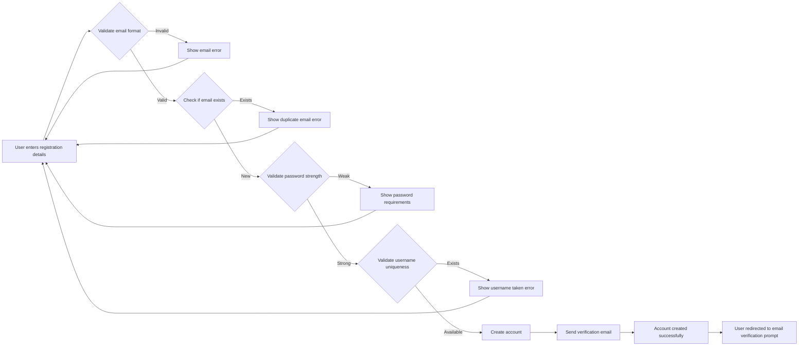
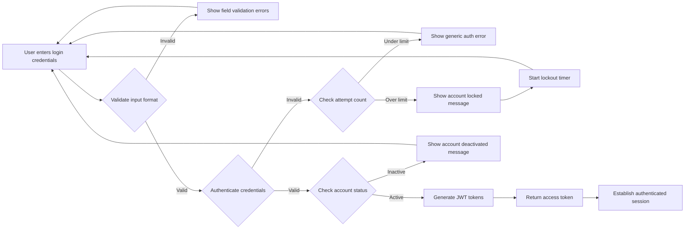
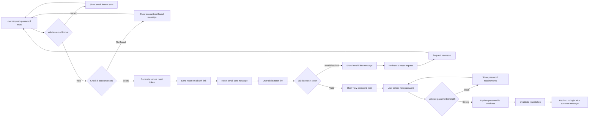

# Authentication Requirements

## Overview

This document specifies the comprehensive business requirements for the authentication system in the Reddit-like community platform. The authentication system serves as the primary gateway for user access, ensuring secure identity verification, role-based permissions, and session management across all platform features. All requirements are defined in natural language, focusing on user workflows and business outcomes rather than technical implementation details. The development team will use these specifications to design secure, efficient authentication mechanisms that support both user experience and platform integrity.

WHEN any user attempts to access protected features, THE platform SHALL verify their authenticated status and role permissions through the authentication system. THE authentication implementation SHALL balance user ease of access with comprehensive security measures to protect community trust and user privacy.

### Business Justification
The authentication system enables meaningful community participation by verifying user identities, managing access permissions, and maintaining session security. Without robust authentication, users cannot safely contribute content, vote on posts, or participate in moderated communities.

## Core Authentication Functions

### Registration Requirements
WHEN a guest user chooses to create an account, THE system SHALL require submission of an email address and password.
WHEN a guest submits registration details, THE system SHALL validate the email format and ensure it contains "@" symbol and a valid domain.
WHEN a user creates an account, THE system SHALL allow selection of a unique username with alphanumeric characters and underscores.
WHEN duplicate email address or username is detected during registration, THE system SHALL reject the registration attempt and display specific error messages.
WHEN a user creates an account, THE system SHALL enforce password complexity requirements of minimum 8 characters with mixed case and numbers.
WHEN registration form is submitted with incomplete information, THE system SHALL validate all required fields and display specific error messages for correction.
WHEN a user successfully registers, THE system SHALL send an email verification link and require confirmation before account activation.
WHEN email verification is not completed within 24 hours, THE system SHALL display a prompt to resend verification link during login attempts.

### Login Mechanisms
WHEN a member user attempts to log in, THE system SHALL accept email address and password as primary authentication method.
WHEN correct credentials are provided, THE system SHALL establish a user session within 2 seconds.
WHEN incorrect credentials are provided, THE system SHALL return appropriate error messages without revealing if email or password was wrong.
WHEN too many failed login attempts occur within 15 minutes, THE system SHALL temporarily lock the account for 30 minutes to prevent automated attacks.
WHEN a locked account attempts access, THE system SHALL display clear messaging about remaining lockout time.
WHEN account credentials are compromised, THE system SHALL allow immediate password reset without requiring current password knowledge.

### Password Management
WHEN a user requests password reset, THE system SHALL send a secure reset link to their registered email address within 5 minutes.
WHEN the reset link is accessed, THE system SHALL require the new password to meet complexity requirements.
WHEN password change is requested while logged in, THE system SHALL require verification of current password before acceptance.
WHEN password reset link expires, THE system SHALL require a new reset request and show clear expiration notice.
WHEN a user changes their password, THE system SHALL invalidate all existing login sessions for security.
WHEN password does not meet complexity requirements, THE system SHALL provide specific feedback on missing criteria (uppercase, lowercase, numbers, symbols).

### Session Handling
WHEN a member successfully logs in, THE system SHALL establish a secure session with access and refresh tokens.
WHEN an access token expires during active use, THE system SHALL automatically attempt seamless token renewal.
WHEN refresh token expires, THE system SHALL require full re-authentication for security.
WHEN user explicitly logs out, THE system SHALL immediately invalidate all active tokens and clear client-side storage.
WHEN session is inactive for 30 days, THE system SHALL automatically expire the session and require re-login.

## User Role Management

### Role Definitions
THE system SHALL support three user roles with distinct permissions and responsibilities:
- Guest users: Can browse public posts and comments without authentication
- Member users: Can create content, vote, comment, and subscribe to communities
- Moderator users: Can manage assigned communities and enforce platform rules

WHEN a user completes registration, THE system SHALL assign member role by default.
WHEN a moderator designates another user as moderator, THE system SHALL update their role permissions.
WHEN a moderator role is revoked, THE system SHALL automatically downgrade to member role.

### Role Assignment Logic
WHEN a user first completes registration verification, THE system SHALL assign member role with full content creation and interaction permissions.
WHEN community leaders elect a new moderator through community governance, THE system SHALL promote the selected user to moderator role.
WHEN moderator violations occur, THE system SHALL allow administrators to revoke moderator privileges and downgrade to member role.

### Permission Matrices

| Feature | Guest | Member | Moderator |
|---------|-------|--------|-----------|
| Browse posts | ✓ | ✓ | ✓ |
| Register account | ✓ | ✗ | ✗ |
| Create posts | ✗ | ✓ | ✓ |
| Vote on content | ✗ | ✓ | ✓ |
| Comment on posts | ✗ | ✓ | ✓ |
| Subscribe to communities | ✗ | ✓ | ✓ |
| Report inappropriate content | ✗ | ✓ | ✓ |
| Delete own content | ✗ | ✓ (within 24 hours) | ✓ |
| Create communities | ✗ | ✗ | ✓ |
| Moderate content | ✗ | ✗ | ✓ |

WHEN a user's role changes, THE system SHALL immediately update their available actions and display appropriate interface elements.
WHEN permissions are insufficient for an action, THE system SHALL show clear error messages and suggest appropriate alternatives.

## Authentication Workflows

### Registration Process Flow

WHEN a user follows the registration workflow, THE system SHALL maintain input data across validation failures to minimize user effort.
WHEN registration succeeds, THE system SHALL provide clear next steps for email verification.
WHEN verification email fails to send, THE system SHALL offer alternative verification methods.

### Login Process Flow

WHEN the login flow encounters validation errors, THE system SHALL preserve user input for correction.
WHEN authentication succeeds, THE system SHALL redirect to user's previous location or personalized feed.
WHEN account is locked, THE system SHALL clearly explain the unlock time and provide support contact options.

### Password Reset Flow

WHEN password reset is initiated successfully, THE system SHALL confirm email delivery.
WHEN reset token expires, THE system SHALL guide user back to reset request process.
WHEN new password is accepted, THE system SHALL notify user of successful password change via email.

## Security and Validation Rules

### Business Rules for Security
THE system SHALL enforce secure password requirements while balancing user convenience.
THE system SHALL implement progressive backoff periods for repeated failed login attempts.
THE system SHALL log all authentication failures for security monitoring and threat detection.
THE system SHALL require email verification to prevent spam accounts and ensure communication capabilities.
THE system SHALL prevent password reuse of recent passwords to maintain credential strength.
THE system SHALL implement session timeouts based on user activity patterns.

### Validation Requirements
WHEN processing user input during registration, THE system SHALL sanitize all input to prevent malicious data injection.
WHEN validating email addresses, THE system SHALL confirm proper domain structure without excessive validation delays.
WHEN enforcing passwords, THE system SHALL provide clear, actionable feedback on requirements without revealing exact system limits.
WHEN managing account sessions, THE system SHALL securely rotate tokens and validate expiration times.

### Error Handling and User Feedback
WHEN authentication fails due to network connectivity issues, THE system SHALL provide retry mechanisms with clear messaging.
WHEN account is temporarily locked, THE system SHALL display comprehensive information about unlock timing and appeal processes.
WHEN password reset encounters system errors, THE system SHALL offer retry options without data loss.
WHEN session renewal fails unexpectedly, THE system SHALL gracefully redirect to fresh authentication.

## User Scenarios and Workflows

### New User Onboarding Journey
WHEN a visitor decides to join the community, THE user SHALL experience a streamlined registration process:
- User identifies registration form on homepage or community page
- User enters email address and desired username
- System provides real-time validation feedback as user types
- User creates password meeting system requirements
- User receives immediate feedback on password strength
- User submits registration and receives confirmation
- User checks email for verification link
- User clicks link and completes account activation
- User is automatically logged in and directed to community discovery
- User receives welcome message with next steps for community engagement

WHEN the onboarding flow encounters issues, THE system SHALL provide contextually appropriate help and alternative completion paths.

### Daily Authentication Experience
WHEN an established member returns to the platform, THE user SHALL seamlessly resume participation:
- User arrives at platform through direct URL or bookmark
- System detects previous authenticated state (if within session)
- User is directly shown personalized community feed
- System verifies permissions for viewed content
- User can immediately participate in discussions and content creation
- System maintains login state across browser sessions
- User experiences consistent authentication across devices
- Platform remembers user preferences and community subscriptions

WHEN authentication state becomes invalid during use, THE system SHALL preserve user context and facilitate quick re-authentication.

### Moderator Authentication Requirements
WHEN a moderator accesses the platform, THE system SHALL provide enhanced authentication features:
- Additional verification steps for moderator-sensitive actions
- Separate session management for moderation activities
- Clear visual indicators of moderator status and responsibilities
- Access to moderation tools and community management features
- Separate logout required for moderator session termination

WHEN moderator authentication fails, THE system SHALL log the security event for audit purposes.

## Success Criteria and Business Outcomes

### Implementation Success Metrics
WHEN the authentication system is implemented, THE platform SHALL achieve:
- Account registration completion rate above 75%
- Failed login attempt rate below 5%
- Password reset completion rate above 85%
- User session continuity across platform navigation
- Clear security incident detection and response
- Seamless integration with all platform features

### User Experience Goals
WHEN users interact with authentication features, THE system SHALL provide:
- Intuitive registration forms with progressive disclosure
- Immediate feedback on password strength and requirements
- Clear error messages with actionable correction steps
- Fast loading times for all authentication operations
- Consistent authentication state across platform features
- Helpful guidance for password management and security

### Security Effectiveness Measures
WHEN the authentication system protects the platform, THE effectiveness SHALL be measured by:
- Prevention of unauthorized account access attempts
- Detection and blocking of suspicious authentication patterns
- Protection of user personal information across all operations
- Maintenance of platform trust through secure user experiences
- Compliance with security best practices and user expectations

> *Developer Note: This document defines **business requirements only**. All technical implementations (architecture, APIs, database design, etc.) are at the discretion of the development team and should align with modern security standards and user experience best practices.*

## Related Documents
For foundational platform objectives and user roles, refer to the [Service Vision Document](./01-service-vision.md).
For integration with content creation features, see the [Content Management Requirements](./04-content-management.md).