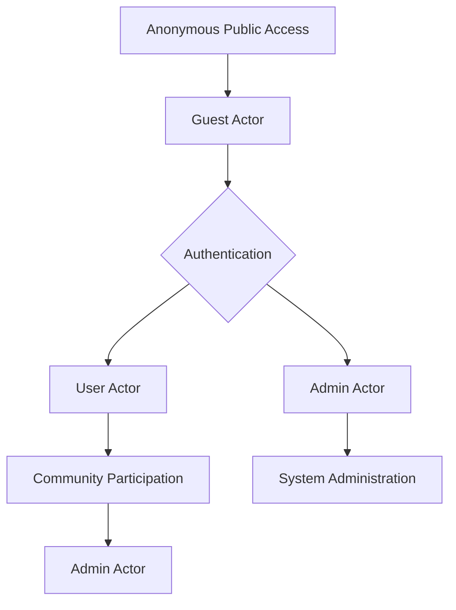

# User Actors and Authentication Requirements

## User Actor Overview

The community platform operates with three distinct user actor types that define access levels and capabilities within the system. These actors ensure secure and appropriate access to platform features based on user roles and permissions. The actors are derived from the business requirements for a Reddit-like community platform and include:

- **Guest**: Unauthenticated visitors who can browse and view content
- **User**: Authenticated members who can actively participate in content creation and interaction
- **Admin**: System administrators with elevated permissions for platform management

This actor structure supports the platform's business model of community-driven content creation while maintaining security and moderation capabilities.

## Actor Permissions and Capabilities

Each actor possesses specific permissions aligned with their role in the community platform ecosystem. These permissions are defined in business terms to guide backend implementation of authorization logic.

### Guest Actor Permissions
Guests are anonymous visitors who can consume content but cannot contribute or interact with the platform beyond browsing. This actor type supports content discovery and follows the business requirement for public visibility of communities and posts.

WHEN a guest attempts to view communities, THE system SHALL display all public communities and their posts.

WHEN a guest accesses a community page, THE system SHALL show the post listings with text, links, or images.

Guests can sort posts using the provided sorting mechanisms (hot, new, top, controversial) but cannot vote or report content.

### User Actor Permissions  
Users are authenticated members who actively participate in the community. This actor supports the core business value proposition of community creation and content contribution.

WHEN an authenticated user accesses the platform, THE system SHALL allow creation of new communities.

WHEN a user creates a post (text, link, or image), THE system SHALL publish it to the selected community.

WHEN a user views their profile, THE system SHALL display their posts, comments, and karma information.

Users can upvote or downvote posts and comments, comment with nested replies up to the third level, and subscribe/unsubscribe from communities.

### Admin Actor Permissions
Administrators manage platform-wide operations and ensure content quality and user safety. This actor enables the business requirement for effective moderation and system administration.

WHEN an admin accesses the admin panel, THE system SHALL provide tools to review all reported content.

WHEN an admin reviews a report, THE system SHALL allow actions such as content removal, user warnings, or bans.

WHEN an admin manages user accounts, THE system SHALL enable account activation, deactivation, or modification of user details.

Administrators can access all user-generated content across communities and implement platform-wide rules.

## Authentication Requirements

The platform implements secure authentication mechanisms to protect user accounts and platform integrity. All authentication shall use industry-standard practices with JWT tokens for session management.

### Registration Process
WHEN a new user registers via email and password, THE system SHALL validate the email format and ensure password complexity (minimum 8 characters, containing uppercase, lowercase, and numeric characters).

WHEN registration form is submitted, THE system SHALL check for email uniqueness across active accounts.

WHEN registration is successful, THE system SHALL send a verification email and create an unverified account.

WHEN the user clicks the verification link, THE system SHALL activate the account and allow login.

### Login Process
WHEN a user submits login credentials, THE system SHALL validate the email/password combination and check account verification status.

WHEN credentials are invalid, THE system SHALL return an appropriate error message without revealing specific failure reasons.

WHEN login is successful and account is verified, THE system SHALL generate a JWT access token with 15-minute expiration and set it in the Authorization header.

WHEN login occurs, THE system SHALL also generate a refresh token with 30-day expiration and store it securely in httpOnly cookies.

### Session Management
THE system SHALL validate JWT tokens on every protected API request.

WHEN an access token expires, THE system SHALL check the refresh token for validity.

WHEN a refresh token is valid, THE system SHALL generate new access and refresh tokens.

WHEN refresh token is invalid or expired, THE system SHALL redirect to login.

WHEN a user logs out, THE system SHALL invalidate the refresh token and end the session.

### Account Management
WHEN a user resets their password, THE system SHALL send a secure reset link via email after verification of account ownership.

WHEN the reset link is used, THE system SHALL allow password update with complexity validation.

WHEN a user changes password while logged in, THE system SHALL require current password verification.

## Permission Matrix

The following table defines the specific permissions for each actor type:

| Permission/Action | Guest | User | Admin |
|-------------------|-------|------|-------|
| View communities | ✅ | ✅ | ✅ |
| View posts and comments | ✅ | ✅ | ✅ |
| Sort posts (hot/new/top/controversial) | ✅ | ✅ | ✅ |
| Register account | ❌ | ❌ | ❌ |
| Login | ❌ | ❌ | ❌ |
| Create community | ❌ | ✅ | ✅ |
| Create posts | ❌ | ✅ | ✅ |
| Create comments and replies | ❌ | ✅ | ✅ |
| Upvote/downvote content | ❌ | ✅ | ✅ |
| Subscribe to communities | ❌ | ✅ | ✅ |
| View own profile | ❌ | ✅ | ✅ |
| View other user profiles | ✅ | ✅ | ✅ |
| Report content | ❌ | ✅ | ✅ |
| Review reports | ❌ | ❌ | ✅ |
| Remove content | ❌ | ❌ | ✅ |
| Manage user accounts | ❌ | ❌ | ✅ |
| Access admin panel | ❌ | ❌ | ✅ |
| Configure system settings | ❌ | ❌ | ✅ |
| Access all communities | ✅ | ✅ | ✅ |
| Edit own posts/comments (within 24 hours) | ❌ | ✅ | ❌ |
| Ban users | ❌ | ❌ | ✅ |

This matrix ensures clear separation of duties and prevents unauthorized access to sensitive operations.

## Actor Hierarchy

The actor hierarchy establishes a clear escalation path from public access to administrative control. Guests represent the base level with minimal privileges, users form the active participant tier, and administrators possess the highest level of system access.

Guests can upgrade their access status through registration and login. Users can become moderators of specific communities they create, but admin status requires special system access. This hierarchy prevents privilege escalation while enabling community growth and platform management.

WHEN a user creates a community, THE system SHALL grant them moderator privileges for that specific community.

WHEN an admin escalates a user to admin status, THE system SHALL verify admin authority and log the action.

## Authorization Rules

Authorization rules define specific business constraints for actor capabilities and enforce platform rules.

WHEN a user attempts an action they are not authorized for, THE system SHALL return HTTP 403 Forbidden with error code AUTH_INSUFFICIENT_PRIVILEGES.

WHEN a guest attempts to access user-specific endpoints, THE system SHALL return HTTP 401 Unauthorized with error code AUTH_REQUIRED.

WHEN a user attempts to edit another user's content, THE system SHALL deny the action and log a security event.

WHEN a user reports content, THE system SHALL validate the user's authentication status and not allow guest reports.

WHEN an admin reviews reports, THE system SHALL log all administrative actions for audit purposes.

WHEN a user's account is banned, THE system SHALL revoke all active tokens and prevent new login attempts.

WHEN content is removed by admin, THE system SHALL notify the content author via platform notification.

IF Θ content violates platform rules and IS reported, THEN THE system SHALL prioritize it for admin review.

WHERE Θ actor IS admin, THE system SHALL allow access to all platform data including private user information.

WHILE Θ user's karma IS below threshold, THE system SHALL limit their posting frequency to prevent spam.

This comprehensive actor system ensures the community platform maintains security, enables community participation, and supports effective content moderation while staying aligned with business objectives for a Reddit-like community experience.

Related documents provide additional context in the [Service Overview Document](./01-service-overview.md).