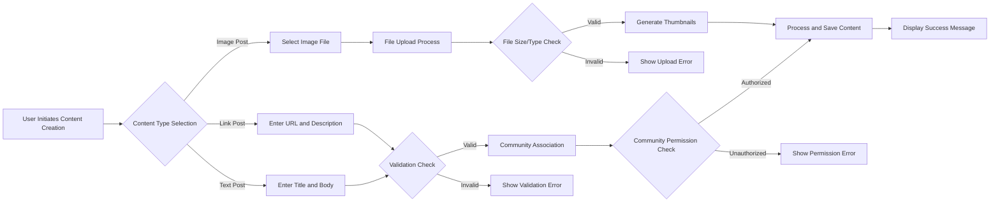
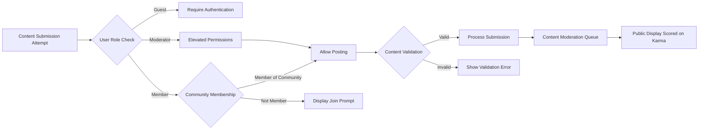
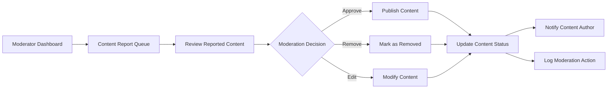

# Content Management Requirements for Community Platform

## Overview

This document specifies the comprehensive content management requirements for the Reddit-like community platform. It defines how posts (text, links, images) are created, managed, associated with communities, moderated, and modified within the platform's business logic.

WHEN users participate in the community platform, THE system SHALL support a complete content lifecycle from creation through moderation and maintenance in accordance with defined business rules.

## Business Context

Content management forms the core of the community platform, enabling members to share information and engage in discussions within specific communities. Users can create various types of content, associate it with relevant communities, and interact through voting and commenting systems. The platform includes moderation capabilities to maintain content quality and enforce community standards through role-based permissions.

THE system SHALL support multiple content types including text posts, link posts, and image posts as the primary content creation modes.

The platform's moderation system SHALL allow moderators to review and remove inappropriate content while maintaining transparency in the moderation process. User roles SHALL include guest, member, and moderator permissions to ensure appropriate access control throughout the content management lifecycle.

## Post Creation Requirements

### Text Post Creation

WHEN a member initiates post creation, THE system SHALL provide options to create text-based posts with titles and body content.

WHEN a member submits a text post, THE system SHALL validate the submission includes a non-empty title and optional body text.

IF a member attempts to submit a text post without a title, THEN THE system SHALL prevent submission and display an error message indicating "Post title is required".

### Link Post Creation

WHEN a member selects link posting, THE system SHALL allow submission of URLs with optional text descriptions.

WHEN a member submits a link post, THE system SHALL validate the provided URL format is syntactically valid.

IF a member submits an invalid URL format, THEN THE system SHALL prevent submission and display an error message indicating "Please enter a valid URL".

### Content Validation Rules

THE system SHALL limit post titles to a maximum of 300 characters and post body text to 40,000 characters.

WHILE processing post creation, THE system SHALL sanitize all user-input content to prevent malicious script execution.

THE system SHALL store post metadata including creation timestamp, author information, and initial content state.

## Media Upload Requirements

### Image Upload Process

WHEN a member selects image posting option, THE system SHALL allow upload of image files (JPEG, PNG, GIF formats).

WHILE processing image uploads, THE system SHALL enforce file size limits of maximum 10MB per image.

WHEN an image upload completes successfully, THE system SHALL generate thumbnail versions for display optimization.

### Upload Validation

IF a member attempts to upload a file exceeding size limits, THEN THE system SHALL prevent upload and display an error message indicating "Image file must be smaller than 10MB".

IF a member attempts to upload an unsupported file type, THEN THE system SHALL prevent upload and display an error message indicating "Please upload only JPEG, PNG, or GIF images".

### Processing Workflow

WHEN image upload completes, THE system SHALL process the image within 5 seconds and provide immediate feedback to the user.

THE system SHALL store original and processed versions of uploaded images for different display contexts.

## Community Association Requirements

### Community Linking

WHEN a member creates a post, THE system SHALL require association with exactly one community.

WHILE displaying post creation interface, THE system SHALL list available communities where the member can post.

THE system SHALL verify the member has permission to post in the selected community before allowing submission.

### Community Permissions

IF a member attempts to post in a community where they lack posting permissions, THEN THE system SHALL prevent submission and display an error message indicating "You do not have permission to post in this community".

### Cross-Community Display

THE system SHALL support posts being discoverable across communities through platform-wide feeds and search functions.

## Content Moderation Requirements

### Moderator Controls

WHEN a moderator reviews content, THE system SHALL provide tools to approve or remove posts from communities.

WHILE content is awaiting moderation in restricted communities, THE system SHALL hide the content from public feeds until approved.

THE system SHALL log all moderation actions including moderator identity, timestamp, and action type for audit purposes.

### Automatic Filtering

THE system SHALL implement basic content filtering for prohibited terms and spam patterns.

WHEN potentially inappropriate content is detected, THE system SHALL flag posts for moderator review.

### Escalate to Moderator

WHEN a member reports content, THE system SHALL queue the reported item for moderator attention with priority based on report frequency.

WHILE processing reports, THE system SHALL notify moderators of new reports in their platform's moderation interface.

## Delete/Edit Functions Requirements

### Post Editing

WHEN a post author requests editing their own post, THE system SHALL allow modification within a 24-hour window from creation.

WHILE editing a post, THE system SHALL preserve the original creation timestamp and append edit history metadata.

IF a post exceeds the 24-hour edit window, THEN THE system SHALL deny edit requests and display an error message indicating "Posts can only be edited within 24 hours of creation".

### Post Deletion

WHEN a post author or moderator initiates deletion, THE system SHALL mark the content as deleted rather than permanently removing it.

WHILE displaying deleted posts, THE system SHALL show placeholder text ("deleted") for regular users and full content for moderators.

THE system SHALL preserve deletion metadata including who deleted the item and when for audit purposes.

### Moderator Deletion Rights

WHILE moderators delete content, THE system SHALL not enforce time limits but SHALL log the action as a moderation event.

## User Role Permissions

### Guest Permissions

WHEN a guest user attempts to access content creation, THE system SHALL display login prompts and prevent anonymous posting.

### Member Permissions

WHEN a member creates posts, THE system SHALL allow full content creation capabilities in authorized communities.

WHILE members edit their own content, THE system SHALL enforce ownership validation to prevent unauthorized modifications.

### Moderator Permissions

WHEN moderators access content management, THE system SHALL provide elevated deletion and moderation capabilities across community content.

IF moderators attempt to delete posts older than 24 hours, THEN THE system SHALL allow the action without restrictions.

### Permission Validation Workflow

THE system SHALL validate user roles and community permissions before executing any content modification actions.

IF permission checks fail, THEN THE system SHALL return appropriate error responses without performing the requested action.

## Business Rules

### Content Uniqueness

THE system SHALL allow duplicate content across different communities but SHALL encourage unique contributions through UI design.

### Community Ownership

THE system SHALL enforce that content belongs to specific communities and MAY appear in cross-community aggregations subject to business rules.

### Spam Prevention

WHILE processing content creation, THE system SHALL implement rate limiting at 10 posts per hour per user.

IF a user exceeds posting rate limits, THEN THE system SHALL temporarily block new submissions and display an error message indicating "Posting limit exceeded. Please try again later".

### Content Age Validation

THE system SHALL validate that editing actions occur within defined time windows and enforce business rules accordingly.

## Error Handling

### Submission Errors

WHEN post submission fails due to server issues, THE system SHALL save draft content on the client and provide retry mechanisms.

WHILE displaying error conditions, THE system SHALL show clear, actionable error messages to guide user recovery.

### Media Processing Errors

IF image processing fails, THEN THE system SHALL notify the user with specific error details and allow alternative text-based submission.

WHEN network connectivity issues occur during upload, THE system SHALL provide resumable upload capabilities where technically feasible.

### Validation Error Recovery

THE system SHALL support user correction of validation failures through form preservation and clear error indication.

## Performance Requirements

THE system SHALL process and display post creation results within 3 seconds of submission.

WHILE users browse content, THE system SHALL load post lists within 2 seconds for typical community feeds.

WHEN image thumbnails are requested, THE system SHALL serve cached versions immediately or within 1 second.

THE system SHALL handle simultaneous content creation from multiple users without degradation in response times.

## Business Process Flows

*Developer Note: This document defines **business requirements only**. All technical implementations (architecture, APIs, database design, etc.) are at the discretion of the development team.*