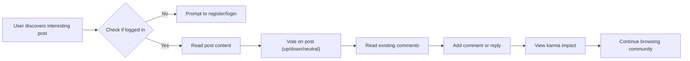
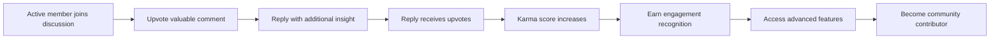
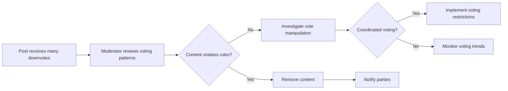

# Requirements Analysis Report: Voting and Comments System

## Executive Summary

This requirements analysis document outlines the business and functional requirements for implementing a comprehensive voting and commenting system in the Reddit-like community platform. The system is designed to facilitate user engagement, content quality control, and community interaction through voting mechanics, nested commenting, and karma-based reputation tracking.

All requirements are specified in business terms, focusing on what the system should accomplish rather than how to implement it technically. This document serves as the foundation for backend development, ensuring developers understand the complete business context and user expectations.

## Business Context and Objectives

### Business Model Alignment
The voting and comments system directly supports the platform's business model by:
- Creating viral content discovery through community-driven ranking algorithms
- Building user retention through meaningful interactions and reputation-building
- Generating engagement metrics for monetization strategies (advertising, premium features)
- Establishing community trust through transparent moderation and voting transparency

### Platform Objectives Supported
1. Foster active community participation through easy-to-use interaction tools
2. Ensure content quality through democratic voting mechanisms  
3. Provide engaging discussion threads that encourage return visits
4. Build user loyalty through karma rewards and reputation systems
5. Maintain platform integrity through comment moderation and reporting integration

## User Roles and Permissions Matrix

### Guest Users
- CAN view public comments and vote counts on posts
- CANNOT vote on posts or comments
- CANNOT submit comments or replies

### Member Users  
- CAN upvote or downvote posts and comments
- CAN submit comments on posts
- CAN reply to existing comments (creating nested threads)
- CAN view their own voting history in profiles
- CAN track their karma score and changes

### Moderator Users
- HAVE all member permissions
- CAN moderate comments within their managed communities
- CAN hide or remove inappropriate comments
- CAN view detailed voting analytics for moderation purposes

## Functional Requirements: Voting System

### Core Voting Mechanics

WHEN a member user encounters a post or comment, THE system SHALL present clear upvote and downvote buttons.

WHEN a user clicks the upvote button on a post, THE system SHALL increment the post's upvote count by 1.

WHEN a user clicks the downvote button on a post, THE system SHALL increment the post's downvote count by 1.

WHEN a user changes their vote from upvote to downvote (or vice versa), THE system SHALL adjust both upvote and downvote counts accordingly.

WHEN a user clicks the vote button again on the same item they previously voted on, THE system SHALL remove their vote and decrement the appropriate count.

### Vote Display and Transparency

THE system SHALL display the net vote score (upvotes minus downvotes) prominently on each post and comment.

THE system SHALL show the vote counts separately (upvotes and downvotes) in detailed views.

IF a user has already voted on an item, THE system SHALL highlight which button they selected.

THE system SHALL update vote counts in real-time for all users viewing the content.

### Vote Business Rules

WHEN a user attempts to vote on their own content, THE system SHALL prevent the vote and display an appropriate message.

WHEN a guest user attempts to vote, THE system SHALL prompt them to register or log in.

WHILE a user account is suspended, THE system SHALL disable their voting capabilities and display suspension status.

### Vote History Tracking

THE system SHALL maintain a record of all user votes for their personal history.

WHERE user privacy settings allow, THE system SHALL display vote history on user profiles.

WHEN users request to see their voting activity, THE system SHALL present it chronologically with content context.

## Functional Requirements: Comment System

### Comment Creation and Submission

WHEN a member user clicks to comment on a post, THE system SHALL present a comment composition interface.

WHEN a user submits a comment, THE system SHALL validate the content length (minimum 1 character, maximum 10,000 characters).

WHEN comment validation passes, THE system SHALL save the comment and display it immediately in the comment thread.

WHEN comment validation fails, THE system SHALL display specific error messages and allow the user to correct and resubmit.

### Nested Reply Structure

THE system SHALL support unlimited nesting levels for comment replies.

WHEN a user replies to a comment, THE system SHALL create a nested relationship where the reply appears indented under the parent comment.

THE system SHALL display comment threads with visual indentation to show hierarchy levels.

WHEN displaying nested comments, THE system SHALL limit initial display depth but provide "load more replies" functionality.

### Comment Display and Navigation

THE system SHALL sort comments by chronological order with newest replies appearing at the bottom of each thread.

THE system SHALL show the total number of replies for each comment thread.

WHEN a comment thread becomes very deep, THE system SHALL provide "collapse thread" functionality to improve readability.

WHEN users navigate deep comment threads, THE system SHALL maintain context and provide navigation aids.

## Functional Requirements: Karma System

### Karma Calculation Logic

WHEN a post receives an upvote, THE system SHALL add 1 point to the post author's karma score.

WHEN a post receives a downvote, THE system SHALL subtract 1 point from the post author's karma score.

WHEN a comment receives an upvote, THE system SHALL add 0.5 points to the comment author's karma score.

WHEN a comment receives a downvote, THE system SHALL subtract 0.5 points from the comment author's karma score.

WHEN a user's karma reaches new milestone thresholds (100, 500, 1000, etc.), THE system SHALL award special badges or recognition.

### Karma Display and History

THE system SHALL display each user's current karma score prominently on their profile.

THE system SHALL show karma breakdown (post karma vs comment karma) in detailed profile views.

WHEN users view their karma over time, THE system SHALL provide graphical representation of karma growth.

THE system SHALL send notifications when users reach karma milestones.

### Karma-Based Features

IF a user's karma score exceeds 100 points, THE system SHALL grant access to advanced formatting options in posts and comments.

IF a user's karma score exceeds 500 points, THE system SHALL enable community creation capabilities.

WHERE karma requirements are met, THE system SHALL unlock special user titles or profile customizations.

## Engagement Metrics and Analytics

### Post Engagement Tracking

THE system SHALL calculate engagement rate as (upvotes + comments) / total views for each post.

THE system SHALL track comment-to-view ratios to measure discussion quality.

THE system SHALL identify trending posts based on vote velocity over time periods.

### User Engagement Analysis

THE system SHALL track each user's daily/weekly/monthly voting and commenting activity.

THE system SHALL calculate user engagement scores based on interaction frequency and quality.

WHEN moderators review community health, THE system SHALL provide engagement dashboards showing participation trends.

### Community-Level Metrics

THE system SHALL aggregate karma and engagement data by community for community leaders.

THE system SHALL compare engagement across different communities for platform analytics.

WHEN analyzing content performance, THE system SHALL correlate votes with content types and posting times.

## Business Rules and Validation

### Content Quality Controls

WHEN comments contain excessive profanity, THE system SHALL automatically flag them for moderator review.

IF a post receives multiple downvotes within a short time period, THE system SHALL highlight it for community attention.

WHEN users accumulate multiple downvoted comments, THE system SHALL implement temporary commenting restrictions.

### Community Standards Enforcement

WHILE comments violate community rules, THE system SHALL allow moderators to hide or remove them.

WHEN inappropriate content receives votes, THE system SHALL provide voting analytics to support moderation decisions.

IF voting patterns indicate coordinated manipulation, THE system SHALL implement anti-manipulation safeguards.

### User Behavior Monitoring

WHEN users exhibit suspicious voting patterns (mass downvoting), THE system SHALL log and monitor their activity.

IF users attempt to game the karma system through artificial means, THE system SHALL implement rate limiting and detection algorithms.

WHERE user behavior violates platform terms, THE system SHALL integrate with the moderation system for appropriate actions.

## User Scenarios and Workflows

### Basic Community Participation Flow

### Deep Engagement Scenario

### Content Moderation Interaction

## Error Handling and Edge Cases

### Voting Error Scenarios

IF network connectivity fails during voting, THE system SHALL queue the vote for submission when connection returns.

WHEN vote submission conflicts with another user's change, THE system SHALL resolve based on timestamp and display updated counts.

IF a vote attempt violates business rules, THE system SHALL display clear error messages and prevent the action.

IF a user attempts multiple rapid votes on the same content, THE system SHALL implement rate limiting to prevent abuse.

### Comment System Errors

WHEN comment submission fails due to server issues, THE system SHALL save draft content on the client and allow retry.

IF duplicate comments are detected, THE system SHALL prevent submission and inform the user.

WHEN nested reply depth exceeds reasonable limits, THE system SHALL flatten the display and provide alternative navigation.

### Karma Calculation Issues

IF karma calculations become desynchronized, THE system SHALL provide manual recalculation procedures for administrators.

WHEN karma awards fail to apply due to system errors, THE system SHALL queue awards for later processing.

IF user accounts are merged or split, THE system SHALL correctly transfer or redistribute karma scores.

## Integration Requirements

### Content Management Integration

THE voting system SHALL integrate with post creation to immediately enable voting upon publication.

WHEN posts are deleted, THE system SHALL adjust all associated votes and karma calculations.

THE comment system SHALL reference the content management system for permission checking and community association.

### User Profile Integration

THE system SHALL sync karma changes with user profile displays in real-time.

WHEN users view their activity history, THE system SHALL include voting and commenting activity from this system.

THE karma system SHALL provide data to the user profiles system for reputation displays and achievement tracking.

### Moderation System Integration

WHEN inappropriate content receives votes, THE system SHALL notify moderators of voting patterns.

THE comment moderation tools SHALL sync with voting data to show content engagement metrics.

WHERE community moderators take action, THE system SHALL adjust karma and vote counts accordingly.

## Non-Functional Requirements

### Performance Expectations

WHEN users vote on content, THE system SHALL process votes within 2 seconds.

THE system SHALL support simultaneous voting on thousands of pieces of content during peak traffic.

WHEN displaying comment threads with hundreds of replies, THE system SHALL load content progressively to maintain response times under 3 seconds.

### Scalability Requirements

THE system SHALL maintain voting performance as user base grows to millions of active users.

WHEN comment threads become very large (thousands of replies), THE system SHALL efficiently store and retrieve nested relationships.

THE karma calculation system SHALL handle real-time updates across distributed systems.

### Reliability Standards

THE system SHALL ensure vote data integrity even during system outages.

WHEN vote conflicts occur, THE system SHALL provide automatic reconciliation procedures.

THE comment system SHALL maintain thread integrity during high-concurrency reply scenarios.

### User Experience Standards

THE voting interface SHALL feel immediate and responsive without page reloads.

WHEN users navigate deep comment threads, THE system SHALL provide clear navigation aids and context preservation.

THE karma display SHALL update seamlessly as actions earn or lose reputation points.

This comprehensive requirements specification provides the foundation for implementing a robust voting and commenting system that will drive user engagement and content quality in the community platform. The business-focused requirements ensure that technical implementations will support the platform's goals of fostering active communities and quality content discovery.

For detailed business logic validations, refer to the Business Logic Validation Document. The overall service vision is outlined in the Service Vision Document.