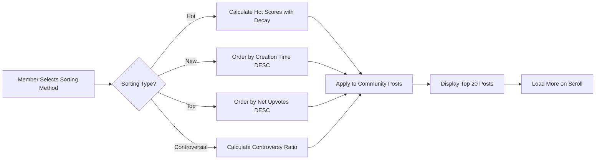
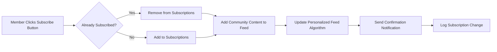

# Post Sorting and Community Subscriptions

## Introduction

This document defines the business requirements for post sorting algorithms and community subscription mechanisms in the communityPlatform. It provides detailed specifications for how posts are ordered and displayed to users, and how the subscription system enables personalized content feeds. These requirements are written in natural language, focusing on business logic and user experience, while leaving technical implementation details to the development team.

The sorting system supports multiple algorithms (hot, new, top, controversial) that determine post order within communities. The subscription system allows members to follow communities they are interested in, creating personalized feeds from their subscribed communities.

All requirements use the EARS format where applicable to ensure clarity and testability.

## Sorting Algorithms

### Hot Sorting Logic

Hot sorting prioritizes recently active posts and those with high engagement. The algorithm balances recency and popularity to surface content that is both timely and popular.

**Functional Requirements:**

WHEN a user visits a community sorted by hot, THE communityPlatform SHALL order posts by calculating a "hot" score for each post.

THE communityPlatform SHALL calculate hot score using the following formula: score = upvotes - downvotes + (comment_count * 1.5) - ((current_time - post_time) / 3600) * decay_factor.

THE communityPlatform SHALL use a decay_factor of 0.8 for posts older than 12 hours.

WHEN posts have identical hot scores, THE communityPlatform SHALL order them by creation time descending (newest first).

THE communityPlatform SHALL recalculate hot scores every 10 minutes to reflect current engagement.

### New Sorting Logic

New sorting displays posts in chronological order, focusing on the most recent content first.

**Functional Requirements:**

WHEN a user selects new sorting on a community page, THE communityPlatform SHALL order posts by creation timestamp descending.

THE communityPlatform SHALL display posts in real-time order as they are created.

WHERE a post is edited after initial creation, THE communityPlatform SHALL maintain its position based on original creation time.

IF multiple posts have the same timestamp, THE communityPlatform SHALL order them alphabetically by title.

### Top Sorting Logic

Top sorting ranks posts by overall popularity, measured by net upvotes regardless of time.

**Functional Requirements:**

WHEN a user selects top sorting, THE communityPlatform SHALL order posts by net upvotes (upvotes minus downvotes) descending.

THE communityPlatform SHALL ignore downvotes that exceed upvotes, but never allow scores below zero.

THE communityPlatform SHALL exclude posts with net negative score (more downvotes than upvotes) from top sorting display.

WHEN posts have identical net upvotes, THE communityPlatform SHALL order them by creation time descending.

THE communityPlatform SHALL hide posts from top sorting if they have been deleted by moderators or authors.

### Controversial Sorting Logic

Controversial sorting highlights posts that generate debate, measured by the ratio of upvotes to total votes and absolute vote volume.

**Functional Requirements:**

WHEN a user selects controversial sorting, THE communityPlatform SHALL calculate controversy score as (upvotes + downvotes) / (max(upvotes, downvotes) + 1).

THE communityPlatform SHALL order posts by controversy score descending.

THE communityPlatform SHALL exclude posts with fewer than 5 total votes from controversial sorting.

WHEN posts have identical controversy scores, THE communityPlatform SHALL order them by total vote count descending.

IF a post has zero controversy (no votes), THE communityPlatform SHALL sort it by creation time descending and place it at the bottom.

### Sorting Display Requirements

**Functional Requirements:**

THE communityPlatform SHALL provide sorting controls on every community page with options: hot, new, top, controversial.

WHEN a user changes sorting method, THE communityPlatform SHALL remember their preference for that community.

THE communityPlatform SHALL display post scores next to each sorting option (e.g., "Hot (1,245 points)").

WHEN no posts exist in a community, THE communityPlatform SHALL display an empty state with suggestion to create first post.

THE communityPlatform SHALL limit initial display to 20 posts per page with pagination.

## Community Subscription Mechanisms

### Subscription Flow

The subscription system allows members to follow communities for personalized content delivery. Subscriptions create a curated feed of content from multiple communities.

**Functional Requirements:**

WHEN a member clicks the subscribe button on a community page, THE communityPlatform SHALL add that community to their subscriptions.

WHEN a member is already subscribed to a community, THE communityPlatform SHALL display "unsubscribe" button instead.

WHEN a member unsubscribes from a community, THE communityPlatform SHALL immediately remove it from their personalized feed.

THE communityPlatform SHALL send confirmation message when subscription changes are successful.

### Subscription Management

**Functional Requirements:**

THE communityPlatform SHALL provide a subscription management page accessible from user profile.

WHEN a member visits subscription management, THE communityPlatform SHALL display list of subscribed communities with creation dates.

THE communityPlatform SHALL allow bulk unsubscribe functionality with checkbox selection.

WHEN a community is deleted by moderators, THE communityPlatform SHALL automatically unsubscribe all members.

IF a community becomes private, THE communityPlatform SHALL remove it from non-member subscriptions but maintain for existing members.

### Subscription Permissions

**Functional Requirements:**

THE communityPlatform SHALL restrict subscription to member role only - guests cannot subscribe.

WHEN a guest attempts to subscribe, THE communityPlatform SHALL prompt them to create account or login.

WHERE a community has subscription limits (future feature), THE communityPlatform SHALL enforce maximum subscriber count.

THE communityPlatform SHALL allow members to subscribe to unlimited communities.

## Personalized Feeds

### Feed Population Logic

Personalized feeds aggregate content from subscribed communities using the member's preferred sorting methods.

**Functional Requirements:**

WHEN a member visits their home feed, THE communityPlatform SHALL aggregate posts from all subscribed communities.

THE communityPlatform SHALL apply the member's default sorting preference (saved in profile) to the aggregated posts.

WHEN a member specifies sorting on home feed, THE communityPlatform SHALL ignore individual community sorting preferences.

THE communityPlatform SHALL deduplicate posts if a post appears in multiple subscribed communities.

### Feed Ordering and Display

**Functional Requirements:**

THE communityPlatform SHALL order home feed posts using modified sorting algorithms that consider subscription weight.

THE communityPlatform SHALL prioritize posts from communities with higher engagement rates for hot feed sorting.

WHEN generating home feed, THE communityPlatform SHALL include maximum 200 posts as initial page load.

THE communityPlatform SHALL group home feed by community with community name displayed for each post.

### Feed Customization

**Functional Requirements:**

THE communityPlatform SHALL allow members to customize default feed sorting per community.

WHEN a member sets custom sorting for a community, THE communityPlatform SHALL save this preference in their profile.

THE communityPlatform SHALL provide "all" feed option showing posts from all communities regardless of subscription status.

IF a member has no subscriptions, THE communityPlatform SHALL display suggested communities to subscribe to.

## Algorithm Inputs

### Post Data Elements

The sorting algorithms require comprehensive post metadata to function properly.

**Business Rules:**

- Creation timestamp (ISO 8601 format)
- Upvote count (positive integer)
- Downvote count (positive integer)
- Comment count (including nested replies)
- Author karma (influences initial visibility but not sorting)
- Community subscriber count (affects reach but not direct sorting)
- Post type (text/link/image affects display but not sorting score)
- Moderator actions (removal/flags affect inclusion but not score calculation)

**Functional Requirements:**

WHEN calculating any sorting score, THE communityPlatform SHALL use current vote counts collected in real-time.

THE communityPlatform SHALL use UTC timestamp for all creation time calculations to ensure consistency across global users.

WHEN a post is edited, THE communityPlatform SHALL not reset its creation timestamp for sorting purposes.

### User Interaction Data

User engagement metrics that influence algorithm performance.

**Business Rules:**

- Member session duration affects feed freshness
- Previous interaction history (viewed, voted, commented)
- Member community affinity scores
- Global platform activity levels

**Functional Requirements:**

THE communityPlatform SHALL track anonymous view counts for hot score calculations.

THE communityPlatform SHALL measure time since last member activity to adjust feed freshness parameters.

WHEN a member votes multiple times on same post, THE communityPlatform SHALL ignore duplicate votes in scoring.

### System Parameters

Configurable constants that tune algorithm behavior.

**Business Rules:**

- Hot decay rate: default 0.8 per hour
- Comment weight multiplier: default 1.5
- Minimum controversy threshold: 5 votes
- Feed refresh interval: 10 minutes
- Pagination size: 20 posts

**Functional Requirements:**

THE communityPlatform SHALL allow moderator role to adjust algorithm parameters through admin controls.

WHEN system parameters change, THE communityPlatform SHALL apply changes immediately to new calculations.

THE communityPlatform SHALL log parameter changes for auditing purposes.

WHEN parameters are reset to defaults, THE communityPlatform SHALL provide rollback functionality.

### Validation and Error Handling

Ensuring algorithm integrity and handling edge cases.

**Functional Requirements:**

IF post data is corrupted or missing required fields, THE communityPlatform SHALL exclude the post from sorting calculations.

WHEN vote counts become inconsistent, THE communityPlatform SHALL trigger audit and recalculate all scores for affected posts.

THE communityPlatform SHALL handle division by zero in controversy calculations by adding minimum value of 1.

IF algorithm calculations exceed timeout thresholds, THE communityPlatform SHALL fall back to new sorting with warning message.

### Performance Requirements

**User Experience Expectations:**

- Sorting calculations SHALL complete within 1 second for communities with up to 10,000 posts
- Feed aggregation SHALL load within 2 seconds for members with 50 subscriptions
- Score updates SHALL reflect within 30 seconds after vote submission
- Page loads SHALL feel instant with cached sorting results
- Database queries for sorting SHALL be optimized for concurrent users up to 100,000

### Business Process Flows

The following diagram illustrates the sorting selection and feed generation process:

The subscription process follows this workflow:

### Algorithm Testing Criteria

**Functional Requirements:**

WHEN testing sorting algorithms, THE communityPlatform SHALL verify that posts with higher calculated scores appear before lower scores.

THE communityPlatform SHALL confirm that score calculations use correct mathematical formulas with test datasets.

WHEN validating subscription flows, THE communityPlatform SHALL test membership role restrictions and duplicate prevention.

THE communityPlatform SHALL measure actual computation times against performance requirements under load conditions.

This document provides comprehensive business requirements for the post sorting and subscription systems. The development team has full authority over technical implementation while maintaining these business rules and user experience expectations.