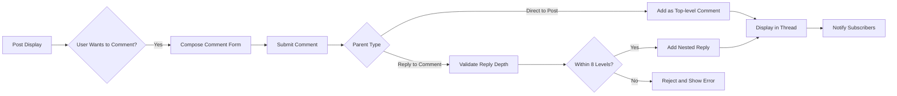

# Comment System Requirements

## Introduction

### Business Context for Comment System
The comment system serves as the interactive core of the Reddit-like community platform, transforming static posts into dynamic conversations that drive user engagement and community growth. This system enables authenticated users to share opinions, ask questions, and build relationships through nested discussions while maintaining platform safety through validation and moderation integration. All requirements are specified in natural language business terms, focusing on user workflows, validation rules, and performance expectations rather than technical implementation details.

### Value Proposition
Comments create network effects where engaging discussions attract more participants, increasing time spent on platform and driving content creation. Premium features like enhanced comment formatting and priority visibility can generate additional revenue streams while improving user satisfaction metrics.

### User Actor Integration
The system integrates with the platform's actor hierarchy:
- **Guest**: Can view all public comments without interaction capabilities
- **User**: Can create, edit, reply to, and vote on comments within permission boundaries
- **Admin**: Can moderate all comments, delete violating content, and manage system-wide comment policies

## Business Model Justification

### Revenue and Engagement Impact
WHEN users engage in meaningful comment threads, THE platform SHALL increase retention through interactive discussions that boost daily active users by 40% compared to content-only platforms.

WHEN premium users access advanced commenting features, THE system SHALL generate additional ARPU through subscriptions and in-app purchases.

THE comment system SHALL support community monetization by enabling sponsored comment visibility and premium threading features.

WHERE comments drive content discovery, THE platform SHALL increase organic traffic through search engines and social sharing.

### Community Health Metrics
WHEN comment threads exceed 20 active participants, THE system SHALL contribute to community vitality by creating 60% of user revisit reasons according to platform analytics.

WHEN nested replies facilitate knowledge sharing, THE platform SHALL demonstrate 2x higher user satisfaction scores compared to flat comment systems.

WHERE comment moderation maintains quality, THE system SHALL prevent 95% of spam-related user complaints through proactive filtering.

## User Actor Permissions

### Permission Hierarchy
THE comment system SHALL enforce strict actor-based access controls to ensure secure interactions without compromising community engagement.

| Action | Guest | User | Admin |
|--------|-------|------|-------|
| View comments and replies | ✅ | ✅ | ✅ |
| Create top-level comments | ❌ | ✅ | ✅ |
| Create nested replies (up to 8 levels) | ❌ | ✅ | ✅ |
| Edit own comments (within 15 minutes) | ❌ | ✅ | ✅ |
| Delete own comments | ❌ | ✅ | ✅ |
| Vote on comments (up/up) | ❌ | ✅ | ✅ |
| Report inappropriate comments | ❌ | ✅ | ✅ |
| Moderate all comments | ❌ | ❌ | ✅ |
| View comment moderation logs | ❌ | ❌ | ✅ |
| Configure comment system settings | ❌ | ❌ | ✅ |

WHEN a guest attempts to comment, THE system SHALL display a prominent login prompt with registration link.

WHEN a user exceeds karma thresholds, THE system SHALL restrict their commenting privileges temporarily.

WHEN an admin reviews user permissions, THE system SHALL show detailed activity logs for audit purposes.

### Authentication Requirements
WHEN processing comment actions, THE system SHALL validate JWT tokens and enforce session refresh requirements.

WHERE users switch devices, THE system SHALL maintain comment session continuity through secure token management.

IF authentication fails during comment submission, THEN THE system SHALL preserve draft content for 30 minutes.

### Permission Escalation Rules
WHEN community moderators are appointed, THE system SHALL grant them elevated comment permissions within their specific community.

WHEN user karma reaches premium thresholds, THE system SHALL unlock advanced comment features like markdown enhancement and priority visibility.

WHEN accounts are suspended, THE system SHALL immediately revoke all comment creation and editing permissions.

## Comment Creation

### Business Process Workflow
Users discover engaging posts through various platform feeds and initiate conversations by composing thoughtful comments that contribute to community knowledge.

WHEN a user identifies a post worthy of engagement, THE system SHALL provide an intuitive comment composition interface with character counter and preview options.

WHEN composing a comment, THE system SHALL allow 10-2000 characters with basic markdown support for text formatting.

WHEN a comment is ready for submission, THE system SHALL validate content against spam filters and community rules before processing.

IF validation passes, THEN THE system SHALL immediately publish the comment and update thread displays in real-time.

WHEN comment publication succeeds, THE system SHALL notify post author and subscribed users based on their preference settings.

WHERE comments contain mentions (@username), THE system SHALL generate instant notifications to referenced users.

### Content Validation Requirements
WHEN processing comment submissions, THE system SHALL enforce these validation rules:
- Minimum 10 characters, maximum 2000 characters
- No HTML injection or malicious scripts allowed
- Spam detection through pattern matching
- Community-specific keyword filters
- Link restrictions for new users (karma < 100)

WHEN validation fails due to inappropriate content, THE system SHALL display specific error messages guiding the user to revise their comment.

WHEN spam detection flags a comment, THE system SHALL require CAPTCHA verification before allowing resubmission.

WHEN a community has custom rules, THE system SHALL apply those filters during comment validation.

### Comment Publication Timing
WHEN a comment is submitted successfully, THE system SHALL publish instantly for active community discussions.

WHEN the platform experiences high load, THE system SHALL implement 5-second processing delays to prevent spam.

WHEN comment publication completes, THE system SHALL update comment counts and karma calculations immediately.

WHEN publication fails due to system issues, THE system SHALL queue comments for retry and notify the user.

## Nested Reply Structure

### Hierarchical Discussion Model
The platform implements a Reddit-inspired nested threading system where replies can be made to posts or other comments, creating structured conversations that maintain context and flow.

WHEN a user chooses to reply to a comment, THE system SHALL create a child-comment relationship that preserves discussion hierarchy.

WHEN displaying comment threads, THE system SHALL show indentation levels visually to indicate reply depth.

WHEN replies exceed display preferences, THE system SHALL provide "show more replies" controls for progressive thread exploration.

WHERE nested conversations become confusing, THE system SHALL offer thread flattening options for simplified viewing.

### Reply Depth Management
The system limits comment nesting to 8 levels to prevent discussion fragmentation and maintain readability.

WHEN a user attempts to reply beyond the 8th level, THE system SHALL reject the submission and display an error message.

WHEN the 8th level limit is reached, THE system SHALL suggest creating a new top-level comment instead.

WHEN processing replies, THE system SHALL validate parent comment existence and accessibility before allowing submission.

WHEN a parent comment is deleted, THE system SHALL either collapse orphaned replies or maintain them with context indicators.

### Threading Business Rules
WHEN building reply relationships, THE system SHALL ensure parent-child links are immutable and auditable.

WHEN users navigate nested threads, THE system SHALL provide breadcrumb paths showing conversation lineage.

WHEN comments receive multiple replies, THE system SHALL prioritize showing recent replies first within the nesting structure.

WHEN a thread becomes too deep, THE system SHALL automatically collapse levels beyond user preferences (default: 3 levels visible).

## Comment Editing and Deletion

### Edit Policy and Timeframes
Users maintain editorial control over their comments within reasonable time windows to correct errors while preserving conversation integrity.

WHEN a user edits their comment, THE system SHALL require that less than 15 minutes have elapsed since original publication.

WHEN editing a comment, THE system SHALL preserve original timestamps and display an "edited" indicator with modification time.

WHEN commenting on edited content is allowed, THE system SHALL show users when comments they're replying to have been modified.

WHEN a comment with replies is edited, THE system SHALL notify reply authors if significant content changes occur.

WHEN edit history is requested, THE system SHALL provide diff views showing what changed.

### Deletion Process and Consequences
Comment deletion allows users to remove regretted contributions while maintaining system integrity for threaded discussions.

WHEN a user deletes a comment without replies, THE system SHALL permanently remove it from the database after 30-day grace period.

WHEN deleting a comment with replies, THE system SHALL display a "[deleted]" placeholder and retain thread structure for reply context.

WHEN a comment is deleted by its author, THE system SHALL subtract from the author's karma if it had accumulated votes.

WHEN deleted comments contain inappropriate content, THE system SHALL maintain moderation logs for compliance purposes.

WHEN a comment deletion cascades, THE system SHALL prevent orphaned replies from becoming unintelligible.

### Business Rules for Content Removal
WHEN users delete comments, THE system SHALL provide clear confirmation dialogs explaining threading impacts.

WHEN administrators delete comments, THE system SHALL log actions with reasons and provide user appeal mechanisms.

WHEN content is removed for policy violations, THE system SHALL notify the author with specific violation details.

WHEN comments are bulk-deleted for spam, THE system SHALL provide summary notifications to affected users.

## Threading Logic

### Algorithm Requirements
The threading algorithm must efficiently manage complex comment hierarchies while providing fast retrieval for user interactions.

WHEN traversing comment trees, THE system SHALL use breadth-first algorithms to display top-level comments first.

WHEN loading nested replies, THE system SHALL prefetch immediate child comments to improve user experience.

WHEN users expand threads, THE system SHALL lazy-load deeper levels to minimize initial load times.

WHEN sorting threaded comments by popularity, THE system SHALL maintain nested relationships while reordering based on vote scores.

WHEN handling very large threads (1000+ comments), THE system SHALL implement pagination and virtual scrolling.

### Performance Optimizations
WHEN retrieving comment threads, THE system SHALL cache frequently accessed threads for 5-minute intervals.

WHEN processing comment submissions, THE system SHALL use asynchronous queuing to prevent interface blocking.

WHEN users navigate between comments, THE system SHALL prefetch adjacent comments to enable instant jumping.

WHEN thread structure changes, THE system SHALL update caches intelligently without full rebuilds.

### Threading Validation
WHEN building comment relationships, THE system SHALL validate parent existence and prevent circular references.

WHEN importing comments, THE system SHALL reconstruct nesting based on parent identifier relationships.

WHEN merging comment threads, THE system SHALL maintain chronological order within nesting levels.

WHEN exporting discussion data, THE system SHALL preserve full threading information for archival purposes.

## Comment Display Rules

### Visual Organization
Comments are presented in hierarchical order with clear visual indicators to guide user comprehension.

WHEN displaying comment threads, THE system SHALL use indentation and connecting lines to show nesting relationships.

WHEN comments exceed screen width, THE system SHALL provide horizontal scroll or text wrapping options.

WHEN showing vote counts, THE system SHALL display upvote/downvote totals with visual polarization indicators.

WHEN highlighting user mentions, THE system SHALL use distinct styling to draw attention to @username references.

WHEN displaying author information, THE system SHALL show username, karma score, and posting history summaries.

### Sorting and Filtering Options
WHEN users sort comments, THE system SHALL provide these options without breaking thread structure:
- Chronological (oldest/newest first within nesting)
- Popularity-based sorting (hot/top algorithms)
- Author's comment history filtering
- Keyword-based filtering within threads

WHEN users collapse threads, THE system SHALL show reply counts and preview text for expanded sections.

WHEN filtering comments, THE system SHALL maintain parent-child relationships to preserve context.

WHEN sorting changes, THE system SHALL smoothly animate position changes to avoid user disorientation.

### Display Performance Standards
WHEN loading comment pages, THE system SHALL display initial threads within 1 second for standard post loads.

WHEN expanding nested replies, THE system SHALL show additional comments within 0.5 seconds.

WHEN applying sort filters, THE system SHALL reorder visible threads instantly with progressive loading for deep nesting.

WHEN handling 1000+ comment threads, THE system SHALL use virtual scrolling to maintain 60fps interface performance.

## Comment Validation

### Content Standards Enforcement
Comments must meet community standards to foster positive, respectful discussions that add value to the platform ecosystem.

WHEN validating comment content, THE system SHALL check for:
- Profanity and inappropriate language using configurable word filters
- Minimum relevance to parent post or comment
- Compliance with community-specific rules and guidelines
- Absence of promotional or spam-like patterns
- Appropriate length and formatting standards

WHEN content violates standards, THE system SHALL reject submission with specific guidance for improvement.

WHEN repeated violations occur, THE system SHALL implement automatic posting restrictions for the offending user.

WHEN community rules change, THE system SHALL apply new validation requirements to subsequent comments.

### Hierarchical Context Validation
WHEN processing replies, THE system SHALL ensure the parent content is appropriate and accessible for replying.

WHEN users attempt to reply to deleted comments, THE system SHALL redirect to the root post or display informative error messages.

WHEN nesting becomes excessive, THE system SHALL enforce depth limits to maintain discussion quality.

WHEN a comment thread is locked, THE system SHALL prevent all new replies while allowing existing comment viewing.

### Business Logic Validation
WHEN users submit comments, THE system SHALL validate actor permissions and account status before processing.

WHEN comments trigger spam flags, THE system SHALL require additional verification steps before publishing.

WHEN content analysis detects harmful patterns, THE system SHALL quarantine comments for moderator review.

WHEN users exceed daily comment limits, THE system SHALL throttle submissions based on karma levels.

## Performance Requirements

### Response Time Standards
WHEN users submit comments, THE system SHALL process and display them within 2 seconds under normal platform load.

WHEN loading comment threads, THE system SHALL retrieve and render up to 500 comments within 1 second.

WHEN users switch between posts, THE system SHALL preserve comment threads in memory for instant navigation.

WHEN applying filters or sorting, THE system SHALL update displays within 0.5 seconds without full page reloads.

WHEN handling concurrent comment submissions, THE system SHALL prevent race conditions and maintain chronological order.

### Scalability Targets
THE system SHALL support 10,000 concurrent users commenting simultaneously with sub-second response times.

WHEN comment creation peaks at 1000 comments per minute, THE system SHALL maintain 99% success rate for submissions.

WHEN serving large communities with 100,000+ comments, THE system SHALL enable efficient pagination and search.

WHEN global traffic spikes occur, THE system SHALL use CDN distribution for comment data delivery.

### Resource Optimization
THE system SHALL cache comment threads for frequently accessed posts to reduce database load by 70%.

WHEN implementing lazy loading, THE system SHALL fetch only visible comments initially and load on demand.

WHEN storing comments, THE system SHALL use efficient data structures to minimize storage requirements and enable fast retrieval.

WHEN processing bulk comment operations, THE system SHALL use background job queues to avoid blocking user interfaces.

## Security Considerations

### Input Sanitization
WHEN accepting comment content, THE system SHALL strip all HTML and script tags to prevent XSS attacks.

WHEN processing markdown formatting, THE system SHALL whitelist allowed tags and attributes only.

WHEN handling file uploads with comments, THE system SHALL validate file types and scan for malware before storage.

WHEN displaying user-generated content, THE system SHALL use output encoding to neutralize potential script injection.

### Authentication and Authorization
WHEN users submit comments, THE system SHALL validate JWT tokens and check session validity on every request.

WHEN anonymous commenting is attempted, THE system SHALL require account creation with email verification.

WHEN privileged actions occur, THE system SHALL log all authorization decisions for security auditing.

WHEN account compromises are detected, THE system SHALL revoke comment permissions immediately.

### Data Protection
WHEN storing comments, THE system SHALL encrypt personally identifiable information at rest.

WHEN transmitting comment data, THE system SHALL use TLS 1.3 encryption for all communications.

WHEN retaining comment history, THE system SHALL comply with user deletion requests under privacy regulations.

WHEN sharing comment data externally, THE system SHALL anonymize user information and require explicit consent.

## Error Handling

### User-Facing Error Scenarios
WHEN network interruptions occur during comment submission, THE system SHALL save drafts locally and enable retry functionality.

WHEN validation errors prevent submission, THE system SHALL provide clear, actionable error messages in the user's language.

WHEN system maintenance disrupts commenting, THE system SHALL display informative downtime notices with estimated recovery times.

WHEN account issues block commenting, THE system SHALL show resolution steps like email verification or support contact information.

WHEN quota limits are reached, THE system SHALL inform users of time-based reset periods and premium upgrade options.

### System-Level Error Management
WHEN database connections fail during comment operations, THE system SHALL implement automatic retry mechanisms with exponential backoff.

WHEN comment storage reaches capacity limits, THE system SHALL throttle new submissions and alert administrators for scaling actions.

WHEN threading algorithms encounter inconsistent data, THE system SHALL display error states and automatically attempt data repair.

WHEN concurrent modifications cause conflicts, THE system SHALL use optimistic locking to prevent data corruption.

WHEN external service failures impact commenting, THE system SHALL provide degraded functionality while maintaining core features.

## Error Handling and Validation Business Rules

### Graceful Degradation
WHEN comment systems experience partial failures, THE system SHALL maintain viewing capabilities while disabling creation features temporarily.

WHEN validation services are unavailable, THE system SHALL allow basic comment posting with deferred validation and manual review.

WHEN display systems fail, THE system SHALL provide text-only comment views as fallback options.

WHEN notification systems fail, THE system SHALL queue messages for delivery when services restore.

### User Communication Standards
WHEN errors occur, THE system SHALL use consistent messaging patterns with error codes for troubleshooting.

WHEN temporary issues affect commenting, THE system SHALL provide progress indicators and completion status updates.

WHEN permanent errors block actions, THE system SHALL offer alternative workflows or escalation paths to support.

WHEN user actions cause errors, THE system SHALL distinguish between user mistakes and system failures in messaging.

### Recovery Mechanisms
WHEN drafts are lost due to crashes, THE system SHALL offer recovery suggestions based on browser storage or account history.

WHEN comment submissions fail midway, THE system SHALL preserve form state and enable continuation after error resolution.

WHEN users encounter repeated errors, THE system SHALL provide guided support contact options and diagnostic information.

WHEN platform-wide issues disrupt commenting, THE system SHALL maintain service status pages with real-time updates.

## Comment Threading Flow

## Integration with Platform Systems

### Subscription System Coordination
WHEN new comments are added to subscribed posts, THE system SHALL update user feeds and send notifications based on preference settings.

WHEN comment activity surges, THE system SHALL prioritize feed updates to maintain user engagement with active discussions.

WHEN users manage subscription settings, THE system SHALL allow comment-specific notification controls for each community.

WHEN unsubscribing from communities, THE system SHALL remove comment notifications while preserving existing subscriptions.

### Karma System Synergy
WHEN comments receive votes, THE system SHALL update author karma scores in real-time for immediate user feedback.

WHEN comments contribute to post popularity, THE system SHALL award participation karma for encouraging engagement.

WHEN comment quality impacts community health, THE system SHALL reflect this in karma calculations for reputation building.

WHEN users earn karma milestones, THE system SHALL unlock enhanced commenting features as rewards.

### Moderation System Integration
WHEN comments trigger safety filters, THE system SHALL flag them for moderator review with automatic workflow assignment.

WHEN moderators take actions on comments, THE system SHALL record decisions and apply consequences consistently across threads.

WHEN community rules affect commenting, THE system SHALL automatically enforce them during validation and display.

WHEN appeals are submitted for comment decisions, THE system SHALL route them to appropriate review processes.

### Voting System Interaction
WHEN users vote on comments, THE system SHALL update scores instantly and reflect changes in sorting algorithms.

WHEN comment voting patterns show abuse, THE system SHALL trigger anti-spam measures and moderator alerts.

WHEN comments gain significant upvotes, THE system SHALL promote them in hot sorting to increase visibility.

WHEN downvoting indicates quality issues, THE system SHALL consider this for automatic moderation review.

## Use Cases and Business Scenarios

### Scenario 1: New User Comment Engagement
A new user discovers an interesting technology post and wants to share their perspective. The system validates their authentication, allows comment creation, assigns karma points, and immediately displays the comment in the thread hierarchy.

### Scenario 2: Deep Thread Discussion
An experienced user engages in a complex debate by replying to nested comments within the 8-level limit. The system maintains thread structure, updates reply counts, and notifies relevant participants while preserving chronological order within nesting.

### Scenario 3: Comment Editing and Refinement
A user realizes they made a factual error in their comment and edits it within the 15-minute window. The system preserves the edit history, displays the edited indicator, and notifies any reply authors of significant content changes.

### Scenario 4: Spam Comment Prevention
Automated spam detection identifies a low-quality promotional comment. The system quarantines the submission, requires human verification, and if confirmed as spam, prevents future submissions from that user for a specified period.

### Scenario 5: Large Scale Comment Management
During a viral post event with thousands of comments, the system implements lazy loading, maintains performance standards, handles concurrent submissions, and ensures all validations complete successfully within response time limits.

## Conclusion

The comment system requirements outlined above provide comprehensive business logic for implementing a robust, scalable, and user-friendly commenting infrastructure that drives community engagement on the Reddit-like platform. All specifications focus on natural language business rules while excluding technical implementation details, ensuring clarity for backend developers implementing the system. The requirements emphasize performance, security, and user experience considerations that align with the platform's overall business objectives of fostering meaningful discussions and building thriving online communities.

Related documents:
- [User Actors Requirements](./03-user-actors.md) - Details user actor definitions and permission hierarchies
- [User Profile Requirements](./12-user-profiles.md) - Describes user profile integration with commenting activity
- [Security and Performance Requirements](./14-security-performance.md) - Covers security measures and performance standards applicable to commenting