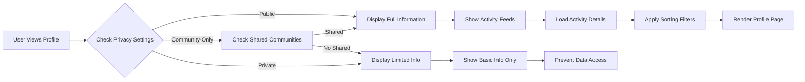
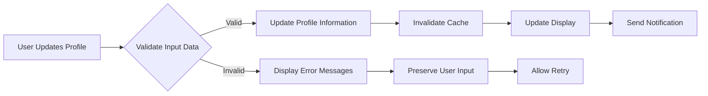

# User Profiles Requirements for Community Platform

## Overview of User Profile System

User profiles in the Reddit-like community platform serve as public-facing representations of authenticated users, displaying their activity, reputation, and contributions to build community trust and accountability. WHEN users visit a profile page, THE platform SHALL provide a transparent view of member contributions while respecting privacy controls established by profile owners. THE system SHALL integrate profiles with authentication, content management, voting, commenting, karma calculation, community subscriptions, and moderation systems to create a cohesive user experience.

### Core Purpose of User Profiles

User profiles fulfill three essential business objectives for the platform:
1. **Community Transparency**: WHEN users view profiles, THE system SHALL display contributions and reputation to foster trust through visible participation history and karma scores.
2. **Personal Branding**: WHEN members customize their profiles, THE system SHALL allow personalization that establishes expertise and community presence.
3. **Moderation Support**: WHEN moderators review user behavior, THE system SHALL provide complete activity history to assess compliance and enforce platform rules.

THE platform SHALL implement profile features that balance transparency with user privacy to support organic community growth through verified participation tracking.

## Profile Display Requirements

### Basic Profile Information Display

WHEN any user (authenticated or guest) accesses a profile page, THE system SHALL display the following core information in a prominent header section:
- User's unique username as registered during authentication
- User's account creation date in readable format such as "Member since December 2023"
- User's total karma score calculated as net upvotes minus downvotes across all posts and comments
- User's avatar image, either user-selected or system-generated default based on username
- User's current role designation (member, moderator, or admin) with visual indicators

THE system SHALL ensure all basic profile information updates in real-time when changes occur, with karma scores reflecting voting activity within 1 second of vote submissions.

### Profile Layout Structure  

THE profile page SHALL be organized into logically separated sections for improved user experience and information hierarchy:
- Header section containing avatar, username, karma score, and join date with prominent placement
- Activity summary section displaying total post count, total comment count, and engagement metrics
- Recent activity feed showing the latest 10 user actions with timestamps
- Full activity history accessible through infinite scroll or pagination controls
- Community affiliations section listing subscribed communities with subscription dates and activity levels

THE system SHALL use responsive design that adapts profile layout for mobile and desktop viewing, ensuring all sections remain accessible on screens as small as 320 pixels wide.

### Default Profile View

WHEN a guest or authenticated user first visits any profile page, THE system SHALL display the default public view with controlled information exposure:
- Complete visibility of all basic profile information including karma and role
- Summary statistics showing total posts, total comments, and communities joined
- Most recent 10 posts and comments from the past 30 days, sorted by creation timestamp
- Up to 5 most active subscribed communities ranked by user's posting frequency

THE system SHALL load the default profile view within 2 seconds for optimal user engagement, preventing abandonment due to slow performance.

## Activity History Management  

### Activity Tracking Scope

THE system SHALL maintain comprehensive tracking of all user activities for profile display purposes:
- Original posts created, including text posts, link posts, and image posts with full content and metadata
- Comments made on posts, including nested replies with parent relationships preserved
- Votes cast on posts and comments (upvotes and downvotes) with timestamps
- Communities joined through subscription actions with subscription and last activity dates
- Karma points earned or lost from voting interactions with calculation details
- Reports submitted on inappropriate content with anonymized reporting information
- Account creation milestone and role changes with historical timestamps

WHEN recording activities, THE system SHALL capture precise UTC timestamps and maintain activity logs for at least 7 years unless legally required to delete specific information.

### Activity Visibility Rules

WHEN displaying user activity history on profiles, THE system SHALL organize content with clear temporal and categorization structure:
- Default chronological sorting showing most recent activities first
- Date range groupings such as "This Week", "This Month", "This Year", and "All Time" for easy navigation
- Timestamps displayed in user's local timezone based on their browser settings
- Clear activity type labels including "Posted in Community Name", "Commented on Post Title", "Voted up/down", and "Joined Community Name"

THE system SHALL filter activity display based on privacy settings, showing only activities the profile owner has authorized for public viewing.

### Activity History Persistence

THE system SHALL maintain activity history indefinitely for active accounts unless specific business conditions apply:
- User explicitly requests data deletion through account deactivation process
- Legal requirements necessitate data removal per court orders or data protection regulations
- Platform content policies require archiving or deletion of specific violation-related activities

WHEN users request account deactivation, THE system SHALL provide options to anonymize historical activities rather than complete deletion to maintain platform integrity.

### Recent Activity Feed

THE profile activity feed SHALL provide a dynamic overview of recent user engagement:
- Display of the most recent 50 activities in reverse chronological order with automatic refresh
- Content previews limited to first 100 characters for posts and comments with "read more" links
- Direct links to full activity content within the platform for detailed viewing
- Engagement metrics showing vote counts for posts, reply counts for comments, and karma impact

WHEN new activities occur, THE system SHALL update the feed in real-time for viewers currently on the profile page, excluding guest users.

## Public Information Rules

### Default Public Information

THE following information SHALL be publicly visible on all user profiles by default without requiring authentication:
- Username displayed prominently in profile header
- Join date formatted as "Member since Month Year"
- Current avatar image with fallback to system default
- Total karma score with breakdown showing post karma vs comment karma if configured
- Basic activity counts including total posts, total comments, and joined communities
- Recent activity feed with community-attributed content
- Subscribed communities list with subscription durations

THE system SHALL enforce public visibility for these elements while allowing granular privacy controls for other information.

### Community-Specific Visibility

THE system SHALL implement community-level privacy controls that override default public settings:
- Community moderators SHALL have authority to set community-specific visibility rules for member activities
- Users SHALL have the option to opt-out of activity display within specific communities they join
- Global privacy settings SHALL serve as defaults while community-specific rules take precedence when stricter

WHEN conflicts occur between global and community privacy settings, THE system SHALL apply the most restrictive setting to protect user preferences.

### Content Attribution Display

WHEN displaying user-generated content in activity history, THE system SHALL maintain content integrity and context:
- Full text display for original posts including embedded links and images
- Comment previews limited to first 200 characters with expandable view for full content
- Preservation of original formatting, links, and media references
- Explicit community attribution for each activity (e.g., "Posted in r/technology", "Commented in r/programming")

WHEN content has been moderated or removed, THE system SHALL display removal notices with explanation while maintaining activity history structure.

## Privacy Settings and Controls

### Privacy Control Interface

THE system SHALL provide authenticated users with a dedicated privacy management interface accessible from profile settings where they can control:
- Selection of profile visibility levels including public, community-only, or private options
- Granular control over which specific activity types appear in public view
- Community-specific visibility preferences for joined communities
- Management of public information display with opt-in/opt-out controls
- Data retention settings that determine how long activities remain in feed displays

WHEN users access privacy settings, THE system SHALL display current settings with clear explanations of each option's impact on profile visibility.

### Activity Visibility Controls

Users SHALL configure selective hiding of specific activity categories from public profile views:
- Hide individual vote activity while maintaining karma score visibility
- Restrict comment history display to time periods set by the user
- Exclude post history from specific communities
- Limit activity feed to recent time frames only

THE system SHALL apply visibility controls immediately upon saving, with changes reflected in public views within 5 minutes.

### Privacy Level Definitions

THE platform SHALL support three distinct privacy levels with graduated information exposure:

**Public (Default)**
- Complete profile information visible to all users
- Full activity history accessible through pagination
- Community affiliations and subscription details public
- All posts and comments visible in activity feeds

**Community-Only**  
- Profile information visible only to members of the same communities
- Activity history restricted to shared community content
- Guest users see limited placeholder with basic join information
- Subscribed community list hidden from non-members

**Private**
- Only username and join date visible to non-community users
- Activity history and detailed statistics completely hidden
- Community affiliations removed from profile display
- All activity feeds show generic 'private user' message

### Privacy Setting Changes

WHEN users modify their privacy preferences, THE system SHALL apply changes systematically:
- Immediate effect on current and future profile views without requiring page refresh
- Retention of previous settings for debugging and audit purposes
- Invalidation of cached profile data within 5 minutes across all platform instances
- Automatic notification sent to user confirming privacy setting application

THE system SHALL log all privacy setting changes with timestamps for user protection and support purposes.

## Profile Customization Features

### Avatar Management

THE system SHALL enable comprehensive avatar customization to support personal branding:
- Direct upload of personal images with restrictions of maximum 5MB file size
- Support for standard image formats including JPEG, PNG, and GIF
- Predefined avatar options selected by system administrators for default themes
- Automatic generation of geometric avatars based on username when custom uploads unavailable
- Full change history allowing users to revert to previous avatar selections

WHEN validating avatar uploads, THE system SHALL enforce security measures including file type verification and automatic malware scanning.

### User Identification Display

Users SHALL customize core identification elements within specified limits:
- Display name customization between 3-25 characters with uniqueness checks
- Profile description/bio limited to maximum 200 characters with appropriate content validation
- Optional location information with user-controlled visibility toggles
- Up to 3 external website or social media links with automatic URL format validation

THE system SHALL validate custom display names for inappropriate language and ensure descriptions comply with platform content policies.

### Username Change Policy

THE system SHALL implement restrictive username change policies to maintain platform integrity:
- Limit of maximum 2 username changes per calendar year per account
- Mandatory 30-day waiting period between successive username modifications
- Permanent maintenance of username change history for attribution and moderation
- Automatic notification to moderators for all username change requests

WHEN processing username changes, THE system SHALL verify all platform rules compliance and prevent abuse patterns.

### Profile Theming Options

THE platform SHALL provide basic visual customization for improved user experience:
- Selection among predefined color schemes optimized for accessibility
- Custom header images for profile pages with size and format restrictions
- Profile accent colors that enhance user preference representation
- Accessibility features including high contrast mode and text scaling options

THE system SHALL ensure all theme customizations maintain readability and platform usability standards.

## Business Rules and Validation

### Profile Information Validation

WHEN validating profile updates, THE system SHALL apply comprehensive business rules:
- Username uniqueness verification across all active and deactivated accounts
- Display name content moderation checking for prohibited language
- Avatar file validation ensuring size limits and supported formats
- External link format verification using standard URL parsing
- Profile description compliance with community content standards through automated filtering

THE system SHALL reject invalid updates and provide specific feedback messages for each validation failure.

### Business Logic for Profile Access

THE system SHALL enforce graduated access controls based on user roles and privacy settings:

**Announcement for All Users**
```
WHEN any user accesses a profile page,
THE system SHALL display information according to the target user's current privacy level settings,
and SHALL load appropriate content within 3 seconds regardless of complexity.
```

**Announcement for Member Users**
```
WHEN a member user accesses another member's profile,
THE system SHALL provide expanded viewing capabilities including:
full activity history when privacy allows,
contact options if the profile owner enables messaging,
and user reporting functions for inappropriate profile content.
```

**Announcement for Moderator Users**
```
WHEN a moderator accesses any user's profile for moderation purposes,
THE system SHALL display complete activity history bypassing privacy restrictions,
SHALL log the access event with timestamp and reason for accountability,
and SHALL provide additional moderation tools within the profile interface.
```

### Error Handling for Profile Operations

WHEN profile update operations encounter failures, THE system SHALL provide user-friendly recovery mechanisms:
- Clear error messages specifying validation failure reasons with actionable guidance
- Preservation of user input across page reloads to prevent data loss
- Suggested alternatives for common resolution scenarios
- Rate limiting for repeated failed attempts to prevent system abuse

THE system SHALL maintain operation logs for troubleshooting profile errors while protecting sensitive user information.

### Profile Data Consistency

THE system SHALL ensure data integrity through automated synchronization processes:
- Real-time karma score updates triggered by voting activity completion
- Automatic recalculation of activity count statistics during periodic maintenance
- Immediate cache invalidation when profile data changes are detected
- Regular backup procedures with point-in-time recovery capabilities for profile information

WHEN inconsistencies are detected, THE system SHALL automatically correct data through background processes without user intervention.

## Integration with Related Platform Features

### Content Management Integration

User profiles SHALL integrate seamlessly with content management systems to provide comprehensive activity display:
- Complete listing of all user-created posts sorted chronologically with creation dates
- Performance metrics display including post upvotes, total comments, and comment engagement
- Direct community linking with contextual community information for each post
- Ownership attribution maintenance preventing content misappropriation

WHEN posts are deleted or moderated, THE system SHALL reflect status changes in profile activity feeds with appropriate notations.

### Voting and Comments System Integration

THE system SHALL integrate with voting mechanisms to provide transparent reputation tracking:
- Automatic karma calculations based on net upvotes minus downvotes across all user content
- Display of voting patterns and engagement metrics when privacy settings permit
- Detailed comment thread relationships including nested reply hierarchies
- User vote totals tracking while maintaining vote anonymity for individual actions

WHEN karma calculations become inconsistent, THE system SHALL trigger automatic recalculation within 1 hour.

### Community Subscription Feeds

User profiles SHALL display community membership information with activity context:
- Comprehensive list of subscribed communities ranked by user activity frequency
- Subscription dates and durations for relationship longevity indication
- Community-specific karma scores calculated from posts within that community
- Moderator role displays within communities where user holds elevated permissions

THE system SHALL update subscription information in real-time as users join or leave communities.

### Sorting and Subscription System Support

THE profile system SHALL support advanced personalization through integrated sorting capabilities:
- Default activity feed sorting by most recent with user-configurable options
- Integration with global sorting algorithms (hot, new, top) for activity display
- Personalized feed algorithms that prioritize subscribed communities in activity lists
- Suggested community integrations based on user activity patterns

WHEN users modify sorting preferences, THE system SHALL apply changes immediately to profile displays.

### Moderation and Reporting System Integration

THE system SHALL support moderation functions through profile transparency features:
- Display of user moderation history visible to moderators only
- Behavior analytics generation for moderator decision-making support
- Integration with moderator note systems for private profile annotations
- Complete moderation activity logging with timestamp and reason tracking

WHEN content violates platform rules, THE system SHALL integrate moderation actions with profile displays for consistent enforcement.

## Business Process Flows





## User Scenarios and Workflows

### Profile Viewing Scenario: Guest Exploration

WHEN a guest user discovers an interesting profile through community activity, THE system SHALL:
- Display the profile according to the owner's privacy settings without requiring authentication
- Show basic information including username, join date, and karma score for credibility assessment
- Provide limited activity preview encouraging account creation for full access
- Load the profile page within 3 seconds to maintain user engagement during exploration

### Profile Customization Workflow: New Member Setup

WHEN a newly registered member customizes their profile, THE system SHALL:
- Guide them through avatar selection and basic information setup
- Validate all inputs according to platform rules and provide immediate feedback
- Save profile changes immediately and reflect updates in real-time
- Send confirmation notification that profile is ready for community interaction
- Update community feeds to show new member presence within profile views

### Privacy Management Example: Reducing Visibility

WHEN an established member adjusts privacy settings to reduce public exposure, THE system SHALL:
- Present clear toggle options for each information category
- Show preview of how profile will appear under different privacy levels
- Apply changes instantly with visual confirmation
- Update all cached profile data across platform servers within 5 minutes
- Log the privacy change for user account history and support purposes

### Moderator Profile Review: Community Safety

WHEN a moderator investigates suspicious activity through profiles, THE system SHALL:
- Provide privileged access to complete activity history bypassing privacy restrictions
- Display all user actions chronologically with context and community attribution
- Show moderation history and previous violations if any exist
- Generate behavior analytics and patterns for moderator decision support
- Log the moderator access for transparency and accountability requirements

## Performance Requirements

WHEN loading user profiles, THE system SHALL:
- Display basic profile information within 2 seconds for optimal user experience
- Load activity feeds within 3 seconds for pages with up to 100 activities
- Update profile information changes within 1 second after user actions
- Support 500 concurrent profile views without performance degradation

THE system SHALL maintain profile loading performance during peak traffic periods and implement caching strategies for frequently accessed profiles to reduce database load by 70%.

## Error Handling and Validation

WHEN profile operations fail, THE system SHALL:
- Display specific error messages explaining validation failures for user correction
- Preserve user input during failed submissions to prevent frustration
- Suggest appropriate fixes for common validation issues
- Limit rapid retry attempts to prevent system abuse

IF critical profile data becomes corrupted, THE system SHALL automatically restore from backup within 30 minutes while maintaining user access to basic functions.

---

> *Developer Note: This document defines **business requirements only**. All technical implementations (architecture, APIs, database design, etc.) are at the discretion of the development team.*

## Document Cross-References

For foundational authentication requirements that establish user identity, refer to the [Authentication Requirements Document](./03-authentication-requirements.md).

Integration details with content creation are outlined in the [Content Management Requirements](./04-content-management.md).

Voting and commenting system interactions are specified in the [Voting and Comments System Requirements](./05-voting-comments-system.md).

User personalization through subscriptions is detailed in the [Sorting and Subscriptions Requirements](./06-sorting-subscriptions.md).

For moderation capabilities related to user profiles, review the [Moderation and Reporting Requirements](./08-moderation-reporting.md).