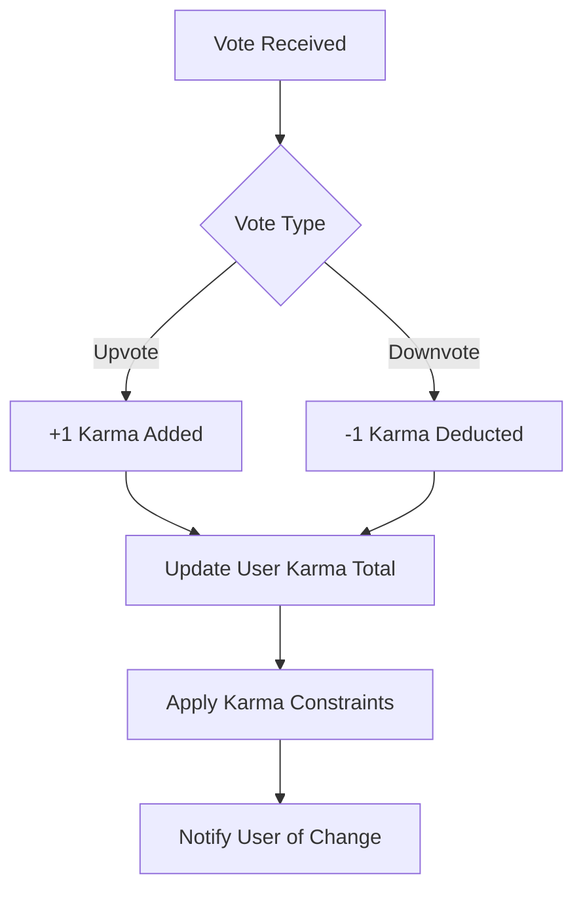

# Karma System Requirements

## Executive Summary

The karma system serves as a reputation mechanism for the Reddit-like community platform, quantifying user contributions through positive and negative feedback from community members. Karma scores influence user capabilities, content visibility, and platform permissions, creating incentives for quality participation while discouraging harmful behavior. This system ensures fair recognition of valuable contributions and maintains platform integrity through transparent, rules-based karma calculations.

All karma requirements are specified in natural language business terms, with measurable criteria where applicable, to enable precise backend implementation.

## Business Model Context

The karma system operates as both incentive and moderation tool:
- **Incentive Mechanism**: Rewards high-quality contributions with increased visibility and capabilities
- **Moderation Tool**: Penalizes harmful behavior through reduced access and community trust
- **Quality Signal**: Provides transparent reputation metrics for content evaluation
- **Engagement Driver**: Creates competitive dynamics that increase user participation

WHEN karma scores accurately reflect community value, THE platform achieves higher user retention and content quality.

## Karma Definition and Core Concepts

### Karma Score Overview
Karma represents a cumulative reputation score earned through community interactions. Each point reflects one unit of community approval or disapproval, with vote-based transactions supporting transparency and auditability.

WHEN a user receives positive community feedback through upvotes, THE system awards karma points proportional to the received approval.

WHEN a user receives negative community feedback through downvotes, THE system deducts karma points proportional to the received disapproval.

### Karma Value Specifications
THE karma system assigns the following point values per vote:
- **Upvote on user's content**: +1 karma point
- **Downvote on user's content**: -1 karma point
- **Vote reversals**: Karma adjustments are reversed (e.g., removed upvote deducts 1 karma point)

### Karma Range and Constraints
THE karma system enforces minimum and maximum karma limits:
- WHEN a user's karma score would drop below -100, THE system caps the value at -100.
- WHEN a user's karma score would exceed 999,999, THE system caps the value at 999,999.
- WHEN a user account is suspended, THE system freezes karma accumulation during suspension period.

## Karma Calculation Algorithms

### Post-Based Karma Calculation
Post karma accumulates through community voting on submitted posts, reflecting the value of shared content.

WHEN a post receives an upvote, THE system adds 1 karma point to the post author's account.
WHEN a post receives a downvote, THE system subtracts 1 karma point from the post author's account.
WHEN a vote is removed or changed, THE system reverses the previous karma adjustment.

**Formula:** `Post Karma = Σ(upvotes - downvotes for all user's posts)`

### Comment-Based Karma Calculation
Comment karma accumulates through community voting on submitted comments, rewarding valuable discussion contributions.

WHEN a comment receives an upvote, THE system adds 1 karma point to the comment author's account.
WHEN a comment receives a downvote, THE system subtracts 1 karma point from the comment author's account.
WHEN a vote is removed or changed, THE system reverses the previous karma adjustment.

**Formula:** `Comment Karma = Σ(upvotes - downvotes for all user's comments)`

### Total Karma Calculation
Total karma represents the aggregate reputation across all user contributions.

WHEN calculating total karma, THE system combines post karma and comment karma.
WHEN total karma equals, THE formula is: `Total Karma = Post Karma + Comment Karma`

### Karma Recalculation Rules
WHEN a post is deleted by the author, THE system reverses all karma changes associated with that post.
WHEN a comment is deleted by the author, THE system reverses all karma changes associated with that comment.
WHEN a vote is invalidated due to account suspension, THE system removes that vote's karma impact.
WHEN content is removed by moderation, THE system reverses associated karma changes.

### Time-Based Karma Validation
WHILE the karma system operates in real-time, THE system recalculates all karma scores monthly for accuracy.
WHEN recalculating karma scores, THE system processes all vote transactions since the last calculation.
WHEN discrepancies are detected during recalculation, THE system adjusts user karma scores and logs the changes.

## Karma Impact on User Capabilities

### Content Creation Restrictions
Different karma levels impose varying restrictions on content creation to maintain platform quality.

WHEN a user has karma below -10, THE system limits the user to creating 1 post per 24-hour period.
WHEN a user has karma below -20, THE system limits the user to creating 1 post per 48-hour period.
WHEN a user has karma below -50, THE system suspends the user's posting privileges until karma improves.

### Comment Creation Restrictions
Commenting capabilities scale with karma to encourage constructive discussions.

WHEN a user has karma below -5, THE system hides the user's existing comments from default post views.
WHEN a user has karma below -15, THE system prevents the user from creating new comments.
WHEN a user has karma below -30, THE system displays a warning on all the user's content indicating disputed reliability.

### Voting Limitations
Karma levels do not directly affect voting capabilities but influence vote weight in certain contexts.

WHEN a user has karma below -25, THE system reduces the user's vote weight in controversial post sortings.
WHEN a user has karma above 1000, THE system applies a quality multiplier to upvote impacts.
THE system allows all authenticated users to vote on content regardless of karma score.

### Platform Access Restrictions
Severe karma violations can result in temporary or permanent access limitations.

WHEN a user reaches -100 karma, THE system restricts account access to read-only mode.
WHEN a user maintains karma below -50 for 30 consecutive days, THE system flags the account for review.
WHEN an account is flagged for review, THE system may suspend access until manual karma adjustment.

### Karma Threshold Definitions
THE karma system defines clear thresholds for capability changes:

| Karma Range | Posting Rate | Comment Visibility | Vote Weight | Access Status |
|-------------|-------------|-------------------|-------------|---------------|
| 0 to -4 | Unlimited | Full | Standard | Full |
| -5 to -9 | Unlimited | Hidden* | Standard | Full |
| -10 to -19 | 1/24hr | Hidden* | Standard | Full |
| -20 to -49 | 1/48hr | None | Reduced | Full |
| -50 to -99 | None | None | Reduced | Full |
| -100 or lower | None | None | None | Read-only |

*Hidden means comments appear collapsed by default

WHEN a user improves karma above threshold levels, THE system gradually restores capabilities.
WHEN karma improves from negative ranges, THE system requires 7 days above threshold before restoring restrictions.

## Karma Display Requirements

### Profile Karma Presentation
User profiles prominently display karma information to support reputation transparency.

WHEN displaying karma in profiles, THE system shows total karma in large, prominent text.
WHEN displaying karma breakdowns, THE system shows separate post and comment karma values.
WHEN displaying karma history, THE system provides a paginated list of recent karma changes with dates and sources.

### Content Attribution Display
Content displays include author karma for context and credibility assessment.

WHEN displaying posts, THE system shows author karma score next to the username.
WHEN displaying comments with low karma authors, THE system adds a subtle credibility indicator.
WHEN karma scores change, THE system updates display information within 30 seconds.

### Karma Change Notifications
Users receive timely feedback on karma changes to understand their reputation progression.

WHEN a user gains or loses karma, THE system sends an in-app notification.
WHEN karma changes significantly (more than 10 points in 24 hours), THE system sends an email summary.
WHEN karma triggers capability changes, THE system provides clear explanations and improvement guidance.

## Karma History and Tracking

### Karma Change Logging
The system maintains comprehensive audit trails for all karma transactions.

WHEN a vote changes karma, THE system records the vote type, date, target content, and karma impact.
WHEN karma recalculations occur, THE system logs the number of changes and reasons for adjustments.
WHEN manual karma changes occur (admin actions), THE system records admin justification and approval chain.

### Karma History Access
Users can review their karma accumulation for reputation analysis and improvement.

WHEN a user accesses karma history, THE system displays changes in reverse chronological order.
WHEN a user requests karma history export, THE system provides CSV format with complete transaction details.
WHEN a user views karma trends, THE system displays charts showing karma accumulation over time.

### Historical Karma Validation
The system ensures historical karma data remains accurate and tamper-proof.

WHEN karma history is displayed, THE system calculates running totals from verified transaction records.
WHEN inconsistencies are detected in karma history, THE system initiates automatic recalculations.
WHEN user contests karma history, THE system provides detailed transaction records for review.

## Karma Restrictions and Security Measures

### Self-Voting Prevention
The karma system prevents users from manipulating their own reputation.

WHEN a user attempts to vote on their own content, THE system rejects the vote and displays an error message.
WHEN a user creates content in multiple accounts to inflate karma, THE system detects pattern and applies penalties.

### Vote Manipulation Detection
The system monitors for artificial karma inflation through suspicious patterns.

WHEN abnormal voting patterns are detected, THE system flags accounts for review.
WHEN coordinated voting campaigns occur, THE system applies karma deductions to involved accounts.
WHEN bot-like voting behavior is identified, THE system suspends affected accounts.

### Karma Fraud Prevention
Multiple safeguards prevent karma score manipulation.

WHEN karma changes occur through invalid votes, THE system reverses the transaction and logs the attempt.
WHEN users attempt to exploit karma calculation edge cases, THE system applies corrective measures.
WHEN karma fraud is confirmed, THE system resets affected karma scores and applies access restrictions.

### Rate Limiting and Abuse Prevention
The system limits karma-affecting actions to prevent abuse.

WHEN a single user receives excessive votes in a short period, THE system flags content for review.
WHEN vote rates exceed reasonable thresholds, THE system implements temporary voting restrictions.
WHEN mass voting campaigns target specific users, THE system distributes penalties across involved parties.

## Performance Requirements

### Karma Calculation Performance
Karma operations must maintain sub-second response times even during high activity.

WHEN calculating karma changes, THE system completes all database operations within 100 milliseconds.
WHEN loading karma scores for display, THE system retrieves values within 50 milliseconds.
WHEN processing karma batch recalculations, THE system handles 10,000 karma changes per minute.

### Karma Display Performance
Karma information delivery supports real-time user experiences.

WHEN updating karma displays after votes, THE system pushes changes within 2 seconds.
WHEN loading karma history pages, THE system returns results within 1 second for up to 500 transactions.
WHEN generating karma reports, THE system processes user data within 3 seconds.

### Scalability Requirements
The karma system accommodates platform growth through efficient resource utilization.

WHEN supporting 1 million concurrent users, THE system maintains response times under 500 milliseconds.
WHEN processing peak voting loads (100,000 votes/minute), THE system ensures data consistency.
WHEN storing karma history for 1 billion votes, THE system maintains efficient query performance.

## Error Handling Scenarios

### Karma Calculation Failures
WHEN karma calculations fail due to system errors, THE system:
- Rolls back incomplete transactions
- Queues karma updates for retry
- Notifies monitoring systems for investigation
- Maintains karma display consistency during outages

### Vote Processing Errors
WHEN vote processing encounters errors, THE system:
- Provides immediate user feedback on submission status
- Implements automatic retry mechanisms for transient failures
- Prevents duplicate karma impacts from repeated submissions
- Logs detailed error information for debugging

### Karma Display Failures
WHEN karma display loading fails, THE system:
- Shows cached karma values during outages
- Displays clear error messages when data is unavailable
- Provides manual refresh options for users
- Maintains profile accessibility even when karma data fails

### Karma Fraud Incident Response
WHEN karma manipulation is detected, THE system:
- Immediately freezes affected accounts
- Reverses fraudulent karma changes
- Notifies impacted users of corrective actions
- Conducts thorough security audits of related systems

## Business Rules and Compliance

### Regulation Compliance
THE karma system adheres to data protection and consumer rights regulations.

WHEN processing karma data, THE system applies GDPR retention limits of 2 years for transaction history.
WHEN responding to CCPA requests, THE system provides complete karma data exports within 45 days.
WHEN implementing karma changes, THE system obtains necessary user consent for data processing.

### Platform Governance Integration
Karma integrates with broader platform governance and moderation systems.

WHEN karma triggers access restrictions, THE system coordinates with account management systems.
WHEN community rules conflict with karma policies, THE system prioritizes platform-wide standards.
WHEN international users interact with karma systems, THE localized rules apply consistently.

### Audit and Transparency Requirements
THE karma system maintains comprehensive audit capabilities for business and legal needs.

WHEN audit requests occur, THE system provides complete transaction logs within 24 hours.
WHEN karma policy changes occur, THE system documents impact assessments and user notifications.
WHEN karma complaints arise, THE system maintains detailed case records for resolution.

### Future Enhancement Considerations
The karma system supports planned platform extensions and feature additions.

WHEN new content types are introduced, THE system extends karma calculations appropriately.
WHEN premium features are added, THE system considers karma-based feature unlocks.
WHEN advanced analytics become available, THE system provides karma trend reporting.

This comprehensive karma system specification provides clear, implementable business requirements for backend developers. The system balances incentive mechanisms with platform safety, ensuring users receive transparent, fair reputation tracking while maintaining computational efficiency and security.

*Developer Note: This document defines business requirements only. All technical implementations (architecture, APIs, database design, etc.) are at the discretion of the development team.*