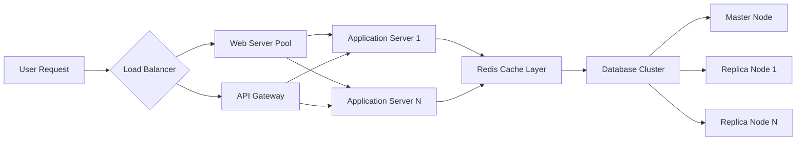

# Performance and Scalability Requirements for Reddit-like Community Platform

## Introduction

This document specifies the performance and scalability requirements for the Reddit-like community platform. Performance directly impacts user satisfaction, with slow-loading pages or frequent interruptions causing users to abandon the platform. Scalability ensures the system can handle growth from initial users to millions of daily active users while maintaining consistent performance.

The platform's growth model assumes:
- Starting with 1,000-5,000 daily active users
- Scaling to 50,000-100,000 daily active users within 2 years
- Potential for viral growth reaching 500,000+ users during peak periods

Performance requirements are specified in terms of user-perceived response times and system reliability. All requirements use EARS format for clarity and testability.

WHEN users experience page load times exceeding 3 seconds during normal usage, THE platform SHALL display a loading indicator to manage user expectations.
THE platform SHALL monitor and log performance metrics continuously to identify bottlenecks early.
IF response times degrade below specified thresholds, THE system SHALL alert administrators for immediate investigation.

## Response Time Expectations

### Core Requirements

WHEN a user requests the main page, THE system SHALL render the complete page content within 2 seconds under typical network conditions.
WHEN a user submits a post creation request, THE system SHALL process the submission and display confirmation within 3 seconds.
WHEN a user casts a vote on content, THE system SHALL update the vote display and karma calculation within 1 second.
WHEN a user loads a community page containing 50 posts, THE system SHALL deliver fully rendered content within 3 seconds.
WHEN a user initiates a search query, THE system SHALL return initial matching results within 2 seconds.

### Error Response Times

IF a user action requires processing exceeding 10 seconds, THEN THE system SHALL show a progress indicator and gracefully timeout at 30 seconds with clear error messaging.
WHEN database queries exceed 5 seconds execution time, THE system SHALL automatically optimize queries or implement additional caching layers.
WHEN system overload occurs, THE platform SHALL prioritize critical user actions (posting, voting, commenting) over background maintenance tasks.

### User Experience Expectations

WHEN the platform serves 10,000 concurrent users during peak hours, THE system SHALL maintain average response times under 2 seconds.
IF temporary slowdowns occur, THEN THE platform SHALL implement graceful degradation while maintaining service availability.
WHEN traffic spikes cause delays, THE system SHALL provide clear communication about expected resolution times.

## Concurrency Requirements

### Basic Concurrency

WHEN 100 users perform simultaneous read operations (browsing posts, viewing profiles), THE system SHALL maintain consistent response times without errors.
WHEN 50 users execute simultaneous write operations (creating posts, submitting comments), THE system SHALL handle all transactions successfully.
WHEN 200 concurrent users access the platform during peak business hours, THE system SHALL continue normal operations without service interruption.

### Peak Load Handling

WHEN sudden traffic spikes reach 500 concurrent users during viral events, THE system SHALL scale resources automatically to maintain performance.
IF concurrent user count exceeds 1,000 simultaneous connections, THEN THE platform SHALL implement intelligent rate limiting to protect system resources.
WHEN demand surpasses current capacity, THE system SHALL queue excess requests and process them according to priority levels.

### Session Management

WHEN 10,000 users maintain active sessions simultaneously, THE system SHALL perform without performance degradation.
WHEN users remain idle for more than 30 minutes, THE system SHALL transition their session to a low-resource consumption state.
WHEN session data becomes stale, THE system SHALL refresh session information transparently to users.

## Scalability Metrics

### User Growth Projections

WHEN user registrations increase by 20% monthly, THE system SHALL scale infrastructure automatically to maintain consistent performance.
WHEN the platform reaches 100,000 daily active users within 24 months, THE system SHALL operate without fundamental architectural changes.
WHEN viral growth events cause user numbers to spike to 500,000+ daily users, THE system SHALL maintain 99% uptime during the event period.

### Content Scalability

WHEN the platform accumulates 1 million total posts across all communities, THE system SHALL maintain sorting algorithm performance within acceptable limits.
WHEN individual communities reach 10,000 posts, THE system SHALL preserve efficient data retrieval and display capabilities.
WHEN comment threads grow to 5,000 nested replies per post, THE system SHALL maintain acceptable load times for thread navigation.

### Traffic Metrics

WHEN the platform handles 500,000 page views per hour during peak periods, THE system SHALL maintain sub-2-second average response times.
WHEN traffic volume doubles from baseline measurements, THE system SHALL complete automatic scaling within 10 minutes.
WHEN system capacity reaches 90% utilization during peak load, THE system SHALL maintain performance guarantees.

## Database Performance

### Query Performance

WHEN retrieving posts sorted by the "hot" algorithm, THE system SHALL complete database queries within 500 milliseconds.
WHEN accessing user profile information, THE system SHALL retrieve complete profile data within 200 milliseconds.
WHEN calculating karma score changes, THE system SHALL complete computational operations within 1 second.

### Write Operations

WHEN inserting new post records into the database, THE system SHALL complete write operations within 2 seconds.
WHEN processing 100 simultaneous post submissions, THE system SHALL handle all transactions without conflicts or data loss.
WHEN updating vote counts across multiple related tables, THE system SHALL perform atomic operations ensuring data consistency.

### Data Volume Handling

WHEN database size reaches 100 GB in total volume, THE system SHALL maintain consistent query performance standards.
WHEN individual database tables contain 1 million records, THE system SHALL implement automatic partitioning strategies.
WHEN read operations dominate system load, THE system SHALL deploy database replication for improved read performance.

## Caching Strategies

### User Session Caching

WHEN users authenticate successfully, THE system SHALL cache authentication tokens for instant session validation without database queries.
WHEN users repeatedly view their subscribed community feeds, THE system SHALL cache personalized content for 5 minutes to reduce database load.
WHEN user profile information updates occur, THE system SHALL invalidate associated cache entries within 30 seconds.

### Content Caching

WHEN posts receive high view counts, THE system SHALL cache complete post content and metadata for 10 minutes.
WHEN sorting algorithms request vote statistics, THE system SHALL cache calculated controversial scores for 1 hour.
WHEN serving static community assets like images and CSS files, THE system SHALL implement edge caching at CDN level.

### Algorithm Caching

WHEN computing "hot" post rankings, THE system SHALL cache intermediate calculation results for 15 minutes.
WHEN distributing cached data across multiple servers, THE system SHALL ensure data consistency through cache invalidation protocols.
WHEN cache misses occur during high traffic, THE system SHALL fallback to direct database queries without user-perceived impact.

## System Architecture Implications

The platform architecture supports horizontal scaling through:

WHEN increased user load demands additional capacity, THE system SHALL automatically add application servers to the pool without service disruption.
WHEN database performance becomes bottleneck, THE system SHALL add replica nodes to distribute read operations effectively.
WHEN cache layer requires expansion, THE system SHALL implement sharding strategies to maintain high availability.

## Monitoring and Alerting

### Performance Monitoring

WHEN average response times exceed 3 seconds across critical operations, THE system SHALL trigger automated alerts to operations team.
WHEN CPU utilization reaches 70% across application servers, THE system SHALL initiate automatic scaling procedures.
WHEN performance metrics indicate potential issues, THE system SHALL log detailed information for post-mortem analysis.

### Scalability Alerts

WHEN database connection pools reach 80% utilization, THE system SHALL alert administrators and prepare additional database resources.
WHEN cache hit rates drop below 85%, THE system SHALL investigate cache configuration and implement optimizations.
WHEN traffic patterns suggest imminent capacity limits, THE system SHALL proactively scale resources to prevent performance degradation.

## Conclusion and Success Metrics

### Critical Success Factors

THE platform SHALL achieve consistent sub-2-second response times for 95% of user interactions during normal operation.
THE system SHALL demonstrate linear scalability supporting 100,000+ concurrent users without architectural redesign.
THE platform SHALL maintain 99.9% uptime annually excluding planned maintenance windows.
THE system SHALL reduce database load by 80% through intelligent caching strategies.
THE platform SHALL support content growth to millions of posts while maintaining sorting algorithm efficiency.

These performance and scalability requirements ensure the Reddit-like community platform provides reliable, fast service to users while accommodating substantial growth. Backend developers should design systems that can scale from initial operation to enterprise-level traffic without requiring fundamental architectural changes.

Key success factors include:
- Consistent sub-2-second response times for user interactions
- Support for 100,000+ concurrent users
- 99% uptime with graceful degradation during peak loads
- Efficient database operations supporting millions of content items
- Intelligent caching reducing database load by 80%

### Future Considerations

WHEN mobile application development begins, THE system SHALL maintain performance parity between web and mobile platforms.
WHEN additional features increase complexity, THE system SHALL preserve current performance baselines.
WHEN global expansion occurs, THE system SHALL implement geographic content delivery optimizations.

> *Developer Note: This document defines **business requirements only**. All technical implementations (architecture, APIs, database design, etc.) are at the discretion of the development team.*