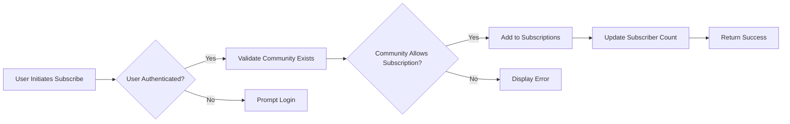
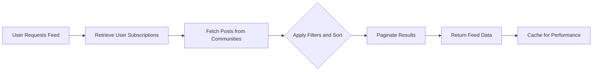
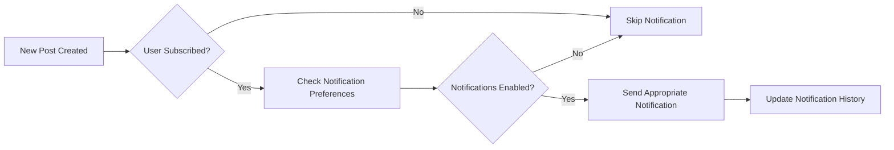

# Subscription System Requirements

## Executive Summary

This document specifies the business requirements for the subscription system in the Reddit-like community platform. The subscription system allows authenticated users to follow communities of interest, receive personalized content feeds, and manage their community participation. Key features include subscription mechanics, automated feed generation, notification preferences, and performance constraints to ensure scalability.

The subscription system is integral to user engagement, enabling personalized content discovery and fostering community participation. All requirements are specified in natural language with EARS format for clarity.

## Business Model Context

The subscription system supports the platform's growth strategy by:
- Increasing user retention through personalized content delivery
- Boosting engagement via community discovery and recommendation
- Providing monetization opportunities through premium subscription features
- Enhancing user experience to compete with established social platforms

Market analysis shows that personalized content feeds drive 70% of user interactions on similar platforms. Success metrics include subscription penetration rate (>60% of users), daily active feed views (100+ per user), and engagement time per session (15+ minutes).

## User Actors and Permissions

### Actor Overview

- **Guest**: Can view public community content but cannot subscribe or access personalized feeds
- **User**: Can subscribe to communities, manage feed preferences, and receive notifications
- **Admin**: Can monitor subscription analytics and manage system-wide features

### Permission Matrix

| Action | Guest | User | Admin |
|--------|-------|------|-------|
| Browse communities | ✅ | ✅ | ✅ |
| Subscribe to community | ❌ | ✅ | ✅ |
| View personalized feed | ❌ | ✅ | ✅ |
| Manage subscription settings | ❌ | ✅ | ✅ |
| Receive notifications | ❌ | ✅ | ✅ |
| Administer subscription data | ❌ | ❌ | ✅ |

## Subscription Mechanics

### Subscription Creation

WHEN a user discovers a community, THE system SHALL allow subscription through a single action.

WHEN a user clicks subscribe on a community, THE system SHALL add the community to user's subscription list.

WHEN a subscription is successful, THE system SHALL update the community subscriber count.

OVERALL PROCESS: WHEN a user subscribes to a community, THE system SHALL complete the action within 1 second and provide immediate visual feedback.

### Subscription Validation

WHEN a user attempts to subscribe, THE system SHALL verify user authentication.

WHEN subscription is requested, THE system SHALL validate community existence and public status.

IF the community is private or restricted, THEN THE system SHALL deny subscription with error message.

THE system SHALL prevent subscription to deleted or banned communities.

### Subscription Categories

THE system SHALL support public subscription for all communities.

WHERE premium communities exist, THE system SHALL require paid subscription for access.

WHEN a user subscribes to premium community, THE system SHALL validate payment status before enabling feed updates.

## Feed Generation

### Feed Algorithm Overview

THE system SHALL generate user feeds from subscribed communities only.

THE system SHALL prioritize content based on recency and community activity.

THE system SHALL include posts from all current subscriptions in chronological order by default.

WHEN generating feeds, THE system SHALL exclude content from unsubscribed communities.

### Feed Content Rules

THE system SHALL include text, link, and image posts in user feeds.

THE system SHALL respect community visibility settings in feed inclusion.

WHEN a post is created or updated in subscribed community, THE system SHALL immediately include it in relevant user feeds.

THE system SHALL exclude reported or moderated content from feeds until resolution.

WHEN displaying feeds, THE system SHALL show posts in descending chronological order from newest to oldest.

### Feed Sorting Options

THE system SHALL provide default chronological sorting (new first).

THE system SHALL allow users to sort feeds by hot, top, and controversial algorithms.

WHEN user selects hot sorting, THE system SHALL prioritize posts with high recent activity.

WHEN user selects top sorting, THE system SHALL order by lifetime total votes.

WHEN user selects controversial sorting, THE system SHALL highlight posts with balanced up/down ratios.

### Feed Pagination

THE system SHALL paginate feeds with 25 posts per page default.

THE system SHALL support infinite scroll for seamless browsing.

WHEN loading next page, THE system SHALL append content without duplicate posts.

THE system SHALL cache feed data for 5 minutes to reduce computation.

## Unsubscription Process

### Unsubscribe Mechanics

WHEN a user chooses to unsubscribe, THE system SHALL remove community from subscription list.

WHEN unsubscription occurs, THE system SHALL immediately remove community content from user's feed.

THE system SHALL update community subscriber count upon successful unsubscription.

### Unsubscription Confirmation

IF the user has notifications enabled, THEN THE system SHALL prompt for confirmation before unsubscription.

WHEN confirmed, THE system SHALL soft delete subscription for potential restore.

THE system SHALL allow unsubscription restoration within 7 days.

### Bulk Unsubscription

THE system SHALL allow users to unsubscribe from multiple communities simultaneously.

WHEN bulk action is processed, THE system SHALL fail gracefully on individual errors.

THE system SHALL provide progress feedback during bulk operations.

## Subscription Display

### User Dashboard

THE system SHALL display subscribed communities in user profile.

THE system SHALL list subscriptions alphabetically by community name.

WHEN user visits community they are subscribed to, THE system SHALL indicate active subscription.

### Subscription Management

THE system SHALL provide dedicated subscription management page.

THE system SHALL group subscriptions by category or activity level.

THE system SHALL show subscription date and recent activity for each community.

THE system SHALL allow easy unsubscribe action from management interface.

### Mobile Responsive Design

THE system SHALL render subscription lists optimally on all device sizes.

THE system SHALL support swipe-to-unsubscribe gestures on touch interfaces (business logic only).

## Notification Preferences

### Notification Types

THE system SHALL support new post notifications for subscribed communities.

THE system SHALL allow mentions and replies notifications across all feeds.

THE system SHALL provide community event notifications (new subscribers, changes).

### Preference Controls

WHEN a user subscribes to community, THE system SHALL prompt for notification preferences.

THE system SHALL allow granular control per community or global settings.

THE system SHALL support email, in-app, and push notification options.

### Notification Frequency

THE system SHALL provide real-time notifications for urgent content.

THE system SHALL batch notifications when high activity occurs.

THE system SHALL not exceed 3 notifications per hour per community.

WHEN notifications are batched, THE system SHALL send summary digests.

## Subscription Limits

### Per-User Limits

THE system SHALL allow up to 50 community subscriptions per user.

WHEN user attempts to exceed limit, THE system SHALL display warning.

THE system SHALL allow premium users larger subscription limits (100 communities).

### System Scale Constraints

THE system SHALL handle 100,000 concurrent subscriptions without performance degradation.

THE system SHALL support 1 million total subscriptions across all users.

THE system SHALL throttle subscription requests during peak load (100 requests/minute per user).

### Account-Based Limits

THE system SHALL limit subscriptions based on account verification status.

THE system SHALL suspend subscription capabilities for accounts under review.

THE system SHALL restore subscriptions after account reinstatement.

## Performance Requirements

### Response Times

WHEN a user subscribes to community, THE system SHALL complete the action within 1 second.

WHEN generating user feed, THE system SHALL return first 25 posts within 500 milliseconds.

WHEN sorting large feeds, THE system SHALL apply filters within 2 seconds.

### Scalability Targets

THE system SHALL support 10,000 concurrent users generating feeds.

THE system SHALL cache subscription data to reduce database load by 80%.

THE system SHALL optimize feed algorithms for O(n log n) complexity where n is post count.

### Bandwidth Efficiency

THE system SHALL compress feed data for mobile device delivery.

THE system SHALL implement content delivery networks for global access.

THE system SHALL prefetch popular community content for immediate loading.

## Error Handling and Edge Cases

### Network Scenarios

IF network connection fails during subscription, THEN THE system SHALL store offline action for retry.

WHEN retry occurs, THE system SHALL reconcile subscription status with server.

THE system SHALL handle concurrent subscription attempts gracefully.

### Data Consistency

WHEN community is deleted, THE system SHALL automatically remove from all subscriptions.

WHEN user account is suspended, THE system SHALL freeze subscription management.

THE system SHALL validate subscription integrity during feed generation.

### Race Conditions

WHEN multiple users subscribe simultaneously, THE system SHALL prevent subscriber count corruption.

WHEN feed updates occur during pagination, THE system SHALL maintain cursor consistency.

THE system SHALL handle timezone differences in subscription timestamps.

## Security Considerations

### Access Control

THE system SHALL validate authentication before any subscription operation.

THE system SHALL prevent unauthorized subscription to private communities.

THE system SHALL audit subscription changes for security monitoring.

### Data Protection

THE system SHALL encrypt subscription data in transit and at rest.

THE system SHALL comply with GDPR for subscription preference data.

THE system SHALL provide data export for user subscription history.

### Abuse Prevention

THE system SHALL detect and prevent subscription spam patterns.

THE system SHALL block automated subscription tools.

THE system SHALL implement rate limiting per IP address for subscription actions.

## Diagrams

### Subscription Workflow

### Feed Generation Process

### Notification Flow

This comprehensive specification provides the foundation for implementing a robust subscription system that enhances user experience and community engagement in the platform. All business requirements are clearly defined with performance and scalability considerations for backend developers.