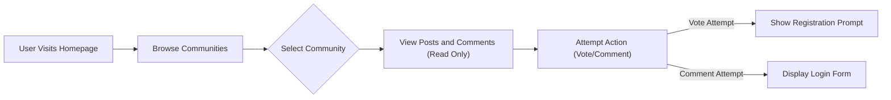
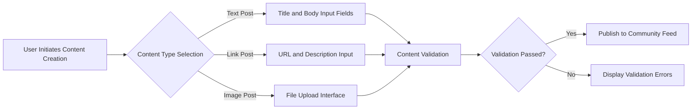

# User Stories and Scenarios for Community Platform

## Introduction

### Business Justification
The user profile system serves as a central hub for community platform users to showcase their contributions, track their karma, and manage their community presence. This feature enhances user engagement by creating personal identity within the platform, allowing users to build reputation through contributions and enabling social discovery of content creators. The profile system also provides administrative tools for content moderation, ensuring platform safety and compliance while maintaining user autonomy over their own profiles.

### Purpose and Scope
The platform serves three primary user roles defined in the system:
- **Guest**: Unauthenticated visitors who can browse communities, posts, and comments but cannot participate in creation or voting
- **User**: Authenticated members who can create communities, posts, and comments, vote on content, subscribe to communities, and manage their profiles
- **Admin**: System administrators who handle platform-wide moderation, user management, and system configuration

Each user story includes:
- **Scenario description**: Step-by-step journey in natural language
- **Acceptance criteria**: Specific conditions that must be met for the story to be considered complete
- **Business rules**: Key constraints in natural language
- **Edge cases**: Potential exceptions or error scenarios

## User Registration Stories

### Scenario: First-Time User Registration via Email
As a new visitor interested in participating in community discussions, WHEN I visit the platform homepage AND click "Register", THEN the system SHALL guide me through secure account creation.

**Journey Steps:**
1. The user visits the platform homepage and clicks "Register" or "Sign Up"
2. The user provides an email address, password, and username
3. The system validates the input (email format, password strength, unique username)
4. The system sends a verification email with a confirmation link
5. The user clicks the link in the email to activate their account
6. Upon activation, the user is logged in and redirected to their profile setup page

**Acceptance Criteria:**
- Email must be unique across the platform
- Password must be at least 8 characters with mixed case, numbers, and special characters
- Username must be between 3-20 characters, no spaces, and unique
- Verification email must arrive within 5 minutes
- Account activation succeeds only if the link is clicked within 24 hours

**Business Rules:**
- Users under 13 cannot register due to age restrictions
- Duplicate email or username attempts result in clear error messages
- Email verification prevents bot registrations

### Scenario: Guest Browsing Without Registration
As a curious visitor who wants to explore content without committing to an account, WHEN I browse the platform, THEN I SHALL be able to view public communities and posts without restrictions.

**Journey Steps:**
1. The user lands on the homepage without logging in
2. The user browses a list of featured communities by scrolling or searching
3. The user clicks into a community to view recent posts
4. The user reads posts and comments without voting or replying options

**Acceptance Criteria:**
- All content must load within 2 seconds on standard internet connections
- Voting buttons are disabled or hidden for guests
- A prominent "Register to participate" prompt appears on action attempts

**Edge Cases:**
- If the user attempts to vote, show a modal directing to registration
- Handle cases where private communities are inaccessible to guests
- Network timeouts show cached content with offline indicators

## Community Creation Scenarios

### Scenario: User Creates a New Community
As an authenticated user passionate about a topic, WHEN I want to create a dedicated community, THEN the system SHALL allow me to establish it with appropriate controls.

**Journey Steps:**
1. Logged-in user navigates to the communities page and clicks "Create Community"
2. User enters community name, description, and selects category/subcategory
3. System validates for duplicate community names and appropriate content
4. User sets visibility to public or private with membership rules
5. Community is created, and the user becomes the community owner
6. User is redirected to the new community's page with an invitation to post

**Acceptance Criteria:**
- Community name must be unique and 3-50 characters
- Description limited to 1000 characters
- Creation process completes within 3 seconds
- Owner automatically subscribed and granted full privileges

**Business Rules:**
- Inappropriate community names are rejected based on content filters
- Users can create up to 5 communities per month to prevent spam
- Private community creation requires additional verification

### Scenario: Admin Promotes a Community as Featured
As an admin overseeing platform growth, WHEN I review community metrics, THEN I SHALL be able to highlight high-quality communities for increased visibility.

**Journey Steps:**
1. Admin accesses the community management dashboard
2. Admin reviews community metrics (member count, post activity)
3. Admin selects eligible communities and marks them as featured
4. Featured communities appear in homepage recommendations for all users

**Acceptance Criteria:**
- Only communities with at least 10 posts and 50 members qualify
- Featured status updated in real-time
- Admin receives confirmation notification upon action

**Edge Cases:**
- If a featured community becomes inactive, admin review triggers removal
- Multiple admins cannot simultaneously modify the same community's featured status

## Content Creation Journeys

### Scenario: User Posting a Text-Based Discussion
As a user with a thought-provoking question, WHEN I want to start a conversation, THEN the system SHALL allow me to create engaging text posts.

**Journey Steps:**
1. User selects a community and clicks "New Post"
2. User chooses "Text" post type and enters title and body content
3. System previews the post formatting
4. User submits, and post appears instantly in the community feed
5. Other users can now view, vote, and comment

**Acceptance Criteria:**
- Title limited to 300 characters, body to 40,000 characters
- No external links if marked as "text only" community
- Post editing allowed within 15 minutes of creation
- Instant publishing with YouTube-like popularity sorting

**Business Rules:**
- Profane language triggers auto-flagging for review
- Cross-posting to multiple communities requires additional confirmation
- Text posts must have minimum meaningful content to publish

### Scenario: User Sharing a Link Post with Description
As a user discovering an interesting article, WHEN I want to share external content, THEN the system SHALL facilitate link sharing with rich previews.

**Journey Steps:**
1. User navigates to "New Post" and selects "Link" type
2. User pastes the URL and adds optional title and description
3. System validates URL format and attempts to fetch metadata (image, title)
4. Post is created with link preview card
5. Community moderators can approve or remove if rules violated

**Acceptance Criteria:**
- URL must be valid and non-malicious
- Duplicate links in the same community prompt "repost" warning
- Posting succeeds even if metadata fetch fails

**Edge Cases:**
- Broken links handled gracefully with user notification
- Image-heavy links result in thumbnail generation
- Malicious URLs automatically blocked and flagged

### Scenario: User Uploading an Image Post
As a user wanting to share a photo or meme, WHEN I upload visual content, THEN the system SHALL provide secure image posting capabilities.

**Journey Steps:**
1. User chooses "Image" post type and selects file from device
2. System validates file type (JPEG/PNG/GIF) and size (under 10MB)
3. User adds optional caption or title
4. Post is uploaded with image compression for web display
5. Community feed shows image thumbnail with click-to-enlarge

**Acceptance Criteria:**
- Upload completes within 10 seconds on fast connections
- Unsupported formats show immediate error
- Adult content flagged automatically for moderation

**Business Rules:**
- Images must not exceed 2048x2048 pixels
- Copyright-infringing content removed upon report
- Image upload rate limited to prevent abuse

## Voting and Interactivity

### Scenario: User Upvoting a Hot Post
As a user enjoying a viral post, WHEN I express approval, THEN the system SHALL record my vote and update content ranking.

**Journey Steps:**
1. User views a post in the community feed
2. User clicks the upvote arrow above the post
3. System updates the post score immediately (+1 point)
4. User's vote history is stored for karma calculation
5. Post position in "hot" algorithm improves

**Acceptance Criteria:**
- Vote registered instantly with visual feedback (arrow color change)
- Users can change vote but not remove it (like Reddit)
- Vote impacts post karma but not user's karma directly

**Business Rules:**
- Users cannot vote on their own posts
- Rate limiting prevents rapid-fire voting (max 100 votes/hour)
- Vote anonymity maintained except for moderation audits

### Scenario: User Engaging in Nested Comment Conversation
As a user interested in a discussion, WHEN I reply to comments, THEN the system SHALL build threaded conversations with proper hierarchy.

**Journey Steps:**
1. User reads a post and its comments
2. User clicks "Reply" under a specific comment
3. User types response with optional markdown
4. Reply appears directly under the parent comment, indented
5. Thread continues with further nested replies up to 10 levels

**Acceptance Criteria:**
- Comments display in chronological order within threads
- Replies load dynamically without page refresh
- Mentions (@username) create notifications

**Edge Cases:**
- Deleting a parent comment orphans replies (handled with "deleted comment" text)
- Comment spam triggers temporary posting restrictions
- Deep nesting collapses after level 5 with "show more" options

## Moderation Workflows

### Scenario: User Reporting Inappropriate Content
As a user encountering offensive material, WHEN I report content, THEN the system SHALL provide anonymous reporting with follow-up options.

**Journey Steps:**
1. User views flagged content (post or comment)
2. User clicks "Report" and selects category (spam, harassment, etc.)
3. Report is submitted anonymously to community moderators
4. Moderators receive notification in their dashboard
5. If approved, content is removed and user gets a warning

**Acceptance Criteria:**
- Report submitted without page refresh
- Reporter sees confirmation: "Report sent for review"
- Anonymous reports prevent retaliation

**Business Rules:**
- False reports are reviewed to avoid user bans
- Escalation to platform admins for severe violations
- Report categories limited to predefined options

### Scenario: Admin Banning a Disruptive User
As an admin maintaining platform health, WHEN I identify violations, THEN I SHALL be able to ban users with appropriate notifications.

**Journey Steps:**
1. Admin reviews user reports in the admin portal
2. Admin examines user's activity history and violation pattern
3. Admin issues a ban with reason and duration
4. User receives email notification of ban
5. Banned user's posts are hidden, and they cannot log in

**Acceptance Criteria:**
- Ban effective immediately upon action
- Appeal process available within 7 days
- Ban logging for audit purposes

**Edge Cases:**
- Banned users attempting login show error message redirecting to appeal form
- Partial bans (posting only) available for less severe violations
- Ban reversals require admin approval

## Edge Cases and Error Scenarios

### Scenario: Network Timeout During Post Submission
As a user posting content, WHEN network issues occur, THEN the system SHALL preserve my work and provide retry options.

**Journey Steps:**
1. User types a post and clicks "Submit"
2. Network disconnects mid-submission
3. System detects error and shows "Save Draft" option
4. Upon reconnection, user can resume from draft
5. Submission retries automatically when connection restores

**Acceptance Criteria:**
- Drafts auto-save every 30 seconds
- Submission retries automatically when connection restores
- Clear error message: "Post not submitted due to network issues. Save as draft?"

**Business Rules:**
- Draft retention limited to 30 days
- Multiple failed submissions show throttling warnings

### Scenario: Attempting to Vote Multiple Times
As a malicious user trying to game the system, WHEN I attempt rapid voting, THEN the platform SHALL rate-limit me to maintain fair scoring.

**Journey Steps:**
1. User clicks upvote repeatedly on multiple posts
2. After 50 votes per minute, system blocks further votes
3. User sees message: "Voting temporarily restricted for quality control"
4. Restriction lifts after 10 minutes
5. User can appeal restrictions through support

**Acceptance Criteria:**
- Rate limit enforced at user level with CAPTCHA for appeals
- Alternative content discovery suggested during restriction
- Restriction duration based on violation severity

**Business Rules:**
- Permanent voting bans available for confirmed vote manipulation
- Rate limit thresholds configurable by platform admins

### Scenario: Community Owner Deleting a Community
As a community owner no longer interested, WHEN I delete my community, THEN the system SHALL warn about consequences and facilitate proper closure.

**Journey Steps:**
1. Owner navigates to community settings and clicks "Delete Community"
2. System shows confirmation dialog with transfer option
3. If confirmed, community marked as deleted, posts archived
4. Owner receives final summary of moderation decisions
5. Subscribers notified of community closure

**Acceptance Criteria:**
- Deletion irreversible after 7-day grace period
- User karma unaffected by deletion
- All community data archived for compliance

**Edge Cases:**
- Community with active moderation cases requires admin approval
- Large communities (>1000 members) require additional verification
- Transfer to another user preserves subscriber count

## Conclusion

These user stories cover the core interactions of the community platform, from registration to advanced moderation, ensuring all user roles are supported. By following these scenarios, product managers can validate features against real user needs, with acceptance criteria providing measurable success points. The platform's success depends on seamless journeys that encourage engagement while maintaining safety through moderation.

Each scenario includes detailed journey steps, acceptance criteria for verification, business rules for constraints, and edge cases for robustness. The stories cover all major user flows including discovery, participation, moderation, and community management.

For additional technical requirements, refer to the [User Actors Document](./03-user-actors.md) for permission structures and authentication details.