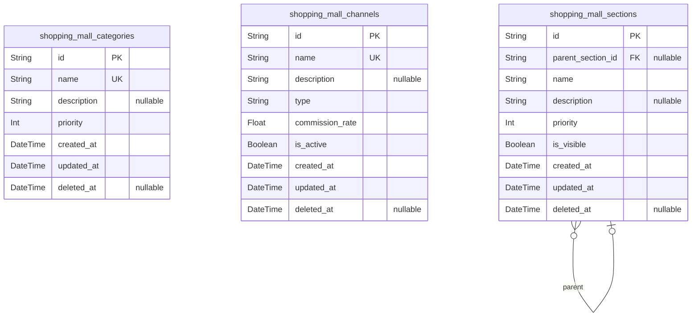
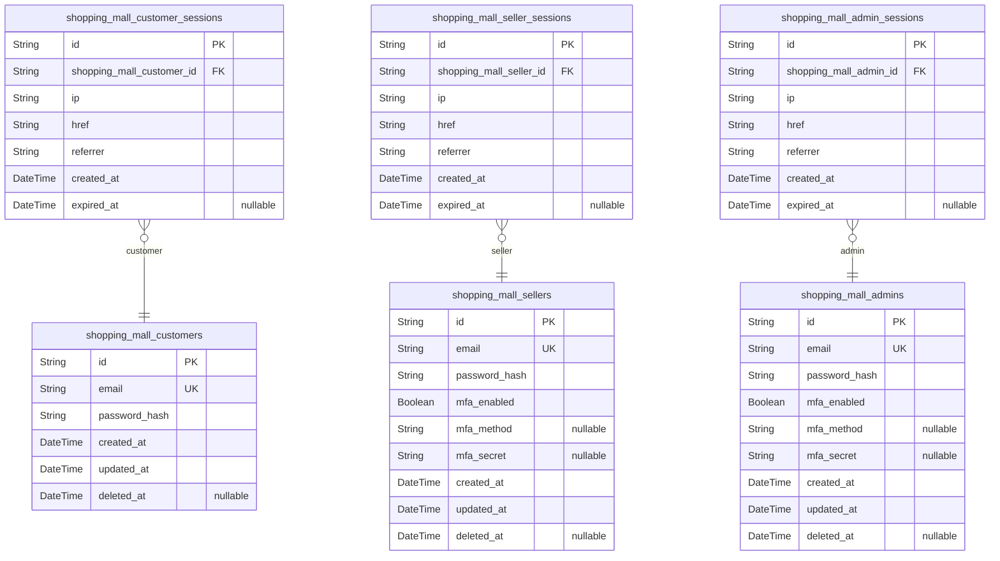
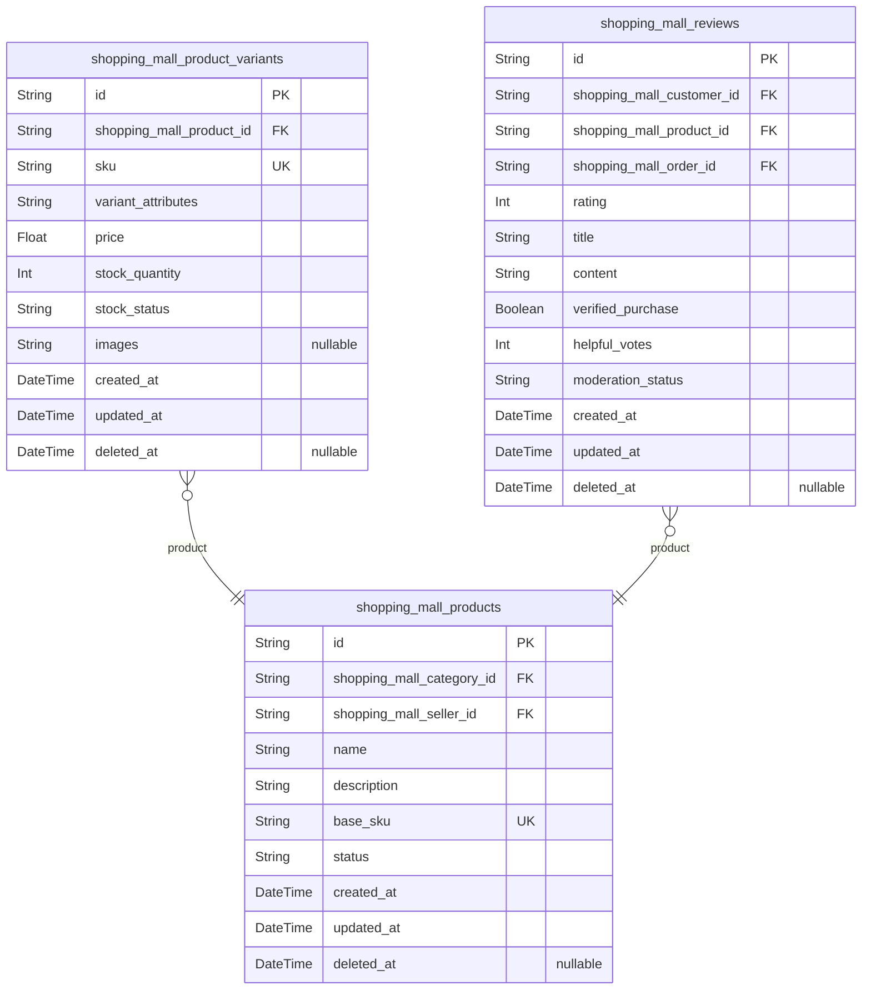
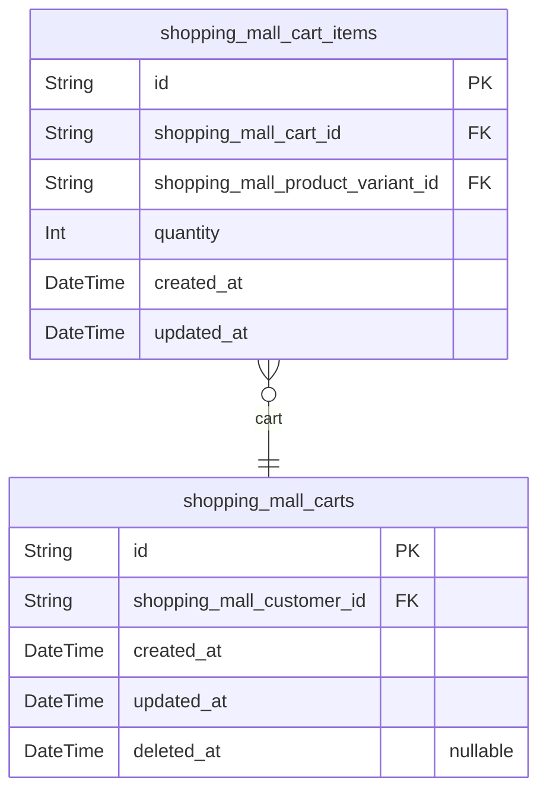
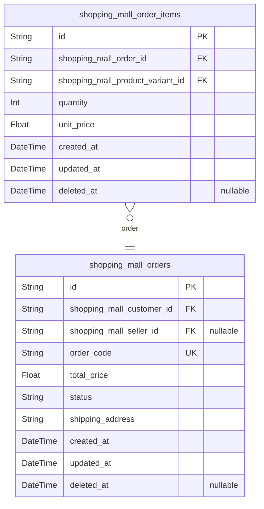
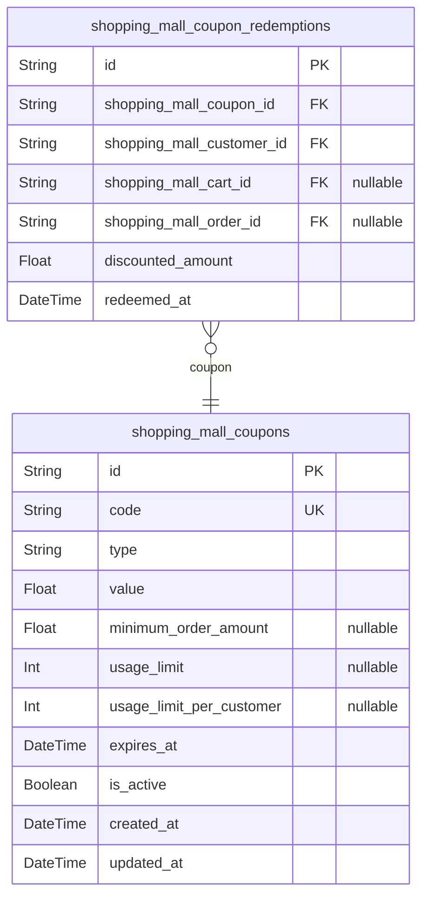
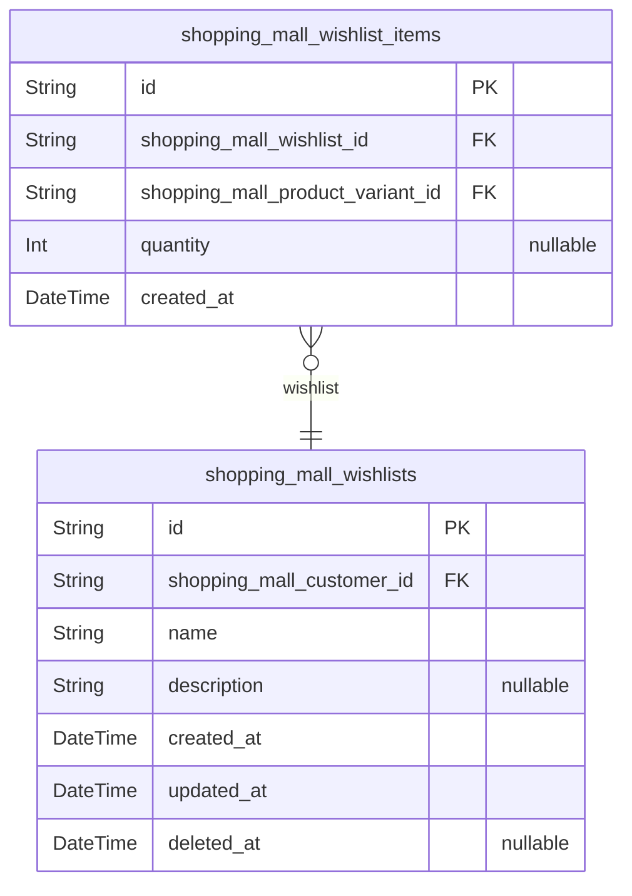
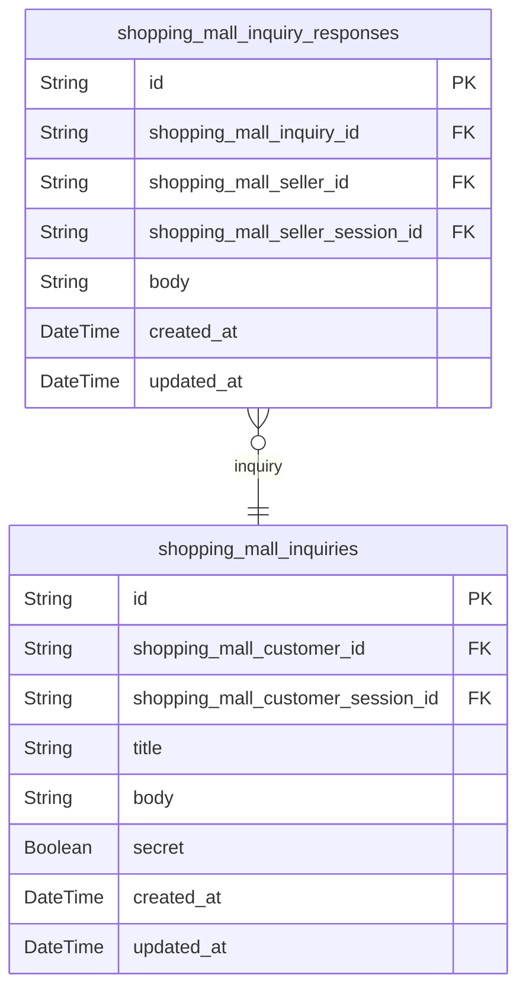

# Prisma Markdown

> Generated by [`prisma-markdown`](https://github.com/samchon/prisma-markdown)

- [Systematic](#systematic)
- [Actors](#actors)
- [Sales](#sales)
- [Carts](#carts)
- [Orders](#orders)
- [Coupons](#coupons)
- [Favorites](#favorites)
- [Inquiries](#inquiries)

## Systematic

```mermaid
erDiagram
"shopping_mall_categories" {
  String id PK
  String name UK
  String description "nullable"
  Int priority
  DateTime created_at
  DateTime updated_at
  DateTime deleted_at "nullable"
}
"shopping_mall_channels" {
  String id PK
  String name UK
  String description "nullable"
  String type
  Float commission_rate
  Boolean is_active
  DateTime created_at
  DateTime updated_at
  DateTime deleted_at "nullable"
}
"shopping_mall_sections" {
  String id PK
  String parent_section_id FK "nullable"
  String name
  String description "nullable"
  Int priority
  Boolean is_visible
  DateTime created_at
  DateTime updated_at
  DateTime deleted_at "nullable"
}
"shopping_mall_sections" }o--o| "shopping_mall_sections" : parent
```

### `shopping_mall_categories`

Product categories for organizing items in the shopping mall. Each
category represents a classification group that products can belong to,
supporting hierarchical organization with multilingual support.
Categories help customers navigate products efficiently and enable
targeted promotions. Derived from systematic component, this table serves
as a reference for product listings across all sellers.

Properties as follows:

- `id`: Primary Key.
- `name`: Category name used for navigation and display.
- `description`: Detailed category description explaining the types of products included.
- `priority`: Display order priority for category listing, lower numbers appear first.
- `created_at`: Timestamp when the category was created.
- `updated_at`: Timestamp when the category was last modified.
- `deleted_at`: Soft delete timestamp, null if not deleted.

### `shopping_mall_channels`

Sales channels representing different methods of product distribution
within the shopping mall platform. Channels allow sellers to offer
products through various strategies like direct online sales,
marketplace, or wholesale channels. Each channel maintains separate
pricing and terms, supporting flexible business models.

Properties as follows:

- `id`: Primary Key.
- `name`: Channel name identifier for display and reference.
- `description`: Detailed description of the channel's business model and terms.
- `type`: Channel type classification (online, offline, wholesale, etc.).
- `commission_rate`: Platform commission percentage applied to sales in this channel.
- `is_active`: Whether this channel is currently operational.
- `created_at`: Timestamp when the channel was created.
- `updated_at`: Timestamp when the channel was last modified.
- `deleted_at`: Soft delete timestamp, null if not deleted.

### `shopping_mall_sections`

Platform sections defining different areas or departments within the
shopping mall. Sections organize the platform into logical divisions,
supporting hierarchical structures with parent-child relationships. This
enables complex navigation patterns and specialized marketplace areas.

The hierarchical design allows for unlimited nesting levels, enabling
complex organizational structures. Each section can contain sub-sections,
creating a tree-like navigation system. Priority fields enable custom
ordering within each level of the hierarchy.

Visibility controls determine which sections are publicly accessible,
supporting phased rollouts or maintenance modes. Soft deletion preserves
historical navigation patterns while removing outdated sections.

Properties as follows:

- `id`: Primary Key.
- `parent_section_id`
  > Parent section for hierarchical organization. References
  > shopping_mall_sections.id to create hierarchical relationships.
- `name`
  > Section name for navigation and display. Must be unique within the same
  > parent level, but can repeat across different hierarchy branches.
- `description`
  > Detailed explanation of the section's purpose and contents. Helps users
  > understand what to expect from this section.
- `priority`
  > Display order within parent section, lower numbers appear first. Enables
  > custom ordering that respects hierarchical structure.
- `is_visible`
  > Whether this section is publicly visible in navigation. Allows hidden
  > sections for setup or maintenance.
- `created_at`
  > Timestamp when the section was created. Tracks when navigation structure
  > was established.
- `updated_at`
  > Timestamp when the section was last modified. Monitors changes to
  > navigation structure.
- `deleted_at`
  > Soft delete timestamp, null if not deleted. Preserves navigation history
  > while hiding outdated sections.

## Actors

```mermaid
erDiagram
"shopping_mall_customers" {
  String id PK
  String email UK
  String password_hash
  DateTime created_at
  DateTime updated_at
  DateTime deleted_at "nullable"
}
"shopping_mall_customer_sessions" {
  String id PK
  String shopping_mall_customer_id FK
  String ip
  String href
  String referrer
  DateTime created_at
  DateTime expired_at "nullable"
}
"shopping_mall_sellers" {
  String id PK
  String email UK
  String password_hash
  Boolean mfa_enabled
  String mfa_method "nullable"
  String mfa_secret "nullable"
  DateTime created_at
  DateTime updated_at
  DateTime deleted_at "nullable"
}
"shopping_mall_seller_sessions" {
  String id PK
  String shopping_mall_seller_id FK
  String ip
  String href
  String referrer
  DateTime created_at
  DateTime expired_at "nullable"
}
"shopping_mall_admins" {
  String id PK
  String email UK
  String password_hash
  Boolean mfa_enabled
  String mfa_method "nullable"
  String mfa_secret "nullable"
  DateTime created_at
  DateTime updated_at
  DateTime deleted_at "nullable"
}
"shopping_mall_admin_sessions" {
  String id PK
  String shopping_mall_admin_id FK
  String ip
  String href
  String referrer
  DateTime created_at
  DateTime expired_at "nullable"
}
"shopping_mall_customer_sessions" }o--|| "shopping_mall_customers" : customer
"shopping_mall_seller_sessions" }o--|| "shopping_mall_sellers" : seller
"shopping_mall_admin_sessions" }o--|| "shopping_mall_admins" : admin
```

### `shopping_mall_customers`

Customer accounts representing users who browse and purchase products on
the shopping mall platform.

Customers are the primary purchasing actors who register accounts to
complete orders, track purchases, and manage their preferences. Each
customer maintains authentication credentials and can create multiple
shipping addresses. The customer entity serves as the central user
identity for all ordering and shopping activities.

Customers can independently create accounts without seller or admin
involvement, manage their personal information, and access complete order
history. This table establishes the foundation for personalized shopping
experiences and customer relationship management.

Properties as follows:

- `id`: Primary Key.
- `email`
  > Email address used for customer registration and authentication. This
  > serves as the unique identifier for login and receives transactional
  > notifications, order confirmations, and password recovery emails. The
  > address must follow standard email format and is used for all customer
  > communications.
- `password_hash`
  > Hashed version of customer password for secure authentication. Password
  > must be at least 8 characters with complex requirements. Used during
  > login to verify user identity and should never be stored in plain text.
- `created_at`
  > Timestamp when customer account was first registered. Used for account
  > age tracking and audit purposes, displaying join date in user profile.
- `updated_at`
  > Timestamp of last customer profile modification. Tracks account
  > maintenance activities and profile updates for data integrity.
- `deleted_at`
  > Soft delete timestamp for customer accounts. Allows preserving historical
  > order data while preventing new logins and purchases. Customers can be
  > restored within data retention policies.

### `shopping_mall_customer_sessions`

Authentication sessions tracking customer device access and login
activities for security monitoring.

Customer sessions record each login instance with device information,
access timestamps, and IP tracking for security auditing and account
activity monitoring. These sessions enable persistent authentication
while tracking user engagement patterns.

Sessions capture connection context at login time, including IP addresses
and referrer URLs, supporting fraud detection and security
investigations. Each customer can maintain multiple concurrent sessions
across different devices and browsers.

Sessions expire automatically after extended periods of inactivity to
ensure account security, requiring re-authentication for continued
access.

Properties as follows:

- `id`: Primary Key.
- `shopping_mall_customer_id`
  > Target shopping_mall_customers.id identifier for the authenticated
  > customer session.
- `ip`
  > IP address used by the customer device during authentication. Enables
  > geographic and security analysis, tracking login locations and detecting
  > suspicious access patterns.
- `href`
  > URL accessed by customer during connection initiation, typically the
  > login page or checkout process. Useful for tracking user journey and
  > authorization context.
- `referrer`
  > HTTP referrer header from the customer's browser, indicating the page
  > that linked to the login process. Helps understand user navigation
  > patterns and potential security issues.
- `created_at`
  > Timestamp when customer session was established through successful
  > authentication. Marks the start of authenticated activity tracking.
- `expired_at`
  > Timestamp when customer session naturally expired or was terminated. Used
  > for session lifecycle management and activity reporting.

### `shopping_mall_sellers`

Seller accounts representing merchants who list and manage products on
the shopping mall platform.

Sellers are independent merchants with their own product catalogs,
inventory management, and order fulfillment responsibilities. Each seller
maintains authentication credentials including multi-factor
authentication for enhanced security. Sellers independently create
accounts, establish business profiles, and operate their marketplace
presence.

Sellers handle product pricing, inventory tracking, and customer service
for their listings. This table supports the core business model of
connecting sellers with customers in a scalable marketplace.

Seller accounts enable commission-based revenue sharing while providing
sellers with comprehensive authentication security including mandatory
MFA requirements.

Properties as follows:

- `id`: Primary Key.
- `email`
  > Email address used for seller registration and authentication. Serves as
  > the unique identifier for login and receives critical notifications about
  > orders, inventory alerts, and platform updates. Must be a business email
  > for verification purposes.
- `password_hash`
  > Hashed version of seller password for secure authentication. Password
  > must meet complexity requirements including minimum length and character
  > variety. Critical for protecting merchant account access and business
  > data.
- `mfa_enabled`
  > Whether multi-factor authentication is activated for this seller account.
  > Required by security policy to be enabled for all seller accounts to
  > protect business operations and customer data.
- `mfa_method`
  > The multi-factor authentication method configured for this seller
  > account. Valid values: 'sms' for SMS verification, 'email' for additional
  > email verification, 'app' for authenticator app integration. Required
  > when MFA is enabled.
- `mfa_secret`
  > Secret key used for authenticator app-based MFA integration. Stored
  > securely and used to verify time-based one-time passwords. Only populated
  > when mfa_method is 'app'.
- `created_at`
  > Timestamp when seller account was first registered and approved. Used for
  > seller onboarding tracking and establishing account seniority in
  > performance reporting.
- `updated_at`
  > Timestamp of last seller profile or settings modification. Tracks account
  > maintenance and business profile updates for audit and compliance
  > purposes.
- `deleted_at`
  > Soft delete timestamp for seller accounts. Preserves historical product
  > and order data while preventing new listings and access. Supports seller
  > re-enrollment if affairs are resolved.

### `shopping_mall_seller_sessions`

Authentication sessions tracking seller device access and login
activities for business account monitoring.

Seller sessions record each login instance with device information and
access tracking for security auditing and business activity monitoring.
These sessions support multi-device access for merchants managing their
online business.

Sessions capture connection context including IP addresses and access
URLs, enabling security monitoring and fraud prevention for seller
accounts. Multiple concurrent sessions allow sellers to manage their
business from different devices.

Sessions provide audit trails for business activities and help monitor
seller engagement with the marketplace platform.

Properties as follows:

- `id`: Primary Key.
- `shopping_mall_seller_id`
  > Target shopping_mall_sellers.id identifier for the authenticated seller
  > session.
- `ip`
  > IP address used by the seller device during authentication. Supports
  > geographic analysis and detection of unauthorized access to business
  > accounts.
- `href`
  > URL accessed by seller during connection initiation, typically dashboard
  > or inventory management pages. Tracks business activity entry points.
- `referrer`
  > HTTP referrer header indicating the source page that led to seller
  > authentication. Helps understand seller workflow and navigation patterns.
- `created_at`
  > Timestamp when seller session was established through successful
  > authentication. Marks the beginning of business activity auditing period.
- `expired_at`
  > Timestamp when seller session was terminated through logout or automatic
  > expiration. Supports session lifecycle reporting and security monitoring.

### `shopping_mall_admins`

Administrator accounts representing platform operators who oversee and
manage the shopping mall ecosystem.

Administrators are platform operators responsible for system integrity,
user support, and operational management. They maintain authentication
credentials including multi-factor authentication for enhanced security.
Admins independently manage their operator accounts, handle user
disputes, moderate content, and monitor platform performance.

Admins ensure fair marketplace practices and technical operations while
maintaining audit trails for all administrative actions.

Properties as follows:

- `id`: Primary Key.
- `email`
  > Email address used for admin registration and authentication. Serves as
  > the unique identifier for login and receives critical system alerts, user
  > escalations, and platform maintenance notifications.
- `password_hash`
  > Hashed version of admin password for secure authentication. Requires
  > enhanced complexity for high-privilege accounts with regular password
  > rotation policies.
- `mfa_enabled`
  > Whether multi-factor authentication is activated for this admin account.
  > Required by security policy to be enabled for all administrator accounts
  > to protect platform operations and sensitive data access.
- `mfa_method`
  > The multi-factor authentication method configured for this admin account.
  > Valid values: 'sms' for SMS verification, 'email' for additional email
  > verification, 'app' for authenticator app integration. Required when MFA
  > is enabled.
- `mfa_secret`
  > Secret key used for authenticator app-based MFA integration. Stored
  > securely and used to verify time-based one-time passwords. Only populated
  > when mfa_method is 'app'.
- `created_at`
  > Timestamp when admin account was first created and authorized. Used for
  > access privilege tracking and administrative role assignments.
- `updated_at`
  > Timestamp of last admin profile or permission modification. Tracks
  > administrative account maintenance and access right changes.
- `deleted_at`
  > Soft delete timestamp for admin accounts. Preserves administrative action
  > history while revoking access permissions. Supports account deactivation
  > for compliance purposes.

### `shopping_mall_admin_sessions`

Authentication sessions tracking administrator device access and login
activities for platform security monitoring.

Admin sessions record each login instance with detailed tracking for
security auditing and access control monitoring. These sessions support
privileged account usage with enhanced security requirements.

Sessions capture comprehensive connection context including IP addresses
and access patterns, enabling security monitoring and compliance
reporting for administrative activities. Multiple sessions allow
operators to manage different aspects of the platform.

Sessions provide audit trails for all administrative actions and help
maintain accountability for platform modifications and user management
decisions.

Properties as follows:

- `id`: Primary Key.
- `shopping_mall_admin_id`
  > Target shopping_mall_admins.id identifier for the authenticated admin
  > session.
- `ip`
  > IP address used by the admin device during authentication. Enables
  > geographic tracking and enhances security analysis for privileged account
  > access.
- `href`
  > URL accessed by admin during connection initiation, typically platform
  > management or user administration pages. Tracks entry points for auditing
  > purposes.
- `referrer`
  > HTTP referrer header indicating the source that led to admin
  > authentication. Supports workflow tracking and security monitoring.
- `created_at`
  > Timestamp when admin session was established through successful
  > authentication. Marks the beginning of administrative activity audit
  > period.
- `expired_at`
  > Timestamp when admin session was terminated through logout or automatic
  > expiration. Supports security monitoring and session accountability.

## Sales

```mermaid
erDiagram
"shopping_mall_products" {
  String id PK
  String shopping_mall_category_id FK
  String shopping_mall_seller_id FK
  String name
  String description
  String base_sku UK
  String status
  DateTime created_at
  DateTime updated_at
  DateTime deleted_at "nullable"
}
"shopping_mall_product_variants" {
  String id PK
  String shopping_mall_product_id FK
  String sku UK
  String variant_attributes
  Float price
  Int stock_quantity
  String stock_status
  String images "nullable"
  DateTime created_at
  DateTime updated_at
  DateTime deleted_at "nullable"
}
"shopping_mall_reviews" {
  String id PK
  String shopping_mall_customer_id FK
  String shopping_mall_product_id FK
  String shopping_mall_order_id FK
  Int rating
  String title
  String content
  Boolean verified_purchase
  Int helpful_votes
  String moderation_status
  DateTime created_at
  DateTime updated_at
  DateTime deleted_at "nullable"
}
"shopping_mall_product_variants" }o--|| "shopping_mall_products" : product
"shopping_mall_reviews" }o--|| "shopping_mall_products" : product
```

### `shopping_mall_products`

Core product catalog entries representing items available for purchase on
the shopping mall platform.

Stores complete product information including basic metadata,
categorization, and seller association. Each product serves as the parent
entity for multiple variants that represent different configurations like
sizes, colors, or styles. The product table maintains business integrity
without embedding pricing or inventory data, which is properly normalized
into the variants table.

Products are searchable and browsable independently, supporting primary
stance with full CRUD API endpoints for seller management. The product
description serves as the foundation for detailed product presentations,
while variants handle specific purchasing options.

Key relationships include categorization through the category foreign key
and seller ownership through the seller association. Soft deletion is
supported to maintain referential integrity while allowing product
retirement.

Properties as follows:

- `id`: Primary Key.
- `shopping_mall_category_id`
  > Category classification for the product. {@link
  > shopping_mall_categories.id}
- `shopping_mall_seller_id`
  > Associated seller who manages this product. {@link
  > shopping_mall_sellers.id}
- `name`
  > Product name/title displayed in catalog and search results. Must be
  > unique within seller's catalog to prevent confusion.
- `description`
  > Detailed product description providing comprehensive information about
  > features, specifications, and usage. Supports rich text formatting for
  > enhanced presentation.
- `base_sku`
  > Base SKU identifier for the product, used as prefix for variant SKUs.
  > Helps track product families while ensuring unique identification.
- `status`
  > Product availability status. Valid values: active, inactive,
  > discontinued. Controls whether product appears in search and browsing
  > interfaces.
- `created_at`
  > Timestamp when the product was first created in the system. Essential for
  > audit trails and chronological sorting.
- `updated_at`
  > Timestamp of the last modification to product information. Supports
  > caching invalidation and change tracking.
- `deleted_at`
  > Soft deletion timestamp to maintain product references while removing
  > from active catalog. Allows recovery and maintains historical orders.

### `shopping_mall_product_variants`

Product variant configurations that extend base products with specific
purchasing options.

Provides granular control over product variations including different
sizes, colors, styles, and material options. Each variant contains
individual pricing and inventory management, supporting precise
e-commerce operations without denormalizing data into the parent product
table. This separate table maintains strict 3NF compliance while enabling
flexible product catalog management.

Variants are managed through parent product relationships with subsidiary
stance, meaning they are created and updated via product management APIs.
Each variant represents a distinct SKU that customers can select during
the purchase process, with independent stock levels and pricing.

The table supports multiple attribute dimensions to handle complex
product variations while maintaining data integrity. Foreign keys ensure
variants are properly associated with their parent products.

Properties as follows:

- `id`: Primary Key.
- `shopping_mall_product_id`: Parent product this variant belongs to. [shopping_mall_products.id](#shopping_mall_products)
- `sku`
  > Unique SKU identifier for this specific variant, combining parent product
  > SKU with variant attributes. Used for inventory tracking and order
  > processing.
- `variant_attributes`
  > JSON-formatted variant specifications like size, color, or style
  > combinations. Enables flexible product configurations while maintaining
  > structured data integrity.
- `price`
  > Specific price point for this variant in decimal format. Supports
  > different pricing strategies across variant combinations while
  > maintaining precision.
- `stock_quantity`
  > Available inventory units for this specific variant. Must be maintained
  > accurately to prevent overselling during concurrent purchases.
- `stock_status`
  > Current availability status for the variant. Valid values: in_stock,
  > low_stock, out_of_stock. Automatically calculated based on stock_quantity
  > thresholds.
- `images`
  > JSON array of image URLs specific to this variant configuration. Supports
  > multiple images for different variant appearances.
- `created_at`
  > Timestamp when the variant was first created. Supports audit trails and
  > chronological variant management.
- `updated_at`
  > Timestamp of the last modification to variant information. Essential for
  > stock level change tracking and price updates.
- `deleted_at`
  > Soft deletion timestamp for variant retirement while maintaining
  > historical order references. Allows variant lifecycle management.

### `shopping_mall_reviews`

Customer feedback and rating system for products purchased on the platform.

Captures authentic customer experiences through rating scores and
detailed feedback comments. Reviews serve as independent entities that
users can create, read, update, and delete, supporting primary stance
with full CRUD API endpoints. This design enables customers to manage
their feedback independently across different devices and sessions.

Each review validates against purchase history to ensure authenticity,
requiring both customer and product relationships. The review system
supports multiple reviews per customer-product combination when customers
make repeated purchases, enabling ongoing feedback updated after multiple
experiences. Soft deletion is supported to handle review moderation while
maintaining data integrity.

Reviews are indexed for full-text search on content and comments,
supporting platform-wide sentiment analysis and customer feedback
aggregation. The table includes comprehensive audit trails with creation
and update timestamps.

Properties as follows:

- `id`: Primary Key.
- `shopping_mall_customer_id`: Customer who submitted the review. [shopping_mall_customers.id](#shopping_mall_customers)
- `shopping_mall_product_id`: Product being reviewed. [shopping_mall_products.id](#shopping_mall_products)
- `shopping_mall_order_id`
  > Order associated with this review for purchase validation. {@link
  > shopping_mall_orders.id}
- `rating`
  > Numeric rating score from 1 to 5 stars. Provides quantitative feedback
  > that supports average calculations and sorting.
- `title`
  > Review headline or summary title. Provides quick overview and supports
  > search indexing for customer feedback.
- `content`
  > Detailed review content and comments. Contains customer feedback,
  > experiences, and specific observations about the product.
- `verified_purchase`
  > Indicates whether the review comes from a verified purchase. Builds trust
  > and prevents fake reviews.
- `helpful_votes`
  > Community helpfulness score based on customer upvoting. Supports review
  > ranking and quality identification.
- `moderation_status`
  > Current moderation status of the review. Valid values: pending, approved,
  > rejected, flagged. Controls review visibility to other customers.
- `created_at`
  > Timestamp when the review was first submitted. Critical for chronological
  > display and review freshness assessment.
- `updated_at`
  > Timestamp of the last modification to review content. Supports edit
  > tracking and moderation changes.
- `deleted_at`
  > Soft deletion timestamp to handle review removal while preserving order
  > references and providing recovery options.

## Carts

```mermaid
erDiagram
"shopping_mall_carts" {
  String id PK
  String shopping_mall_customer_id FK
  DateTime created_at
  DateTime updated_at
  DateTime deleted_at "nullable"
}
"shopping_mall_cart_items" {
  String id PK
  String shopping_mall_cart_id FK
  String shopping_mall_product_variant_id FK
  Int quantity
  DateTime created_at
  DateTime updated_at
}
"shopping_mall_cart_items" }o--|| "shopping_mall_carts" : cart
```

### `shopping_mall_carts`

Shopping cart entity representing a customer's active shopping session.

Stores the state of a customer's shopping activities, enabling persistent
cart functionality across browser sessions and device changes. Each cart
belongs to exactly one customer and contains items selected for potential
purchase.

Carts are created implicitly when a customer adds their first item and
persist for 30 days even when logged out. They serve as the container for
shopping cart items and transition into orders during checkout.

The cart lifecycle includes creation through first item addition, updates
through item modifications, and either conversion to orders or automatic
cleanup after inactivity periods.

[shopping_mall_customers.id](#shopping_mall_customers)
[shopping_mall_cart_items.cart_id](#shopping_mall_cart_items)

Properties as follows:

- `id`: Primary Key.
- `shopping_mall_customer_id`: Belonged customer's [shopping_mall_customers.id](#shopping_mall_customers)
- `created_at`: Creation time of the cart.
- `updated_at`: Last modification time of the cart contents.
- `deleted_at`: Soft deletion timestamp for inactive carts.

### `shopping_mall_cart_items`

Individual product items within a shopping cart.

Represents specific product variants added to a customer's cart,
including the selected quantity and variant details. Each cart can
contain multiple items from different products, with validation to
prevent adding out-of-stock variants.

Items are managed through the parent cart operations, ensuring
consistency during bulk modifications and checkout processes. Stock
validation occurs at the time of addition to maintain purchase intent
accuracy.

The item records enable complex shopping behaviors like quantity
adjustments, variant changes, and partial cart operations without
affecting other cart contents.

[shopping_mall_carts.id](#shopping_mall_carts)
[shopping_mall_product_variants.id](#shopping_mall_product_variants)

Properties as follows:

- `id`: Primary Key.
- `shopping_mall_cart_id`: Belonged cart's [shopping_mall_carts.id](#shopping_mall_carts)
- `shopping_mall_product_variant_id`: Associated product variant's [shopping_mall_product_variants.id](#shopping_mall_product_variants)
- `quantity`: Number of units of the product variant added to cart.
- `created_at`: Time when the item was added to the cart.
- `updated_at`: Last time the item quantity or variant was modified.

## Orders

```mermaid
erDiagram
"shopping_mall_orders" {
  String id PK
  String shopping_mall_customer_id FK
  String shopping_mall_seller_id FK "nullable"
  String order_code UK
  Float total_price
  String status
  String shipping_address
  DateTime created_at
  DateTime updated_at
  DateTime deleted_at "nullable"
}
"shopping_mall_order_items" {
  String id PK
  String shopping_mall_order_id FK
  String shopping_mall_product_variant_id FK
  Int quantity
  Float unit_price
  DateTime created_at
  DateTime updated_at
  DateTime deleted_at "nullable"
}
"shopping_mall_order_items" }o--|| "shopping_mall_orders" : order
```

### `shopping_mall_orders`

Complete transaction records capturing customer purchases, payment
details, and fulfillment status. Serves as the primary entity for order
management, tracking business workflow from creation through completion
while maintaining comprehensive audit trails.

Properties as follows:

- `id`: Primary Key.
- `shopping_mall_customer_id`: Belonged customer's [shopping_mall_customers.id](#shopping_mall_customers).
- `shopping_mall_seller_id`
  > Associated seller's [shopping_mall_sellers.id](#shopping_mall_sellers) (optional for
  > platform orders).
- `order_code`
  > Unique order code following ORD-YYYYMMDD-NNNN format for business
  > reference.
- `total_price`: Total order amount including all items and fees.
- `status`: Order status (pending, confirmed, shipped, delivered, cancelled).
- `shipping_address`: Complete shipping address for delivery.
- `created_at`: Order creation timestamp.
- `updated_at`: Last modification timestamp.
- `deleted_at`: Soft deletion timestamp.

### `shopping_mall_order_items`

Individual line items within orders, tracking product variants and
quantities. Total price calculated at query time to avoid pre-computed
fields.

Properties as follows:

- `id`: Primary Key.
- `shopping_mall_order_id`: Parent order's [shopping_mall_orders.id](#shopping_mall_orders).
- `shopping_mall_product_variant_id`: Associated product variant's [shopping_mall_product_variants.id](#shopping_mall_product_variants).
- `quantity`: Quantity ordered for this item.
- `unit_price`: Price per unit at time of order.
- `created_at`: Item addition timestamp.
- `updated_at`: Last modification timestamp.
- `deleted_at`: Soft deletion timestamp.

## Coupons

```mermaid
erDiagram
"shopping_mall_coupons" {
  String id PK
  String code UK
  String type
  Float value
  Float minimum_order_amount "nullable"
  Int usage_limit "nullable"
  Int usage_limit_per_customer "nullable"
  DateTime expires_at
  Boolean is_active
  DateTime created_at
  DateTime updated_at
}
"shopping_mall_coupon_redemptions" {
  String id PK
  String shopping_mall_coupon_id FK
  String shopping_mall_customer_id FK
  String shopping_mall_cart_id FK "nullable"
  String shopping_mall_order_id FK "nullable"
  Float discounted_amount
  DateTime redeemed_at
}
"shopping_mall_coupon_redemptions" }o--|| "shopping_mall_coupons" : coupon
```

### `shopping_mall_coupons`

Coupon definitions and configurations for promotional discount campaigns.
Supports various discount types including percentage discounts, fixed
amount reductions, and special offer promotions. Each coupon has unique
code for customer redemption, configurable usage limits, and time-based
validity windows. Coupons can be targeted at specific customer segments
or applied platform-wide.

Properties as follows:

- `id`: Primary Key.
- `code`
  > Unique coupon code for customer redemption. Case-insensitive but stored
  > in uppercase for consistency.
- `type`
  > Discount calculation method: 'percentage' for percent-off, 'fixed' for
  > dollar amount reduction, 'free_shipping' for shipping waivers.
- `value`
  > Discount amount or percentage value depending on type field. For
  > percentage type, represents percent (e.g., 15.0 for 15% off).
- `minimum_order_amount`
  > Minimum cart subtotal required for coupon application. Prevents misuse on
  > small orders.
- `usage_limit`
  > Maximum number of redemptions allowed across all customers. Null
  > indicates unlimited usage.
- `usage_limit_per_customer`
  > Maximum redemptions per individual customer. Prevents single customer
  > abuse.
- `expires_at`
  > Coupon expiration date and time. Coupons become unusable after this
  > timestamp.
- `is_active`
  > Whether the coupon is currently available for redemption. Allows for
  > temporary deactivation without deletion.
- `created_at`: Coupon creation timestamp for audit trails.
- `updated_at`: Last modification timestamp for tracking coupon updates.

### `shopping_mall_coupon_redemptions`

Records of individual coupon usage instances. Tracks which coupon was
applied to which cart or order, when it was redeemed, and by which
customer. Supports audit trails for discount applications and prevents
double-redemption through unique constraints.

Properties as follows:

- `id`: Primary Key.
- `shopping_mall_coupon_id`: Reference to the applied coupon. [shopping_mall_coupons.id](#shopping_mall_coupons)
- `shopping_mall_customer_id`: Customer who redeemed the coupon. [shopping_mall_customers.id](#shopping_mall_customers)
- `shopping_mall_cart_id`
  > Cart where coupon was applied (if redemption occurred during checkout).
  > [shopping_mall_carts.id](#shopping_mall_carts)
- `shopping_mall_order_id`
  > Order where coupon was used (populated when order is placed). {@link
  > shopping_mall_orders.id}
- `discounted_amount`
  > Actual discount amount applied to the cart/order. Calculated based on
  > coupon type and rules.
- `redeemed_at`: Timestamp when the coupon was redeemed by the customer.

## Favorites

```mermaid
erDiagram
"shopping_mall_wishlists" {
  String id PK
  String shopping_mall_customer_id FK
  String name
  String description "nullable"
  DateTime created_at
  DateTime updated_at
  DateTime deleted_at "nullable"
}
"shopping_mall_wishlist_items" {
  String id PK
  String shopping_mall_wishlist_id FK
  String shopping_mall_product_variant_id FK
  Int quantity "nullable"
  DateTime created_at
}
"shopping_mall_wishlist_items" }o--|| "shopping_mall_wishlists" : wishlist
```

### `shopping_mall_wishlists`

Customer wishlists for saving desired products for future purchase
consideration.

This entity manages user-created lists where customers can collect and
organize products they are interested in buying later. Each wishlist
belongs to exactly one customer and can contain multiple product items.
Wishlists enhance the shopping experience by allowing customers to track
items across browsing sessions and receive notifications when items
become restocked or go on sale.

Wishlists support multiple lists per customer for organizational
purposes, such as gift lists, personal purchases, or saving items for
different shopping occasions. The system maintains audit trails for
wishlist creation and modifications to support user account management
and historical tracking.

Properties as follows:

- `id`: Primary Key.
- `shopping_mall_customer_id`
  > Belonged customer's [shopping_mall_customers.id](#shopping_mall_customers)
  >
  > Foreign key linking the wishlist to the customer who created and owns it.
- `name`: Wishlist name chosen by the customer for easy identification.
- `description`: Optional description of the wishlist's purpose or contents.
- `created_at`: Timestamp when the wishlist was created.
- `updated_at`: Timestamp of the last modification to the wishlist.
- `deleted_at`: Soft delete timestamp for audit trail and potential recovery.

### `shopping_mall_wishlist_items`

Individual product items within customer wishlists.

This entity connects specific product variants to wishlists, allowing
customers to save particular product configurations. Each wishlist item
represents one product variant that a customer has added to their
wishlist. Items include optional quantity information for customers who
are saving multiple units of the same product.

Wishlist items enable customers to track product availability changes,
receive restock notifications, and move items to their shopping cart when
ready to purchase. The system prevents duplication of the same product
variant within a single wishlist.

Properties as follows:

- `id`: Primary Key.
- `shopping_mall_wishlist_id`
  > Belonged wishlist's [shopping_mall_wishlists.id](#shopping_mall_wishlists)
  >
  > Foreign key linking the item to its parent wishlist.
- `shopping_mall_product_variant_id`
  > Referenced product variant's [shopping_mall_product_variants.id](#shopping_mall_product_variants)
  >
  > Foreign key to the specific product variant being saved in the wishlist.
- `quantity`: Number of units the customer wants to save for this product variant.
- `created_at`: Timestamp when the item was added to the wishlist.

## Inquiries

```mermaid
erDiagram
"shopping_mall_inquiries" {
  String id PK
  String shopping_mall_customer_id FK
  String shopping_mall_customer_session_id FK
  String title
  String body
  Boolean secret
  DateTime created_at
  DateTime updated_at
}
"shopping_mall_inquiry_responses" {
  String id PK
  String shopping_mall_inquiry_id FK
  String shopping_mall_seller_id FK
  String shopping_mall_seller_session_id FK
  String body
  DateTime created_at
  DateTime updated_at
}
"shopping_mall_inquiry_responses" }o--|| "shopping_mall_inquiries" : inquiry
```

### `shopping_mall_inquiries`

Customer inquiries submitted through the platform for product information
or support. Inquiries enable customers to ask questions about products,
sellers, or platform services, supporting the marketplace's communication
needs. Each inquiry is created by a logged-in customer and may be
associated with specific sellers or products. Inquiries remain accessible
even after responses are provided, maintaining a complete conversation
history.

Properties as follows:

- `id`: Primary Key.
- `shopping_mall_customer_id`: Customer who submitted the inquiry. [shopping_mall_customers.id](#shopping_mall_customers)
- `shopping_mall_customer_session_id`
  > Customer's active session when submitting the inquiry. {@link
  > shopping_mall_customer_sessions.id}
- `title`
  > Short descriptive title for the inquiry. Provides quick context for the
  > question.
- `body`
  > Detailed content of the customer's inquiry. Contains the full question
  > and any supporting details.
- `secret`
  > Whether this inquiry should be kept private between customer and seller.
  > Private inquiries are not visible to other users.
- `created_at`: Timestamp when the inquiry was first submitted.
- `updated_at`: Timestamp when the inquiry was last modified.

### `shopping_mall_inquiry_responses`

Seller responses to customer inquiries submitted on the platform. Each
response addresses a specific inquiry, providing seller support and
information to customers. Responses are created by sellers and linked to
the corresponding inquiry, maintaining conversation threads. Multiple
responses per inquiry are supported for comprehensive support
interactions.

Properties as follows:

- `id`: Primary Key.
- `shopping_mall_inquiry_id`
  > The inquiry that this response addresses. {@link
  > shopping_mall_inquiries.id}
- `shopping_mall_seller_id`
  > Seller providing the response to the inquiry. {@link
  > shopping_mall_sellers.id}
- `shopping_mall_seller_session_id`
  > Seller's active session when submitting the response. {@link
  > shopping_mall_seller_sessions.id}
- `body`
  > Detailed content of the seller's response. Provides comprehensive answer
  > to the customer's inquiry.
- `created_at`: Timestamp when the response was first submitted.
- `updated_at`: Timestamp when the response was last modified.
