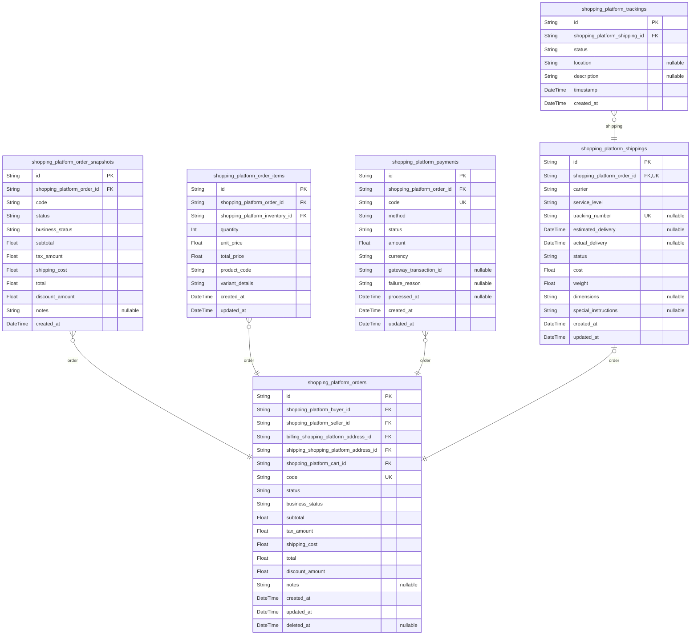

# Prisma Markdown

> Generated by [`prisma-markdown`](https://github.com/samchon/prisma-markdown)

- [Systematic](#systematic)
- [Actors](#actors)
- [Sales](#sales)
- [Carts](#carts)
- [Orders](#orders)
- [Reviews](#reviews)
- [Oversight](#oversight)

## Systematic

### `shopping_platform_channels`

Shopping platform channels representing different marketplace segments or
regions that merchants can operate in. These are core business entities
that organize the platform structure and allow targeted shopping
experiences.

Properties as follows:

- `id`: Primary Key.
- `code`
  > Unique code identifier for the channel, used for URL routing and
  > categorization.
- `name`: Human-readable name of the channel displayed to users.
- `description`: Detailed description explaining the channel's purpose and target audience.
- `created_at`: Timestamp when the channel was created.
- `updated_at`: Timestamp of the last update to the channel.
- `deleted_at`: Soft delete timestamp for channel deactivation.

### `shopping_platform_sections`

Sections within shopping channels that organize products into logical
groupings, supporting the channel's hierarchical structure.

Properties as follows:

- `id`: Primary Key.
- `shopping_platform_channel_id`: Belonged channel's shopping_platform_channels.id
- `code`: Unique code within the channel for URL routing and organization.
- `name`: Human-readable name of the section displayed to users.
- `description`: Explanation of what products or services belong in this section.
- `sort_order`: Display order among other sections within the same channel.
- `created_at`: Timestamp when the section was created.
- `updated_at`: Timestamp of the last update to the section.
- `deleted_at`: Soft delete timestamp for section deactivation.

### `shopping_platform_channel_categories`

Junction table connecting shopping channels to platform categories,
enabling multi-category association for flexible catalog organization.

Properties as follows:

- `id`: Primary Key.
- `shopping_platform_channel_id`: Belonged channel's shopping_platform_channels.id
- `shopping_platform_category_id`: Belonged category's shopping_platform_categories.id
- `created_at`: Timestamp when the channel-category association was created.
- `updated_at`: Timestamp of the last update to this association.
- `deleted_at`: Soft delete timestamp for association deactivation.

## Actors

### `shopping_platform_buyers`

Buyer account information for customers who shop and place orders.
Represents the buyer's identity and connection basis for all shopping
activities including authentication, personal details, and account status
management.

Properties as follows:

- `id`: Primary Key.
- `email`
  > Buyer's email address used for authentication and notifications. Must be
  > unique per buyer account.
- `password_hash`: Hashed password for buyer authentication. Never stores plain passwords.
- `first_name`: Buyer's first name for personalization and shipping labels.
- `last_name`: Buyer's last name for personalization and shipping labels.
- `phone`: Buyer's contact phone number for order communications and support.
- `status`
  > Buyer's account status indicating active, suspended, or inactive state
  > for workflow management.
- `loyalty_points`
  > Accumulated loyalty points for rewards and special offers, defaulting to
  > zero.
- `created_at`: Timestamp when buyer account was created for audit trails.
- `updated_at`: Timestamp of last buyer account modification.
- `deleted_at`
  > Soft delete timestamp for buyers, allowing recovery and preserving
  > referential integrity.

### `shopping_platform_sellers`

Seller account information for merchants listing products and managing
sales. Represents verified business entities managing their catalogs,
inventory, and fulfillment operations.

Properties as follows:

- `id`: Primary Key.
- `email`
  > Seller's email address used for authentication, order notifications, and
  > business communications.
- `password_hash`: Hashed password for seller authentication. Never stores plain passwords.
- `company_name`: Legal business name of the seller entity for compliance and tax purposes.
- `tax_id`: Business tax identification number for regulatory compliance and payouts.
- `phone`: Seller's business contact phone for support and verification purposes.
- `status`
  > Seller's business status indicating active, pending verification,
  > suspended, or inactive state.
- `commission_rate`
  > Percentage commission rate applied to seller's transactions, ranging from
  > 0 to 100.
- `created_at`
  > Timestamp when seller account was created for business registration
  > tracking.
- `updated_at`: Timestamp of last seller account or business detail modification.
- `deleted_at`
  > Soft delete timestamp for sellers, preserving transaction history and
  > allowing business reactivation.

### `shopping_platform_admins`

Admin account information for system administrators managing platform
operations, user accounts, content moderation, and system-wide oversight.

Properties as follows:

- `id`: Primary Key.
- `email`: Admin's email address used for authentication and secure system access.
- `password_hash`: Hashed password for admin authentication. Never stores plain passwords.
- `username`: Admin username for login purposes, unique within admin accounts.
- `full_name`: Admin's full legal name for audit logging and access verification.
- `department`
  > Administrative department or role designation for access control and
  > oversight.
- `status`: Admin account status indicating active, locked, or disabled state.
- `created_at`: Timestamp when admin account was created for system security tracking.
- `updated_at`: Timestamp of last admin account modification or security event.
- `deleted_at`
  > Soft delete timestamp for admins, maintaining security logs and allowing
  > account reactivation.

### `shopping_platform_addresses`

Address information associated with buyers, sellers, or admins. Each
address belongs to exactly one actor through the foreign key references,
supporting multiple addresses per user for shipping, billing, and
business purposes.

Properties as follows:

- `id`: Primary Key.
- `shopping_platform_buyer_id`: Belonged buyer's [shopping_platform_buyers.id](#shopping_platform_buyers)
- `shopping_platform_seller_id`: Belonged seller's [shopping_platform_sellers.id](#shopping_platform_sellers)
- `shopping_platform_admin_id`: Belonged admin's [shopping_platform_admins.id](#shopping_platform_admins)
- `nickname`
  > Descriptive name for this address (e.g., 'Home', 'Office', 'Warehouse')
  > to help users identify multiple addresses.
- `street_1`: Primary street address line including building number and street name.
- `street_2`
  > Secondary address line for apartment/unit numbers or additional address
  > details.
- `city`: City or municipality name for the address location.
- `state`: State, province, or region name for administrative subdivision.
- `postal_code`: Postal or ZIP code for mail delivery routing and verification.
- `country`: Country name or code for international address formatting and shipping.
- `is_default`
  > Indicates whether this address is the default selection for the owner
  > actor.
- `created_at`: Timestamp when this address was created for historical tracking.
- `updated_at`: Timestamp of last address detail modification.
- `deleted_at`
  > Soft delete timestamp for addresses, allowing recovery without affecting
  > active orders.

## Sales

### `shopping_platform_sales`

Product information, the core sales entity representing items available
for purchase. [shopping_platform_sale_units](#shopping_platform_sale_units) Contains basic product
details like name, description, and pricing, with relationships to
sellers, categories, and shipping addresses.

Properties as follows:

- `id`: Primary Key.
- `shopping_platform_seller_id`: Belonged seller's [shopping_platform_sellers.id](#shopping_platform_sellers)
- `shopping_platform_category_id`: Belonged category's [shopping_platform_categories.id](#shopping_platform_categories)
- `shopping_platform_address_id`: Return address for this product's [shopping_platform_addresses.id](#shopping_platform_addresses)
- `code`: Unique business identifier for the product.
- `name`: Display name of the product.
- `description`: Detailed description of the product.
- `base_price`: Base selling price in USD.
- `is_active`: Whether the product is currently available for purchase.
- `created_at`: Timestamp when the record was created.
- `updated_at`: Timestamp when the record was last updated.
- `deleted_at`: Soft delete timestamp, null if not deleted.

### `shopping_platform_sale_snapshots`

Historical snapshots of sales data for audit trails and change tracking.
[shopping_platform_sales](#shopping_platform_sales) Captures point-in-time states of product
listings with denormalized data for historical accuracy.

Properties as follows:

- `id`: Primary Key.
- `shopping_platform_sale_id`: Referenced sale's [shopping_platform_sales.id](#shopping_platform_sales)
- `code`: Snapshot of the product code.
- `name`: Snapshot of the product name.
- `description`: Snapshot of the product description.
- `base_price`: Snapshot of the base price.
- `is_active`: Snapshot of active status.
- `created_at`: Timestamp when snapshot was created.

### `shopping_platform_sale_units`

Product units or variants, subsidiary to main sales entity for managing
different options like sizes or colors. [shopping_platform_sales](#shopping_platform_sales)
[shopping_platform_sale_unit_options](#shopping_platform_sale_unit_options) Represents individual
purchasable items within a product.

Properties as follows:

- `id`: Primary Key.
- `shopping_platform_sale_id`: Parent sale's [shopping_platform_sales.id](#shopping_platform_sales)
- `sku`: Stock Keeping Unit unique identifier.
- `name`: Display name for this unit/variant.
- `price_modifier`: Price adjustment relative to base price.
- `is_available`: Whether this unit is currently available.
- `created_at`: Timestamp when the record was created.
- `updated_at`: Timestamp when the record was last updated.
- `deleted_at`: Soft delete timestamp, null if not deleted.

### `shopping_platform_sale_unit_options`

Options for sale units, subsidiary entity detailing variant choices like
color, size, or material. [shopping_platform_sale_units](#shopping_platform_sale_units) Provides
specific attribute values for product customization.

Properties as follows:

- `id`: Primary Key.
- `shopping_platform_sale_unit_id`: Parent unit's [shopping_platform_sale_units.id](#shopping_platform_sale_units)
- `attribute_name`: Name of the attribute (e.g., 'color', 'size').
- `attribute_value`: Value of the attribute (e.g., 'red', 'large').
- `display_order`: Order for displaying options.
- `created_at`: Timestamp when the record was created.
- `updated_at`: Timestamp when the record was last updated.

### `shopping_platform_categories`

Product category hierarchy for organizing sales items. {@link
shopping_platform_channel_categories} Supports nested categories with
parent relationships for efficient browsing.

Properties as follows:

- `id`: Primary Key.
- `parent_category_id`
  > Parent category's [shopping_platform_categories.id](#shopping_platform_categories) for
  > hierarchical structure.
- `name`: Category display name.
- `description`: Category description.
- `is_active`: Whether the category is active.
- `sort_order`: Display order for categories.
- `created_at`: Timestamp when the record was created.
- `updated_at`: Timestamp when the record was last updated.

### `shopping_platform_inventory`

Inventory levels per SKU, subsidiary to sale units for stock management.
[shopping_platform_sale_units](#shopping_platform_sale_units) Tracks available, reserved, and sold
quantities with thresholds for automated alerts.

Properties as follows:

- `id`: Primary Key.
- `shopping_platform_sale_unit_id`: Associated unit's [shopping_platform_sale_units.id](#shopping_platform_sale_units)
- `quantity_available`: Current available stock quantity.
- `quantity_reserved`: Quantity reserved in carts/orders.
- `quantity_sold`: Total quantity sold.
- `low_stock_threshold`: Threshold for low stock alerts.
- `is_backordered_allowed`: Whether backorders are allowed.
- `created_at`: Timestamp when the record was created.
- `updated_at`: Timestamp when the record was last updated.

## Carts

### `shopping_platform_carts`

Shopping carts containing selected items for checkout, managed
independently by buyers. [shopping_platform_buyers.id](#shopping_platform_buyers) Allows
multiple active carts per user with temporal auditing for cart management
history.

Properties as follows:

- `id`: Primary Key.
- `shopping_platform_buyer_id`: Belonged buyer's [shopping_platform_buyers.id](#shopping_platform_buyers)
- `name`: Custom cart name for organization purposes.
- `created_at`: Creation timestamp for auditing cart lifecycle.
- `updated_at`: Last modification timestamp for cart changes.
- `deleted_at`: Soft deletion timestamp for recoverable cart removal.

### `shopping_platform_cart_items`

Individual items within shopping carts, tracking quantity and product
variants. [shopping_platform_carts.id](#shopping_platform_carts) Provides detailed cart
contents with foreign key references for effective inventory validation.

Properties as follows:

- `id`: Primary Key.
- `shopping_platform_cart_id`: Belonged cart's [shopping_platform_carts.id](#shopping_platform_carts)
- `shopping_platform_sale_unit_id`: Referenced product variant's [shopping_platform_sale_units.id](#shopping_platform_sale_units)
- `quantity`: Quantity of this item in the cart.
- `created_at`: Addition timestamp for item tracking.
- `updated_at`: Last update timestamp for quantity changes.
- `deleted_at`: Soft deletion for item removal from cart.

### `shopping_platform_wishlists`

Wishlists for saving desired products without inventory reservation,
managed independently by buyers. [shopping_platform_buyers.id](#shopping_platform_buyers)
Supports multiple wishlists per user for organization and
personalization.

Properties as follows:

- `id`: Primary Key.
- `shopping_platform_buyer_id`: Belonged buyer's [shopping_platform_buyers.id](#shopping_platform_buyers)
- `name`: Custom wishlist name for categorization.
- `description`: Optional description for wishlist purpose.
- `created_at`: Creation timestamp for wishlist tracking.
- `updated_at`: Last modification timestamp.
- `deleted_at`: Soft deletion for wishlist removal.

### `shopping_platform_wishlist_items`

Items saved in user wishlists, linking buyers to desired product
variants. [shopping_platform_wishlists.id](#shopping_platform_wishlists) Enables wishful
purchasing tracking without purchase commitment.

Properties as follows:

- `id`: Primary Key.
- `shopping_platform_wishlist_id`: Belonged wishlist's [shopping_platform_wishlists.id](#shopping_platform_wishlists)
- `shopping_platform_sale_unit_id`: Referenced product variant's [shopping_platform_sale_units.id](#shopping_platform_sale_units)
- `quantity`: Desired quantity for future purchase.
- `created_at`: Addition timestamp to wishlist.
- `updated_at`: Last update timestamp for changes.
- `deleted_at`: Soft deletion for item removal from wishlist.

## Orders

### `shopping_platform_orders`

Complete order records representing purchase transactions between buyers
and sellers. Tracks order lifecycle from placement through completion,
including financial totals, status progression, and relationships to
buyers, sellers, and delivery addresses. Central to the e-commerce
fulfillment workflow with comprehensive audit capabilities.

Properties as follows:

- `id`: Primary Key.
- `shopping_platform_buyer_id`: Buyer's [shopping_platform_buyers.id](#shopping_platform_buyers) who placed the order.
- `shopping_platform_seller_id`: Seller's [shopping_platform_sellers.id](#shopping_platform_sellers) fulfilling the order.
- `billing_shopping_platform_address_id`: Billing address's [shopping_platform_addresses.id](#shopping_platform_addresses) for the order.
- `shipping_shopping_platform_address_id`: Shipping address's [shopping_platform_addresses.id](#shopping_platform_addresses) for delivery.
- `shopping_platform_cart_id`
  > Original cart's [shopping_platform_carts.id](#shopping_platform_carts) that generated this
  > order.
- `code`: Unique order identifier for customer reference and tracking.
- `status`: Current order status indicating progress through fulfillment phases.
- `business_status`: Business workflow state for operational tracking and reporting.
- `subtotal`: Order subtotal before taxes and shipping charges.
- `tax_amount`: Calculated tax amount based on shipping destination and items.
- `shipping_cost`: Shipping charges for the order including carrier and service fees.
- `total`: Final order total including all items, taxes, and shipping.
- `discount_amount`: Applied discount amount from coupons or promotions.
- `notes`: Additional customer notes or special handling instructions.
- `created_at`: Order creation timestamp.
- `updated_at`: Order last modification timestamp.
- `deleted_at`: Soft deletion timestamp for canceled orders.

### `shopping_platform_order_snapshots`

Historical snapshots of order states for comprehensive audit trails and
change tracking. Captures point-in-time representations of orders
enabling rollback capabilities and historical reporting. Supports
regulatory compliance with complete order modification history.

Properties as follows:

- `id`: Primary Key.
- `shopping_platform_order_id`
  > Referenced order's [shopping_platform_orders.id](#shopping_platform_orders) for snapshot
  > tracking.
- `code`: Order code at snapshot time.
- `status`: Order status at snapshot time.
- `business_status`: Business status at snapshot time.
- `subtotal`: Subtotal at snapshot time.
- `tax_amount`: Tax amount at snapshot time.
- `shipping_cost`: Shipping cost at snapshot time.
- `total`: Total amount at snapshot time.
- `discount_amount`: Discount amount at snapshot time.
- `notes`: Notes at snapshot time.
- `created_at`: Snapshot creation timestamp.

### `shopping_platform_order_items`

Individual line items within orders detailing specific product purchases.
Breaks down orders into constituent products with quantities, pricing,
and variant specifications. Supports detailed order fulfillment and
inventory allocation.

Properties as follows:

- `id`: Primary Key.
- `shopping_platform_order_id`: Parent order's [shopping_platform_orders.id](#shopping_platform_orders).
- `shopping_platform_inventory_id`: Inventory item's [shopping_platform_inventory.id](#shopping_platform_inventory) being purchased.
- `quantity`: Number of items ordered for this line item.
- `unit_price`: Price per item at time of order.
- `total_price`: Total price for this line item (quantity × unit_price).
- `product_code`: Product code reference for fulfillment.
- `variant_details`: Selected product variant specifications (color, size, etc.).
- `created_at`: Item creation timestamp.
- `updated_at`: Item last modification timestamp.

### `shopping_platform_payments`

Financial transaction records tracking payment processing for orders.
Captures payment methods, amounts, statuses, and processing details
enabling secure financial operations and audit trails. Critical for
revenue tracking and dispute resolution.

Properties as follows:

- `id`: Primary Key.
- `shopping_platform_order_id`: Associated order's [shopping_platform_orders.id](#shopping_platform_orders).
- `code`: Unique payment transaction identifier.
- `method`: Payment method used (credit card, digital wallet, etc.).
- `status`: Payment processing status and authorization state.
- `amount`: Payment amount processed.
- `currency`: Payment currency code.
- `gateway_transaction_id`: External payment gateway transaction reference.
- `failure_reason`: Reason for payment failure if applicable.
- `processed_at`: Payment processing completion timestamp.
- `created_at`: Payment record creation timestamp.
- `updated_at`: Payment record last modification timestamp.

### `shopping_platform_shippings`

Shipping and delivery records for orders. Manages carrier assignments,
service levels, and delivery instructions. Supports tracking integration
and customer communication about delivery progress.

Properties as follows:

- `id`: Primary Key.
- `shopping_platform_order_id`: Associated order's [shopping_platform_orders.id](#shopping_platform_orders).
- `carrier`: Shipping carrier provider name.
- `service_level`: Service level (standard, express, overnight).
- `tracking_number`: Carrier-assigned tracking number.
- `estimated_delivery`: Estimated delivery date and time.
- `actual_delivery`: Actual delivery completion timestamp.
- `status`: Current shipping status.
- `cost`: Shipping cost charged.
- `weight`: Package weight for shipping calculation.
- `dimensions`: Package dimensions for shipping.
- `special_instructions`: Special delivery instructions from customer.
- `created_at`: Shipping record creation timestamp.
- `updated_at`: Shipping record last modification timestamp.

### `shopping_platform_trackings`

Detailed tracking events and status updates for shipments. Provides
granular delivery progress information enabling customers and sellers to
monitor package movement through the delivery network.

Properties as follows:

- `id`: Primary Key.
- `shopping_platform_shipping_id`: Parent shipping's [shopping_platform_shippings.id](#shopping_platform_shippings).
- `status`: Tracking status event (picked up, in transit, delivered).
- `location`: Current or event location description.
- `description`: Detailed status description from carrier.
- `timestamp`: Event occurrence timestamp.
- `created_at`: Tracking event creation timestamp.

## Reviews

### `shopping_platform_reviews`

Customer product reviews including star ratings and text comments for
verified purchases. Links to buyers ([shopping_platform_buyers.id](#shopping_platform_buyers))
and order items to ensure authenticity and prevent duplicate reviews.
Supports moderation features for inappropriate content.

Properties as follows:

- `id`: Primary Key.
- `shopping_platform_buyer_id`: Buyer who submitted this review ([shopping_platform_buyers.id](#shopping_platform_buyers)).
- `shopping_platform_order_item_id`
  > Order item being reviewed ([shopping_platform_order_items.id](#shopping_platform_order_items)).
  > Ensures only purchased products can be reviewed.
- `title`: Review title summarizing the experience.
- `rating`: Star rating from 1 to 5.
- `comment`: Detail review text explaining the rating.
- `is_verified`: Whether this review is from a verified purchase.
- `helpful_count`: Number of users who found this review helpful.
- `moderation_status`: Moderation status: pending, approved, rejected, or hidden.
- `created_at`: Review creation timestamp.
- `updated_at`: Last update timestamp.
- `deleted_at`: Soft delete timestamp for review removal.

### `shopping_platform_review_images`

Images uploaded with product reviews for visual feedback. Directly
associated with reviews ([shopping_platform_reviews.id](#shopping_platform_reviews)) to support
rich review content. Supports multiple images per review.

Properties as follows:

- `id`: Primary Key.
- `shopping_platform_review_id`: Review this image belongs to ([shopping_platform_reviews.id](#shopping_platform_reviews)).
- `image_url`: URL to the uploaded review image.
- `alt_text`: Alternative text describing the image for accessibility.
- `sequence_order`: Display order of images in the review.
- `created_at`: Image upload timestamp.
- `updated_at`: Last update timestamp.
- `deleted_at`: Soft delete timestamp for image removal.

## Oversight

### `shopping_platform_seller_dashboards`

Seller performance analytics dashboard providing key metrics for
individual sellers including sales volume, revenue, customer ratings, and
inventory status. This table aggregates performance data to support
seller business operations and help them optimize their marketplace
presence. Referenced by shopping_platform_sellers.id for seller-specific
dashboards.

Properties as follows:

- `id`: Primary Key.
- `shopping_platform_seller_id`: Belonged seller's shopping_platform_sellers.id
- `total_sales_volume`: Total number of units sold by this seller.
- `total_revenue`: Total revenue generated in USD.
- `average_rating`: Average star rating from customer reviews.
- `active_listings_count`: Number of currently active product listings.
- `inventory_alerts_count`: Number of items with low inventory requiring attention.
- `top_product_name`: Name of the best-performing product.
- `last_updated_at`: When the dashboard metrics were last recalculated.
- `created_at`: Creation timestamp.
- `updated_at`: Last update timestamp.
- `deleted_at`: Soft delete timestamp.

### `shopping_platform_admin_logins`

Tracking of administrative login attempts for security monitoring and
compliance requirements. Records login events, IP addresses, and success
status to detect suspicious activities and maintain audit trails.
Referenced by shopping_platform_admins.id for admin-specific login
history.

Properties as follows:

- `id`: Primary Key.
- `shopping_platform_admin_id`: Belonged admin's shopping_platform_admins.id
- `login_timestamp`: When the login attempt occurred.
- `ip_address`: IP address from which the login attempt was made.
- `user_agent`: Browser/user agent string for device identification.
- `successful_login`: Whether the login attempt was successful.
- `failure_reason`
  > Reason for failure if unsuccessful (e.g., invalid credentials, account
  > locked).
- `session_duration`: Duration of the session in minutes if login was successful.
- `created_at`: Creation timestamp.
- `updated_at`: Last update timestamp.
- `deleted_at`: Soft delete timestamp.

### `shopping_platform_audit_logs`

Comprehensive audit trail for all platform administrative actions and
critical business events. Records changes, deletions, and significant
system events for compliance, troubleshooting, and security monitoring.
Referenced by shopping_platform_admins.id for admin actions traced to
responsible administrators.

Properties as follows:

- `id`: Primary Key.
- `shopping_platform_admin_id`: Responsible admin's shopping_platform_admins.id
- `affected_entity_id`
  > ID of the entity that was modified (could be sale, seller, admin, user,
  > product, etc.). Generic UUID without specific table reference to support
  > auditing any platform entity.
- `action_timestamp`: When the audited action occurred.
- `action_type`: Type of action performed (CREATE, UPDATE, DELETE, LOGIN, etc.).
- `entity_type`: Type of entity affected (sale, seller, admin, buyer, product, etc.).
- `old_value`: Previous state of changed field in JSON format.
- `new_value`: New state of changed field in JSON format.
- `ip_address`: IP address from which the action originated.
- `user_agent`: Browser/user agent string at the time of action.
- `description`: Human-readable description of the action performed.
- `created_at`: Creation timestamp.
- `updated_at`: Last update timestamp.
- `deleted_at`: Soft delete timestamp.
