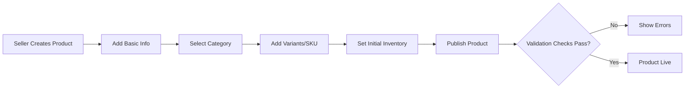
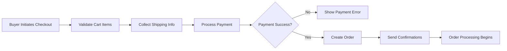

# Requirements Analysis Report for E-Commerce Shopping Mall Platform

## 1. Business Model and Objectives

### Why This Service Exists
The e-commerce shopping mall platform serves as a comprehensive digital marketplace where buyers can discover and purchase products, sellers can list and manage their inventory, and administrators can oversee platform operations. The business addresses the growing need for convenient, secure online shopping by providing a centralized platform that connects multiple sellers with consumers, enabling transactions with real-time tracking and reviews.

### Business Strategy
The platform operates on a marketplace revenue model, generating income through transaction fees on sales, subscription fees for premium seller accounts, or advertising. User acquisition relies on digital marketing, search engine optimization, and partnerships with sellers. Growth strategies include expanding product categories, international expansion, and mobile app development to increase user engagement and transaction volumes.

### Core Value Proposition
WHEN a user accesses the platform, THE system SHALL provide a seamless shopping experience that connects verified sellers with authenticated buyers. WHILE buyers browse the catalog, THE system SHALL enable personalized recommendations and real-time inventory availability. WHERE sellers manage products, THE system SHALL offer tools for efficient inventory tracking and sales analytics.

### Success Metrics
To measure success, the platform tracks monthly active users (target: 10,000+ MAU), average order value (target: $50+), seller retention rate (target: 80%+ after first year), and customer satisfaction scores (target: 4.5/5 stars). Year-over-year revenue growth of 50%+ indicates healthy business scaling.

## 2. User Roles and Authentication

### Role Definitions
The platform supports three primary user roles:

- **Buyer**: Authenticated users who shop, maintain shopping carts and wishlists, place orders, track shipments, leave product reviews, and manage account information including addresses.
- **Seller**: Authenticated users who list products with variants, manage inventory per SKU, set pricing, process sales, and view analytics on their product performance.
- **Admin**: System administrators with elevated access to oversee all orders, approve seller accounts, manage platform-wide product listings, and handle user support cases.

### Authentication Requirements
THE platform SHALL implement JWT-based authentication for all user sessions.

WHEN a user attempts to register, THE system SHALL validate email format and password strength (minimum 8 characters, uppercase, lowercase, number, special character).

WHEN a user submits login credentials, THE system SHALL authenticate credentials against stored hashes and respond within 2 seconds.

WHILE a user session is active, THE system SHALL include user ID, role, and permissions in JWT payload.

IF authentication fails due to invalid credentials, THEN THE system SHALL return appropriate error messages and limit retry attempts to prevent brute force attacks.

THE system SHALL support password reset via email verification tokens expiring in 30 minutes.

WHEN a user completes registration, THE system SHALL send email verification before enabling full account access.

### Permission Matrix

| Feature | Buyer | Seller | Admin |
|---------|-------|--------|-------|
| Browse products | Yes | Yes | Yes |
| Search products | Yes | Yes | Yes |
| Add to cart/wishlist | Yes | No | No |
| Place orders | Yes | No | No |
| Track orders | Yes | No | Yes |
| Leave reviews | Yes | No | No |
| Manage own products | No | Yes | No |
| View sales analytics | No | Yes | Yes |
| Manage inventory | No | Yes | No |
| Moderate content | No | No | Yes |
| Approve sellers | No | No | Yes |
| System administration | No | No | Yes |

## 3. Functional Requirements

### 3.1 User Management
WHEN a new user registers for an account, THE system SHALL collect email, password, and basic profile information initially. THE system SHALL verify email through a confirmation link sent within seconds of registration. WHILE registering, THE system SHALL validate email format and check for duplicate addresses.

For address management (buyers only), WHEN a buyer adds an address, THE system SHALL support multiple addresses per account with fields for street address, city, state/province, postal code, and country. IF an address format is invalid, THEN THE system SHALL highlight the field and provide guidance (e.g., "Postal code required for this country").

Login requirements: WHEN a user submits credentials, THE system SHALL authenticate and respond within 3 seconds under normal load. IF login fails due to incorrect credentials, THEN THE system SHALL increment a failed attempt counter and lock accounts after 5 consecutive failures for 30 minutes.

### 3.2 Product Management
THE system SHALL organize products into hierarchical categories (e.g., Electronics > Smartphones > Android). WHEN a seller lists a product, THE system SHALL require basic information: name, description, base price, and category assignment. Product variants use SKU system: WHILE creating variants, THE system SHALL allow selection of attributes like color ("Red", "Blue"), size ("S", "M", "L"), and material options ("Cotton", "Linen").

Inventory management per SKU: WHEN sellers update inventory, THE system SHALL track quantity available, reserved (in carts), and sold amounts. IF inventory doesn't meet demand, THEN THE system SHALL prevent order completion and notify sellers via dashboard alerts.

Search functionality: WHEN users search products, THE system SHALL support keyword searches across product names, descriptions, and category names. Results SHALL display within 1 second for queries with results, using relevance ranking (exact matches first, then partial matches).

### 3.3 Shopping and Order Processing
Shopping cart: WHEN a buyer adds items to cart, THE system SHALL maintain cart contents across sessions until checkout. IF adding an out-of-stock item, THEN THE system SHALL notify the buyer and suggest alternatives.

Wishlist: THE system SHALL allow buyers to save products for future consideration, with notifications when wishlist items go on sale or restock.

Order placement: WHEN a buyer initiates checkout, THE system SHALL verify cart contents against current inventory. IF inventory is insufficient, THEN THE system SHALL remove unavailable items and notify the buyer. The system SHALL collect payment information and shipping address before order confirmation.

Payment processing: WHILE processing payments, THE system SHALL integrate with external payment gateways to handle various methods (credit card, debit card, digital wallets). IF payment fails, THEN THE system SHALL return to cart with error details and allow retry attempts.

Order tracking: WHEN an order ships, THE system SHALL update status with tracking numbers from shipping providers. Buyers can view order history with status updates: "Processing", "Shipped", "Delivered", "Cancelled", "Refunded". WHEN status changes, THE system SHALL send email notifications to buyers and sellers.

### 3.4 Reviews and Feedback
Product reviews: WHEN a buyer completes an order, THE system SHALL enable rating products on a 1-5 star scale with optional text feedback. REVIEWS SHALL appear on product pages after purchase verification. IF reviewers provide inappropriate content, THEN THE system SHALL allow sellers to report for admin review (admins can hide/remove problematic reviews).

Review moderation: WHILE reviews are moderated, THE system SHALL use keyword filtering for spam (e.g., repeated links, offensive terms) and require admin approval for first-time reviewers. Buyers can upload up to 3 photos per review showing product usage.

### 3.5 Seller Management
Seller accounts: WHEN applying for seller status, THE system SHALL require additional verification like business information and tax identification. IF approved by admin, THEN THE system SHALL grant seller permissions and send welcome notifications.

Product management tools: WHILE sellers manage products, THE system SHALL provide bulk upload capabilities for inventory updates and price changes. Sellers can view analytics: sales volume, top products, customer demographics, and revenue trends.

Seller dashboard: THE system SHALL offer customized views showing active listings, pending orders, inventory alerts, and performance metrics.

### 3.6 Administrative Functions
Admin dashboard: WHEN admins log in, THE system SHALL display system-wide metrics: total orders, pending seller approvals, reported reviews, and platform performance.

Order management: Admins can view all orders, modify statuses, and intervene in disputes. For product management, admins oversee all listings and can feature products or remove violations.

User support: WHILE handling support cases, THE system SHALL log admin actions for transparency and allow communication with buyers/sellers through in-platform messaging.

## 4. Business Rules and Validation

### Data Validation Rules
- Email addresses: WHEN entered, THE system SHALL validate format using standard patterns (user@domain.com) and reject domains commonly associated with spam.
- Passwords: THE system SHALL enforce minimum complexity (8 characters, uppercase, lowercase, number, special character).
- Product prices: IF prices are less than $1, THEN THE system SHALL require seller justification and approval.
- Inventory quantities: Negative values are prohibited; system treats negative values as zero stock and notifies sellers.

### Order Processing Rules
- Minimum order value: $10 to qualify for free shipping.
- Maximum items per order: 50 items to prevent bulk purchasing abuse.
- Return windows: Buyers have 30 days for returns; refunds processed within 5-7 business days after return receipt.

### Seller Verification
- New sellers require admin approval before listing first products.
- Sellers must maintain active listings (minimum 5 products) to keep account status.
- Suspicious activity (multiple reported reviews, pattern of cancelled orders) triggers account review.

### Inventory Rules
- SKU allocation: Unique SKUs per variant combination across the platform.
- Stock reservation: Items in carts reserve inventory for 30 minutes before release.
- Low stock alerts: WHEN inventory drops below 20% of initial stock, THE system SHALL notify sellers.

## 5. Error Handling and Recovery

### Registration Errors
IF email verification fails, THEN THE system SHALL provide a "Resend Verification Email" option with rate limiting (maximum 3 resends per hour).

### Payment Failures
WHEN payment processing encounters errors, THE system SHALL categorize errors (insufficient funds, card expired, etc.) and provide specific recovery guidance. Users can save multiple payment methods for faster retries.

### Inventory Issues
WHEN buyers attempt to purchase out-of-stock items, THE system SHALL remove them from cart with notification of alternatives. Sellers receive automatic alerts when inventory goes negative due to order completion race conditions.

### Shipping Errors
IF tracking information becomes unavailable, THEN THE system SHALL notify buyers with alternative contact methods for shipping carriers. Automatic fallback to order status "Delivered" occurs after estimated delivery date + 3 days.

### Account Recovery
WHEN users request password resets, THE system SHALL send secure tokens via email and require validation within 15 minutes. Expired tokens trigger new requests without limits.

### General Error Recovery
FOR all user-facing errors, THE system SHALL maintain session state and provide clear paths back to intended actions. Error messages use plain language explaining issues and next steps.

## 6. Performance and Usability Expectations

### Response Times
SEARCH results SHALL return within 1 second for basic queries and 3 seconds for complex filtered searches. PAGE loads SHALL feel instantaneous (under 2 seconds) for catalog browsing. ORDER processing SHALL complete within 10 seconds under normal load to maintain user trust.

### Scalability
THE system SHALL support 1,000 concurrent users during peak hours without performance degradation. WHILE handling traffic spikes (up to 10,000 simultaneous users), THE system SHALL maintain core functionality with graceful degradation of non-essential features.

### User Experience
THE system SHALL provide consistent interface behavior across devices (desktop, mobile). WHEN users interact with forms, THE system SHALL auto-save progress for complex operations like product listing. Error messages appeal directly to users with clear, actionable steps for resolution.

### Availability
THE system SHALL achieve 99.5% uptime excluding scheduled maintenance. WHILE undergoing maintenance, THE system SHALL display downtime notices with estimated return times.

## 7. Related Documents

For the complete business objectives and platform vision, please refer to the [Service Vision Documentation](./01-service-vision.md). 
User authentication details and permission structures are fully covered in the [User Roles Documentation](./02-user-roles.md). 
Detailed user journey narratives and workflow stories can be found in the [User Journeys Documentation](./03-user-journeys.md).

## 8. Appendices

### Appendix A: EARS Format Examples
- Ubiquitous: THE system SHALL maintain user sessions for 24 hours of inactivity.
- Event-driven: WHEN a buyer adds an item to cart, THE system SHALL reserve inventory for 30 minutes.
- State-driven: WHILE an order is in "Processing" status, THE system SHALL prevent status changes by buyers.
- Unwanted Behavior: IF payment verification fails, THEN THE system SHALL cancel the order and refund any partial charges.
- Optional Features: WHERE premium shipping is selected, THE system SHALL offer 2-day delivery guarantees.

### Appendix B: Priority Classification
- High Priority: User registration, product search, order placement, payment processing.
- Medium Priority: Reviews, detailed analytics, advanced filters.
- Low Priority: Bulk operations, advanced seller tools, internationalization.

This requirements analysis provides the foundation for backend development, focusing on clear business requirements that eliminate ambiguity for developers. Technical implementation choices remain at the discretion of the development team.