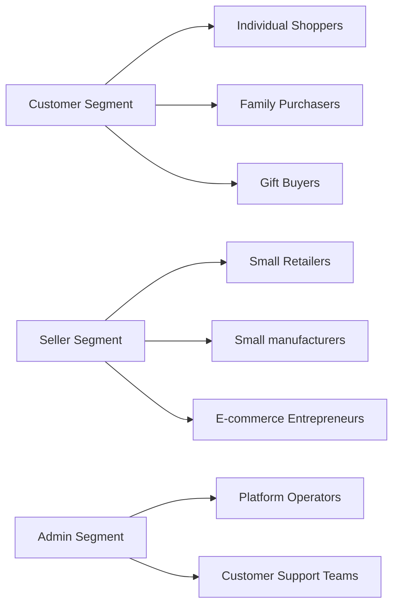

# 01-service-vision-overview.md

## Executive Summary

The e-commerce shopping mall platform represents a comprehensive digital marketplace designed to connect customers with a diverse range of products while empowering sellers to manage their businesses efficiently. At its core, this platform serves as a virtual shopping center where customers can discover products, make informed purchasing decisions, and complete transactions seamlessly, while sellers can showcase their offerings, manage inventory, and process orders through a unified system. The platform's business model revolves around providing value through convenience, variety, and streamlined operations, with revenue streams potentially including transaction fees, seller subscriptions, or premium features.

From the customer's perspective, the platform must deliver an intuitive shopping experience that rivals physical malls - offering endless choice, detailed product information, and reliable fulfillment. For sellers, it provides the tools needed to compete effectively in an increasingly digital marketplace, with inventory management systems and order processing capabilities. Administrators oversee platform health, ensuring fair practices and resolving issues across the marketplace.

This platform addresses the fundamental challenge of creating an efficient, scalable marketplace that benefits all stakeholders: customers receive quality products at competitive prices, sellers gain access to broader markets with reduced operational overhead, and platform operators generate sustainable revenue through transaction facilitation.

WHEN the platform launches, THE platform SHALL establish trust and reliability as fundamental business objectives, ensuring customers experience consistent service delivery across all transactions.

## Business Goals

The primary business objectives of this e-commerce shopping mall platform focus on establishing itself as the go-to digital marketplace that creates genuine value for all user groups while achieving long-term financial success.

WHEN the platform launches, THE platform SHALL achieve market leadership by offering more comprehensive product diversity than competing platforms, enabling customers to complete their shopping journeys within a single marketplace rather than visiting multiple sites.

WHEN customers engage with the platform, THE platform SHALL provide seamless interactions that result in successful transactions while reducing cart abandonment rates below industry averages.

WHEN measuring customer satisfaction, THE platform SHALL position itself as the preferred shopping destination, where customers can discover, compare, and purchase products with confidence that their orders will be fulfilled accurately and on time.

WHEN sellers participate in the platform, THE platform SHALL enable them to increase sales opportunities through enhanced visibility and analytics while reducing their operational overhead by at least 40%.

WHEN evaluating platform growth, THE platform SHALL target scalable expansion across different product categories and geographic regions, maintaining consistent quality and user experience as it grows.

THE platform SHALL generate revenue through multiple channels including transaction fees, seller premium services, advertising opportunities, and data-driven insights that sellers can leverage for business optimization.

WHEN measuring success in the first year, THE platform SHALL achieve 80% customer retention rates and 70% seller retention rates, demonstrating sustainable value creation for all stakeholders.

## Target Market

The platform targets multiple interconnected user groups, each with distinct but complementary needs in the e-commerce ecosystem. Understanding these groups is essential for delivering a cohesive marketplace experience.

### Customer Target Groups

The primary customer base consists of individual consumers aged 18-65 who engage in regular online shopping activities. These customers value convenience, variety, and reliable service delivery. They include:

- **Regular shoppers**: Individuals who purchase consumer goods frequently, seeking convenience and competitive pricing
- **Targeted buyers**: Parents purchasing children's products, tech enthusiasts looking for gadgets, fashion-conscious consumers seeking apparel
- **Gift purchasers**: Users shopping for specific occasions or gifts, requiring detailed product information and review systems
- **First-time online buyers**: Users who need guidance and assurance in their initial marketplace experiences

WHEN customers search for products, THE platform SHALL present options that match their lifestyle needs and purchasing motivations, ensuring every shopping visit feels personalized and efficient.

WHEN customers convert from browsing to purchasing, THE platform SHALL achieve an average order value of $85 within the first year of operation.

WHEN customers evaluate the platform's trustworthiness, THE platform SHALL maintain a customer satisfaction rating above 4.5 out of 5 based on quarterly surveys.

### Seller Target Groups

The seller community includes entrepreneurs and businesses of varying sizes who recognize the opportunity to expand their reach through digital channels. These sellers seek platforms that minimize operational complexity while maximizing sales potential.

- **Small business owners**: Local retailers and crafters who want to reach online customers without investing in complex e-commerce infrastructure
- **Manufacturers**: Producers who want direct-to-consumer sales channels alongside traditional retail partnerships
- **E-commerce focused businesses**: Companies whose primary business model is online sales, seeking advanced tools for inventory management and customer engagement

WHEN sellers register on the platform, THE platform SHALL enable them to set up their product catalogs within 24 hours of application approval.

WHEN sellers use the platform, THE platform SHALL provide technology that reduces listing complexity by 70% compared to other marketplaces.

WHEN sellers evaluate platform value, THE platform SHALL deliver measurable ROI within their first quarter of operation through increased sales and reduced processing costs.

### Administrative Users

Platform operators and support staff who ensure the ecosystem functions smoothly. These users require comprehensive oversight capabilities to maintain marketplace integrity and customer satisfaction.

WHEN administrators manage the platform, THE platform SHALL provide them with real-time visibility into operations while enabling efficient resolution of marketplace issues.

WHEN administrators respond to platform issues, THE platform SHALL enable resolution within 4 hours for critical problems and 24 hours for standard issues.

WHEN the platform scales to 10,000 active users, THE platform SHALL maintain administrative response times under 2 seconds for dashboard access.

## Platform Capabilities

The platform's core capabilities enable a complete marketplace experience, from product discovery to order fulfillment, designed around the needs of its three primary user groups.

### Customer-Facing Capabilities

Customers access a comprehensive shopping environment that replicates and enhances the physical mall experience online.

WHEN customers browse the platform, THE platform SHALL display product catalogs with detailed information including specifications, pricing, availability, customer reviews, and seller ratings within 2 seconds of page load.

WHEN customers view product details, THE platform SHALL display comprehensive information including specifications, pricing, availability, customer reviews, and seller information to support informed purchasing decisions.

WHEN customers place orders, THE system SHALL process payments securely and provide real-time order tracking, ensuring transparency throughout the fulfillment process.

WHEN customers manage their accounts, THE system SHALL provide persistent profiles including address management, order history, and personalized shopping preferences for enhanced user experience.

WHEN customers require customer support, THE platform SHALL provide response within 24 hours and maintain a customer support satisfaction rating above 4.0 out of 5.

### Seller Management Capabilities

Sellers receive a complete business management suite that transforms complex e-commerce operations into streamlined workflows.

WHEN sellers register and are approved, THE platform SHALL provide them with dedicated dashboards for managing their business operations and performance metrics within 1 hour of approval.

WHEN sellers create product catalogs, THE platform SHALL support variant management including colors, sizes, and custom options, ensuring accurate inventory representation.

WHEN managing inventory, THE platform SHALL track SKU-level stock levels, automatically updating availability and alerting sellers to low-stock conditions that require action.

WHEN sellers process orders, THE system SHALL provide comprehensive order management tools that allow sellers to view incoming orders, update shipping status, and process refunds or exchanges efficiently.

WHEN sellers evaluate performance, THE platform SHALL generate seller-specific reports and analytics, including sales performance, inventory turnover, and customer feedback metrics.

WHEN sellers need platform support, THE system SHALL provide dedicated seller support channels with response times under 12 hours for critical issues.

### Administrative Capabilities

Platform administrators oversee marketplace operations to ensure fairness, compliance, and optimal performance across all user groups.

WHEN administrators access the platform, THE system SHALL provide comprehensive dashboards showing real-time metrics on sales, user activity, and system health.

WHEN administrators manage product listings, THE platform SHALL enable them to approve new listings, review flagged content, and manage product categories across all sellers.

WHEN handling order disputes, THE platform SHALL give administrators tools to review transaction details, communicate with involved parties, and implement fair resolutions within 48 hours of escalation.

WHEN administrators oversee platform performance, THE platform SHALL provide analytics and reporting that enable administrators to identify trends, optimize platform performance, and plan for future growth.

WHEN administrators address platform security, THE system SHALL maintain proactive monitoring and 99.9% uptime with automated incident response capabilities.

WHEN administrators conduct platform maintenance, THE system SHALL enable maintenance windows during low-traffic periods while ensuring no service disruption for critical operations.

## Competitive Advantages

The platform differentiates itself in the crowded e-commerce marketplace through comprehensive integration, seller empowerment, and administrative efficiency that create sustainable value for all stakeholders.

### Comprehensive Marketplace Integration

Unlike fragmented shopping experiences across multiple isolated platforms, this platform provides end-to-end marketplace functionality that serves all participants effectively.

WHEN customers discover products on the platform, THE platform SHALL enable direct purchasing without requiring customers to leave the marketplace and lose context.

WHEN sellers integrate with the platform, THE platform SHALL provide a single interface for all marketplace operations, reducing the need for multiple e-commerce integrations.

WHEN administrators oversee operations, THE platform SHALL deliver unified analytics and management tools that provide complete marketplace visibility.

### Seller Empowerment and Tools

The platform provides sellers with enterprise-level capabilities accessible to businesses of any size, creating fair competition and opportunity.

WHEN sellers list products, THE platform SHALL provide professional-grade tools for product presentation, inventory management, and customer service without requiring technical expertise.

WHEN sellers use platform analytics, THE platform SHALL enable data-driven decisions that improve profitability and customer satisfaction metrics.

WHEN sellers require scaling, THE platform SHALL support growth from single products to complete catalogs without performance degradation.

### Advanced Product Management

Supporting complex product catalogs with detailed variants represents a significant advancement over platforms with basic product listings.

WHEN managing products with multiple options, THE platform SHALL allow sellers to track inventory at the most granular level, preventing overselling and improving fulfillment accuracy across all variant combinations.

WHEN customers select product variants, THE platform SHALL provide clear visual indicators of availability and pricing differences across options.

WHEN performing inventory reconciliation, THE platform SHALL eliminate discrepancies between seller systems and platform displays through automated synchronization.

### Integrated Administrative Oversight

Comprehensive platform management capabilities differentiate this solution from marketplaces that rely on reactive problem-solving.

WHEN issues arise on the platform, THE system SHALL provide proactive monitoring and automated alerts that enable preventive action before customer impact.

WHEN administrators moderate content, THE platform SHALL use AI-assisted tools combined with human oversight for efficient and fair content management.

WHEN platform performance degrades, THE system SHALL automatically scale resources and notify administrators of capacity expansions needed.

### Trust and Transparency

Building lasting relationships through transparent processes represents a fundamental competitive advantage.

WHEN customers evaluate seller reliability, THE platform SHALL provide verified seller ratings, detailed order tracking, and transparent commission structures that build marketplace trust.

WHEN disputes occur, THE platform SHALL maintain complete audit trails enabling fair resolution and demonstrating commitment to customer protection.

WHEN regulatory audits are conducted, THE platform SHALL provide comprehensive compliance data demonstrating adherence to data protection and consumer rights regulations.

WHEN customers choose the platform, THE platform SHALL deliver consistent value that exceeds expectations, creating loyalty that competing marketplaces struggle to match.

### Differentiation Metrics

WHEN comparing to competitors, THE platform SHALL achieve 25% lower seller onboarding time while delivering 30% higher customer satisfaction rates.

WHEN evaluating marketplace completeness, THE platform SHALL provide unified tools that eliminate 80% of the complexity associated with multi-platform selling.

WHEN measuring administrative efficiency, THE platform SHALL enable 50% faster dispute resolution compared to industry averages.

WHEN customers evaluate trust factors, THE platform SHALL demonstrate superior transparency that results in 15% higher conversion rates on high-value purchases.

*Developer Note: This document defines **business requirements only**. All technical implementations (architecture, APIs, database design, etc.) are at the discretion of the development team.*