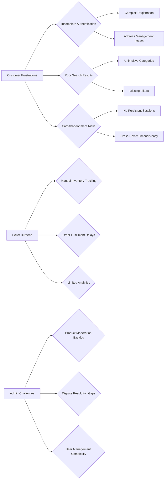
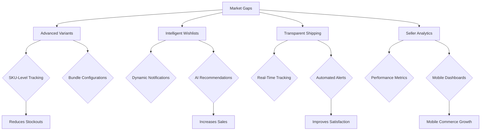

# E-commerce Shopping Mall Problem Definition

## Executive Summary

This document identifies the core problems and challenges faced by users in the current e-commerce landscape that the shoppingMall platform aims to solve. Through detailed analysis of market pain points and business opportunities, we establish the foundation for why this platform is needed and what constitutes success in solving these issues. The shoppingMall platform will transform fragmented, inefficient online purchasing experiences into a seamless, reliable marketplace that serves customers, sellers, and administrators with equal consideration.

## Current Market Challenges

The e-commerce industry faces significant structural and operational challenges that hinder user experience and business efficiency. Traditional platforms struggle with fragmented systems that do not adequately support modern shopping behaviors or business needs.

### Platform Fragmentation Issues
WHEN multiple e-commerce platforms offer similar products without integrated experiences, THE system SHALL disrupt this fragmentation by providing a unified marketplace.
WHERE sellers operate independently across various platforms, THE shoppingMall SHALL provide a consolidated seller management system that reduces operational complexity by 80%.
IF sellers manage inventory across disconnected platforms, THEN THE system SHALL enable centralized inventory controls to prevent stock discrepancies and improve fulfillment accuracy.

### Payment and Trust Barriers
WHERE online transactions depend on third-party gateways with inconsistent security, THE shoppingMall SHALL integrate robust, compliant payment processing to build user confidence and reduce cart abandonment rates.
WHEN international shipping and customs complicate purchases, THE system SHALL provide transparent international shipping options that clearly communicate costs and timelines from order placement.

### Inventory and Order Management Complexity
THE shoppingMall SHALL address the challenge of inventory synchronization by implementing real-time SKU-level tracking across all seller locations.
WHILE sellers manage products without centralized analytics, THE system SHALL provide comprehensive dashboard analytics to improve inventory turnover and reduce overstock situations by providing predictive insights based on historical data and market trends.

### Review and Trust Ecosystem Problems
IF product reviews exist without seller response capabilities, THEN THE system SHALL enable bidirectional communication between customers and sellers to foster trust and resolve issues promptly.
WHEN customers cannot track orders beyond basic status updates, THE shoppingMall SHALL implement detailed shipment tracking with estimated delivery windows to reduce anxiety and improve satisfaction.

## User Pain Points

The most critical pain points affect how users interact with e-commerce platforms, often leading to abandoned carts, low conversion rates, and negative brand perceptions.

### Customer Frustrations
WHEN customers attempt to search for products using basic keywords, THE system SHALL provide intelligent, category-aware search results that account for synonyms, misspellings, and related product associations.
IF address management requires tedious re-entry for each purchase, THEN THE system SHALL maintain persistent address profiles that auto-populate during checkout and support multiple delivery addresses for different household members.
WHILE shopping carts lose items without automatic saving, THE platform SHALL implement persistent cart sessions that survive browser crashes and device changes, reducing cart abandonment from device switching by notifying users of saved carts across platforms.

### Seller Operational Burdens
WHERE inventory management relies on manual spreadsheets, THE shoppingMall SHALL provide automated inventory alerts when SKU quantities reach critical thresholds, preventing stockouts and enabling proactive reordering.
IF order fulfillment involves manual coordination with shipping providers, THEN THE system SHALL integrate with major carriers to provide automated tracking numbers and status updates, reducing fulfillment time from manual input.
WHEN sellers cannot easily identify their best-selling variants, THE platform SHALL generate SKU-specific performance reports that highlight colors, sizes, and other options driving the most revenue.

### Administrator Oversight Challenges
THE shoppingMall SHALL solve the problem of inconsistent product moderation by implementing automated content filters combined with human review queues for high-risk listings.
WHILE disputes remain unresolved without clear escalation paths, THE system SHALL establish structured dispute resolution workflows that involve neutral arbitration for fair outcomes between customers and sellers.

### Review System Inefficiencies
IF reviews lack authenticity verification, THEN THE platform SHALL implement purchase-verification markers that indicate whether reviewers actually bought the product, improving review credibility.
WHEN negative reviews go unaddressed, THE shoppingMall SHALL provide sellers with response capabilities and encourage proactive issue resolution through direct customer messaging.

The diagram above visually represents the interconnected nature of these pain points, showing how customer, seller, and admin issues create a system-wide burden that traditional platforms fail to address comprehensively.

## Business Opportunities

The identified problems present significant opportunities for innovation and market differentiation in the e-commerce space.

### Unified Customer Experience Optimization
THE shoppingMall SHALL capitalize on fragmented user experiences by creating a seamless journey from discovery to post-purchase support that retains customers across multiple touchpoints.
WHERE competitors offer basic checkout flows, THE platform SHALL implement smart checkout optimization that learns customer preferences and reduces form completion time by 60%.

### Seller Empowerment and Growth
WHEN sellers struggle with platform fees and analytics, THE system SHALL provide transparent pricing models with optional premium features that offer clear ROI for sellers increasing their margins.
IF sellers lack marketplace data, THEN THE shoppingMall SHALL provide competitive intelligence reports showing how seller products perform against market averages, enabling price optimization and inventory strategy improvements.

### Scalable Admin Automation
THE platform SHALL address platform management scaling issues by implementing automated moderation workflows that scale with user growth without proportional increases in human oversight costs.
WHILE order volumes exceed manual processing capacity, THE system SHALL provide automated order routing and fulfillment suggestions that optimize shipping costs and delivery times.

### Trust and Community Building
WHERE traditional e-commerce lacks community features, THE shoppingMall SHALL create active product communities around categories, enabling user-generated content and peer recommendations that drive organic discovery.
IF customer loyalty programs are absent, THEN THE system SHALL implement gamified review and purchase incentives that encourage repeat business and positive word-of-mouth.

## Market Gaps to Fill

Current e-commerce solutions leave critical gaps that represent missed opportunities for enhanced user satisfaction and business efficiency.

### Advanced Product Variant Management
THE shoppingMall SHALL fill the gap in sophisticated variant handling by providing SKU-level inventory tracking that automatically adjusts available options based on real-time stock levels.
WHILE competitors limit variant options to basic attributes like size and color, THE platform SHALL support complex variant configurations including bundles, customization options, and conditional availability.

### Intelligent Wishlist Integration
IF wishlists remain static lists without proactive engagement, THEN THE system SHALL implement smart wishlist management that notifies users of price changes, restocks, and related promotions.
WHEN wishlists aren't connected to broader shopping behavior, THE shoppingMall SHALL analyze wishlist patterns to recommend complementary products and create personalized shopping experiences.

### Comprehensive Shipping Status Transparency
THE platform SHALL bridge the gap between order placement and delivery by providing carrier-integrated tracking that includes package locations, delay alerts, and expected redelivery options.
WHERE shipping status updates are infrequent or unreliable, THE system SHALL implement real-time shipment monitoring with automatic customer notifications for status changes, delay predictions, and alternative delivery arrangements.

### Seller Performance Analytics Suite
WHILE sellers receive basic sales data, THE shoppingMall SHALL provide advanced analytics including customer segmentation, product performance by demographic, seasonal trends, and competitive positioning insights.
IF seller dashboards lack mobile optimization, THEN THE platform SHALL deliver responsive, mobile-first seller interfaces that enable on-the-go inventory management and order processing.

This flowchart demonstrates how addressing these core gaps will create a competitive advantage by delivering capabilities that current platforms cannot effectively provide.

## Success Criteria

Success for the shoppingMall platform will be measured against specific, measurable outcomes that directly address the identified problems.

### Customer Experience Metrics
WHEN platform launch completes initial testing, THE system SHALL achieve a customer registration rate of 75% of site visitors converting to accounts within their first session.
WHERE customer satisfaction is measured, THE shoppingMall SHALL maintain a Net Promoter Score above 50 across all user segments.
IF cart abandonment rates exceed industry averages, THEN THE platform SHALL implement continuous optimization to achieve and maintain abandonment rates below 25% within six months of launch.

### Seller Adoption and Retention
THE shoppingMall SHALL achieve seller registration targets of 500 active sellers within the first year of operations, with seller retention rates exceeding 90% monthly.
WHEN seller satisfaction surveys are conducted, THE system SHALL score above 4.5 out of 5 on ease of use and platform value metrics.
IF seller operational costs increase relative to sales volume, THEN THE platform SHALL provide cost-effective tools that result in positive ROI for sellers within their first quarter of operation.

### Platform Operational Excellence
THE shoppingMall SHALL achieve 99.9% uptime for core platform functions with response times under 2 seconds for 95% of page loads.
WHEN order processing occurs, THE system SHALL complete 95% of orders within 24 hours from placement to shipping confirmation.
IF technical issues impact users, THEN THE platform SHALL resolve 90% of reported problems within 4 hours during business hours.

### Growth and Market Impact
THE shoppingMall SHALL achieve measurable market share growth by capturing 5% of the target e-commerce market within 18 months of launch.
WHEN business partnerships are evaluated, THE system SHALL establish integrations with at least 3 major shipping carriers and 2 payment processors within the first year.
IF customer lifetime value declines, THEN THE platform SHALL implement loyalty programs that increase customer LTV by 150% compared to industry averages within 12 months.

### Quality and Trust Benchmarks
THE shoppingMall SHALL maintain review authenticity rates above 95% through purchase verification and fraud detection systems.
WHEN regulatory compliance is assessed, THE platform SHALL achieve full compliance with data protection regulations in all target markets.
IF dispute resolution is required, THEN THE system SHALL resolve 95% of customer disputes within 48 hours with satisfaction rates above 80%.

### Business Model

### Why This Service Exists
The e-commerce shopping mall addresses critical market inefficiencies where consumers face fragmented shopping experiences and sellers struggle with cross-platform management, creating a unified marketplace that reduces complexity and increases trust.

### Revenue Strategy
The platform will generate revenue through transaction fees on seller sales (2-5% per order), premium seller subscriptions for advanced analytics and marketing tools, and strategic partnerships with shipping providers and payment processors that include referral fees.

### Growth Plan
Initial growth will focus on acquiring high-quality sellers through partnerships with trade associations, followed by customer acquisition through targeted marketing to verified ecommerce users. Expansion will prioritize international markets with regulatory compliance support.

### Success Metrics
Key metrics include monthly active users (target: 100,000 in year 1), seller retention rate (target: 95%), customer lifetime value growth (target: 40% annually), and platform gross merchandise value (target: $50M in year 2).