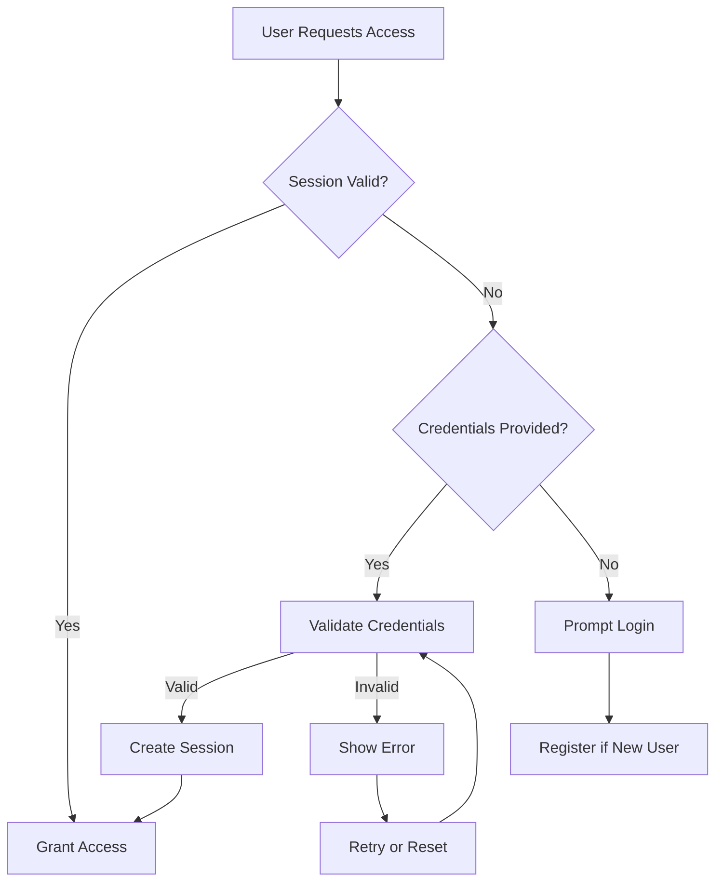
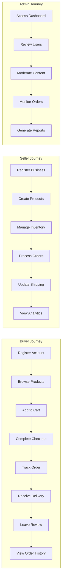
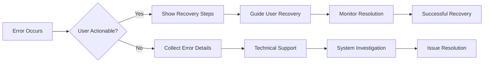
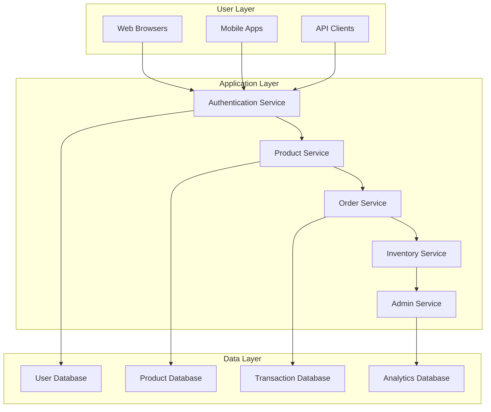

# Requirements Analysis Report for E-Commerce Shopping Mall Platform

## Introduction

### Purpose of This Document
This Requirements Analysis Report provides a comprehensive specification of the business requirements for the E-Commerce Shopping Mall Platform. The document focuses exclusively on business logic, user interactions, and functional capabilities in natural language, removing all ambiguity for backend developers.

### Scope
The platform will support three primary user roles: buyers (customers), sellers (merchants), and admins (system managers). Key features include user registration and address management, product catalog with search, product variants with SKU, shopping cart and wishlist, order processing, payment integration, shipping tracking, product reviews, seller account management, inventory tracking, order history and cancellation/refunds, and admin oversight.

Additional business processes include order fulfillment workflows, inventory synchronization, seller verification processes, and automated notifications for all user interactions.

### Business Context
The platform serves as a comprehensive digital marketplace where buyers can discover and purchase products, sellers can list and manage their inventory, and administrators can oversee platform operations. Revenue will be generated through transaction fees, seller subscriptions, or advertising.

### Assumptions
- Users have basic internet access and familiarity with online shopping.
- Payment processing will integrate with third-party gateways.
- Shipping will be handled by external providers with API tracking.
- The platform will operate 24/7 with high availability.

### Success Criteria
- Buyers can complete purchases effortlessly with clear product information and secure payments.
- Sellers can effectively manage their product listings and sales analytics.
- Admins can monitor and moderate all platform activities.
- System response times remain under 2 seconds for critical operations.

## Business Model

### Revenue Streams
The platform will generate revenue through multiple channels:
- Commission fees on successful transactions (e.g., 5-10% per sale)
- Premium seller subscriptions for enhanced features like analytics and priority support
- Advertising placements for featured products or categories
- Optional shipping and fulfillment services

### Market Position
This platform differentiates itself through:
- Comprehensive product variant management with detailed SKUs
- Transparent seller ratings and review systems
- Robust inventory synchronization across sellers

### Growth Strategy
- Acquire initial sellers through partnerships with existing merchants
- Attract buyers through SEO optimization and social media marketing
- Expand geography after successful domestic launch
- Add marketplace features like live chat support and AI recommendations

WHEN a seller registers an account, THE system SHALL collect business information including tax ID and verification documents.

WHEN a buyer completes a purchase, THE system SHALL process payment through integrated gateways and confirm transaction within 3 seconds.

IF a seller achieves performance benchmarks, THEN THE system SHALL reduce their commission fees automatically.

## User Roles and Authentication

### Role Definitions
The system supports three primary user roles:

**Buyer (Customer)**: Authenticated users who can browse products, add items to cart/wishlist, place orders, track shipments, leave reviews, manage addresses, and view order history. They have read-only access to product information and limited account management capabilities.

During buyer registration, WHEN a buyer provides registration details, THE system SHALL validate email format and ensure unique email addresses. WHILE a buyer browses products, THE system SHALL allow adding items to cart without authentication. IF a buyer attempts to checkout without login, THEN THE system SHALL prompt authentication before proceeding.

**Seller (Merchant)**: Authenticated users who can create and manage product listings with variants, manage inventory per SKU, view sales analytics, process refunds, and update shipping status. They have restricted access limited to their own products and sales data.

WHEN a seller registers, THE system SHALL require additional business verification beyond standard user registration. WHILE sellers manage products, THE system SHALL restrict access to their own listings only. IF a seller attempts unauthorized access to other sellers' data, THEN THE system SHALL deny access and log the incident.

**Admin**: System administrators with elevated permissions to manage all user accounts, review seller approvals, moderate product listings and reviews, oversee all orders, and access system-wide analytics and settings.

WHEN an admin logs in, THE system SHALL require multi-factor authentication for enhanced security. WHILE admins review seller applications, THE system SHALL provide comprehensive verification tools. IF an admin modifies user accounts, THEN THE system SHALL log all changes for audit purposes.

### Authentication Requirements
WHEN a user attempts to register, THE system SHALL validate email format and password strength (minimum 8 characters, uppercase, lowercase, number, special character).

WHEN a user submits login credentials, THE system SHALL authenticate and respond within 1.5 seconds for 95% of requests.

WHILE a user session is active, THE system SHALL maintain session integrity and expire sessions after 24 hours of inactivity.

IF authentication fails due to invalid credentials, THE system SHALL attempt to distinguish between invalid username and password and provide appropriate feedback without revealing account existence.

WHEN a user requests password reset, THE system SHALL send a secure email link valid for 15 minutes and require current password knowledge if logged in.

THE system SHALL support social media authentication integration for faster registration.

### Permission Matrix

| Feature | Buyer | Seller | Admin |
|---------|-------|--------|-------|
| Browse products | Yes | Yes | Yes |
| Search products | Yes | Yes | Yes |
| Add to cart/wishlist | Yes | No | No |
| Place orders | Yes | No | No |
| Track orders | Yes | No | Yes |
| Leave reviews | Yes | No | No |
| Manage own products | No | Yes | No |
| View sales analytics | No | Yes | Yes |
| Manage inventory | No | Yes | No |
| Moderate content | No | No | Yes |
| Approve sellers | No | No | Yes |
| System administration | No | No | Yes |

WHEN a buyer attempts to access seller features, THE system SHALL redirect to buyer dashboard with appropriate messaging. WHILE sellers manage their products, THE system SHALL restrict viewing other sellers' data. WHERE admin oversight is required, THE system SHALL log all admin actions for compliance.

### Authentication Workflow Diagram

WHEN a user attempts login without valid session, THE system SHALL present authentication form with clear instructions. IF credentials are valid, THEN THE system SHALL establish secure session and redirect to appropriate dashboard. IF invalid, THEN THE system SHALL provide feedback and limit retry attempts to prevent brute force attacks.

## Functional Requirements

### User Registration and Address Management

WHEN a new user registers, THE system SHALL collect email, password, and basic profile information including full name and preferred language.

THE system SHALL store multiple shipping addresses per user account with validation for postal codes and country-specific formats.

IF a user provides invalid address information, THEN THE system SHALL highlight specific fields and provide guidance based on country requirements.

WHEN a buyer places an order, THE system SHALL allow selection from saved addresses or entry of new addresses with auto-save option.

WHEN a user updates address information, THE system SHALL require confirmation to prevent accidental changes.

THE system SHALL support address verification through third-party services for accuracy.

WHEN a user deletes an address, THE system SHALL check if it's referenced by pending orders before allowing deletion.

### Product Catalog and Search

WHEN a buyer searches for products, THE system SHALL support full-text search across product names, descriptions, categories, and seller names.

THE system SHALL categorize products hierarchically with support for multiple category assignments.

WHEN displaying search results, THE system SHALL sort by relevance with options for price, rating, and date added.

THE system SHALL support advanced filters including price range, color, size, brand, and shipping availability.

IF no results match the search, THEN THE system SHALL provide suggestions for alternative searches or popular categories.

WHEN a buyer views product categories, THE system SHALL display subcategories and product counts.

THE system SHALL implement search result caching for frequently searched terms to improve performance.

### Product Variants and SKU Management

WHEN a seller creates a product, THE system SHALL require base product information and allow addition of variants with unique SKU assignments.

THE system SHALL support variants for color, size, material, and custom attributes as defined by the seller.

WHEN a buyer selects variant options, THE system SHALL update price, availability, and images in real-time.

THE system SHALL prevent duplicate SKUs across the platform with automatic SKU generation suggestions.

WHEN inventory changes for specific SKUs, THE system SHALL update availability status immediately across all listings.

WHERE product variants share common attributes, THE system SHALL allow bulk updates to pricing or inventory.

### Shopping Cart and Wishlist Management

WHEN a buyer adds a product to cart, THE system SHALL reserve inventory for 30 minutes to prevent over-selling.

THE system SHALL maintain cart contents across devices when user is authenticated.

WHEN displaying cart, THE system SHALL show real-time pricing including any applicable discounts or taxes.

IF a cart item becomes unavailable, THEN THE system SHALL notify the buyer and remove expired reservations.

WHEN a buyer moves items from wishlist to cart, THE system SHALL check current availability and update reservations.

THE system SHALL support cart sharing options for collaborative shopping scenarios.

WHERE buyers have saved carts, THE system SHALL allow multiple cart management for different purposes.

### Order Placement and Payment Processing

WHEN a buyer initiates checkout, THE system SHALL validate cart contents against current inventory and pricing.

THE system SHALL integrate with multiple payment gateways supporting credit cards, digital wallets, and bank transfers.

WHEN processing payment, THE system SHALL implement fraud detection based on transaction patterns and buyer history.

IF payment succeeds, THEN THE system SHALL create order record with confirmation number and send email notification.

WHERE payment fails, THE system SHALL provide specific error messages and retry options without exposing sensitive information.

THE system SHALL support partial payments and installment options for high-value transactions.

WHEN an order is confirmed, THE system SHALL allocate inventory and initiate fulfillment process.

### Order Tracking and Shipping Status Updates

WHEN an order ships, THE system SHALL update status automatically from shipping provider integrations.

THE system SHALL provide detailed tracking information including carrier, tracking number, and estimated delivery.

WHEN delivery status changes, THE system SHALL send proactive notifications to buyer and seller.

IF a shipment is delayed, THEN THE system SHALL identify delay reasons when available and provide updated estimates.

THE system SHALL maintain shipping history for compliance and customer support reference.

WHERE international shipping occurs, THE system SHALL display customs information and additional fees.

### Product Reviews and Ratings System

WHEN a buyer receives an order, THE system SHALL prompt for review submission with rating and text feedback.

THE system SHALL calculate average ratings and display them prominently on product pages.

WHEN publishing reviews, THE system SHALL filter inappropriate content and verify purchase authenticity.

THE system SHALL support review helpfulness voting to prioritize quality feedback.

WHERE reviews include photos or videos, THE system SHALL moderate media content before publication.

THE system SHALL notify sellers of new reviews for response opportunities.

### Seller Account Management and Product Listings

WHEN a seller registers, THE system SHALL guide through business verification process including document uploads.

THE system SHALL provide seller dashboards with real-time sales metrics and pending order notifications.

WHEN sellers list products, THE system SHALL validate product information and check for platform compliance.

THE system SHALL support bulk product uploads through CSV templates with error handling.

WHERE sellers manage multiple products, THE system SHALL provide categorization tools and bulk editing features.

### Inventory Management per SKU

WHEN sellers update inventory, THE system SHALL validate numeric inputs and prevent negative stock levels.

THE system SHALL support automatic inventory synchronization with external systems through API integrations.

WHEN inventory drops below thresholds, THE system SHALL send alerts to sellers via multiple channels.

THE system SHALL track inventory changes with audit trails including source (manual entry, order fulfillment, returns).

WHERE inventory management includes automated reordering, THE system SHALL support vendor integration.

### Order History and Cancellation/Refund Management

THE system SHALL maintain comprehensive order history with status changes and communications.

WHEN buyers request order cancellation, THE system SHALL check eligibility based on order status and time limits.

WHERE cancellations are approved, THE system SHALL process refunds and update inventory automatically.

THE system SHALL support partial refunds for returns and exchanges with appropriate documentation.

WHEN Refund Requests are submitted, THE system SHALL route them through appropriate approval processes.

### Admin Dashboard for Platform Oversight

WHEN admins log in, THE system SHALL display key performance indicators including active users and transaction volumes.

THE system SHALL provide tools for user account management including suspension and reinstatement capabilities.

WHERE violated content is detected, THE system SHALL provide moderation tools for rapid response.

THE system SHALL generate detailed reports on platform usage, revenue, and user behavior.

WHEN operational issues occur, THE system SHALL provide admin tools for troubleshooting and user communication.

### Complete User Journey Workflows

WHEN a user completes registration, THE system SHALL send welcome email with platform navigation guide.

WHILE buyers shop, THE system SHALL suggest personalized recommendations based on browsing history.

WHERE sellers receive orders, THE system SHALL automatically notify them with order details and fulfillment instructions.

## Business Rules and Validation

### Product Management Rules

WHEN a seller submits a product, THE system SHALL require minimum information: title (3-100 characters), description (50-5000 characters), price ($0.01-$100,000), and category assignment.

THE system SHALL validate product images meet minimum resolution requirements (400x400 pixels) and file size limits (under 5MB).

IF a product lacks variants but should have them based on category, THEN THE system SHALL prompt the seller to add variants.

THE system SHALL prevent products with identical SKUs from being created.

WHEN products are updated, THE system SHALL preserve review integrity by maintaining historical pricing information.

### Order Processing Rules

THE system SHALL enforce order minimums ($10) and maximums ($50,000) per transaction.

WHEN processing orders, THE system SHALL apply regional tax calculations automatically.

IF an order exceeds seller inventory during checkout, THEN THE system SHALL prevent completion and notify the buyer.

THE system SHALL support order splitting for items from multiple sellers within a single transaction.

WHEN orders are cancelled, THE system SHALL process refunds within 3-5 business days.

### Inventory Control Rules

THE system SHALL maintain inventory accuracy through atomic operations preventing race conditions.

WHEN inventory is updated, THE system SHALL validate quantities are whole numbers or decimal values as appropriate.

THE system SHALL support backorder settings where sellers allow purchases beyond current inventory.

WHERE automatic reordering is enabled, THE system SHALL trigger alerts when inventory reaches seller-defined thresholds.

### Review System Rules

THE system SHALL require verified purchase confirmation before allowing review submission.

Reviews SHALL be limited to 2000 characters with optional photo attachments (up to 5 images).

THE system SHALL display reviews chronologically with pagination for products with many reviews.

WHEN reviews are reported as inappropriate, THE system SHALL hide them pending admin review.

### Validation Logic

Email addresses SHALL follow RFC 5322 format validation with domain verification.

Passwords SHALL require complexity verification and SHALL NOT allow common dictionary words.

Addresses SHALL validate against postal service databases for accuracy.

Product SKUs SHALL follow format validation (alphanumeric with hyphens, 3-50 characters).

Pricing SHALL allow decimal values with maximum 2 decimal places.

## Error Handling and Recovery Processes

### User-Friendly Error Messages

WHEN registration fails due to duplicate email, THE system SHALL display "This email is already registered. Try logging in or reset password."

WHEN payment processing fails, THE system SHALL show specific reasons without technical jargon:
- "Insufficient funds" for declined payments
- "Card expired" for expired cards
- "Invalid card details" for formatting issues

WHEN shipping integration is unavailable, THE system SHALL display "Tracking information temporarily unavailable. Order will be delivered on or before [date]."

### Recovery Workflows

WHEN a user encounters a system error, THE system SHALL provide clear recovery steps:
1. Refresh the page
2. Clear browser cache
3. Contact customer support with error reference number

WHEN payment fails during checkout, THE system SHALL:
- Preserve cart contents and shipping selection
- Offer alternative payment methods
- Provide direct link to retry last transaction

WHEN order tracking fails, THE system SHALL:
- Display last known status
- Provide carrier contact information
- Offer to resend tracking details via email

### Technical Error Handling

WHEN API integrations fail, THE system SHALL implement exponential backoff retry mechanisms.

WHEN database connection issues occur, THE system SHALL queue transactions and process when connection restores.

WHEN file upload errors happen, THE system SHALL maintain partial upload state and allow resume capability.

### Security Incident Response

IF unusual login attempts are detected, THE system SHALL lock accounts temporarily and require additional verification.

WHEN data breaches are suspected, THE system SHALL log incident details and follow established response procedures.

WHERE encryption failures occur, THE system SHALL isolate affected data and prevent access until resolved.

### Process Diagrams for Error Handling

WHEN network connectivity issues interrupt user sessions, THE system SHALL preserve work in progress and offer continuation upon reconnection.

## Non-Functional Requirements

### Performance Expectations

THE system SHALL respond to all search queries within 1 second for 90% of requests.

THE system SHALL process order placements within 3 seconds under normal load conditions.

THE system SHALL support 5,000 concurrent users with response times under 2 seconds.

THE system SHALL maintain 99.9% uptime excluding scheduled maintenance windows.

### Scalability Requirements

THE system SHALL scale horizontally to support 50,000+ concurrent users during peak shopping periods.

THE system SHALL implement database sharding for user data and transaction records.

THE system SHALL support geographic data replication for international expansion.

### Usability Standards

THE system SHALL provide consistent interface elements across all user roles.

THE system SHALL support mobile-optimized interfaces with responsive design.

THE system SHALL implement accessibility standards (WCAG 2.1 AA compliance).

### Availability Requirements

THE system SHALL operate 24 hours daily with planned maintenance limited to 4 hours weekly.

THE system SHALL provide status page updates during outages with estimated restoration times.

THE system SHALL implement disaster recovery procedures with 4-hour maximum downtime.

## Architecture Considerations

### High-Level System Architecture

WHEN a user accesses the platform, THE system SHALL route requests through appropriate service layers based on functionality requirements.

### Integration Points

THE system SHALL provide RESTful APIs for external integrations including payment gateways, shipping providers, and third-party applications.

WHEN integrating with external services, THE system SHALL implement retry logic and circuit breaker patterns to handle failures gracefully.

## Related Documents

For detailed user journey narratives, refer to the User Journeys Documentation.

For comprehensive business rules, see the Business Rules Documentation.

For error scenarios and recovery processes, consult the Error Handling Documentation.

For performance and availability standards, review the Performance Expectations Documentation.

For external service integrations, see the External Integrations Documentation.

For security requirements, refer to the Security Compliance Documentation.

## Conclusion

This requirements analysis provides the foundation for implementing a comprehensive e-commerce shopping mall platform that meets business needs while ensuring scalability, security, and user satisfaction. The document specifies measurable requirements using the EARS format to eliminate ambiguity for development teams. All technical implementation details remain the discretion of the development team while maintaining the specified business logic and user experience requirements.

The platform's success depends on seamless integration of buyer shopping experiences, seller management tools, and administrative oversight within a secure, scalable architecture. Implementation should prioritize core shopping workflows while building foundations for future enhancements as outlined in the roadmap documentation.