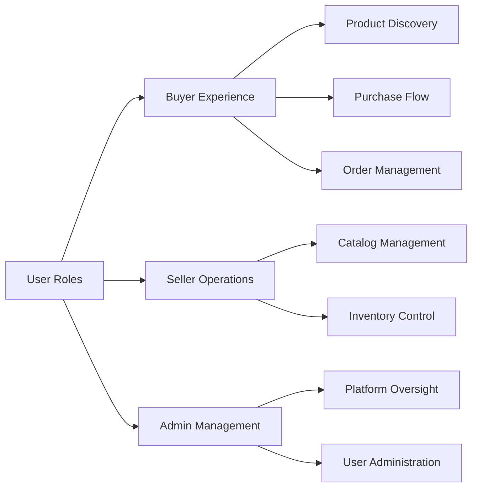
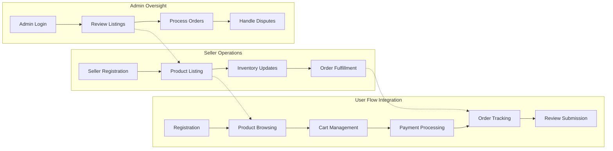

# Core Features and Business Requirements

## Introduction

This document outlines the core features and business requirements for the e-commerce shopping mall platform (service prefix: shoppingPlatform). It specifies the functional requirements that must be implemented to support the platform's business operations. All requirements are expressed in natural language using the EARS (Easy Approach to Requirements Syntax) format where applicable, focusing exclusively on business logic and user needs rather than technical implementation details.

The platform supports three primary user roles as defined in the user roles documentation:
- Buyers: Authenticated users who browse, purchase, and track orders
- Sellers: Authenticated users who manage product listings and inventory
- Admins: System administrators with oversight of platform operations

These requirements build upon the user journeys defined in the related user journeys document.

## Overall System Architecture

## Core Business Requirements

### User Registration and Address Management

THE system SHALL support new user registration with email and password verification.

THE system SHALL allow users to maintain multiple delivery addresses.

THE system SHALL validate email format and password strength during registration.

WHEN a user registers, THE system SHALL send a verification email.

IF a user provides invalid registration data, THEN THE system SHALL display specific error messages.

WHILE a user is logged in, THE system SHALL remember their default delivery address.

THE system SHALL allow users to add, edit, and delete delivery addresses in their profile.

WHEN a user adds a new address, THE system SHALL validate required fields including street, city, postal code, and country.

### Product Catalog and Search

THE system SHALL display products organized in hierarchical categories.

THE system SHALL support full-text search across product names, descriptions, and tags.

WHEN a user performs a search, THE system SHALL return results ranked by relevance.

THE system SHALL allow filtering products by category, price range, brand, and availability.

THE system SHALL display product listings with thumbnail images, prices, and ratings.

WHILE browsing categories, THE system SHALL show subcategories and product counts.

THE system SHALL support sorting products by price, rating, popularity, and date added.

### Product Variants and SKU Management

THE system SHALL support product variants with different colors, sizes, and options.

EACH product variant SHALL have a unique SKU for inventory tracking.

WHEN creating a variant, THE system SHALL require specification of all applicable attributes.

THE system SHALL prevent duplicate SKUs across all products.

THE system SHALL display variant options on product detail pages with visual selection.

WHEN a variant is out of stock, THE system SHALL indicate unavailability clearly.

THE system SHALL maintain separate pricing for different variants when applicable.

### Shopping Cart and Wishlist

THE system SHALL allow adding products to a shopping cart with quantity selection.

WHEN adding to cart, THE system SHALL check inventory availability.

THE system SHALL persist cart contents across user sessions.

THE system SHALL support multiple products in cart with variant selections.

WHEN updating quantities, THE system SHALL recalculate totals automatically.

THE system SHALL provide cart summary with subtotal, taxes, and shipping estimates.

THE system SHALL allow saving products to a wishlist for future reference.

WHEN a wishlisted item becomes available, THE system SHALL send notification (if enabled).

### Order Placement and Payment Processing

WHEN a user initiates checkout, THE system SHALL validate cart contents and user authentication.

THE system SHALL calculate order total including items, taxes, and shipping costs.

THE system SHALL integrate with payment gateways for secure transaction processing.

WHEN payment is successful, THE system SHALL create order records.

IF payment fails, THEN THE system SHALL display appropriate error messages without exposing sensitive data.

THE system SHALL generate unique order numbers for tracking.

WHILE processing payment, THE system SHALL hold inventory to prevent overselling.

### Order Tracking and Shipping Status Updates

THE system SHALL display detailed order history for authenticated users.

EACH order SHALL have a tracking number linked to shipping provider.

WHEN shipping status changes, THE system SHALL update order records automatically.

THE system SHALL send email notifications for major order status changes.

WHEN a user views order details, THE system SHALL show estimated delivery dates.

THE system SHALL support multiple shipping carriers with different service levels.

### Product Reviews and Ratings

THE system SHALL allow verified buyers to submit product reviews.

EACH review SHALL include star rating and text comments.

THE system SHALL display average ratings on product listing pages.

WHEN displaying reviews, THE system SHALL show only verified purchase reviews.

THE system SHALL allow review helpfulness voting by other users.

IF inappropriate content is detected, THEN THE system SHALL allow admin moderation of reviews.

THE system SHALL prevent duplicate reviews from the same buyer for the same product.

### Seller Accounts and Product Management

WHEN a seller registers, THE system SHALL require business verification information.

THE system SHALL provide sellers with dashboards for product management.

SELLERS SHALL manage their product catalogs including adding, editing, and removing products.

WHEN a seller adds products, THE system SHALL validate all required fields.

THE system SHALL allow sellers to set pricing and manage variant configurations.

SELLERS SHALL view their sales performance and order fulfillment requirements.

### Inventory Management per SKU

THE system SHALL track inventory levels by SKU for each product variant.

WHEN inventory reaches threshold, THE system SHALL notify sellers automatically.

THE system SHALL prevent orders when inventory is insufficient.

SELLERS SHALL update inventory quantities in real-time.

THE system SHALL support low-stock alerts and out-of-stock notifications.

WHEN inventory changes, THE system SHALL update availability status across the platform.

### Order History and Cancellation/Refund Requests

THE system SHALL maintain comprehensive order history for all users.

WHEN an order is placed, THE system SHALL record complete transaction details.

USERS SHALL cancel orders within a configurable time window after placement.

THE system SHALL support refund requests with appropriate justifications.

WHEN processing refunds, THE system SHALL handle payment reversals through gateways.

ADMIN SHALL have oversight of all cancellation and refund requests.

THE system SHALL send confirmation emails for all order status changes.

### Admin Dashboard for Order and Product Management

ADMIN SHALL access dashboards for platform-wide monitoring.

WHEN viewing orders, ADMIN SHALL filter by status, date, seller, or buyer.

ADMIN SHALL approve or reject seller account registrations.

ADMIN SHALL moderate product listings for compliance.

WHEN issues are detected, ADMIN SHALL have tools to investigate and resolve problems.

THE system SHALL provide analytics views of platform performance.

ADMIN SHALL manage system-wide settings including policies and fees.

## Feature Interactions

The features interact in several key ways:

## Success Criteria

The platform SHALL be considered successful when:
- 95% of registered users complete at least one purchase within 30 days
- Average order processing time is under 5 minutes during peak hours
- 99% order accuracy with no inventory discrepancies
- Customer satisfaction rating above 4.5 out of 5 stars
- Seller onboarding time reduced to under 2 business days
- System handles 1,000 concurrent users without performance degradation

## Assumptions and Dependencies

This document assumes:
- Third-party payment gateways are integrated as specified in external integrations document
- Shipping providers support status update APIs
- Email service providers handle notification delivery
- Database performance supports the transaction volumes outlined in performance expectations
- Legal and compliance requirements are met as specified in security and compliance document