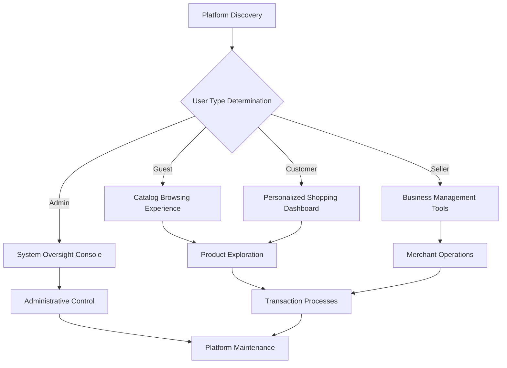
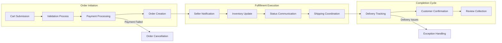
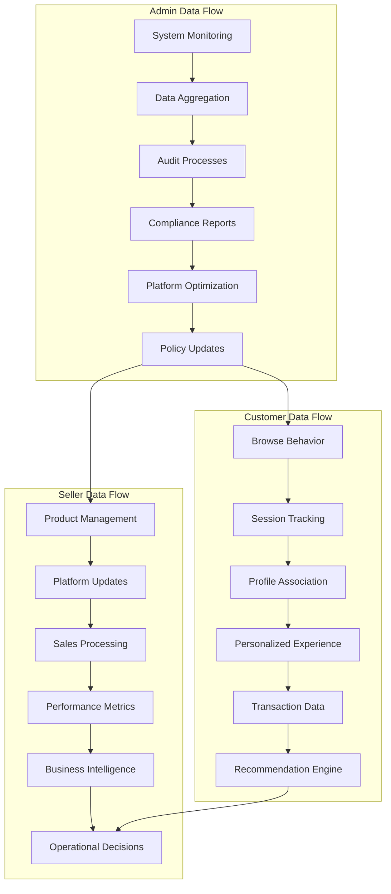

# Service Operations Overview

## Overview

This document provides a comprehensive overview of the end-to-end operational flow for the shoppingMall e-commerce platform. It describes the complete user experience lifecycle, from initial platform access through business operations to final delivery process.

The platform supports four primary user actor types: guests for browsing, customers for purchases, sellers for product management, and administrators for system oversight. Each actor follows distinct operational flows that integrate seamlessly to create a cohesive marketplace ecosystem.

The overview establishes the foundation for detailed scenario documentation by explaining business processes and user workflows in natural language, ensuring all stakeholders understand how the platform operates as a unified business system.

## Platform Entry Points

The shoppingMall platform provides multiple access pathways designed to accommodate different user types and their evolving needs throughout their marketplace journey.

### Anonymous Guest Access

WHEN a visitor first discovers the platform through search engines or direct navigation, THE system SHALL present an intuitive homepage featuring curated product categories and featured sellers.

WHEN a guest user begins browsing product categories, THE system SHALL display product listings with images, basic pricing, and availability indicators without requiring registration.

WHEN a guest encounters limited functionality such as cart persistence or wishlist creation, THE system SHALL prompt registration with clear benefits explanation and simplified signup process.

WHEN a guest initiates contact regarding products or platform policies, THE system SHALL provide immediate FAQ responses and guided paths to customer support.

### Registered Customer Entry

WHEN an authenticated customer returns to the platform, THE system SHALL recognize their device and present a personalized dashboard showing recent orders, wishlist items, and browsing recommendations.

WHEN a customer accesses account settings, THE system SHALL display comprehensive profile information including shipping addresses, payment methods, and communication preferences.

WHEN a customer begins a new shopping session, THE system SHALL populate cart with previously saved items and apply active promotions automatically.

WHEN a customer reviews order history, THE system SHALL provide detailed transaction records with actionable options for returns, exchanges, and reorders.

### Seller Management Entry

WHEN a seller accesses their business dashboard, THE system SHALL load current performance metrics including sales velocity, inventory status alerts, and pending order notifications.

WHEN a seller navigates to product management sections, THE system SHALL display all active listings with real-time performance data and quick editing capabilities.

WHEN a seller reviews analytics dashboards, THE system SHALL provide comprehensive business intelligence with exportable reports and trend analysis.

WHEN a seller accesses order fulfillment tools, THE system SHALL prioritize pending orders by urgency and provide integrated shipping options.

### Administrative System Access

WHEN an administrator logs into the management console, THE system SHALL authenticate with multi-factor requirements and present comprehensive platform health metrics.

WHEN an administrator accesses oversight tools, THE system SHALL display system-wide analytics including user engagement patterns, order processing efficiency, and dispute resolution queue status.

WHEN an administrator reviews system alerts, THE system SHALL categorize issues by severity with actionable response options and automated resolution recommendations.

WHEN an administrator performs bulk operations, THE system SHALL provide validation safeguards and progress tracking for system integrity protection.

## Core Business Processes

The shoppingMall platform operates through interconnected business processes that create a seamless marketplace experience across all user types.

### Product Lifecycle Management

WHEN a seller introduces a new product to the marketplace, THE system SHALL validate the product information against platform standards and assign unique identifier tracking.

WHEN a product reaches inventory thresholds, THE system SHALL automatically notify the seller through multiple channels (email, dashboard alerts, SMS) with recommended restocking actions.

WHEN a product requires quality or policy review, THE system SHALL route the listing to appropriate administrators with complete documentation and approval workflow tracking.

WHEN customer demand exceeds available inventory, THE system SHALL manage waitlist registration and provide automatic notifications when products become available again.

WHEN product information requires updates, THE system SHALL propagate changes across all platform surfaces (search results, recommendations, order history) within 5 minutes.

### Order Processing Workflow

WHEN a customer completes purchase checkout, THE system SHALL validate all order components (products, quantities, addresses, payment methods) and create binding order record within 3 seconds.

WHEN payment authorization succeeds, THE system SHALL confirm inventory reservation and initiate seller notification cascade with complete fulfillment information.

WHEN order fulfillment begins, THE system SHALL update status to "processing" and provide estimated completion timeline based on seller performance history.

WHEN shipping information is confirmed, THE system SHALL integrate with carrier tracking systems and provide real-time updates to all affected parties.

WHEN delivery confirmation is received, THE system SHALL automatically transition order status and trigger post-purchase processes including customer feedback requests.

WHEN order exceptions occur (delays, cancellations, returns), THE system SHALL initiate appropriate resolution workflows with clear communication to all stakeholders.

### User Account Lifecycle

WHEN a user begins registration process, THE system SHALL collect appropriate information based on actor type and verify data completeness before account activation.

WHEN user authentication occurs, THE system SHALL maintain session security standards with automatic timeout protections and device tracking capabilities.

WHEN account modifications are requested, THE system SHALL validate authorization requirements and maintain audit trails of all changes.

WHEN account deactivation is initiated, THE system SHALL provide data export options and confirm deletion preferences according to legal requirements.

WHEN user communication preferences change, THE system SHALL immediately update notification settings and honor opt-out requests across all channels.

### Communication and Notification System

WHEN platform events trigger notifications, THE system SHALL select appropriate communication channels based on user preferences and event urgency.

WHEN customer service interactions occur, THE system SHALL maintain comprehensive conversation records and route complex issues to specialized support teams.

WHEN seller communications require escalation, THE system SHALL provide clear escalation pathways and maintain response time SLAs.

WHEN system maintenance affects user operations, THE system SHALL provide advance notifications with estimated completion times and alternative access options.

## Integration Points

The shoppingMall platform integrates with essential external services to provide comprehensive marketplace functionality.

### Payment Processing Integration

WHEN transaction processing occurs, THE system SHALL securely transmit payment information through PCI-compliant gateways with real-time fraud detection capabilities.

WHEN payment confirmation is received, THE system SHALL validate transaction integrity and update financial records within 5 seconds of gateway notification.

WHEN payment disputes arise, THE system SHALL provide comprehensive transaction documentation and automated response templates for dispute resolution.

WHEN international payments are processed, THE system SHALL apply appropriate currency conversion and comply with regional financial regulations.

### Shipping and Logistics Integration

WHEN shipping rates are calculated, THE system SHALL integrate with multiple carriers to provide competitive options based on package characteristics and delivery requirements.

WHEN shipping labels are generated, THE system SHALL transmit complete package information to carrier systems and receive tracking number confirmation immediately.

WHEN delivery status updates are received, THE system SHALL parse carrier notifications and update platform records with consistent status terminology.

WHEN international shipments require customs documentation, THE system SHALL generate appropriate paperwork and provide tracking for customs clearance processes.

### External Service Reliability

WHEN external service disruptions occur, THE system SHALL implement failover mechanisms that maintain core platform functionality using cached data and offline processing capabilities.

WHEN service integration issues are detected, THE system SHALL automatically retry failed operations with exponential backoff strategies and alert technical teams if failures persist.

WHEN new service providers are onboarded, THE system SHALL conduct comprehensive integration testing and maintain parallel operation capabilities during transition periods.

WHEN service provider changes require system updates, THE system SHALL schedule maintenance windows and provide migration tools for seamless transitions.

## Data Flow Concepts

Understanding information movement through the shoppingMall platform enables efficient operations and reliable user experiences.

### Customer Data Journey

WHEN customers browse products, THE system SHALL track behavioral patterns anonymously until login, then associate with personal profiles for enhanced recommendations.

WHEN customers complete purchases, THE system SHALL capture comprehensive transaction data including product preferences, timing, and buying patterns for improved future interactions.

WHEN customers interact with support services, THE system SHALL link communication records with order history for comprehensive service experience management.

WHEN customers update personal information, THE system SHALL validate data integrity and propagate changes across all platform touchpoints immediately.

### Seller Data Operations

WHEN sellers update product information, THE system SHALL validate changes against platform policies and distribute updates across search indexes and recommendation systems.

WHEN sellers process orders, THE system SHALL capture performance metrics and use them for seller rankings and marketplace optimization algorithms.

WHEN sellers generate business reports, THE system SHALL aggregate sales data with appropriate permissions and provide export capabilities for external business intelligence tools.

WHEN sellers manage inventory, THE system SHALL synchronize stock levels across all platform surfaces and alert to potential stockout situations.

### Administrative Data Oversight

WHEN administrators monitor platform operations, THE system SHALL provide real-time data aggregation with appropriate privacy protections and compliance safeguards.

WHEN administrators resolve disputes, THE system SHALL maintain comprehensive audit trails of all resolution activities and decision justifications.

WHEN administrators optimize platform performance, THE system SHALL provide analytics on user behavior patterns and system efficiency metrics.

WHEN administrators maintain system integrity, THE system SHALL log all administrative actions with timestamps and access tracking for security and compliance purposes.

### Data Synchronization Requirements

THE system SHALL maintain data consistency across all platform components through real-time synchronization mechanisms.

WHEN data conflicts are detected, THE system SHALL implement conflict resolution protocols that prioritize user actions and maintain transaction integrity.

WHEN system outages require data recovery, THE system SHALL maintain backup synchronization schedules and verification processes.

WHEN international data transfers occur, THE system SHALL comply with data localization requirements and maintain appropriate transfer mechanisms.

## End-to-End User Journeys

The shoppingMall platform supports comprehensive user journeys that integrate all platform capabilities into seamless marketplace experiences.

### Guest Exploration to Customer Conversion

WHEN a guest discovers products of interest, THE system SHALL provide complete browsing capabilities with persistent shopping cart creation until registration threshold is reached.

WHEN a guest decides to purchase, THE system SHALL guide them through account creation process with minimal friction and immediate cart preservation.

WHEN new customer registration completes, THE system SHALL seamlessly transition the shopping session with all saved preferences and cart contents intact.

WHEN purchase completes successfully, THE system SHALL present order confirmation with comprehensive tracking information and personalized account dashboard access.

WHEN customer receives delivery, THE system SHALL automatically request feedback and incorporate responses into seller ratings and personal recommendation algorithms.

### Customer Repeat Purchase Journey

WHEN a returning customer accesses the platform, THE system SHALL recognize their preferences and display relevant product recommendations based on purchase history.

WHEN customer wishes to reorder previous purchases, THE system SHALL provide one-click reorder functionality with address and payment method preservation.

WHEN complex purchases involve multiple sellers, THE system SHALL coordinate fulfillment across all merchants with unified tracking and communication.

WHEN customers require product support, THE system SHALL facilitate direct seller communication with platform-moderated dispute resolution capabilities.

WHEN customer loyalty programs activate, THE system SHALL provide personalized offers and rewards based on purchase frequency and value.

### Seller Onboarding and Management Journey

WHEN a prospective seller initiates marketplace participation, THE system SHALL guide them through verification process with clear requirements and status tracking.

WHEN seller completes business setup, THE system SHALL provide comprehensive onboarding materials and initial product listing assistance.

WHEN seller begins order fulfillment, THE system SHALL offer integrated tools for order management, shipping coordination, and customer communication.

WHEN seller reviews business performance, THE system SHALL provide advanced analytics with actionable insights for inventory optimization and pricing strategies.

WHEN seller expands product catalog, THE system SHALL scale management tools accordingly with bulk operation capabilities and automated categorization assistance.

### Administrative Platform Stewardship

WHEN administrators monitor daily operations, THE system SHALL provide comprehensive dashboards with actionable metrics and automated alert systems.

WHEN system issues require intervention, THE system SHALL provide diagnostic tools and manual override capabilities with audit trail generation.

WHEN policy changes affect platform operations, THE system SHALL support gradual implementation with user notification and training resources.

WHEN new features are introduced, THE system SHALL provide testing environments and phased rollout capabilities with performance monitoring.

WHEN regulatory compliance requires updates, THE system SHALL automate reporting processes and provide audit preparation tools.

### Cross-Functional Integration Scenarios

WHEN platform-wide promotions occur, THE system SHALL coordinate messaging, inventory management, and analytics across all user types for maximum effectiveness.

WHEN seasonal traffic peaks require capacity management, THE system SHALL implement intelligent load balancing and provide users with clear service expectations.

WHEN international expansion creates new requirements, THE system SHALL support multi-language interfaces and localized business rules automatically.

WHEN marketplace partnerships form, THE system SHALL integrate third-party services with consistent user experience and shared data governance.

This comprehensive service operations overview establishes the foundation for detailed user scenario documentation. Each process integrates seamlessly to create a cohesive marketplace where all participants achieve their business objectives through reliable, efficient platform operations that scale with marketplace growth.

The document provides business stakeholders with clear understanding of platform operations while supporting detailed scenario implementations that validate technical requirements against business needs.