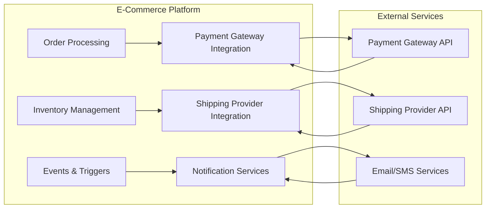
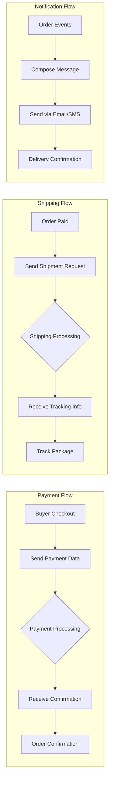

# External Integrations for E-Commerce Shopping Mall Platform

## Introduction

This document defines the external integrations required for the shopping mall platform. The platform must integrate with third-party services to process payments, manage shipping logistics, and send notifications to users. All specifications focus on business-level requirements and data flows in natural language, outlining what users experience and business operations require while technical implementation remains the responsibility of the development team.

WHEN a buyer places an order, THE system SHALL coordinate seamlessly with external payment processors, shipping providers, and notification services to ensure order fulfillment occurs reliably.

### Business Context
The shopping mall platform operates as an e-commerce marketplace where buyers purchase products from sellers. To provide a complete shopping experience, the platform must integrate with external services that handle sensitive financial transactions, package delivery, and customer communications. These integrations are critical for maintaining user trust, fulfilling orders accurately, and ensuring regulatory compliance.

IF payment processing fails during checkout, THEN the platform SHALL handle the error gracefully and allow buyers to retry with alternative methods.

### Business Justification
Integrating with established payment gateways and shipping providers reduces development risk and ensures PCI DSS compliance. WHEN a seller ships a product, THE system SHALL update tracking information automatically through provider APIs. Notification integrations enable the platform to communicate order statuses and promotions effectively, keeping users engaged and informed throughout their shopping journey.

## Payment Gateway Integration

### Business Requirements
THE system SHALL integrate with payment gateway services to enable secure online transactions for products purchased on the platform.

WHEN a buyer initiates payment during checkout, THE payment gateway SHALL validate the transaction and process the payment securely without exposing sensitive card details.

WHILE payment is being processed, THE system SHALL prevent duplicate orders and display clear progress indicators to the buyer.

### Data Exchange Specifications

**Outgoing Data (Platform to Payment Gateway):**
- Transaction amount in the local currency
- Buyer billing details including name, email, and address
- Payment method selection such as credit card, debit card, or digital wallet
- Order details featuring product SKUs and quantities
- Unique transaction reference number

WHILE preparing payment data, THE system SHALL mask card numbers and validate address formats before transmission.

**Incoming Data (Payment Gateway to Platform):**
- Payment confirmation status (success, failed, pending)
- Transaction authorization code
- Payment method used if not specified initially
- Processing timestamps
- Failure reasons if applicable

WHEN payment confirmation is received, THE system SHALL update the order status and notify the buyer immediately via email and dashboard display.

### Security Requirements
THE system SHALL transmit payment data using encrypted connections and SHALL NOT store sensitive payment information locally beyond transaction completion.

IF a payment fails due to insufficient funds, THEN THE system SHALL display a specific error message and provide options to select alternative payment methods or contact banking support.

WHILE storing payment tokens for future purchases, THE system SHALL use secure vaulting that meets industry standards to protect financial data.

### Supported Payment Methods
THE system SHALL support credit cards, debit cards, and digital wallets as primary payment options.

WHEN a buyer selects international shipping, THE system SHALL enable global payment processing with currency conversion capabilities.

THE system SHALL accommodate mobile payment options for users accessing the platform via mobile devices.

THE system SHALL introduce buy-now-pay-later options for qualified buyers to increase purchase conversion rates.

## Shipping Provider Integration

### Business Requirements
THE system SHALL integrate with shipping provider services to track orders from fulfillment to delivery, providing transparent customer experience.

WHEN an order is successfully paid, THE system SHALL submit shipping requests to the integrated provider and obtain tracking information for buyer notification.

WHILE an order is in transit, THE seller SHALL receive updates to monitor delivery performance and address potential issues.

### Data Exchange Specifications

**Outgoing Data (Platform to Shipping Provider):**
- Recipient shipping address including name and contact details
- Package weight and dimensions calculated from ordered items
- Sender address such as warehouse or pick-up location
- Service level selection such as standard, express, or overnight
- Tracking number request if not automatically provided
- Order reference for correlation

WHEN calculating shipping costs, THE system SHALL factor in package weight, destination, and selected service level to provide accurate pricing.

**Incoming Data (Shipping Provider to Platform):**
- Tracking number assignment
- Shipment status updates such as 'preparing', 'picked up', 'in transit', 'out for delivery', 'delivered'
- Estimated delivery dates and times
- Actual delivery timestamp when completed
- Signature confirmation if required
- Any delivery exceptions or issues

WHILE tracking information is updated, THE system SHALL push notifications to both buyer and seller and update the order dashboard in real-time.

### Integration Methods
THE system SHALL support API-based integrations where available, with fallback to email or CSV file exchanges for legacy providers.

WHERE real-time tracking is supported, THE platform SHALL update order status prominently on both buyer and seller dashboards.

THE system SHALL implement automated retry mechanisms for temporary API outages to ensure continuous tracking updates.

### Multi-Carrier Support
THE system SHALL accommodate multiple shipping providers based on seller preferences, delivery locations, and service levels to offer competitive shipping options.

WHEN a seller selects specific carriers, THE system SHALL configure integration settings to support their preferred shipping methods and rate structures.

IF a carrier becomes unavailable due to service disruptions, THEN THE system SHALL automatically switch to alternative carriers for affected deliveries.

## Email/SMS Notifications

### Business Requirements
THE system SHALL integrate with email and SMS services to send transactional and marketing communications to users (buyers and sellers) throughout their interactions with the platform.

WHEN key events occur in the order lifecycle, THE system SHALL automatically trigger appropriate notifications to maintain customer engagement and inform stakeholders.

WHILE a buyer shops the platform, THE system SHALL respect opt-in preferences for promotional communications to avoid unwanted messaging.

### Notification Types and Triggers

**Order-Related Notifications:**
- Order confirmation receipt sent immediately after payment
- Shipping status updates sent when status changes such as 'shipped' or 'delivered'
- Delivery confirmation sent upon successful delivery with tracking details
- Cancellation or refund notifications sent with clear reason and next steps
- Order delay notifications sent when delivery dates change significantly

WHEN a seller processes refunds, THE system SHALL automatically notify buyers with refund confirmation and expected processing timeline.

**Account and Security Notifications:**
- Registration verification sent via email to activate new accounts
- Password reset instructions delivered securely via email with temporary tokens
- Login alerts sent when accounts are accessed from new devices
- Account changes confirmed via email for security purposes

WHILE a user recovers their password, THE system SHALL send secure reset links that expire within a reasonable timeframe to prevent unauthorized access.

**Seller Notifications:**
- New order alerts delivered via SMS to enable rapid response
- Low inventory warnings sent via email with suggested restocking actions
- Payout confirmations provided electronically with detailed earnings breakdown
- Performance analytics summaries delivered weekly via email

IF a seller achieves milestones such as 'top seller' status, THEN THE system SHALL send congratulatory notifications to encourage continued performance.

### Data Exchange Specifications

**Outgoing Data (Platform to Notification Services):**
- Recipient contact information such as email address or phone number
- Message content with personalization (buyer name, order details, personalized recommendations)
- Send priority such as immediate transactional or scheduled promotional
- Template identifiers for standardized message formats
- Opt-out preferences from user profiles to respect communication choices

WHEN personalizing messages, THE system SHALL include relevant order details while respecting privacy settings and avoiding sensitive information exposure.

**Incoming Data (Notification Services to Platform):**
- Delivery confirmation status showing whether messages were successfully sent
- Failure notifications with reasons including invalid addresses or message blocks
- Bounce reports for email delivery failures with actionable error codes
- Unsubscribe confirmations to update user communication preferences

WHERE delivery failures occur, THE system SHALL log reasons and potentially pause communications to protect sender reputation.

### Template Management
THE system SHALL support customizable notification templates for different user roles and languages to accommodate diverse user preferences and regional requirements.

WHEN localizing templates for international markets, THE system SHALL adapt content appropriately while maintaining brand consistency.

THE system SHALL provide template preview capabilities for administrators to review final message appearance before deployment.

### Compliance Requirements
THE system SHALL respect user communication preferences and provide easy opt-out mechanisms for marketing communications while ensuring transactional notifications remain mandatory.

WHEN users opt out of marketing communications, THE system SHALL continue sending essential order and security-related messages to maintain proper service functioning.

THE system SHALL comply with CAN-SPAM regulations and similar international standards to avoid regulatory penalties and maintain user trust.

## External API Requirements

### Business Requirements
THE system SHALL integrate with external APIs using RESTful protocols over HTTPS for all communication to ensure security and reliability.

WHEN integrating with third-party services, THE system SHALL handle API rate limits, authentication, and error responses gracefully without service disruption.

WHERE API integrations are added, THE system SHALL document data flows in business terms for transparency and compliance.

### API Integration Standards
THE system SHALL follow industry-standard protocols for reliable and secure API communications.

WHEN making API calls, THE system SHALL include appropriate headers and authentication credentials as specified by each service provider.

IF API responses are delayed, THEN THE system SHALL cache previously valid data where appropriate to prevent user interface delays.

### Authentication Methods
THE system SHALL support OAuth 2.0 flows for secure API access where available, with API key authentication as a complement for simpler integrations.

WHEN configuring API credentials, THE system SHALL encrypt sensitive authentication information and rotate keys periodically for security.

### Error Handling and Recovery
IF an external API becomes unavailable, THE system SHALL implement retry mechanisms with exponential backoff and notify administrators through internal alerts.

WHEN API errors occur during critical processes, THE system SHALL have manual fallback procedures available for order processing or notification delivery.

THE system SHALL log all API failures with contextual information to support troubleshooting and service reliability improvements.

### Performance Expectations
THE system SHALL ensure API responses complete within 5 seconds for normal operations, with 30-second timeouts for complex requests to prevent user interface blocking.

WHEN processing bulk operations such as end-of-day settlement, THE system SHALL handle larger data volumes with extended timeouts while providing progress feedback to users.

### Monitoring and Logging
THE system SHALL maintain detailed audit logs of all external API interactions including request/response times, success rates, and error details for troubleshooting and compliance auditing.

WHILE monitoring API performance, THE system SHALL alert administrators when response times exceed configured thresholds or error rates rise above acceptable levels.

THE system SHALL provide dashboard views of integration health, including uptime metrics and response time trends for each external service.

## Security Considerations

### Data Protection
THE system SHALL encrypt all sensitive user data both at rest and in transit when transmitted to external services.

WHEN processing personal information such as addresses or payment details, THE system SHALL implement industry-standard encryption protocols.

WHILE storing API credentials for third-party services, THE system SHALL use secure vaults that limit access to authorized administrator accounts.

### Access Control
THE system SHALL limit external integration access to authorized systems only, using IP whitelisting and request signing for additional security layers.

WHEN configuring integration settings, THE system SHALL require administrator approval and service account verification.

### Audit and Compliance
THE system SHALL maintain detailed logs of all integration transactions for at least 7 years to support regulatory compliance and dispute resolution.

WHERE privacy regulations apply, THE system SHALL minimize data shared with external services to reduce exposure risk.

THE system SHALL conduct regular security assessments of integration configurations to identify and mitigate potential vulnerabilities.

## Data Flow Diagrams

## Conclusion

This document provides comprehensive business requirements for external integrations supporting payment processing, shipping logistics, and user notifications. By focusing on user experiences and business operations in natural language, the specifications enable implementations that prioritize security, reliability, and user satisfaction. Related technical documents should be consulted for detailed integration protocols and API specifications.

> *Developer Note: This document defines **business requirements only**. All technical implementations (specific API endpoints, authentication protocols, data schemas, etc.) are at the discretion of the development team.*