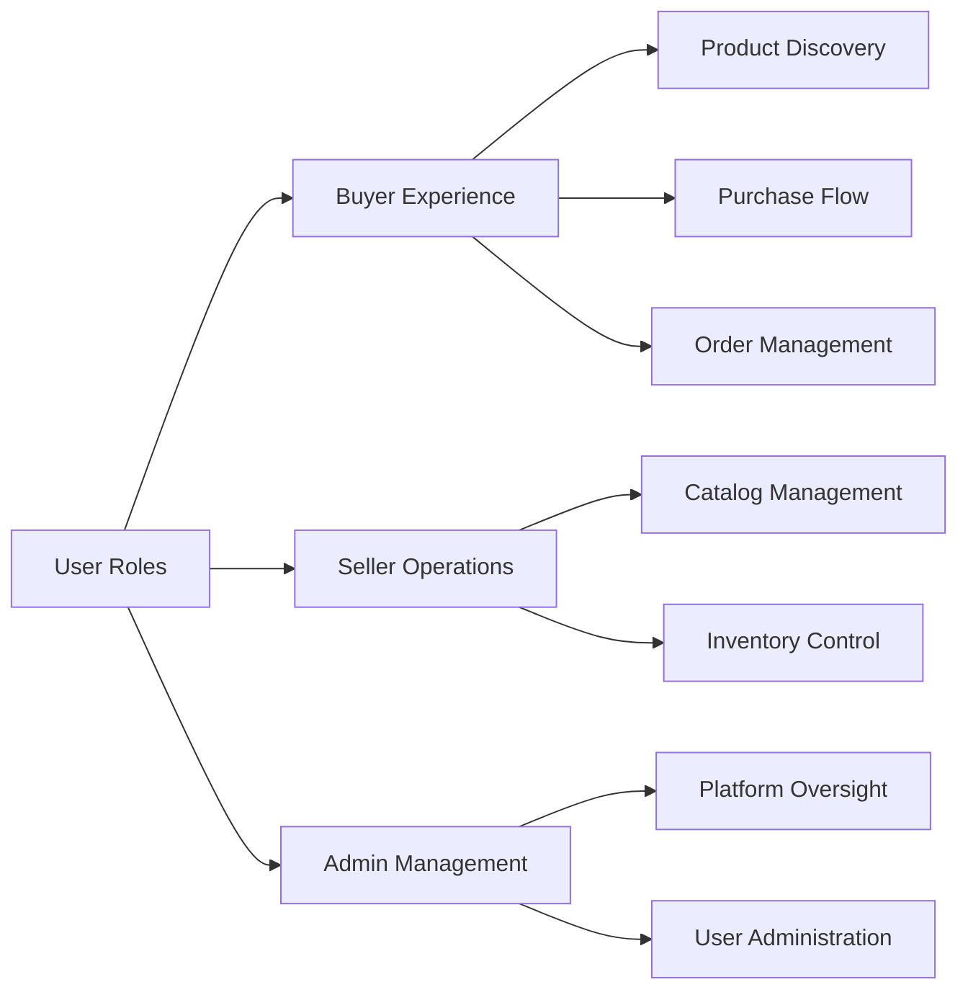
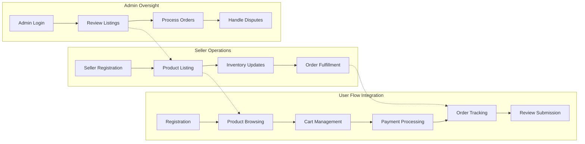

# Core Features and Business Requirements

## Introduction

This document outlines the core features and business requirements for the e-commerce shopping mall platform (service prefix: shoppingPlatform). It specifies the functional requirements that must be implemented to support the platform's business operations. All requirements are expressed in natural language using the EARS (Easy Approach to Requirements Syntax) format where applicable, focusing exclusively on business logic and user needs rather than technical implementation details.

The platform supports three primary user roles as defined in the user roles documentation:
- Buyers: Authenticated users who browse, purchase, and track orders
- Sellers: Authenticated users who manage product listings and inventory
- Admins: System administrators with oversight of platform operations

These requirements build upon the user journeys defined in the related [User Journey Documentation](./03-user-journeys.md).

## Overall System Architecture

The system architecture is designed to support a marketplace where multiple sellers offer products to buyers, with administration oversight. The platform consists of interconnected modules for user management, product catalog management, order processing, and administrative functions.

This diagram illustrates the high-level relationships between different user roles and platform modules.

## Core Business Requirements

### User Registration and Address Management

THE system SHALL support new user registration requiring email address and password.

THE system SHALL send email verification after successful registration.

THE system SHALL allow users to maintain multiple delivery addresses.

THE system SHALL validate email format and password strength during registration.

WHEN a user registers, THE system SHALL check for duplicate email addresses.

WHEN a user provides invalid registration data, THEN THE system SHALL display specific error messages such as "Email format invalid" or "Password too weak - must contain uppercase, lowercase, and number".

WHILE a user is logged in, THE system SHALL remember their default delivery address for order checkout.

THE system SHALL allow users to add, edit, and delete delivery addresses from their profile.

WHEN a user adds a new address, THE system SHALL validate required fields including street address, city, state/province, postal code, and country.

IF address validation fails, THEN THE system SHALL display specific error messages and highlight the fields that need correction.

THE system SHALL support international address formats for global shipping.

### Product Catalog and Search

THE system SHALL display products organized in hierarchical categories (e.g., Electronics > Smartphones > Android).

THE system SHALL support full-text search across product names, descriptions, and category names.

WHEN a user performs a search, THE system SHALL return results ranked by relevance within 1 second.

THE system SHALL allow filtering products by category, price range (e.g., $0-$50, $50-$200), brand, color, size, and availability.

THE system SHALL display product listings with thumbnail images, current prices, and average ratings.

WHILE browsing categories, THE system SHALL show subcategories with product counts (e.g., "Smartphones (152 products)").

THE system SHALL support sorting options including price low-to-high, rating high-to-low, newest arrivals, and popularity.

WHEN no search results are found, THE system SHALL display suggested alternative searches and popular products.

THE system SHALL provide search suggestions as users type queries.

### Product Variants and SKU Management

THE system SHALL support product variants with different attributes like color ("Red", "Blue"), size ("Small", "Medium", "Large"), style ("Modern", "Classic"), and material ("Cotton", "Polyester").

EACH product variant SHALL have a unique SKU identifier for inventory tracking.

WHEN creating a variant, THE system SHALL require specification of all applicable attribute combinations.

THE system SHALL prevent duplicate SKUs across the entire platform.

THE system SHALL display variant options on product detail pages with visual swatches or dropdown selections.

WHEN a variant is out of stock, THE system SHALL indicate unavailability clearly with "Out of Stock" text and grayed-out options.

THE system SHALL maintain separate pricing for different variants when applicable (e.g., larger sizes costing more).

THE system SHALL allow sellers to set variant-specific inventory levels and pricing.

### Shopping Cart and Wishlist

THE system SHALL allow adding products to a shopping cart with quantity selection up to available inventory.

WHEN adding to cart, THE system SHALL check current inventory availability and prevent overselling.

THE system SHALL persist cart contents across user sessions for up to 7 days.

THE system SHALL support multiple products in cart with different variant selections.

WHEN updating cart quantities, THE system SHALL recalculate subtotals, taxes, and shipping estimates automatically.

THE system SHALL provide a cart summary showing subtotal before tax, estimated tax, shipping costs, and grand total.

THE system SHALL allow removing items from cart with confirmation for accidental deletions.

THE system SHALL allow saving products to a wishlist without affecting inventory reservations.

WHEN a wishlisted item becomes available after being out of stock, THE system SHALL send email notifications if the user subscribes to such notifications.

THE system SHALL allow moving items between cart and wishlist.

### Order Placement and Payment Processing

WHEN a user initiates checkout, THE system SHALL validate that the user is authenticated and the cart contains at least one item.

THE system SHALL calculate order total including item prices, applicable taxes based on shipping address, and shipping costs based on weight and destination.

THE system SHALL integrate with payment gateways for processing credit cards, debit cards, and digital wallets.

WHEN payment processing is successful, THE system SHALL create an order record with unique order number.

IF payment fails due to insufficient funds, THEN THE system SHALL display "Payment declined - please check your account balance" without exposing card details.

THE system SHALL generate order numbers following the format "ORD-YYYYMMDD-NNNNNN".

WHILE processing payment, THE system SHALL reserve inventory temporarily to prevent overselling during checkout.

THE system SHALL allow users to apply promo codes or coupons with validation of expiration and usage limits.

### Order Tracking and Shipping Status Updates

THE system SHALL display complete order history for authenticated buyers including order date, items, status, and tracking information.

EACH order SHALL have a tracking number linked to the shipping provider API.

WHEN shipping providers update status (e.g., "Shipped", "In Transit", "Delivered"), THE system SHALL update order records within 15 minutes.

THE system SHALL send email notifications for major order status changes such as shipped and delivered.

WHEN a buyer views order details, THE system SHALL show estimated delivery dates and current status messages.

THE system SHALL support multiple shipping carriers with options for standard (3-5 days), expedited (1-2 days), and overnight delivery.

THE system SHALL allow buyers to request delivery confirmations and provide feedback on shipping experience.

### Product Reviews and Ratings

THE system SHALL allow verified buyers (those who have completed orders) to submit product reviews after receiving items.

EACH review SHALL include a 1-5 star rating and optional text comments up to 2000 characters.

THE system SHALL display average ratings (e.g., "4.2 out of 5 stars") on product listing pages.

WHEN displaying reviews, THE system SHALL show only reviews from buyers who actually received the products.

THE system SHALL allow other buyers to mark reviews as helpful or report inappropriate content.

IF a review contains inappropriate content flagged by multiple users, THEN THE system SHALL allow admin moderation including hiding or removing reviews.

THE system SHALL prevent duplicate reviews from the same buyer for the same product.

THE system SHALL display review images if buyers upload photos (up to 5 images per review).

### Seller Accounts and Product Management

WHEN a seller registers, THE system SHALL require business information including company name, tax ID, bank account, and verification documents.

THE system SHALL provide sellers with dedicated dashboards showing sales analytics and current listings.

SELLERS SHALL manage their product catalogs independently including adding, editing, and removing products.

WHEN a seller adds products, THE system SHALL validate required fields: name, description, category, and initial pricing.

THE system SHALL allow sellers to manage variant configurations with SKU assignments and pricing.

SELLERS SHALL view real-time sales performance metrics including revenue, units sold, and conversion rates.

THE system SHALL notify sellers by email and dashboard alerts when orders are placed.

### Inventory Management per SKU

THE system SHALL track inventory levels separately for each SKU including available, reserved, and sold quantities.

WHEN inventory for a SKU reaches low levels (seller-configured threshold, e.g., 5 units), THE system SHALL send automated notifications to the seller.

THE system SHALL prevent order completion if inventory becomes insufficient during checkout process.

SELLERS SHALL update inventory quantities through bulk uploads or individual SKU editing.

THE system SHALL support low-stock alerts and out-of-stock notifications to buyers during product browsing.

WHEN inventory changes (e.g., new stock arrives), THE system SHALL update product availability status across all search results and listings immediately.

### Order History and Cancellation/Refund Requests

THE system SHALL maintain complete order history for all users including transaction details, shipping information, and status changes.

WHEN an order is placed, THE system SHALL record full details including buyer information, seller allocations, payment methods, and timelines.

USERS SHALL cancel orders within 24 hours of placement if not yet shipped.

THE system SHALL support refund requests with reasons like "Item damaged", "Wrong item received", or "Changed mind".

WHEN processing refunds, THE system SHALL calculate refund amounts minus any applicable fees and process reversals through payment gateways.

ADMIN SHALL have oversight capabilities to review and approve/deny cancellation and refund requests.

THE system SHALL send email confirmations for all order modifications including cancellations and refunds.

### Admin Dashboard for Order and Product Management

THE system SHALL provide comprehensive admin dashboards displaying platform-wide metrics including total orders, active users, and sales volume.

WHEN admins access order management, THE system SHALL allow viewing all orders by status, date range, seller, or buyer.

ADMIN SHALL modify order statuses and intervene in disputes such as order cancellations or payment issues.

THE system SHALL enable bulk product management including approving new listings, hiding violations, and category management.

WHILE monitoring user activity, THE system SHALL flag suspicious behavior like multiple failed payments or unusual order patterns.

THE system SHALL provide analytics reporting including top-selling products, seller performance rankings, and revenue trends.

ADMIN SHALL manage platform settings including commission rates, shipping options, and user policies.

## Feature Interactions

The features interact in several key ways to create a seamless e-commerce experience:

This diagram shows how buyer shopping flows integrate with seller inventory management and admin oversight functions. For example, when a seller updates inventory (I), it immediately affects product availability in buyer browsing (B). Admin reviews of seller listings (L) ensure products meet platform standards before appearing in buyer searches.

## Business Processes and Workflows

### Purchase Process Workflow

WHEN a buyer completes registration and authentication, THE buyer SHALL browse the product catalog using search and filtering capabilities. WHEN products are added to cart with valid variant selections, THE system SHALL check inventory availability and reserve items temporarily. WHEN checkout is initiated, THE system SHALL calculate totals, validate payment information, and process the transaction. WHEN payment succeeds, THE system SHALL create orders, notify sellers, and provide tracking capabilities to buyers.

### Seller Onboarding Workflow

WHEN a business registers as a seller, THE system SHALL collect verification documents and business information. WHEN verification is complete, THE system SHALL activate seller accounts with dashboard access. WHEN sellers create products with variants and SKUs, THE system SHALL validate uniqueness and publish to the catalog. WHEN orders arrive, THE system SHALL notify sellers and provide fulfillment tools.

### Admin Moderation Workflow

WHEN admins access the dashboard, THE system SHALL display pending tasks including new seller verifications and flagged content. WHEN reviewing seller applications, THE system SHALL provide tools for approval or rejection with detailed feedback. WHEN monitoring product listings, THE system SHALL enable bulk actions for compliance enforcement.

## Success Criteria

The platform SHALL be considered successful when:
- 95% of registered users complete at least one purchase within 30 days
- Average order processing time is under 5 minutes during peak hours
- 99% order accuracy with no inventory discrepancies reported
- Customer satisfaction rating above 4.5 out of 5 stars on post-purchase surveys
- Seller onboarding time reduced to under 2 business days after document submission
- System handles 1,000 concurrent users without performance degradation exceed 10% slowdown
- Average session duration exceeds 5 minutes during first month of platform operation
- Mobile user conversion rate matches desktop performance within 15% variance

## Assumptions and Dependencies

This document assumes:
- Third-party payment gateways support secure API integrations as detailed in the [External Integrations Documentation](./07-external-integrations.md)
- Shipping providers offer real-time tracking APIs with webhook notifications
- Email notification services maintain 99.9% delivery success rate
- Database systems support the transaction volumes described in [Performance Expectations](./08-performance-expectations.md)
- Legal compliance requirements are met as specified in [Security Compliance Documentation](./09-security-compliance.md)
- User roles and authentication patterns follow the system defined in [User Roles Documentation](./02-user-roles.md)

## Data Validation and Error Handling Scenarios

### Scenario 1: Invalid Product Search
WHEN a buyer enters an invalid search term containing special characters not supported in the search algorithm, THEN THE system SHALL sanitize the input and perform a search on valid keywords only, WHILE showing a warning message "Some search terms were ignored due to invalid characters."

### Scenario 2: Inventory Synchronization Issue
IF a seller updates inventory while a buyer is in checkout, THEN THE system SHALL check inventory one final time before payment processing, AND IF insufficient, cancel the checkout with a message "Unfortunately, the last item you were purchasing is no longer available. Please update your cart."

### Scenario 3: Payment Timeout
WHEN payment processing exceeds 30 seconds, THEN THE system SHALL display a progress indicator and prevent duplicate transaction attempts, AND IF timeout occurs, allow retry with the same or different payment method.

These scenarios illustrate how the system handles common edge cases while maintaining positive user experience.